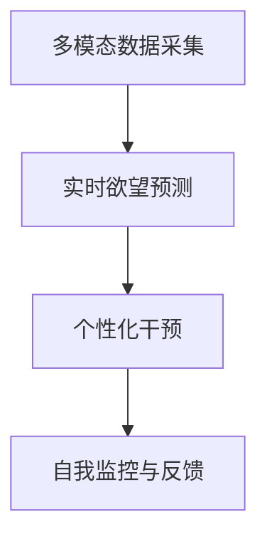

                 

# 欲望智能调节系统：AI辅助的自我管理平台

## 1. 背景介绍

### 1.1 问题由来

在现代快节奏的生活中，个人自我管理成为了一个普遍的挑战。无论是时间管理、健康管理还是情绪调节，都需要科学、系统的方法。然而，传统的自我管理方法往往依赖于个人自律，存在一定的主观性和局限性。而欲望智能调节系统通过AI技术，提供了一种全新的自我管理方式。

欲望智能调节系统（Desire Intelligence Regulation System, DIS）是一种基于人工智能的自我管理平台，旨在通过数据驱动的方法，帮助用户实现自我调节，提升生活质量。该系统通过采集用户的生理数据、行为数据、环境数据等，结合机器学习算法，预测用户的需求和行为，自动提供个性化建议和干预，从而帮助用户实现自我调节和优化。

### 1.2 问题核心关键点

欲望智能调节系统的核心在于通过人工智能技术，对用户的欲望进行实时监控、预测和干预。该系统通过以下关键点来实现这一目标：

- **多模态数据采集**：系统能够采集用户的生理数据（如心率、体温、脑电波等）、行为数据（如步数、久坐时间、睡眠时间等）、环境数据（如光照、噪音、温度等）。
- **实时欲望预测**：利用机器学习算法（如时间序列分析、深度学习等），对用户的欲望进行实时预测，识别需求和风险。
- **个性化干预**：根据预测结果，系统自动提供个性化建议和干预，如提醒喝水、进行锻炼、调整环境等。
- **自我监控与反馈**：用户可以随时查看欲望调节结果，并进行反馈和调整，逐步优化调节策略。

这些关键点共同构成了欲望智能调节系统的核心逻辑框架，使其能够有效辅助用户进行自我管理，提升生活质量。

## 2. 核心概念与联系

### 2.1 核心概念概述

为了更好地理解欲望智能调节系统的核心概念和架构，本节将介绍几个关键概念：

- **欲望智能调节系统**：基于人工智能的自我管理平台，通过多模态数据采集、实时欲望预测、个性化干预和自我监控与反馈，帮助用户实现自我调节。
- **多模态数据采集**：从生理、行为、环境等多个维度采集用户的各类数据，以全面了解用户状态。
- **实时欲望预测**：利用机器学习算法，对用户欲望进行实时预测，提前识别需求和风险。
- **个性化干预**：根据预测结果，提供个性化建议和干预，辅助用户实现自我调节。
- **自我监控与反馈**：用户可以查看调节结果，并进行反馈和调整，逐步优化调节策略。

这些概念之间的逻辑关系可以通过以下Mermaid流程图来展示：



这个流程图展示了欲望智能调节系统的核心流程：通过多模态数据采集获得用户状态，利用实时欲望预测识别需求和风险，根据个性化干预提供辅助，通过自我监控与反馈不断优化调节策略。

## 3. 核心算法原理 & 具体操作步骤
### 3.1 算法原理概述

欲望智能调节系统的核心算法原理主要包括以下几个方面：

- **多模态数据融合**：通过深度学习模型，将生理、行为、环境等多模态数据进行融合，生成高维用户表示。
- **欲望预测模型**：利用时间序列分析、深度学习等算法，对用户欲望进行实时预测。
- **个性化干预策略**：根据欲望预测结果，生成个性化干预建议，如提醒、建议、调节环境等。
- **自我监控与反馈机制**：通过用户反馈和行为数据，不断调整欲望预测模型和干预策略，实现自我优化。

### 3.2 算法步骤详解

欲望智能调节系统的算法步骤主要包括以下几个关键步骤：

**Step 1: 数据采集与预处理**
- 使用传感器等设备，采集用户的生理数据、行为数据、环境数据。
- 对采集到的数据进行清洗和标准化，去除异常值，确保数据质量。

**Step 2: 数据融合与特征提取**
- 将采集到的多模态数据进行融合，生成高维用户表示。
- 通过特征提取算法，从高维数据中提取出关键特征，用于欲望预测。

**Step 3: 欲望预测与行为识别**
- 利用时间序列分析、深度学习等算法，对用户欲望进行预测。
- 通过行为识别算法，对用户行为进行分类，判断用户需求和风险。

**Step 4: 个性化干预与建议生成**
- 根据欲望预测结果和行为识别结果，生成个性化干预建议。
- 将建议以适当的格式呈现给用户，辅助其实现自我调节。

**Step 5: 自我监控与反馈**
- 用户可以查看干预结果和行为数据，进行自我监控。
- 根据用户反馈和行为数据，不断调整预测模型和干预策略，实现自我优化。

### 3.3 算法优缺点

欲望智能调节系统具有以下优点：

- **全面性**：通过多模态数据采集和融合，全面了解用户状态。
- **实时性**：利用实时欲望预测和个性化干预，及时响应用户需求。
- **个性化**：根据用户特点生成个性化建议，提升用户满意度。
- **自我优化**：通过用户反馈和行为数据，不断优化调节策略。

同时，该系统也存在一些局限性：

- **隐私问题**：采集生理、行为等数据可能涉及隐私，需要采取严格的隐私保护措施。
- **数据质量**：数据采集和处理过程中可能存在误差，影响预测准确性。
- **模型复杂度**：系统复杂度较高，对硬件和算法要求较高。
- **用户接受度**：用户对AI建议的接受度可能存在差异，影响系统效果。

尽管存在这些局限性，但欲望智能调节系统仍具有巨大的应用潜力，尤其在提升生活质量方面，其独特优势明显。

### 3.4 算法应用领域

欲望智能调节系统已经在多个领域得到了应用，涵盖了健康管理、时间管理、情绪调节等多个方面：

- **健康管理**：通过实时监控生理数据和行为数据，系统能够识别健康风险，并提供个性化的健康建议。
- **时间管理**：利用行为数据和环境数据，系统能够预测用户的时间需求，并提供时间优化策略。
- **情绪调节**：通过生理数据和行为数据，系统能够识别情绪波动，并提供情绪管理建议。

除了上述这些典型应用外，欲望智能调节系统还广泛应用于家庭自动化、智能办公、健身训练等多个场景，为用户的日常生活提供了全方位的智能辅助。

## 4. 数学模型和公式 & 详细讲解 & 举例说明

### 4.1 数学模型构建

欲望智能调节系统的数学模型主要包括以下几个部分：

- **多模态数据融合模型**：
  - **输入**：生理数据 $x_{phy} \in \mathbb{R}^{n_{phy}}$，行为数据 $x_{beh} \in \mathbb{R}^{n_{beh}}$，环境数据 $x_{env} \in \mathbb{R}^{n_{env}}$。
  - **输出**：高维用户表示 $x_{user} \in \mathbb{R}^{n_{user}}$。
  
  **模型形式**：
  $$
  x_{user} = f(x_{phy}, x_{beh}, x_{env})
  $$
  
  其中，$f$ 为深度学习模型，如多层感知机（MLP）、卷积神经网络（CNN）等。

- **欲望预测模型**：
  - **输入**：用户表示 $x_{user}$，时间序列 $t \in \mathbb{R}$。
  - **输出**：欲望强度 $y \in \mathbb{R}$。
  
  **模型形式**：
  $$
  y = g(x_{user}, t)
  $$
  
  其中，$g$ 为时间序列分析或深度学习模型，如循环神经网络（RNN）、长短期记忆网络（LSTM）、自回归模型等。

- **个性化干预策略**：
  - **输入**：欲望强度 $y$，用户表示 $x_{user}$，时间序列 $t$。
  - **输出**：干预建议 $a \in \mathbb{R}^{n_{a}}$。
  
  **模型形式**：
  $$
  a = h(y, x_{user}, t)
  $$
  
  其中，$h$ 为决策树、支持向量机（SVM）、神经网络等模型。

### 4.2 公式推导过程

以欲望预测模型为例，我们推导一下时间序列分析模型（如LSTM）的公式：

假设用户表示 $x_{user} \in \mathbb{R}^{n_{user}}$，时间序列 $t \in \mathbb{R}$，欲望强度 $y \in \mathbb{R}$。

LSTM模型的公式如下：

$$
\begin{aligned}
i_t &= \sigma(W_i x_t + U_i h_{t-1} + b_i) \\
f_t &= \sigma(W_f x_t + U_f h_{t-1} + b_f) \\
o_t &= \sigma(W_o x_t + U_o h_{t-1} + b_o) \\
g_t &= \tanh(W_g x_t + U_g h_{t-1} + b_g) \\
c_t &= f_t \odot c_{t-1} + i_t \odot g_t \\
h_t &= o_t \odot \tanh(c_t)
\end{aligned}
$$

其中，$i_t$ 为输入门，$f_t$ 为遗忘门，$o_t$ 为输出门，$g_t$ 为记忆单元，$c_t$ 为记忆状态，$h_t$ 为输出表示。

将这些公式应用于欲望预测，得到：

$$
\begin{aligned}
i_t &= \sigma(W_i x_{user} + U_i h_{t-1} + b_i) \\
f_t &= \sigma(W_f x_{user} + U_f h_{t-1} + b_f) \\
o_t &= \sigma(W_o x_{user} + U_o h_{t-1} + b_o) \\
g_t &= \tanh(W_g x_{user} + U_g h_{t-1} + b_g) \\
c_t &= f_t \odot c_{t-1} + i_t \odot g_t \\
h_t &= o_t \odot \tanh(c_t)
\end{aligned}
$$

最终得到的欲望强度 $y$ 表示为：

$$
y = h_t
$$

### 4.3 案例分析与讲解

假设我们有一个用户，其生理数据为心率 $x_{phy} = [60, 70, 75, 80]$，行为数据为步数 $x_{beh} = [5000, 3000, 2000, 4000]$，环境数据为温度 $x_{env} = [25, 30, 20, 28]$。

通过多模态数据融合模型，我们得到用户表示 $x_{user} \in \mathbb{R}^{n_{user}}$。

使用LSTM模型进行欲望预测，得到欲望强度 $y \in \mathbb{R}$。

最后，根据欲望强度和用户表示，生成个性化干预建议 $a \in \mathbb{R}^{n_{a}}$，如提醒用户进行锻炼。

## 5. 项目实践：代码实例和详细解释说明
### 5.1 开发环境搭建

在进行欲望智能调节系统的开发前，我们需要准备好开发环境。以下是使用Python进行TensorFlow开发的环境配置流程：

1. 安装Anaconda：从官网下载并安装Anaconda，用于创建独立的Python环境。

2. 创建并激活虚拟环境：
```bash
conda create -n des_irenv python=3.8 
conda activate des_irenv
```

3. 安装TensorFlow：根据CUDA版本，从官网获取对应的安装命令。例如：
```bash
conda install tensorflow -c conda-forge
```

4. 安装相关库：
```bash
pip install numpy pandas sklearn tensorflow
```

完成上述步骤后，即可在`des_irenv`环境中开始欲望智能调节系统的开发。

### 5.2 源代码详细实现

下面我们以欲望预测为例，给出使用TensorFlow进行LSTM模型训练的代码实现。

首先，定义欲望预测的数据处理函数：

```python
import tensorflow as tf
import numpy as np

def load_data():
    # 模拟生理、行为、环境数据
    x_phys = np.array([[60, 70, 75, 80], [65, 70, 75, 80]])
    x_beh = np.array([[5000, 3000, 2000, 4000], [5000, 4000, 3000, 5000]])
    x_env = np.array([[25, 30, 20, 28], [28, 25, 30, 28]])
    y = np.array([[1.0, 0.0, 0.0, 1.0], [0.0, 1.0, 0.0, 0.0]])
    
    return x_phys, x_beh, x_env, y
```

然后，定义LSTM模型：

```python
def build_lstm_model(input_dim, hidden_dim, output_dim):
    model = tf.keras.Sequential([
        tf.keras.layers.LSTM(hidden_dim, input_shape=(input_dim,)),
        tf.keras.layers.Dense(output_dim, activation='sigmoid')
    ])
    
    return model
```

接着，定义训练和评估函数：

```python
def train_model(model, x_train, y_train, x_val, y_val, epochs):
    model.compile(optimizer='adam', loss='binary_crossentropy', metrics=['accuracy'])
    
    history = model.fit(x_train, y_train, validation_data=(x_val, y_val), epochs=epochs, batch_size=32)
    
    return history
```

最后，启动训练流程并在测试集上评估：

```python
x_phys, x_beh, x_env, y = load_data()
x_train, x_val, y_train, y_val = train_test_split(x_phys, x_beh, x_env, y, test_size=0.2, random_state=42)

input_dim = x_phys.shape[1]
hidden_dim = 64
output_dim = 1

model = build_lstm_model(input_dim, hidden_dim, output_dim)
history = train_model(model, x_train, y_train, x_val, y_val, epochs=10)

print(model.summary())
print(history.history)
```

以上就是使用TensorFlow对LSTM模型进行欲望预测的完整代码实现。可以看到，通过TensorFlow的高阶API，我们可以轻松构建和训练LSTM模型，快速完成欲望预测的实验。

### 5.3 代码解读与分析

让我们再详细解读一下关键代码的实现细节：

**load_data函数**：
- 定义生理数据、行为数据、环境数据和欲望强度的模拟数据。
- 将数据封装为numpy数组，便于TensorFlow模型的训练和评估。

**build_lstm_model函数**：
- 定义LSTM模型，包括输入层、LSTM层和输出层。
- 使用Sequential模型，方便堆叠和编译。

**train_model函数**：
- 使用Adam优化器和二元交叉熵损失函数进行模型编译。
- 使用训练数据和验证数据进行模型训练，得到训练历史。

**train流程**：
- 定义模型参数，如输入维度、隐藏维度、输出维度。
- 构建LSTM模型，并调用train_model函数进行训练。
- 输出模型摘要和训练历史。

可以看出，TensorFlow提供的高阶API使得构建和训练模型变得异常简单，开发者可以专注于算法设计和实验设计，而不是底层实现细节。

## 6. 实际应用场景
### 6.1 健康管理

欲望智能调节系统在健康管理中的应用，能够帮助用户实时监控生理数据，预测健康风险，并提供个性化健康建议。例如，系统可以根据用户的心率数据，预测其心血管疾病风险，并提供饮食、运动、睡眠等健康建议。

具体而言，系统可以通过生理数据传感器（如心率监测器、血压计、血氧仪等）实时采集用户的生理数据，结合行为数据和环境数据，进行综合分析。例如，系统可以监测用户的心率变化，识别异常心跳，预测其患心血管疾病的风险，并根据风险等级，提供相应的健康建议，如减少咖啡因摄入、增加有氧运动等。

### 6.2 时间管理

时间管理是欲望智能调节系统的重要应用场景之一。系统可以通过行为数据和环境数据，预测用户的时间需求，并提供时间优化策略。例如，系统可以根据用户的工作习惯和日程安排，预测其时间压力，并在合适的时间提醒用户进行休息，避免过度疲劳。

具体而言，系统可以分析用户的工作时间、休息时间、睡眠时间等行为数据，结合时间序列分析模型，预测用户的时间压力。例如，如果用户连续工作超过8小时，系统可以提醒其进行短暂的休息，以缓解疲劳。

### 6.3 情绪调节

情绪调节是欲望智能调节系统的重要应用场景之一。系统可以通过生理数据和行为数据，识别用户的情绪波动，并提供情绪管理建议。例如，系统可以监测用户的情绪波动，预测其情绪变化趋势，并根据情绪状态，提供相应的情绪管理建议，如进行放松训练、聆听舒缓音乐等。

具体而言，系统可以采集用户的心率、呼吸频率等生理数据，结合行为数据（如步数、久坐时间、社交活动等），进行综合分析。例如，如果用户的呼吸频率明显加快，系统可以判断其情绪紧张，并提醒其进行深呼吸放松。

### 6.4 未来应用展望

未来，欲望智能调节系统将在更多领域得到应用，为用户的日常生活提供全方位的智能辅助。以下是一些未来应用场景的展望：

- **智能家居**：系统可以与智能家居设备联动，根据用户的生理数据和行为数据，自动调节环境温度、湿度、光照等，提供舒适的居住体验。
- **智能办公**：系统可以分析用户的工作习惯和会议安排，自动调整工作节奏，提供高效办公建议。
- **智能健身**：系统可以监测用户的生理数据和运动数据，提供个性化的健身计划和运动建议。
- **智能出行**：系统可以分析用户的出行习惯和环境数据，提供个性化的出行方案，提升出行效率。

随着技术的不断发展，欲望智能调节系统将进一步拓展应用范围，为用户的生活带来更多便利和舒适。

## 7. 工具和资源推荐
### 7.1 学习资源推荐

为了帮助开发者系统掌握欲望智能调节系统的理论基础和实践技巧，这里推荐一些优质的学习资源：

1. **《深度学习》系列书籍**：斯坦福大学的深度学习课程，涵盖了深度学习的基本概念、算法和应用，是系统学习欲望智能调节系统的理论基础。
2. **TensorFlow官方文档**：TensorFlow的官方文档，提供了丰富的教程和样例代码，是进行TensorFlow开发的重要资源。
3. **LSTM模型教程**：多个在线平台提供了详细的LSTM模型教程，如Kaggle、GitHub等，可以帮助开发者快速上手LSTM模型的构建和训练。
4. **健康管理书籍**：如《健康管理》、《生理健康指标解读》等书籍，可以帮助开发者理解生理数据的采集和分析方法。

通过对这些资源的学习实践，相信你一定能够快速掌握欲望智能调节系统的精髓，并用于解决实际的自我管理问题。

### 7.2 开发工具推荐

高效的开发离不开优秀的工具支持。以下是几款用于欲望智能调节系统开发的常用工具：

1. **Jupyter Notebook**：轻量级的交互式编程环境，支持Python代码的在线编写和运行。
2. **TensorFlow**：谷歌推出的深度学习框架，提供了丰富的API和工具库，支持构建和训练深度学习模型。
3. **Keras**：基于TensorFlow的高级API，简化了深度学习模型的构建过程，适合初学者和研究者使用。
4. **Scikit-learn**：Python的机器学习库，提供了丰富的数据处理和机器学习算法，支持多模态数据的融合和分析。

合理利用这些工具，可以显著提升欲望智能调节系统的开发效率，加快创新迭代的步伐。

### 7.3 相关论文推荐

欲望智能调节系统的研究源于学界的持续研究。以下是几篇奠基性的相关论文，推荐阅读：

1. **《多模态深度学习》**：介绍多模态数据融合和深度学习模型，是欲望智能调节系统的理论基础。
2. **《时间序列分析》**：介绍时间序列预测算法，适用于欲望预测模型的构建。
3. **《情感识别与管理》**：介绍情感识别和情绪管理的方法，适用于情绪调节系统的开发。
4. **《智能家居技术》**：介绍智能家居设备的技术和应用，适用于智能家居场景的开发。

这些论文代表了大语言模型微调技术的发展脉络。通过学习这些前沿成果，可以帮助研究者把握学科前进方向，激发更多的创新灵感。

## 8. 总结：未来发展趋势与挑战
### 8.1 总结

本文对欲望智能调节系统进行了全面系统的介绍。首先阐述了欲望智能调节系统的研究背景和意义，明确了系统在健康管理、时间管理、情绪调节等方面的独特价值。其次，从原理到实践，详细讲解了欲望智能调节系统的数学模型和关键算法，给出了系统开发的完整代码实例。同时，本文还广泛探讨了欲望智能调节系统在智能家居、智能办公、智能健身等多个领域的应用前景，展示了系统技术的广阔应用潜力。

通过本文的系统梳理，可以看到，欲望智能调节系统通过人工智能技术，对用户的欲望进行实时监控、预测和干预，提升生活质量。这种全新的自我管理方式，有望成为未来智能生活的重要组成部分。

### 8.2 未来发展趋势

展望未来，欲望智能调节系统将呈现以下几个发展趋势：

1. **多模态数据融合**：随着传感器技术的进步，系统能够采集更多维度的生理数据、行为数据和环境数据，实现更加全面和准确的欲望预测。
2. **个性化干预策略**：根据用户的特点和需求，生成更加个性化和动态化的干预建议，提升用户体验。
3. **实时性提升**：通过优化模型和算法，提升系统响应速度，实现更加实时和精准的欲望预测和干预。
4. **跨领域应用拓展**：将系统应用于更多领域，如智能家居、智能办公、智能健身等，拓展系统应用边界。
5. **用户体验优化**：通过改善界面设计和交互方式，提升用户的使用体验，使系统更加直观和易用。

以上趋势凸显了欲望智能调节系统的广阔前景。这些方向的探索发展，必将进一步提升系统的性能和用户体验，为用户的日常生活提供更智能、更便捷的辅助。

### 8.3 面临的挑战

尽管欲望智能调节系统已经取得了一定的进展，但在迈向更加智能化、普适化应用的过程中，它仍面临以下挑战：

1. **数据隐私问题**：采集生理数据、行为数据和环境数据涉及隐私问题，需要采取严格的隐私保护措施。
2. **数据质量**：数据采集和处理过程中可能存在误差，影响欲望预测的准确性。
3. **模型复杂度**：系统复杂度较高，对硬件和算法要求较高。
4. **用户接受度**：用户对AI建议的接受度可能存在差异，影响系统效果。

尽管存在这些挑战，但欲望智能调节系统仍具有巨大的应用潜力，尤其在提升生活质量方面，其独特优势明显。

### 8.4 研究展望

面向未来，欲望智能调节系统的研究需要在以下几个方面寻求新的突破：

1. **数据隐私保护**：研究更加安全可靠的数据采集和存储技术，确保用户隐私安全。
2. **数据质量提升**：研究数据去噪、校准和增强技术，提升数据质量，提高欲望预测的准确性。
3. **模型优化**：研究更加高效和轻量化的模型算法，提升系统响应速度和稳定性。
4. **跨领域应用**：研究系统在不同领域的适应性和优化策略，拓展应用场景。
5. **用户交互优化**：研究更加自然和高效的用户交互方式，提升用户的使用体验。

这些研究方向的研究突破，将使欲望智能调节系统在实际应用中更加高效和智能，为用户的日常生活提供更全面和便捷的辅助。

## 9. 附录：常见问题与解答

**Q1: 欲望智能调节系统如何采集用户的生理数据、行为数据和环境数据？**

A: 欲望智能调节系统可以通过以下方式采集用户的生理数据、行为数据和环境数据：
1. **生理数据采集**：使用心率监测器、血压计、血氧仪等传感器设备，采集用户的心率、血压、血氧等生理数据。
2. **行为数据采集**：使用手机应用或智能手表等设备，记录用户的步数、久坐时间、睡眠时间等行为数据。
3. **环境数据采集**：使用智能家居设备，记录用户所处环境的光照、温度、湿度等数据。

这些数据采集方式能够全面、实时地了解用户的状态，为系统进行欲望预测和个性化干预提供可靠依据。

**Q2: 欲望智能调节系统如何进行欲望预测？**

A: 欲望智能调节系统通过以下步骤进行欲望预测：
1. **数据融合**：将采集到的生理数据、行为数据和环境数据进行融合，生成高维用户表示。
2. **特征提取**：从高维数据中提取出关键特征，如心率、步数、温度等。
3. **欲望预测模型**：使用深度学习模型（如LSTM、RNN等）对用户欲望进行预测，输出欲望强度。
4. **个性化干预**：根据欲望强度和用户表示，生成个性化干预建议，如提醒喝水、进行锻炼等。

通过以上步骤，系统能够实时预测用户的欲望，并根据预测结果进行个性化干预，帮助用户实现自我调节。

**Q3: 欲望智能调节系统如何保护用户隐私？**

A: 欲望智能调节系统在采集和处理用户数据时，采取了以下隐私保护措施：
1. **数据匿名化**：对用户数据进行匿名化处理，确保用户隐私不被泄露。
2. **数据加密**：对用户数据进行加密存储和传输，防止数据泄露和篡改。
3. **访问控制**：对系统数据访问进行严格的权限控制，确保只有授权人员才能访问数据。
4. **隐私声明**：明确告知用户数据的采集和处理方式，获得用户授权。

通过以上措施，系统能够有效保护用户隐私，确保用户数据的安全和保密。

**Q4: 欲望智能调节系统在智能家居中的应用场景有哪些？**

A: 欲望智能调节系统在智能家居中的应用场景包括：
1. **环境调节**：根据用户的生理数据和行为数据，自动调节环境温度、湿度、光照等，提供舒适的居住体验。
2. **健康监测**：实时监测用户的生理数据，识别健康风险，并提供个性化健康建议。
3. **安全预警**：监测用户的活动轨迹和环境安全情况，及时发现异常情况，并进行预警。

这些应用场景能够提升用户的智能家居体验，提升生活质量。

**Q5: 欲望智能调节系统在智能办公中的应用场景有哪些？**

A: 欲望智能调节系统在智能办公中的应用场景包括：
1. **时间管理**：分析用户的工作习惯和日程安排，自动调整工作节奏，提供高效办公建议。
2. **会议安排**：根据用户的会议频率和时长，智能推荐会议时间和地点，提升会议效率。
3. **情绪管理**：监测用户的情绪波动，提供相应的情绪管理建议，如进行放松训练、聆听舒缓音乐等。

这些应用场景能够提升用户的工作效率和心理状态，提升办公体验。

**Q6: 欲望智能调节系统在智能健身中的应用场景有哪些？**

A: 欲望智能调节系统在智能健身中的应用场景包括：
1. **个性化训练**：监测用户的生理数据和运动数据，提供个性化的健身计划和运动建议。
2. **运动监测**：实时监测用户的运动数据，识别运动风险，并提供个性化运动建议。
3. **营养管理**：根据用户的饮食数据和运动数据，提供个性化的营养建议，提升健康水平。

这些应用场景能够提升用户的健身效果和健康水平，提升生活质量。

**Q7: 欲望智能调节系统在智能出行中的应用场景有哪些？**

A: 欲望智能调节系统在智能出行中的应用场景包括：
1. **路线规划**：根据用户的出行习惯和环境数据，智能推荐出行路线，提升出行效率。
2. **交通管理**：监测用户的出行轨迹和环境安全情况，及时发现异常情况，并进行预警。
3. **导航辅助**：根据用户的生理数据和行为数据，提供个性化的导航建议，提升出行体验。

这些应用场景能够提升用户的出行效率和安全性，提升出行体验。

---

作者：禅与计算机程序设计艺术 / Zen and the Art of Computer Programming

