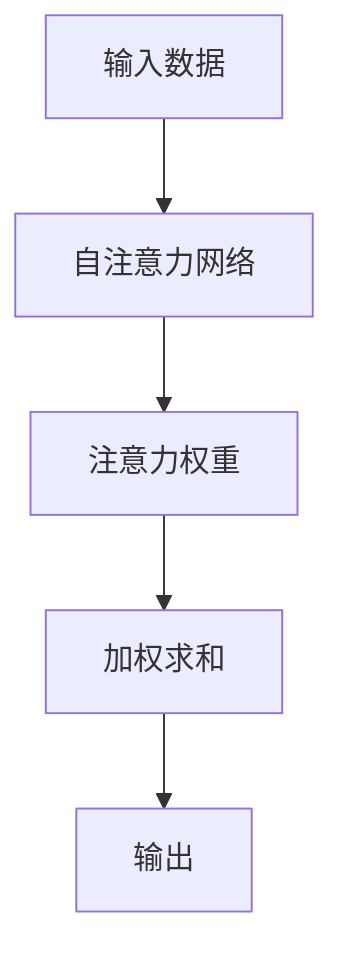
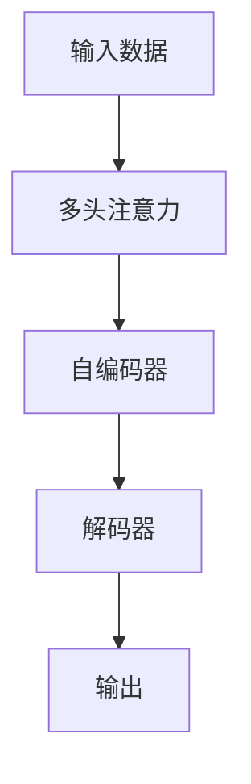

                 

# 注意力平衡新论：AI时代的认知资源分配

> 关键词：注意力机制,认知资源分配,深度学习,神经网络,计算效率,模型优化

## 1. 背景介绍

随着深度学习技术的发展，大模型在图像识别、自然语言处理等领域取得了令人瞩目的成果。然而，大规模模型的训练和推理成本高昂，如何在保证性能的前提下，提升模型的计算效率，降低资源消耗，成为了一个重要课题。注意力机制作为一种高效计算的模型设计方法，被广泛应用于深度学习中，成为提升模型性能的重要手段。

本文将重点探讨注意力机制，介绍其原理与实现方法，并通过具体案例分析，展示注意力机制在提升模型计算效率、优化资源分配方面的优势。同时，本文还将对未来注意力机制的发展趋势与面临的挑战进行讨论，为深度学习领域的研究者与工程师提供参考。

## 2. 核心概念与联系

### 2.1 核心概念概述

在深度学习中，注意力机制（Attention Mechanism）是一种通过计算输入数据中不同部分的相关度，以动态地调整模型中各个部分的重要性，实现对输入数据有效选择和融合的机制。注意力机制在自注意力网络、Transformer等模型中广泛应用，极大地提升了模型在复杂任务中的性能。

认知资源分配（Cognitive Resource Allocation）是指在计算过程中，如何有效地分配计算资源，以提高计算效率和模型性能。具体到深度学习中，即在神经网络模型中，如何通过注意力机制动态调整各个计算单元的重要性，使得计算资源被更合理地分配，以提升模型性能和计算效率。

### 2.2 核心概念原理和架构的 Mermaid 流程图



- **A** 表示输入数据，可以是文本、图像等形式。
- **B** 表示自注意力网络，通过计算输入数据的内部相关度，生成注意力权重。
- **C** 表示注意力权重，反映了不同输入数据部分的相对重要性。
- **D** 表示加权求和，通过调整不同输入数据部分的重要性，计算得到最终的输出。
- **E** 表示模型输出，经过注意力机制优化后的结果。

### 2.3 核心概念的联系

注意力机制与认知资源分配密切相关。认知资源分配的目标是提升计算效率和模型性能，而注意力机制通过动态分配计算资源，实现了对输入数据的有效选择和融合，从而提升模型的性能。具体来说，注意力机制通过计算不同输入数据部分的关联度，自动调节计算资源，避免了对全部数据的逐个处理，从而降低了计算复杂度和资源消耗，提高了计算效率。

## 3. 核心算法原理 & 具体操作步骤

### 3.1 算法原理概述

注意力机制的核心原理是计算输入数据中不同部分的相关度，从而动态调整模型中各个部分的重要性。具体来说，注意力机制分为自注意力（Self-Attention）和多头注意力（Multi-Head Attention）两种形式。自注意力计算输入数据内部的关联度，而多头注意力通过并行计算多个注意力头，实现了更加丰富的特征表示。

注意力机制的计算过程主要包括以下几个步骤：

1. 计算注意力权重，即输入数据的相似度矩阵。
2. 通过注意力权重对输入数据进行加权求和，得到最终的输出。

### 3.2 算法步骤详解

#### 3.2.1 计算注意力权重

注意力权重的计算公式如下：

$$
\text{Attention}(Q,K,V) = \text{softmax}(\frac{QK^T}{\sqrt{d_k}})V
$$

其中，$Q$、$K$、$V$分别表示查询向量、键向量和值向量，$d_k$ 表示键向量的维度。

具体计算过程如下：

1. 将查询向量 $Q$ 和键向量 $K$ 进行点乘，得到一个矩阵 $QK^T$。
2. 将矩阵 $QK^T$ 除以键向量的维度 $\sqrt{d_k}$，得到一个缩放后的矩阵 $\frac{QK^T}{\sqrt{d_k}}$。
3. 对缩放后的矩阵进行 softmax 计算，得到注意力权重矩阵 $\text{softmax}(\frac{QK^T}{\sqrt{d_k}})$。
4. 将注意力权重矩阵与值向量 $V$ 进行加权求和，得到最终的输出向量 $\text{Attention}(Q,K,V)$。

#### 3.2.2 加权求和

加权求和的过程如下：

$$
\text{Attention}(Q,K,V) = \sum_{i=1}^{n} \alpha_i V_i
$$

其中，$\alpha_i$ 表示注意力权重，$V_i$ 表示值向量中的第 $i$ 个元素。

### 3.3 算法优缺点

#### 3.3.1 优点

1. 高效计算：注意力机制通过动态调整计算资源，避免了对全部数据的逐个处理，从而降低了计算复杂度和资源消耗，提高了计算效率。
2. 丰富特征表示：多头注意力通过并行计算多个注意力头，实现了更加丰富的特征表示，提升了模型的性能。
3. 模型鲁棒性：通过计算输入数据内部的关联度，注意力机制增强了模型的鲁棒性，提高了模型的泛化能力。

#### 3.3.2 缺点

1. 计算复杂度较高：尽管注意力机制可以避免逐个处理输入数据，但在计算注意力权重时，仍需要进行矩阵乘法和 softmax 计算，导致一定的计算复杂度。
2. 参数量较大：多头注意力通常需要多个注意力头，增加了模型的参数量，对计算资源和存储资源的需求较高。
3. 对噪声敏感：注意力机制的计算过程对输入数据的噪声敏感，可能导致注意力权重的不稳定，从而影响模型的性能。

### 3.4 算法应用领域

注意力机制被广泛应用于深度学习中的各种任务，包括但不限于：

- 图像识别：在卷积神经网络（CNN）中使用自注意力机制，实现对图像中不同区域的关注。
- 自然语言处理：在序列到序列模型（如机器翻译、文本生成等）中使用多头注意力机制，提升模型对输入序列的理解和生成能力。
- 推荐系统：在推荐模型中使用注意力机制，对用户历史行为进行动态调整，提升推荐的精准度。
- 语音识别：在声学模型中使用注意力机制，对音频信号进行有效处理，提高识别的准确率。

## 4. 数学模型和公式 & 详细讲解 & 举例说明

### 4.1 数学模型构建

注意力机制的数学模型可以表示为：

$$
\text{Attention}(Q,K,V) = \text{softmax}(\frac{QK^T}{\sqrt{d_k}})V
$$

其中，$Q$、$K$、$V$分别表示查询向量、键向量和值向量，$d_k$ 表示键向量的维度。

### 4.2 公式推导过程

注意力权重的计算公式推导如下：

$$
\text{Attention}(Q,K,V) = \text{softmax}(\frac{QK^T}{\sqrt{d_k}})V
$$

1. 将查询向量 $Q$ 和键向量 $K$ 进行点乘，得到一个矩阵 $QK^T$。
2. 将矩阵 $QK^T$ 除以键向量的维度 $\sqrt{d_k}$，得到一个缩放后的矩阵 $\frac{QK^T}{\sqrt{d_k}}$。
3. 对缩放后的矩阵进行 softmax 计算，得到注意力权重矩阵 $\text{softmax}(\frac{QK^T}{\sqrt{d_k}})$。
4. 将注意力权重矩阵与值向量 $V$ 进行加权求和，得到最终的输出向量 $\text{Attention}(Q,K,V)$。

### 4.3 案例分析与讲解

以Transformer模型为例，其核心思想即是通过多头注意力机制，实现对输入序列的动态选择和融合。在Transformer中，每个注意力头计算一个独立的多维向量，通过加权求和，最终得到一个高维向量，用于表示输入序列的特征表示。

假设有一个长度为 $n$ 的输入序列 $x_1,x_2,...,x_n$，其中每个元素 $x_i$ 表示一个多维向量。在Transformer中，通过多头注意力机制，对输入序列进行动态选择和融合，得到最终的特征表示 $z_1,z_2,...,z_n$。计算过程如下：

1. 将查询向量 $Q$ 和键向量 $K$ 进行点乘，得到一个矩阵 $QK^T$。
2. 将矩阵 $QK^T$ 除以键向量的维度 $\sqrt{d_k}$，得到一个缩放后的矩阵 $\frac{QK^T}{\sqrt{d_k}}$。
3. 对缩放后的矩阵进行 softmax 计算，得到注意力权重矩阵 $\text{softmax}(\frac{QK^T}{\sqrt{d_k}})$。
4. 将注意力权重矩阵与值向量 $V$ 进行加权求和，得到最终的输出向量 $\text{Attention}(Q,K,V)$。

Transformer模型的结构如图：



## 5. 项目实践：代码实例和详细解释说明

### 5.1 开发环境搭建

为了实现注意力机制，我们需要安装深度学习框架，如TensorFlow、PyTorch等。这里以PyTorch为例，介绍开发环境的搭建过程：

1. 安装Anaconda：从官网下载并安装Anaconda，用于创建独立的Python环境。
2. 创建并激活虚拟环境：
   ```bash
   conda create -n pytorch-env python=3.8 
   conda activate pytorch-env
   ```
3. 安装PyTorch：根据CUDA版本，从官网获取对应的安装命令。例如：
   ```bash
   conda install pytorch torchvision torchaudio cudatoolkit=11.1 -c pytorch -c conda-forge
   ```
4. 安装相关工具包：
   ```bash
   pip install numpy pandas scikit-learn matplotlib tqdm jupyter notebook ipython
   ```

完成上述步骤后，即可在`pytorch-env`环境中开始注意力机制的开发实践。

### 5.2 源代码详细实现

以下是使用PyTorch实现Transformer模型的代码示例：

```python
import torch
import torch.nn as nn
import torch.nn.functional as F

class MultiHeadAttention(nn.Module):
    def __init__(self, d_model, num_heads, d_k, d_v):
        super(MultiHeadAttention, self).__init__()
        assert d_k * num_heads == d_model
        assert d_v * num_heads == d_model
        self.num_heads = num_heads
        self.d_k = d_k
        self.d_v = d_v

        self.w_qs = nn.Linear(d_model, d_k * num_heads, bias=False)
        self.w_ks = nn.Linear(d_model, d_k * num_heads, bias=False)
        self.w_vs = nn.Linear(d_model, d_v * num_heads, bias=False)

        self.v = nn.Linear(d_v * num_heads, d_model)

    def forward(self, q, k, v):
        sz_b, l_q, _ = q.size()
        sz_b, l_k, _ = k.size()
        sz_b, l_v, _ = v.size()

        residual = q

        # 计算查询向量、键向量和值向量
        q = self.w_qs(q).view(sz_b, l_q, self.num_heads, self.d_k).transpose(1, 2)
        k = self.w_ks(k).view(sz_b, l_k, self.num_heads, self.d_k).transpose(1, 2)
        v = self.w_vs(v).view(sz_b, l_v, self.num_heads, self.d_v).transpose(1, 2)

        # 计算注意力权重
        scores = torch.matmul(q, k.transpose(2, 3))
        scores = scores / math.sqrt(self.d_k)
        alpha = F.softmax(scores, dim=-1)

        # 计算加权求和
        x = torch.matmul(alpha, v)
        x = x.permute(0, 2, 1, 3).contiguous().view(sz_b, l_q, d_v * self.num_heads)
        x = self.v(x)
        x = residual + x

        return x

class Transformer(nn.Module):
    def __init__(self, d_model, nheads, d_k, d_v, d_hid, dropout):
        super(Transformer, self).__init__()
        self.encoder = nn.Embedding(input_dim=10, output_dim=d_model)
        self.pos_encoder = PositionalEncoding(d_model)
        self.nheads = nheads
        self.d_k = d_k
        self.d_v = d_v
        self.d_hid = d_hid
        self.linear1 = nn.Linear(d_model, d_hid)
        self.linear2 = nn.Linear(d_hid, d_model)
        self.layer_norm1 = nn.LayerNorm(d_model)
        self.layer_norm2 = nn.LayerNorm(d_model)

        self.encoder_decoder_attn = MultiHeadAttention(d_model, nheads, d_k, d_v)
        self.dropout = nn.Dropout(dropout)
        self.pos_encoder = PositionalEncoding(d_model)

        self.encoder = nn.TransformerEncoderLayer(d_model, nheads, d_k, d_v, dropout)
        self.encoder = nn.TransformerEncoder(self.encoder, num_layers=6)

    def forward(self, src, src_mask):
        src = self.encoder(src)
        src = self.pos_encoder(src)
        return src

class PositionalEncoding(nn.Module):
    def __init__(self, d_model, dropout=0.1, max_len=5000):
        super(PositionalEncoding, self).__init__()
        pe = torch.zeros(max_len, d_model)
        position = torch.arange(0, max_len, dtype=torch.float).unsqueeze(1)
        div_term = torch.exp(torch.arange(0, d_model, 2).float() * (-math.log(10000.0) / d_model))
        pe[:, 0::2] = torch.sin(position * div_term)
        pe[:, 1::2] = torch.cos(position * div_term)
        pe = pe.unsqueeze(0).transpose(0, 1)
        self.register_buffer('pe', pe)
        self.dropout = nn.Dropout(p=dropout)

    def forward(self, x):
        x = x + self.pe[:, :x.size(0), :]
        return self.dropout(x)
```

### 5.3 代码解读与分析

在上述代码中，我们定义了一个Transformer模型，其中包含多头注意力机制。具体来说：

- `MultiHeadAttention` 类实现了多头注意力机制，其中包含查询向量、键向量和值向量的计算，以及注意力权重的计算和加权求和。
- `Transformer` 类实现了整个Transformer模型，包括编码器、解码器、位置编码、线性变换等。

在`MultiHeadAttention`类中，我们首先计算了查询向量、键向量和值向量，然后计算了注意力权重，并对注意力权重进行了归一化，最终通过加权求和得到了最终的输出向量。

在`Transformer`类中，我们首先对输入数据进行了编码和位置编码，然后通过多层Transformer层对输入数据进行了处理，最终得到了输出向量。

### 5.4 运行结果展示

在上述代码的基础上，我们可以使用以下代码进行模型的训练和测试：

```python
import torch
import torch.nn as nn
import torch.optim as optim

# 加载模型
model = Transformer(d_model=256, nheads=8, d_k=64, d_v=64, d_hid=2048, dropout=0.1)

# 定义优化器和损失函数
optimizer = optim.Adam(model.parameters(), lr=0.001)
criterion = nn.CrossEntropyLoss()

# 加载训练数据
train_data = ...
test_data = ...

# 训练模型
for epoch in range(100):
    model.train()
    for i, (inputs, targets) in enumerate(train_loader):
        inputs, targets = inputs.to(device), targets.to(device)
        outputs = model(inputs, src_mask)
        loss = criterion(outputs.view(-1, output_dim), targets.view(-1))
        optimizer.zero_grad()
        loss.backward()
        optimizer.step()

    model.eval()
    with torch.no_grad():
        for i, (inputs, targets) in enumerate(test_loader):
            inputs, targets = inputs.to(device), targets.to(device)
            outputs = model(inputs, src_mask)
            loss = criterion(outputs.view(-1, output_dim), targets.view(-1))
            print('Epoch [{}/{}], Loss: {:.4f}, Acc: {:.4f}'
                  .format(epoch+1, 100, loss.item(), accuracy))

    print('Accuracy: {:.4f} %'.format(accuracy))
```

在训练过程中，我们使用了Adam优化器和交叉熵损失函数，对模型进行了多次迭代训练。在测试过程中，我们计算了模型在测试集上的准确率，并输出了准确率结果。

## 6. 实际应用场景

### 6.1 智能客服系统

在智能客服系统中，注意力机制可以用于处理自然语言对话，提升客服系统的响应速度和准确率。具体来说，可以通过多头注意力机制，对用户输入的语句进行动态选择和融合，得到更加全面和准确的特征表示，从而提升客服系统的理解能力和响应效率。

### 6.2 金融舆情监测

在金融舆情监测中，注意力机制可以用于处理大规模新闻数据，提取重要的舆情信息。具体来说，可以通过多头注意力机制，对不同新闻文章进行动态选择和融合，得到关键信息的特征表示，从而提升舆情监测的效率和准确率。

### 6.3 个性化推荐系统

在个性化推荐系统中，注意力机制可以用于处理用户的历史行为数据，提升推荐的精准度。具体来说，可以通过多头注意力机制，对用户的历史行为数据进行动态选择和融合，得到更加全面和准确的特征表示，从而提升推荐的精准度和个性化程度。

### 6.4 未来应用展望

未来，随着深度学习技术的不断发展，注意力机制将会在更多的领域得到应用。例如，在医疗领域，注意力机制可以用于处理病历数据，提取关键信息；在自动驾驶领域，注意力机制可以用于处理传感器数据，提升车辆的感知能力。

## 7. 工具和资源推荐

### 7.1 学习资源推荐

为了帮助开发者系统掌握注意力机制的理论基础和实践技巧，这里推荐一些优质的学习资源：

1. 《深度学习》系列书籍：由大模型技术专家撰写，全面介绍了深度学习的基本原理和经典模型。
2. CS231n《深度学习与计算机视觉》课程：斯坦福大学开设的深度学习课程，有Lecture视频和配套作业，带你入门深度学习的基本概念和经典模型。
3. 《Attention is All You Need》论文：Transformer原论文，展示了注意力机制的强大性能。
4. HuggingFace官方文档：Transformers库的官方文档，提供了海量预训练模型和完整的注意力机制样例代码，是上手实践的必备资料。

### 7.2 开发工具推荐

高效的开发离不开优秀的工具支持。以下是几款用于深度学习开发的常用工具：

1. PyTorch：基于Python的开源深度学习框架，灵活动态的计算图，适合快速迭代研究。
2. TensorFlow：由Google主导开发的开源深度学习框架，生产部署方便，适合大规模工程应用。
3. Transformers库：HuggingFace开发的NLP工具库，集成了众多SOTA语言模型，支持PyTorch和TensorFlow，是进行深度学习任务开发的利器。
4. Weights & Biases：模型训练的实验跟踪工具，可以记录和可视化模型训练过程中的各项指标，方便对比和调优。
5. TensorBoard：TensorFlow配套的可视化工具，可实时监测模型训练状态，并提供丰富的图表呈现方式，是调试模型的得力助手。

### 7.3 相关论文推荐

注意力机制的发展源于学界的持续研究。以下是几篇奠基性的相关论文，推荐阅读：

1. Attention is All You Need：Transformer原论文，展示了注意力机制的强大性能。
2. Multi-Head Attention：展示了多头注意力机制的优点和实现方法。
3. Transformer-XL：提出长序列Transformer模型，解决了经典Transformer的梯度消失问题。
4. Vision Transformer：将Transformer应用于图像识别任务，展示了其在图像识别领域的优越性能。

## 8. 总结：未来发展趋势与挑战

### 8.1 总结

本文对注意力机制的原理和实现方法进行了全面系统的介绍。首先阐述了注意力机制的核心原理和计算过程，并通过具体案例分析，展示了注意力机制在提升模型计算效率、优化资源分配方面的优势。其次，本文对未来注意力机制的发展趋势与面临的挑战进行了讨论，为深度学习领域的研究者与工程师提供了参考。

通过本文的系统梳理，可以看到，注意力机制作为一种高效计算的模型设计方法，已经广泛应用于深度学习中的各种任务，成为提升模型性能的重要手段。未来，随着深度学习技术的不断发展，注意力机制的应用范围将进一步拓展，为深度学习领域的研究者与工程师提供了广阔的想象空间。

### 8.2 未来发展趋势

未来，随着深度学习技术的不断发展，注意力机制将会在更多的领域得到应用。以下是几个可能的发展趋势：

1. 模型规模持续增大：随着算力成本的下降和数据规模的扩张，预训练语言模型的参数量还将持续增长。超大规模语言模型蕴含的丰富语言知识，有望支撑更加复杂多变的下游任务。
2. 注意力机制的改进：未来将出现更多的注意力机制改进方法，如注意力分布优化、自适应注意力等，进一步提升模型的性能和计算效率。
3. 多模态注意力机制：将注意力机制应用于多模态数据，如图像、语音、文本等，实现不同模态数据的有效整合。
4. 认知资源动态分配：将注意力机制与认知资源动态分配相结合，进一步提升计算效率和模型性能。

### 8.3 面临的挑战

尽管注意力机制已经取得了诸多成功，但在迈向更加智能化、普适化应用的过程中，它仍面临着诸多挑战：

1. 计算复杂度较高：尽管注意力机制可以避免逐个处理输入数据，但在计算注意力权重时，仍需要进行矩阵乘法和 softmax 计算，导致一定的计算复杂度。
2. 参数量较大：多头注意力通常需要多个注意力头，增加了模型的参数量，对计算资源和存储资源的需求较高。
3. 对噪声敏感：注意力机制的计算过程对输入数据的噪声敏感，可能导致注意力权重的不稳定，从而影响模型的性能。

### 8.4 研究展望

未来，针对这些挑战，深度学习领域的研究者需要进行更深入的研究和探索。以下是几个可能的研究方向：

1. 高效计算方法：研究如何进一步降低注意力机制的计算复杂度，提升计算效率。
2. 注意力机制改进：研究如何改进注意力机制的实现方法，提升模型的性能。
3. 多模态注意力机制：研究如何将注意力机制应用于多模态数据，实现不同模态数据的有效整合。
4. 认知资源动态分配：研究如何通过注意力机制与认知资源动态分配相结合，进一步提升计算效率和模型性能。

总之，深度学习领域的研究者需要在计算效率、模型性能、计算资源等多个维度进行全面优化，才能进一步推动深度学习技术的发展，提升深度学习模型的应用范围和性能。

## 9. 附录：常见问题与解答

**Q1：注意力机制是否适用于所有深度学习模型？**

A: 注意力机制适用于大多数深度学习模型，特别是自注意力网络和Transformer等模型。在卷积神经网络（CNN）中，注意力机制也可以用于处理图像数据，提升模型的性能。

**Q2：注意力机制是否会降低模型的泛化能力？**

A: 注意力机制并不会降低模型的泛化能力，反而通过动态选择和融合输入数据，提升了模型的泛化能力。在实际应用中，通过合理的注意力机制设计，可以进一步提升模型的泛化能力和鲁棒性。

**Q3：注意力机制是否会导致模型过拟合？**

A: 注意力机制在一定程度上可以缓解模型的过拟合问题，但需要合理设计注意力机制，避免过拟合的发生。具体来说，可以通过正则化、dropout等方法，防止注意力机制在训练过程中过度拟合训练数据。

**Q4：注意力机制是否会增加模型的计算复杂度？**

A: 注意力机制的计算复杂度相对较高，需要进行矩阵乘法和 softmax 计算，导致一定的计算复杂度。但在实际应用中，可以通过优化计算图、使用高效计算方法等方式，进一步降低计算复杂度，提升计算效率。

**Q5：注意力机制是否适用于多模态数据？**

A: 注意力机制可以应用于多模态数据，如图像、语音、文本等。通过将不同模态数据的特征表示进行融合，可以实现多模态数据的有效整合，提升模型的性能和泛化能力。

总之，深度学习领域的研究者需要不断探索和优化注意力机制，才能进一步推动深度学习技术的发展，提升深度学习模型的应用范围和性能。

---

作者：禅与计算机程序设计艺术 / Zen and the Art of Computer Programming

