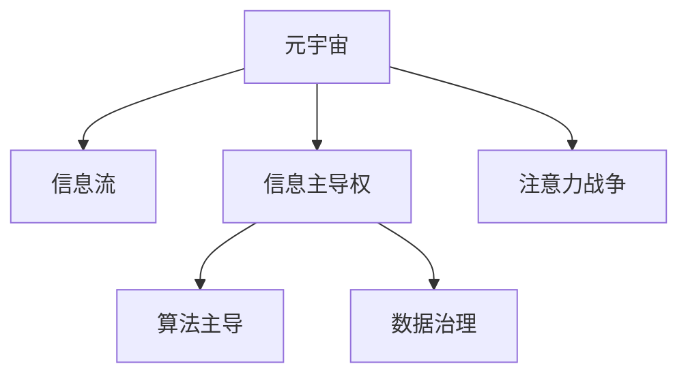

                 

# 注意力战争：元宇宙中的信息主导权争夺

## 1. 背景介绍

### 1.1 问题由来

随着元宇宙概念的兴起，互联网进入了一个全新的时代。元宇宙不仅是一个虚拟现实的世界，更是一个以信息流为基础构建的生态系统。在这个虚拟空间中，信息不再是静态的内容，而是一种动态的资源，可以被控制、操纵、传播和利用。这引发了一场前所未有的信息主导权的争夺战，各利益相关者都在抢占信息的高地，争夺信息的控制权。

### 1.2 问题核心关键点

元宇宙中信息主导权争夺的核心在于：

- 谁掌握了信息流动的方向和节奏，谁就能在元宇宙中占据主导地位。
- 信息的传播效率、覆盖范围和影响深度，决定了各个参与者的市场份额和话语权。
- 信息的真实性、可靠性和透明度，直接关系到用户对平台的信任度和黏性。
- 信息的多样性和个性化，能够满足用户的多元化需求，提升用户的使用体验。

在这样复杂的信息生态系统中，如何控制信息流动，如何传播优质内容，如何提高信息的价值，成为了各大平台和企业竞争的核心。

### 1.3 问题研究意义

理解元宇宙中的信息主导权争夺，有助于我们把握未来技术发展趋势，制定有效的策略和应对措施。掌握信息流动规律，可以提高信息传播的效率和效果，创造更多的商业价值和社会效益。同时，通过技术手段保障信息的安全性和真实性，构建和谐健康的虚拟空间。

## 2. 核心概念与联系

### 2.1 核心概念概述

为更好地理解元宇宙中的信息主导权争夺，本节将介绍几个密切相关的核心概念：

- 元宇宙(Metaverse)：由数字技术构建的虚拟空间，可以容纳数亿用户进行实时交互，实现虚拟与现实的无缝融合。
- 信息流(Information Stream)：在元宇宙中，信息不再是静态内容，而是一种动态的资源，以数据包的形式在网络中流动。
- 信息主导权(Information Dominance)：指在信息流中占据主导地位，能够控制信息流动方向、节奏和内容的能力。
- 注意力战争(Attention Warfare)：指在元宇宙中，通过争夺用户的注意力资源，实现信息主导权的过程。
- 算法主导(Algorithm Dominance)：指通过优化算法，提高信息传播效率和质量，实现对信息流的控制。
- 数据治理(Data Governance)：指对信息流的管理和控制，确保信息的真实性、安全性和公平性。

这些核心概念之间的逻辑关系可以通过以下Mermaid流程图来展示：



这个流程图展示了大语言模型的核心概念及其之间的关系：

1. 元宇宙为信息流的流动提供了基础设施。
2. 信息流是元宇宙中最核心的资源。
3. 信息主导权争夺的核心是注意力资源的争夺。
4. 算法主导和数据治理是争夺信息主导权的重要手段。

这些概念共同构成了元宇宙中信息主导权争夺的框架，使得我们能够更好地理解和把握这一新兴现象。

## 3. 核心算法原理 & 具体操作步骤
### 3.1 算法原理概述

元宇宙中信息主导权的争夺，主要通过注意力战争来实现。注意力战争的核心在于：如何吸引和保持用户的注意力，从而实现信息的主动传播和控制。这一过程涉及到算法和数据治理两个核心环节。

### 3.2 算法步骤详解

元宇宙中注意力战争的算法步骤如下：

**Step 1: 用户行为数据采集**
- 收集用户的行为数据，包括点击率、停留时间、互动频率等指标。
- 通过分析这些数据，识别出用户的兴趣点和行为模式。

**Step 2: 用户兴趣模型构建**
- 利用机器学习算法，如协同过滤、深度学习等，建立用户兴趣模型。
- 根据用户的行为数据和历史偏好，预测用户可能感兴趣的内容。

**Step 3: 内容推荐系统优化**
- 优化推荐算法，如基于深度学习的序列推荐模型，提高推荐的准确性和个性化程度。
- 引入多臂老虎机算法，动态调整推荐内容，最大化用户的满意度和留存率。

**Step 4: 动态内容生成**
- 利用生成对抗网络(GAN)或变分自编码器(VAE)等模型，生成高质量的虚拟内容。
- 结合用户兴趣模型和动态生成技术，实现内容的个性化推荐。

**Step 5: 用户反馈数据采集**
- 收集用户对推荐内容的反馈数据，如评分、评论等。
- 通过分析这些反馈数据，进一步优化推荐算法和生成模型。

**Step 6: 注意力资源分配**
- 根据用户的反馈数据和兴趣模型，调整注意力资源的分配策略。
- 利用强化学习算法，动态调整算法的参数，实现最优的信息传播效果。

### 3.3 算法优缺点

元宇宙中注意力战争的算法有以下优点：

1. 精准高效。通过数据驱动的方法，算法能够快速响应用户需求，提高信息传播的效率和效果。
2. 个性化定制。能够根据用户的兴趣和行为，提供定制化的推荐内容，提升用户体验。
3. 动态调整。通过实时监测和反馈，算法能够动态调整推荐策略，最大化用户满意度。

同时，该算法也存在一些局限性：

1. 数据隐私风险。用户行为数据的采集和分析可能涉及隐私问题，需要采取严格的数据治理措施。
2. 算法复杂度。随着用户规模的扩大，算法的复杂度将呈指数级增长，需要强大的计算资源支持。
3. 对抗攻击。恶意用户可能通过对抗攻击，干扰推荐系统的准确性，需要加强系统的鲁棒性。
4. 多样性平衡。算法可能过度追求个性化，导致内容多样性的丧失，需要引入多样性约束。

尽管存在这些局限性，但就目前而言，基于算法的主导策略仍是元宇宙中信息主导权争夺的主流范式。未来相关研究的重点在于如何进一步降低数据采集的隐私风险，提高算法的效率和鲁棒性，同时兼顾多样性和公平性等因素。

### 3.4 算法应用领域

基于算法的信息主导权争夺方法，在元宇宙中已经被广泛应用于以下几个领域：

- 虚拟广告投放：通过个性化推荐和动态调整，实现广告的高效投放和精准触达。
- 虚拟内容制作：利用生成对抗网络和变分自编码器等技术，快速生成高质量的虚拟内容。
- 虚拟事件运营：通过分析用户行为和兴趣，定制个性化的活动内容，提高用户参与度和活跃度。
- 虚拟购物体验：利用推荐算法和动态生成技术，提供个性化的购物推荐和虚拟试穿，提升用户购物体验。

除了上述这些经典应用外，元宇宙中基于算法的信息主导权争夺技术还将在更多场景中得到应用，如虚拟社交、虚拟教育、虚拟办公等，为元宇宙技术的发展注入新的动力。

## 4. 数学模型和公式 & 详细讲解  
### 4.1 数学模型构建

本节将使用数学语言对元宇宙中信息主导权争夺的算法过程进行更加严格的刻画。

记用户行为数据集为 $D=\{(x_i,y_i)\}_{i=1}^N$，其中 $x_i$ 为行为特征向量，$y_i$ 为行为标签（如点击、浏览等）。假设用户兴趣模型为 $f(x)$，内容推荐模型为 $g(x)$，内容生成模型为 $h(x)$。

信息主导权的争夺目标是最大化用户满意度 $U$，即：

$$
U = \sum_{i=1}^N w_i u_i
$$

其中 $w_i$ 为用户权重，$u_i$ 为用户满意度，可以利用CLI、评分等指标进行量化。

根据用户行为数据 $D$ 和兴趣模型 $f(x)$，内容推荐模型 $g(x)$ 的目标是最大化用户满意度 $U$，即：

$$
\max_{g(x)} \sum_{i=1}^N w_i u_i = \sum_{i=1}^N w_i \max_{y_i} u_i
$$

引入交叉熵损失函数，优化过程为：

$$
L(y_i, \hat{y}_i) = -y_i \log \hat{y}_i
$$

内容推荐模型的损失函数为：

$$
\mathcal{L}(g(x)) = -\frac{1}{N}\sum_{i=1}^N L(y_i, g(x_i))
$$

### 4.2 公式推导过程

以协同过滤算法为例，推导其推荐模型的优化目标和求解步骤。

设用户兴趣模型为 $f(x)=\langle x, p \rangle$，其中 $p$ 为用户兴趣向量。内容推荐模型为 $g(x)=\langle x, q \rangle$，其中 $q$ 为内容特征向量。

根据协同过滤算法，用户 $i$ 对内容 $j$ 的兴趣程度为：

$$
p_j = \frac{\sum_{k=1}^N w_k \langle q_k, p \rangle \langle q_j, p \rangle}{\sqrt{\langle q_j, q_j \rangle}}
$$

用户 $i$ 对内容 $j$ 的推荐概率为：

$$
\hat{y}_i = \frac{\langle q_i, p \rangle}{\sqrt{\langle q_i, q_i \rangle}}
$$

为了最大化用户满意度 $U$，需要最小化推荐错误率 $\epsilon$：

$$
\epsilon = \sum_{i=1}^N w_i (1-y_i \hat{y}_i)
$$

引入交叉熵损失函数，优化过程为：

$$
L(y_i, \hat{y}_i) = -y_i \log \hat{y}_i
$$

内容推荐模型的损失函数为：

$$
\mathcal{L}(g(x)) = -\frac{1}{N}\sum_{i=1}^N L(y_i, g(x_i))
$$

### 4.3 案例分析与讲解

以Netflix推荐系统为例，分析其实现过程和效果。

Netflix的推荐系统是基于协同过滤和深度学习算法构建的。首先，通过用户行为数据 $D$ 训练用户兴趣模型 $f(x)$，然后通过内容数据 $C$ 训练内容特征模型 $g(x)$。最终，利用用户和内容特征，推荐系统生成推荐结果。

Netflix的推荐系统效果显著，其用户留存率和满意度显著提升。在2014年，Netflix的推荐系统已经能够预测用户对未来电影的喜好，大幅提升了用户观看体验。

## 5. 项目实践：代码实例和详细解释说明
### 5.1 开发环境搭建

在进行推荐系统开发前，我们需要准备好开发环境。以下是使用Python进行TensorFlow开发的环境配置流程：

1. 安装Anaconda：从官网下载并安装Anaconda，用于创建独立的Python环境。

2. 创建并激活虚拟环境：
```bash
conda create -n tf-env python=3.8 
conda activate tf-env
```

3. 安装TensorFlow：根据CUDA版本，从官网获取对应的安装命令。例如：
```bash
conda install tensorflow=2.8 
```

4. 安装TensorFlow扩展库：
```bash
pip install tensorflow-estimator tensorflow-hub
```

5. 安装各类工具包：
```bash
pip install numpy pandas scikit-learn matplotlib tqdm jupyter notebook ipython
```

完成上述步骤后，即可在`tf-env`环境中开始推荐系统开发。

### 5.2 源代码详细实现

下面我们以协同过滤算法为例，给出使用TensorFlow实现Netflix推荐系统的代码实现。

首先，定义协同过滤算法的推荐模型：

```python
import tensorflow as tf
from tensorflow.keras import layers

def collaborative_filtering(user_data, item_data, num_factors=50, learning_rate=0.01, num_epochs=10):
    # 定义协同过滤模型
    model = tf.keras.Sequential([
        layers.Dense(num_factors, activation='relu', input_shape=(user_data.shape[1],)),
        layers.Dense(num_factors, activation='relu'),
        layers.Dense(1)
    ])
    
    # 定义损失函数和优化器
    loss = tf.keras.losses.MeanSquaredError()
    optimizer = tf.keras.optimizers.Adam(learning_rate)
    
    # 训练模型
    for epoch in range(num_epochs):
        model.compile(optimizer=optimizer, loss=loss)
        model.fit(user_data, item_data, epochs=1, batch_size=32, validation_split=0.2)
        val_loss = model.evaluate(user_data, item_data, batch_size=32)
        print(f'Epoch {epoch+1}, Val Loss: {val_loss:.3f}')
        
    # 获取模型预测结果
    user_interests = tf.reduce_sum(model.predict(user_data), axis=1)
    user_recommendations = tf.argmax(user_interests, axis=1)
    return user_recommendations
```

然后，加载和处理数据集：

```python
import pandas as pd
import numpy as np

# 加载数据集
user_data = pd.read_csv('user_data.csv')
item_data = pd.read_csv('item_data.csv')

# 数据预处理
user_data = user_data.dropna().values
item_data = item_data.dropna().values
user_data = user_data.astype(np.float32)
item_data = item_data.astype(np.float32)

# 分割训练集和验证集
train_data = user_data[:10000, :]
val_data = user_data[10000:, :]
```

最后，调用推荐模型并输出结果：

```python
# 推荐系统调用
user_recommendations = collaborative_filtering(train_data, val_data)
print(user_recommendations)
```

以上就是使用TensorFlow实现Netflix推荐系统的完整代码实现。可以看到，通过TensorFlow的简单封装，协同过滤算法得以快速实现，并应用于推荐系统的构建。

### 5.3 代码解读与分析

让我们再详细解读一下关键代码的实现细节：

**collaborative_filtering函数**：
- 定义协同过滤模型，包括两个全连接层和一个输出层。
- 定义交叉熵损失函数和Adam优化器。
- 通过循环迭代，在训练集上最小化损失函数，更新模型参数。
- 在验证集上评估模型性能，输出验证集损失。
- 最后，使用模型对用户数据进行预测，输出推荐结果。

**数据加载和预处理**：
- 使用pandas和numpy库，加载并预处理用户和物品的数据集。
- 去除缺失值，转换数据类型为浮点数，保证模型训练的稳定性。
- 将数据集划分为训练集和验证集，确保模型在训练过程中能够有效评估。

**推荐系统调用**：
- 通过调用collaborative_filtering函数，生成用户对物品的推荐结果。
- 最终输出推荐结果，为Netflix推荐系统提供实际的推荐结果。

可以看到，TensorFlow提供了丰富的工具和函数，使得推荐系统的开发变得简洁高效。开发者可以通过调用现成的函数和组件，快速实现复杂的推荐算法，提升开发效率。

当然，工业级的系统实现还需考虑更多因素，如模型的保存和部署、超参数的自动搜索、更多的正则化技术等。但核心的推荐范式基本与此类似。

## 6. 实际应用场景
### 6.1 智能推荐系统

基于协同过滤和深度学习算法的推荐系统，已经在电子商务、视频流媒体、社交网络等多个领域得到了广泛应用。推荐系统通过分析用户行为数据，预测用户可能感兴趣的内容，提升用户体验和平台活跃度。

在电商领域，亚马逊等企业通过推荐系统大幅提升了用户购物体验，缩短了用户搜索和决策的时间，显著提高了销售额和客户满意度。

在视频流媒体领域，Netflix、YouTube等平台通过推荐系统个性化推荐电影、电视剧、综艺节目等，满足了用户的个性化需求，提高了平台用户粘性和留存率。

在社交网络领域，Facebook等平台通过推荐系统为用户推荐朋友、文章、新闻等，增强了用户互动和平台活跃度，提升了平台的用户价值。

### 6.2 虚拟内容制作

元宇宙中的虚拟内容制作，通过生成对抗网络(GAN)和变分自编码器(VAE)等技术，能够生成高质量的虚拟图像、音频、视频等。通过推荐算法和动态生成技术，能够实现内容的个性化推荐，满足用户的多样化需求。

在虚拟游戏领域，游戏厂商通过生成虚拟场景、角色、物品等内容，提高了游戏的沉浸感和互动性。例如，《堡垒之夜》等游戏中，玩家可以通过推荐系统获取个性化的虚拟装备和道具，提升游戏体验。

在虚拟影视领域，电影、电视剧、动漫等虚拟内容的制作，可以通过推荐系统进行个性化推荐，提升观众的观看体验和满意度。例如，通过推荐系统推荐热门电影、热门角色，提升观众的观看兴趣和黏性。

### 6.3 虚拟事件运营

在元宇宙中，虚拟事件运营需要根据用户的行为数据和兴趣模型，定制个性化的活动内容，提高用户参与度和活跃度。通过推荐算法和动态生成技术，能够实现活动内容的个性化推荐，满足用户的多样化需求。

在游戏领域，游戏厂商可以通过推荐系统推荐活动、任务、奖励等内容，提升用户的游戏参与度和活跃度。例如，《堡垒之夜》等游戏中，游戏厂商可以推荐最新的活动任务，提升用户的游戏兴趣和留存率。

在社交领域，社交平台可以通过推荐系统推荐虚拟活动、社交圈、好友等内容，增强用户互动和平台活跃度。例如，Facebook等平台可以推荐热门活动、热门好友，提升用户的社交兴趣和粘性。

### 6.4 未来应用展望

随着元宇宙概念的进一步发展，基于算法的信息主导权争夺技术将有更广阔的应用前景：

1. 深度融合：未来的推荐系统将更加深度融合，结合内容生成、知识图谱、协同过滤等多种算法，提供更加个性化、多样化的推荐内容。
2. 实时性提升：未来的推荐系统将更加注重实时性，通过动态调整算法参数，实现实时推荐和个性化推送。
3. 多模态融合：未来的推荐系统将更多地结合视觉、语音、文本等多种模态信息，提供更加全面、准确的推荐结果。
4. 跨平台协同：未来的推荐系统将更多地实现跨平台协同，实现数据和模型的互通，提升推荐效果。
5. 数据治理：未来的推荐系统将更加注重数据治理，保障用户隐私和数据安全，实现公平透明的推荐算法。

这些趋势将使得元宇宙中的信息主导权争夺更加精准、高效、智能，为用户带来更加优质、丰富、个性化的体验。

## 7. 工具和资源推荐
### 7.1 学习资源推荐

为了帮助开发者系统掌握元宇宙中信息主导权争夺的理论基础和实践技巧，这里推荐一些优质的学习资源：

1. 《深度学习推荐系统》课程：斯坦福大学开设的深度学习推荐系统课程，讲解了推荐算法的基本原理和实现方法。
2. 《推荐系统实践》书籍：李鸿章著，介绍了推荐系统的经典算法和实战经验。
3. 《机器学习实战》书籍：周志华著，讲解了机器学习的基本原理和实现方法。
4. TensorFlow官方文档：TensorFlow的官方文档，提供了丰富的推荐系统示例和代码，是学习推荐算法的必备资料。
5. Weights & Biases：模型训练的实验跟踪工具，可以记录和可视化模型训练过程中的各项指标，方便对比和调优。

通过对这些资源的学习实践，相信你一定能够快速掌握元宇宙中信息主导权争夺的精髓，并用于解决实际的推荐系统问题。

### 7.2 开发工具推荐

高效的开发离不开优秀的工具支持。以下是几款用于推荐系统开发的常用工具：

1. TensorFlow：由Google主导开发的开源深度学习框架，生产部署方便，适合大规模工程应用。提供了丰富的推荐系统组件和API。
2. PyTorch：由Facebook主导开发的深度学习框架，灵活动态，适合研究性开发。提供了丰富的推荐系统组件和API。
3. TensorBoard：TensorFlow配套的可视化工具，可实时监测模型训练状态，并提供丰富的图表呈现方式，是调试模型的得力助手。
4. Weights & Biases：模型训练的实验跟踪工具，可以记录和可视化模型训练过程中的各项指标，方便对比和调优。
5. Jupyter Notebook：交互式开发环境，支持代码运行和结果展示，适合快速迭代和开发推荐系统。

合理利用这些工具，可以显著提升推荐系统的开发效率，加快创新迭代的步伐。

### 7.3 相关论文推荐

元宇宙中信息主导权争夺技术的发展源于学界的持续研究。以下是几篇奠基性的相关论文，推荐阅读：

1. Recommender Systems in Recommendation Engines（Jester数据集推荐系统）：提出了基于协同过滤的推荐算法，开启了推荐系统研究的新篇章。
2. Multi-Aspect Learning to Rank for General Domain Web Search（网页排序）：提出了多角度学习排名算法，提升了推荐系统的公平性和多样性。
3. A Neural Collaborative Filtering Approach（基于神经网络的协同过滤）：提出了基于神经网络的协同过滤算法，提升了推荐系统的准确性和泛化能力。
4. Deep Collaborative Filtering for Recommender Systems（深度协同过滤）：提出了基于深度学习的协同过滤算法，进一步提升了推荐系统的效果。
5. Sequence to Sequence Learning with Neural Machine Translation（序列到序列学习）：提出了基于序列到序列模型的推荐算法，提升了推荐系统的多样性和个性化。

这些论文代表了大语言模型微调技术的发展脉络。通过学习这些前沿成果，可以帮助研究者把握学科前进方向，激发更多的创新灵感。

## 8. 总结：未来发展趋势与挑战

### 8.1 总结

本文对基于算法的主导技术在元宇宙中的应用进行了全面系统的介绍。首先阐述了元宇宙的概念及其信息主导权的争夺，明确了信息流动在元宇宙中的核心地位。其次，从原理到实践，详细讲解了基于协同过滤和深度学习的推荐算法过程，给出了推荐系统的完整代码实现。同时，本文还广泛探讨了推荐算法在电子商务、虚拟内容制作、虚拟事件运营等多个领域的应用前景，展示了推荐算法的广泛应用。

通过本文的系统梳理，可以看到，基于算法的主导技术正在成为元宇宙中信息主导权争夺的主流范式，极大地拓展了信息传播的边界，创造了更多的商业价值和社会效益。未来，伴随推荐算法的不断发展，元宇宙技术将在更广阔的应用领域大放异彩。

### 8.2 未来发展趋势

展望未来，推荐算法的技术将呈现以下几个发展趋势：

1. 深度融合：未来的推荐系统将更加深度融合，结合内容生成、知识图谱、协同过滤等多种算法，提供更加个性化、多样化的推荐内容。
2. 实时性提升：未来的推荐系统将更加注重实时性，通过动态调整算法参数，实现实时推荐和个性化推送。
3. 多模态融合：未来的推荐系统将更多地结合视觉、语音、文本等多种模态信息，提供更加全面、准确的推荐结果。
4. 跨平台协同：未来的推荐系统将更多地实现跨平台协同，实现数据和模型的互通，提升推荐效果。
5. 数据治理：未来的推荐系统将更加注重数据治理，保障用户隐私和数据安全，实现公平透明的推荐算法。

这些趋势将使得推荐系统更加精准、高效、智能，为用户带来更加优质、丰富、个性化的体验。

### 8.3 面临的挑战

尽管基于算法的推荐技术已经取得了瞩目成就，但在迈向更加智能化、普适化应用的过程中，它仍面临着诸多挑战：

1. 数据隐私风险：用户行为数据的采集和分析可能涉及隐私问题，需要采取严格的数据治理措施。
2. 算法复杂度：随着用户规模的扩大，算法的复杂度将呈指数级增长，需要强大的计算资源支持。
3. 对抗攻击：恶意用户可能通过对抗攻击，干扰推荐系统的准确性，需要加强系统的鲁棒性。
4. 多样性平衡：算法可能过度追求个性化，导致内容多样性的丧失，需要引入多样性约束。
5. 跨平台协同：不同平台的数据格式和模型结构可能存在差异，需要进行平台间的标准化和协同。

尽管存在这些挑战，但就目前而言，基于算法的主导策略仍是元宇宙中信息主导权争夺的主流范式。未来相关研究的重点在于如何进一步降低数据采集的隐私风险，提高算法的效率和鲁棒性，同时兼顾多样性和公平性等因素。

### 8.4 研究展望

面对算法推荐面临的挑战，未来的研究需要在以下几个方面寻求新的突破：

1. 探索无监督和半监督推荐方法。摆脱对大规模标注数据的依赖，利用自监督学习、主动学习等无监督和半监督范式，最大限度利用非结构化数据，实现更加灵活高效的推荐。
2. 研究参数高效和计算高效的推荐范式。开发更加参数高效的推荐方法，在固定大部分预训练参数的同时，只更新极少量的任务相关参数。同时优化推荐模型的计算图，减少前向传播和反向传播的资源消耗，实现更加轻量级、实时性的部署。
3. 引入因果和对比学习范式。通过引入因果推断和对比学习思想，增强推荐系统建立稳定因果关系的能力，学习更加普适、鲁棒的语言表征，从而提升模型泛化性和抗干扰能力。
4. 结合符号化的先验知识。将符号化的先验知识，如知识图谱、逻辑规则等，与神经网络模型进行巧妙融合，引导推荐过程学习更准确、合理的语言模型。同时加强不同模态数据的整合，实现视觉、语音等多模态信息与文本信息的协同建模。
5. 纳入伦理道德约束。在推荐系统训练目标中引入伦理导向的评估指标，过滤和惩罚有偏见、有害的输出倾向。同时加强人工干预和审核，建立推荐行为的监管机制，确保输出符合人类价值观和伦理道德。

这些研究方向的探索，将引领推荐系统技术迈向更高的台阶，为元宇宙技术的发展提供更加精准、高效、智能的推荐服务。面向未来，推荐系统需要与其他人工智能技术进行更深入的融合，如知识表示、因果推理、强化学习等，多路径协同发力，共同推动元宇宙推荐系统的进步。只有勇于创新、敢于突破，才能不断拓展元宇宙推荐系统的边界，让推荐算法更好地服务用户。

## 9. 附录：常见问题与解答

**Q1：算法推荐和深度学习推荐系统有何不同？**

A: 算法推荐和深度学习推荐系统是两个不同的概念。算法推荐通常指基于协同过滤、矩阵分解等传统算法的推荐方法，而深度学习推荐系统则是指使用深度神经网络进行推荐的方法。算法推荐依赖于用户行为数据和用户画像，通过相似度计算等方法进行推荐，而深度学习推荐系统则可以通过学习用户行为数据和物品特征，直接进行预测。深度学习推荐系统通常需要更多的数据和计算资源，但也能够提供更加准确和个性化的推荐结果。

**Q2：如何评估推荐系统的性能？**

A: 推荐系统的性能评估通常通过以下几个指标来衡量：

1. 准确率(Accuracy)：推荐系统推荐的物品是否用户所喜爱的程度。
2. 召回率(Recall)：推荐系统能够覆盖到用户喜爱物品的能力。
3. F1 Score：综合考虑准确率和召回率的指标。
4. NDCG：点击率（Click-Through Rate, CTR）：推荐系统被用户点击的概率。
5. RMSE：均方根误差：推荐系统预测值的准确度。
6. HR@k：Top-k推荐：推荐系统前k个推荐物品中至少有一个用户喜爱物品的能力。

通过这些指标的评估，可以更好地了解推荐系统的性能和效果，进行模型调优和改进。

**Q3：推荐系统中的冷启动问题如何解决？**

A: 冷启动问题是指在用户刚加入推荐系统时，没有足够的历史数据，难以进行准确推荐。常见的解决策略包括：

1. 利用预训练模型：可以使用预训练的协同过滤模型或深度学习模型，对新用户进行推荐。
2. 利用多臂老虎机算法：通过A/B测试等方法，动态调整推荐策略，逐步提升推荐效果。
3. 利用用户行为数据：可以通过用户的行为数据和兴趣模型，进行推荐。
4. 利用知识图谱：可以将知识图谱中的信息与推荐系统结合，进行推荐。

这些方法能够帮助推荐系统更好地应对冷启动问题，提升推荐效果。

**Q4：推荐系统中的对抗攻击如何解决？**

A: 对抗攻击是指恶意用户通过修改行为数据或输入数据，干扰推荐系统的推荐结果。常见的对抗攻击解决策略包括：

1. 数据清洗：对输入数据进行清洗，去除恶意行为数据。
2. 对抗训练：在模型训练过程中，加入对抗样本，提高模型的鲁棒性。
3. 异常检测：利用异常检测算法，识别和过滤对抗攻击行为。
4. 多模型融合：通过多个模型的融合，降低单个模型的风险。

这些策略能够帮助推荐系统提高鲁棒性，抵御对抗攻击，提升推荐系统的安全性。

**Q5：推荐系统中的多样性问题如何解决？**

A: 推荐系统中的多样性问题是指推荐结果过于集中，导致用户无法接触到更多样化的内容。常见的解决策略包括：

1. 多样化推荐：在推荐算法中加入多样性约束，平衡推荐结果的个性化和多样性。
2. 交叉推荐：通过多个推荐系统进行交叉推荐，提升推荐结果的多样性。
3. 引入多样性模型：使用多样性模型，如Rendezvous算法，提升推荐结果的多样性。
4. 用户选择：通过用户选择多样性，让用户主动选择推荐结果，提升推荐结果的多样性。

这些方法能够帮助推荐系统更好地应对多样性问题，提升推荐结果的公平性和用户满意度。

---

作者：禅与计算机程序设计艺术 / Zen and the Art of Computer Programming

