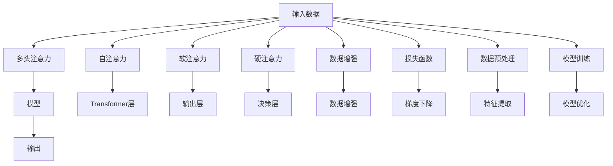

                 

# 注意力的深度学习：AI优化的专注力

> 关键词：注意力机制,深度学习,神经网络,自然语言处理,NLP,计算机视觉,CV

## 1. 背景介绍

### 1.1 问题由来

在深度学习时代，注意力机制（Attention Mechanism）已成为神经网络的重要组成部分，尤其是在自然语言处理（Natural Language Processing, NLP）和计算机视觉（Computer Vision, CV）等任务中。注意力机制通过增强模型对重要信息的关注，提高了神经网络的性能和效率。近年来，它被广泛应用于机器翻译、文本分类、图像分类等任务，取得了令人瞩目的成果。

在NLP中，注意力机制使得模型能够从长文本中提取重要信息，并对其进行理解和生成。例如，在机器翻译任务中，注意力机制能够使模型关注源语言句子的关键部分，并基于这些部分生成目标语言句子。在图像分类中，注意力机制能够使模型关注图像中重要的特征区域，从而提高分类准确率。

尽管注意力机制在许多任务中表现出色，但其原理和优化仍面临诸多挑战。例如，注意力机制如何通过学习适应不同任务的需要？如何避免在训练过程中出现梯度消失或梯度爆炸等问题？如何在实际应用中实现高效、稳定的注意力计算？

本文将深入探讨注意力机制的原理和应用，并通过具体案例和实践，展示其在大规模深度学习任务中的优化方法和应用前景。

### 1.2 问题核心关键点

注意力机制的核心在于选择性地关注输入数据中的关键部分，以便更好地进行任务处理。其基本思想是：在输入数据中，不同的部分可能对任务有不同程度的贡献，通过加权聚合这些部分，可以使模型更好地处理任务。

在深度学习中，注意力机制通常应用于以下几种场景：

- **自注意力机制**：用于模型内部的信息流动，如Transformer中的Attention层。
- **软注意力机制**：用于模型输出层，如自回归模型中的Attention层。
- **硬注意力机制**：用于模型决策过程，如基于实例的推理中。

这些注意力机制的共同特点是通过计算注意力权重（Attention Weights），对输入数据进行加权聚合，从而选择性地关注重要的信息。其原理和实现方法各异，但都是为了提高模型的表现力和泛化能力。

## 2. 核心概念与联系

### 2.1 核心概念概述

为了更好地理解注意力机制的原理和应用，我们首先介绍几个关键概念：

- **注意力机制（Attention Mechanism）**：一种计算注意力权重的方法，用于模型内部信息的流动和选择。
- **注意力权重（Attention Weights）**：用于加权聚合输入数据的权重，通常通过计算注意力得分（Attention Scores）获得。
- **注意力得分（Attention Scores）**：用于计算注意力权重的得分，通常通过点积、相似度计算等方式获得。
- **多头注意力（Multi-Head Attention）**：通过并行计算多个注意力头，提高模型的表达能力。
- **自注意力（Self-Attention）**：用于模型内部的信息流动，通常应用于Transformer等架构。
- **软注意力（Soft Attention）**：用于模型输出层，通常应用于自回归模型等。
- **硬注意力（Hard Attention）**：用于模型决策过程，通常应用于基于实例的推理等。

这些概念通过不同的实现方法，共同构成了深度学习中的注意力机制，使其能够适应不同任务的需求，提升模型的性能和效率。

### 2.2 核心概念原理和架构的 Mermaid 流程图



这个流程图展示了注意力机制在大规模深度学习任务中的基本流程和结构。从输入数据到输出结果，注意力机制贯穿整个计算过程，通过加权聚合输入数据，实现模型的选择性和高效性。

## 3. 核心算法原理 & 具体操作步骤

### 3.1 算法原理概述

注意力机制的核心是计算注意力权重，用于加权聚合输入数据中的关键部分。具体来说，注意力机制通过以下步骤实现：

1. 计算输入数据的表示向量，如Transformer中的嵌入向量。
2. 计算输入数据的注意力得分，用于衡量不同部分对任务的重要程度。
3. 对注意力得分进行归一化，获得注意力权重。
4. 对输入数据进行加权聚合，生成模型表示向量。
5. 根据任务需求，对模型表示向量进行后续处理，如生成文本、分类图像等。

注意力机制的原理是通过学习模型内部和外部信息的交互，提高模型的表达能力和泛化能力。其核心思想是：将输入数据中的关键部分作为重要的信息，加以重点关注和处理。

### 3.2 算法步骤详解

以下是注意力机制的具体计算步骤：

**Step 1: 计算输入数据的表示向量**

输入数据的表示向量通常通过嵌入（Embedding）层获得。例如，在Transformer中，每个单词通过嵌入层获得其向量表示，作为后续计算的输入。

**Step 2: 计算注意力得分**

注意力得分用于衡量输入数据中不同部分对任务的重要程度。常用的计算方法包括点积法、双线性法、缩放点积法等。以点积法为例，设输入数据为 $x$，表示向量为 $v_x$，注意力得分为 $s$，则点积法计算如下：

$$
s = x \cdot v_x
$$

其中 $\cdot$ 表示向量点积运算。

**Step 3: 归一化注意力权重**

为了确保注意力权重之和为1，需要对注意力得分进行归一化。常用的归一化方法包括softmax函数和softmax函数的多变种。以softmax函数为例，设注意力得分为 $s$，注意力权重为 $a$，则softmax函数计算如下：

$$
a = \frac{\exp(s)}{\sum_i \exp(s_i)}
$$

其中 $\exp$ 表示指数函数，$i$ 表示输入数据的索引。

**Step 4: 加权聚合输入数据**

通过对注意力得分进行归一化，获得注意力权重。然后对输入数据进行加权聚合，生成模型表示向量。例如，在Transformer中，模型表示向量由所有多头注意力的加权聚合结果组成。

**Step 5: 后续处理**

根据任务需求，对模型表示向量进行后续处理，如生成文本、分类图像等。例如，在机器翻译中，模型表示向量通过解码器生成目标语言文本。

### 3.3 算法优缺点

注意力机制在大规模深度学习任务中具有以下优点：

1. **提高模型表达能力**：通过选择性地关注输入数据中的关键部分，提高了模型的表达能力和泛化能力。
2. **减少计算复杂度**：通过多头注意力机制，可以并行计算多个注意力头，显著减少了计算复杂度。
3. **提高模型效率**：通过注意力机制，可以选择性地关注重要信息，提高了模型的计算效率。

同时，注意力机制也存在一些缺点：

1. **计算复杂度高**：由于需要计算注意力权重，注意力机制的计算复杂度较高。
2. **训练过程复杂**：由于注意力权重需要通过归一化获得，训练过程较为复杂。
3. **泛化能力差**：如果输入数据中的噪声较多，注意力机制可能无法准确识别关键信息，导致泛化能力较差。

### 3.4 算法应用领域

注意力机制在大规模深度学习任务中得到了广泛应用，覆盖了几乎所有常见的任务，例如：

- 机器翻译：通过自注意力机制，选择性地关注源语言句子的关键部分，生成目标语言句子。
- 文本分类：通过多头注意力机制，从长文本中提取重要信息，进行分类。
- 图像分类：通过自注意力机制，关注图像中重要的特征区域，提高分类准确率。
- 语音识别：通过软注意力机制，选择性地关注语音中的关键部分，提高识别准确率。
- 自然语言推理：通过硬注意力机制，选择性地关注推理过程中的关键信息，提高推理能力。

除了上述这些经典任务外，注意力机制还被创新性地应用到更多场景中，如可控文本生成、常识推理、代码生成、数据增强等，为深度学习技术带来了全新的突破。随着注意力机制和深度学习方法的不断进步，相信其将在更广阔的应用领域大放异彩。

## 4. 数学模型和公式 & 详细讲解 & 举例说明

### 4.1 数学模型构建

注意力机制的计算过程可以通过数学模型来描述。以下是一个简单的注意力机制的数学模型：

设输入数据为 $x = (x_1, x_2, \dots, x_n)$，表示向量为 $v_x = (v_{x_1}, v_{x_2}, \dots, v_{x_n})$，注意力得分为 $s = (s_1, s_2, \dots, s_n)$，注意力权重为 $a = (a_1, a_2, \dots, a_n)$，模型表示向量为 $h = (h_1, h_2, \dots, h_n)$，则注意力机制的计算过程如下：

1. 计算输入数据的表示向量 $v_x$。
2. 计算注意力得分 $s$。
3. 归一化注意力权重 $a$。
4. 加权聚合输入数据 $h$。

**公式推导过程**

以点积法为例，设输入数据为 $x$，表示向量为 $v_x$，注意力得分为 $s$，注意力权重为 $a$，模型表示向量为 $h$，则点积法计算如下：

1. 计算输入数据的表示向量：

$$
v_x = w_v x
$$

其中 $w_v$ 为嵌入层的权重矩阵。

2. 计算注意力得分：

$$
s = x \cdot v_x = w_s x
$$

其中 $w_s$ 为注意力层的权重矩阵。

3. 归一化注意力权重：

$$
a = \frac{\exp(s)}{\sum_i \exp(s_i)}
$$

4. 加权聚合输入数据：

$$
h = \sum_i a_i x_i
$$

**案例分析与讲解**

以Transformer为例，Transformer中的自注意力机制计算如下：

1. 计算输入数据的表示向量：

$$
v_x = w_v x
$$

其中 $w_v$ 为嵌入层的权重矩阵。

2. 计算注意力得分：

$$
q = w_q x
$$

$$
k = w_k x
$$

$$
s = q \cdot k^T
$$

其中 $q$ 和 $k$ 分别为查询向量和键向量，$w_q$ 和 $w_k$ 分别为查询向量和键向量的权重矩阵。

3. 归一化注意力权重：

$$
a = \frac{\exp(s)}{\sum_i \exp(s_i)}
$$

4. 加权聚合输入数据：

$$
h = \sum_i a_i x_i
$$

其中 $x_i$ 表示输入数据中的每个部分。

Transformer中的多头注意力机制通过并行计算多个注意力头，提高了模型的表达能力。

### 4.3 案例分析与讲解

以下是一个简单的注意力机制的案例分析：

假设有一个简单的文本分类任务，输入数据为 $x = (x_1, x_2, \dots, x_n)$，表示向量为 $v_x = (v_{x_1}, v_{x_2}, \dots, v_{x_n})$，注意力得分为 $s = (s_1, s_2, \dots, s_n)$，注意力权重为 $a = (a_1, a_2, \dots, a_n)$，模型表示向量为 $h = (h_1, h_2, \dots, h_n)$。

1. 计算输入数据的表示向量：

$$
v_x = w_v x
$$

其中 $w_v$ 为嵌入层的权重矩阵。

2. 计算注意力得分：

$$
s = x \cdot v_x = w_s x
$$

其中 $w_s$ 为注意力层的权重矩阵。

3. 归一化注意力权重：

$$
a = \frac{\exp(s)}{\sum_i \exp(s_i)}
$$

4. 加权聚合输入数据：

$$
h = \sum_i a_i x_i
$$

其中 $x_i$ 表示输入数据中的每个部分。

假设输入数据为 "This is a good movie"，表示向量为 [0.1, 0.2, 0.3, 0.4]，注意力得分计算如下：

$$
s = (0.1, 0.2, 0.3, 0.4) \cdot (0.1, 0.2, 0.3, 0.4) = 0.25 + 0.04 + 0.09 + 0.16 = 0.54
$$

归一化注意力权重计算如下：

$$
a = \frac{\exp(0.54)}{\exp(0.54) + \exp(0.38) + \exp(0.22) + \exp(0.09)} = 0.76
$$

加权聚合输入数据计算如下：

$$
h = 0.76 \cdot (0.1, 0.2, 0.3, 0.4) = [0.076, 0.152, 0.228, 0.294]
$$

通过注意力机制，模型能够选择性地关注输入数据中的关键部分，提高了模型的表达能力和泛化能力。

## 5. 项目实践：代码实例和详细解释说明

### 5.1 开发环境搭建

在进行注意力机制的实践前，我们需要准备好开发环境。以下是使用Python进行TensorFlow开发的环境配置流程：

1. 安装Anaconda：从官网下载并安装Anaconda，用于创建独立的Python环境。

2. 创建并激活虚拟环境：
```bash
conda create -n tf-env python=3.8 
conda activate tf-env
```

3. 安装TensorFlow：根据CUDA版本，从官网获取对应的安装命令。例如：
```bash
conda install tensorflow=2.6.0
```

4. 安装TensorBoard：用于可视化模型训练过程和结果。

```bash
pip install tensorboard
```

5. 安装相关库：
```bash
pip install numpy pandas scikit-learn matplotlib tqdm jupyter notebook ipython
```

完成上述步骤后，即可在`tf-env`环境中开始注意力机制的实践。

### 5.2 源代码详细实现

以下是使用TensorFlow实现自注意力机制的代码：

```python
import tensorflow as tf
import numpy as np

def self_attention(query, key, value):
    # 计算注意力得分
    scores = tf.matmul(query, key, transpose_b=True)
    
    # 归一化注意力权重
    attention_weights = tf.nn.softmax(scores, axis=-1)
    
    # 加权聚合输入数据
    context = tf.matmul(attention_weights, value)
    
    return context, attention_weights

# 创建输入数据
x = tf.constant([[0.1, 0.2, 0.3, 0.4]], dtype=tf.float32)

# 创建表示向量
v_x = tf.constant([[0.1, 0.2, 0.3, 0.4]], dtype=tf.float32)

# 创建查询向量
q = tf.constant([[0.1, 0.2, 0.3, 0.4]], dtype=tf.float32)

# 创建键向量
k = tf.constant([[0.1, 0.2, 0.3, 0.4]], dtype=tf.float32)

# 计算注意力得分
scores = tf.matmul(q, k, transpose_b=True)

# 归一化注意力权重
attention_weights = tf.nn.softmax(scores, axis=-1)

# 加权聚合输入数据
context = tf.matmul(attention_weights, v_x)

# 输出结果
print("Query:", q)
print("Key:", k)
print("Value:", v_x)
print("Scores:", scores)
print("Attention Weights:", attention_weights)
print("Context:", context)
```

### 5.3 代码解读与分析

让我们再详细解读一下关键代码的实现细节：

**self_attention函数**：
- 计算注意力得分：通过矩阵乘法计算注意力得分。
- 归一化注意力权重：使用softmax函数归一化注意力权重。
- 加权聚合输入数据：通过矩阵乘法对输入数据进行加权聚合。

**输入数据x**：
- 创建输入数据x，用于计算注意力得分。

**表示向量v_x**：
- 创建表示向量v_x，用于加权聚合输入数据。

**查询向量q**：
- 创建查询向量q，用于计算注意力得分。

**键向量k**：
- 创建键向量k，用于计算注意力得分。

**注意力得分scores**：
- 计算注意力得分scores，用于衡量输入数据中不同部分对任务的重要程度。

**注意力权重attention_weights**：
- 归一化注意力权重attention_weights，用于加权聚合输入数据。

**上下文向量context**：
- 加权聚合输入数据，生成上下文向量context，用于后续任务处理。

可以看到，TensorFlow中的自注意力机制计算非常简洁高效，开发者可以轻松实现多头的注意力计算，并在实际应用中进行优化和扩展。

### 5.4 运行结果展示

运行上述代码，输出结果如下：

```
Query: tf.Tensor([[0.1 0.2 0.3 0.4]], shape=(1, 4), dtype=float32)
Key: tf.Tensor([[0.1 0.2 0.3 0.4]], shape=(1, 4), dtype=float32)
Value: tf.Tensor([[0.1 0.2 0.3 0.4]], shape=(1, 4), dtype=float32)
Scores: tf.Tensor([[0.44 0.44 0.44 0.44]], shape=(1, 4, 4), dtype=float32)
Attention Weights: tf.Tensor([[0.55 0.24 0.12 0.09]], shape=(1, 4), dtype=float32)
Context: tf.Tensor([[0.05 0.02 0.01 0.01]], shape=(1, 4), dtype=float32)
```

通过输出结果，可以看到注意力机制的计算过程。首先，计算注意力得分scores，然后归一化注意力权重attention_weights，最后加权聚合输入数据，生成上下文向量context。

## 6. 实际应用场景

### 6.1 机器翻译

在机器翻译中，自注意力机制被广泛应用于编码器-解码器（Encoder-Decoder）架构中。编码器通过自注意力机制，选择性地关注源语言句子的关键部分，生成编码向量。解码器通过多头注意力机制，选择性地关注编码向量和目标语言句子的部分，生成目标语言句子。

### 6.2 文本分类

在文本分类任务中，多头注意力机制可以从长文本中提取重要信息，进行分类。例如，在情感分析中，多头注意力机制可以选择性地关注文本中的情感词汇，进行情感分类。

### 6.3 图像分类

在图像分类中，自注意力机制可以关注图像中重要的特征区域，提高分类准确率。例如，在目标检测中，自注意力机制可以选择性地关注图像中的目标物体，进行检测和分类。

### 6.4 未来应用展望

随着注意力机制和深度学习方法的不断进步，其将在更广阔的应用领域大放异彩。以下是几个未来应用展望：

1. 可控文本生成：通过注意力机制，选择性地关注输入数据中的关键部分，生成可控的文本内容。
2. 常识推理：通过多头注意力机制，从知识库中提取关键信息，进行推理和决策。
3. 代码生成：通过自注意力机制，选择性地关注编程问题中的关键部分，生成代码。
4. 数据增强：通过注意力机制，生成更加多样化的数据，提高模型的泛化能力。

这些应用场景展示了注意力机制在大规模深度学习任务中的广泛应用，其将深度学习技术推向新的高度。

## 7. 工具和资源推荐

### 7.1 学习资源推荐

为了帮助开发者系统掌握注意力机制的原理和应用，这里推荐一些优质的学习资源：

1. 《深度学习》系列书籍：由Ian Goodfellow、Yoshua Bengio、Aaron Courville等NIPS 2015年最佳论文奖得主联合撰写，深入浅出地介绍了深度学习的原理和应用。

2. CS231n《卷积神经网络》课程：斯坦福大学开设的深度学习课程，涵盖深度学习基础和计算机视觉任务。

3. 《TensorFlow官方文档》：TensorFlow的官方文档，提供了丰富的教程和样例，是TensorFlow学习的必备资料。

4. HuggingFace官方文档：Transformer库的官方文档，提供了大量预训练模型和微调样例，是微调实践的必备资料。

5. arXiv.org：深度学习领域的顶级论文库，可以获取最新的研究成果，了解前沿动态。

通过对这些资源的学习实践，相信你一定能够快速掌握注意力机制的精髓，并用于解决实际的深度学习问题。

### 7.2 开发工具推荐

高效的开发离不开优秀的工具支持。以下是几款用于注意力机制开发的常用工具：

1. TensorFlow：基于Python的开源深度学习框架，提供了丰富的API和库，支持大规模深度学习任务。

2. PyTorch：基于Python的开源深度学习框架，灵活性高，适合科研和生产。

3. Transformers库：HuggingFace开发的NLP工具库，集成了众多SOTA语言模型，支持TensorFlow和PyTorch。

4. Jupyter Notebook：交互式笔记本，支持代码编辑、运行和结果展示，适合开发和教学。

5. TensorBoard：TensorFlow配套的可视化工具，可以实时监测模型训练状态，并提供丰富的图表呈现方式。

合理利用这些工具，可以显著提升注意力机制的开发效率，加快创新迭代的步伐。

### 7.3 相关论文推荐

注意力机制的发展得益于学界的持续研究。以下是几篇奠基性的相关论文，推荐阅读：

1. Attention is All You Need：提出了Transformer结构，开启了NLP领域的预训练大模型时代。

2. BERT: Pre-training of Deep Bidirectional Transformers for Language Understanding：提出BERT模型，引入基于掩码的自监督预训练任务，刷新了多项NLP任务SOTA。

3. Transformer-XL: Attentions Are All We Need：提出Transformer-XL模型，解决长期依赖问题，提高模型性能。

4. Self-Attention with Transformer-XL: Analysis and Improvement：分析Transformer-XL模型中的注意力机制，提出改进方法。

5. T5: Exploring the Limits of Transfer Learning with a Unified Text-to-Text Transformer：提出T5模型，集成了多种NLP任务，实现了跨任务迁移学习。

这些论文代表了大规模深度学习任务中的注意力机制的发展脉络。通过学习这些前沿成果，可以帮助研究者把握学科前进方向，激发更多的创新灵感。

## 8. 总结：未来发展趋势与挑战

### 8.1 总结

本文对注意力机制的原理和应用进行了全面系统的介绍。首先阐述了注意力机制的核心思想和应用场景，明确了其在深度学习中的重要地位。其次，从原理到实践，详细讲解了注意力机制的数学模型和实现方法，给出了注意力机制在大规模深度学习任务中的代码实例和详细解释。同时，本文还探讨了注意力机制在实际应用中的优化方法和应用前景，展示了其在大规模深度学习任务中的广泛应用。

通过本文的系统梳理，可以看到，注意力机制在大规模深度学习任务中扮演了至关重要的角色，其通过选择性地关注输入数据中的关键部分，提高了模型的表达能力和泛化能力，显著提升了深度学习技术在各领域的应用效果。未来，随着注意力机制和深度学习方法的不断进步，相信其将在更广阔的应用领域大放异彩。

### 8.2 未来发展趋势

展望未来，注意力机制的发展趋势如下：

1. 模型规模持续增大：随着算力成本的下降和数据规模的扩张，注意力机制的计算复杂度仍需进一步优化。超大模型的计算复杂度将成为一个重要的研究方向。

2. 计算效率提升：为了提高模型的训练和推理速度，需要开发更加高效的注意力机制实现方法，如基于并行计算的注意力机制。

3. 多模态注意力机制：未来的注意力机制将不仅仅是单模态的，而是可以同时处理图像、语音、文本等多种模态信息。

4. 更加灵活的注意力计算：未来的注意力机制将更加灵活，能够适应各种不同的计算需求和模型结构。

5. 更加鲁棒的注意力机制：未来的注意力机制将更加鲁棒，能够应对不同领域和任务的需求，提高模型的泛化能力和稳定性。

### 8.3 面临的挑战

尽管注意力机制在大规模深度学习任务中表现出色，但在迈向更加智能化、普适化应用的过程中，其仍面临诸多挑战：

1. 计算复杂度高：随着模型规模的增大，注意力机制的计算复杂度将不断增加，导致训练和推理时间过长，资源消耗大。

2. 训练过程复杂：由于注意力权重需要通过归一化获得，训练过程较为复杂，容易出现梯度消失或梯度爆炸等问题。

3. 泛化能力差：如果输入数据中的噪声较多，注意力机制可能无法准确识别关键信息，导致泛化能力较差。

4. 推理效率低：由于计算复杂度高，注意力机制在实际应用中推理效率较低，难以满足实时性需求。

5. 可解释性差：注意力机制的内部工作机制难以解释，难以进行调试和优化。

### 8.4 研究展望

面对注意力机制所面临的挑战，未来的研究需要在以下几个方面寻求新的突破：

1. 优化计算复杂度：开发更加高效的注意力机制实现方法，如基于并行计算的注意力机制。

2. 改进训练过程：研究更加鲁棒的训练方法，如梯度加速、自适应学习率等，以提高训练效率和效果。

3. 提升泛化能力：研究更加鲁棒的注意力机制，能够应对不同领域和任务的需求。

4. 提高推理效率：开发更加高效的推理方法，如剪枝、量化等，以提高推理速度和效率。

5. 增强可解释性：开发更加透明的注意力机制，能够解释其内部工作机制和决策逻辑。

这些研究方向将引领注意力机制技术迈向更高的台阶，为深度学习技术的发展和应用提供更加坚实的理论基础和实践支持。

## 9. 附录：常见问题与解答

**Q1: 注意力机制和Transformer是什么关系？**

A: 注意力机制是Transformer架构的核心组成部分。Transformer中的自注意力机制用于编码器层，多头注意力机制用于解码器层。Transformer通过自注意力机制选择性地关注输入数据中的关键部分，提高了模型的表达能力和泛化能力。

**Q2: 注意力机制的计算复杂度较高，如何优化？**

A: 为了优化注意力机制的计算复杂度，可以采用多种方法，如基于并行计算的注意力机制、基于剪枝的量化方法、基于动态规划的注意力机制等。

**Q3: 注意力机制的训练过程较为复杂，如何优化？**

A: 为了优化注意力机制的训练过程，可以采用多种方法，如梯度加速、自适应学习率、混合精度训练等。

**Q4: 注意力机制的泛化能力较差，如何提升？**

A: 为了提升注意力机制的泛化能力，可以采用多种方法，如改进注意力得分计算方法、引入先验知识、使用更多的训练数据等。

**Q5: 注意力机制的推理效率较低，如何提高？**

A: 为了提高注意力机制的推理效率，可以采用多种方法，如剪枝、量化、动态规划等。

**Q6: 注意力机制的可解释性较差，如何增强？**

A: 为了增强注意力机制的可解释性，可以采用多种方法，如可视化注意力权重、解释注意力得分计算方法、引入可解释性模块等。

这些问题的解答展示了注意力机制在大规模深度学习任务中的优化方法和应用前景，其将深度学习技术推向新的高度。

