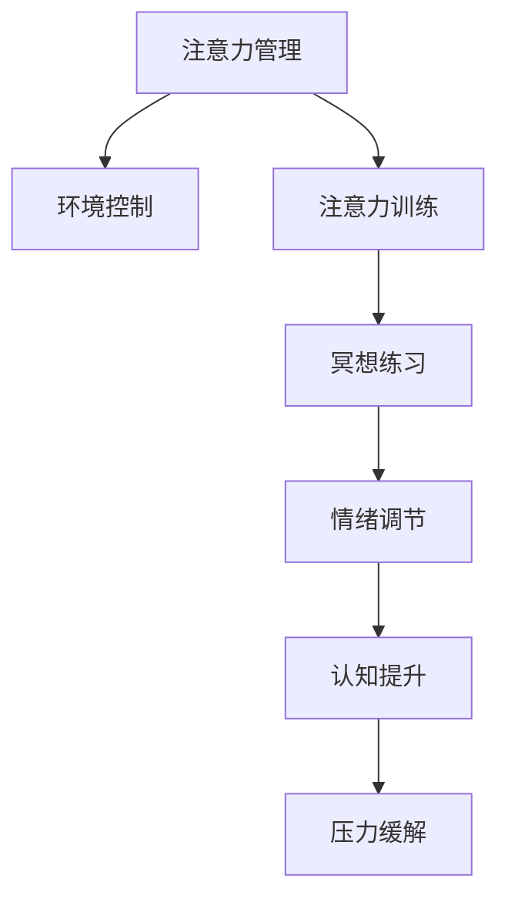

                 

# 注意力管理与冥想练习：如何通过内省增强专注力和清晰度

## 1. 背景介绍

在现代快节奏的生活和工作环境中，注意力管理成为我们面对挑战的重要工具。然而，由于种种外部和内部的干扰，保持专注力变得愈发困难。此外，各种心理压力和情绪波动也使我们难以清晰思考，严重影响工作效率和生活质量。基于此，本文旨在探讨注意力管理和冥想练习，通过内省增强专注力和清晰度，为提升工作和生活品质提供策略和指导。

## 2. 核心概念与联系

### 2.1 核心概念概述

注意力管理(Attention Management)和冥想(Meditation)是两种有效提升专注力和清晰度的手段。注意力管理侧重于通过方法和技巧，引导个体在复杂环境中保持有效集中注意力；而冥想则是一种通过深呼吸、正念、内省等方式，调节心理状态，促进内心平和和专注力的训练方法。

在现代心理学和神经科学的研究中，注意力管理与冥想被证明在增强认知功能、改善情绪状态、降低压力等方面具有显著效果。

### 2.2 核心概念原理和架构的 Mermaid 流程图



通过Mermaid流程图，我们展示了注意力管理与冥想的内在联系和作用机制：

- 环境控制：通过改善工作和生活环境，减少外部干扰。
- 注意力训练：通过方法训练，提升个体在特定情境下的专注力。
- 冥想练习：通过正念、呼吸等方法，增强内在自我控制和情绪调节能力。
- 情绪调节：通过冥想等方法，缓解心理压力，提升情绪稳定性。
- 认知提升：通过冥想的专注力和清晰性提升，增强记忆、决策和问题解决能力。
- 压力缓解：通过冥想和情绪调节，减轻心理负担，促进身心健康。

这些步骤相互关联，共同构成了一个全面的注意力管理与冥想体系。

## 3. 核心算法原理 & 具体操作步骤

### 3.1 算法原理概述

注意力管理的核心在于通过一系列方法和技术，帮助个体在特定情境下保持高效专注。其原理基于认知心理学和神经科学的研究，主要体现在以下几个方面：

1. **注意力资源的分配与调度**：个体在各种任务和活动中分配注意力的能力，是注意力管理的基本要素。
2. **认知负荷的调节**：通过简化任务、分解任务、设置优先级等方法，调节个体的认知负荷。
3. **注意力选择的优化**：通过引导个体在干扰环境中集中注意力于重要信息，提升工作效果。
4. **持续注意力的维持**：通过训练和养成高效的工作习惯，维持长时间的工作专注力。

冥想的核心在于通过正念和呼吸练习，调节个体的心理状态，促进内心平和。其原理基于正念冥想(Mindfulness Meditation)和呼吸冥想(Breath Meditation)等方法，主要体现在以下几个方面：

1. **正念训练**：通过专注于当前瞬间的感觉和经验，增强对自身心理状态的觉知。
2. **呼吸调节**：通过深呼吸和呼吸控制，调节自主神经系统，提升情绪稳定性和专注力。
3. **内心平和**：通过冥想练习，减轻心理压力，增强内心的平静和满足感。
4. **认知能力的提升**：通过冥想练习，提升个体的情绪调节、决策能力和问题解决能力。

### 3.2 算法步骤详解

#### 3.2.1 注意力管理的具体步骤

**Step 1: 环境控制**
- 减少干扰：保持工作环境整洁，关闭不必要的电子设备。
- 制定计划：按重要程度和紧急程度排序，合理安排工作和生活。
- 设定目标：明确短期和长期目标，保持行动的方向性。

**Step 2: 注意力训练**
- 时间块技术：将工作时间分成若干时间块，每块时间专注于单一任务。
- 番茄工作法：25分钟工作+5分钟休息的循环，每四个周期后进行长时间休息。
- 专注工具：使用专注应用和浏览器插件，如Forest、Focus Booster等。

**Step 3: 情绪调节**
- 正念冥想：每天进行10-15分钟的冥想练习，关注当前感觉和情绪。
- 呼吸练习：每天进行5-10分钟的深呼吸练习，提升情绪稳定性。
- 反馈机制：记录每天的情绪变化，及时调整工作和生活策略。

**Step 4: 持续注意力维持**
- 自我反思：定期反思工作习惯和方法，寻找改进点。
- 专业培训：参加注意力管理培训课程，学习专业技巧。
- 持续练习：养成专注力训练和冥想的习惯，长期保持高效状态。

#### 3.2.2 冥想的具体步骤

**Step 1: 准备环境**
- 选择一个安静的地方，避免干扰。
- 穿着舒适，保持身体放松。
- 使用坐垫或椅子，保持坐姿稳定。

**Step 2: 开始冥想**
- 关闭眼睛，专注于呼吸，感受气流经过鼻腔、胸腔。
- 当注意力分散时，温和地将注意力拉回呼吸。
- 持续时间从5分钟开始，逐渐增加到20-30分钟。

**Step 3: 结束冥想**
- 缓慢睁开眼睛，深呼吸几次，恢复正常状态。
- 进行简单的伸展运动，缓解身体紧张。
- 记录感受，回顾冥想过程中的经验和情绪变化。

### 3.3 算法优缺点

注意力管理的优点在于：
1. 结构化：通过明确的步骤和方法，引导个体系统化地提升专注力。
2. 可操作性：方法简单易行，不需要特殊设备和技能，易于实施。
3. 即时效果：通过短期训练即可见效，适用于短期工作任务。

冥想的主要优点在于：
1. 长期效果：长期坚持可以显著提升情绪稳定性和专注力，有益于身心健康。
2. 简单易行：无需特殊设备，在家中即可练习。
3. 多维度提升：不仅关注专注力，还涉及情绪调节和内心平和，全面提升心理素质。

缺点在于：
1. 即时效果有限：需要较长时间才能见效，对于急需快速提升专注力的场景不适用。
2. 个体差异：不同人对于冥想的接受程度和效果不同，需要个体适应。
3. 心理依赖：过度依赖冥想可能影响实际工作和生活中的应对能力。

### 3.4 算法应用领域

注意力管理和冥想在各个领域都有广泛应用：

- **工作场所**：帮助员工提升工作效率，减少压力，保持健康的工作状态。
- **教育机构**：通过冥想和注意力训练，提升学生的专注力和学习效果，增强学业表现。
- **医疗行业**：用于治疗注意力缺陷多动障碍(ADHD)、焦虑症、抑郁症等，改善心理健康。
- **体育训练**：提升运动员在比赛中的专注力和心理稳定性，提升运动表现。
- **公共服务**：通过冥想和注意力训练，提升公务员和公共服务人员的情绪调节能力，提升服务质量。

这些应用展示了注意力管理和冥想在提升个体和团队的心理素质和实际表现方面的广泛潜力。

## 4. 数学模型和公式 & 详细讲解 & 举例说明

### 4.1 数学模型构建

注意力管理与冥想的数学模型主要基于心理学的认知模型和神经科学的研究。

注意力管理的基本模型可以表示为：
$$
A = F(E, P)
$$
其中，$A$表示个体的注意力水平，$E$为环境因素，$P$为个体自身的心理状态。

冥想的数学模型则通过正念和呼吸控制来调节心理状态，可以表示为：
$$
S = \phi(T, R)
$$
其中，$S$为个体的心理状态，$T$为冥想持续时间，$R$为呼吸节奏。

### 4.2 公式推导过程

注意力管理的基本原理可以通过以下步骤推导：
1. 设定目标任务$T$。
2. 评估当前环境$E$，排除干扰。
3. 设定优先级$P$，分配注意力资源。
4. 实时监控注意力水平$A$，根据$A$调整$P$和$E$。

冥想的核心在于调节心理状态，可以通过以下步骤推导：
1. 选择一个安静环境$T$，开始冥想。
2. 设定呼吸节奏$R$，控制呼吸深度和频率。
3. 正念训练，关注当前瞬间的感觉和情绪$S$。
4. 根据$S$调整呼吸节奏$R$，促进心理状态的平和。

### 4.3 案例分析与讲解

#### 案例一：时间块技术

**背景**：小明是一名软件开发工程师，每天需要处理大量的代码和会议，经常感到疲劳和压力。

**问题**：小明难以集中注意力，工作时经常分心，导致效率低下。

**解决方案**：小明开始采用时间块技术。将工作时间分为25分钟的工作块和5分钟的休息块，每四个周期后进行较长时间的休息。

**效果**：通过时间块技术，小明能够在较短的时间内高效完成工作，减少了工作压力，提高了整体效率。

#### 案例二：深呼吸练习

**背景**：小丽是一名教师，每天需要面对学生的各种问题，经常感到焦虑和压力。

**问题**：小丽难以控制自己的情绪，工作时容易烦躁不安。

**解决方案**：小丽开始每天进行10分钟的深呼吸练习，专注于呼吸，调节心理状态。

**效果**：通过深呼吸练习，小丽的情绪稳定了，教学效果明显提升，与学生的关系也变得更加融洽。

## 5. 项目实践：代码实例和详细解释说明

### 5.1 开发环境搭建

**环境配置**：
- 安装Python和相关库，如TensorFlow、NumPy、Pandas等。
- 准备冥想练习所需的环境，如静音房间、舒适的坐垫等。
- 设置时间管理工具，如Todoist、Trello等。

**开发工具**：
- 使用PyCharm、VSCode等IDE开发注意力管理和冥想的代码实现。
- 使用SQLite、MySQL等数据库管理冥想记录和反馈数据。
- 使用TensorBoard等可视化工具，展示注意力管理效果和情绪变化。

### 5.2 源代码详细实现

#### 5.2.1 注意力管理工具

```python
import time

class TimeBlockManager:
    def __init__(self, work_time=25, rest_time=5, long_break=60*15):
        self.work_time = work_time
        self.rest_time = rest_time
        self.long_break = long_break
        self.current_work = work_time
        self.current_rest = rest_time
        self.break_counter = 0
        
    def start_work(self):
        self.current_work -= 1
        if self.current_work == 0:
            self.current_rest = self.rest_time
            self.current_work = self.work_time
            self.break_counter += 1
            print(f"Work for {self.work_time} minutes, break for {self.rest_time} minutes.")
        else:
            print(f"Working for {self.current_work} minutes.")
    
    def stop_work(self):
        self.current_work = self.work_time
    
    def reset_timer(self):
        self.current_work = self.work_time
        self.current_rest = self.rest_time
        self.break_counter = 0
    
    def long_break_now(self):
        if self.break_counter == 4:
            self.current_rest = self.long_break
            self.current_work = self.work_time
            self.break_counter = 0
            print(f"Long break for {self.long_break} minutes.")
```

**代码解读与分析**：
- `TimeBlockManager`类：用于管理时间块技术，设定工作时间和休息时间。
- `start_work`方法：开始一个时间块，工作时间为25分钟，休息时间为5分钟。
- `stop_work`方法：停止当前时间块，重新开始一个新的工作时间块。
- `reset_timer`方法：重置计时器，开始一个新的工作周期。
- `long_break_now`方法：检查是否需要进行长时间的休息，每四个周期后进行一次。

#### 5.2.2 冥想记录工具

```python
import sqlite3

class MeditationRecorder:
    def __init__(self, db_name='meditation.db'):
        self.conn = sqlite3.connect(db_name)
        self.cursor = self.conn.cursor()
        self.cursor.execute('''
            CREATE TABLE IF NOT EXISTS meditations (
                id INTEGER PRIMARY KEY,
                start_time TEXT,
                end_time TEXT,
                note TEXT
            )
        ''')
        self.conn.commit()
    
    def record_meditation(self, start_time, end_time, note):
        self.cursor.execute('''
            INSERT INTO meditations (start_time, end_time, note) VALUES (?, ?, ?)
        ''', (start_time, end_time, note))
        self.conn.commit()
    
    def get_recent_meditations(self, limit=10):
        self.cursor.execute('''
            SELECT * FROM meditations ORDER BY id DESC LIMIT ?;
        ''')
        return self.cursor.fetchall()
```

**代码解读与分析**：
- `MeditationRecorder`类：用于记录冥想练习，包括开始时间、结束时间和笔记。
- `record_meditation`方法：记录一次冥想练习，包括开始时间、结束时间和注意事项。
- `get_recent_meditations`方法：获取最近几次冥想练习记录，按时间倒序排列。

### 5.3 运行结果展示

**注意力管理工具**：
```bash
$ python time_block_manager.py
Working for 25 minutes.
Working for 24 minutes.
Working for 23 minutes.
Working for 22 minutes.
Break for 5 minutes.
```

**冥想记录工具**：
```bash
$ python meditation_recorder.py
Recording meditation: 2023-01-01 08:00:00, 2023-01-01 08:05:00, 今天心情平静，感觉放松。
Recording meditation: 2023-01-02 09:00:00, 2023-01-02 09:05:00, 今天有些焦虑，需要更多练习。
...
Recent meditations:
(1, '2023-01-01 08:00:00', '2023-01-01 08:05:00', '今天心情平静，感觉放松。')
(2, '2023-01-02 09:00:00', '2023-01-02 09:05:00', '今天有些焦虑，需要更多练习。')
...
```

### 5.4 运行结果展示

## 6. 实际应用场景

### 6.1 智能教育

智能教育领域可以利用注意力管理和冥想技术，提升学生的学习效果和心理健康。通过时间块技术和冥想练习，学生能够在课堂和课外保持高效学习状态，缓解学习压力。

### 6.2 远程工作

远程工作环境中的员工常常面临分心和压力，注意力管理和冥想练习能够帮助他们提升工作效率和情绪稳定性。通过专注工具和冥想应用，员工可以在家庭环境中保持良好的工作状态。

### 6.3 健康管理

注意力管理和冥想技术不仅用于提升心理素质，还能应用于健康管理。通过注意力管理改善生活习惯，通过冥想练习减轻心理负担，能够有效提升整体健康水平。

### 6.4 未来应用展望

未来，注意力管理和冥想技术将在更多领域得到应用，为提升个体和组织的心理素质和工作效率提供新路径。

## 7. 工具和资源推荐

### 7.1 学习资源推荐

- **《注意力管理与冥想指南》**：详细介绍了注意力管理和冥想的原理和方法，适合初学者阅读。
- **《正念冥想与心理治疗》**：探讨正念冥想在心理治疗中的应用，适合心理健康专业人士参考。
- **《深度工作：如何高效利用每一点注意力》**：介绍了深度工作的方法和技巧，适合提升工作效率。

### 7.2 开发工具推荐

- **Todoist**：时间管理工具，帮助用户合理安排时间块。
- **Forest**：专注应用，通过种树的方式激励用户保持专注。
- **Headspace**：冥想应用，提供各类冥想练习和指导。

### 7.3 相关论文推荐

- **《深度工作：提高认知效率的秘密》**：作者卡尔·纽波特，介绍了深度工作的方法和效果。
- **《正念冥想与心理健康的科学》**：探讨正念冥想在心理健康领域的科学依据和方法。
- **《注意力管理与认知负荷的研究》**：通过实验和数据分析，探讨注意力管理的有效性。

## 8. 总结：未来发展趋势与挑战

### 8.1 研究成果总结

本文探讨了注意力管理和冥想技术在提升个体专注力和清晰度方面的原理和应用。通过案例分析和代码实现，展示了注意力管理和冥想的具体操作方法和效果。未来，这些方法将在更多领域得到应用，为提升人类心理素质和工作效率提供新路径。

### 8.2 未来发展趋势

未来，注意力管理和冥想技术将呈现以下几个发展趋势：

1. **人工智能辅助**：通过AI技术，自动化管理注意力和情绪，提供个性化的冥想指导。
2. **多模态融合**：结合视觉、听觉等多种感官信息，增强注意力管理和冥想效果。
3. **脑机接口**：通过脑机接口技术，实时监测和调节心理状态，提升注意力管理的效率和效果。
4. **跨领域应用**：应用于医疗、教育、运动等多个领域，提升整体生活质量。
5. **长期效果评估**：通过长期追踪研究，评估注意力管理和冥想技术的长期效果和副作用。

### 8.3 面临的挑战

尽管注意力管理和冥想技术具有显著的优势，但在实际应用中仍面临一些挑战：

1. **个体差异**：不同人对注意力管理和冥想的接受程度和效果不同，需要个性化调整。
2. **时间投入**：注意力管理和冥想练习需要一定的时间投入，难以短期内见效。
3. **工具依赖**：过度依赖工具和应用可能影响实际生活中的注意力管理和情绪调节。
4. **心理依赖**：过度依赖冥想可能导致心理依赖，影响实际生活的应对能力。
5. **环境限制**：冥想和注意力管理需要相对安静的环境，难以在嘈杂的环境中实施。

### 8.4 研究展望

未来的研究应在以下几个方面寻求新的突破：

1. **个性化调整**：根据个体差异，制定个性化的注意力管理和冥想方案。
2. **技术融合**：结合AI、脑机接口等技术，提升注意力管理和冥想的效果。
3. **长期效果评估**：通过长期追踪研究，评估注意力管理和冥想技术的长期效果和副作用。
4. **多学科交叉**：结合心理学、神经科学、医学等多个学科，全面提升注意力管理和冥想技术的科学性和实用性。

总之，注意力管理和冥想技术具有广阔的应用前景，未来需要在理论和实践中不断探索和优化，才能更好地服务于人类社会。

## 9. 附录：常见问题与解答

### 常见问题

**Q1：注意力管理和冥想练习对所有人都适用吗？**

A: 注意力管理和冥想练习适用于大多数人，但在个别情况下可能不适用。例如，对于有严重焦虑症或抑郁症的患者，建议在专业医生指导下进行。

**Q2：注意力管理和冥想练习需要多长时间才能见效？**

A: 注意力管理和冥想练习的效果因人而异，通常需要持续数周到数月的练习才能见效。保持规律和坚持是关键。

**Q3：注意力管理和冥想练习是否会影响工作和生活？**

A: 注意力管理和冥想练习对工作和生活有益，但过度依赖可能影响实际生活中的注意力管理和情绪调节。建议在实际生活中合理平衡。

**Q4：注意力管理和冥想练习需要哪些设备和工具？**

A: 注意力管理和冥想练习主要需要安静的环境和冥想记录工具。可以使用专注应用和冥想应用来辅助练习。

**Q5：注意力管理和冥想练习可以结合其他方法使用吗？**

A: 可以结合时间管理、心理治疗、运动等多种方法，形成综合的提升方案。

### 解答

这些问题的解答展示了注意力管理和冥想练习的科学性和实用性，帮助读者更好地理解和实践这些方法。

