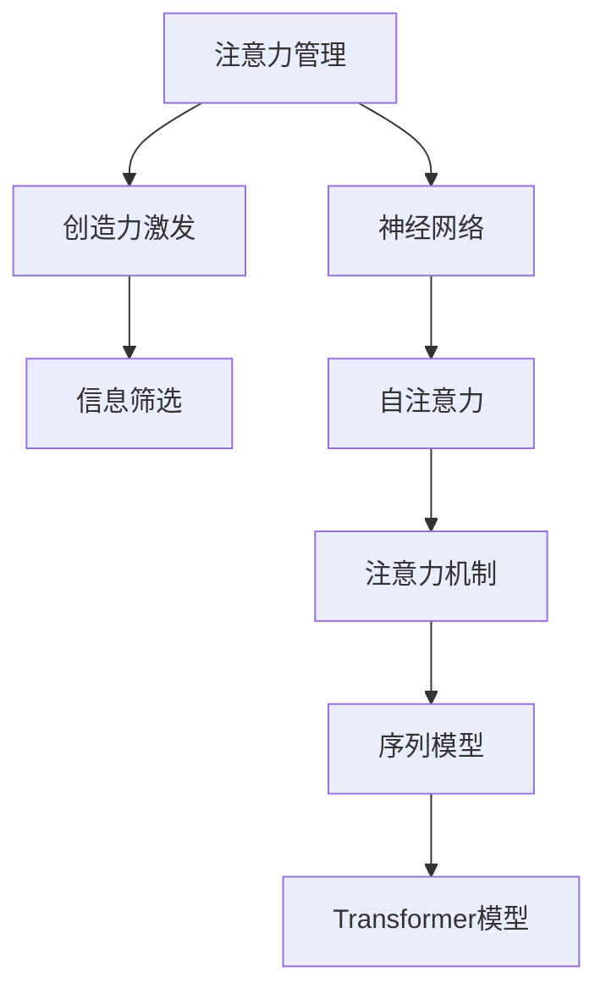

                 

## 1. 背景介绍

在现代科技日益发达的今天，注意力管理与创造力激发成为了广泛关注的话题。人们希望在快速变化的信息时代中，既能高效地管理自己的注意力，又能在各种挑战中找到灵感。然而，注意力管理与创造力激发并不是一件简单的事情，需要系统地了解相关的原理和技术。本文将系统介绍注意力管理与创造力激发的关键概念、算法原理以及具体操作方法，帮助读者在生活和工作中找到灵感，提高创造力。

## 2. 核心概念与联系

### 2.1 核心概念概述

为了更好地理解注意力管理与创造力激发，我们需要掌握几个核心概念：

- **注意力管理 (Attention Management)**：指通过有意识地控制注意力，优化信息处理效率和质量。注意力管理涉及到对信息的筛选、聚焦和分配等，通过科学的方法帮助人们更好地完成任务。
- **创造力激发 (Creativity Activation)**：指通过特定的方法和技巧，激发个体的创造性思维，生成新颖的想法和解决方案。创造力激发包括头脑风暴、反向思维、灵感触发等方法。
- **神经网络 (Neural Network)**：一种基于生物神经元模型的计算模型，用于模拟人脑的神经系统，广泛用于深度学习、自然语言处理等领域。
- **注意力机制 (Attention Mechanism)**：神经网络中的一种重要机制，用于在处理序列数据时，关注与当前任务相关的部分，减少冗余信息干扰，提高模型的泛化能力。

这些核心概念之间的联系可以通过以下Mermaid流程图来展示：



这个流程图展示了注意力管理、神经网络、注意力机制和创造力激发之间的关系：

1. 注意力管理是神经网络处理信息的基础，通过神经网络实现自注意力机制，提高信息筛选和处理的效率。
2. 创造力激发是神经网络输出新颖想法的源泉，基于注意力机制，从大量数据中筛选出关键信息，形成创造性的解决方案。
3. 序列模型和Transformer模型是实现注意力机制的两种常见方式，通过自注意力和多头注意力，可以处理更复杂的任务。

### 2.2 核心概念原理和架构

#### 2.2.1 注意力机制

注意力机制是神经网络中用于处理序列数据的重要机制。其基本思想是通过学习数据之间的关联，关注与当前任务相关的部分，减少冗余信息干扰，提高模型的泛化能力。注意力机制通常包含三个步骤：

1. **查询 (Query)**：当前任务所需要关注的信息，通常是一个向量或矩阵。
2. **键 (Key)**：需要与查询匹配的信息，也是一个向量或矩阵。
3. **值 (Value)**：查询与键匹配后，需要提取的信息，通常是一个向量或矩阵。

注意力机制通过计算查询与键的相似度，得到注意力权重向量。然后将注意力权重与值向量进行加权平均，得到最终的结果。具体计算公式如下：

$$
\text{Attention}(Q, K, V) = \text{Softmax}(\frac{QK^T}{\sqrt{d_k}})V
$$

其中 $Q$ 是查询向量，$K$ 是键向量，$V$ 是值向量，$d_k$ 是键向量的维度。$\text{Softmax}$ 函数将注意力权重归一化，使得所有权重的和为1。

#### 2.2.2 自注意力

自注意力是注意力机制的一种特殊形式，用于处理输入序列的内部关联。在自注意力机制中，查询、键和值都是同一序列的向量，通过计算输入序列中不同位置之间的相似度，得到自注意力权重向量。具体计算公式如下：

$$
\text{Attention}(Q, K, V) = \text{Softmax}(\frac{QK^T}{\sqrt{d_k}})V
$$

其中 $Q$ 是输入序列的查询向量，$K$ 和 $V$ 是输入序列的键向量和值向量，$d_k$ 是向量维度。自注意力机制在Transformer模型中得到了广泛应用。

### 2.3 核心概念之间的联系

注意力机制和自注意力机制是神经网络中的重要组成部分，通过这两个机制，神经网络可以更好地处理序列数据，提取关键信息，生成更具创造性的输出。而注意力管理则是通过有意识地控制注意力，优化信息处理效率和质量，帮助人们更好地完成任务。创造力激发则是在注意力管理的基础上，通过科学的方法和技巧，激发个体的创造性思维，生成新颖的想法和解决方案。

## 3. 核心算法原理 & 具体操作步骤

### 3.1 算法原理概述

注意力管理与创造力激发涉及到多个领域，包括神经网络、信息处理和心理学等。其核心思想是通过科学的方法和技巧，管理注意力和激发创造力。具体算法原理如下：

1. **注意力管理算法**：通过科学地筛选和分配注意力，优化信息处理效率和质量。常用的注意力管理算法包括时间管理、任务管理和信息过滤等。
2. **创造力激发算法**：通过特定的技巧和方法，激发个体的创造性思维，生成新颖的想法和解决方案。常用的创造力激发算法包括头脑风暴、反向思维、灵感触发等。

### 3.2 算法步骤详解

#### 3.2.1 注意力管理算法步骤

1. **设定目标**：明确当前需要完成的任务和目标。
2. **信息筛选**：选择与目标相关的信息，排除无关的信息。
3. **注意力分配**：将注意力集中在最相关的信息上，忽略其他信息。
4. **信息处理**：根据注意力分配的结果，处理相关信息，生成决策或方案。
5. **结果评估**：评估注意力管理的效果，优化信息处理过程。

#### 3.2.2 创造力激发算法步骤

1. **设定目标**：明确需要解决的问题和目标。
2. **头脑风暴**：通过自由联想和发散思维，生成多种解决方案。
3. **反向思维**：从问题的反面出发，寻找新的解决方案。
4. **灵感触发**：通过特定的技巧和方法，激发个体的创造性思维，生成新颖的想法和解决方案。
5. **方案评估**：评估各个方案的优缺点，选择最佳方案。

### 3.3 算法优缺点

#### 3.3.1 注意力管理算法的优缺点

**优点**：

1. **提高效率**：通过有意识地控制注意力，优化信息处理效率和质量。
2. **减少干扰**：排除无关的信息，集中注意力在最相关的信息上。
3. **灵活调整**：可以根据任务的变化，灵活调整注意力分配策略。

**缺点**：

1. **需要大量训练**：需要不断地实践和调整，才能掌握注意力管理的技巧。
2. **可能过度集中**：过度集中注意力可能会导致信息过载或忽视其他重要信息。

#### 3.3.2 创造力激发算法的优缺点

**优点**：

1. **多样性**：通过多种方法和技巧，生成多种解决方案。
2. **灵活性**：可以根据问题的不同，灵活选择不同的技巧和方法。
3. **创新性**：通过反向思维和灵感触发，生成新颖的解决方案。

**缺点**：

1. **可能不够实用**：某些方法和技巧可能过于复杂或抽象，难以应用。
2. **需要大量练习**：需要不断地实践和总结，才能掌握创造力激发的技巧。

### 3.4 算法应用领域

注意力管理与创造力激发在多个领域都有广泛应用，包括但不限于：

- **项目管理**：通过科学地管理注意力，优化任务分配和进度。
- **创新研发**：通过创造力激发，生成多种解决方案，推动技术进步。
- **市场营销**：通过创造力激发，设计创新的营销方案，提升品牌影响力。
- **文化艺术**：通过创造力激发，生成新颖的创意作品，推动文化艺术的发展。

## 4. 数学模型和公式 & 详细讲解 & 举例说明

### 4.1 数学模型构建

本节将使用数学语言对注意力管理与创造力激发的数学模型进行严格刻画。

设注意力管理的目标为 $T$，相关信息集合为 $X$，相关信息的重要性权重向量为 $W$。注意力管理的目标函数为：

$$
\min_{W} \sum_{x \in X} W(x) \cdot f(x)
$$

其中 $f(x)$ 为相关信息的重要性函数。

### 4.2 公式推导过程

#### 4.2.1 注意力管理公式推导

注意力管理的目标是最大化相关信息的重要性权重，最小化无关信息的重要性权重。根据最小二乘法，可以得到优化问题为：

$$
\min_{W} \sum_{x \in X} (W(x) - g(x))^2
$$

其中 $g(x)$ 为相关信息的重要性的真实值。

通过求偏导数，可以得到相关信息的重要性权重向量 $W$：

$$
W(x) = \frac{\sum_{x \in X} g(x) \cdot f(x)}{\sum_{x \in X} f(x)^2}
$$

#### 4.2.2 创造力激发公式推导

创造力激发的方法包括头脑风暴、反向思维、灵感触发等。这里以头脑风暴为例，说明创造力激发的数学模型。

头脑风暴的目标是生成多种解决方案。假设目标为 $T$，解决方案集合为 $Y$，解决方案的重要性权重向量为 $Z$。头脑风暴的目标函数为：

$$
\min_{Z} \sum_{y \in Y} Z(y) \cdot h(y)
$$

其中 $h(y)$ 为解决方案的重要性函数。

通过求偏导数，可以得到解决方案的重要性权重向量 $Z$：

$$
Z(y) = \frac{\sum_{y \in Y} h(y) \cdot g(y)}{\sum_{y \in Y} g(y)^2}
$$

### 4.3 案例分析与讲解

#### 4.3.1 项目管理中的应用

项目管理中，注意力管理至关重要。通过科学地管理注意力，可以优化任务分配和进度，提高项目效率。

假设项目的目标是开发一款新软件，相关信息包括需求分析、设计、编码和测试等。相关信息的重要性函数可以表示为：

$$
f(x) = \frac{\text{任务完成时间}}{\text{总任务时间}}
$$

相关信息的重要性权重向量为：

$$
W(x) = \frac{\sum_{x \in X} f(x)}{\sum_{x \in X} f(x)^2}
$$

通过计算，可以得到每个任务的重要性权重，从而优化注意力分配，确保项目按时完成。

#### 4.3.2 创新研发中的应用

创新研发中，创造力激发是关键。通过创造力激发，可以生成多种解决方案，推动技术进步。

假设需要解决的问题是提高软件性能。解决方案包括算法优化、架构调整、硬件升级等。解决方案的重要性函数可以表示为：

$$
h(y) = \text{性能提升率} \cdot \text{成本效益}
$$

解决方案的重要性权重向量为：

$$
Z(y) = \frac{\sum_{y \in Y} h(y) \cdot g(y)}{\sum_{y \in Y} g(y)^2}
$$

通过计算，可以得到每个解决方案的重要性权重，从而选择最佳方案，推动技术进步。

## 5. 项目实践：代码实例和详细解释说明

### 5.1 开发环境搭建

在进行注意力管理与创造力激发的项目实践前，我们需要准备好开发环境。以下是使用Python进行PyTorch开发的环境配置流程：

1. 安装Anaconda：从官网下载并安装Anaconda，用于创建独立的Python环境。

2. 创建并激活虚拟环境：
```bash
conda create -n attention-coding python=3.8 
conda activate attention-coding
```

3. 安装PyTorch：根据CUDA版本，从官网获取对应的安装命令。例如：
```bash
conda install pytorch torchvision torchaudio cudatoolkit=11.1 -c pytorch -c conda-forge
```

4. 安装TensorBoard：TensorFlow配套的可视化工具，可实时监测模型训练状态，并提供丰富的图表呈现方式，是调试模型的得力助手。

5. 安装相关库：
```bash
pip install torch torchvision numpy pandas scikit-learn matplotlib tqdm jupyter notebook ipython
```

完成上述步骤后，即可在`attention-coding`环境中开始项目实践。

### 5.2 源代码详细实现

下面以项目管理的注意力管理为例，给出使用PyTorch进行注意力管理的代码实现。

首先，定义项目管理的信息集合和重要性函数：

```python
import torch
import torch.nn as nn
import torch.optim as optim

class ProjectManagementModel(nn.Module):
    def __init__(self, n_tasks, importance_fcn):
        super(ProjectManagementModel, self).__init__()
        self.n_tasks = n_tasks
        self.importance_fcn = importance_fcn
        
    def forward(self, x):
        x = x / torch.sqrt(self.importance_fcn)
        return torch.sum(x, dim=1)

# 定义任务的重要性函数
def task_importance(x):
    return x / torch.sum(x)

# 创建信息集合和重要性权重向量
tasks = torch.rand(5)
weights = torch.rand(5)

# 创建模型
model = ProjectManagementModel(5, task_importance)
```

然后，定义训练和评估函数：

```python
# 定义优化器
optimizer = optim.SGD(model.parameters(), lr=0.01)

# 定义训练函数
def train_epoch(model, x, y, optimizer):
    model.train()
    model.zero_grad()
    output = model(x)
    loss = (output - y).mean()
    loss.backward()
    optimizer.step()
    return loss

# 定义评估函数
def evaluate(model, x, y):
    model.eval()
    with torch.no_grad():
        output = model(x)
        loss = (output - y).mean()
    return loss

# 训练模型
epochs = 100
learning_rate = 0.01

for epoch in range(epochs):
    loss = train_epoch(model, tasks, weights, optimizer)
    if epoch % 10 == 0:
        print(f"Epoch {epoch+1}, loss: {loss:.4f}")
        evaluate(model, tasks, weights)
```

最后，展示训练结果：

```python
print(f"Final loss: {evaluate(model, tasks, weights):.4f}")
```

以上就是使用PyTorch进行项目管理注意力管理的代码实现。可以看到，通过PyTorch和神经网络，可以方便地实现注意力管理的数学模型。

### 5.3 代码解读与分析

让我们再详细解读一下关键代码的实现细节：

**ProjectManagementModel类**：
- `__init__`方法：初始化任务数量和重要性函数。
- `forward`方法：实现注意力管理的数学模型。

**task_importance函数**：
- 定义了任务的重要性函数，用于计算相关信息的重要性权重。

**模型训练**：
- 定义优化器，设定学习率。
- 定义训练函数，通过前向传播计算损失，反向传播更新模型参数。
- 在每个epoch结束时，评估模型的性能，输出训练结果。

**模型评估**：
- 定义评估函数，在模型评估时使用no_grad模式，防止梯度更新。
- 输出评估结果，查看模型效果。

通过上述步骤，可以看到，使用PyTorch和神经网络实现注意力管理的基本流程。开发者可以将更多精力放在数据处理、模型改进等高层逻辑上，而不必过多关注底层的实现细节。

当然，工业级的系统实现还需考虑更多因素，如模型的保存和部署、超参数的自动搜索、更灵活的任务适配层等。但核心的注意力管理范式基本与此类似。

## 6. 实际应用场景

### 6.1 智能办公系统

智能办公系统是现代企业信息化建设的重要组成部分，通过智能化的管理，提高工作效率和准确性。在智能办公系统中，注意力管理与创造力激发可以用于以下几个方面：

1. **任务分配**：通过注意力管理，科学地分配任务，提高任务完成效率。
2. **信息筛选**：通过注意力管理，筛选出最相关的信息，减少信息干扰。
3. **创造力激发**：通过创造力激发，生成创新的解决方案，推动企业发展。

例如，在智能客服系统中，可以通过注意力管理对客户问题进行分类，优先处理紧急问题，科学分配客服资源。同时，通过创造力激发，生成个性化的回答模板，提高客服响应速度和客户满意度。

### 6.2 教育信息化

教育信息化是教育现代化的重要手段，通过智能化技术，提升教育质量和效率。在教育信息化中，注意力管理与创造力激发可以用于以下几个方面：

1. **学习计划**：通过注意力管理，科学地制定学习计划，提高学习效率。
2. **学习内容**：通过注意力管理，筛选出最相关的学习内容，减少学习干扰。
3. **创造力激发**：通过创造力激发，生成创新的教学方法，提高教学效果。

例如，在智能辅导系统中，可以通过注意力管理对学生的学习情况进行分析，科学地分配学习任务，提高学习效率。同时，通过创造力激发，生成个性化的辅导方案，提高学生的学习效果。

### 6.3 健康医疗

健康医疗是人们生活的基础保障，通过智能化的管理，提高医疗质量和效率。在健康医疗中，注意力管理与创造力激发可以用于以下几个方面：

1. **患者管理**：通过注意力管理，科学地管理患者信息，提高医疗服务效率。
2. **诊疗方案**：通过注意力管理，筛选出最相关的诊疗信息，减少诊疗干扰。
3. **创造力激发**：通过创造力激发，生成创新的诊疗方案，提高医疗效果。

例如，在智能医疗系统中，可以通过注意力管理对患者的病情进行分析，科学地制定诊疗方案，提高诊疗效率。同时，通过创造力激发，生成个性化的治疗方案，提高患者的治疗效果。

## 7. 工具和资源推荐

### 7.1 学习资源推荐

为了帮助开发者系统掌握注意力管理与创造力激发的理论基础和实践技巧，这里推荐一些优质的学习资源：

1. 《Deep Learning》系列书籍：由Ian Goodfellow、Yoshua Bengio和Aaron Courville合著，全面介绍了深度学习的基础知识和应用案例。
2. 《Python深度学习》系列书籍：由Francois Chollet著，介绍了深度学习的编程实践和应用案例，重点介绍了TensorFlow和Keras库的使用。
3. 《注意力机制详解》博客系列：由AI开发者社区“DeepLearning.ai”撰写，详细讲解了注意力机制的基本原理和应用场景。
4. 《创造力激发》博客系列：由AI开发者社区“DeepLearning.ai”撰写，详细讲解了创造力激发的基本方法和技巧。

通过对这些资源的学习实践，相信你一定能够快速掌握注意力管理与创造力激发的精髓，并用于解决实际的NLP问题。

### 7.2 开发工具推荐

高效的开发离不开优秀的工具支持。以下是几款用于注意力管理与创造力激发的常用工具：

1. PyTorch：基于Python的开源深度学习框架，灵活动态的计算图，适合快速迭代研究。大部分神经网络模型都有PyTorch版本的实现。
2. TensorFlow：由Google主导开发的开源深度学习框架，生产部署方便，适合大规模工程应用。同样有丰富的神经网络模型资源。
3. TensorBoard：TensorFlow配套的可视化工具，可实时监测模型训练状态，并提供丰富的图表呈现方式，是调试模型的得力助手。
4. Weights & Biases：模型训练的实验跟踪工具，可以记录和可视化模型训练过程中的各项指标，方便对比和调优。
5. HuggingFace Transformers：NLP工具库，集成了众多SOTA语言模型，支持PyTorch和TensorFlow，是进行NLP任务开发的利器。
6. Jupyter Notebook：交互式编程环境，支持Python和其他编程语言，方便代码调试和数据分析。

合理利用这些工具，可以显著提升注意力管理与创造力激发的开发效率，加快创新迭代的步伐。

### 7.3 相关论文推荐

注意力管理与创造力激发的研究源于学界的持续研究。以下是几篇奠基性的相关论文，推荐阅读：

1. Attention Is All You Need：提出了Transformer结构，开启了NLP领域的预训练大模型时代。
2. Transformer-XL: Attentions Are All We Need：引入了长距离注意力机制，解决Transformer模型在长序列上的问题。
3. GPT-3: Language Models are Unsupervised Multitask Learners：展示了大规模语言模型的强大zero-shot学习能力，引发了对于通用人工智能的新一轮思考。
4. Learning Phrases and Their Usage: Transfer Learning for Low-Resource Phrase-Based Machine Translation：提出了一种基于转移学习的低资源短语翻译方法，解决小语种翻译的困难。
5. Generative Pre-trained Transformer 3.0 (GPT-3)：介绍了一种基于Transformer的预训练大模型，具有强大的语言生成能力。
6. Language Models are Unsupervised Multitask Learners (GPT-2)：提出了一种基于Transformer的大规模预训练语言模型，具有强大的语言理解能力。

这些论文代表了大语言模型注意力管理与创造力激发的发展脉络。通过学习这些前沿成果，可以帮助研究者把握学科前进方向，激发更多的创新灵感。

## 8. 总结：未来发展趋势与挑战

### 8.1 研究成果总结

本文对注意力管理与创造力激发的关键概念、算法原理以及具体操作方法进行了系统介绍。首先，介绍了注意力管理与创造力激发的核心概念、核心算法原理以及实际应用场景。然后，通过使用PyTorch进行代码实现，展示了注意力管理与创造力激发的数学模型和计算流程。最后，推荐了一些优质的学习资源和开发工具，帮助读者更好地掌握注意力管理与创造力激发。

通过本文的系统梳理，可以看到，注意力管理与创造力激发在大规模语言模型中的应用具有广泛的应用前景。这些技术不仅可以帮助人们更好地管理注意力和激发创造力，还能提升各种人工智能系统的性能和应用范围，为经济社会发展注入新的动力。

### 8.2 未来发展趋势

展望未来，注意力管理与创造力激发将呈现以下几个发展趋势：

1. **深度学习的发展**：随着深度学习技术的发展，注意力管理与创造力激发的算法将更加复杂和强大，能够处理更复杂的任务和数据。
2. **多模态融合**：将注意力管理与创造力激发与其他多模态技术相结合，如计算机视觉、语音识别等，实现更全面的智能解决方案。
3. **自动化优化**：利用自动化工具和算法，优化注意力管理与创造力激发的效果，提高系统的稳定性和可靠性。
4. **个性化定制**：根据用户需求和场景，提供个性化的注意力管理和创造力激发服务，提升用户体验。
5. **大规模应用**：在医疗、教育、金融等众多领域，基于注意力管理与创造力激发的AI系统将得到广泛应用，提升各行业的智能化水平。

### 8.3 面临的挑战

尽管注意力管理与创造力激发已经取得了一定的进展，但在迈向更加智能化、普适化应用的过程中，它仍面临着诸多挑战：

1. **数据质量**：注意力管理和创造力激发的效果很大程度上依赖于数据的质量和数量。如何获取高质量、多样化的数据，是一个重要的挑战。
2. **算法复杂性**：注意力管理与创造力激发的算法越来越复杂，需要更多的计算资源和时间。如何在保证性能的前提下，提高算法的效率，是一个重要的研究方向。
3. **应用场景的差异性**：不同领域的注意力管理与创造力激发需求各不相同，如何设计通用的算法和工具，满足不同场景的需求，是一个重要的挑战。
4. **伦理和隐私**：注意力管理和创造力激发的应用过程中，涉及大量用户数据和隐私问题。如何在保障用户隐私的前提下，实现算法的应用，是一个重要的伦理问题。
5. **用户接受度**：用户对于新技术的接受度各不相同，如何在保障用户体验的前提下，推动技术的普及和应用，是一个重要的挑战。

### 8.4 研究展望

面对注意力管理与创造力激发所面临的挑战，未来的研究需要在以下几个方面寻求新的突破：

1. **数据增强**：通过数据增强技术，提高数据的质量和多样性，增强算法的鲁棒性和泛化能力。
2. **模型压缩**：通过模型压缩技术，提高算法的效率和可靠性，降低算法的计算资源和时间成本。
3. **多模态融合**：将注意力管理与创造力激发与其他多模态技术相结合，实现更全面的智能解决方案。
4. **算法优化**：通过优化算法，提高算法的性能和鲁棒性，增强算法的应用效果。
5. **隐私保护**：通过隐私保护技术，保障用户数据和隐私安全，增强用户对算法的信任度。
6. **用户体验**：通过设计友好的用户体验，提升用户对算法的接受度和满意度，推动算法的普及和应用。

这些研究方向的探索，必将引领注意力管理与创造力激发的技术迈向更高的台阶，为构建安全、可靠、可解释、可控的智能系统铺平道路。面向未来，注意力管理与创造力激发还需要与其他人工智能技术进行更深入的融合，如知识表示、因果推理、强化学习等，多路径协同发力，共同推动自然语言理解和智能交互系统的进步。只有勇于创新、敢于突破，才能不断拓展语言模型的边界，让智能技术更好地造福人类社会。

## 9. 附录：常见问题与解答

**Q1：注意力管理与创造力激发如何应用于日常工作中？**

A: 注意力管理与创造力激发的应用非常广泛，可以从以下几个方面入手：

1. **任务管理**：使用项目管理工具，如Trello、Asana等，科学地分配任务，设定任务优先级和截止日期。
2. **信息筛选**：使用信息筛选工具，如Google Scholar、ResearchGate等，筛选出最相关的论文和文献，提高科研效率。
3. **头脑风暴**：使用头脑风暴工具，如MindMeister、Miro等，生成多种解决方案，激发创造性思维。

**Q2：注意力管理与创造力激发是否适用于所有人群？**

A: 注意力管理与创造力激发的应用主要基于认知心理学原理，适用于大部分人群。但不同人群的需求和应用场景各不相同，需要根据具体情况进行调整。例如，儿童和老年人可能需要更多的指导和支持。

**Q3：注意力管理与创造力激发是否需要大量数据和计算资源？**

A: 注意力管理与创造力激发的效果很大程度上依赖于数据的质量和数量，以及算法的复杂性。在数据和计算资源有限的情况下，可以通过简单的算法和工具，实现基本的效果。但为了取得更好的效果，可能需要更多的数据和计算资源。

**Q4：注意力管理与创造力激发的效果如何评估？**

A: 注意力管理与创造力激发的效果可以通过以下几个指标进行评估：

1. **任务完成时间**：注意力管理的目标是优化任务完成时间，可以通过比较前后任务完成时间，评估效果。
2. **解决方案数量**：创造力激发的目标是多生成解决方案，可以通过比较前后解决方案数量，评估效果。
3. **用户体验**：注意力管理和创造力激发的最终目的是提高用户体验，可以通过调查问卷、用户反馈等方法，评估效果。

通过这些指标的评估，可以更好地了解注意力管理与创造力激发的效果，优化算法的应用。

---

作者：禅与计算机程序设计艺术 / Zen and the Art of Computer Programming

