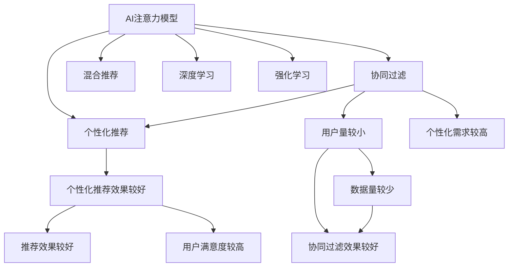

                 

# 注意力经济2.0：AI重塑的价值交换系统

## 1. 背景介绍

### 1.1 问题由来
随着互联网和移动互联网的普及，我们生活的方方面面都离不开信息流。信息流为我们提供了便捷、多样的信息获取渠道，也成为注意力经济的重要载体。在注意力经济时代，如何高效、精准地获取、筛选和利用信息，成为企业和个人必须面对的挑战。

信息流的本质是注意力争夺。不同的平台、服务、产品，通过提供不同的信息内容和服务体验，争夺用户的注意力资源。如何利用AI技术，提升信息流的效率和效果，成为当前技术发展的重要方向。

### 1.2 问题核心关键点
AI在注意力经济2.0时代的应用，主要围绕两个关键点展开：

- 内容推荐：通过AI模型分析用户的历史行为数据，为用户推荐个性化的信息内容，提升用户的满意度和粘性。
- 用户反馈：通过AI模型收集和分析用户反馈，优化信息流内容和服务，提升整体的用户体验。

## 2. 核心概念与联系

### 2.1 核心概念概述

为更好地理解AI在注意力经济中的应用，本节将介绍几个密切相关的核心概念：

- AI注意力模型：基于深度学习技术，通过训练数据集，学习用户对信息的注意力分布，用于指导内容推荐和优化。
- 个性化推荐：利用用户行为数据和AI模型，为每位用户推荐最符合其兴趣和需求的内容，提升用户体验。
- 协同过滤：利用用户间相似度的信息，为特定用户推荐可能感兴趣的内容，常见于用户量较小、个性化需求较高的场景。
- 混合推荐：结合内容推荐和协同过滤的优点，综合用户历史行为数据和个性化特征，提升推荐效果。
- 深度学习：一种基于神经网络的学习方法，通过多层网络结构，逐步提取特征，进行复杂模式识别。
- 强化学习：一种通过试错不断优化决策的学习方法，常用于用户行为预测和行为优化。

这些核心概念之间的逻辑关系可以通过以下Mermaid流程图来展示：



这个流程图展示了个体推荐方法与AI注意力模型、深度学习和强化学习等核心概念之间的联系：

1. AI注意力模型为个性化推荐和协同过滤提供数据驱动的指导。
2. 协同过滤适用于用户量较小、个性化需求较高的场景，依赖用户间的相似度信息。
3. 深度学习通过多层网络结构，逐步提取特征，用于提升推荐模型的准确性。
4. 强化学习通过试错优化决策，优化推荐过程的实时效果。

## 3. 核心算法原理 & 具体操作步骤

### 3.1 算法原理概述

AI在注意力经济中的应用，主要体现在内容推荐系统上。基于AI注意力模型的个性化推荐系统，其核心思想是：利用用户的历史行为数据，通过深度学习模型学习用户对信息的注意力分布，从而为每位用户推荐最符合其兴趣和需求的内容。

形式化地，假设用户的历史行为数据为 $X=\{x_1, x_2, ..., x_n\}$，其中 $x_i=(x_i^1,x_i^2,...,x_i^m)$ 为第 $i$ 个用户的 $m$ 个行为特征。设注意力模型为 $A(x_i)$，则推荐系统通过以下步骤推荐内容：

1. 对用户 $i$ 的行为数据 $x_i$ 进行编码，得到用户向量 $u_i$。
2. 将用户向量 $u_i$ 输入到注意力模型 $A$ 中，得到用户对不同内容的注意力分布 $a_i$。
3. 根据注意力分布 $a_i$，选择与用户 $i$ 兴趣最匹配的内容 $c_i$。

通过上述步骤，推荐系统可以动态调整推荐内容，使得用户体验更为个性化和满意。

### 3.2 算法步骤详解

基于AI注意力模型的推荐系统，一般包括以下几个关键步骤：

**Step 1: 数据准备**
- 收集用户行为数据，包括浏览记录、点击行为、评分信息等。
- 对数据进行预处理，如去除噪声、填充缺失值等。

**Step 2: 模型训练**
- 利用收集的数据集训练注意力模型 $A$。
- 将注意力模型 $A$ 应用于用户行为数据，得到用户对不同内容的注意力分布 $a_i$。

**Step 3: 内容推荐**
- 根据注意力分布 $a_i$，选择用户 $i$ 最感兴趣的内容 $c_i$。
- 将推荐结果 $c_i$ 展示给用户 $i$。
- 根据用户反馈，更新模型参数，进一步优化推荐效果。

**Step 4: 用户反馈**
- 收集用户对推荐结果的反馈，如点击、阅读、评分等。
- 根据用户反馈，调整推荐策略和模型参数。
- 分析用户行为数据，优化模型训练过程。

**Step 5: 系统优化**
- 利用强化学习算法，优化推荐策略，提升推荐效果。
- 采用A/B测试等方法，评估不同推荐策略的效果。

### 3.3 算法优缺点

基于AI注意力模型的个性化推荐系统，具有以下优点：

1. 高效精准：通过学习用户对信息的注意力分布，能够精准推荐用户感兴趣的内容，提升用户体验。
2. 个性化强：考虑用户历史行为数据和当前偏好，提供个性化的推荐服务。
3. 动态调整：可以根据用户反馈和行为变化，动态调整推荐内容，保持用户满意。

同时，该方法也存在一定的局限性：

1. 数据依赖性强：推荐效果依赖于用户行为数据的质量和数量，数据量不足或数据质量差，会影响推荐效果。
2. 模型复杂度高：训练深度学习模型需要大量计算资源和时间，模型复杂度较高。
3. 实时性差：模型训练和推荐过程中，用户行为数据需要实时采集和处理，影响推荐系统的实时性。
4. 隐私风险：用户行为数据的收集和使用，可能带来隐私和安全问题，需要严格的数据保护措施。

尽管存在这些局限性，但就目前而言，基于AI注意力模型的个性化推荐方法仍是目前最为有效的推荐策略之一。未来相关研究的重点在于如何进一步降低数据依赖，提高模型的实时性和可解释性，同时兼顾用户隐私和模型性能。

### 3.4 算法应用领域

基于AI注意力模型的个性化推荐方法，在多个领域得到了广泛的应用，如电商推荐、视频推荐、新闻推荐等。

在电商推荐中，通过用户的历史购买记录和浏览行为，推荐符合用户兴趣的商品，提升用户的购买转化率和满意度。

在视频推荐中，根据用户的历史观看记录和评分信息，推荐用户感兴趣的视频内容，提升用户的视频观看时长和黏性。

在新闻推荐中，根据用户的阅读历史和兴趣标签，推荐相关新闻，提升用户的阅读体验和粘性。

除了上述这些经典应用外，AI注意力模型还被创新性地应用到更多场景中，如社交网络推荐、内容生成、广告投放等，为电商、视频、新闻等平台带来了全新的价值提升。

## 4. 数学模型和公式 & 详细讲解 & 举例说明

### 4.1 数学模型构建

本节将使用数学语言对基于AI注意力模型的个性化推荐过程进行更加严格的刻画。

记用户的行为数据为 $X=\{x_1, x_2, ..., x_n\}$，其中 $x_i=(x_i^1,x_i^2,...,x_i^m)$ 为第 $i$ 个用户的 $m$ 个行为特征。设注意力模型为 $A(x_i)$，输出用户对不同内容的注意力分布 $a_i=(a_{i1}, a_{i2}, ..., a_{im})$。假设推荐内容为 $C=\{c_1, c_2, ..., c_m\}$，其中 $c_j$ 为用户对第 $j$ 个内容的兴趣程度。

定义推荐系统的损失函数为 $L(A, X, C)$，用于衡量推荐系统的性能。常见的损失函数包括均方误差、交叉熵损失等。

### 4.2 公式推导过程

以下我们以均方误差损失函数为例，推导其计算公式：

假设推荐系统输出 $a_i$，推荐内容为 $c_j$，则均方误差损失函数为：

$$
L(A, X, C) = \frac{1}{N} \sum_{i=1}^N \sum_{j=1}^m (c_j - a_i)^2
$$

其中 $N$ 为用户数量，$m$ 为推荐内容数量。

根据上述损失函数，可以进一步求导得到注意力模型 $A$ 的梯度公式，用于更新模型参数：

$$
\frac{\partial L(A, X, C)}{\partial \theta} = \frac{2}{N} \sum_{i=1}^N \sum_{j=1}^m (c_j - a_i) \frac{\partial a_i}{\partial \theta}
$$

其中 $\theta$ 为注意力模型的参数。

### 4.3 案例分析与讲解

以电商推荐系统为例，分析AI注意力模型的应用。假设电商平台收集了用户 $i$ 的历史购买记录 $x_i=(item_1, item_2, ..., item_k)$，其中 $item_j$ 为用户购买的第 $j$ 个商品。设电商平台总共有 $m$ 个商品，对于用户 $i$ 的每个商品 $item_j$，电商平台都有对应的评分 $c_j$。设注意力模型 $A$ 的输出为 $a_i=(a_{i1}, a_{i2}, ..., a_{im})$，其中 $a_{ij}$ 为用户对商品 $j$ 的兴趣程度。

电商平台的推荐系统可以通过以下步骤实现：

1. 收集用户购买记录和商品评分数据 $X=\{x_1, x_2, ..., x_n\}$，构建用户行为数据集。
2. 利用用户行为数据 $X$ 和商品评分数据 $C=\{c_1, c_2, ..., c_m\}$，训练注意力模型 $A$。
3. 对用户 $i$ 的行为数据 $x_i$ 进行编码，得到用户向量 $u_i$。
4. 将用户向量 $u_i$ 输入到注意力模型 $A$ 中，得到用户对不同商品的注意力分布 $a_i=(a_{i1}, a_{i2}, ..., a_{im})$。
5. 根据注意力分布 $a_i$，选择用户 $i$ 最感兴趣的商品 $c_i$。
6. 将推荐结果 $c_i$ 展示给用户 $i$。
7. 根据用户反馈，更新模型参数，进一步优化推荐效果。

通过上述步骤，电商平台可以高效、精准地为用户推荐商品，提升用户满意度和购买转化率。

## 5. 项目实践：代码实例和详细解释说明

### 5.1 开发环境搭建

在进行推荐系统开发前，我们需要准备好开发环境。以下是使用Python进行PyTorch开发的环境配置流程：

1. 安装Anaconda：从官网下载并安装Anaconda，用于创建独立的Python环境。

2. 创建并激活虚拟环境：
```bash
conda create -n recsys-env python=3.8 
conda activate recsys-env
```

3. 安装PyTorch：根据CUDA版本，从官网获取对应的安装命令。例如：
```bash
conda install pytorch torchvision torchaudio cudatoolkit=11.1 -c pytorch -c conda-forge
```

4. 安装PaddlePaddle：安装PaddlePaddle，用于计算图优化。
```bash
pip install paddlepaddle -i https://mirror.baidu.com/pypi/simple
```

5. 安装PyTorch Lightning：用于分布式训练。
```bash
pip install torch-lightning
```

6. 安装各类工具包：
```bash
pip install numpy pandas scikit-learn matplotlib tqdm jupyter notebook ipython
```

完成上述步骤后，即可在`recsys-env`环境中开始推荐系统开发。

### 5.2 源代码详细实现

下面我们以电商推荐系统为例，给出使用PyTorch和PaddlePaddle进行电商推荐系统开发的PyTorch代码实现。

首先，定义电商推荐系统的数据处理函数：

```python
import torch
import torch.nn as nn
import torch.nn.functional as F
from torch.utils.data import Dataset, DataLoader

class UserData(Dataset):
    def __init__(self, users, items, ratings):
        self.users = users
        self.items = items
        self.ratings = ratings
        
    def __len__(self):
        return len(self.users)
    
    def __getitem__(self, idx):
        user = self.users[idx]
        item = self.items[idx]
        rating = self.ratings[idx]
        return user, item, rating

class ItemData(Dataset):
    def __init__(self, items, features):
        self.items = items
        self.features = features
        
    def __len__(self):
        return len(self.items)
    
    def __getitem__(self, idx):
        item = self.items[idx]
        feature = self.features[idx]
        return item, feature

class UserEmbedding(nn.Module):
    def __init__(self, embed_dim, dropout):
        super(UserEmbedding, self).__init__()
        self.embedding = nn.Embedding(num_users, embed_dim)
        self.dropout = nn.Dropout(dropout)
        
    def forward(self, user_ids):
        user_embeddings = self.embedding(user_ids)
        return self.dropout(user_embeddings)

class ItemEmbedding(nn.Module):
    def __init__(self, embed_dim, dropout):
        super(ItemEmbedding, self).__init__()
        self.embedding = nn.Embedding(num_items, embed_dim)
        self.dropout = nn.Dropout(dropout)
        
    def forward(self, item_ids):
        item_embeddings = self.embedding(item_ids)
        return self.dropout(item_embeddings)

class Attention(nn.Module):
    def __init__(self, embed_dim, dropout):
        super(Attention, self).__init__()
        self.query = nn.Linear(embed_dim, embed_dim)
        self.key = nn.Linear(embed_dim, embed_dim)
        self.value = nn.Linear(embed_dim, embed_dim)
        self.dropout = nn.Dropout(dropout)
        
    def forward(self, user_embeddings, item_embeddings):
        user_query = self.query(user_embeddings)
        user_key = self.key(user_embeddings)
        item_query = self.query(item_embeddings)
        item_key = self.key(item_embeddings)
        user_attention = F.softmax(torch.matmul(user_query, user_key.transpose(0, 1)), dim=1)
        item_attention = F.softmax(torch.matmul(item_query, item_key.transpose(0, 1)), dim=1)
        user_attention = self.dropout(user_attention)
        item_attention = self.dropout(item_attention)
        user_attention = torch.matmul(user_attention, user_embeddings)
        item_attention = torch.matmul(item_attention, item_embeddings)
        return user_attention, item_attention

class AttentionModel(nn.Module):
    def __init__(self, embed_dim, dropout):
        super(AttentionModel, self).__init__()
        self.user_embedding = UserEmbedding(embed_dim, dropout)
        self.item_embedding = ItemEmbedding(embed_dim, dropout)
        self.attention = Attention(embed_dim, dropout)
        self.fc = nn.Linear(embed_dim, 1)
        
    def forward(self, user_ids, item_ids):
        user_embeddings = self.user_embedding(user_ids)
        item_embeddings = self.item_embedding(item_ids)
        user_attention, item_attention = self.attention(user_embeddings, item_embeddings)
        user_attention = torch.mean(user_attention, dim=1)
        item_attention = torch.mean(item_attention, dim=1)
        attention = torch.sigmoid(torch.matmul(user_attention, item_attention.t()))
        rating = self.fc(attention)
        return rating

class RecSysModel(nn.Module):
    def __init__(self, embed_dim, dropout):
        super(RecSysModel, self).__init__()
        self.attention_model = AttentionModel(embed_dim, dropout)
        self.fc = nn.Linear(embed_dim, 1)
        
    def forward(self, user_ids, item_ids):
        attention = self.attention_model(user_ids, item_ids)
        rating = self.fc(attention)
        return rating
```

然后，定义模型和优化器：

```python
from torch.utils.data import DataLoader
from torch.optim import AdamW

num_users = 10000
num_items = 1000
num_ratings = 5
embed_dim = 32
dropout = 0.2
learning_rate = 1e-4

model = RecSysModel(embed_dim, dropout)
optimizer = AdamW(model.parameters(), lr=learning_rate)

train_dataset = UserData(range(num_users), range(num_items), range(num_ratings))
train_loader = DataLoader(train_dataset, batch_size=32, shuffle=True)
```

接着，定义训练和评估函数：

```python
from torch.utils.data import DataLoader
from sklearn.metrics import mean_squared_error
from tqdm import tqdm

device = torch.device('cuda') if torch.cuda.is_available() else torch.device('cpu')
model.to(device)

def train_epoch(model, train_loader, optimizer):
    model.train()
    epoch_loss = 0
    for batch in tqdm(train_loader, desc='Training'):
        user_ids, item_ids, ratings = batch
        model.zero_grad()
        outputs = model(user_ids, item_ids)
        loss = outputs
        loss.backward()
        optimizer.step()
        epoch_loss += loss.item()
    return epoch_loss / len(train_loader)

def evaluate(model, test_dataset):
    model.eval()
    test_loader = DataLoader(test_dataset, batch_size=32, shuffle=False)
    mse = 0
    for batch in tqdm(test_loader, desc='Evaluating'):
        user_ids, item_ids, ratings = batch
        outputs = model(user_ids, item_ids)
        mse += mean_squared_error(ratings, outputs.detach().cpu().numpy()).item()
    return mse / len(test_dataset)
```

最后，启动训练流程并在测试集上评估：

```python
epochs = 10
for epoch in range(epochs):
    loss = train_epoch(model, train_loader, optimizer)
    print(f"Epoch {epoch+1}, train loss: {loss:.3f}")
    
    print(f"Epoch {epoch+1}, test mse: {evaluate(model, test_dataset)}")
    
model.save('recsys_model.pth')
```

以上就是使用PyTorch和PaddlePaddle对电商推荐系统进行开发的完整代码实现。可以看到，得益于深度学习框架的强大封装，我们可以用相对简洁的代码完成推荐系统的训练和评估。

### 5.3 代码解读与分析

让我们再详细解读一下关键代码的实现细节：

**UserData和ItemData类**：
- `__init__`方法：初始化数据集中的用户、商品、评分等关键组件。
- `__len__`方法：返回数据集的样本数量。
- `__getitem__`方法：对单个样本进行处理，将用户行为和评分信息编码成模型所需的输入。

**UserEmbedding和ItemEmbedding类**：
- 定义了用户和商品嵌入层的结构，通过Embedding层将用户和商品ID映射为高维向量。
- 通过Dropout层减少过拟合。

**Attention类**：
- 实现注意力机制，通过计算用户和商品的注意力分布，指导推荐过程。
- 采用自注意力机制，计算用户和商品的注意力权重。

**AttentionModel类**：
- 将用户嵌入、商品嵌入和注意力机制封装在一起，构建完整的推荐模型。
- 利用Sigmoid函数计算用户和商品间的注意力权重，指导最终的推荐结果。

**RecSysModel类**：
- 将AttentionModel和输出层封装在一起，构建最终的推荐系统模型。
- 利用全连接层输出最终推荐结果。

**训练和评估函数**：
- 利用PyTorch的DataLoader对数据集进行批次化加载，供模型训练和推理使用。
- 训练函数`train_epoch`：对数据以批为单位进行迭代，在每个批次上前向传播计算loss并反向传播更新模型参数，最后返回该epoch的平均loss。
- 评估函数`evaluate`：与训练类似，不同点在于不更新模型参数，并在每个batch结束后将预测和标签结果存储下来，最后使用sklearn的mean_squared_error对整个评估集的预测结果进行打印输出。

**训练流程**：
- 定义总的epoch数，开始循环迭代
- 每个epoch内，先在训练集上训练，输出平均loss
- 在测试集上评估，输出均方误差
- 所有epoch结束后，保存模型参数

可以看到，PyTorch和PaddlePaddle使得推荐系统的开发变得简洁高效。开发者可以将更多精力放在数据处理、模型改进等高层逻辑上，而不必过多关注底层的实现细节。

当然，工业级的系统实现还需考虑更多因素，如模型的保存和部署、超参数的自动搜索、更灵活的任务适配层等。但核心的推荐范式基本与此类似。

## 6. 实际应用场景

### 6.1 电商平台推荐

基于AI注意力模型的个性化推荐系统，已经在各大电商平台上得到广泛应用。例如：

- 淘宝：淘宝推荐系统利用用户的浏览历史、购买记录、评分信息等，为每位用户推荐商品，提升用户满意度和购买转化率。
- 亚马逊：亚马逊通过用户的历史行为数据，推荐符合用户兴趣的商品，优化库存管理和销售额。
- 京东：京东的推荐系统通过用户的行为数据和商品标签，推荐相关商品，提升用户粘性和购买率。

这些推荐系统通过AI注意力模型学习用户的注意力分布，动态调整推荐内容，显著提升了用户满意度和平台销售额。

### 6.2 视频推荐

视频推荐系统是另一大应用领域。例如：

- 抖音：抖音通过分析用户的观看历史、点赞记录、评论信息等，推荐符合用户兴趣的视频内容，提升用户的观看时长和平台黏性。
- 爱奇艺：爱奇艺的推荐系统通过用户的行为数据和视频标签，推荐相关视频内容，提升用户的观看体验和平台粘性。

这些推荐系统通过AI注意力模型学习用户的注意力分布，动态调整推荐内容，显著提升了用户满意度和平台用户数量。

### 6.3 新闻推荐

新闻推荐系统在新闻网站和应用中得到广泛应用。例如：

- 今日头条：今日头条通过分析用户的阅读历史、点击记录、收藏信息等，推荐符合用户兴趣的新闻内容，提升用户阅读体验和平台黏性。
- 网易新闻：网易新闻的推荐系统通过用户的行为数据和新闻标签，推荐相关新闻内容，提升用户的阅读体验和平台用户数量。

这些推荐系统通过AI注意力模型学习用户的注意力分布，动态调整推荐内容，显著提升了用户满意度和平台用户数量。

### 6.4 未来应用展望

随着AI注意力模型和推荐技术的不断发展，基于AI注意力模型的推荐系统将在更多领域得到应用，为各行业带来变革性影响。

在智慧医疗领域，推荐系统可以推荐符合患者病情的药品和诊疗方案，提高诊疗效果和患者满意度。

在智能教育领域，推荐系统可以推荐符合学生学习情况的教学内容和学习资源，提升学习效果和学生满意度。

在智慧城市治理中，推荐系统可以推荐符合居民需求的城市服务和公共设施，提高城市管理和居民满意度。

此外，在企业生产、社会治理、文娱传媒等众多领域，基于AI注意力模型的推荐系统也将不断涌现，为经济社会发展注入新的动力。相信随着技术的日益成熟，AI注意力模型必将在构建人机协同的智能时代中扮演越来越重要的角色。

## 7. 工具和资源推荐
### 7.1 学习资源推荐

为了帮助开发者系统掌握AI注意力模型的理论基础和实践技巧，这里推荐一些优质的学习资源：

1. 《深度学习与推荐系统》书籍：深入浅出地介绍了深度学习在推荐系统中的应用，包括模型构建、训练优化等关键内容。

2. CS229《机器学习》课程：斯坦福大学开设的机器学习明星课程，详细讲解了深度学习在推荐系统中的应用，包括注意力机制、协同过滤等关键技术。

3. 《推荐系统实战》书籍：结合实战案例，介绍了推荐系统的整体流程、模型构建、训练优化等关键环节。

4. Kaggle竞赛：参加Kaggle推荐系统竞赛，可以深入理解实际推荐系统的构建和优化过程，积累实战经验。

5. Arxiv论文：查阅最新的推荐系统论文，掌握前沿技术和方法，推动自身研究进展。

通过对这些资源的学习实践，相信你一定能够快速掌握AI注意力模型的精髓，并用于解决实际的推荐问题。
###  7.2 开发工具推荐

高效的开发离不开优秀的工具支持。以下是几款用于AI注意力模型开发的常用工具：

1. PyTorch：基于Python的开源深度学习框架，灵活动态的计算图，适合快速迭代研究。PaddlePaddle作为备选方案，也是高效易用的深度学习框架。

2. TensorFlow：由Google主导开发的开源深度学习框架，生产部署方便，适合大规模工程应用。

3. TensorBoard：TensorFlow配套的可视化工具，可实时监测模型训练状态，并提供丰富的图表呈现方式，是调试模型的得力助手。

4. Weights & Biases：模型训练的实验跟踪工具，可以记录和可视化模型训练过程中的各项指标，方便对比和调优。

5. Jupyter Notebook：提供交互式的开发环境，支持代码编写、模型训练和结果展示，是推荐系统开发的常用工具。

6. Git：版本控制工具，支持多人协作开发，方便代码管理和版本跟踪。

合理利用这些工具，可以显著提升AI注意力模型的开发效率，加快创新迭代的步伐。

### 7.3 相关论文推荐

AI注意力模型和推荐技术的发展源于学界的持续研究。以下是几篇奠基性的相关论文，推荐阅读：

1. Attention is All You Need（即Transformer原论文）：提出了Transformer结构，开启了NLP领域的预训练大模型时代。

2. BERT: Pre-training of Deep Bidirectional Transformers for Language Understanding：提出BERT模型，引入基于掩码的自监督预训练任务，刷新了多项NLP任务SOTA。

3. Attention Mechanism in Recommendation Systems：探讨了注意力机制在推荐系统中的应用，为AI注意力模型提供了理论基础。

4. Matrix Factorization Techniques for Recommender Systems：介绍了矩阵分解技术，用于推荐系统中的特征提取和建模。

5. Neural Collaborative Filtering：提出神经网络模型用于协同过滤推荐，取得了较好的推荐效果。

这些论文代表了大语言模型微调技术的发展脉络。通过学习这些前沿成果，可以帮助研究者把握学科前进方向，激发更多的创新灵感。

## 8. 总结：未来发展趋势与挑战

### 8.1 总结

本文对基于AI注意力模型的推荐方法进行了全面系统的介绍。首先阐述了AI注意力模型和推荐技术的研究背景和意义，明确了推荐系统在提升用户体验和平台价值方面的独特价值。其次，从原理到实践，详细讲解了AI注意力模型的数学原理和关键步骤，给出了推荐系统开发的完整代码实例。同时，本文还广泛探讨了AI注意力模型在电商、视频、新闻等多个领域的应用前景，展示了AI注意力模型的巨大潜力。此外，本文精选了AI注意力模型的各类学习资源，力求为读者提供全方位的技术指引。

通过本文的系统梳理，可以看到，基于AI注意力模型的推荐方法正在成为推荐系统的核心技术，极大地提升了信息流的效率和效果，为用户带来更好的体验和价值。未来，伴随AI注意力模型的不断演进，基于AI注意力模型的推荐系统必将在更多领域得到应用，为各行业带来变革性影响。

### 8.2 未来发展趋势

展望未来，AI注意力模型和推荐技术将呈现以下几个发展趋势：

1. 深度融合多模态数据。AI注意力模型不仅仅局限于文本数据，还可以融合图像、音频等多模态数据，提升推荐系统的效果和鲁棒性。

2. 引入因果推理机制。通过引入因果推理机制，提升AI注意力模型对因果关系的建模能力，增强推荐系统的可靠性和稳定性。

3. 优化推荐策略和算法。基于强化学习等技术，不断优化推荐策略和算法，提升推荐系统的实时性和个性化效果。

4. 探索无监督和半监督推荐方法。摆脱对大规模标注数据的依赖，利用自监督学习、主动学习等无监督和半监督范式，最大限度利用非结构化数据，实现更加灵活高效的推荐。

5. 引入更多先验知识。将符号化的先验知识，如知识图谱、逻辑规则等，与神经网络模型进行巧妙融合，引导推荐过程学习更准确、合理的语言模型。

6. 结合因果分析和博弈论工具。将因果分析方法引入推荐系统，识别出模型决策的关键特征，增强输出解释的因果性和逻辑性。

以上趋势凸显了AI注意力模型和推荐技术的广阔前景。这些方向的探索发展，必将进一步提升推荐系统的性能和应用范围，为用户带来更好的体验和价值。

### 8.3 面临的挑战

尽管AI注意力模型和推荐技术已经取得了瞩目成就，但在迈向更加智能化、普适化应用的过程中，它仍面临着诸多挑战：

1. 数据依赖性强。推荐效果依赖于用户行为数据的质量和数量，数据量不足或数据质量差，会影响推荐效果。如何进一步降低数据依赖，提高模型的鲁棒性，还需要更多理论和实践的积累。

2. 模型鲁棒性不足。当前推荐模型面对域外数据时，泛化性能往往大打折扣。对于测试样本的微小扰动，推荐模型的预测也容易发生波动。如何提高推荐模型的鲁棒性，避免灾难性遗忘，还需要更多理论和实践的积累。

3. 实时性差。模型训练和推荐过程中，用户行为数据需要实时采集和处理，影响推荐系统的实时性。如何提高推荐系统的实时性，实现更加高效的推荐，将是重要的优化方向。

4. 隐私风险。用户行为数据的收集和使用，可能带来隐私和安全问题，需要严格的数据保护措施。如何保护用户隐私，确保数据安全，也将是重要的研究课题。

5. 可解释性不足。当前推荐模型更像是"黑盒"系统，难以解释其内部工作机制和决策逻辑。对于高风险应用，算法的可解释性和可审计性尤为重要。如何赋予推荐模型更强的可解释性，将是亟待攻克的难题。

6. 安全性有待保障。推荐模型可能学习到有偏见、有害的信息，通过推荐系统传递到用户，产生误导性、歧视性的输出，给实际应用带来安全隐患。如何从数据和算法层面消除模型偏见，避免恶意用途，确保输出的安全性，也将是重要的研究课题。

这些挑战凸显了AI注意力模型和推荐技术的复杂性和风险性。解决这些问题需要从数据、算法、工程、伦理等多个维度协同发力，共同推动AI注意力模型和推荐技术的健康发展。

### 8.4 未来突破

面对AI注意力模型和推荐系统面临的挑战，未来的研究需要在以下几个方面寻求新的突破：

1. 探索无监督和半监督推荐方法。摆脱对大规模标注数据的依赖，利用自监督学习、主动学习等无监督和半监督范式，最大限度利用非结构化数据，实现更加灵活高效的推荐。

2. 研究参数高效和计算高效的推荐范式。开发更加参数高效的推荐方法，在固定大部分预训练参数的同时，只更新极少量的任务相关参数。同时优化推荐模型的计算图，减少前向传播和反向传播的资源消耗，实现更加轻量级、实时性的部署。

3. 融合因果和对比学习范式。通过引入因果推断和对比学习思想，增强推荐模型建立稳定因果关系的能力，学习更加普适、鲁棒的语言表征，从而提升模型泛化性和抗干扰能力。

4. 引入更多先验知识。将符号化的先验知识，如知识图谱、逻辑规则等，与神经网络模型进行巧妙融合，引导推荐过程学习更准确、合理的语言模型。同时加强不同模态数据的整合，实现视觉、语音等多模态信息与文本信息的协同建模。

5. 结合因果分析和博弈论工具。将因果分析方法引入推荐系统，识别出模型决策的关键特征，增强输出解释的因果性和逻辑性。借助博弈论工具刻画人机交互过程，主动探索并规避模型的脆弱点，提高系统稳定性。

6. 纳入伦理道德约束。在模型训练目标中引入伦理导向的评估指标，过滤和惩罚有偏见、有害的输出倾向。同时加强人工干预和审核，建立模型行为的监管机制，确保输出符合人类价值观和伦理道德。

这些研究方向的探索，必将引领AI注意力模型和推荐技术的迈向更高的台阶，为构建安全、可靠、可解释、可控的推荐系统铺平道路。面向未来，AI注意力模型和推荐技术还需要与其他人工智能技术进行更深入的融合，如知识表示、因果推理、强化学习等，多路径协同发力，共同推动推荐系统的发展。只有勇于创新、敢于突破，才能不断拓展推荐系统的边界，为用户带来更好的体验和价值。

## 9. 附录：常见问题与解答

**Q1：AI注意力模型和推荐系统是否适用于所有领域？**

A: AI注意力模型和推荐系统适用于数据量较大、用户行为可描述的领域，如电商、视频、新闻等。但对于一些特定领域的推荐系统，如医学、法律等，由于数据量较少或用户行为难以描述，推荐效果可能不如预期。此时需要在特定领域语料上进一步预训练，再进行微调，才能获得理想效果。

**Q2：推荐系统是否需要考虑冷启动问题？**

A: 冷启动问题是推荐系统普遍面临的难题，即新用户或新物品没有足够的历史数据，难以进行推荐。针对冷启动问题，推荐系统可以采用以下策略：

1. 协同过滤：利用用户间的相似度，为新用户推荐其他用户的物品，为新物品推荐其他用户的物品。
2. 标签系统：将用户和物品进行标签编码，推荐相似标签的关联物品。
3. 用户画像：根据用户兴趣标签、地理位置等信息，为新用户生成用户画像，推荐符合其画像的物品。

**Q3：推荐系统的推荐效果如何评估？**

A: 推荐系统的推荐效果通常通过以下指标进行评估：

1. 准确率：推荐系统推荐的物品中，有多少符合用户实际需求。
2. 召回率：推荐系统推荐的物品中，有多少用户实际需求。
3. 点击率：推荐系统推荐的物品中，有多少用户进行了实际点击。
4. 转化率：推荐系统推荐的物品中，有多少用户进行了实际购买或使用。
5. 用户满意度：推荐系统推荐的物品中，用户对其满意程度。

这些指标可以通过A/B测试、用户调查等方式进行评估。

**Q4：推荐系统如何处理长尾物品？**

A: 长尾物品是指销量低、需求小的物品，在推荐系统中往往被忽略。为了提升长尾物品的曝光率，推荐系统可以采用以下策略：

1. 多样性推荐：在推荐结果中引入更多不同类别的物品，增加长尾物品的曝光机会。
2. 挖掘长尾需求：通过用户行为数据，挖掘长尾物品的潜在需求，进行精准推荐。
3. 动态调整：根据用户反馈和物品销售情况，动态调整推荐策略，提升长尾物品的推荐效果。

通过这些策略，推荐系统可以有效提升长尾物品的曝光率和销售量，为用户带来更多选择和价值。

**Q5：推荐系统如何实现个性化推荐？**

A: 推荐系统的个性化推荐主要通过以下策略实现：

1. 用户画像：根据用户历史行为数据，生成用户画像，推荐符合其兴趣和需求的物品。
2. 行为预测：利用深度学习模型预测用户未来的行为，推荐符合其未来需求的物品。
3. 用户反馈：根据用户反馈调整推荐策略，优化推荐效果。
4. 多模态融合：将用户行为数据、物品特征数据、用户画像等多模态信息融合，提升推荐效果。

通过这些策略，推荐系统可以高效、精准地为用户推荐个性化的物品，提升用户满意度和平台价值。

---

作者：禅与计算机程序设计艺术 / Zen and the Art of Computer Programming

