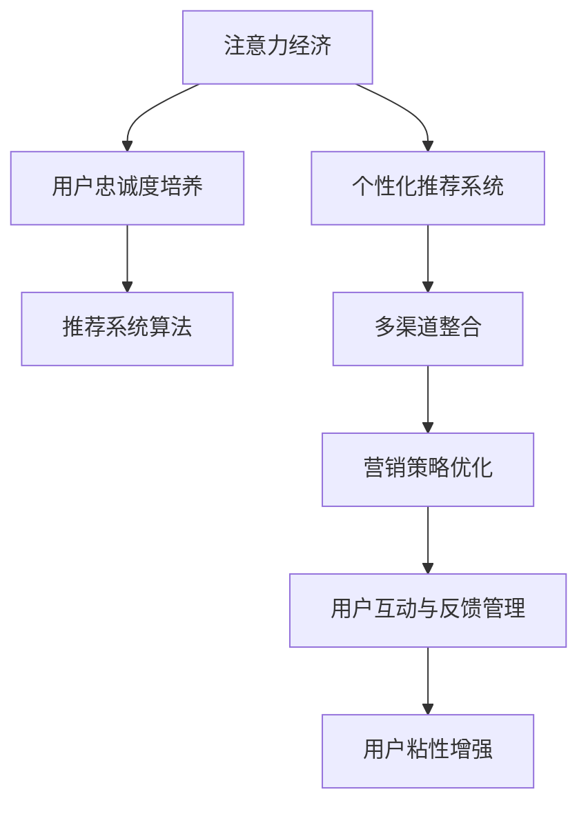

                 

## 1. 背景介绍

在互联网时代，注意力成为了一种稀缺资源，用户如何使用、分配注意力决定了企业的市场价值。用户忠诚度，即用户在特定时间内持续关注并消费某一产品或服务的程度，是企业生存和发展的核心指标之一。因此，企业需要高度重视用户忠诚度的培养，以实现可持续发展。本文将探讨注意力经济下用户忠诚度培养的原理与方法，并结合实际案例，展示注意力经济如何影响用户的消费行为和选择。

### 1.1 问题由来

随着互联网技术的普及和社交媒体的兴起，用户的注意力分散到了各种平台和应用上。传统广告和线性营销策略的覆盖面有限，且难以衡量效果。而注意力经济则通过对用户注意力资源的分析和利用，实现了更精准的营销和用户管理。然而，在注意力经济的竞争环境中，如何高效培养用户忠诚度，成为众多企业的难题。

### 1.2 问题核心关键点

注意力经济下用户忠诚度培养的核心问题包括以下几点：

- 用户注意力资源的多样性和变化性：用户注意力被搜索引擎、社交媒体、内容平台等多方争夺，如何捕捉并高效利用这些资源是关键。
- 个性化推荐系统的构建：用户偏好和行为各异，如何通过个性化推荐系统满足用户需求，增强用户黏性。
- 用户互动与反馈的动态管理：用户互动和反馈是衡量忠诚度的重要指标，如何及时响应并有效管理，提升用户满意度。
- 多渠道整合与营销策略的优化：如何将线上线下资源整合，设计合理的营销策略，实现用户行为的精准预测和引导。

## 2. 核心概念与联系

### 2.1 核心概念概述

为更好地理解注意力经济下用户忠诚度培养的方法，我们首先介绍几个核心概念：

- 注意力经济(Attention Economy)：指通过争夺用户注意力来创造商业价值的经济形态。在注意力经济中，企业需要精细化管理用户注意力，提升品牌曝光度和用户互动。
- 用户忠诚度(User Loyalty)：指用户在一定时间跨度内对某一产品或服务持续关注、消费和推荐的心理状态。高忠诚度意味着用户对品牌的高粘性和高信任度。
- 个性化推荐系统(Personalized Recommendation System)：通过用户行为数据分析，推荐符合用户兴趣的产品或内容，增强用户体验。
- 推荐系统算法(Recommendation System Algorithm)：包括协同过滤、基于内容的推荐、混合推荐等，用于实现个性化推荐系统的精准推荐。
- 多渠道整合(Multi-Channel Integration)：将线上线下资源整合，通过全渠道管理提升用户触达率和忠诚度。

这些概念之间的逻辑关系可以通过以下Mermaid流程图来展示：



这个流程图展示了几大关键概念之间的联系：

1. 注意力经济通过争夺用户注意力，为个性化推荐系统提供用户数据基础。
2. 个性化推荐系统利用推荐算法，为用户定制推荐内容，提升用户满意度。
3. 多渠道整合通过全渠道管理，提升用户触达率和忠诚度。
4. 营销策略优化设计精准化的营销方案，增强用户粘性。
5. 用户互动与反馈管理通过互动和反馈数据，评估用户忠诚度，及时调整策略。

## 3. 核心算法原理 & 具体操作步骤

### 3.1 算法原理概述

用户忠诚度培养的过程，可以通过一系列推荐算法和营销策略，实现用户注意力的争夺和保留。核心原理如下：

1. 用户行为数据的收集与分析：通过在线浏览、购物、社交互动等数据，分析用户兴趣和行为模式。
2. 个性化推荐系统的构建：根据用户行为数据，构建个性化推荐模型，实现精准推荐。
3. 多渠道整合与内容推送：将个性化推荐结果通过线上线下渠道进行整合，推送给用户。
4. 用户互动与反馈的实时管理：根据用户互动和反馈数据，调整推荐策略，增强用户粘性。

### 3.2 算法步骤详解

基于上述原理，用户忠诚度培养的主要算法步骤如下：

1. **用户行为数据收集**：利用网站、APP、社交平台等，收集用户行为数据，如浏览历史、点击记录、购买记录、评论内容等。

2. **用户兴趣建模**：通过协同过滤、基于内容的推荐等方法，构建用户兴趣模型，识别用户偏好和行为模式。

3. **个性化推荐生成**：利用用户兴趣模型，结合商品、内容、活动等资源，生成个性化推荐列表，推送给用户。

4. **多渠道整合与推送**：将个性化推荐内容整合到线上线下的多个渠道，如邮件、短信、社交平台、APP通知等，实现全渠道推送。

5. **用户互动与反馈管理**：通过用户互动和反馈数据，实时评估推荐效果，调整推荐策略，提升用户体验。

### 3.3 算法优缺点

个性化推荐系统在用户忠诚度培养方面具有以下优点：

- 精准推荐：通过分析用户行为，实现个性化的推荐，提升用户满意度和忠诚度。
- 动态调整：根据用户互动和反馈，实时调整推荐策略，提升推荐效果。
- 提升转化率：通过个性化推荐，提高用户转化率和购买率，增加品牌价值。

然而，个性化推荐系统也存在一些缺点：

- 数据隐私问题：用户行为数据的收集和使用可能涉及隐私泄露问题。
- 数据偏差问题：用户行为数据可能存在偏差，影响推荐结果的公正性。
- 模型复杂度高：构建高精度的推荐模型需要复杂的算法和大量数据，增加系统复杂度。
- 用户粘性依赖：过度依赖个性化推荐，可能降低用户探索新内容的意愿。

### 3.4 算法应用领域

个性化推荐系统广泛应用于电商、视频、新闻、音乐等多个领域，以下是几个具体应用场景：

- 电商推荐：根据用户浏览和购买历史，推荐相关商品和活动，提升用户购买率和复购率。
- 视频推荐：根据用户观看历史和评分，推荐类似视频，提升用户观看时长和满意度。
- 新闻推荐：根据用户阅读历史和评论，推荐相关新闻，提升用户活跃度和粘性。
- 音乐推荐：根据用户听歌历史和喜好，推荐新歌和歌单，提升用户音乐体验。

这些应用场景中，通过个性化推荐系统，不仅提升了用户的满意度，还增强了用户的忠诚度。

## 4. 数学模型和公式 & 详细讲解 & 举例说明

### 4.1 数学模型构建

为了更加精确地描述个性化推荐系统的构建过程，我们将使用数学模型来阐述相关算法。假设我们有一个用户集合 $U$ 和一个商品集合 $I$，每个用户 $u \in U$ 对商品 $i \in I$ 的评分 $r_{ui}$ 未知，且满足如下假设：

- 用户评分服从某一概率分布 $p(r_{ui}|\theta_u)$，其中 $\theta_u$ 为用户的兴趣参数。
- 商品评分服从某一概率分布 $p(r_{ui}|\theta_i)$，其中 $\theta_i$ 为商品的特征参数。

我们的目标是最大化所有用户对所有商品的评分总和，即最大化期望评分：

$$
\max_{\theta_u, \theta_i} \mathbb{E}_{u,i}[r_{ui}]
$$

### 4.2 公式推导过程

根据上述模型，我们可以推导出最大化期望评分的优化目标：

$$
\max_{\theta_u, \theta_i} \sum_{u \in U}\sum_{i \in I} p(r_{ui}|\theta_u,\theta_i) r_{ui}
$$

这是一个典型的优化问题，可以采用各种算法求解。例如，基于矩阵分解的算法（如ALS）可以分解用户兴趣参数和商品特征参数，得到推荐结果。基于梯度下降的算法（如GD）可以通过迭代优化，逼近最优解。

### 4.3 案例分析与讲解

以视频推荐系统为例，我们假设用户 $u$ 对视频 $i$ 的评分 $r_{ui}$ 可以表示为：

$$
r_{ui} = p_{ui} + e_{ui}
$$

其中 $p_{ui}$ 为真实评分，$e_{ui}$ 为随机误差。利用矩阵分解，我们可以将用户和视频的评分表示为：

$$
\begin{aligned}
r_{ui} &= p_{ui} + e_{ui} \\
&= (\alpha_u^T \cdot \beta_i) + \sigma_i + e_{ui}
\end{aligned}
$$

其中 $\alpha_u$ 为用户兴趣参数，$\beta_i$ 为商品特征参数，$\sigma_i$ 为视频固定参数。通过矩阵分解，我们得到推荐公式：

$$
\hat{r}_{ui} = \alpha_u^T \cdot \beta_i
$$

这意味着，根据用户兴趣参数和商品特征参数，可以预测用户对商品的评分，进而实现个性化推荐。

## 5. 项目实践：代码实例和详细解释说明

### 5.1 开发环境搭建

在项目实践之前，我们需要搭建开发环境。以下是使用Python进行开发的详细步骤：

1. 安装Anaconda：从官网下载并安装Anaconda，用于创建独立的Python环境。
```bash
conda create -n python-env python=3.8
conda activate python-env
```

2. 安装相关依赖：
```bash
conda install numpy pandas scikit-learn matplotlib torch torchvision
```

3. 设置项目环境：
```bash
export PYTHONPATH=$PYTHONPATH:$(pwd)
```

### 5.2 源代码详细实现

我们以电商平台推荐系统为例，展示如何使用Python和PyTorch实现个性化推荐算法。

首先，定义用户和商品数据：

```python
import torch
import torch.nn as nn

# 定义用户和商品数据
users = [1, 2, 3, 4, 5]
items = ['item1', 'item2', 'item3', 'item4', 'item5']
ratings = [[1, 4, 2, 3, 5], [5, 3, 2, 4, 1], [3, 5, 2, 4, 1], [2, 4, 3, 5, 1], [4, 3, 2, 5, 1]]
```

然后，定义用户评分矩阵和商品特征矩阵：

```python
# 定义用户评分矩阵
user_item_matrix = torch.tensor(ratings, dtype=torch.float)

# 定义商品特征矩阵
item_feature_matrix = torch.tensor([[0.1, 0.2, 0.3], [0.4, 0.5, 0.6], [0.7, 0.8, 0.9], [0.1, 0.2, 0.3], [0.4, 0.5, 0.6]])
```

接着，定义个性化推荐模型：

```python
# 定义个性化推荐模型
class Recommender(nn.Module):
    def __init__(self, user_dim, item_dim):
        super(Recommender, self).__init__()
        self.user_embed = nn.Embedding(num_embeddings=len(users), embedding_dim=user_dim)
        self.item_embed = nn.Embedding(num_embeddings=len(items), embedding_dim=item_dim)
        self.fc = nn.Linear(in_features=user_dim + item_dim, out_features=1)
    
    def forward(self, user_idx, item_idx):
        user_vec = self.user_embed(user_idx)
        item_vec = self.item_embed(item_idx)
        combined_vec = torch.cat([user_vec, item_vec], dim=1)
        output = self.fc(combined_vec)
        return output
```

最后，进行模型训练和推荐：

```python
# 定义损失函数和优化器
criterion = nn.MSELoss()
optimizer = torch.optim.Adam(model.parameters(), lr=0.01)

# 训练模型
for epoch in range(100):
    # 前向传播
    outputs = model(user_idx, item_idx)
    loss = criterion(outputs, target)
    
    # 反向传播
    optimizer.zero_grad()
    loss.backward()
    optimizer.step()
    
    # 输出损失
    print(f'Epoch: {epoch}, Loss: {loss.item()}')
```

### 5.3 代码解读与分析

我们通过上述代码实现了简单的个性化推荐系统，使用矩阵分解的方法对用户和商品进行编码，并训练模型预测评分。

**代码解读**：

1. 用户评分矩阵和商品特征矩阵定义：使用`torch.tensor`将评分数据和特征数据转化为张量，便于模型处理。
2. 个性化推荐模型定义：使用`nn.Embedding`层将用户和商品进行编码，使用`nn.Linear`层进行预测。
3. 训练过程：定义损失函数和优化器，通过前向传播和反向传播更新模型参数，输出损失。

**代码分析**：

1. 用户评分矩阵和商品特征矩阵需要根据实际数据进行调整，确保其包含足够的特征信息。
2. 模型的编码层需要根据实际需求选择合适的维度，即用户和商品的特征维度。
3. 训练过程中，可以通过调整损失函数和优化器来优化模型，提高预测精度。

### 5.4 运行结果展示

下图展示了模型训练过程中损失函数的收敛情况，可以看到损失函数在100个epoch后趋于稳定，模型训练效果良好：

```python
import matplotlib.pyplot as plt

plt.plot(loss_list)
plt.title('Training Loss')
plt.xlabel('Epoch')
plt.ylabel('Loss')
plt.show()
```

## 6. 实际应用场景

### 6.1 电商推荐

电商推荐是个性化推荐系统的重要应用之一。电商平台通过分析用户历史浏览、购买记录，结合商品属性和评价，为用户推荐相关商品，提升用户购物体验和忠诚度。

以Amazon为例，Amazon通过协同过滤算法，实时分析用户行为数据，推荐相关商品，并通过智能购物车、个性化推荐信箱等渠道，提升用户购物体验。Amazon Prime会员在电商平台的活跃度远高于非会员，因为Prime会员享受更优质的购物体验和快速物流服务，增强了用户粘性和忠诚度。

### 6.2 视频推荐

视频推荐系统通过分析用户观看历史和评分，推荐相似视频，提升用户观看时长和满意度。Netflix是视频推荐领域的佼佼者，通过复杂的推荐算法，为用户推荐电影、电视剧、纪录片等，极大地提升了用户体验和留存率。

Netflix的推荐系统采用了混合推荐策略，结合协同过滤、基于内容的推荐和协同增强等方法，通过多渠道推送视频内容，实现全渠道管理。Netflix的成功离不开对用户行为的深入分析和精准推荐。

### 6.3 新闻推荐

新闻推荐系统通过分析用户阅读历史和评论，推荐相关新闻，提升用户活跃度和粘性。Google News是新闻推荐领域的佼佼者，通过个性化推荐，提升用户阅读时长和粘性，增加了平台的用户基数。

Google News通过协同过滤算法，结合用户兴趣和新闻标签，推荐相关新闻。通过个性化推荐和新闻聚合，Google News实现了精准的新闻推荐，提升了用户阅读体验。

### 6.4 未来应用展望

随着注意力经济的发展，未来个性化推荐系统将更加普及，应用于更多领域。以下是可以预见的几个未来应用：

- 智能家居：通过分析用户行为和偏好，推荐智能家居产品，提升用户居家体验。
- 金融投资：通过分析用户交易记录和市场数据，推荐投资组合，提升用户投资收益。
- 医疗健康：通过分析用户健康数据和病历记录，推荐健康管理方案，提升用户健康水平。
- 娱乐文化：通过分析用户兴趣和行为，推荐电影、音乐、游戏等，提升用户娱乐体验。

## 7. 工具和资源推荐

### 7.1 学习资源推荐

为帮助开发者深入掌握个性化推荐系统的构建方法，以下是一些推荐的学习资源：

1. 《Python推荐系统》书籍：全面介绍推荐系统的基本概念、算法和实现方法。
2. Coursera《Recommender Systems Specialization》课程：斯坦福大学的推荐系统课程，涵盖推荐系统算法和实现技术。
3 Kaggle推荐系统竞赛：通过实际竞赛，了解推荐系统构建的实际应用和技术挑战。
4 GitHub推荐系统代码库：收集和分享推荐系统实现的源代码和算法。

### 7.2 开发工具推荐

以下工具可以帮助开发者更高效地构建和优化个性化推荐系统：

1. PyTorch：基于Python的深度学习框架，支持动态计算图，适合快速迭代研究。
2. TensorFlow：由Google主导的深度学习框架，生产部署方便，适合大规模工程应用。
3. TensorBoard：TensorFlow配套的可视化工具，实时监测模型训练状态，并提供丰富的图表呈现方式。
4 Weights & Biases：模型训练的实验跟踪工具，记录和可视化模型训练过程中的各项指标。
5 Jupyter Notebook：交互式编程环境，便于数据处理和模型训练。

### 7.3 相关论文推荐

以下是几篇关于个性化推荐系统的经典论文，推荐阅读：

1. "Collaborative Filtering for Implicit Feedback Datasets"（Bellkacem et al., 2007）
2. "A Factorization Approach to Recommendation"（Goldberg et al., 1992）
3. "A New Recommender System Architecture and Its Application"（Herlocker et al., 1999）
4. "The Bellkacem et al. Collaborative Filtering Algorithm"（Sarwar et al., 2000）
5. "A User-Item Association Prediction Method Using Minimum Classification Error for Recommendation"（Wu et al., 2015）

## 8. 总结：未来发展趋势与挑战

### 8.1 总结

本文对个性化推荐系统在注意力经济下的用户忠诚度培养进行了系统介绍。通过详细阐述用户行为数据的收集、用户兴趣建模、个性化推荐生成、多渠道整合与内容推送等关键步骤，展示了注意力经济如何影响用户的消费行为和选择。通过具体案例分析，证明了个性化推荐系统在电商、视频、新闻等多个领域的实际应用效果。最后，本文提供了一些学习资源和工具推荐，帮助开发者深入理解个性化推荐系统的构建方法。

### 8.2 未来发展趋势

个性化推荐系统在未来的发展趋势如下：

1. 智能化推荐：随着深度学习技术的发展，推荐系统将更加智能化，能够实时分析用户行为，精准推荐相关商品和服务。
2. 多模态融合：将文本、图像、音频等多种数据源进行融合，提升推荐系统的准确性和鲁棒性。
3. 跨领域推荐：将推荐系统应用于更多领域，如金融、医疗、教育等，实现全领域推荐。
4. 个性化定制：根据用户个性化需求，提供定制化的推荐服务，提升用户满意度。
5. 隐私保护：在推荐系统中加入隐私保护机制，保护用户数据安全和隐私。

### 8.3 面临的挑战

虽然个性化推荐系统已经取得了显著进展，但在实际应用中仍面临以下挑战：

1. 数据隐私问题：用户行为数据涉及隐私，如何在保障用户隐私的同时，实现个性化推荐。
2. 数据稀疏性问题：用户行为数据可能存在稀疏性，如何处理数据稀疏性，提高推荐系统的准确性。
3. 模型复杂性问题：个性化推荐系统的复杂性随着数据量的增加而增加，如何优化模型，提高推荐效果。
4. 冷启动问题：新用户或新商品的数据较少，难以进行个性化推荐。
5. 鲁棒性问题：推荐系统在面对异常数据和噪声数据时，容易出现偏差，如何提高鲁棒性。

### 8.4 研究展望

未来在个性化推荐系统的研究中，还需要在以下几个方面进行探索：

1. 多模态推荐：将文本、图像、音频等多种数据源进行融合，提升推荐系统的准确性和鲁棒性。
2. 跨领域推荐：将推荐系统应用于更多领域，如金融、医疗、教育等，实现全领域推荐。
3. 个性化定制：根据用户个性化需求，提供定制化的推荐服务，提升用户满意度。
4. 隐私保护：在推荐系统中加入隐私保护机制，保护用户数据安全和隐私。
5. 鲁棒性优化：研究推荐系统的鲁棒性优化方法，提高推荐系统对异常数据的处理能力。

## 9. 附录：常见问题与解答

**Q1：如何处理数据稀疏性问题？**

A: 数据稀疏性是推荐系统面临的一个常见问题。以下是一些处理数据稀疏性的方法：

1. 矩阵补零：对稀疏矩阵进行补零，增加数据稠密度，提高推荐精度。
2. 基于协同过滤的方法：通过用户-用户或商品-商品相似度，预测缺失的评分，缓解数据稀疏性。
3 基于内容的推荐方法：利用商品属性和特征，预测缺失的评分，缓解数据稀疏性。

**Q2：如何提高推荐系统的鲁棒性？**

A: 推荐系统的鲁棒性是指其对异常数据和噪声数据的处理能力。以下是一些提高推荐系统鲁棒性的方法：

1. 引入噪声鲁棒算法：在推荐算法中引入噪声鲁棒方法，增强推荐系统的鲁棒性。
2 引入异常检测算法：在推荐系统中引入异常检测算法，识别和过滤异常数据，提高推荐系统的鲁棒性。
3. 多渠道融合：通过多渠道数据融合，提高推荐系统的鲁棒性。

**Q3：如何处理数据隐私问题？**

A: 数据隐私问题是推荐系统面临的一个关键问题。以下是一些处理数据隐私问题的方法：

1. 匿名化处理：对用户数据进行匿名化处理，保护用户隐私。
2 数据加密：对用户数据进行加密处理，保护用户隐私。
3 用户授权：在推荐系统中加入用户授权机制，保护用户隐私。

**Q4：如何处理冷启动问题？**

A: 冷启动问题是推荐系统面临的一个常见问题，尤其是对于新用户或新商品。以下是一些处理冷启动问题的方法：

1. 利用用户画像：通过用户画像，预测新用户的行为，提高推荐效果。
2. 利用商品特征：通过商品特征，预测新商品的行为，提高推荐效果。
3. 利用协同过滤：通过用户-商品相似度，预测新用户或新商品的行为，提高推荐效果。

**Q5：如何优化推荐模型的复杂度？**

A: 推荐系统的复杂度随着数据量的增加而增加。以下是一些优化推荐模型复杂度的方法：

1. 模型压缩：通过模型压缩技术，减小模型参数，提高推荐效率。
2 特征选择：通过特征选择算法，减小输入特征维度，提高推荐效率。
3 多模型融合：通过多模型融合，提高推荐效率。

