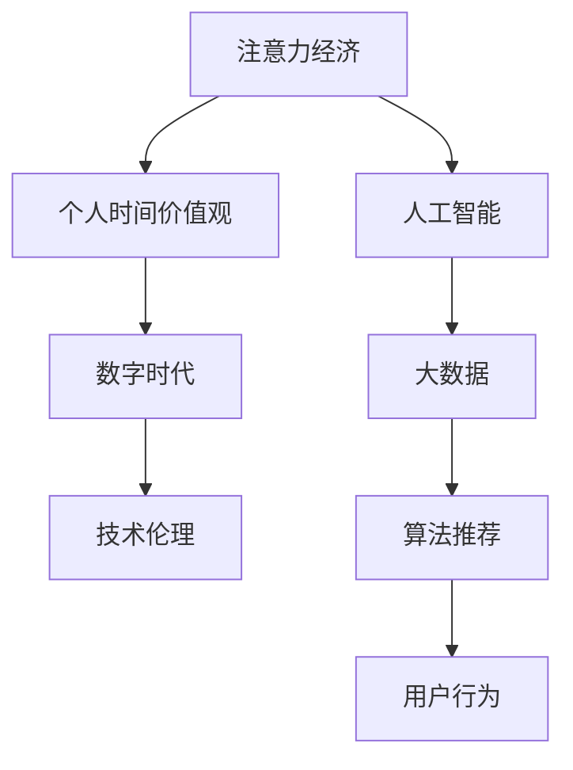

                 

# 注意力经济与个人时间价值观的转变

> 关键词：注意力经济, 个人时间价值观, 人工智能, 大数据, 数字时代

## 1. 背景介绍

在数字经济时代，人类的核心资源从物质资本转向了注意力资本。这种转变带来了人类行为模式、工作方式乃至社会关系的新变化，进而深刻影响着个人对时间的认知和利用。本文将深入探讨注意力经济对个人时间价值观的转变，并展望未来这一趋势对个人发展和社会的深远影响。

### 1.1 注意力经济与数字时代的兴起

随着互联网和智能设备的普及，信息过载成为普遍现象。人们在海量信息中寻求有价值的内容，注意力成为了稀缺资源。以Google、Facebook、Netflix等为代表的互联网巨头，通过算法推荐系统，精准抓取并利用用户的注意力，构建起一个庞大的商业帝国。

### 1.2 个人时间价值观的演变

在数字时代，个人时间不再单纯用于生产、娱乐等活动，而是转变为一种可以被运营、管理和出售的商品。时间管理成为个人发展的重要一环，时间和注意力的高效利用，成为实现个人价值和成功的重要手段。

### 1.3 技术与伦理的双重挑战

注意力经济的兴起，使得技术在商业利益驱动下不断增强对个人注意力的操控能力。如何在获取收益的同时，保护用户隐私，防止信息滥用，成为了一个重要的伦理问题。

## 2. 核心概念与联系

### 2.1 核心概念概述

为更好地理解注意力经济对个人时间价值观的转变，本节将介绍几个密切相关的核心概念：

- **注意力经济**：以注意力为核心的经济形态，通过捕获、分析、运营个人注意力，产生经济价值的过程。
- **个人时间价值观**：个人对时间的认知、利用方式和行为模式，以及时间对个人成就感和幸福感的贡献。
- **人工智能**：通过算法和计算能力，模仿人类智能，实现信息处理、决策分析等功能的技术。
- **大数据**：大量结构化、半结构化和非结构化数据，用于支持数据分析、决策支持和人工智能训练。
- **数字时代**：以互联网、移动通信、云计算等为代表的数字技术全面融入社会生活、经济活动和政府治理的时期。

这些概念之间的逻辑关系可以通过以下Mermaid流程图来展示：



这个流程图展示出注意力经济、人工智能、大数据、个人时间价值观和数字时代之间的密切联系：

1. **注意力经济**：依赖于人工智能和大数据，通过算法推荐系统抓取用户注意力。
2. **个人时间价值观**：受到数字时代技术变革的影响，发生了根本性的转变。
3. **数字时代**：是注意力经济和技术变革的背景，推动了个人时间价值观的转变。
4. **技术伦理**：在注意力经济和技术变革中，始终贯穿，平衡技术应用与用户隐私伦理。
5. **算法推荐**：是注意力经济的核心工具，用于精准分析和运营用户注意力。

## 3. 核心算法原理 & 具体操作步骤

### 3.1 算法原理概述

注意力经济的核心是算法推荐系统，通过分析用户行为和偏好，精准推送内容，实现对用户注意力的高效捕获和利用。其原理可以概括为以下几步：

1. **用户行为数据采集**：通过点击、浏览、搜索、点赞、评论等行为，收集用户对不同内容的态度和偏好。
2. **用户画像建立**：利用机器学习算法，构建用户的行为特征和兴趣模型，形成用户画像。
3. **内容匹配和推荐**：根据用户画像，通过算法计算最优推荐内容，实现个性化推送。
4. **反馈机制优化**：通过用户点击、停留、互动等反馈，不断优化算法推荐，提升用户满意度。

### 3.2 算法步骤详解

以推荐系统为例，介绍注意力经济的核心算法步骤：

1. **数据收集**：
   - 从网站、应用等平台收集用户的浏览、点击、搜索、评论等行为数据。
   - 使用日志、API接口等方式，持续更新用户行为数据。

2. **特征工程**：
   - 对原始行为数据进行预处理，如去重、过滤、归一化等。
   - 提取用户特征，如兴趣标签、活跃时间段、地理位置等。

3. **用户画像构建**：
   - 利用协同过滤、内容推荐等算法，构建用户行为模式和兴趣模型。
   - 将用户画像保存在数据仓库中，供推荐模型调用。

4. **内容匹配和推荐**：
   - 利用深度学习、协同过滤等算法，计算用户与内容的相关度。
   - 根据相关度排序，生成个性化推荐列表。

5. **反馈机制优化**：
   - 对用户的点击、停留、互动等行为进行监控，收集反馈数据。
   - 利用强化学习等算法，不断优化推荐策略，提升用户满意度。

### 3.3 算法优缺点

注意力经济算法推荐的优点包括：
- **个性化强**：根据用户画像，精准推送内容，满足个性化需求。
- **用户粘性高**：通过个性化推荐，增加用户停留时间和互动率。
- **运营效率高**：自动化、智能化流程，节省了大量人力成本。

但同时，该方法也存在以下缺点：
- **信息茧房**：推荐系统可能使得用户陷入单一兴趣内容的循环，难以接触到多样化的信息。
- **算法偏差**：如果推荐系统存在偏见，可能放大某些内容的影响力，误导用户。
- **隐私风险**：用户行为数据被收集和分析，隐私安全问题难以避免。
- **过度依赖**：用户可能过度依赖推荐系统，丧失主动获取信息的能力。

### 3.4 算法应用领域

注意力经济算法推荐系统，广泛应用于内容推荐、广告投放、社交网络、电子商务等多个领域，具体如下：

- **内容推荐**：如Netflix、YouTube、今日头条等，通过推荐系统为用户提供个性化内容。
- **广告投放**：如Google Adwords、Facebook Ads等，通过精准定向广告提升广告效果。
- **社交网络**：如微博、微信等，通过推荐好友和内容，优化用户体验。
- **电子商务**：如亚马逊、淘宝等，通过推荐商品和活动，提升销售转化率。

## 4. 数学模型和公式 & 详细讲解 & 举例说明

### 4.1 数学模型构建

在推荐系统中，常见的数学模型包括协同过滤、矩阵分解、深度学习等。以协同过滤为例，构建用户画像和内容推荐模型：

1. **用户-项目评分矩阵**：
   - 用户 $u$ 对项目 $i$ 的评分 $r_{ui}$，其中 $r_{ui} \in [0,1]$。
   - 构建用户-项目评分矩阵 $R$，其中 $R \in \mathbb{R}^{m \times n}$，$m$ 为用户数，$n$ 为项目数。

2. **用户画像构建**：
   - 使用SVD(Singular Value Decomposition)算法，将用户-项目评分矩阵分解为：
   $$
   R = UA^TV
   $$
   - 其中 $U \in \mathbb{R}^{m \times k}$ 为用户向量，$A \in \mathbb{R}^{k \times k}$ 为嵌入矩阵，$V \in \mathbb{R}^{k \times n}$ 为项目向量。

3. **内容推荐**：
   - 计算用户 $u$ 对项目 $j$ 的预测评分 $\hat{r}_{uj}$，其中：
   $$
   \hat{r}_{uj} = \vec{u}^T\hat{A}\vec{j}
   $$
   - 其中 $\vec{u}$ 为用户向量，$\vec{j}$ 为项目向量，$\hat{A}$ 为嵌入矩阵。
   - 推荐排序，选择评分最高的前 $k$ 个项目作为推荐列表。

### 4.2 公式推导过程

以协同过滤中的SVD算法为例，推导用户画像的构建过程：

1. **SVD算法**：
   - 将用户-项目评分矩阵 $R$ 分解为三个矩阵：$U \in \mathbb{R}^{m \times k}$、$A \in \mathbb{R}^{k \times k}$ 和 $V \in \mathbb{R}^{k \times n}$，其中 $m$ 为用户数，$n$ 为项目数，$k$ 为嵌入维数。
   - 解方程：
   $$
   UAV^T = R
   $$
   - 得到 $U$、$A$、$V$ 的表达式：
   $$
   U = R(A^TAV^T)^{-1}V^TR^T
   $$
   $$
   A = U^TRV^T
   $$
   $$
   V = U^TR^TV
   $$

2. **用户画像构建**：
   - 用户画像 $u$ 为 $U$ 的第 $i$ 行，即 $u = U_{i,:}$。
   - 内容画像 $j$ 为 $V$ 的第 $j$ 列，即 $j = V_{:,j}$。

3. **内容推荐**：
   - 用户 $u$ 对项目 $j$ 的预测评分 $\hat{r}_{uj}$ 为：
   $$
   \hat{r}_{uj} = \vec{u}^T\hat{A}\vec{j}
   $$
   - 其中 $\vec{u}$ 为用户向量，$\vec{j}$ 为项目向量，$\hat{A}$ 为嵌入矩阵。

通过以上推导，可以看出协同过滤算法的核心在于将用户-项目评分矩阵分解为三个低秩矩阵，通过矩阵乘法计算用户和项目的嵌入向量，进而得到预测评分。

### 4.3 案例分析与讲解

以Netflix推荐系统为例，分析其算法推荐的核心步骤：

1. **数据收集**：
   - 收集用户对影片的评分和观看记录，构建用户-项目评分矩阵。
   - 使用日志记录用户的操作行为，如观看时长、评分、收藏等。

2. **特征工程**：
   - 提取用户特征，如兴趣标签、活跃时间段、地理位置等。
   - 提取影片特征，如类型、演员、导演等。

3. **用户画像构建**：
   - 利用协同过滤算法，构建用户和影片的嵌入向量。
   - 将用户画像和影片画像保存在数据仓库中，供推荐模型调用。

4. **内容匹配和推荐**：
   - 使用深度学习算法，如卷积神经网络、循环神经网络等，计算用户和影片的相关度。
   - 根据相关度排序，生成个性化推荐列表。

5. **反馈机制优化**：
   - 对用户的点击、停留、互动等行为进行监控，收集反馈数据。
   - 利用强化学习等算法，不断优化推荐策略，提升用户满意度。

通过Netflix推荐系统的分析，可以看出算法推荐系统的核心在于通过数据收集和处理，构建用户和内容的嵌入向量，并在此基础上进行匹配和推荐。

## 5. 项目实践：代码实例和详细解释说明

### 5.1 开发环境搭建

在进行推荐系统开发前，我们需要准备好开发环境。以下是使用Python进行TensorFlow开发的环境配置流程：

1. 安装Anaconda：从官网下载并安装Anaconda，用于创建独立的Python环境。

2. 创建并激活虚拟环境：
```bash
conda create -n tf-env python=3.8 
conda activate tf-env
```

3. 安装TensorFlow：从官网获取对应的安装命令。例如：
```bash
pip install tensorflow==2.3
```

4. 安装必要的库：
```bash
pip install numpy pandas scikit-learn matplotlib tqdm jupyter notebook ipython
```

完成上述步骤后，即可在`tf-env`环境中开始推荐系统开发。

### 5.2 源代码详细实现

这里我们以协同过滤为例，使用TensorFlow实现推荐系统。

首先，定义协同过滤的核心类 `CollaborativeFiltering`：

```python
import tensorflow as tf
import numpy as np

class CollaborativeFiltering:
    def __init__(self, num_users, num_items, num_factors=10, learning_rate=0.1, reg_lambda=0.1):
        self.num_users = num_users
        self.num_items = num_items
        self.num_factors = num_factors
        self.learning_rate = learning_rate
        self.reg_lambda = reg_lambda
        self.U = tf.Variable(tf.random.normal([num_users, num_factors]))
        self.V = tf.Variable(tf.random.normal([num_items, num_factors]))
        self.A = tf.Variable(tf.random.normal([num_factors, num_factors]))
    
    def fit(self, R):
        # 定义优化器和损失函数
        optimizer = tf.keras.optimizers.Adam(learning_rate=self.learning_rate)
        loss = tf.reduce_mean(tf.square(R - tf.matmul(tf.matmul(self.U, self.A), self.V))) + self.reg_lambda * (tf.reduce_sum(tf.square(self.U)) + tf.reduce_sum(tf.square(self.V)))
        
        # 训练过程
        for epoch in range(100):
            optimizer.minimize(loss, variables=[self.U, self.V, self.A])
            print(f"Epoch {epoch+1}, loss: {loss:.4f}")
    
    def recommend(self, u, items):
        # 预测评分
        user = self.U[u]
        predictions = tf.matmul(user, self.A) * self.V
        item_scores = tf.squeeze(predictions)[:len(items)]
        top_items = items[np.argsort(item_scores)[::-1]][0:5]
        return top_items
```

接着，构建推荐系统的训练和评估函数：

```python
import matplotlib.pyplot as plt

# 生成随机评分矩阵
num_users = 100
num_items = 1000
R = np.random.rand(num_users, num_items) * 4 - 2
R[R < 0] = 0

# 创建协同过滤模型
model = CollaborativeFiltering(num_users, num_items)

# 训练模型
model.fit(R)

# 生成随机测试集
test_users = np.random.randint(0, num_users, size=10)
test_items = np.random.randint(0, num_items, size=10)

# 对测试集进行推荐
recommendations = model.recommend(test_users, test_items)

# 可视化推荐结果
plt.bar(range(len(test_items)), recommendations)
plt.show()
```

完成以上步骤后，即可在`tf-env`环境中运行协同过滤推荐系统的代码实现。

### 5.3 代码解读与分析

让我们再详细解读一下关键代码的实现细节：

**CollaborativeFiltering类**：
- `__init__`方法：初始化用户数、物品数、因子数、学习率和正则化系数。
- `fit`方法：定义优化器和损失函数，通过梯度下降优化模型参数。
- `recommend`方法：根据用户嵌入向量，计算预测评分，并返回预测分数最高的物品。

**训练和评估函数**：
- 生成随机评分矩阵 `R`。
- 创建协同过滤模型 `model`。
- 调用 `fit`方法训练模型。
- 生成随机测试集。
- 调用 `recommend`方法对测试集进行推荐。
- 使用matplotlib可视化推荐结果。

可以看到，TensorFlow提供了一个高效的计算图框架，使得协同过滤推荐系统的实现变得简单快捷。开发者可以灵活地组合和调用不同的TensorFlow组件，构建复杂的推荐模型。

## 6. 实际应用场景

### 6.1 智能推荐系统

智能推荐系统是注意力经济的重要应用场景，如Netflix、Amazon、Spotify等平台，通过算法推荐系统，提供个性化内容推荐，提升用户体验，增加用户粘性，增加收入。

### 6.2 广告定向投放

广告定向投放也是注意力经济的重要应用场景，如Google Ads、Facebook Ads等平台，通过算法推荐系统，精准定向投放广告，提高广告效果，降低广告成本。

### 6.3 社交网络

社交网络平台如微信、微博等，通过推荐系统，推荐好友和内容，优化用户体验，增加用户粘性，提升平台活跃度。

### 6.4 电子商务

电子商务平台如淘宝、京东等，通过推荐系统，推荐商品和活动，提高用户购物体验，增加销售转化率。

### 6.5 新闻内容推荐

新闻平台如今日头条、网易新闻等，通过推荐系统，推荐新闻内容，增加用户停留时间，提高广告收益。

## 7. 工具和资源推荐

### 7.1 学习资源推荐

为了帮助开发者系统掌握推荐系统的理论和实践，这里推荐一些优质的学习资源：

1. 《深度学习推荐系统：原理与算法》书籍：由深度学习专家撰写，详细介绍了推荐系统的原理和算法，适合初学者入门。

2. 《推荐系统实战》课程：斯坦福大学开设的推荐系统课程，有Lecture视频和配套作业，带你深入推荐系统的前沿技术。

3. Kaggle推荐系统竞赛：Kaggle上的推荐系统竞赛，提供了大量实际数据集和评估指标，适合实践和比赛。

4. Coursera《推荐系统》课程：Coursera上的推荐系统课程，涵盖推荐系统的基础和高级内容，适合深入学习。

5. GitHub推荐系统开源项目：GitHub上的开源推荐系统项目，提供了丰富的代码和模型实现，适合参考学习。

通过对这些资源的学习实践，相信你一定能够快速掌握推荐系统的精髓，并用于解决实际的推荐问题。

### 7.2 开发工具推荐

推荐系统的开发需要依赖多种工具和框架，以下是几款常用的推荐系统开发工具：

1. TensorFlow：由Google主导开发的深度学习框架，适合大规模推荐系统开发。

2. PyTorch：由Facebook主导开发的深度学习框架，灵活动态的计算图，适合研究性开发。

3. Spark：由Apache基金会主导的分布式计算框架，适合大数据推荐系统开发。

4. Hadoop：由Apache基金会主导的大数据处理框架，适合大规模推荐系统开发。

5. Elasticsearch：开源的分布式搜索和分析引擎，适合推荐系统的实时查询和分析。

6. Apache Kafka：开源的消息队列，适合推荐系统的实时数据处理和存储。

合理利用这些工具，可以显著提升推荐系统的开发效率，加快创新迭代的步伐。

### 7.3 相关论文推荐

推荐系统的发展源于学界的持续研究。以下是几篇奠基性的相关论文，推荐阅读：

1. Matrix Factorization Techniques for Recommender Systems：提出矩阵分解算法，用于推荐系统的构建。

2. Collaborative Filtering for Implicit Feedback Datasets：提出协同过滤算法，用于处理隐式反馈数据。

3. Deep Collaborative Filtering with Personalized Attention Mechanisms：提出深度协同过滤算法，用于推荐系统的优化。

4. Attention is All You Need：提出Transformer结构，用于推荐系统中的注意力机制。

5. Beyond Deep Learning for Recommender Systems: A 5-Year ACM DL Volume Overview：综述了推荐系统的最新进展，适合宏观了解。

这些论文代表了大规模推荐系统的研究脉络。通过学习这些前沿成果，可以帮助研究者把握学科前进方向，激发更多的创新灵感。

## 8. 总结：未来发展趋势与挑战

### 8.1 总结

本文对注意力经济和推荐系统进行了全面系统的介绍。首先阐述了注意力经济对个人时间价值观的转变，明确了推荐系统在数字经济时代的重要地位。其次，从原理到实践，详细讲解了推荐系统的数学模型和算法步骤，给出了推荐任务开发的完整代码实例。同时，本文还广泛探讨了推荐系统在智能推荐、广告投放、社交网络等多个领域的应用前景，展示了推荐范式的巨大潜力。此外，本文精选了推荐技术的各类学习资源，力求为读者提供全方位的技术指引。

通过本文的系统梳理，可以看出，推荐系统正在成为数字经济的重要工具，极大地拓展了个人和企业在数据时代的价值创造能力。未来，伴随推荐算法的不断进步和推荐技术的深入应用，我们有望在各个领域构建起更加智能、高效、个性化的推荐系统。

### 8.2 未来发展趋势

展望未来，推荐系统的发展将呈现以下几个趋势：

1. **多模态推荐**：除了文本数据，推荐系统还将更多地融合图像、音频、视频等多模态数据，实现跨模态推荐。

2. **实时推荐**：推荐系统将更加实时化，通过在线学习、流式计算等技术，实现实时动态推荐。

3. **跨领域推荐**：推荐系统将突破行业限制，实现跨领域推荐，如商品推荐和新闻内容推荐相结合，提供更加多样化的推荐内容。

4. **个性化推荐**：推荐系统将更加个性化，通过用户行为数据、情境数据等，实现精准推荐。

5. **社会化推荐**：推荐系统将更加社会化，通过社交网络数据，实现基于社会关系推荐。

6. **公平推荐**：推荐系统将更加注重公平性，通过去偏、反歧视等技术，减少推荐偏差。

这些趋势凸显了推荐系统的发展方向，即从简单的个性化推荐，迈向多模态、实时化、跨领域、公平化的推荐系统，更好地服务于用户需求，提升用户满意度。

### 8.3 面临的挑战

尽管推荐系统在数据时代发挥了巨大的作用，但在迈向更加智能化、普适化应用的过程中，它仍面临着诸多挑战：

1. **数据隐私**：用户行为数据被收集和分析，隐私安全问题难以避免。如何在获取收益的同时，保护用户隐私，防止信息滥用，是需要重点解决的问题。

2. **算法偏见**：推荐系统可能存在偏见，放大某些内容的影响力，误导用户。如何构建公平、无偏的推荐模型，是推荐系统面临的重要挑战。

3. **冷启动问题**：对于新用户和新物品，推荐系统难以提供有效的推荐。如何解决冷启动问题，是推荐系统需要重点解决的问题。

4. **数据稀疏性**：用户行为数据往往非常稀疏，难以构建有效的用户画像。如何高效利用稀疏数据，构建高质量的推荐模型，是推荐系统面临的重要挑战。

5. **实时性**：推荐系统需要实时更新推荐内容，满足用户即时需求。如何在处理海量数据的同时，提高推荐系统实时性，是推荐系统需要重点解决的问题。

6. **公平性**：推荐系统需要公平地推荐内容，避免对特定用户群体产生歧视。如何构建公平、无偏的推荐模型，是推荐系统需要重点解决的问题。

这些挑战凸显了推荐系统的复杂性，需要在算法、数据、模型等多个方面进行深入研究，才能实现更加智能、公平、高效的推荐系统。

### 8.4 研究展望

面对推荐系统面临的种种挑战，未来的研究需要在以下几个方面寻求新的突破：

1. **多模态推荐**：融合图像、音频、视频等多模态数据，实现跨模态推荐。

2. **实时推荐**：利用在线学习、流式计算等技术，实现实时动态推荐。

3. **个性化推荐**：通过用户行为数据、情境数据等，实现精准推荐。

4. **公平推荐**：通过去偏、反歧视等技术，减少推荐偏差，构建公平、无偏的推荐模型。

5. **冷启动问题**：利用少样本学习、迁移学习等技术，解决冷启动问题，提升新用户和新物品的推荐效果。

6. **数据稀疏性**：利用深度学习、矩阵分解等技术，高效利用稀疏数据，构建高质量的推荐模型。

7. **实时性**：优化推荐系统的计算图和模型结构，提高推荐系统实时性，满足用户即时需求。

8. **公平性**：构建公平、无偏的推荐模型，避免对特定用户群体产生歧视，确保推荐系统的公平性。

这些研究方向的探索，必将引领推荐系统技术迈向更高的台阶，为数字经济时代的用户需求提供更好的解决方案。

## 9. 附录：常见问题与解答

**Q1：什么是协同过滤推荐系统？**

A: 协同过滤推荐系统是一种基于用户和物品评分矩阵的推荐算法，通过分析用户和物品之间的评分关系，推断用户对未评分物品的评分，从而实现推荐。

**Q2：推荐系统的推荐策略有哪些？**

A: 推荐系统的推荐策略包括基于内容的推荐、协同过滤推荐、深度学习推荐等。不同的策略适用于不同的推荐场景，需要根据实际情况进行选择。

**Q3：推荐系统的冷启动问题如何解决？**

A: 推荐系统的冷启动问题可以通过少样本学习、迁移学习、预训练等技术解决。通过使用用户行为数据、物品属性等先验信息，构建高质量的初始推荐模型，加速新用户和新物品的推荐。

**Q4：推荐系统的数据隐私问题如何解决？**

A: 推荐系统的数据隐私问题可以通过差分隐私、联邦学习等技术解决。差分隐私可以在不泄露用户隐私的情况下，实现数据分析和推荐；联邦学习可以在不集中用户数据的情况下，实现分布式推荐。

**Q5：推荐系统的实时性如何保证？**

A: 推荐系统的实时性可以通过在线学习、流式计算等技术实现。在线学习可以在不断更新推荐模型的情况下，实现实时推荐；流式计算可以在实时处理数据的同时，提供快速推荐结果。

通过本文的详细讲解和实例演示，相信读者已经对注意力经济和推荐系统有了深入的了解。在未来，随着技术的不断进步和应用的深入拓展，推荐系统必将在更多领域发挥重要作用，推动数字经济的发展和社会的进步。

