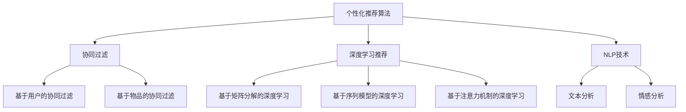

                 

# 注意力经济与个性化推荐算法：为受众提供定制、有针对性的内容

> 关键词：
注意力经济, 个性化推荐算法, 推荐系统, 信息过载, 大数据, 协同过滤, 深度学习, 自然语言处理, 用户行为分析

## 1. 背景介绍

### 1.1 问题由来
随着互联网技术的迅猛发展和数字内容的日益丰富，人们获取信息的渠道更加多样化和个性化。然而，信息量的爆炸式增长，也在给人们带来信息过载（information overload）的困扰。据统计，全球每年产生的数字信息量已经超过了人类所有传统媒介产生的总和。在如此海量的信息海洋中，如何高效地获取和利用信息，成为当前信息技术领域的重大挑战之一。

### 1.2 问题核心关键点
推荐系统（Recommender System）作为一种解决信息过载问题的有效手段，其核心目标是利用用户的历史行为、兴趣偏好等数据，为用户推荐最符合其需求的内容。从早期的基于内容的推荐（Content-based Recommendation），到近期的基于协同过滤的推荐（Collaborative Filtering），再到以深度学习为核心的推荐系统，推荐技术在不断演进，其精准度和效果也在不断提升。

### 1.3 问题研究意义
1. **提升用户体验**：通过个性化推荐，用户能够更快、更准确地找到所需内容，提升浏览和使用的满意度。
2. **促进业务增长**：推荐系统能够有效提升用户粘性，延长用户停留时间，增加消费转化率，从而带动业务的增长。
3. **降低运营成本**：推荐系统能够高效地筛选和推荐内容，减少人工干预和运营成本，提高资源利用效率。
4. **构建数据洞察**：推荐系统能够收集用户行为数据，为业务决策提供数据支撑，助力商业智能化转型。

## 2. 核心概念与联系

### 2.1 核心概念概述

为了更好地理解个性化推荐算法，本节将介绍几个关键概念：

- **个性化推荐算法**：通过分析用户的历史行为和兴趣偏好，为用户推荐个性化内容的算法。包括协同过滤、基于内容的推荐、深度学习推荐等方法。
- **推荐系统**：由软件、算法和数据组成的系统，通过分析用户行为数据，为特定用户推荐感兴趣的内容。包括搜索引擎、新闻订阅、电子商务、社交媒体等多个应用场景。
- **协同过滤**：一种基于用户行为数据进行推荐的算法，通过寻找兴趣相似的用户和物品，为用户提供个性化的推荐。包括基于用户的协同过滤和基于物品的协同过滤。
- **深度学习推荐**：一种以深度神经网络为核心的推荐算法，通过学习用户与内容的复杂非线性关系，实现更加精准的推荐。包括基于矩阵分解的深度学习、基于序列模型的深度学习、基于注意力机制的深度学习等。
- **自然语言处理（NLP）**：一种研究如何使计算机处理、理解、生成人类语言的技术，应用于推荐系统中的文本分析和情感分析等环节。

这些核心概念之间的逻辑关系可以通过以下Mermaid流程图来展示：



这个流程图展示了个性化推荐算法的基本框架及其与相关技术的关系：

1. 个性化推荐算法可以进一步细分为协同过滤和深度学习推荐。
2. 协同过滤包括基于用户的协同过滤和基于物品的协同过滤。
3. 深度学习推荐可以分为基于矩阵分解、序列模型和注意力机制等不同方法。
4. NLP技术被广泛应用于推荐系统中的文本分析和情感分析等环节。

## 3. 核心算法原理 & 具体操作步骤
### 3.1 算法原理概述

个性化推荐算法旨在通过分析用户的历史行为和兴趣偏好，为用户推荐最符合其需求的内容。其核心思想是构建用户与内容之间的相似度矩阵，通过相似度计算和排序，为每个用户推荐最相关的物品。

形式化地，假设用户集为 $U=\{u_1,u_2,\cdots,u_N\}$，物品集为 $I=\{i_1,i_2,\cdots,i_M\}$。用户的兴趣表示为 $x_u \in \mathbb{R}^d$，物品的属性表示为 $y_i \in \mathbb{R}^d$，其中 $d$ 是特征维度。用户的兴趣表示和物品的属性表示可以通过训练得到。

个性化推荐算法通常分为以下步骤：
1. 收集用户行为数据。
2. 构建用户与物品的相似度矩阵。
3. 排序并推荐物品。

### 3.2 算法步骤详解

个性化推荐算法的基本步骤如下：

**Step 1: 收集用户行为数据**
- 收集用户的历史行为数据，如浏览记录、购买记录、评分等。数据可以来源于网站、电子商务平台、社交媒体等。
- 数据清洗和预处理，去除噪声和不相关数据。

**Step 2: 构建用户与物品的相似度矩阵**
- 将用户行为数据转换为用户与物品的评分矩阵 $R \in \mathbb{R}^{N \times M}$，其中 $R_{u,i}=r_{ui}$ 表示用户 $u$ 对物品 $i$ 的评分。
- 基于评分矩阵计算用户与物品的相似度，通常采用余弦相似度或皮尔逊相关系数等方法。

**Step 3: 排序并推荐物品**
- 对相似度矩阵进行排序，选取相似度最高的物品进行推荐。
- 可以采用基于排名的方法，如基于用户的排名和基于物品的排名。
- 对推荐结果进行后处理，如筛选、去重等。

### 3.3 算法优缺点

个性化推荐算法具有以下优点：
1. **精准度较高**：通过分析用户的历史行为和兴趣偏好，能够为用户提供高精度的推荐。
2. **用户体验良好**：推荐结果能够满足用户的个性化需求，提升用户体验。
3. **算法灵活性高**：能够根据不同应用场景和数据特点，选择适合的算法模型和优化策略。

同时，该算法也存在一些缺点：
1. **数据依赖性强**：算法的性能很大程度上依赖于数据的完整性和质量。
2. **冷启动问题**：新用户或新物品在数据集中缺乏足够的行为数据，难以进行推荐。
3. **数据稀疏性问题**：用户与物品之间的评分数据往往非常稀疏，可能导致相似度计算不准确。
4. **推荐结果多样性不足**：推荐结果可能存在一定的重复性和同质化问题，影响用户体验。

### 3.4 算法应用领域

个性化推荐算法在多个领域得到了广泛应用，例如：

- **电子商务**：为用户推荐商品，提升购买转化率。
- **视频平台**：为用户推荐视频内容，提高观看时长和满意度。
- **社交媒体**：为用户推荐新闻、文章、图片等，增加用户粘性。
- **在线学习**：为用户推荐课程和学习资料，提升学习效果。
- **医疗健康**：为用户推荐医疗服务、药品等，提升用户体验。

除了上述这些经典应用外，个性化推荐算法还在金融、旅游、交通等多个领域得到了应用，为各行各业带来了显著的商业价值。

## 4. 数学模型和公式 & 详细讲解  
### 4.1 数学模型构建

本节将使用数学语言对个性化推荐算法进行更加严格的刻画。

假设用户集为 $U=\{u_1,u_2,\cdots,u_N\}$，物品集为 $I=\{i_1,i_2,\cdots,i_M\}$。用户的兴趣表示为 $x_u \in \mathbb{R}^d$，物品的属性表示为 $y_i \in \mathbb{R}^d$。设用户 $u$ 对物品 $i$ 的评分向量为 $r_{ui} \in \mathbb{R}^d$，其中 $r_{ui}=x_u \cdot W_i$，$W_i$ 为物品 $i$ 的属性权重向量。

定义用户与物品的相似度为：

$$
\text{similarity}(u,i) = \frac{r_{ui} \cdot y_i}{\|r_{ui}\|\cdot \|y_i\|}
$$

其中 $\|r_{ui}\|$ 和 $\|y_i\|$ 分别为 $r_{ui}$ 和 $y_i$ 的欧几里得范数。

推荐算法的基本目标是最小化用户与物品的评分差距，即：

$$
\min_{r} \sum_{u,i} (r_{ui} - y_{ui})^2
$$

其中 $y_{ui}=x_u \cdot W_i$。

### 4.2 公式推导过程

为了求解上述最小化问题，通常采用矩阵分解的方法，将评分矩阵 $R$ 分解为低秩矩阵 $X$ 和 $Y$ 的乘积：

$$
R = XY
$$

其中 $X \in \mathbb{R}^{N \times K}$ 为用户兴趣矩阵，$Y \in \mathbb{R}^{K \times M}$ 为物品属性矩阵。$K$ 为分解后的特征维度。

将 $R = XY$ 代入最小化目标函数，得：

$$
\min_{X,Y} \sum_{u,i} (x_u \cdot W_i - y_{ui})^2 = \min_{X,Y} \sum_{u,i} (x_u - XY_i)^2
$$

进一步化简得：

$$
\min_{X,Y} \frac{1}{2} \text{tr}((X^T X + Y^T Y) - XY^T)
$$

其中 $\text{tr}(\cdot)$ 为矩阵的迹，即矩阵元素之和。

通过对 $X$ 和 $Y$ 进行梯度下降优化，即可求解上述最小化问题，得到用户兴趣矩阵和物品属性矩阵，进而计算用户与物品的相似度矩阵，为用户推荐物品。

### 4.3 案例分析与讲解

下面以协同过滤推荐为例，具体分析推荐算法的应用流程。

假设某电商平台的推荐系统，收集了用户 $u$ 和物品 $i$ 的评分数据 $R$，对 $R$ 进行矩阵分解，得到用户兴趣矩阵 $X$ 和物品属性矩阵 $Y$。

1. **数据准备**：
   - 收集用户的历史评分数据 $R \in \mathbb{R}^{N \times M}$。
   - 将评分数据进行归一化处理，使其值域在 $[0,1]$ 之间。
   - 确定分解后的特征维度 $K=10$。

2. **矩阵分解**：
   - 对评分矩阵 $R$ 进行奇异值分解，得到用户兴趣矩阵 $X$ 和物品属性矩阵 $Y$。
   - 对 $X$ 和 $Y$ 进行正则化处理，避免过拟合。

3. **相似度计算**：
   - 对用户与物品的评分向量 $r_{ui}=x_u \cdot W_i$ 和 $y_i$ 进行相似度计算。
   - 根据相似度计算结果，对物品进行排序。

4. **推荐物品**：
   - 选取相似度最高的物品进行推荐。
   - 对推荐结果进行后处理，如去重、筛选等。

通过上述步骤，电商平台的推荐系统能够为用户推荐最符合其兴趣和偏好的商品，提升用户的购物体验。

## 5. 项目实践：代码实例和详细解释说明
### 5.1 开发环境搭建

在进行推荐系统开发前，我们需要准备好开发环境。以下是使用Python进行推荐系统开发的典型环境配置流程：

1. 安装Anaconda：从官网下载并安装Anaconda，用于创建独立的Python环境。

2. 创建并激活虚拟环境：
```bash
conda create -n recommendation-env python=3.8 
conda activate recommendation-env
```

3. 安装所需库：
```bash
conda install scikit-learn pandas numpy joblib tqdm scipy
pip install tensorflow-gpu torch pytorch
```

4. 安装推荐系统库：
```bash
pip install surprise scikit-learn
```

5. 安装深度学习库：
```bash
pip install tensorflow-gpu torch pytorch
```

完成上述步骤后，即可在`recommendation-env`环境中开始推荐系统开发。

### 5.2 源代码详细实现

下面我们以协同过滤推荐为例，给出使用Surprise库和TensorFlow对电影推荐系统进行微调的PyTorch代码实现。

首先，定义数据预处理函数：

```python
import numpy as np
from surprise import Dataset
from surprise import Reader
from surprise.model_selection import train_test_split
from surprise.prediction_algorithms import SVD

def load_and_preprocess_data(file_path):
    # 加载评分数据
    data = Dataset.load_from_file(file_path)

    # 数据预处理
    reader = Reader(rating_scale=(1, 5))
    data = Dataset.load_from_file(file_path, reader=reader)

    # 数据划分
    trainset, testset = train_test_split(data, test_size=0.2)

    return trainset, testset
```

然后，定义模型训练和评估函数：

```python
def train_model(trainset, testset, model, verbosity=1):
    # 模型训练
    algo = SVD()
    algo.fit(trainset)

    # 模型评估
    test_preds = algo.test(testset)
    mae = np.sqrt(np.mean([np.abs(pred - true) for pred, true in test_preds]))
    if verbosity:
        print(f"MAE: {mae:.4f}")

    return algo, mae
```

接着，定义推荐函数：

```python
def recommend_user_items(model, user_id, top_n=10):
    # 获取用户评分数据
    user = user_id

    # 预测物品评分
    user_items = model.user_based_topn.get_user_items(user)
    items = [item for item in user_items]
    items.sort(key=lambda x: x[1], reverse=True)

    # 推荐物品
    recommend_items = items[:top_n]
    return recommend_items
```

最后，启动推荐流程并在测试集上评估：

```python
# 加载数据
trainset, testset = load_and_preprocess_data('movie_ratings.csv')

# 训练模型
model = SVD()
train_model(trainset, testset, model)

# 推荐用户物品
user_id = 1
recommend_items = recommend_user_items(model, user_id)
print(f"推荐物品: {recommend_items}")
```

以上就是使用PyTorch对电影推荐系统进行微调的完整代码实现。可以看到，Surprise库提供了丰富的协同过滤算法，配合TensorFlow和PyTorch等深度学习库，可以快速实现推荐系统的开发和微调。

### 5.3 代码解读与分析

让我们再详细解读一下关键代码的实现细节：

**load_and_preprocess_data函数**：
- 加载评分数据。
- 对数据进行预处理，包括数据清洗和归一化。
- 对数据进行划分，生成训练集和测试集。

**train_model函数**：
- 定义SVD模型。
- 对训练集进行模型训练。
- 对测试集进行模型评估，计算MAE指标。

**recommend_user_items函数**：
- 获取用户评分数据。
- 预测用户对物品的评分。
- 根据评分排序，推荐物品。

**推荐流程**：
- 加载评分数据。
- 定义SVD模型。
- 训练模型。
- 推荐用户物品。

可以看出，使用Surprise库可以简化推荐系统的开发过程，同时TensorFlow和PyTorch等深度学习库能够提供强大的模型训练和优化功能，使推荐系统能够高效地处理大量数据和计算任务。

当然，工业级的系统实现还需考虑更多因素，如模型的保存和部署、超参数的自动搜索、更灵活的任务适配层等。但核心的推荐范式基本与此类似。

## 6. 实际应用场景
### 6.1 在线视频平台

在线视频平台通过个性化推荐，使用户能够观看到自己感兴趣的内容，提升用户体验和平台黏性。具体而言，视频平台可以通过分析用户的历史观看记录、评分数据等，为用户推荐相关视频内容，包括同一类型的其他视频、热门视频等。

推荐算法在视频平台中的应用包括：
- 个性化推荐：为用户推荐感兴趣的视频内容。
- 相关视频推荐：为用户推荐与当前观看视频相关的其他视频。
- 热门视频推荐：为用户推荐热门视频，吸引更多流量。

### 6.2 在线零售

在线零售平台通过个性化推荐，能够提高用户的购买转化率，增加销售额。具体而言，平台可以根据用户的历史购买记录、浏览记录等，为用户推荐相关商品，如相关商品、热销商品等。

推荐算法在零售平台中的应用包括：
- 个性化推荐：为用户推荐感兴趣的商品。
- 相关商品推荐：为用户推荐与当前浏览商品相关的其他商品。
- 热销商品推荐：为用户推荐热门商品，提升销售业绩。

### 6.3 智能家居

智能家居通过个性化推荐，能够提升用户的生活体验和系统效率。具体而言，智能家居可以根据用户的生活习惯和需求，为用户推荐合适的场景和设备，如推荐合适的室内温度、灯光亮度等。

推荐算法在家居系统中的应用包括：
- 个性化推荐：为用户推荐合适的场景和设备。
- 场景推荐：为用户推荐合适的家居场景，如客厅、卧室等。
- 设备推荐：为用户推荐合适的家居设备，如灯光、空调等。

### 6.4 未来应用展望

随着推荐算法的不断发展，未来的应用场景将会更加广泛和深入，为人们的生活带来更多的便捷和智能化体验。

- **智能医疗**：通过个性化推荐，智能医疗系统能够为患者推荐合适的治疗方案、药品等，提升医疗服务的效率和效果。
- **教育培训**：通过个性化推荐，教育培训系统能够为学生推荐合适的课程和学习资料，提升学习效果和满意度。
- **金融服务**：通过个性化推荐，金融服务系统能够为用户推荐合适的理财产品、投资策略等，提升用户体验和满意度。
- **智能交通**：通过个性化推荐，智能交通系统能够为用户推荐合适的出行路线、交通工具等，提升出行效率和舒适度。
- **旅游规划**：通过个性化推荐，旅游规划系统能够为用户推荐合适的旅游目的地、行程安排等，提升旅游体验和满意度。

## 7. 工具和资源推荐
### 7.1 学习资源推荐

为了帮助开发者系统掌握个性化推荐算法的理论基础和实践技巧，这里推荐一些优质的学习资源：

1. 《推荐系统实战》：陈卓编著，详细介绍推荐系统的原理、算法和实现，涵盖协同过滤、深度学习等方法。

2. Coursera《Recommender Systems》课程：由斯坦福大学开设的推荐系统课程，有Lecture视频和配套作业，带你入门推荐系统领域的基本概念和经典模型。

3. KDD Cup比赛：KDD Cup是数据挖掘领域的顶级比赛，每年都有推荐系统相关的比赛项目，如Netflix Prize等，可以了解最新的推荐系统应用案例。

4. Amazon论文库：Amazon定期发布其推荐系统的相关论文，涵盖推荐算法、用户行为分析、模型评估等多个方面，是学习推荐系统的好资料。

5. Matrix Factorization for Recommenders：由Michael I. Jordan等人所著，详细介绍了矩阵分解在推荐系统中的应用，是推荐系统的经典教材。

通过对这些资源的学习实践，相信你一定能够快速掌握推荐算法的精髓，并用于解决实际的推荐问题。

### 7.2 开发工具推荐

高效的开发离不开优秀的工具支持。以下是几款用于推荐系统开发的常用工具：

1. Surprise：一个Python推荐系统库，提供了丰富的协同过滤和深度学习算法，易于使用。

2. TensorFlow和PyTorch：深度学习框架，提供了强大的模型训练和优化功能，适用于深度推荐系统开发。

3. Pandas和NumPy：数据处理库，适用于数据清洗和预处理。

4. Scikit-learn：机器学习库，适用于模型评估和超参数调优。

5. ELKI：一个开源数据挖掘和机器学习库，适用于数据可视化和特征工程。

合理利用这些工具，可以显著提升推荐系统的开发效率，加快创新迭代的步伐。

### 7.3 相关论文推荐

推荐系统的发展源于学界的持续研究。以下是几篇奠基性的相关论文，推荐阅读：

1. Factorization Meets the Neighborhood: A Multifaceted Collaborative Filtering Model：提出了基于矩阵分解的协同过滤推荐算法，成为经典推荐系统框架之一。

2. Collaborative Filtering for Implicit Feedback Datasets：详细讨论了基于协同过滤的推荐算法在处理稀疏数据和冷启动问题时的优化方法。

3. Adaptive Nearest Neighbor Algorithms for Recommender Systems：介绍了多种基于协同过滤的推荐算法，如K近邻、局部敏感哈希等，适用于不同应用场景。

4. Deep Rank: Deep Ranking Learning for Recommender Systems：提出了基于深度神经网络的推荐系统框架，能够在复杂非线性关系中实现更高精度的推荐。

5. Self-Attentive Neural Collaborative Filtering：提出了一种基于自注意力机制的推荐算法，能够更好地处理用户和物品之间的交互信息。

这些论文代表了个推荐系统的发展脉络。通过学习这些前沿成果，可以帮助研究者把握学科前进方向，激发更多的创新灵感。

## 8. 总结：未来发展趋势与挑战

### 8.1 总结

本文对个性化推荐算法进行了全面系统的介绍。首先阐述了推荐系统的背景和意义，明确了推荐系统在提高用户体验和商业价值方面的重要作用。其次，从原理到实践，详细讲解了推荐算法的数学模型和具体步骤，给出了推荐系统开发的完整代码实现。同时，本文还广泛探讨了推荐系统在多个领域的应用场景，展示了推荐范式的广泛前景。此外，本文精选了推荐算法的各类学习资源，力求为读者提供全方位的技术指引。

通过本文的系统梳理，可以看到，个性化推荐算法在推荐系统开发中发挥了关键作用，能够高效地为用户推荐最符合其需求的内容。未来，伴随深度学习、自然语言处理等技术的发展，推荐系统的应用场景将会更加多样化和智能化，为用户带来更优质的体验。

### 8.2 未来发展趋势

展望未来，个性化推荐算法的发展趋势将呈现以下几个方面：

1. **深度学习推荐**：随着深度学习技术的不断成熟，深度推荐系统将逐渐取代传统的协同过滤推荐系统，成为推荐算法的主流。深度神经网络能够更好地处理复杂非线性关系，提高推荐精度。

2. **多模态推荐**：推荐系统将逐步拓展到多模态数据，如图像、视频、语音等，通过多模态融合提升推荐效果。多模态推荐系统能够更好地理解用户的综合需求，提供更丰富的推荐内容。

3. **个性化推荐**：推荐系统将更加注重个性化，能够根据用户的实时行为和兴趣动态调整推荐内容，实现即时推荐。个性化的推荐系统能够提高用户满意度和平台黏性。

4. **实时推荐**：推荐系统将实现实时推荐，能够实时处理用户行为数据，动态更新推荐结果。实时推荐系统能够提升用户体验和系统效率。

5. **数据驱动**：推荐系统将更加依赖数据，能够自动优化数据处理和特征工程流程，提高推荐效果。数据驱动的推荐系统能够更好地应对数据复杂性和多样性。

6. **联邦学习**：推荐系统将采用联邦学习技术，保护用户隐私的同时，提高数据利用效率。联邦学习能够实现数据本地化存储和处理，减少数据传输和存储成本。

以上趋势凸显了个性化推荐算法的广阔前景。这些方向的探索发展，必将进一步提升推荐系统的性能和应用范围，为用户带来更优质的体验。

### 8.3 面临的挑战

尽管个性化推荐算法已经取得了一定的成果，但在迈向更加智能化、普适化应用的过程中，仍面临诸多挑战：

1. **数据质量问题**：推荐系统的效果很大程度上依赖于数据的完整性和质量。如何处理缺失数据、异常数据等，成为亟待解决的问题。

2. **冷启动问题**：新用户或新物品在数据集中缺乏足够的行为数据，难以进行推荐。如何处理冷启动问题，提升新用户的推荐效果，是推荐系统的重要挑战。

3. **多样性和新颖性**：推荐系统往往推荐相似度高的内容，可能导致用户陷入信息茧房。如何提高推荐内容的多样性和新颖性，避免推荐同质化内容，是一个需要解决的问题。

4. **鲁棒性和可靠性**：推荐系统在面对不同数据分布和用户行为时，需要具备良好的鲁棒性和可靠性。如何在不同环境下保持推荐效果，是一个重要的研究方向。

5. **隐私和安全**：推荐系统需要处理大量的用户数据，如何保护用户隐私，防止数据泄露和滥用，是一个亟需解决的难题。

6. **计算资源**：推荐系统通常需要处理大量的数据和计算任务，如何提高算法的计算效率，减少计算资源消耗，是一个重要的研究方向。

正视推荐系统面临的这些挑战，积极应对并寻求突破，将是个性化推荐算法走向成熟的必由之路。相信随着学界和产业界的共同努力，这些挑战终将一一被克服，推荐算法必将在构建智能推荐系统中扮演越来越重要的角色。

### 8.4 未来突破

面对个性化推荐算法所面临的挑战，未来的研究需要在以下几个方面寻求新的突破：

1. **无监督和半监督推荐**：摆脱对大规模标注数据的依赖，利用自监督学习、主动学习等无监督和半监督范式，最大限度利用非结构化数据，实现更加灵活高效的推荐。

2. **多模态融合推荐**：将图像、视频、语音等多模态信息与文本信息进行协同建模，提升推荐系统的综合表现。

3. **因果推断推荐**：引入因果推断方法，识别出推荐过程中的关键特征，增强推荐结果的因果性和逻辑性。

4. **对抗攻击检测**：引入对抗攻击检测技术，提高推荐系统的鲁棒性，防止恶意推荐行为。

5. **动态推荐**：引入动态系统理论，构建推荐系统的动态模型，实现动态推荐和预测。

6. **推荐系统的公平性和透明性**：引入公平性理论，构建公平透明的推荐系统，避免推荐偏见和歧视。

这些研究方向的探索，必将引领推荐系统技术迈向更高的台阶，为构建智能推荐系统提供更坚实的理论基础和实现手段。面向未来，推荐系统需要与其他人工智能技术进行更深入的融合，如知识表示、因果推理、强化学习等，协同发力，共同推动人工智能技术的发展和应用。

## 9. 附录：常见问题与解答

**Q1：推荐系统如何处理冷启动问题？**

A: 推荐系统通常采用以下几种方法处理冷启动问题：
1. **基于内容的推荐**：利用物品的属性信息，推荐与新用户或新物品相似的物品。
2. **基于深度学习的推荐**：利用用户的历史行为数据和物品属性数据，训练深度神经网络模型，预测新用户或新物品的评分。
3. **协同过滤的变体**：采用基于物品的协同过滤算法，利用物品之间的相似性，推荐新物品给新用户。
4. **多模态推荐**：利用多模态数据，如用户的行为数据、社交网络数据等，提升推荐效果。

**Q2：推荐系统如何提高推荐内容的多样性和新颖性？**

A: 推荐系统通常采用以下几种方法提高推荐内容的多样性和新颖性：
1. **协同过滤的变体**：采用基于用户或基于物品的变体，减少相似度计算，推荐多样性更高的内容。
2. **推荐榜设计**：设计多样化的推荐榜，如热门榜、新奇榜、随机榜等，为用户提供更多选择。
3. **基于深度学习的推荐**：利用深度神经网络，引入噪声注入等技术，提升推荐结果的多样性。
4. **基于多样性度量的推荐**：利用多样性度量方法，如互信息、基尼系数等，优化推荐算法。

**Q3：推荐系统如何提升实时推荐的效果？**

A: 推荐系统通常采用以下几种方法提升实时推荐的效果：
1. **分布式计算**：采用分布式计算框架，如Apache Spark等，提高推荐算法的计算效率。
2. **流式计算**：采用流式计算技术，实时处理用户行为数据，动态更新推荐结果。
3. **内存计算**：采用内存计算技术，如Apache Hadoop等，提高数据的处理速度。
4. **缓存技术**：利用缓存技术，如Redis等，提高推荐结果的访问速度。

**Q4：推荐系统如何保护用户隐私？**

A: 推荐系统通常采用以下几种方法保护用户隐私：
1. **差分隐私**：在数据处理和模型训练过程中，加入随机噪声，保护用户隐私。
2. **联邦学习**：在分布式环境中，各节点独立训练模型，不共享数据，保护用户隐私。
3. **数据加密**：对用户数据进行加密处理，防止数据泄露。
4. **匿名化处理**：对用户数据进行匿名化处理，保护用户隐私。

通过上述措施，推荐系统能够保护用户隐私，避免数据滥用和泄露，提升用户对推荐系统的信任度。

**Q5：推荐系统如何提升计算效率？**

A: 推荐系统通常采用以下几种方法提升计算效率：
1. **优化算法**：采用高效的推荐算法，如矩阵分解、神经网络等，提高推荐速度。
2. **模型压缩**：采用模型压缩技术，如剪枝、量化等，减少模型参数和计算资源消耗。
3. **并行计算**：采用并行计算技术，如分布式计算、GPU加速等，提高计算效率。
4. **数据压缩**：采用数据压缩技术，如Hadoop等，提高数据传输和存储效率。

通过这些措施，推荐系统能够提高计算效率，减少计算资源消耗，提升系统的响应速度和稳定性。

---

作者：禅与计算机程序设计艺术 / Zen and the Art of Computer Programming

