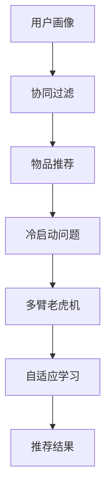
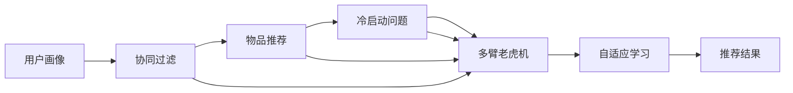

                 

# 注意力经济与个性化推荐：为受众提供定制、有针对性的内容

在当今信息爆炸的时代，消费者面对海量的内容，常常感到不知所措。如何在众多信息中，找到最适合自己的内容，成为了一个亟待解决的问题。这其中，个性化推荐系统起到了至关重要的作用。本文将深入探讨个性化推荐系统的核心原理、算法实现、应用场景及其未来发展趋势，并提出一些改进建议。

## 1. 背景介绍

### 1.1 问题由来

随着互联网的普及和移动设备的广泛应用，人们获取信息的渠道日益多样化。如何从海量的信息中快速找到有价值的内容，成为用户关注的焦点。传统的“一刀切”式推荐方式已无法满足用户个性化需求，个性化推荐系统应运而生。通过分析用户的历史行为和兴趣偏好，个性化推荐系统能够为用户提供更加贴合其需求的内容推荐，提升用户体验。

### 1.2 问题核心关键点

个性化推荐系统的核心在于通过用户数据进行精准的兴趣建模，并在此基础上生成个性化推荐列表。其关键点包括：

- **用户兴趣建模**：通过用户的历史行为（如浏览记录、点击行为、评分等）构建用户兴趣模型，用于预测用户对特定内容的兴趣程度。
- **内容表示**：将不同内容（如文章、视频、商品等）表示为向量形式，便于计算相似度和预测用户偏好。
- **推荐算法**：设计高效的推荐算法，能够在保证推荐多样性的同时，提升推荐的准确性和相关性。
- **系统优化**：优化推荐系统架构和算法，提高推荐效率和系统稳定性，确保推荐结果的及时性。

## 2. 核心概念与联系

### 2.1 核心概念概述

为更好地理解个性化推荐系统的工作原理，我们首先介绍几个关键概念：

- **用户画像(User Profile)**：通过对用户的历史行为、兴趣、社交信息等进行综合分析，构建用户的全面画像，用于指导推荐算法。
- **协同过滤(Collaborative Filtering)**：一种基于用户历史行为或项目历史评分进行推荐的算法，常用于个性化推荐系统中。
- **物品推荐(Items Recommendation)**：根据用户的历史行为和兴趣，推荐可能感兴趣的新物品或新内容。
- **冷启动问题(Cold Start Problem)**：对于新用户或新物品，由于缺乏足够的历史数据，推荐效果往往不佳，需要进行针对性的算法优化。
- **多臂老虎机(Multi-armed Bandit)**：一种随机化策略，用于动态调整推荐算法中的探索和利用策略，提升推荐效果。
- **自适应学习(Adaptive Learning)**：根据用户反馈动态调整推荐策略，提高推荐系统的准确性和用户体验。

这些核心概念通过相互协作，共同构成了个性化推荐系统的基本框架。下面通过一个简单的Mermaid流程图来展示这些概念之间的联系：



### 2.2 核心概念原理和架构的 Mermaid 流程图



这个流程图展示了个性化推荐系统的基本工作流程：从用户画像出发，协同过滤算法对用户历史行为进行分析，根据物品推荐算法为用户生成推荐列表。在遇到冷启动问题时，通过多臂老虎机算法进行探索和利用策略的动态调整，同时利用自适应学习算法根据用户反馈不断优化推荐策略，最终输出推荐结果。

## 3. 核心算法原理 & 具体操作步骤

### 3.1 算法原理概述

个性化推荐系统的核心算法主要有协同过滤和基于内容的推荐两大类。协同过滤算法主要基于用户历史行为数据进行推荐，而基于内容的推荐则主要关注物品本身的特点。

#### 3.1.1 协同过滤

协同过滤算法主要分为两种：基于用户的协同过滤和基于项目的协同过滤。

- **基于用户的协同过滤**：通过分析用户之间的相似性，为用户推荐其他用户喜欢的物品。具体实现方式包括基于用户的平均评分、用户评分加权平均等。
- **基于项目的协同过滤**：通过分析物品之间的相似性，为物品推荐相似的物品。具体实现方式包括基于物品的平均评分、物品评分加权平均等。

协同过滤算法的核心在于如何计算用户和物品之间的相似性。常用的相似性计算方法包括余弦相似度、皮尔逊相关系数等。

#### 3.1.2 基于内容的推荐

基于内容的推荐算法主要通过物品本身的特征（如标签、属性、分类等）进行推荐。具体实现方式包括基于内容的协同过滤、基于内容的加权矩阵分解等。

#### 3.1.3 混合推荐

为克服单一推荐算法的不足，混合推荐算法将协同过滤和基于内容的推荐相结合，综合考虑用户历史行为和物品特征，生成更加精准的推荐结果。

### 3.2 算法步骤详解

下面以协同过滤算法为例，详细介绍个性化推荐系统的算法步骤：

#### 3.2.1 数据准备

1. **用户数据准备**：收集用户的基本信息和历史行为数据（如浏览记录、评分记录等）。
2. **物品数据准备**：收集物品的基本信息和属性特征（如商品名称、描述、标签等）。

#### 3.2.2 相似性计算

1. **用户相似性计算**：通过余弦相似度、皮尔逊相关系数等方法计算用户之间的相似度。
2. **物品相似性计算**：通过余弦相似度、欧氏距离等方法计算物品之间的相似度。

#### 3.2.3 推荐计算

1. **基于用户的推荐**：利用用户之间的相似性，为用户推荐其他用户喜欢的物品。
2. **基于项目的推荐**：利用物品之间的相似性，为物品推荐相似的物品。
3. **混合推荐**：结合基于用户和基于项目的推荐，生成最终的推荐结果。

### 3.3 算法优缺点

个性化推荐系统具有以下优点：

1. **高效性**：在用户数据和物品数据充足的情况下，推荐系统能够快速生成推荐结果。
2. **个性化**：通过分析用户的历史行为和兴趣，能够提供个性化的推荐内容。
3. **可扩展性**：推荐系统可以通过不断增加用户和物品数据进行扩展，提高推荐准确性。

同时，个性化推荐系统也存在以下缺点：

1. **冷启动问题**：对于新用户或新物品，由于缺乏足够的历史数据，推荐效果不佳。
2. **数据稀疏性**：用户和物品之间的评分数据往往是不完整的，影响了推荐准确性。
3. **可解释性差**：推荐系统内部的算法复杂，难以解释推荐结果的生成过程。

### 3.4 算法应用领域

个性化推荐系统已经在多个领域得到广泛应用，例如：

- **电商推荐**：为电商网站用户推荐商品。通过分析用户的浏览记录和购买历史，推荐用户可能感兴趣的商品。
- **视频推荐**：为用户推荐视频内容。通过分析用户的观看记录和评分，推荐用户可能感兴趣的视频。
- **音乐推荐**：为用户推荐音乐内容。通过分析用户的听歌记录和评分，推荐用户可能喜欢的音乐。
- **新闻推荐**：为用户推荐新闻内容。通过分析用户的阅读记录和评分，推荐用户可能感兴趣的新闻。
- **社交网络**：为社交网络用户推荐朋友或内容。通过分析用户之间的互动关系，推荐可能感兴趣的朋友或内容。

## 4. 数学模型和公式 & 详细讲解 & 举例说明

### 4.1 数学模型构建

#### 4.1.1 协同过滤

假设用户集合为 $U$，物品集合为 $I$，用户对物品的评分矩阵为 $R \in \mathbb{R}^{m \times n}$，其中 $m$ 为用户数，$n$ 为物品数。

基于用户的协同过滤算法通过计算用户之间的相似性，为每个用户生成推荐列表。假设用户 $u_i$ 和 $u_j$ 的相似度为 $s(u_i, u_j)$，则用户 $u_i$ 对物品 $i$ 的推荐评分可以通过以下公式计算：

$$
\hat{r}_{ui} = \sum_{j \in U} s(u_i, u_j) r_{uj}
$$

其中，$R_{uj}$ 为用户 $u_j$ 对物品 $j$ 的评分。

#### 4.1.2 基于内容的推荐

基于内容的推荐算法主要关注物品本身的特征。假设物品 $i$ 的特征向量为 $v_i \in \mathbb{R}^d$，用户 $u$ 对物品 $i$ 的兴趣度可以通过以下公式计算：

$$
\hat{r}_{ui} = w^T \phi(v_i)
$$

其中，$w$ 为兴趣度向量，$\phi(v_i)$ 为物品特征映射函数。

### 4.2 公式推导过程

#### 4.2.1 协同过滤

基于用户的协同过滤算法通过计算用户之间的相似性，为每个用户生成推荐列表。假设用户 $u_i$ 和 $u_j$ 的相似度为 $s(u_i, u_j)$，则用户 $u_i$ 对物品 $i$ 的推荐评分可以通过以下公式计算：

$$
\hat{r}_{ui} = \sum_{j \in U} s(u_i, u_j) r_{uj}
$$

其中，$R_{uj}$ 为用户 $u_j$ 对物品 $j$ 的评分。

#### 4.2.2 基于内容的推荐

基于内容的推荐算法主要关注物品本身的特征。假设物品 $i$ 的特征向量为 $v_i \in \mathbb{R}^d$，用户 $u$ 对物品 $i$ 的兴趣度可以通过以下公式计算：

$$
\hat{r}_{ui} = w^T \phi(v_i)
$$

其中，$w$ 为兴趣度向量，$\phi(v_i)$ 为物品特征映射函数。

### 4.3 案例分析与讲解

#### 4.3.1 协同过滤案例

假设有一个用户 $u_1$ 对物品 $i$ 的评分为 $4$，对物品 $j$ 的评分为 $3$，用户 $u_2$ 对物品 $j$ 的评分为 $5$，对物品 $k$ 的评分为 $4$。用户 $u_1$ 和 $u_2$ 的相似度为 $0.8$。根据基于用户的协同过滤算法，用户 $u_1$ 对物品 $k$ 的推荐评分可以通过以下公式计算：

$$
\hat{r}_{u_1k} = s(u_1, u_2) r_{2k} = 0.8 \times 4 = 3.2
$$

#### 4.3.2 基于内容的推荐案例

假设有一个用户 $u$ 对物品 $i$ 的特征向量 $v_i = [1, 0, 1]$，用户 $u$ 的兴趣度向量为 $w = [0.5, 0.5]$。假设物品 $j$ 的特征向量 $v_j = [0, 1, 0]$，物品特征映射函数 $\phi(v_j) = [0.2, 0.5, 0.3]$。根据基于内容的推荐算法，用户 $u$ 对物品 $j$ 的兴趣度可以通过以下公式计算：

$$
\hat{r}_{uj} = w^T \phi(v_j) = [0.5, 0.5] \cdot [0.2, 0.5, 0.3] = 0.5 \times 0.2 + 0.5 \times 0.5 = 0.4 + 0.25 = 0.65
$$

## 5. 项目实践：代码实例和详细解释说明

### 5.1 开发环境搭建

在进行个性化推荐系统开发前，我们需要准备好开发环境。以下是使用Python进行Spark MLlib开发的Python环境配置流程：

1. 安装Anaconda：从官网下载并安装Anaconda，用于创建独立的Python环境。

2. 创建并激活虚拟环境：
```bash
conda create -n py-spark python=3.8 
conda activate py-spark
```

3. 安装Spark：从官网下载并安装Spark，安装相应的依赖包。

4. 安装PySpark：
```bash
pip install pyspark
```

5. 安装各类工具包：
```bash
pip install numpy pandas scikit-learn matplotlib tqdm jupyter notebook ipython
```

完成上述步骤后，即可在`py-spark`环境中开始推荐系统开发。

### 5.2 源代码详细实现

下面是使用PySpark进行协同过滤推荐系统的代码实现：

```python
from pyspark.ml import Pipeline
from pyspark.ml.recommendation import ALS
from pyspark.sql import SparkSession

spark = SparkSession.builder.appName("Collaborative Filtering").getOrCreate()

# 创建数据框
ratings_df = spark.createDataFrame([
    (1, 1, 4), (1, 2, 3), (2, 2, 5), (2, 3, 4)
], ["user_id", "item_id", "rating"])

# 协同过滤模型
als = ALS(itemsCol="item_id", userCol="user_id", ratingsCol="rating", rank=10)

# 模型训练
model = als.fit(ratings_df)

# 生成推荐结果
recommendations = model.transform(ratings_df)
recommendations.show()
```

### 5.3 代码解读与分析

让我们再详细解读一下关键代码的实现细节：

1. **数据准备**：创建一个简单的数据框，包含用户ID、物品ID和评分数据。
2. **模型训练**：使用ALS模型进行协同过滤，设置物品ID为`item_id`，用户ID为`user_id`，评分数据为`rating`，训练参数为`rank=10`。
3. **推荐生成**：通过模型训练后的数据，生成推荐结果。

## 6. 实际应用场景

### 6.1 电商推荐

电商网站通过个性化推荐系统，向用户推荐商品，提高用户购物体验和转化率。推荐系统能够根据用户的历史浏览记录、购买历史和评分数据，为用户推荐可能感兴趣的商品。

### 6.2 视频推荐

视频网站通过个性化推荐系统，为用户推荐视频内容。推荐系统能够根据用户的历史观看记录和评分数据，为用户推荐可能感兴趣的视频。

### 6.3 音乐推荐

音乐平台通过个性化推荐系统，为用户推荐音乐内容。推荐系统能够根据用户的听歌记录和评分数据，为用户推荐可能喜欢的音乐。

### 6.4 新闻推荐

新闻网站通过个性化推荐系统，为用户推荐新闻内容。推荐系统能够根据用户的阅读记录和评分数据，为用户推荐可能感兴趣的新闻。

### 6.5 社交网络

社交网络通过个性化推荐系统，为用户推荐朋友或内容。推荐系统能够根据用户之间的互动关系，推荐可能感兴趣的朋友或内容。

## 7. 工具和资源推荐

### 7.1 学习资源推荐

为帮助开发者系统掌握个性化推荐系统的理论基础和实践技巧，这里推荐一些优质的学习资源：

1. 《推荐系统实战》系列博文：由推荐系统领域专家撰写，涵盖推荐系统原理、算法、技术栈等内容。

2. CS229《机器学习》课程：斯坦福大学开设的机器学习课程，包含推荐系统章节，系统介绍推荐算法原理和应用。

3. 《推荐系统》书籍：Recommender Systems领域的经典书籍，全面介绍推荐系统理论和实践，涵盖协同过滤、基于内容的推荐等多种算法。

4. PySpark官方文档：Spark MLlib的官方文档，提供丰富的推荐系统样例代码和文档，是推荐系统开发的必备资料。

5. Mahout开源项目：推荐系统开源项目，包含丰富的推荐算法实现和评估工具，助力推荐系统研究。

通过对这些资源的学习实践，相信你一定能够快速掌握个性化推荐系统的精髓，并用于解决实际的推荐问题。

### 7.2 开发工具推荐

高效的开发离不开优秀的工具支持。以下是几款用于推荐系统开发的常用工具：

1. Spark MLlib：基于Apache Spark的推荐系统库，提供丰富的协同过滤和基于内容的推荐算法实现。

2. TensorFlow：由Google主导开发的深度学习框架，支持推荐系统中的矩阵分解等算法实现。

3. PyTorch：基于Python的开源深度学习框架，灵活的计算图支持高效的推荐算法实现。

4. Jupyter Notebook：交互式编程环境，方便进行推荐算法的实验和调试。

5. Weights & Biases：推荐系统训练的实验跟踪工具，可以记录和可视化模型训练过程中的各项指标，方便对比和调优。

6. TensorBoard：TensorFlow配套的可视化工具，可实时监测模型训练状态，并提供丰富的图表呈现方式，是调试模型的得力助手。

合理利用这些工具，可以显著提升推荐系统的开发效率，加快创新迭代的步伐。

### 7.3 相关论文推荐

推荐系统的发展源于学界的持续研究。以下是几篇奠基性的相关论文，推荐阅读：

1. Matrix Factorization Techniques for Recommender Systems（协同过滤）：提出矩阵分解技术，通过分解用户-物品评分矩阵，生成推荐结果。

2. Beyond the Matrix Factorization: A Canonical Tensor Factorization Framework for Recommender Systems（基于内容的推荐）：提出高阶张量分解技术，提升推荐系统的准确性和多样性。

3. A Survey of Recommendation Systems（推荐系统综述）：全面介绍推荐系统的历史、原理、算法和应用。

4. Factorization Machines for Personalized Recommendation（因子机）：提出因子机算法，通过组合低阶因子，生成推荐结果。

5. Deep Collaborative Filtering（深度协同过滤）：提出深度神经网络，通过多层次的特征学习，提升推荐系统的准确性和泛化能力。

这些论文代表了个性化推荐系统的发展脉络。通过学习这些前沿成果，可以帮助研究者把握学科前进方向，激发更多的创新灵感。

## 8. 总结：未来发展趋势与挑战

### 8.1 研究成果总结

个性化推荐系统已经取得了显著的成效，广泛应用于电商、视频、音乐、新闻等多个领域。其核心算法包括协同过滤和基于内容的推荐，通过分析用户历史行为和物品特征，为用户生成个性化推荐。

### 8.2 未来发展趋势

展望未来，个性化推荐系统将呈现以下几个发展趋势：

1. **多模态推荐**：结合用户的多模态数据（如文本、图像、语音等），提升推荐系统的准确性和多样性。
2. **跨域推荐**：通过跨域推荐技术，将不同领域的推荐系统进行联合优化，提升推荐效果。
3. **实时推荐**：通过实时推荐技术，动态调整推荐策略，提升推荐系统的实时性。
4. **用户行为分析**：通过深入分析用户行为，提取用户潜在需求，提升推荐系统的个性化程度。
5. **深度学习**：通过深度学习技术，提高推荐系统的泛化能力和准确性。
6. **自适应推荐**：通过自适应推荐技术，根据用户反馈动态调整推荐策略，提升推荐系统的准确性和用户体验。

### 8.3 面临的挑战

尽管个性化推荐系统已经取得了显著的成效，但在迈向更加智能化、普适化应用的过程中，它仍面临着诸多挑战：

1. **冷启动问题**：对于新用户或新物品，由于缺乏足够的历史数据，推荐效果不佳。需要进行针对性的算法优化。
2. **数据稀疏性**：用户和物品之间的评分数据往往是不完整的，影响了推荐准确性。需要进行数据补全和噪声处理。
3. **可解释性差**：推荐系统内部的算法复杂，难以解释推荐结果的生成过程。需要增强推荐系统的可解释性。
4. **性能瓶颈**：推荐系统在面对大规模数据时，容易受到计算资源限制。需要进行算法优化和资源优化。
5. **安全性和隐私**：推荐系统需要保护用户隐私和数据安全。需要进行数据加密和安全防护。

### 8.4 研究展望

未来的个性化推荐系统需要在以下几个方面进行研究：

1. **高效推荐算法**：开发更加高效和轻量级的推荐算法，提升推荐系统的实时性和资源利用率。
2. **多模态融合**：通过多模态数据融合技术，提升推荐系统的准确性和多样性。
3. **自适应推荐**：通过自适应推荐技术，根据用户反馈动态调整推荐策略，提升推荐系统的准确性和用户体验。
4. **数据处理**：通过数据补全和噪声处理技术，提升推荐系统的数据质量和推荐效果。
5. **安全性和隐私**：通过数据加密和安全防护技术，保障用户隐私和数据安全。
6. **可解释性**：通过推荐系统的可解释性技术，增强推荐系统的透明度和可信度。

总之，个性化推荐系统需要从算法、数据、工程、应用等多个维度协同发力，才能不断提升推荐效果，满足用户日益增长的个性化需求。

## 9. 附录：常见问题与解答

**Q1：推荐系统为什么需要冷启动问题？**

A: 冷启动问题是指在面对新用户或新物品时，由于缺乏足够的历史数据，推荐效果不佳。为了解决冷启动问题，需要设计针对性的算法，如基于内容的推荐、基于标签的推荐、基于用户兴趣的推荐等。

**Q2：推荐系统的评分数据应该如何处理？**

A: 推荐系统的评分数据需要进行预处理，包括数据补全、噪声处理、标准化等。常用的数据处理方法包括均值归一化、行列交换等。

**Q3：推荐系统的推荐算法应该如何选择？**

A: 推荐算法的选择应根据具体应用场景和数据特点进行，常用的推荐算法包括协同过滤、基于内容的推荐、混合推荐等。需要根据实际情况进行算法优化和组合。

**Q4：推荐系统的实时性如何保证？**

A: 推荐系统的实时性可以通过缓存技术、异步处理、多级缓存等方式进行优化。通过实时推荐技术，动态调整推荐策略，提升推荐系统的实时性。

**Q5：推荐系统的安全性如何保障？**

A: 推荐系统需要保障用户隐私和数据安全，需要进行数据加密、访问控制等安全防护措施。

这些问题的答案展示了推荐系统开发过程中需要考虑的多个维度，需要在算法、数据、工程、应用等多个方面协同发力，才能构建出高效、个性化、安全的推荐系统。

---

作者：禅与计算机程序设计艺术 / Zen and the Art of Computer Programming

