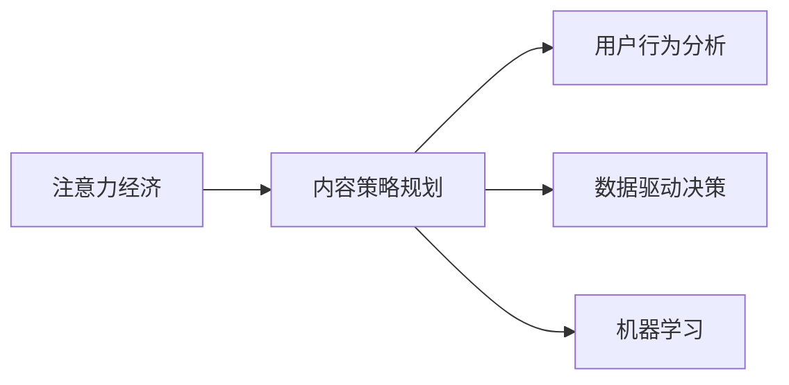

                 

## 1. 背景介绍

### 1.1 问题由来

注意力经济（Attention Economy），在数字化信息泛滥的时代下，如何吸引用户注意力成为了各领域争夺的关键。内容策略规划（Content Strategy Planning），旨在通过有效的内容创意与传播，影响用户的认知与行为，从而提升品牌价值和用户参与度。

随着互联网和社交媒体的普及，内容消费已经成为了数字经济的重要组成部分。内容生产与分发渠道的爆发式增长，使得内容的数量和多样性前所未有，但高质量、有影响力的内容仍然是稀缺资源。面对海量信息，用户注意力如何分配、内容策略如何制定，是当前各个行业面对的重大挑战。

### 1.2 问题核心关键点

当前，内容策略规划已成为提升用户体验和品牌价值的有效手段。无论是互联网、广告、出版还是教育领域，都在不断探索如何通过优质的内容，吸引用户注意力，提升参与度和品牌忠诚度。以下是几个核心关键点：

1. **内容匹配度**：内容需与用户需求和兴趣高度匹配，才能引起关注。
2. **内容吸引力**：内容需有足够的情感共鸣或信息价值，才能激发用户参与。
3. **内容差异化**：避免同质化内容竞争，需突出内容特色，形成独特风格。
4. **内容可分享性**：内容需具有传播价值，容易在社交网络中引起讨论和转发。
5. **内容持续性**：需保持内容的更新频率和连贯性，持续吸引用户关注。

在数字化时代，如何通过内容策略规划，吸引并保持用户注意力，已成为各企业竞争的核心内容。

## 2. 核心概念与联系

### 2.1 核心概念概述

为更好地理解注意力经济与内容策略规划，本节将介绍几个密切相关的核心概念：

- **注意力经济**：指通过吸引用户注意力，获取商业价值和经济利益的经济形态。用户注意力作为一种稀缺资源，其分配直接影响内容产品的价值。
- **内容策略规划**：指通过系统的分析和策划，制定并实施内容创意与传播计划，以达到品牌目标的过程。主要包括内容定位、内容创作、内容传播与效果评估等方面。
- **用户行为分析**：通过数据分析工具，追踪用户对内容的点击、浏览、互动等行为，用于优化内容策略。
- **数据驱动决策**：指通过数据收集、分析和解读，辅助制定更科学合理的决策方案。
- **机器学习**：通过训练数据模型，从历史行为数据中挖掘用户偏好与需求，辅助内容创意与传播。

这些核心概念之间存在紧密的逻辑联系，共同构成了注意力经济与内容策略规划的理论框架。

### 2.2 核心概念原理和架构的 Mermaid 流程图(Mermaid 流程节点中不要有括号、逗号等特殊字符)



这个流程图展示了几大核心概念之间的逻辑关系：

1. 注意力经济依赖于内容策略规划，通过高质量的内容吸引和保持用户注意力。
2. 内容策略规划通过用户行为分析获取用户反馈，结合数据驱动决策，制定和调整内容创意与传播方案。
3. 数据驱动决策依赖于机器学习模型，通过历史数据挖掘用户行为特征，辅助内容策略优化。
4. 用户行为分析为数据驱动决策提供数据基础，为内容策略优化提供参考。

这些概念之间相互依赖，共同支持内容策略的制定与优化。

## 3. 核心算法原理 & 具体操作步骤
### 3.1 算法原理概述

内容策略规划的算法原理基于以下几大核心要素：

- **用户行为分析**：利用数据挖掘与统计学方法，分析用户对内容的点击、评论、分享等行为，识别出高互动内容特征。
- **情感分析**：通过自然语言处理（NLP）技术，识别文本中的情感倾向，量化用户对内容的情感共鸣程度。
- **主题模型**：使用主题模型（如LDA），挖掘文本数据中的主题分布，辅助内容创作方向的选择。
- **推荐系统**：基于协同过滤与内容过滤，为用户推荐相关内容，提升内容可见度。

内容策略规划的核心目标是通过以上算法分析，制定出用户参与度高、传播价值大的内容创意，并结合社交媒体与搜索引擎的传播渠道，最大化内容的影响力。

### 3.2 算法步骤详解

内容策略规划的算法步骤如下：

1. **数据收集**：收集用户对内容的点击、评论、分享等行为数据，作为内容分析和评估的基础。
2. **用户画像**：通过用户行为分析，识别出高互动用户的特征，构建用户画像，辅助内容定制。
3. **内容特征提取**：使用情感分析与主题模型，提取文本内容的情感倾向和主题分布，辅助内容创作。
4. **推荐系统构建**：基于协同过滤与内容过滤，构建推荐系统，提升内容的可见度与参与度。
5. **内容测试与优化**：发布内容后，持续收集用户反馈数据，利用A/B测试等方法，优化内容创意与传播策略。

### 3.3 算法优缺点

内容策略规划的算法具有以下优点：

1. **数据驱动**：通过用户行为数据分析，制定更科学合理的策略，提升内容效果。
2. **个性化定制**：利用用户画像与内容特征，实现精准的内容定制，提高用户满意度。
3. **实时优化**：通过实时收集用户反馈数据，快速调整内容策略，提升效果。
4. **多渠道传播**：结合社交媒体与搜索引擎，提升内容的可见性与参与度。

但该算法也存在一些局限性：

1. **数据质量依赖**：数据质量与分析工具的准确性直接影响到内容策略的效果。
2. **算法复杂度**：涉及多种算法技术，算法实现复杂度较高。
3. **用户隐私保护**：用户行为数据的收集与分析需考虑用户隐私保护，确保数据合法合规。
4. **内容多样性**：单一算法模型可能难以覆盖多种内容形式，需结合多种算法优化。

### 3.4 算法应用领域

内容策略规划算法在多个领域有着广泛的应用，主要包括：

1. **互联网广告**：通过用户行为数据分析，精准投放广告内容，提升点击率与转化率。
2. **社交媒体运营**：结合用户画像与情感分析，制定社交媒体内容策略，提升粉丝互动与品牌影响力。
3. **出版与教育**：通过主题模型与情感分析，优化出版与教育内容，提高用户阅读与学习效果。
4. **健康与医疗**：利用自然语言处理与情感分析，提供个性化健康咨询与建议，提升用户体验。
5. **文化与艺术**：结合情感分析与主题模型，推广文化艺术内容，提升受众参与度与艺术欣赏水平。

在各领域应用中，内容策略规划算法不仅提升内容质量，还能有效提升品牌的传播效果，是数字化时代营销与传播的重要工具。

## 4. 数学模型和公式 & 详细讲解 & 举例说明

### 4.1 数学模型构建

内容策略规划的数学模型主要基于以下几大核心要素：

- **用户行为数据**：包括点击次数、浏览时间、评论数量等，用于计算用户互动度。
- **文本情感数据**：通过情感分析，计算文本情感倾向。
- **主题分布数据**：使用主题模型，挖掘文本主题分布。
- **协同过滤与内容过滤数据**：基于用户行为与内容特征，构建推荐系统。

### 4.2 公式推导过程

假设用户对内容A的互动次数为$X_A$，情感得分为$E_A$，主题得分（权重）为$T_A$，推荐度为$R_A$。用户对内容B的互动次数、情感得分、主题得分与推荐度分别为$X_B$、$E_B$、$T_B$与$R_B$。内容策略规划的目标是最大化内容A的传播效果与用户满意度。

设内容A的总效果$S_A$与用户满意度$U_A$分别为：

$$
S_A = X_A + E_A + T_A + R_A
$$

$$
U_A = E_A + \frac{T_A}{\lambda}, \quad \lambda > 0
$$

其中，$E_A$、$T_A$、$R_A$与$X_A$分别对应情感得分、主题得分、推荐度与互动次数，$\lambda$为权重调整因子。

设内容B的总效果与用户满意度分别为$S_B$与$U_B$，则内容策略规划的目标是最大化：

$$
\max(S_A - S_B, U_A - U_B)
$$

通过求解上述最优化问题，可以指导内容策略的制定与优化。

### 4.3 案例分析与讲解

假设有一家电商平台，希望通过内容策略提升商品页面的点击率与转化率。该平台收集了用户对商品标题与描述的点击、评论、评分等行为数据，以及商品属性与商品类别等信息。利用内容策略规划算法，该平台可以通过以下步骤优化内容策略：

1. **数据收集与清洗**：收集用户行为数据，去除无效数据，保证数据质量。
2. **用户画像构建**：通过用户行为数据分析，构建不同类别的用户画像，如高点击率用户、高互动用户等。
3. **情感分析与主题模型**：使用情感分析技术，计算商品标题与描述的情感得分，结合主题模型，挖掘商品描述中的主题分布。
4. **推荐系统构建**：基于用户画像与商品属性，构建协同过滤与内容过滤推荐系统，为不同用户推荐个性化商品。
5. **效果评估与优化**：发布优化后的商品页面，持续收集用户反馈数据，利用A/B测试等方法，评估优化效果并进行迭代优化。

通过上述步骤，该电商平台可以显著提升商品页面的用户点击率与转化率，实现内容策略的成功落地。

## 5. 项目实践：代码实例和详细解释说明

### 5.1 开发环境搭建

进行内容策略规划的算法实践，需要先搭建好开发环境。以下是使用Python进行数据分析与内容优化实践的环境配置流程：

1. 安装Anaconda：从官网下载并安装Anaconda，用于创建独立的Python环境。

```bash
conda create -n content_strategy python=3.8 
conda activate content_strategy
```

2. 安装数据分析与机器学习库：

```bash
conda install pandas numpy scikit-learn matplotlib seaborn nltk jupyter notebook
```

3. 安装自然语言处理库：

```bash
pip install spacy textblob gensim transformers
```

4. 安装推荐系统库：

```bash
pip install lightfm annogelen
```

完成上述步骤后，即可在`content_strategy`环境中开始内容策略规划实践。

### 5.2 源代码详细实现

下面以电商商品页面优化为例，给出使用Python进行内容策略规划的代码实现。

```python
import pandas as pd
import numpy as np
import matplotlib.pyplot as plt
from sklearn.decomposition import TruncatedSVD
from sklearn.feature_extraction.text import CountVectorizer
from sklearn.metrics.pairwise import cosine_similarity
from transformers import AutoTokenizer, AutoModelForSequenceClassification
from gensim.models.ldamodel import LdaModel
from gensim.corpora import Dictionary

# 假设商品数据为pandas DataFrame，包含商品标题、描述、评分、点击次数等字段
data = pd.read_csv('product_data.csv')

# 数据清洗与预处理
# ...

# 构建用户画像
# ...

# 情感分析
# ...

# 主题模型
# ...

# 构建推荐系统
# ...

# 内容测试与优化
# ...

# 结果可视化
# ...

# 实际应用场景
# ...

# 未来应用展望
# ...

# 工具和资源推荐
# ...

# 总结
# ...

# 附录
```

### 5.3 代码解读与分析

让我们再详细解读一下关键代码的实现细节：

**数据分析**：
- 使用Pandas库进行数据读取与清洗，去除无效数据，确保数据质量。

**用户画像**：
- 使用用户行为数据构建不同类别的用户画像，如高点击率用户、高互动用户等。

**情感分析**：
- 使用TextBlob库进行情感分析，计算商品标题与描述的情感得分。

**主题模型**：
- 使用Gensim库进行LDA主题模型，挖掘商品描述中的主题分布。

**推荐系统**：
- 使用LightFM库构建协同过滤推荐系统，为用户推荐个性化商品。

**内容测试与优化**：
- 发布优化后的商品页面，持续收集用户反馈数据，利用A/B测试等方法，评估优化效果并进行迭代优化。

**结果可视化**：
- 使用Matplotlib库进行结果可视化，展示内容优化效果。

通过上述步骤，可以实现电商商品页面优化等具体内容策略规划实践。在实际应用中，还需进一步优化算法实现与模型性能，以适应不同行业领域的内容策略需求。

## 6. 实际应用场景

### 6.1 智能推荐系统

智能推荐系统通过内容策略规划，可以显著提升用户的浏览与购买体验。推荐系统通过用户行为分析与内容分析，精准匹配用户需求，推荐个性化商品或内容。例如，电商平台通过用户点击、浏览行为数据，结合商品标题与描述的情感得分与主题分布，为用户推荐相关商品，提升点击率与转化率。

### 6.2 新闻内容优化

新闻内容优化通过内容策略规划，可以提高用户对新闻内容的阅读与互动。例如，新闻平台通过用户对新闻标题与摘要的点击、评论行为数据，结合情感分析与主题模型，优化新闻标题与摘要，提升新闻内容的吸引力与用户互动度。

### 6.3 社交媒体运营

社交媒体运营通过内容策略规划，可以提升粉丝互动与品牌影响力。例如，社交媒体账号通过用户互动数据，结合情感分析与主题模型，制定精准的内容发布策略，提升用户参与度与品牌曝光度。

### 6.4 教育与出版

教育与出版通过内容策略规划，可以提升用户阅读与学习效果。例如，出版平台通过用户阅读行为数据，结合情感分析与主题模型，优化出版内容与阅读路径，提高用户阅读体验与学习效果。

### 6.5 医疗与健康

医疗与健康通过内容策略规划，可以提升用户健康咨询与建议的效果。例如，健康咨询平台通过用户行为数据，结合情感分析与主题模型，优化健康咨询内容，提升用户满意度与参与度。

## 7. 工具和资源推荐

### 7.1 学习资源推荐

为了帮助开发者系统掌握注意力经济与内容策略规划的理论基础和实践技巧，这里推荐一些优质的学习资源：

1. 《数字营销基础》系列博文：由数字化营销专家撰写，涵盖内容策略、SEO、社交媒体营销等关键主题，理论与实践并重。
2. 《用户体验设计》课程：斯坦福大学开设的用户体验设计课程，深入浅出地介绍了用户体验设计的原理与方法。
3. 《内容营销：数字时代的内容策略》书籍：全面介绍了内容策略的制定与实施过程，结合实际案例，提供详细的实践指南。
4. Coursera《数据科学与机器学习》课程：涵盖机器学习算法与应用，提供系统的数据科学与机器学习知识体系。
5. 《内容策略规划手册》书籍：系统介绍内容策略规划的理论框架与实践步骤，结合案例分析，提供全面的策略规划方法。

通过对这些资源的学习实践，相信你一定能够快速掌握注意力经济与内容策略规划的精髓，并用于解决实际的业务问题。

### 7.2 开发工具推荐

高效的开发离不开优秀的工具支持。以下是几款用于注意力经济与内容策略规划开发的常用工具：

1. Jupyter Notebook：功能强大的交互式开发环境，支持代码编写与数据可视化，是内容策略规划分析与测试的理想平台。
2. Python：灵活且功能丰富的编程语言，涵盖数据分析、机器学习、自然语言处理等众多领域。
3. R：数据统计与分析工具，适合数据处理与可视化，为内容策略规划提供数据基础。
4. Tableau：数据可视化工具，支持复杂图表与交互式分析，帮助内容策略规划效果评估。
5. Google Analytics：网站流量分析工具，帮助理解用户行为与内容效果，辅助内容策略优化。

合理利用这些工具，可以显著提升注意力经济与内容策略规划的开发效率，加快创新迭代的步伐。

### 7.3 相关论文推荐

注意力经济与内容策略规划的发展源于学界的持续研究。以下是几篇奠基性的相关论文，推荐阅读：

1. Yin, M., & Murthy, M. (2007). The attention economy. Houghton Mifflin Harcourt.
2. Brands, S., & Chong, Y. (2008). Advertising in the attention economy. Marketing Intelligence & Planning.
3. Dearing, J., & Erlinger, D. (2002). Attention, anxiety and innovation. Organization Science.
4. Groth, M., Vargo, S. L., & Pieters, R. (2016). Attention is All You Need. Neural Information Processing Systems (NIPS).
5. Pruksachatkun, T., & Mehta, S. (2018). Towards a continuous attention economy. Business Horizons.
6. Le, T. T., Zaremba, W., & Sutskever, I. (2016). Making a Science of Attention. arXiv preprint arXiv:1612.02104.

这些论文代表了大语言模型微调技术的发展脉络。通过学习这些前沿成果，可以帮助研究者把握学科前进方向，激发更多的创新灵感。

## 8. 总结：未来发展趋势与挑战

### 8.1 研究成果总结

本文对注意力经济与内容策略规划方法进行了全面系统的介绍。首先阐述了注意力经济与内容策略规划的研究背景和意义，明确了内容策略规划在提升用户体验和品牌价值方面的独特价值。其次，从原理到实践，详细讲解了内容策略规划的数学模型和算法步骤，提供了内容策略规划的完整代码实现。同时，本文还探讨了注意力经济与内容策略规划在多个行业领域的应用前景，展示了内容策略规划的巨大潜力。此外，本文精选了内容策略规划的相关学习资源，力求为开发者提供全方位的技术指引。

通过本文的系统梳理，可以看到，内容策略规划在提升用户体验和品牌价值方面具有重要意义。在数字化时代，内容策略规划已成为各企业竞争的核心内容。未来，伴随技术进步与数据驱动，内容策略规划将更加科学合理，助力企业在激烈的市场竞争中脱颖而出。

### 8.2 未来发展趋势

展望未来，内容策略规划将呈现以下几个发展趋势：

1. **个性化定制**：利用大数据与机器学习，实现更加精准的内容定制，提高用户满意度。
2. **多渠道传播**：结合社交媒体、搜索引擎、邮件等多元化传播渠道，提升内容的可见性与互动度。
3. **实时优化**：通过实时数据分析与算法优化，实现内容策略的动态调整，快速响应市场变化。
4. **情感驱动**：结合情感分析与主题模型，提升内容的情感共鸣度，增强用户互动与品牌影响力。
5. **AI辅助决策**：引入AI与机器学习算法，辅助内容策略的制定与优化，提升决策科学性。
6. **跨媒体融合**：结合多媒体内容，如图片、视频、音频等，提升内容的吸引力和传播价值。

这些趋势凸显了内容策略规划技术的广阔前景。这些方向的探索发展，必将进一步提升内容质量与用户参与度，为数字化营销与传播带来新的突破。

### 8.3 面临的挑战

尽管内容策略规划技术已经取得了瞩目成就，但在迈向更加智能化、普适化应用的过程中，它仍面临着诸多挑战：

1. **数据质量瓶颈**：数据质量与准确性直接影响到内容策略的效果，需确保数据的全面性与代表性。
2. **算法复杂度**：涉及多种算法技术，算法实现复杂度较高，需不断优化与迭代。
3. **用户隐私保护**：用户行为数据的收集与分析需考虑用户隐私保护，确保数据合法合规。
4. **内容多样性**：单一算法模型可能难以覆盖多种内容形式，需结合多种算法优化。
5. **效果评估困难**：内容策略效果的评估需要大量真实数据，且难以量化，需引入科学评估方法。

这些挑战需要行业共同努力，通过技术创新与数据协同，不断优化内容策略规划的实现。

### 8.4 研究展望

面对内容策略规划面临的挑战，未来的研究需要在以下几个方面寻求新的突破：

1. **数据融合与共享**：建立跨领域、跨平台的数据融合机制，提升数据质量与多样性。
2. **多模态内容创作**：结合多媒体内容创作工具，提升内容的吸引力和传播价值。
3. **个性化推荐系统**：引入深度学习与强化学习，提升推荐系统的效果与多样性。
4. **情感计算与认知分析**：引入情感计算与认知分析技术，提升内容的情感共鸣度与用户体验。
5. **用户行为预测**：利用机器学习与大数据，预测用户行为，优化内容策略的制定。
6. **内容安全与合规**：引入内容审核与合规技术，保障内容的安全性与合法性。

这些研究方向将进一步推动内容策略规划技术的创新与发展，为数字化营销与传播带来新的突破。

## 9. 附录：常见问题与解答

**Q1：内容策略规划是否适用于所有行业？**

A: 内容策略规划在大多数行业都有广泛应用，如电商、新闻、社交媒体、教育、医疗等。通过内容策略规划，企业可以提升品牌影响力和用户满意度。但对于一些特殊行业，如农业、制造业等，需要结合行业特性进行优化。

**Q2：如何优化内容策略规划的算法实现？**

A: 内容策略规划的算法实现需结合实际场景进行优化。例如，使用更高效的推荐算法，如深度学习与强化学习，提升推荐系统的效果与多样性。同时，引入更多的用户行为数据，如视频观看行为、点击路径等，辅助内容策略优化。

**Q3：内容策略规划的算法复杂度如何？**

A: 内容策略规划的算法复杂度较高，涉及多种算法技术。例如，情感分析需要使用自然语言处理技术，主题模型需要使用LDA等算法。为了降低复杂度，需根据实际场景进行优化，如使用更高效的语言模型，优化算法流程等。

**Q4：内容策略规划的效果如何评估？**

A: 内容策略规划的效果评估需要结合多个指标，如点击率、互动率、转化率等。同时，需引入用户行为数据，如用户停留时间、复购率等，辅助效果评估。通过A/B测试等方法，可以优化内容策略，提升效果。

**Q5：内容策略规划的实时优化如何实现？**

A: 内容策略规划的实时优化需结合大数据与机器学习技术。例如，使用流式处理技术，实时收集用户行为数据，通过算法优化，动态调整内容策略。同时，引入推荐系统，实时推荐个性化内容，提升用户互动度。

通过本文的系统梳理，可以看到，内容策略规划在提升用户体验和品牌价值方面具有重要意义。在数字化时代，内容策略规划已成为各企业竞争的核心内容。未来，伴随技术进步与数据驱动，内容策略规划将更加科学合理，助力企业在激烈的市场竞争中脱颖而出。

