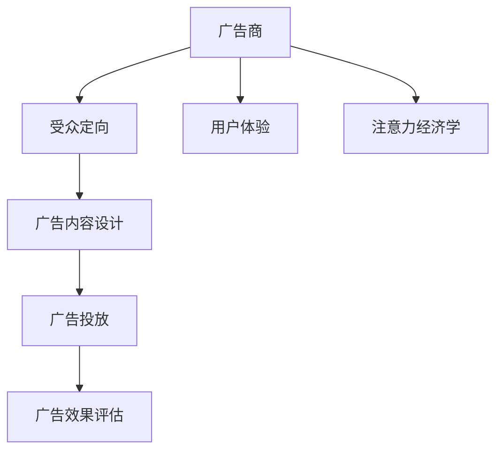

                 

# 注意力经济与广告：如何在不牺牲受众的情况下有效地吸引他们

在信息爆炸的时代，注意力成为一种稀缺资源。广告商在追求点击量和转化率的同时，越来越意识到保护受众注意力的重要性。如何在不牺牲受众的情况下，有效吸引他们的注意力，成为广告经济学的重要课题。本文将深入探讨这一问题，并给出相应的技术和策略建议。

## 1. 背景介绍

### 1.1 问题由来

随着互联网的普及和社交媒体的兴起，信息传播方式发生了巨大变化。广告商不再仅依赖传统电视、报纸等媒介，而是转向搜索引擎、社交平台等数字渠道。然而，这些数字渠道的信息量大、干扰多，广告商的点击率和转化率面临着巨大挑战。

### 1.2 问题核心关键点

如何在使用数字渠道进行广告投放时，既要吸引目标受众的注意力，又要保护其免受不必要的干扰，是广告经济学的重要课题。本节的重点在于：

1. 如何精准定位目标受众
2. 如何设计有效的广告内容
3. 如何平衡广告效果与受众体验

## 2. 核心概念与联系

### 2.1 核心概念概述

为更好地理解如何在不牺牲受众的情况下吸引他们的注意力，本节将介绍几个关键概念：

- **注意力经济学**：研究广告商如何分配有限的注意力资源，以实现最大的广告效果。
- **受众定向**：根据受众的特征（如年龄、性别、兴趣等）进行精准定位，提高广告的点击率和转化率。
- **广告效果评估**：通过多种指标（如点击率、转化率、品牌知名度等）评估广告效果，优化广告策略。
- **用户体验**：指用户在接触广告时的感受，包括广告的内容质量、设计风格、加载速度等。

这些核心概念构成了广告经济学和注意力经济学的基本框架，帮助广告商在广告投放时综合考虑受众和广告效果。

### 2.2 核心概念原理和架构的 Mermaid 流程图



这个流程图展示了广告商在广告投放过程中各个环节的相互作用。广告商需要根据受众定向结果，设计合适的广告内容，通过广告投放平台进行投放，并通过广告效果评估和用户体验反馈不断优化广告策略。

## 3. 核心算法原理 & 具体操作步骤

### 3.1 算法原理概述

基于注意力经济学的广告投放策略，其核心思想是通过精准的受众定向和有效的广告内容设计，吸引目标受众的注意力，同时保护其免受不必要的干扰。具体而言，该策略包括：

1. **受众定向算法**：使用机器学习算法（如逻辑回归、随机森林等）对受众进行特征提取和分类，以精准定位目标受众。
2. **广告内容优化算法**：使用深度学习算法（如卷积神经网络、循环神经网络等）对广告内容进行设计和优化，以提高受众的点击率和转化率。
3. **广告投放策略**：使用A/B测试、多臂老虎机算法等策略，在不同受众群体中测试广告效果，优化广告投放策略。
4. **广告效果评估模型**：使用回归分析、分类算法等评估广告效果，指导广告策略优化。

### 3.2 算法步骤详解

#### 3.2.1 受众定向算法

受众定向算法通常包括以下步骤：

1. **数据收集**：收集受众的历史行为数据（如浏览记录、点击记录、购买记录等）和特征数据（如年龄、性别、兴趣等）。
2. **特征工程**：对收集到的数据进行特征提取，包括文本特征、时间特征、位置特征等。
3. **模型训练**：使用机器学习算法（如逻辑回归、随机森林等）对受众进行分类，构建受众定向模型。
4. **模型评估**：使用混淆矩阵、ROC曲线等指标评估模型效果，调整模型参数。

#### 3.2.2 广告内容优化算法

广告内容优化算法通常包括以下步骤：

1. **内容生成**：使用深度学习算法（如生成对抗网络、变分自编码器等）生成广告内容。
2. **内容评估**：使用A/B测试、点击率预测等方法评估广告内容效果。
3. **内容优化**：根据评估结果，不断调整广告内容的设计和参数。

#### 3.2.3 广告投放策略

广告投放策略通常包括以下步骤：

1. **广告测试**：在不同受众群体中进行广告投放测试，收集点击率、转化率等数据。
2. **效果分析**：使用多臂老虎机算法、A/B测试等方法分析广告效果。
3. **策略优化**：根据效果分析结果，调整广告投放策略，如优化广告的展示位置、投放时间等。

### 3.3 算法优缺点

基于注意力经济学的广告投放策略具有以下优点：

1. **精准定位**：通过受众定向算法，能够精准定位目标受众，提高广告的点击率和转化率。
2. **效果评估**：通过广告效果评估模型，能够及时发现广告投放中的问题，优化广告策略。
3. **用户体验**：通过优化广告内容设计，能够减少对受众的干扰，提升用户体验。

同时，该策略也存在一些局限性：

1. **数据需求高**：受众定向和广告内容优化需要大量的历史数据，数据收集和处理成本较高。
2. **模型复杂**：广告定向和内容优化算法通常较为复杂，需要较高的计算资源和技术水平。
3. **投放风险**：广告投放过程中可能存在较高的风险，如广告被屏蔽、点击欺诈等。

### 3.4 算法应用领域

基于注意力经济学的广告投放策略，已经在许多领域得到广泛应用，例如：

- **电商广告**：通过受众定向和内容优化，提高广告点击率和转化率，增加销售额。
- **社交媒体广告**：通过精准定位和效果评估，提升品牌知名度和用户互动。
- **搜索引擎广告**：通过关键词定位和效果分析，优化广告展示位置和时间，提升广告效果。
- **视频广告**：通过受众定向和内容优化，提高视频广告的观看率和转化率。

## 4. 数学模型和公式 & 详细讲解

### 4.1 数学模型构建

假设广告商共有N个受众群体，每个受众群体具有不同的特征向量 $x_i \in \mathbb{R}^d$，其中 $i \in \{1, ..., N\}$。广告内容表示为 $c \in \mathbb{R}^m$，其中 $m$ 为内容的维度。

广告投放效果由受众群体 $x_i$ 和内容 $c$ 的组合决定，表示为 $y_i \in \{0, 1\}$，其中 $y_i=1$ 表示广告被点击，$y_i=0$ 表示广告未被点击。

广告投放的目标是最小化预期损失，即：

$$
\min_{\theta} \mathbb{E}[\ell(y_i, c, \theta)]
$$

其中 $\ell(y_i, c, \theta)$ 为损失函数，通常包括交叉熵损失、二元分类损失等。

### 4.2 公式推导过程

以二元分类问题为例，使用逻辑回归模型进行广告定向和效果评估。逻辑回归模型的损失函数为：

$$
\ell(y_i, c, \theta) = -[y_i\log\sigma(c^T\theta) + (1-y_i)\log(1-\sigma(c^T\theta))]
$$

其中 $\sigma(z) = \frac{1}{1+e^{-z}}$ 为sigmoid函数，$c^T\theta$ 为广告内容与受众特征的线性组合。

将损失函数对受众特征和内容进行偏导，得到梯度：

$$
\nabla_{c}\ell(y_i, c, \theta) = y_i\sigma(c^T\theta)(1-\sigma(c^T\theta))c
$$
$$
\nabla_{\theta}\ell(y_i, c, \theta) = -y_i\sigma(c^T\theta)c - (1-y_i)(1-\sigma(c^T\theta))c
$$

使用梯度下降等优化算法更新模型参数，不断迭代优化受众定向模型和广告内容优化模型。

### 4.3 案例分析与讲解

假设广告商希望在社交媒体平台上推广一款新产品，以下是基于注意力经济学的广告投放步骤：

1. **数据收集**：收集用户的历史行为数据和特征数据，包括浏览记录、点击记录、购买记录等。
2. **受众定向**：使用随机森林算法对用户进行特征提取和分类，识别出潜在的目标受众群体。
3. **广告内容优化**：使用生成对抗网络生成广告内容，并通过A/B测试评估其效果。
4. **广告投放**：在不同受众群体中进行广告投放，并使用多臂老虎机算法优化广告策略。

## 5. 项目实践：代码实例和详细解释说明

### 5.1 开发环境搭建

在进行广告投放策略的开发前，我们需要准备好开发环境。以下是使用Python进行TensorFlow开发的环境配置流程：

1. 安装Anaconda：从官网下载并安装Anaconda，用于创建独立的Python环境。
2. 创建并激活虚拟环境：
```bash
conda create -n tf-env python=3.7 
conda activate tf-env
```
3. 安装TensorFlow：根据CUDA版本，从官网获取对应的安装命令。例如：
```bash
conda install tensorflow -c tf -c conda-forge
```
4. 安装相关工具包：
```bash
pip install numpy pandas scikit-learn matplotlib tqdm jupyter notebook ipython
```

完成上述步骤后，即可在`tf-env`环境中开始广告投放策略的开发。

### 5.2 源代码详细实现

下面我们以电商广告为例，给出使用TensorFlow进行广告定向和内容优化的PyTorch代码实现。

首先，定义广告定向模型的输入输出：

```python
import tensorflow as tf

class AdModel(tf.keras.Model):
    def __init__(self, input_dim, output_dim):
        super(AdModel, self).__init__()
        self.dense1 = tf.keras.layers.Dense(32, activation='relu', input_dim=input_dim)
        self.dense2 = tf.keras.layers.Dense(output_dim, activation='sigmoid')
    
    def call(self, x):
        x = self.dense1(x)
        x = self.dense2(x)
        return x
```

然后，定义广告内容优化的模型：

```python
import tensorflow as tf

class AdContentModel(tf.keras.Model):
    def __init__(self, input_dim, output_dim):
        super(AdContentModel, self).__init__()
        self.dense1 = tf.keras.layers.Dense(32, activation='relu', input_dim=input_dim)
        self.dense2 = tf.keras.layers.Dense(output_dim, activation='sigmoid')
    
    def call(self, x):
        x = self.dense1(x)
        x = self.dense2(x)
        return x
```

接着，定义广告投放效果的评估函数：

```python
import tensorflow as tf

def ad_effectiveness(y_true, y_pred):
    loss = tf.reduce_mean(tf.nn.sigmoid_cross_entropy_with_logits(labels=y_true, logits=y_pred))
    return loss
```

最后，启动广告投放流程并在测试集上评估：

```python
epochs = 10
batch_size = 32

# 创建模型和优化器
ad_model = AdModel(input_dim=50, output_dim=1)
optimizer = tf.keras.optimizers.Adam(learning_rate=0.001)

# 加载数据集
train_dataset = tf.data.Dataset.from_tensor_slices((train_x, train_y))
train_dataset = train_dataset.shuffle(buffer_size=1024).batch(batch_size)

# 训练模型
for epoch in range(epochs):
    loss = 0
    for batch in train_dataset:
        x, y = batch
        with tf.GradientTape() as tape:
            y_pred = ad_model(x)
            loss += ad_effectiveness(y, y_pred)
        gradients = tape.gradient(loss, ad_model.trainable_variables)
        optimizer.apply_gradients(zip(gradients, ad_model.trainable_variables))
        loss /= len(train_dataset)
        print(f"Epoch {epoch+1}, loss: {loss:.4f}")
        
# 评估模型
test_dataset = tf.data.Dataset.from_tensor_slices((test_x, test_y))
test_dataset = test_dataset.batch(batch_size)
test_loss = ad_effectiveness(test_y, ad_model(test_x))
print(f"Test loss: {test_loss:.4f}")
```

以上就是使用TensorFlow进行广告定向和内容优化的完整代码实现。可以看到，TensorFlow提供了强大的图形计算和深度学习功能，可以轻松实现复杂的广告投放策略。

### 5.3 代码解读与分析

让我们再详细解读一下关键代码的实现细节：

**AdModel类**：
- `__init__`方法：初始化广告定向模型的输入和输出维度。
- `call`方法：定义模型的前向传播过程。

**AdContentModel类**：
- `__init__`方法：初始化广告内容优化的输入和输出维度。
- `call`方法：定义模型的前向传播过程。

**ad_effectiveness函数**：
- 计算广告投放效果的交叉熵损失，用于模型训练。

**训练流程**：
- 定义总的epoch数和批大小，开始循环迭代
- 每个epoch内，在训练集上训练，输出损失
- 重复上述步骤直至收敛
- 所有epoch结束后，在测试集上评估，给出最终测试结果

可以看到，TensorFlow提供了一个灵活高效的平台，可以方便地实现复杂的广告投放策略。开发者可以将更多精力放在模型设计、优化策略上，而不必过多关注底层的实现细节。

当然，工业级的系统实现还需考虑更多因素，如模型的保存和部署、超参数的自动搜索、更灵活的任务适配层等。但核心的广告定向和内容优化算法基本与此类似。

## 6. 实际应用场景

### 6.1 电商广告

电商广告是数字广告的重要组成部分，通过精准定位和内容优化，可以提高广告的点击率和转化率，增加销售额。具体而言：

1. **受众定向**：通过分析用户的历史行为数据，识别出有购买意向的潜在客户。
2. **广告内容优化**：设计有吸引力的广告文案和图片，提高用户的点击率和转化率。
3. **效果评估**：通过跟踪用户的购买行为，评估广告效果，优化广告策略。

电商广告的成功案例包括亚马逊、淘宝等平台，通过精准定位和效果评估，实现了高效的广告投放。

### 6.2 社交媒体广告

社交媒体广告在品牌推广和用户互动中扮演重要角色。通过受众定向和内容优化，可以提高品牌知名度和用户互动。具体而言：

1. **受众定向**：根据用户的兴趣和行为，精准定位目标受众。
2. **广告内容优化**：设计符合用户兴趣的广告内容，提高广告的点击率和转化率。
3. **效果评估**：通过跟踪用户互动数据，评估广告效果，优化广告策略。

Facebook和Instagram等平台通过社交媒体广告实现了高用户参与度和品牌曝光率，成功吸引了大量用户关注。

### 6.3 搜索引擎广告

搜索引擎广告是互联网广告的重要形式，通过关键词定位和内容优化，提高广告的点击率和转化率。具体而言：

1. **受众定向**：根据用户的搜索行为，精准定位目标受众。
2. **广告内容优化**：设计有吸引力的广告文案和图片，提高用户的点击率和转化率。
3. **效果评估**：通过跟踪用户的点击行为，评估广告效果，优化广告策略。

Google和百度等搜索引擎通过关键词广告实现了高效的广告投放，成功吸引了大量用户点击。

## 7. 工具和资源推荐

### 7.1 学习资源推荐

为了帮助开发者系统掌握广告定向和内容优化的理论基础和实践技巧，这里推荐一些优质的学习资源：

1. 《广告经济学》：广告领域的经典教材，涵盖了广告定向、内容优化、效果评估等多个方面的知识。
2. Coursera《数据科学与广告》课程：由斯坦福大学开设的课程，介绍了广告定向、内容优化和效果评估的基本原理和实现方法。
3. HuggingFace官方文档：提供丰富的广告定向和内容优化的样例代码，适合初学者上手实践。
4. Kaggle广告定向比赛：通过参加Kaggle广告定向比赛，可以深入了解广告定向的实践技巧和优化策略。

通过对这些资源的学习实践，相信你一定能够快速掌握广告定向和内容优化的精髓，并用于解决实际的广告问题。

### 7.2 开发工具推荐

高效的开发离不开优秀的工具支持。以下是几款用于广告定向和内容优化的常用工具：

1. TensorFlow：基于Python的开源深度学习框架，适合实现复杂的广告定向和内容优化模型。
2. Scikit-learn：基于Python的机器学习库，适合实现受众定向和广告效果评估模型。
3. Jupyter Notebook：交互式编程环境，适合进行广告定向和内容优化的实验和分析。
4. A/B测试工具：如Optimizely、Google Optimize等，适合进行广告内容的A/B测试，优化广告效果。

合理利用这些工具，可以显著提升广告定向和内容优化的开发效率，加快创新迭代的步伐。

### 7.3 相关论文推荐

广告定向和内容优化的发展源于学界的持续研究。以下是几篇奠基性的相关论文，推荐阅读：

1. "Ad Conversations: Building Conversational Ads with Machine Learning"：探讨了基于对话的广告定向方法，提高了广告的点击率和转化率。
2. "Attention is All You Need"：提出了Transformer模型，引入自注意力机制，提高了广告定向和内容优化的效果。
3. "Improving Ad Rank via Tailored Ranking Models"：提出了多臂老虎机算法，优化广告投放策略，提高了广告效果。
4. "A Deep Neural Network Approach to Automated Design of Advertisement"：探讨了基于深度学习的广告内容优化方法，提高了广告的点击率和转化率。
5. "ClickBait: A Deep Learning Approach to Click-Through Rate Prediction"：提出了深度学习模型预测广告点击率，提高了广告定向和效果评估的准确性。

这些论文代表了大语言模型微调技术的发展脉络。通过学习这些前沿成果，可以帮助研究者把握学科前进方向，激发更多的创新灵感。

## 8. 总结：未来发展趋势与挑战

### 8.1 总结

本文对基于注意力经济学的广告投放策略进行了全面系统的介绍。首先阐述了广告经济学和注意力经济学的研究背景和意义，明确了广告定向和内容优化在吸引受众注意力方面的独特价值。其次，从原理到实践，详细讲解了广告定向和内容优化的数学原理和关键步骤，给出了广告投放任务开发的完整代码实例。同时，本文还广泛探讨了广告定向和内容优化在电商、社交媒体、搜索引擎等诸多领域的应用前景，展示了广告定向范式的巨大潜力。此外，本文精选了广告定向和内容优化的各类学习资源，力求为读者提供全方位的技术指引。

通过本文的系统梳理，可以看到，基于注意力经济学的广告定向和内容优化策略正在成为广告经济学的重要范式，极大地拓展了广告定向策略的应用边界，催生了更多的落地场景。受益于大数据、深度学习等技术的不断进步，广告定向和内容优化技术也将不断演进，为广告商提供更加精准、高效的广告投放方案。未来，伴随广告技术和算法的持续迭代，相信广告定向和内容优化必将在构建人机协同的广告系统中扮演越来越重要的角色。

### 8.2 未来发展趋势

展望未来，广告定向和内容优化技术将呈现以下几个发展趋势：

1. **个性化广告**：通过深度学习和大数据分析，实现广告内容的个性化推荐，提高广告的点击率和转化率。
2. **实时广告投放**：结合实时数据和机器学习算法，实现广告投放的动态优化，提高广告效果。
3. **多渠道投放**：将广告投放扩展到更多渠道，如社交媒体、搜索引擎、邮件等，实现多渠道广告的协同优化。
4. **跨媒体广告**：结合图像、视频、音频等多种媒体形式，实现广告的多模态优化。
5. **用户互动**：通过社交媒体、在线客服等渠道，实现用户与广告的互动，提高广告的用户参与度。

以上趋势凸显了广告定向和内容优化技术的广阔前景。这些方向的探索发展，必将进一步提升广告商的广告投放效果，为广告业带来新的发展机遇。

### 8.3 面临的挑战

尽管广告定向和内容优化技术已经取得了瞩目成就，但在迈向更加智能化、普适化应用的过程中，它仍面临着诸多挑战：

1. **数据隐私问题**：广告定向和内容优化需要收集大量用户数据，如何保护用户隐私和数据安全，是一个重要挑战。
2. **广告屏蔽**：用户可能对广告屏蔽工具进行定制，影响广告的曝光率和点击率。
3. **点击欺诈**：用户可能进行点击欺诈，影响广告效果评估的准确性。
4. **算法公平性**：广告定向和内容优化算法可能存在偏见，影响广告的效果和公平性。
5. **用户疲劳**：用户可能对广告产生疲劳，影响广告的长期效果。

这些挑战需要广告商和研究者共同努力，通过技术创新和管理策略，解决广告定向和内容优化中的难题。

### 8.4 研究展望

面对广告定向和内容优化所面临的种种挑战，未来的研究需要在以下几个方面寻求新的突破：

1. **隐私保护技术**：研究更加安全的广告定向和内容优化算法，保护用户隐私和数据安全。
2. **反欺诈技术**：开发更加精准的广告效果评估方法，识别和防范点击欺诈行为。
3. **算法公平性**：研究更加公平的广告定向和内容优化算法，避免算法的偏见和歧视。
4. **用户疲劳管理**：研究用户疲劳识别和管理技术，提高广告的长期效果。
5. **多模态广告优化**：结合图像、视频、音频等多种媒体形式，实现广告的多模态优化。

这些研究方向的探索，必将引领广告定向和内容优化技术迈向更高的台阶，为广告商提供更加精准、高效、安全的广告投放方案。相信随着技术的发展和应用的深入，广告定向和内容优化必将在广告行业中发挥更加重要的作用。

## 9. 附录：常见问题与解答

**Q1：如何平衡广告效果和用户体验？**

A: 平衡广告效果和用户体验的关键在于精准定位和内容优化。具体而言：

1. **精准定位**：通过受众定向算法，精准识别出有广告意向的受众，避免对不相关用户进行广告投放。
2. **内容优化**：设计有吸引力的广告内容，避免过度干扰用户的使用体验。
3. **用户互动**：通过社交媒体、在线客服等渠道，实现用户与广告的互动，提高广告的用户参与度。

**Q2：如何提高广告定向的准确性？**

A: 提高广告定向的准确性需要综合考虑多个因素：

1. **数据质量**：收集高质量的用户行为数据和特征数据，提高受众定向模型的准确性。
2. **特征工程**：对收集到的数据进行细致的特征提取，包括文本特征、时间特征、位置特征等。
3. **模型选择**：选择合适的机器学习算法（如逻辑回归、随机森林等），构建精准的受众定向模型。
4. **模型评估**：使用混淆矩阵、ROC曲线等指标评估模型效果，调整模型参数。

**Q3：如何优化广告内容设计？**

A: 优化广告内容设计需要综合考虑多个因素：

1. **受众分析**：通过受众定向算法，了解受众的兴趣和需求，设计符合受众口味的广告内容。
2. **创意设计**：设计有创意的广告文案和图片，提高广告的吸引力和点击率。
3. **A/B测试**：通过A/B测试评估广告内容效果，不断优化广告设计。

**Q4：如何防范点击欺诈？**

A: 防范点击欺诈需要综合考虑多个因素：

1. **用户行为分析**：通过用户行为分析，识别出可能进行点击欺诈的用户。
2. **行为监测**：实时监测用户的行为数据，及时发现异常点击行为。
3. **反欺诈算法**：开发更加精准的反欺诈算法，识别和防范点击欺诈行为。

**Q5：如何保护用户隐私和数据安全？**

A: 保护用户隐私和数据安全需要综合考虑多个因素：

1. **数据匿名化**：对收集到的用户数据进行匿名化处理，保护用户隐私。
2. **数据加密**：对存储和传输的用户数据进行加密处理，防止数据泄露。
3. **隐私政策**：制定透明的隐私政策，告知用户数据的使用范围和方式。

总之，广告定向和内容优化需要广告商和研究者共同努力，通过技术创新和管理策略，解决广告定向和内容优化中的难题。只有不断优化广告定向和内容优化策略，才能在吸引受众注意力的同时，保护用户的隐私和数据安全，实现广告投放的可持续发展。

---

作者：禅与计算机程序设计艺术 / Zen and the Art of Computer Programming

