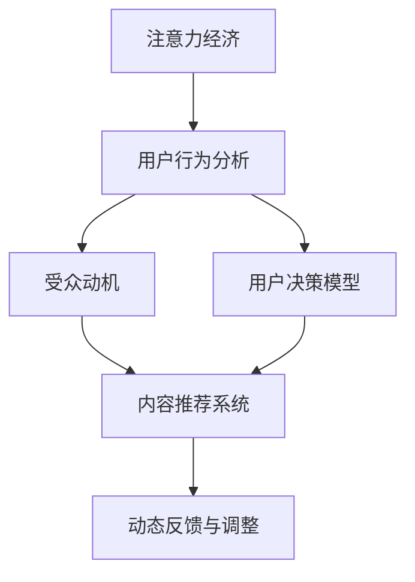

                 

# 注意力经济与用户行为分析：了解受众的动机和行为

> 关键词：注意力经济,用户行为分析,受众动机,用户决策,大数据,机器学习

## 1. 背景介绍

### 1.1 问题由来

随着互联网技术的迅猛发展，信息爆炸已经成为不争的事实。人们每天都会接触到海量的信息内容，如何在海量信息中寻找有价值的内容，成为了现代社会面临的一大挑战。传统的搜索引擎、推荐系统等技术，虽然能够帮助用户在海量数据中筛选信息，但往往只关注内容的标签、关键词等客观信息，而忽略了用户的主观感受和心理动机。

面对这一问题，“注意力经济”的概念应运而生。“注意力经济”认为，在信息过载的时代，用户的注意力本身已经成为一种稀缺资源。如何吸引和留住用户的注意力，如何利用用户注意力创造商业价值，成为了各互联网公司争夺的焦点。在这种背景下，用户行为分析应运而生。通过对用户行为数据的分析，可以更深入地了解用户的心理动机和行为习惯，从而为用户提供更加精准、个性化的信息服务，实现商业变现。

### 1.2 问题核心关键点

当前，用户行为分析已经成为各大互联网公司获取竞争优势的重要手段。其核心关键点在于：

- **用户动机分析**：通过分析用户的搜索行为、点击行为、评论行为等数据，了解用户行为背后的动机和需求，从而提供更贴合用户需求的个性化服务。
- **行为预测与建模**：利用机器学习等技术，建立用户行为预测模型，对用户未来的行为进行预测，从而优化内容推荐策略，提高用户粘性。
- **注意力捕捉与分配**：通过分析用户对不同内容的注意力分布，优化内容分配策略，提升内容曝光率和点击率，实现商业价值的最大化。
- **动态反馈与调整**：建立动态反馈机制，根据用户的实时反馈数据，不断调整推荐策略，实现持续优化。

这些关键点共同构成了用户行为分析的理论基础和实践框架，使其能够有效地帮助企业洞察用户行为，提高商业变现能力。

## 2. 核心概念与联系

### 2.1 核心概念概述

为了更好地理解注意力经济和用户行为分析，本节将介绍几个核心概念：

- **注意力经济**：信息时代，用户注意力的稀缺性使得注意力成为一种稀缺资源。互联网公司通过吸引和利用用户注意力，实现商业价值最大化。
- **用户行为分析**：通过对用户在线行为数据的分析，了解用户行为背后的动机和需求，从而提供更个性化的服务，实现商业变现。
- **受众动机**：用户在线行为背后的心理动机，如求知、娱乐、社交等，直接影响用户对内容的兴趣和互动。
- **用户决策模型**：利用机器学习等技术，建立用户行为预测模型，预测用户未来的行为选择。
- **内容推荐系统**：通过分析用户行为数据，为用户提供个性化的内容推荐，提高用户满意度和粘性。
- **动态反馈与调整**：根据用户实时反馈数据，动态调整推荐策略，实现持续优化。

这些核心概念之间的逻辑关系可以通过以下Mermaid流程图来展示：



这个流程图展示了大数据和机器学习在注意力经济和用户行为分析中的应用：

1. 注意力经济强调用户注意力的稀缺性，是用户行为分析的基础。
2. 用户行为分析通过对用户在线行为的分析，了解用户的心理动机，建立用户决策模型。
3. 内容推荐系统根据用户决策模型，为用户提供个性化内容推荐。
4. 动态反馈与调整根据用户实时反馈数据，不断优化推荐策略，实现持续优化。

## 3. 核心算法原理 & 具体操作步骤
### 3.1 算法原理概述

用户行为分析的核心算法原理，基于对用户在线行为的观察和分析。具体而言，通过收集用户在不同平台上的点击、搜索、浏览、购买等行为数据，利用机器学习、深度学习等技术，分析用户行为背后的心理动机和行为模式，从而建立用户决策模型。

例如，假设一个用户在电商平台上浏览了多个商品，点击了其中几个商品，并在最后购买了其中一个。通过对这些行为的观察和分析，可以发现用户的购买行为受到了商品价格、用户评价、商品属性等因素的影响。利用这些信息，可以建立用户购买行为预测模型，从而在用户再次访问平台时，向其推荐相似的商品。

### 3.2 算法步骤详解

用户行为分析通常包括以下几个关键步骤：

**Step 1: 数据收集**

- 收集用户在平台上的行为数据，包括点击、搜索、浏览、购买等行为记录。
- 将数据存储在数据库中，通常使用关系型数据库（如MySQL、PostgreSQL）或NoSQL数据库（如Hadoop、MongoDB）进行存储。

**Step 2: 数据预处理**

- 对原始数据进行清洗和预处理，去除无关数据、处理缺失值、去除噪声等。
- 对数据进行特征提取和选择，提取与用户行为相关的特征，如商品属性、价格、用户评价等。

**Step 3: 用户行为建模**

- 利用机器学习、深度学习等技术，建立用户行为预测模型。常见的算法包括逻辑回归、决策树、随机森林、神经网络等。
- 将预处理后的数据输入模型进行训练，得到用户行为预测模型。

**Step 4: 内容推荐**

- 根据用户行为预测模型，为用户提供个性化内容推荐。可以使用协同过滤、基于内容的推荐、混合推荐等方法。
- 实时更新推荐模型，根据用户最新的行为数据进行调整。

**Step 5: 动态反馈与优化**

- 收集用户对推荐结果的反馈数据，如点击率、购买率、评价等。
- 根据用户反馈数据，动态调整推荐策略，提高推荐效果。

### 3.3 算法优缺点

用户行为分析基于机器学习等技术，具有以下优点：

1. 数据驱动：通过数据驱动的机器学习算法，可以更深入地了解用户行为背后的动机和需求，从而提供更个性化的服务。
2. 高效精准：利用大数据技术，可以高效处理海量数据，快速提取用户行为特征，实现精准推荐。
3. 动态优化：根据用户实时反馈数据，动态调整推荐策略，实现持续优化。

但同时，用户行为分析也存在以下缺点：

1. 数据隐私问题：用户行为数据的收集和使用需要遵循数据隐私保护法规，如GDPR、CCPA等。如何保障用户数据隐私，防止数据泄露和滥用，是一个重要的挑战。
2. 数据偏差问题：用户行为数据可能存在偏差，如平台用户行为与非平台用户行为差异、不同用户群体行为差异等。如何消除数据偏差，保证模型公平性，是一个重要的研究方向。
3. 模型泛化问题：用户行为模型在特定场景下表现良好，但如何在大规模用户群体中泛化，是一个重要的挑战。
4. 计算资源问题：大数据和机器学习算法需要大量计算资源，如何降低计算成本，提高计算效率，是一个重要的研究方向。

### 3.4 算法应用领域

用户行为分析已经广泛应用于电商、社交、新闻、视频等多个领域，为各互联网公司提供了强大的竞争力。以下是几个典型应用场景：

1. **电商推荐系统**：通过分析用户点击、浏览、购买等行为数据，为用户提供个性化商品推荐，提升用户购买转化率。
2. **社交媒体内容推荐**：利用用户点赞、评论、分享等行为数据，推荐用户感兴趣的内容，提升用户粘性和活跃度。
3. **新闻个性化推荐**：分析用户点击、阅读等行为数据，推荐用户感兴趣的新闻内容，提升用户停留时间和阅读深度。
4. **视频推荐系统**：分析用户观看、点赞、评论等行为数据，推荐用户感兴趣的视频内容，提升用户观看时长和点击率。

## 4. 数学模型和公式 & 详细讲解
### 4.1 数学模型构建

用户行为分析通常使用机器学习和深度学习模型来建立用户行为预测模型。以电商推荐系统为例，假设用户行为数据 $X$ 包含用户点击、浏览、购买等行为特征，用户行为标签 $Y$ 表示用户是否购买了商品。建立用户行为预测模型的数学模型如下：

$$
P(Y=1|X) = \sigma(W^T\phi(X) + b)
$$

其中，$\phi(X)$ 为特征映射函数，将原始数据映射为高维特征向量；$W$ 和 $b$ 为模型参数，通过训练得到。$\sigma$ 为sigmoid函数，将模型输出映射到0-1之间，表示用户购买概率。

### 4.2 公式推导过程

以电商推荐系统为例，公式推导过程如下：

1. **特征选择**：选择与用户购买行为相关的特征，如商品属性、价格、用户评价等。
2. **特征映射**：将原始数据 $X$ 映射为高维特征向量 $\phi(X)$，常用的方法包括TF-IDF、word2vec、one-hot编码等。
3. **模型训练**：利用训练数据 $D=\{(x_i,y_i)\}_{i=1}^N$，训练模型参数 $W$ 和 $b$。
4. **模型预测**：利用测试数据 $X_t$，计算预测概率 $P(Y=1|X_t)$，判断用户是否购买商品。

### 4.3 案例分析与讲解

以电商推荐系统为例，假设一个用户对A商品进行了浏览，但没有购买。通过用户行为分析，可以发现A商品的价格比用户常购商品B便宜，但评价不如B。此时，可以利用电商推荐系统为用户推荐与B商品类似但价格更高的商品C，从而提升用户购买转化率。

## 5. 项目实践：代码实例和详细解释说明
### 5.1 开发环境搭建

在进行用户行为分析项目实践前，我们需要准备好开发环境。以下是使用Python进行Scikit-learn开发的环境配置流程：

1. 安装Anaconda：从官网下载并安装Anaconda，用于创建独立的Python环境。
2. 创建并激活虚拟环境：
```bash
conda create -n user_behavior_analysis python=3.8 
conda activate user_behavior_analysis
```
3. 安装Scikit-learn：
```bash
pip install scikit-learn
```

4. 安装Pandas、NumPy等常用库：
```bash
pip install pandas numpy
```

5. 安装可视化工具Matplotlib、Seaborn：
```bash
pip install matplotlib seaborn
```

完成上述步骤后，即可在`user_behavior_analysis`环境中开始用户行为分析项目的开发。

### 5.2 源代码详细实现

以下是用户行为分析项目的Python代码实现，以电商推荐系统为例：

```python
import pandas as pd
from sklearn.model_selection import train_test_split
from sklearn.ensemble import RandomForestClassifier
from sklearn.metrics import accuracy_score

# 读取电商数据
data = pd.read_csv('click_browse_buy_data.csv')

# 特征选择
features = ['price', 'category', 'brand', 'user_age', 'user_gender']
X = data[features]
y = data['bought']

# 数据拆分
X_train, X_test, y_train, y_test = train_test_split(X, y, test_size=0.2, random_state=42)

# 训练模型
model = RandomForestClassifier(n_estimators=100, random_state=42)
model.fit(X_train, y_train)

# 模型预测
y_pred = model.predict(X_test)

# 计算准确率
acc = accuracy_score(y_test, y_pred)
print(f'模型准确率：{acc:.2f}')
```

### 5.3 代码解读与分析

让我们再详细解读一下关键代码的实现细节：

**读取电商数据**：使用Pandas库读取电商数据，将用户点击、浏览、购买等行为数据存入DataFrame对象。

**特征选择**：选择与用户购买行为相关的特征，如商品价格、类别、品牌、用户年龄、用户性别等。

**数据拆分**：使用train_test_split方法将数据拆分为训练集和测试集，80%的数据用于训练，20%的数据用于测试。

**模型训练**：使用随机森林算法对数据进行训练，得到用户购买行为预测模型。

**模型预测**：使用训练好的模型对测试集进行预测，得到用户购买预测结果。

**准确率计算**：使用accuracy_score函数计算模型预测的准确率，评估模型性能。

可以看到，Scikit-learn库使得用户行为分析项目的开发变得简洁高效。开发者可以将更多精力放在数据处理、模型改进等高层逻辑上，而不必过多关注底层的实现细节。

当然，工业级的系统实现还需考虑更多因素，如模型的保存和部署、超参数的自动搜索、更灵活的任务适配层等。但核心的用户行为分析范式基本与此类似。

## 6. 实际应用场景
### 6.1 电商推荐系统

电商推荐系统是用户行为分析最典型的应用场景。传统的电商推荐系统通常只考虑商品的相似度，无法充分考虑用户行为数据。而利用用户行为分析，可以更深入地了解用户行为背后的动机和需求，提供更个性化的推荐服务。

例如，利用用户点击、浏览、购买等行为数据，可以发现用户对某类商品的需求量较大，但市场供应不足。此时，电商公司可以针对用户需求，加大该类商品的采购力度，提高用户满意度，提升销售业绩。

### 6.2 社交媒体内容推荐

社交媒体平台用户数量庞大，用户行为数据丰富。利用用户行为分析，可以了解用户对不同类型内容的兴趣和偏好，从而提供个性化的内容推荐服务。

例如，利用用户点赞、评论、分享等行为数据，可以发现用户对某些内容的互动量较高。此时，平台可以加大对这类内容的推广力度，提升用户活跃度和粘性。

### 6.3 新闻个性化推荐

新闻平台拥有大量的新闻内容，如何为用户提供个性化的新闻推荐，提升用户阅读体验和停留时间，是平台面临的重要挑战。利用用户行为分析，可以了解用户对不同新闻内容的兴趣和阅读深度，从而提供个性化的推荐服务。

例如，利用用户点击、阅读等行为数据，可以发现用户对某类新闻的关注度较高。此时，新闻平台可以加大对这类新闻的曝光和推荐力度，提升用户阅读量和新闻点击率。

### 6.4 视频推荐系统

视频平台拥有大量的视频内容，如何为用户提供个性化的视频推荐，提升用户观看时长和点击率，是平台面临的重要挑战。利用用户行为分析，可以了解用户对不同视频的兴趣和观看时长，从而提供个性化的推荐服务。

例如，利用用户观看、点赞、评论等行为数据，可以发现用户对某些视频的互动量较高。此时，视频平台可以加大对这类视频的推广力度，提升用户观看时长和点击率。

## 7. 工具和资源推荐
### 7.1 学习资源推荐

为了帮助开发者系统掌握用户行为分析的理论基础和实践技巧，这里推荐一些优质的学习资源：

1. 《Python机器学习》：由Scikit-learn创始人之一编写的经典书籍，详细介绍了机器学习的基础知识、常用算法和Python实现。
2. 《深度学习》（Ian Goodfellow著）：深度学习领域的权威教材，详细介绍了深度学习的理论基础、算法实现和应用案例。
3. 《用户行为分析与数据挖掘》：专门介绍用户行为分析的书籍，包含大量实际案例和数据挖掘技术。
4. Kaggle数据集：Kaggle平台拥有大量用户行为分析相关的数据集，提供丰富的数据集和模型竞赛机会。
5. Coursera课程：Coursera平台上有大量机器学习和数据科学相关的课程，提供系统化的学习资源。

通过对这些资源的学习实践，相信你一定能够快速掌握用户行为分析的精髓，并用于解决实际的业务问题。

### 7.2 开发工具推荐

高效的开发离不开优秀的工具支持。以下是几款用于用户行为分析开发的常用工具：

1. Jupyter Notebook：Python开发常用的交互式笔记本环境，提供代码编写、数据可视化、模型训练等功能。
2. RStudio：R语言开发常用的IDE环境，提供数据处理、模型训练、可视化等功能。
3. Tableau：数据可视化工具，支持大量数据集的处理和展示。
4. Power BI：微软推出的数据可视化工具，支持大规模数据集的展示和分析。
5. Python：数据科学和机器学习领域的主流编程语言，具有强大的数据处理和建模能力。

合理利用这些工具，可以显著提升用户行为分析任务的开发效率，加快创新迭代的步伐。

### 7.3 相关论文推荐

用户行为分析领域的研究论文众多，以下是几篇具有代表性的论文，推荐阅读：

1. A Theoretical Framework for Recommender Systems（Jaguar论文）：提出了Jaguar算法，结合用户行为数据和物品属性，实现了更加精确的推荐。
2. Parallel Matrix Factorization for Recommender Systems（RMF论文）：提出了RMF算法，通过并行矩阵分解，提升了推荐系统的计算效率。
3. Cascading Recommendation Algorithms（CAS-CF论文）：提出了Cascading CF算法，通过多阶段推荐，提升了推荐系统的准确率和召回率。
4. Deep Neural Networks for Recommender Systems（DeepRec论文）：提出了DeepRec模型，结合深度神经网络，提升了推荐系统的泛化能力和个性化程度。
5. Attention is All You Need（Transformer论文）：提出了Transformer模型，通过自注意力机制，提升了推荐系统的表示能力和推荐效果。

这些论文代表了用户行为分析技术的发展脉络。通过学习这些前沿成果，可以帮助研究者把握学科前进方向，激发更多的创新灵感。

## 8. 总结：未来发展趋势与挑战
### 8.1 研究成果总结

本文对用户行为分析方法进行了全面系统的介绍。首先阐述了注意力经济和用户行为分析的研究背景和意义，明确了用户行为分析在信息过载时代的重要价值。其次，从原理到实践，详细讲解了用户行为分析的数学模型和操作步骤，给出了用户行为分析项目的完整代码实现。同时，本文还广泛探讨了用户行为分析在电商、社交、新闻、视频等多个领域的应用前景，展示了用户行为分析技术的广泛应用。此外，本文精选了用户行为分析相关的学习资源和开发工具，力求为读者提供全方位的技术指引。

通过本文的系统梳理，可以看到，用户行为分析技术正在成为互联网公司获取竞争优势的重要手段，极大地拓展了用户行为数据的价值。未来，伴随用户行为分析技术的不断演进，各互联网公司将能够更加深入地了解用户行为背后的动机和需求，从而提供更加个性化、精准的服务，实现商业变现。

### 8.2 未来发展趋势

展望未来，用户行为分析技术将呈现以下几个发展趋势：

1. **多模态用户行为分析**：未来的用户行为分析不仅关注用户的在线行为数据，还将结合用户的历史数据、社交网络数据等多模态数据，构建更加全面、深入的用户行为模型。
2. **实时用户行为分析**：利用大数据和实时计算技术，实时捕捉和分析用户行为数据，提供更加精准、实时的推荐服务。
3. **个性化推荐系统**：未来的推荐系统将更加注重用户的个性化需求，结合用户行为数据和用户画像，提供更加个性化的内容推荐。
4. **联邦学习**：联邦学习技术可以在保护用户隐私的前提下，跨平台共享用户行为数据，提高推荐系统的泛化能力和效果。
5. **自适应推荐系统**：自适应推荐系统可以根据用户反馈数据，实时调整推荐策略，实现持续优化。

这些趋势凸显了用户行为分析技术的广阔前景。这些方向的探索发展，必将进一步提升推荐系统的性能和应用范围，为各互联网公司带来更大的商业价值。

### 8.3 面临的挑战

尽管用户行为分析技术已经取得了瞩目成就，但在迈向更加智能化、普适化应用的过程中，它仍面临着诸多挑战：

1. **数据隐私问题**：用户行为数据的收集和使用需要遵循数据隐私保护法规，如GDPR、CCPA等。如何保障用户数据隐私，防止数据泄露和滥用，是一个重要的挑战。
2. **数据偏差问题**：用户行为数据可能存在偏差，如平台用户行为与非平台用户行为差异、不同用户群体行为差异等。如何消除数据偏差，保证模型公平性，是一个重要的研究方向。
3. **计算资源问题**：大数据和机器学习算法需要大量计算资源，如何降低计算成本，提高计算效率，是一个重要的研究方向。
4. **模型泛化问题**：用户行为模型在特定场景下表现良好，但如何在大规模用户群体中泛化，是一个重要的挑战。
5. **模型公平性问题**：用户行为分析模型需要确保公平性，避免对某些群体或行为的歧视。

这些挑战需要各互联网公司不断进行探索和创新，才能将用户行为分析技术推向更高的台阶，为互联网用户提供更加个性化、安全、公平的服务。

### 8.4 研究展望

未来的研究需要在以下几个方面寻求新的突破：

1. **多模态数据融合**：结合用户行为数据、社交网络数据、历史数据等多模态数据，构建更加全面、深入的用户行为模型。
2. **实时数据处理**：利用大数据和实时计算技术，实时捕捉和分析用户行为数据，提供更加精准、实时的推荐服务。
3. **自适应推荐系统**：根据用户反馈数据，实时调整推荐策略，实现持续优化。
4. **联邦学习技术**：利用联邦学习技术，跨平台共享用户行为数据，提高推荐系统的泛化能力和效果。
5. **模型公平性研究**：研究用户行为分析模型的公平性问题，避免对某些群体或行为的歧视。

这些研究方向将引领用户行为分析技术迈向更高的台阶，为互联网用户提供更加个性化、安全、公平的服务，实现商业变现。只有勇于创新、敢于突破，才能不断拓展用户行为分析技术的边界，让人工智能技术更好地服务于人类社会。

## 9. 附录：常见问题与解答

**Q1: 用户行为分析如何保护用户隐私？**

A: 用户行为分析需要收集大量的用户行为数据，如何保护用户隐私是至关重要的。以下是一些常用的隐私保护措施：

1. **数据匿名化**：在数据收集和处理过程中，对用户标识信息进行匿名化处理，如去除个人身份信息、使用匿名标识符等。
2. **差分隐私**：在数据处理过程中，加入噪声干扰，使得单个用户的行为难以被识别，从而保护用户隐私。
3. **数据加密**：对用户行为数据进行加密处理，只有授权人员才能访问和使用。
4. **用户同意**：在数据收集和使用过程中，明确告知用户数据用途，并获得用户的同意。
5. **法律合规**：遵循各国数据隐私保护法规，如GDPR、CCPA等，确保数据处理合法合规。

通过这些措施，可以有效保护用户隐私，防止数据泄露和滥用。

**Q2: 用户行为分析的模型训练需要哪些步骤？**

A: 用户行为分析的模型训练通常包括以下几个步骤：

1. **数据预处理**：清洗数据、去除噪声、处理缺失值等，保证数据质量。
2. **特征选择**：选择与用户行为相关的特征，如商品属性、用户行为时间等。
3. **模型选择**：选择合适的机器学习或深度学习模型，如随机森林、神经网络等。
4. **模型训练**：利用训练数据对模型进行训练，得到用户行为预测模型。
5. **模型评估**：利用测试数据对模型进行评估，计算模型准确率、召回率、F1值等指标。
6. **模型优化**：根据评估结果，调整模型参数，优化模型性能。

通过这些步骤，可以得到高质量的用户行为分析模型，用于实际业务场景。

**Q3: 用户行为分析的模型泛化能力如何提升？**

A: 提升用户行为分析模型的泛化能力，需要从以下几个方面进行优化：

1. **数据多样化**：收集多样化的用户行为数据，涵盖不同的用户群体、场景、时间等，避免数据偏差。
2. **模型复杂度**：选择适合的模型复杂度，避免过拟合和欠拟合。可以使用模型正则化、dropout等方法，提高模型泛化能力。
3. **特征选择**：选择与任务相关的关键特征，去除无关特征，提升模型泛化能力。
4. **模型集成**：利用多个模型进行集成，取各模型的优势，提升模型泛化能力。
5. **交叉验证**：利用交叉验证方法，评估模型的泛化能力，避免过拟合。

通过这些优化方法，可以提升用户行为分析模型的泛化能力，确保模型在实际应用中的有效性。

**Q4: 用户行为分析的模型如何实时优化？**

A: 用户行为分析的模型优化通常包括以下几个步骤：

1. **在线学习**：利用在线学习算法，实时更新模型参数，适应新数据。
2. **动态反馈**：利用用户实时反馈数据，动态调整模型参数，优化模型性能。
3. **A/B测试**：利用A/B测试方法，对比不同模型的性能，选择最优模型。
4. **模型融合**：利用模型融合方法，将多个模型的预测结果进行集成，提升模型性能。
5. **超参数优化**：利用超参数优化方法，自动调整模型参数，优化模型性能。

通过这些方法，可以实现用户行为分析模型的实时优化，提升模型性能和应用效果。

**Q5: 用户行为分析在电商推荐系统中的应用有哪些？**

A: 用户行为分析在电商推荐系统中的应用非常广泛，以下是几个典型的应用场景：

1. **个性化推荐**：利用用户行为数据，为用户提供个性化的商品推荐，提升用户购买转化率。
2. **库存优化**：分析用户购买行为数据，发现热销商品，优化商品库存，减少缺货和积压。
3. **广告投放**：分析用户行为数据，发现高价值用户群体，精准投放广告，提升广告效果。
4. **用户流失预警**：分析用户行为数据，发现流失风险用户，及时采取措施，减少用户流失率。
5. **用户画像**：利用用户行为数据，构建用户画像，了解用户需求和行为模式，提升用户体验。

通过这些应用场景，用户行为分析技术可以在电商领域发挥巨大的商业价值。

---

作者：禅与计算机程序设计艺术 / Zen and the Art of Computer Programming

