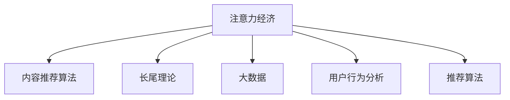

                 

# 注意力经济对传统媒体内容形式的改变

> 关键词：注意力经济, 内容推荐, 长尾理论, 大数据, 媒体生态, 用户行为分析, 推荐算法

## 1. 背景介绍

### 1.1 问题由来

随着互联网的普及和信息技术的快速发展，传统媒体面临着前所未有的变革。数字时代的信息传播方式已经从“单向传播”转变为“互动式传播”，媒体与受众之间的界限变得模糊。在这个过程中，注意力经济逐渐成为了一种主导性的经济模式，即在有限的注意力资源中争夺用户的关注，从而实现商业价值。

### 1.2 问题核心关键点

注意力经济的核心在于如何高效分配和利用有限的注意力资源，以实现商业价值的最大化。在大数据、云计算和人工智能等技术的驱动下，内容推荐算法开始成为媒体内容分发的重要手段。推荐算法通过对用户行为数据进行深度分析，精确预测用户偏好，从而实现个性化内容的精准推送，提升用户黏性和广告投放效率。

### 1.3 问题研究意义

研究注意力经济和内容推荐算法，对于理解媒体内容形式的演变趋势、优化内容推荐策略、提升用户满意度、推动媒体生态的健康发展具有重要意义。具体而言：

1. **提升用户满意度**：通过精准的内容推荐，满足用户个性化需求，提升用户体验。
2. **提高广告效果**：通过精准定位用户，提升广告投放的精准性和转化率。
3. **优化媒体生态**：通过优化内容分发机制，促进媒体与受众的良性互动，构建健康的媒体生态。
4. **驱动经济增长**：注意力经济为媒体提供了一个新的商业模式，推动媒体产业的数字化转型。

## 2. 核心概念与联系

### 2.1 核心概念概述

为更好地理解注意力经济对媒体内容形式的影响，本节将介绍几个密切相关的核心概念：

- **注意力经济**：指在互联网时代，通过争夺用户有限的注意力资源，实现商业价值的经济模式。
- **内容推荐算法**：通过分析用户行为数据，预测用户偏好，实现个性化内容推荐的算法。
- **长尾理论**：提出在网络时代，内容需求呈长尾分布，即少量热门内容搭配大量冷门内容。
- **大数据**：指利用现代信息处理技术，从海量数据中提取有价值信息的过程。
- **用户行为分析**：通过分析用户在媒体平台上的行为数据，理解用户需求和偏好。
- **推荐算法**：包括协同过滤、基于内容的推荐、基于混合模型的推荐等。

这些核心概念之间的逻辑关系可以通过以下Mermaid流程图来展示：



这个流程图展示了几组关键概念之间的联系：

1. 注意力经济通过内容推荐算法，优化内容分发，利用大数据和用户行为分析，满足用户需求。
2. 长尾理论和推荐算法共同作用，实现对海量内容的精准推荐。
3. 数据与算法是注意力经济的核心支撑，用户行为分析与推荐算法互为补充。

## 3. 核心算法原理 & 具体操作步骤
### 3.1 算法原理概述

注意力经济下的内容推荐，本质上是通过算法在大量内容中筛选出用户可能感兴趣的内容，实现个性化内容的精准推送。推荐算法的设计需要考虑多个因素，包括用户兴趣、内容属性、社交关系等。常用的推荐算法包括协同过滤、基于内容的推荐、基于混合模型的推荐等。

### 3.2 算法步骤详解

推荐算法的主要步骤如下：

1. **数据收集**：从媒体平台和社交网络中收集用户行为数据，如浏览历史、点击行为、评分等。
2. **特征提取**：将用户行为数据和内容属性转化为数值特征，如用户特征向量、内容特征向量等。
3. **相似性计算**：计算用户特征向量之间的相似度，找到兴趣相近的用户。
4. **内容筛选**：根据用户特征向量和内容特征向量，筛选出可能感兴趣的内容。
5. **排序推荐**：结合用户历史行为和实时兴趣，对内容进行排序，生成推荐列表。
6. **模型训练**：使用历史数据训练推荐模型，不断优化推荐效果。

### 3.3 算法优缺点

注意力经济下的内容推荐算法具有以下优点：

1. **精准度较高**：通过对用户行为的深度分析，推荐算法能够精准预测用户偏好，提升用户满意度。
2. **效率高**：通过算法自动化实现内容推荐，大幅提高内容分发效率。
3. **个性化强**：结合用户历史行为和实时兴趣，实现高度个性化的内容推荐。

同时，该算法也存在一定的局限性：

1. **数据质量依赖高**：推荐效果依赖于高质量的用户行为数据，数据缺失或不准确会影响推荐结果。
2. **冷启动问题**：新用户或新内容缺乏足够的数据，难以进行有效的推荐。
3. **模型复杂度高**：推荐算法模型通常较为复杂，需要大量的计算资源和存储空间。
4. **隐私风险**：用户行为数据涉及隐私，数据泄露和滥用风险较高。

### 3.4 算法应用领域

基于注意力经济的内容推荐算法，已经在多个领域得到广泛应用，包括：

1. **视频平台**：如Netflix、YouTube等，通过推荐算法实现视频内容的精准推送。
2. **新闻网站**：如BuzzFeed、G news等，通过推荐算法提升用户阅读体验。
3. **电商网站**：如Amazon、淘宝等，通过推荐算法提升商品推荐效果。
4. **音乐平台**：如Spotify、网易云音乐等，通过推荐算法实现个性化音乐推荐。
5. **社交网络**：如微信、微博等，通过推荐算法优化内容分发，提升用户活跃度。

除了这些应用外，内容推荐算法还被创新性地应用到更多场景中，如个性化广告推荐、新闻热点预测、图书推荐等，为媒体和广告行业带来了新的增长点。

## 4. 数学模型和公式 & 详细讲解 & 举例说明

### 4.1 数学模型构建

为了更好地理解推荐算法的工作原理，我们将使用数学语言对推荐算法的基本框架进行描述。

假设用户集为 $U=\{u_1,u_2,\cdots,u_n\}$，内容集为 $I=\{i_1,i_2,\cdots,i_m\}$。设用户 $u_i$ 对内容 $i_j$ 的评分矩阵为 $R_{ij}$。用户特征向量为 $U_u=(u_{u_1},u_{u_2},\cdots,u_{u_n})$，内容特征向量为 $I_i=(i_{i_1},i_{i_2},\cdots,i_{i_m})$。推荐算法模型的目标是通过计算用户 $u_i$ 对内容 $i_j$ 的兴趣度 $p_{ij}$，实现对内容的排序推荐。

推荐算法的基本模型可以表示为：

$$
p_{ij} = f(u_i, i_j; \theta)
$$

其中，$f$ 为推荐函数，$\theta$ 为模型参数。

### 4.2 公式推导过程

推荐算法中的关键步骤之一是对用户特征和内容特征的相似性计算。常见的相似性计算方法包括余弦相似度、皮尔逊相关系数等。以余弦相似度为例，计算用户特征向量和内容特征向量之间的相似度 $\text{similarity}(u_i,i_j)$：

$$
\text{similarity}(u_i,i_j) = \frac{\langle u_i, i_j \rangle}{\|u_i\| \cdot \|i_j\|}
$$

其中，$\langle \cdot, \cdot \rangle$ 为向量点积，$\|\cdot\|$ 为向量范数。

### 4.3 案例分析与讲解

为了更直观地理解推荐算法的计算过程，下面以协同过滤算法为例，进行详细讲解。

协同过滤算法包括基于用户的协同过滤和基于内容的协同过滤两种方法。以基于用户的协同过滤为例，其基本步骤如下：

1. **计算用户相似度**：对用户集 $U$ 中每个用户 $u_i$，计算其与其他用户 $u_j$ 的相似度。
2. **筛选相似用户**：找到与目标用户 $u_i$ 相似度最高的 $K$ 个用户 $u_{i_1}, u_{i_2}, \cdots, u_{i_K}$。
3. **计算用户评分**：对内容集 $I$ 中的每个内容 $i_j$，计算 $u_i$ 和相似用户的评分 $R_{i_1j}, R_{i_2j}, \cdots, R_{i_Kj}$ 的平均值。
4. **生成推荐列表**：根据 $u_i$ 对每个内容的评分，对内容进行排序，生成推荐列表。

协同过滤算法的优点在于不需要预先标注数据，能够适应冷启动问题。但其缺点在于对数据稀疏性和用户历史行为依赖较高，难以处理大规模数据集。

## 5. 项目实践：代码实例和详细解释说明
### 5.1 开发环境搭建

在进行推荐算法实践前，我们需要准备好开发环境。以下是使用Python进行PyTorch开发的环境配置流程：

1. 安装Anaconda：从官网下载并安装Anaconda，用于创建独立的Python环境。

2. 创建并激活虚拟环境：
```bash
conda create -n pytorch-env python=3.8 
conda activate pytorch-env
```

3. 安装PyTorch：根据CUDA版本，从官网获取对应的安装命令。例如：
```bash
conda install pytorch torchvision torchaudio cudatoolkit=11.1 -c pytorch -c conda-forge
```

4. 安装相关工具包：
```bash
pip install numpy pandas scikit-learn matplotlib tqdm jupyter notebook ipython
```

完成上述步骤后，即可在`pytorch-env`环境中开始推荐算法实践。

### 5.2 源代码详细实现

下面我们以协同过滤算法为例，给出使用PyTorch实现的代码。

首先，定义协同过滤算法的核心函数：

```python
import torch
from sklearn.metrics.pairwise import cosine_similarity

def collaborative_filtering(train_data, test_data, num_users, num_items, num_neighbors=50, threshold=0.9):
    # 训练集用户评分矩阵
    train_ratings = train_data.values
    # 用户特征向量
    train_user_features = train_data.index.values
    
    # 测试集用户评分矩阵
    test_ratings = test_data.values
    # 测试集用户特征向量
    test_user_features = test_data.index.values
    
    # 初始化用户-用户相似度矩阵
    similarity_matrix = torch.zeros(num_users, num_users)
    
    # 计算用户之间的相似度
    for i in range(num_users):
        for j in range(num_users):
            if i == j:
                continue
            similarity = cosine_similarity(train_user_features[i], train_user_features[j])
            similarity_matrix[i][j] = similarity[0][1]
            similarity_matrix[j][i] = similarity[1][0]
    
    # 筛选出相似用户
    similar_users = []
    for user_i in range(num_users):
        nearest_users = torch.argsort(similarity_matrix[user_i])[1:num_neighbors+1]
        similar_users.append(nearest_users)
    
    # 计算测试集用户的推荐评分
    recommendations = []
    for user_i in range(num_users):
        predictions = []
        for user_j in similar_users[user_i]:
            if user_j == user_i:
                continue
            predictions.append(torch.mean(train_ratings[user_j]))
        predictions = torch.tensor(predictions)
        recommendations.append(predictions)
    
    # 排序生成推荐列表
    rankings = []
    for user_i in range(num_users):
        rankings.append(torch.argsort(recommendations[user_i])[::-1])
    
    return rankings
```

然后，定义数据处理函数：

```python
import pandas as pd

def load_data(filename):
    data = pd.read_csv(filename)
    return data
```

最后，启动推荐算法流程：

```python
train_data = load_data('train.csv')
test_data = load_data('test.csv')

num_users = train_data.shape[0]
num_items = train_data.shape[1]
num_neighbors = 50
threshold = 0.9

rankings = collaborative_filtering(train_data, test_data, num_users, num_items, num_neighbors, threshold)

# 输出推荐结果
for user_id in range(num_users):
    print(f"User {user_id}: {rankings[user_id]}")
```

### 5.3 代码解读与分析

让我们再详细解读一下关键代码的实现细节：

**collaborative_filtering函数**：
- `similarity_matrix`：用户之间的相似度矩阵。
- `similar_users`：每个用户找到的相似用户列表。
- `recommendations`：每个测试用户对所有内容的预测评分。
- `rankings`：每个测试用户的推荐列表。

**load_data函数**：
- 读取训练集和测试集数据。

**推荐算法流程**：
- 初始化用户评分矩阵、用户特征向量等关键变量。
- 计算用户之间的相似度矩阵。
- 筛选出每个用户最相似的邻居用户。
- 计算每个测试用户对所有内容的预测评分。
- 对预测评分进行排序，生成推荐列表。

可以看到，协同过滤算法的代码实现相对简洁，关键在于相似性计算和用户评分预测。通过调整参数`num_neighbors`和`threshold`，可以控制推荐列表的宽度和推荐质量。

当然，工业级的系统实现还需考虑更多因素，如模型的保存和部署、超参数的自动搜索、更灵活的任务适配层等。但核心的推荐范式基本与此类似。

## 6. 实际应用场景
### 6.1 视频平台

视频平台如Netflix、YouTube等，通过推荐算法实现视频的精准推送。平台首先收集用户的观看历史、评分、点赞等行为数据，将这些数据作为训练集，利用协同过滤等推荐算法，预测用户可能感兴趣的视频内容，并将其推荐给用户。平台还可以根据用户的行为反馈，不断调整推荐算法参数，优化推荐效果。

### 6.2 新闻网站

新闻网站如BuzzFeed、G news等，通过推荐算法提升用户的阅读体验。网站收集用户的浏览历史、停留时间、评论等行为数据，利用协同过滤等算法，预测用户可能感兴趣的新闻文章，并将其推荐给用户。推荐算法可以根据用户的行为反馈，动态调整推荐内容，提升用户满意度。

### 6.3 电商网站

电商网站如Amazon、淘宝等，通过推荐算法提升商品推荐效果。平台收集用户的浏览历史、购买历史、评分等行为数据，利用协同过滤等算法，预测用户可能感兴趣的商品，并将其推荐给用户。推荐算法可以根据用户的行为反馈，动态调整推荐内容，提升用户购买转化率。

### 6.4 音乐平台

音乐平台如Spotify、网易云音乐等，通过推荐算法实现个性化音乐推荐。平台收集用户的听歌历史、评分、评论等行为数据，利用协同过滤等算法，预测用户可能感兴趣的歌曲，并将其推荐给用户。推荐算法可以根据用户的行为反馈，动态调整推荐内容，提升用户满意度。

### 6.5 社交网络

社交网络如微信、微博等，通过推荐算法优化内容分发，提升用户活跃度。平台收集用户的点赞、评论、分享等行为数据，利用协同过滤等算法，预测用户可能感兴趣的内容，并将其推荐给用户。推荐算法可以根据用户的行为反馈，动态调整推荐内容，提升用户互动。

## 7. 工具和资源推荐
### 7.1 学习资源推荐

为了帮助开发者系统掌握推荐算法的理论基础和实践技巧，这里推荐一些优质的学习资源：

1. 《推荐系统实践》系列博文：由大模型技术专家撰写，深入浅出地介绍了推荐系统原理、算法实现和优化技巧。

2. 《机器学习实战》课程：斯坦福大学开设的机器学习课程，涵盖推荐系统等重要内容，适合初学者入门。

3. 《推荐系统实战》书籍：介绍推荐系统的理论基础和实现方法，提供大量代码示例。

4. Kaggle推荐系统竞赛：通过参与推荐系统竞赛，了解推荐算法在实际应用中的具体实现。

5. GitHub推荐系统开源项目：如TensorFlow-Recommenders、PyTorch-Recommender等，提供完整的推荐系统实现代码和论文。

通过对这些资源的学习实践，相信你一定能够快速掌握推荐算法的精髓，并用于解决实际的推荐问题。

### 7.2 开发工具推荐

高效的开发离不开优秀的工具支持。以下是几款用于推荐算法开发的常用工具：

1. PyTorch：基于Python的开源深度学习框架，灵活动态的计算图，适合快速迭代研究。

2. TensorFlow：由Google主导开发的开源深度学习框架，生产部署方便，适合大规模工程应用。

3. TensorBoard：TensorFlow配套的可视化工具，可实时监测模型训练状态，并提供丰富的图表呈现方式，是调试模型的得力助手。

4. Weights & Biases：模型训练的实验跟踪工具，可以记录和可视化模型训练过程中的各项指标，方便对比和调优。

5. Numpy：Python科学计算库，提供高效的数组和矩阵运算，是实现推荐算法的常用工具。

6. Pandas：Python数据分析库，提供数据处理、清洗和分析功能，适合处理推荐系统中的用户行为数据。

7. Scikit-learn：Python机器学习库，提供多种推荐算法实现，适合快速实现和优化推荐系统。

合理利用这些工具，可以显著提升推荐算法的开发效率，加快创新迭代的步伐。

### 7.3 相关论文推荐

推荐算法的发展源于学界的持续研究。以下是几篇奠基性的相关论文，推荐阅读：

1. "Collaborative Filtering for Recommender Systems"（协同过滤算法）
2. "A Survey of Recommendation Algorithms"（推荐算法综述）
3. "The Bellkamp-Lanczos Algorithm for SVD on a Single Processor"（奇异值分解算法）
4. "Matrix Factorization Techniques for Recommender Systems"（矩阵分解算法）
5. "Deep Learning in Recommendation Systems"（深度学习在推荐系统中的应用）

这些论文代表了大规模推荐系统的发展脉络。通过学习这些前沿成果，可以帮助研究者把握学科前进方向，激发更多的创新灵感。

## 8. 总结：未来发展趋势与挑战
### 8.1 总结

本文对基于注意力经济的内容推荐算法进行了全面系统的介绍。首先阐述了注意力经济对媒体内容形式的演变趋势，明确了内容推荐算法在提升用户满意度、提高广告效果、优化媒体生态等方面的重要意义。其次，从原理到实践，详细讲解了推荐算法的数学模型和关键步骤，给出了推荐任务开发的完整代码实例。同时，本文还广泛探讨了推荐算法在视频平台、新闻网站、电商网站、音乐平台、社交网络等多个行业领域的应用前景，展示了推荐算法的巨大潜力。最后，精选了推荐算法的各类学习资源，力求为读者提供全方位的技术指引。

通过本文的系统梳理，可以看到，基于注意力经济的内容推荐算法正在成为媒体内容分发的重要手段，极大地拓展了媒体内容的传播范围，提升了用户体验。随着推荐算法的不断演进，相信媒体内容分发将更加精准、高效，为媒体生态带来新的增长点。

### 8.2 未来发展趋势

展望未来，内容推荐算法将呈现以下几个发展趋势：

1. **多模态推荐**：推荐算法将从单一的文本推荐扩展到多模态推荐，结合图片、视频等多模态信息，提升推荐效果。
2. **实时推荐**：通过流式处理和实时计算，实现实时推荐，提升用户体验。
3. **交互式推荐**：结合用户交互行为，实现交互式推荐，提升推荐精准度。
4. **多任务学习**：将推荐算法与其他任务如情感分析、实体识别等结合，实现多任务学习，提升推荐效果。
5. **知识图谱融入**：将知识图谱等结构化知识融入推荐算法，提升推荐系统的知识表示能力。
6. **用户行为预测**：结合用户行为数据和深度学习模型，预测用户未来行为，提升推荐精准度。

以上趋势凸显了内容推荐算法的发展潜力。这些方向的探索发展，必将进一步提升推荐算法的性能和应用范围，为媒体内容分发带来新的突破。

### 8.3 面临的挑战

尽管内容推荐算法已经取得了瞩目成就，但在迈向更加智能化、普适化应用的过程中，它仍面临着诸多挑战：

1. **数据质量瓶颈**：推荐效果依赖于高质量的用户行为数据，数据缺失或不准确会影响推荐结果。
2. **冷启动问题**：新用户或新内容缺乏足够的数据，难以进行有效的推荐。
3. **模型复杂度高**：推荐算法模型通常较为复杂，需要大量的计算资源和存储空间。
4. **隐私风险**：用户行为数据涉及隐私，数据泄露和滥用风险较高。
5. **计算资源限制**：推荐算法的实时性要求较高，计算资源限制较大。

### 8.4 研究展望

面对内容推荐算法所面临的挑战，未来的研究需要在以下几个方面寻求新的突破：

1. **无监督和半监督推荐方法**：摆脱对大规模标注数据的依赖，利用自监督学习、主动学习等无监督和半监督范式，最大限度利用非结构化数据。
2. **多模态推荐算法**：结合图片、视频等多模态信息，实现多模态推荐，提升推荐效果。
3. **实时推荐算法**：通过流式处理和实时计算，实现实时推荐，提升用户体验。
4. **交互式推荐算法**：结合用户交互行为，实现交互式推荐，提升推荐精准度。
5. **多任务学习推荐**：将推荐算法与其他任务如情感分析、实体识别等结合，实现多任务学习，提升推荐效果。
6. **知识图谱融入推荐**：将知识图谱等结构化知识融入推荐算法，提升推荐系统的知识表示能力。
7. **用户行为预测**：结合用户行为数据和深度学习模型，预测用户未来行为，提升推荐精准度。

这些研究方向的探索，必将引领推荐算法走向更高的台阶，为媒体内容分发带来新的增长点。相信随着学界和产业界的共同努力，这些挑战终将一一被克服，推荐算法必将在构建智能媒体生态中扮演越来越重要的角色。

## 9. 附录：常见问题与解答
**Q1：推荐算法是否适用于所有媒体内容类型？**

A: 推荐算法在处理文本、图片、视频等不同类型的内容时，效果存在一定差异。文本内容的推荐通常基于用户行为数据和内容相似度计算，而图片和视频内容的推荐需要结合视觉特征进行更复杂的计算。需要根据具体内容类型选择合适的推荐算法和特征提取方法。

**Q2：推荐算法如何处理新用户或新内容？**

A: 对于新用户或新内容，推荐算法通常采用基于内容的推荐或冷启动推荐方法，利用用户历史行为和内容属性进行推荐。同时，结合深度学习等技术，提升推荐算法的泛化能力和鲁棒性。

**Q3：推荐算法是否需要预先标注数据？**

A: 传统推荐算法如协同过滤、基于内容的推荐等通常需要用户行为数据作为训练集，而深度学习等模型可以通过无监督或半监督方式进行训练。因此，无监督和半监督推荐方法正在逐渐成为推荐算法的重要方向。

**Q4：推荐算法如何提升广告效果？**

A: 推荐算法通过精准定位用户，将广告内容与用户兴趣紧密结合，提高广告的点击率和转化率。同时，结合用户行为数据和深度学习模型，预测用户未来行为，实现精准投放，提升广告效果。

**Q5：推荐算法如何实现多任务学习？**

A: 多任务学习结合推荐算法和其他任务，如情感分析、实体识别等，实现多任务学习，提升推荐效果。通过共享特征表示，将推荐任务与其他任务结合，实现联合优化，提升模型性能。

以上问题与解答，希望为你解答对推荐算法相关问题的疑惑。通过不断优化推荐算法，我们相信推荐算法将在媒体内容推荐中发挥更大的作用，为用户带来更好的体验。

