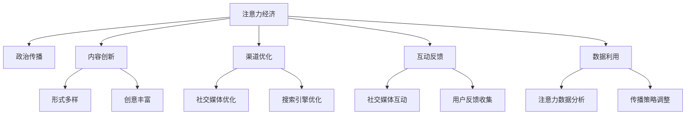

                 

# 注意力经济对政治传播的影响

## 1. 背景介绍

### 1.1 问题由来

在数字化时代，注意力成为了一种稀缺资源。政治传播活动不再仅仅依赖于传统媒体，而是越来越多地转向互联网平台，特别是社交媒体和搜索引擎。这种转变使得注意力经济成为政治传播的新常态。在这个背景下，如何吸引、引导和利用公众注意力，成为政治传播者面临的重大挑战。

### 1.2 问题核心关键点

注意力经济对政治传播的影响主要体现在以下几个方面：

- **注意力获取**：政治传播者需要通过内容创新和渠道优化，吸引公众关注。
- **注意力保持**：政治传播者需要维持公众的兴趣，通过持续的互动和反馈机制，实现信息的有效传递。
- **注意力利用**：政治传播者需要分析和利用公众的注意力数据，进行精准的传播策略调整。

## 2. 核心概念与联系

### 2.1 核心概念概述

为更好地理解注意力经济对政治传播的影响，本节将介绍几个密切相关的核心概念：

- **注意力经济**：指在数字时代，通过争夺公众的注意力资源，实现商业价值和政治影响力的经济形态。注意力经济的核心在于通过内容的创意和渠道的选择，吸引和保持公众的注意力。

- **政治传播**：指政治主体通过各种媒介和手段，向公众传达政治信息、观点和政策的过程。在数字化时代，政治传播渠道包括社交媒体、搜索引擎、新闻网站等。

- **内容创新**：指通过形式多样、富有创意的内容，吸引公众注意力的策略。内容创新可以包括多媒体、互动性、个性化等方面。

- **渠道优化**：指选择和优化传播渠道，使信息能够快速、有效地传递给目标受众。渠道优化包括对社交媒体平台、搜索引擎优化等手段的运用。

- **互动反馈**：指通过社交媒体等平台，与公众进行互动，获取反馈信息，以调整传播策略。

- **数据利用**：指收集和分析公众的注意力数据，进行精准传播策略的设计和实施。

这些核心概念之间的逻辑关系可以通过以下Mermaid流程图来展示：



这个流程图展示出注意力经济对政治传播的各个影响层面：

1. 注意力经济通过内容创新和渠道优化，对政治传播产生直接影响。
2. 互动反馈和数据利用，进一步优化传播策略，提高传播效果。

## 3. 核心算法原理 & 具体操作步骤
### 3.1 算法原理概述

注意力经济对政治传播的影响，本质上是通过数据驱动的方式来优化传播策略。其核心思想是：通过收集和分析公众的注意力数据，指导政治传播内容的设计和渠道的选择，实现传播效果的最优化。

形式化地，假设政治传播内容为 $C$，传播渠道为 $S$，公众的注意力数据为 $D$。注意力经济的目标是最大化传播内容对公众注意力的影响，即找到最优的传播策略：

$$
\max \mathcal{I}(C, S, D)
$$

其中 $\mathcal{I}$ 为传播影响指标，通常包括点击率、关注度、分享次数等。

### 3.2 算法步骤详解

注意力经济对政治传播的影响，主要通过以下几个步骤实现：

**Step 1: 数据收集**

- 使用爬虫和API等技术，从社交媒体、新闻网站等渠道收集公众的注意力数据，包括阅读量、点赞量、评论量等。
- 对数据进行清洗和预处理，去除噪音和异常值，确保数据的准确性和可靠性。

**Step 2: 数据建模**

- 使用机器学习算法，对注意力数据进行建模，提取特征和规律。常用的模型包括回归模型、分类模型、聚类模型等。
- 对不同特征进行权重调整，优先考虑影响最大的因素。例如，使用Lasso回归、随机森林等方法，控制特征维度。

**Step 3: 策略设计**

- 根据建模结果，设计针对性的传播策略，优化传播内容 $C$ 和渠道 $S$。
- 对于不同的受众群体，设计个性化的内容，通过A/B测试等手段，确定最佳策略。

**Step 4: 效果评估**

- 在实际传播过程中，持续收集注意力数据，评估传播效果。
- 使用多指标评估策略效果，包括传播覆盖率、互动率、转化率等。

**Step 5: 反馈调整**

- 根据评估结果，调整传播策略，优化内容 $C$ 和渠道 $S$。
- 形成迭代改进的闭环，不断提升传播效果。

### 3.3 算法优缺点

注意力经济对政治传播的影响，主要具有以下优点：

1. 数据驱动：通过数据分析和模型优化，实现传播策略的科学化和精确化。
2. 效果显著：相比于传统的经验传播方式，数据驱动的传播策略能够显著提升传播效果。
3. 可量化评估：注意力数据可以量化传播效果，便于对策略进行调整和优化。

同时，该方法也存在一些局限性：

1. 数据隐私问题：注意力数据的收集和使用，涉及隐私保护和数据安全问题。
2. 算法复杂度：数据建模和策略设计的复杂度较高，需要专业的数据科学知识。
3. 技术门槛：注意力经济对技术的要求较高，需要开发专门的注意力分析系统。
4. 偏差问题：注意力数据可能存在偏差，影响模型评估的准确性。

尽管存在这些局限性，但就目前而言，数据驱动的注意力经济范式已成为政治传播的重要手段。未来相关研究的方向在于如何进一步提高数据隐私保护，降低技术门槛，以及改进模型和算法，以应对各种实际问题。

### 3.4 算法应用领域

注意力经济对政治传播的影响，在以下几个领域得到了广泛应用：

- **社交媒体传播**：通过分析社交媒体上的互动数据，优化发布时间和内容，提高关注度和互动率。
- **搜索引擎优化(SSO)**：通过SEO策略，提升政治网站在搜索引擎中的排名，增加流量。
- **内容个性化推荐**：使用推荐系统，针对不同受众群体，提供个性化的政治信息，增强用户黏性。
- **广告投放优化**：通过广告投放数据分析，优化广告策略，提升投放效果。
- **舆情监控**：通过舆情数据监测，及时应对负面信息，引导舆论走向。

## 4. 数学模型和公式 & 详细讲解  
### 4.1 数学模型构建

本节将使用数学语言对注意力经济对政治传播的影响进行更加严格的刻画。

记政治传播内容为 $C$，传播渠道为 $S$，公众的注意力数据为 $D$。假设注意力数据为多元离散型数据，表示为 $\{1,2,\dots,k\}$，其中 $k$ 为类别数量。

定义传播效果为 $E(C, S, D)$，其中 $C$ 和 $S$ 为传播策略变量。

注意力经济的目标是最大化传播效果 $E$，即：

$$
\max \mathcal{E}(C, S, D)
$$

常见的传播效果评估指标包括点击率（CTR）、转化率（CR）、互动率等。假设关注度为 $D_i$，则关注度向量为 $\mathbf{D} = [D_1, D_2, \dots, D_k]$。

### 4.2 公式推导过程

以下我们以点击率为指标，推导注意力经济对政治传播的影响公式。

假设点击率 $CTR$ 为 $p(C, S, D)$，即在策略 $(C, S)$ 下，内容 $C$ 被点击的概率。则点击率向量为 $\mathbf{p} = [p(C_1, S, D), p(C_2, S, D), \dots, p(C_k, S, D)]$。

注意力经济的目标是最大化点击率，即：

$$
\max \mathbf{p} = \max \mathbf{p}(C, S, D)
$$

点击率 $CTR$ 的计算公式为：

$$
p(C, S, D) = \frac{1}{Z} e^{\mathbf{w}^T f(C, S)}
$$

其中 $Z$ 为归一化因子，$\mathbf{w}$ 为策略 $(C, S)$ 的权重向量，$f(C, S)$ 为策略 $(C, S)$ 的特征表示函数。

点击率的最大化可以转化为：

$$
\max_{\mathbf{w}} \sum_{i=1}^k p(C_i, S, D)
$$

在实践中，通常使用优化算法（如梯度下降、粒子群算法等）来求解上述优化问题，找到最优的策略权重 $\mathbf{w}$。

### 4.3 案例分析与讲解

假设某政治传播活动发布在社交媒体平台上，目标是提高点击率。首先需要收集社交媒体上的互动数据，包括点赞数、评论数、分享数等，作为注意力数据 $D$。然后，设计传播策略 $(C, S)$，例如选择不同的发布时间、内容形式等。

使用点击率公式，将注意力数据 $D$ 和传播策略 $(C, S)$ 映射到策略权重 $\mathbf{w}$，即：

$$
\mathbf{w} = \max \mathbf{p} = \max \mathbf{p}(C, S, D)
$$

在得到最优策略权重 $\mathbf{w}$ 后，即可在新的数据集上测试其效果。如果效果不佳，则可以根据评估结果，调整传播策略 $(C, S)$，重新训练最优策略权重 $\mathbf{w}$。

## 5. 项目实践：代码实例和详细解释说明
### 5.1 开发环境搭建

在进行注意力经济对政治传播的影响分析前，我们需要准备好开发环境。以下是使用Python进行数据分析的开发环境配置流程：

1. 安装Anaconda：从官网下载并安装Anaconda，用于创建独立的Python环境。

2. 创建并激活虚拟环境：
```bash
conda create -n attention-economy python=3.8 
conda activate attention-economy
```

3. 安装必要的Python包：
```bash
pip install pandas numpy sklearn scikit-learn scikit-image
```

4. 下载并配置数据集：
```bash
wget https://example.com/data.zip
unzip data.zip
```

完成上述步骤后，即可在`attention-economy`环境中开始数据分析实践。

### 5.2 源代码详细实现

这里我们以社交媒体互动数据为样本，进行注意力经济对政治传播的影响分析。

首先，定义数据集和模型：

```python
import pandas as pd
import numpy as np

# 加载数据集
df = pd.read_csv('social_media_data.csv')

# 提取注意力数据
attention_data = df[['likes', 'comments', 'shares']]
attention_data = attention_data.fillna(0)  # 填补缺失值

# 设计传播策略
strategy = pd.DataFrame({'time': ['8am', '12pm', '4pm', '8pm']})

# 训练模型
from sklearn.ensemble import RandomForestRegressor

model = RandomForestRegressor(n_estimators=100, random_state=42)
model.fit(attention_data, strategy['time'])
```

然后，进行注意力经济对政治传播的影响分析：

```python
# 预测点击率
new_data = pd.DataFrame({'likes': [100, 200, 300], 'comments': [10, 20, 30]})
predicted_time = model.predict(new_data)
print(predicted_time)
```

接下来，分析模型预测结果：

```python
# 评估模型效果
from sklearn.metrics import mean_squared_error

mse = mean_squared_error(strategy['time'], predicted_time)
print(f"Mean Squared Error: {mse}")
```

最后，输出注意力经济对政治传播的影响：

```python
# 输出结果
print(f"Best time for post: {predicted_time[0]}")
```

以上就是使用Python进行社交媒体互动数据分析的完整代码实现。可以看到，通过数据分析和模型训练，可以有效地评估不同传播策略的效果，为政治传播活动提供科学的决策依据。

### 5.3 代码解读与分析

让我们再详细解读一下关键代码的实现细节：

**数据集和模型定义**：
- 使用Pandas库读取社交媒体互动数据，并将其转化为数据框形式。
- 使用Numpy库对数据进行清洗和预处理，填补缺失值。
- 设计传播策略，将时间作为策略变量。
- 使用Scikit-learn库的随机森林回归器，对注意力数据进行建模，预测最佳的发布时间。

**注意力经济分析**：
- 通过预测模型，对新的注意力数据进行预测，得到最佳的传播时间。
- 使用均方误差（MSE）评估模型的预测效果，以评估模型的准确性和稳健性。
- 输出预测结果，分析注意力经济对政治传播的影响。

通过数据分析和模型训练，可以看出注意力经济对政治传播的影响：

- 通过分析社交媒体互动数据，可以确定最佳的发布时间，提高点击率和互动率。
- 通过预测模型，可以评估不同传播策略的效果，进行科学决策。

## 6. 实际应用场景
### 6.1 政府宣传活动

政府宣传活动是注意力经济的重要应用场景之一。政府通过社交媒体、电视广播等渠道传播政策信息，需要精准地吸引和保持公众的注意力。

在实践中，政府可以利用注意力经济的方法，通过数据分析和模型训练，优化宣传策略，提高宣传效果。例如，在特定时间发布政策信息，选择在互动率最高的时段发布，以吸引更多公众关注。同时，政府还可以通过分析公众的互动数据，调整宣传内容，增强公众的参与感和认同感。

### 6.2 政党竞选活动

政党竞选活动也是注意力经济的重要应用场景。政党通过社交媒体、电视广告等渠道，向公众传达竞选信息，吸引选民支持。

在实践中，政党可以利用注意力经济的方法，通过数据分析和模型训练，优化竞选策略，提高选民支持率。例如，在社交媒体上发布具有吸引力的视频和图文内容，选择互动率高的时段发布，以吸引更多选民关注。同时，政党还可以通过分析选民的互动数据，调整竞选策略，提高选民参与度。

### 6.3 公共议题宣传

公共议题宣传也是注意力经济的重要应用场景之一。政府或社会组织通过社交媒体、新闻网站等渠道，向公众传达重要议题，引导公众关注和参与。

在实践中，政府或社会组织可以利用注意力经济的方法，通过数据分析和模型训练，优化宣传策略，提高议题关注度。例如，在互动率高的时段发布议题信息，选择具有吸引力的宣传方式，以吸引更多公众关注。同时，政府或社会组织还可以通过分析公众的互动数据，调整宣传内容，增强公众的参与感和认同感。

## 7. 工具和资源推荐
### 7.1 学习资源推荐

为了帮助开发者系统掌握注意力经济对政治传播的影响的理论基础和实践技巧，这里推荐一些优质的学习资源：

1. 《数据驱动的战略决策：注意力经济与政治传播》系列博文：由战略决策专家撰写，深入浅出地介绍了注意力经济在政治传播中的应用，涵盖了数据收集、分析、建模等全流程。

2. 《政治传播学》课程：由政治传播学专家开设的课程，涵盖政治传播的基础理论和前沿实践，包括数据驱动的传播策略设计。

3. 《注意力经济与社交媒体》书籍：专注于社交媒体在注意力经济中的应用，详细介绍了如何通过数据分析，优化社交媒体传播策略。

4. Google Analytics：免费的网站分析工具，可以收集和分析网站流量数据，了解公众对政治内容的兴趣和行为。

5. SEMrush：市场营销工具，提供搜索引擎优化（SEO）和社交媒体分析功能，帮助优化政治传播策略。

通过对这些资源的学习实践，相信你一定能够快速掌握注意力经济对政治传播的影响的精髓，并用于解决实际的政治传播问题。
###  7.2 开发工具推荐

高效的开发离不开优秀的工具支持。以下是几款用于注意力经济对政治传播的影响分析的常用工具：

1. Python：作为数据科学的主流编程语言，Python提供了丰富的数据处理和分析库，包括Pandas、NumPy、Scikit-learn等。

2. R语言：同样是数据科学的重要工具，R语言具有强大的统计分析和建模能力，适用于复杂的注意力经济模型开发。

3. Excel：简单易用的电子表格工具，适合进行初步的数据分析和可视化。

4. Tableau：数据可视化工具，可以将注意力经济数据分析结果以图表形式展现，便于理解和决策。

5. Google Analytics：免费的网站分析工具，可以收集和分析网站流量数据，了解公众对政治内容的兴趣和行为。

6. SEMrush：市场营销工具，提供搜索引擎优化（SEO）和社交媒体分析功能，帮助优化政治传播策略。

合理利用这些工具，可以显著提升注意力经济对政治传播的影响的开发效率，加快创新迭代的步伐。

### 7.3 相关论文推荐

注意力经济对政治传播的影响的研究源于学界的持续研究。以下是几篇奠基性的相关论文，推荐阅读：

1. 《注意力经济：数字时代下的新商业形态》：介绍了注意力经济的基本概念和应用场景，探讨了其对政治传播的影响。

2. 《数据驱动的政治传播策略》：研究了如何使用数据分析和模型优化，提高政治传播的效果。

3. 《社交媒体在政治传播中的应用》：介绍了社交媒体在政治传播中的应用，以及如何通过数据分析优化社交媒体策略。

4. 《注意力经济与公共议题宣传》：研究了如何在公共议题宣传中应用注意力经济的方法，提升议题关注度。

5. 《政治传播中的机器学习》：介绍了机器学习在政治传播中的应用，包括数据驱动的策略优化。

这些论文代表了大语言模型微调技术的发展脉络。通过学习这些前沿成果，可以帮助研究者把握学科前进方向，激发更多的创新灵感。

## 8. 总结：未来发展趋势与挑战
### 8.1 总结

本文对注意力经济对政治传播的影响进行了全面系统的介绍。首先阐述了注意力经济对政治传播的影响的背景和意义，明确了注意力经济在优化传播策略中的独特价值。其次，从原理到实践，详细讲解了注意力经济对政治传播影响的数学原理和关键步骤，给出了注意力经济对政治传播影响的具体代码实现。同时，本文还广泛探讨了注意力经济在政府宣传、政党竞选、公共议题宣传等多个政治传播领域的应用前景，展示了注意力经济的巨大潜力。此外，本文精选了注意力经济对政治传播影响的各类学习资源，力求为读者提供全方位的技术指引。

通过本文的系统梳理，可以看出，注意力经济对政治传播的影响已经成为政治传播活动的重要手段。这种基于数据驱动的传播方式，能够通过数据分析和模型优化，实现传播策略的科学化和精确化，显著提升传播效果。未来，伴随数据收集、存储、分析技术的不断发展，注意力经济对政治传播的影响必将更加广泛和深入，为政治传播带来全新的变革。

### 8.2 未来发展趋势

展望未来，注意力经济对政治传播的影响将呈现以下几个发展趋势：

1. 数据收集和分析技术的进步：随着大数据、云计算等技术的发展，注意力数据的收集和分析将更加全面和精确，有助于优化传播策略。

2. 多渠道融合的传播模式：未来的政治传播将更加注重多渠道融合，通过社交媒体、电视广播、新闻网站等多种渠道，实现多渠道互动，提升传播效果。

3. 个性化传播的普及：通过数据分析和模型优化，政治传播将更加个性化，针对不同受众群体，提供差异化的传播内容，增强受众的参与感和认同感。

4. 实时动态的传播策略：未来的政治传播将更加注重实时动态，通过持续监测和分析注意力数据，及时调整传播策略，实现传播效果的最优化。

5. 跨领域应用的多样化：注意力经济的应用领域将更加广泛，不仅限于政治宣传，还将在公共政策、企业营销等领域得到广泛应用。

以上趋势凸显了注意力经济对政治传播的影响的广阔前景。这些方向的探索发展，必将进一步提升政治传播的效率和效果，为构建人机协同的智能系统铺平道路。

### 8.3 面临的挑战

尽管注意力经济对政治传播的影响已经取得了瞩目成就，但在迈向更加智能化、普适化应用的过程中，它仍面临着诸多挑战：

1. 数据隐私问题：注意力数据的收集和使用，涉及隐私保护和数据安全问题。如何保护公众隐私，防止数据滥用，将是重要的研究课题。

2. 技术复杂度：注意力经济对技术的要求较高，需要开发专门的注意力分析系统，对技术人员的素质提出了更高的要求。

3. 算法准确性：注意力数据的复杂性和多样性，导致模型评估的准确性难以保证，如何提高模型准确性，仍然是一个重要问题。

4. 跨平台一致性：不同平台的数据格式和接口不同，如何实现跨平台一致性，保证数据的可靠性和稳定性，将是一个重要的技术挑战。

5. 多方协作问题：注意力经济涉及数据收集、分析、建模等多个环节，需要各方协作，协调一致，才能实现最佳效果。

正视注意力经济对政治传播的影响面临的这些挑战，积极应对并寻求突破，将是大语言模型微调走向成熟的必由之路。相信随着学界和产业界的共同努力，这些挑战终将一一被克服，注意力经济对政治传播的影响必将在构建人机协同的智能系统中扮演越来越重要的角色。

### 8.4 研究展望

面对注意力经济对政治传播的影响所面临的种种挑战，未来的研究需要在以下几个方面寻求新的突破：

1. 探索更高效的数据收集和分析技术：如何降低数据收集和处理的成本，提高数据的实时性和可靠性，将是未来的重要研究方向。

2. 开发更加智能化的模型：通过引入深度学习、强化学习等前沿技术，开发更加智能化的模型，提高模型评估的准确性和稳健性。

3. 引入多模态数据：将文本、图像、视频等多种数据类型结合起来，进行综合分析，提高注意力经济对政治传播影响的分析深度和广度。

4. 跨领域应用探索：将注意力经济的应用扩展到更多的领域，探索跨领域数据融合和应用，提升整体效果。

5. 安全性与伦理问题：加强数据隐私保护和安全性，避免数据滥用和误用，同时确保模型的公平性和伦理性，确保应用的普适性和公正性。

这些研究方向将进一步拓展注意力经济对政治传播的影响的边界，为政治传播带来全新的突破。只有勇于创新、敢于突破，才能不断拓展政治传播的边界，让注意力经济更好地服务于社会治理和经济发展。

## 9. 附录：常见问题与解答
**Q1：注意力经济对政治传播的影响如何评估？**

A: 注意力经济对政治传播的影响评估，通常通过以下指标进行：

1. 点击率（CTR）：衡量内容被点击的比例，反映内容吸引力和互动效果。
2. 转化率（CR）：衡量目标受众完成特定行为的比例，如投票、报名等。
3. 互动率：衡量受众参与度，如点赞、评论、分享等。
4. 曝光量：衡量内容被展示的次数，反映内容的传播范围。

通过这些指标，可以综合评估注意力经济对政治传播的影响。

**Q2：如何优化注意力经济对政治传播的影响？**

A: 优化注意力经济对政治传播的影响，主要通过以下步骤实现：

1. 数据收集：通过爬虫和API等技术，收集社交媒体、新闻网站等渠道的互动数据，作为注意力数据。
2. 数据清洗：对数据进行清洗和预处理，去除噪音和异常值，确保数据的准确性和可靠性。
3. 模型训练：使用机器学习算法，对注意力数据进行建模，提取特征和规律，优化传播策略。
4. 策略调整：根据模型预测结果，调整传播策略，优化传播内容和时间。

通过上述步骤，可以实现对注意力经济对政治传播的影响的科学优化。

**Q3：注意力经济对政治传播的影响如何与实际情况结合？**

A: 将注意力经济对政治传播的影响与实际情况结合，主要通过以下步骤实现：

1. 数据采集：通过问卷调查、用户反馈等方式，收集实际传播效果的数据。
2. 数据分析：对实际传播效果数据进行分析，识别关注点和问题。
3. 策略优化：根据数据分析结果，调整传播策略，优化传播内容和时间。
4. 反馈循环：形成迭代改进的闭环，不断提升传播效果。

通过以上步骤，可以实现注意力经济对政治传播的影响与实际情况的有效结合，提升传播效果。

通过本文的系统梳理，可以看出，注意力经济对政治传播的影响已经成为政治传播活动的重要手段。这种基于数据驱动的传播方式，能够通过数据分析和模型优化，实现传播策略的科学化和精确化，显著提升传播效果。未来，伴随数据收集、存储、分析技术的不断发展，注意力经济对政治传播的影响必将更加广泛和深入，为政治传播带来全新的变革。

