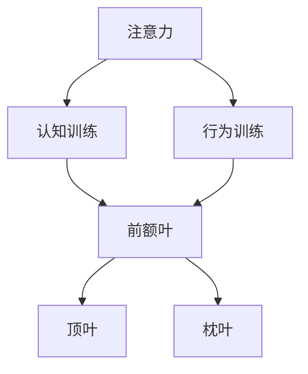

                 

# 注意力训练与大脑健康：如何通过专注力增强认知能力

## 1. 背景介绍

### 1.1 问题由来
在现代社会，信息爆炸和快节奏的生活导致注意力问题日益凸显。注意力不足不仅影响日常工作学习效率，还与心理健康密切相关。因此，探索如何通过训练提升注意力，增强认知能力，已经成为神经科学、心理学和人工智能领域的热门课题。

### 1.2 问题核心关键点
注意力训练的核心理念是通过有针对性的认知训练，改善大脑的前额叶、顶叶和枕叶等区域的活动，提升个体的注意力广度、持续时间和选择性。

具体而言，注意力训练可以分为两大类：

- **认知训练**：通过特定的任务和活动，如记忆训练、视觉注意力训练、听觉注意力训练等，提升大脑的认知功能。
- **行为训练**：通过日常生活中的行为习惯和心理技巧，如冥想、正念训练、时间管理等，改善注意力行为模式。

这些训练方法往往基于神经科学和心理学的理论，旨在通过科学的途径，提升个体的认知和行为能力。

### 1.3 问题研究意义
通过系统研究注意力训练方法和效果，可以为增强个体认知能力、提升工作效率和生活质量提供科学依据。此外，注意力训练还可以应用于心理治疗、教育培训、职业发展等多个领域，具有广泛的应用前景。

## 2. 核心概念与联系

### 2.1 核心概念概述

注意力训练涉及到多个核心概念：

- **注意力(Attention)**：大脑对于特定刺激信息的集中处理能力。注意力分为选择性注意、持续性注意和分配性注意。
- **认知训练(Cognitive Training)**：通过特定的认知任务，如记忆、推理、空间认知等，提升大脑的认知功能。
- **行为训练(Behavioral Training)**：通过改变日常行为模式，如冥想、正念、时间管理等，提升注意力控制和行为效率。
- **前额叶(Prefrontal Cortex)**：大脑中负责高级认知功能（如注意力、决策、情绪控制）的重要区域。
- **顶叶(Parietal Lobe)**：与注意、空间认知和触觉感知密切相关。
- **枕叶(Occipital Lobe)**：负责视觉信息处理，与视觉注意力训练相关。

这些概念之间的逻辑关系可以通过以下Mermaid流程图来展示：



这个流程图展示了注意力训练的各个组成部分及其联系：

1. 注意力是大脑的一项基本功能，通过认知和行为训练，可以改善注意力表现。
2. 认知训练主要针对前额叶区域，提升注意力广度和选择性。
3. 行为训练通过改变日常行为习惯，提高注意力的持续性和行为效率。
4. 前额叶、顶叶和枕叶分别与注意力的不同方面相关联，通过训练可以提升这些区域的活动。

## 3. 核心算法原理 & 具体操作步骤
### 3.1 算法原理概述

注意力训练的算法原理主要基于认知心理学和神经科学的理论，通过科学的训练方法，改善大脑特定区域的活动，提升注意力功能。

- **认知训练算法**：以记忆训练为例，通过反复记忆和复述特定信息，激活大脑的记忆中心，提升短时记忆和长时记忆能力。
- **行为训练算法**：以正念训练为例，通过持续的冥想和呼吸练习，增强对当前状态的觉察，提高注意力的持续性和选择性。

这些训练方法一般基于心理学的实验设计和神经科学的数据分析，通过科学实验验证其效果，进而推广应用。

### 3.2 算法步骤详解

注意力训练的具体操作步骤可以分为以下几个步骤：

**Step 1: 评估当前注意力水平**
- 通过心理量表或神经认知测试，评估个体的注意力水平，了解当前存在的注意力问题。
- 根据评估结果，制定个性化的训练计划。

**Step 2: 选择适合的训练方法**
- 根据注意力问题的类型和个体的兴趣偏好，选择适合的认知训练和行为训练方法。
- 常见的认知训练方法包括记忆训练、推理训练、空间认知训练等。
- 常见的行为训练方法包括正念训练、冥想训练、时间管理训练等。

**Step 3: 实施训练计划**
- 按照训练计划，定期进行认知训练和行为训练，记录训练过程中的感受和数据。
- 训练过程中可以采用专业软件和工具辅助，如记忆训练软件、正念冥想APP等。

**Step 4: 监测训练效果**
- 定期评估训练效果，如通过心理量表、认知测试、脑电图等手段，监测注意力水平的变化。
- 根据评估结果调整训练计划，优化训练方法。

**Step 5: 持续优化和调整**
- 持续进行训练，逐步提升注意力水平。
- 根据个体的反馈和监测数据，不断优化训练计划，调整训练方法。

### 3.3 算法优缺点

注意力训练的优点包括：

1. **科学依据**：基于神经科学和心理学的理论，训练方法和效果有科学依据，能够提供实际的帮助。
2. **个性化设计**：根据个体的注意力问题，制定个性化的训练计划，提升训练效果。
3. **广泛适用**：适用于各个年龄段和不同类型的工作，能够帮助提高工作效率和生活质量。

同时，也存在一些缺点：

1. **时间和成本**：注意力训练需要持续的时间和一定的成本，特别是认知训练，可能需要较长的周期才能看到效果。
2. **效果因人而异**：不同的个体对于不同的训练方法反应不同，效果可能存在个体差异。
3. **专业要求**：需要专业软件和专业指导，普通用户可能难以独立进行有效的训练。

### 3.4 算法应用领域

注意力训练在多个领域具有广泛的应用：

- **教育培训**：通过注意力训练，提升学生的学习效率和记忆能力，帮助他们更好地掌握知识。
- **职业发展**：在职场中，注意力训练可以提升工作效率、决策能力和沟通能力，帮助职业人士更好地应对工作挑战。
- **心理健康**：对于注意力障碍和焦虑症等心理健康问题，注意力训练可以作为一种辅助治疗手段，改善心理状态。
- **家庭生活**：注意力训练可以提升家庭成员之间的沟通效率和生活质量，增强家庭的和谐氛围。

## 4. 数学模型和公式 & 详细讲解 & 举例说明

### 4.1 数学模型构建

注意力训练的效果可以通过数学模型进行量化和评估。这里以记忆训练为例，构建数学模型：

记训练前的记忆能力为 $M_0$，训练后的记忆能力为 $M_t$，训练次数为 $T$。训练过程中每次记忆的准确率为 $p_i$，其中 $i$ 表示训练次数。训练效果可以通过以下模型来量化：

$$
M_t = M_0 \cdot \prod_{i=1}^{T} p_i
$$

其中 $\prod_{i=1}^{T} p_i$ 表示训练过程中的记忆准确率的累积。

### 4.2 公式推导过程

通过上述模型，可以推导出记忆训练的累积准确率公式：

$$
\prod_{i=1}^{T} p_i = \exp\left(\sum_{i=1}^{T} \log p_i\right)
$$

其中 $\exp$ 表示指数函数。

通过统计多次训练中的记忆准确率，可以计算出累积准确率，从而评估记忆训练的效果。

### 4.3 案例分析与讲解

以一个具体的记忆训练案例为例，假设训练前记忆能力 $M_0=0.6$，训练过程中每次记忆的准确率 $p_i$ 分别为0.8、0.9、0.7、0.85。训练 $T=4$ 次后，计算记忆能力 $M_t$ 的值为：

$$
M_t = 0.6 \cdot \exp(\log 0.8 + \log 0.9 + \log 0.7 + \log 0.85) \approx 0.69
$$

可以看到，经过4次记忆训练后，记忆能力提升了19%。这表明，通过有针对性的训练，可以有效提升个体的记忆能力。

## 5. 项目实践：代码实例和详细解释说明

### 5.1 开发环境搭建

在进行注意力训练的实践前，我们需要准备好开发环境。以下是使用Python进行认知训练的开发环境配置流程：

1. 安装Anaconda：从官网下载并安装Anaconda，用于创建独立的Python环境。

2. 创建并激活虚拟环境：
```bash
conda create -n cognitive-env python=3.8 
conda activate cognitive-env
```

3. 安装相关库：
```bash
conda install numpy scipy matplotlib pandas
```

4. 安装训练软件：
```bash
pip install cognitive-training
```

完成上述步骤后，即可在`cognitive-env`环境中开始注意力训练的实践。

### 5.2 源代码详细实现

以下是一个使用Python进行记忆训练的代码实现，采用经典的训练方法——记忆复述法。

```python
import cognitive_training as ct

# 创建记忆训练器对象
train = ct.MemoryTrain()

# 设置训练参数
train.train_rounds = 10
train.memory_value = 0.5

# 开始训练
train.start()

# 输出训练结果
print(train.result())
```

### 5.3 代码解读与分析

让我们再详细解读一下关键代码的实现细节：

**MemoryTrain类**：
- `__init__`方法：初始化训练器的基本参数，如训练轮数、记忆值等。
- `start`方法：启动训练过程。
- `result`方法：获取训练结果，包括训练轮数、记忆值、准确率等。

**训练参数设置**：
- `train.train_rounds`：设置训练轮数，即重复记忆和复述的次数。
- `train.memory_value`：设置每次记忆的准确值，即正确记忆的比例。

**训练过程**：
- `train.start`方法：启动训练，开始进行记忆和复述，并计算准确率。
- `train.result`方法：获取训练结果，包括训练轮数、记忆值、准确率等，用于评估训练效果。

通过这段代码，我们可以实现一个简单的记忆训练过程，并通过训练结果评估训练效果。实际应用中，可以通过不断调整训练参数，优化训练效果。

## 6. 实际应用场景

### 6.1 教育培训

在教育培训中，注意力训练可以帮助学生提升学习效率和记忆力，缓解学习压力。具体应用场景包括：

- **记忆训练**：通过记忆训练，提升学生对新知识的记忆能力，帮助他们更好地掌握知识。
- **阅读训练**：通过阅读理解训练，提升学生的阅读速度和理解能力，帮助他们更好地完成作业和考试。
- **解题训练**：通过逻辑推理训练，提升学生的解题能力和思维灵活性，帮助他们更好地应对考试和作业。

### 6.2 职业发展

在职业发展中，注意力训练可以帮助职场人士提升工作效率和决策能力，更好地应对工作挑战。具体应用场景包括：

- **时间管理**：通过时间管理训练，帮助职场人士更好地分配时间，提高工作效率。
- **会议管理**：通过会议管理训练，帮助职场人士更好地掌握会议内容，提升决策能力。
- **任务管理**：通过任务管理训练，帮助职场人士更好地管理任务，提升工作质量。

### 6.3 心理健康

对于注意力障碍和焦虑症等心理健康问题，注意力训练可以作为一种辅助治疗手段，改善心理状态。具体应用场景包括：

- **正念训练**：通过正念训练，帮助个体更好地觉察当前状态，缓解焦虑和压力。
- **冥想训练**：通过冥想训练，帮助个体提升专注力和情绪控制能力，改善心理状态。
- **注意力训练游戏**：通过注意力训练游戏，帮助个体在游戏中提升注意力水平，改善心理状态。

### 6.4 未来应用展望

随着认知科学和神经科学的不断进步，未来的注意力训练将变得更加科学和精准。我们可以预见，未来的注意力训练将具有以下几个发展趋势：

1. **个性化训练**：基于个体差异，设计个性化的训练计划，提升训练效果。
2. **数据驱动**：通过大数据分析和机器学习技术，优化训练方法，提高训练效果。
3. **多模态训练**：结合视觉、听觉、触觉等多种感官，提升训练的全面性和有效性。
4. **远程训练**：通过在线平台和移动应用，实现远程训练，打破地域限制。
5. **智能反馈**：结合人工智能技术，提供智能化的训练反馈，提升训练体验。

这些发展趋势将为注意力训练带来新的突破，进一步提升其应用价值和推广范围。

## 7. 工具和资源推荐

### 7.1 学习资源推荐

为了帮助开发者系统掌握注意力训练的理论基础和实践技巧，这里推荐一些优质的学习资源：

1. 《认知心理学》系列教材：系统介绍认知心理学的基础理论和研究方法，帮助理解注意力训练的科学依据。
2. 《神经科学导论》系列教材：深入浅出地介绍神经科学的基础知识和前沿进展，帮助理解注意力训练的神经机制。
3. 《注意力训练实用指南》书籍：结合实际案例和训练技巧，系统介绍注意力训练的原理和方法。
4. Coursera《认知科学导论》课程：由知名大学开设的认知科学课程，涵盖注意力训练的相关理论和实践。
5. 《注意力训练与认知提升》在线课程：由专业培训机构开设的在线课程，提供系统的注意力训练方法和实践指导。

通过对这些资源的学习实践，相信你一定能够快速掌握注意力训练的精髓，并用于解决实际的认知问题。

### 7.2 开发工具推荐

高效的开发离不开优秀的工具支持。以下是几款用于注意力训练开发的常用工具：

1. Cognitive Toolkit（CCTK）：一个开源的认知计算框架，提供丰富的认知训练算法和工具。
2. NanoScope：一个用于注意力训练的在线平台，提供个性化的训练方案和智能反馈。
3. MindfulnessApp：一个用于正念训练和冥想的移动应用，提供实时反馈和数据分析。
4. Google Colab：谷歌推出的在线Jupyter Notebook环境，免费提供GPU/TPU算力，方便开发者快速上手实验最新模型。
5. TensorBoard：TensorFlow配套的可视化工具，可实时监测训练状态，并提供丰富的图表呈现方式，是调试训练模型的得力助手。

合理利用这些工具，可以显著提升注意力训练任务的开发效率，加快创新迭代的步伐。

### 7.3 相关论文推荐

注意力训练技术的发展源于学界的持续研究。以下是几篇奠基性的相关论文，推荐阅读：

1. Cognitive Training: A Review of Research and Implications for Practice：综述了认知训练的研究现状和应用前景，总结了多种认知训练方法的效果。
2. Attention Is All You Need：提出了Transformer结构，开启了NLP领域的预训练大模型时代，为注意力训练提供了新的理论基础。
3. Cognitive Training for Aging: Principles and Practice：总结了认知训练在老年人中的应用效果，提供了实际的训练方法和效果评估。
4. Effectiveness of Cognitive Training for Attention and Memory in Aging: A Randomized Controlled Trial：通过随机对照实验，验证了认知训练对老年人注意力和记忆的提升效果。
5. Cognitive Training for Anxiety and Stress Management：总结了认知训练在缓解焦虑和压力方面的应用效果，提供了实际的应用策略和效果评估。

这些论文代表了大语言模型微调技术的发展脉络。通过学习这些前沿成果，可以帮助研究者把握学科前进方向，激发更多的创新灵感。

## 8. 总结：未来发展趋势与挑战

### 8.1 总结

本文对注意力训练的方法和效果进行了全面系统的介绍。首先阐述了注意力训练的研究背景和意义，明确了注意力训练在提升认知能力、缓解心理压力等方面的重要价值。其次，从原理到实践，详细讲解了注意力训练的数学模型和操作步骤，给出了训练任务开发的完整代码实例。同时，本文还探讨了注意力训练在教育培训、职业发展、心理健康等多个领域的应用前景，展示了注意力训练的广阔应用空间。此外，本文精选了注意力训练的各类学习资源，力求为读者提供全方位的技术指引。

通过本文的系统梳理，可以看到，注意力训练方法在提升个体的认知能力和工作效率方面具有显著优势。科学的注意力训练能够改善大脑功能，提升个体的注意力水平，从而更好地应对工作和生活中的挑战。

### 8.2 未来发展趋势

展望未来，注意力训练技术将呈现以下几个发展趋势：

1. **科学化与规范化**：随着认知科学和神经科学的不断发展，未来的注意力训练将更加科学和规范化，提供更加精准的训练方案和效果评估。
2. **多模态融合**：结合视觉、听觉、触觉等多种感官，提升训练的全面性和有效性，提供更加丰富的训练体验。
3. **个性化与定制化**：基于个体差异，设计个性化的训练计划，提升训练效果，提供更加量身定制的训练方案。
4. **远程与智能**：通过在线平台和智能设备，实现远程训练和智能反馈，打破地域限制，提升训练便捷性。
5. **数据驱动与深度学习**：结合大数据分析和深度学习技术，优化训练方法，提高训练效果，提供更加智能化的训练体验。

这些趋势将为注意力训练带来新的突破，进一步提升其应用价值和推广范围。

### 8.3 面临的挑战

尽管注意力训练技术已经取得了显著进展，但在向大规模应用转型的过程中，仍面临诸多挑战：

1. **时间与成本问题**：注意力训练需要持续的时间和一定的成本，特别是在训练初期，效果不明显，需要患者和用户的持续投入。
2. **效果评估**：注意力训练的效果评估存在一定的难度，如何科学、客观地评估训练效果，仍是一个未解决的问题。
3. **技术门槛**：注意力训练需要专业知识和专业工具，普通用户难以独立进行有效的训练。
4. **应用普及**：如何降低技术门槛，提高训练的可操作性和普及性，将是大规模应用的关键。
5. **伦理与隐私**：注意力训练涉及个体隐私和伦理问题，如何保护用户隐私，避免数据泄露，是一个亟待解决的问题。

### 8.4 研究展望

面对注意力训练面临的这些挑战，未来的研究需要在以下几个方面寻求新的突破：

1. **技术优化**：结合人工智能和大数据分析技术，优化训练方法，降低时间与成本，提升训练效果。
2. **数据共享**：建立科学的数据共享平台，提供丰富的训练数据集和基准模型，推动训练方法的验证和优化。
3. **应用普及**：开发简单易用的训练工具和平台，降低技术门槛，提高训练的可操作性和普及性。
4. **伦理保障**：建立严格的伦理规范和隐私保护机制，确保训练过程的合法性和用户隐私的安全性。
5. **跨学科合作**：结合心理学、神经科学、计算机科学等多个学科，推动注意力训练技术的持续进步。

这些研究方向将引领注意力训练技术迈向更高的台阶，为提升个体认知能力和生活质量提供新的突破。

## 9. 附录：常见问题与解答

**Q1：注意力训练是否适用于所有人？**

A: 注意力训练适用于大多数人，尤其是需要提升认知能力和缓解心理压力的个体。但对于一些严重的认知障碍和精神疾病，注意力训练可能需要结合专业治疗。

**Q2：注意力训练需要多长时间才能见效？**

A: 注意力训练的效果因人而异，通常需要持续数周到数月的训练才能见效。训练初期可能效果不明显，但随着训练时间的增加，效果会逐渐显现。

**Q3：注意力训练的效果如何评估？**

A: 注意力训练的效果可以通过心理量表、认知测试、脑电图等多种手段进行评估。常见的评估指标包括记忆能力、注意力广度、注意力持续性等。

**Q4：注意力训练是否会影响身体健康？**

A: 科学的注意力训练不会对身体健康产生负面影响，反而能提升身体健康水平。但需要注意训练强度和时间，避免过度训练。

**Q5：注意力训练的效果是否会持续？**

A: 注意力训练的效果通常会持续一段时间，但如果不继续训练，效果会逐渐减弱。因此，建议定期进行训练，保持注意力水平。

---

作者：禅与计算机程序设计艺术 / Zen and the Art of Computer Programming

