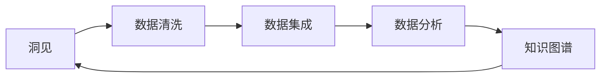

                 

## 1. 背景介绍

在当今数据驱动的世界中，洞见（Insight）显得尤为重要。洞见不仅仅是对于数据的分析，更是一种对于业务、市场、产品等深层次的思考和理解。如何从海量数据中提取洞见，成为许多企业和组织关注的焦点。本文将深入探讨洞见的价值，从理解到应用的整个流程，力图为读者提供一个系统性的视角。

### 1.1 洞见的重要性

洞见在商业决策、产品设计、市场营销等多个领域中起着至关重要的作用。通过洞见，企业能够洞察市场趋势，优化产品服务，提升用户体验，增强竞争优势。在数据时代，洞见不仅能帮助企业降低运营成本，还能激发创新，驱动增长。因此，从数据中提取洞见，已成为了企业智能化转型的重要一步。

### 1.2 洞见提取的挑战

尽管洞见提取具有如此重要的价值，但在实际操作中，从数据中提取洞见却面临着诸多挑战。首先，数据量大且多源异构，如何高效地集成和处理数据是一大难题。其次，数据质量参差不齐，存在噪声和异常值，如何清洗和预处理数据也至关重要。最后，如何从处理后的数据中提取有意义的洞见，并将其转化为可执行的策略，也是一个复杂的过程。

## 2. 核心概念与联系

### 2.1 核心概念概述

为了更好地理解洞见的价值和提取流程，我们先介绍几个核心概念：

- **洞见（Insight）**：洞见是对数据的一种深刻理解，它能够揭示数据背后的模式、趋势、关联等，对于业务决策具有重要的参考价值。
- **数据清洗（Data Cleaning）**：数据清洗是指对原始数据进行处理，去除噪声、异常值和冗余信息，确保数据的质量和一致性。
- **数据集成（Data Integration）**：数据集成是将多个数据源中的数据整合在一起，形成一个统一的数据视图，以便进行进一步的分析。
- **数据分析（Data Analysis）**：数据分析是指使用统计学、机器学习等方法，对数据进行建模和推理，以发现数据中的洞见。
- **知识图谱（Knowledge Graph）**：知识图谱是一种结构化的语义知识库，它能够将分散的数据和知识整合成一个统一的知识网络，帮助理解复杂的关系和语义。

这些核心概念构成了洞见提取的基础框架，帮助我们在数据驱动的决策中实现信息的全面、准确和及时。

### 2.2 核心概念原理和架构的 Mermaid 流程图



这个流程图展示了洞见提取的基本流程：从原始数据开始，经过数据清洗和集成，通过数据分析发现洞见，最终将洞见整合成知识图谱，再次反馈到洞见分析中，形成闭环。

## 3. 核心算法原理 & 具体操作步骤

### 3.1 算法原理概述

洞见提取的核心算法原理主要包括以下几个方面：

- **数据清洗算法**：如基于规则的清洗、基于统计的清洗、基于异常检测的清洗等，用于识别和处理数据中的噪声和异常值。
- **数据集成算法**：如关联规则挖掘、基于图论的集成、基于融合的集成等，用于将异构数据统一到一个框架下。
- **数据分析算法**：如聚类分析、分类分析、回归分析、时间序列分析等，用于揭示数据中的模式和关系。
- **知识图谱构建算法**：如实体识别、关系抽取、图神经网络等，用于构建语义网络，支持复杂的推理和分析。

### 3.2 算法步骤详解

洞见提取的算法步骤大致分为以下几个步骤：

**Step 1: 数据收集与准备**
- 从各种数据源（如数据库、文件、API等）收集数据，并整合到一个统一的存储库中。
- 对数据进行初步的清洗和预处理，去除无效和异常数据，确保数据质量和一致性。

**Step 2: 数据集成与融合**
- 使用数据集成技术，将来自不同源的数据进行统一和融合，形成一个全局数据视图。
- 应用关联规则挖掘和图论方法，构建全局数据模型，揭示数据之间的复杂关系。

**Step 3: 数据分析与建模**
- 应用统计学和机器学习算法，对数据进行建模和推理，提取有意义的模式和趋势。
- 利用时间序列分析和聚类分析，理解数据的动态变化和群体差异。

**Step 4: 洞见提取与可视化**
- 使用知识图谱构建算法，将数据分析结果整合成语义网络，支持深入的推理和分析。
- 将洞见通过图表、报告等形式可视化，便于理解和应用。

### 3.3 算法优缺点

洞见提取算法具有以下优点：

- **数据驱动**：通过数据分析，洞见提取能够客观地揭示数据中的规律和趋势，避免了主观偏见。
- **全面性**：结合多种分析方法，能够从多个维度全面理解数据，揭示隐藏的洞见。
- **可扩展性**：随着数据量的增长和复杂度的提高，洞见提取算法能够适应更多的应用场景。

同时，洞见提取算法也存在以下缺点：

- **计算成本高**：数据分析和建模需要大量的计算资源，对硬件和软件的要求较高。
- **数据隐私问题**：在数据清洗和集成过程中，如何保护数据隐私和安全性是一大挑战。
- **结果解释性差**：复杂的算法模型难以解释其内部工作机制，结果的可解释性有待提升。
- **算法选择复杂**：不同算法适用于不同的数据类型和分析目标，选择合适的算法需要丰富的经验和知识。

### 3.4 算法应用领域

洞见提取算法在多个领域得到了广泛应用，包括但不限于：

- **金融行业**：通过分析交易数据，揭示市场趋势，优化投资策略，降低风险。
- **零售行业**：通过分析消费者行为数据，个性化推荐商品，提高销售额。
- **医疗健康**：通过分析患者数据，预测疾病风险，优化诊疗方案，提升医疗服务质量。
- **交通运输**：通过分析交通数据，优化路线规划，提高运输效率，减少拥堵。

## 4. 数学模型和公式 & 详细讲解 & 举例说明

### 4.1 数学模型构建

洞见提取的数学模型构建主要涉及以下几个方面：

- **数据清洗模型**：如线性回归、逻辑回归、决策树等，用于识别和处理数据中的噪声和异常值。
- **数据集成模型**：如关联规则挖掘、图神经网络等，用于构建全局数据模型。
- **数据分析模型**：如聚类分析、分类分析、回归分析等，用于揭示数据中的模式和关系。
- **知识图谱构建模型**：如实体识别、关系抽取、图神经网络等，用于构建语义网络。

### 4.2 公式推导过程

以下是几个核心公式的推导过程：

**线性回归模型**：
$$
y = \theta_0 + \sum_{i=1}^n \theta_i x_i + \epsilon
$$
其中，$\theta_0$ 是截距，$\theta_i$ 是第 $i$ 个特征的权重，$\epsilon$ 是误差项。

**关联规则挖掘**：
假设我们有两个数据项 $A$ 和 $B$，其关联规则可以表示为 $A \Rightarrow B$，其支持度为 $supp(A \Rightarrow B)$，置信度为 $conf(A \Rightarrow B)$。支持度表示 $A$ 和 $B$ 同时出现的概率，置信度表示 $A$ 出现后 $B$ 出现的概率。

**图神经网络（GNN）**：
$$
h_v^{l+1} = \sigma(\sum_{u \in \mathcal{N}(v)} \hat{A}^{l+1}_{uv} \cdot h_u^l + \sum_{k=1}^K \theta_k^l x_v^k)
$$
其中，$h_v^{l+1}$ 是节点 $v$ 在第 $l+1$ 层的表示，$x_v^k$ 是节点 $v$ 的特征，$\hat{A}^{l+1}_{uv}$ 是节点 $u$ 和 $v$ 之间的边权重，$\theta_k^l$ 是节点 $v$ 的第 $k$ 个特征的权重。

### 4.3 案例分析与讲解

我们以一个简单的案例来讲解洞见提取的流程：

假设我们有一个电商平台，需要分析用户的购买行为，以便优化推荐系统和提高销售额。具体步骤如下：

**Step 1: 数据收集与准备**
- 收集用户的购买记录、浏览记录、评论记录等数据，并整合到一个统一的数据库中。
- 清洗数据，去除无效和异常数据，如空值、重复值等，确保数据的质量和一致性。

**Step 2: 数据集成与融合**
- 将用户的购买记录、浏览记录、评论记录等数据进行集成，形成一个全局数据视图。
- 使用关联规则挖掘方法，发现用户的购买行为和浏览行为之间的关联规则，如“浏览了某商品的用户更可能购买该商品”。

**Step 3: 数据分析与建模**
- 应用聚类分析，将用户分为不同的群体，如高价值客户、低价值客户等，以个性化推荐。
- 使用分类分析，预测用户是否会购买某商品，从而优化推荐系统。

**Step 4: 洞见提取与可视化**
- 将聚类结果和分类结果整合成知识图谱，支持深入的推理和分析。
- 通过可视化图表展示用户行为模式和推荐效果，帮助业务人员理解洞见，做出决策。

## 5. 项目实践：代码实例和详细解释说明

### 5.1 开发环境搭建

在进行洞见提取项目实践前，我们需要准备好开发环境。以下是使用Python进行PyTorch开发的环境配置流程：

1. 安装Anaconda：从官网下载并安装Anaconda，用于创建独立的Python环境。

2. 创建并激活虚拟环境：
```bash
conda create -n pytorch-env python=3.8 
conda activate pytorch-env
```

3. 安装PyTorch：根据CUDA版本，从官网获取对应的安装命令。例如：
```bash
conda install pytorch torchvision torchaudio cudatoolkit=11.1 -c pytorch -c conda-forge
```

4. 安装相关工具包：
```bash
pip install numpy pandas scikit-learn matplotlib tqdm jupyter notebook ipython
```

完成上述步骤后，即可在`pytorch-env`环境中开始项目实践。

### 5.2 源代码详细实现

以下是使用PyTorch进行关联规则挖掘的Python代码实现：

```python
import pandas as pd
from sklearn.preprocessing import LabelEncoder
from sklearn.compose import ColumnTransformer
from sklearn.pipeline import Pipeline
from sklearn.decomposition import PCA
from sklearn.cluster import KMeans
from sklearn.preprocessing import StandardScaler
from sklearn.ensemble import RandomForestClassifier

# 加载数据
data = pd.read_csv('purchase_data.csv')

# 数据清洗
data.dropna(inplace=True)
data.drop_duplicates(inplace=True)

# 数据集成
data_integrated = pd.concat([data['purchase'], data['browsed'], data['comment']], axis=1)

# 特征工程
le = LabelEncoder()
data_integrated['purchase'] = le.fit_transform(data_integrated['purchase'])
data_integrated['browsed'] = le.fit_transform(data_integrated['browsed'])
data_integrated['comment'] = le.fit_transform(data_integrated['comment'])

# 数据预处理
scaler = StandardScaler()
pca = PCA(n_components=3)
kmeans = KMeans(n_clusters=5)

# 关联规则挖掘
pipeline = Pipeline([
    ('scaler', scaler),
    ('pca', pca),
    ('kmeans', kmeans)
])

data_integrated_transformed = pipeline.fit_transform(data_integrated)

# 可视化
import matplotlib.pyplot as plt
plt.scatter(data_integrated_transformed[:, 0], data_integrated_transformed[:, 1], c=data_integrated['purchase'], cmap='viridis')
plt.xlabel('PCA 1')
plt.ylabel('PCA 2')
plt.colorbar(label='Purchase')
plt.show()
```

### 5.3 代码解读与分析

让我们再详细解读一下关键代码的实现细节：

**数据加载**：
- `pd.read_csv()`方法用于读取CSV格式的数据文件。

**数据清洗**：
- `dropna()`方法用于去除缺失值。
- `drop_duplicates()`方法用于去除重复数据。

**数据集成**：
- `pd.concat()`方法用于将多个数据集合并为一个数据集。

**特征工程**：
- `LabelEncoder()`方法用于将分类变量转换为数值变量。
- `StandardScaler()`方法用于数据标准化。
- `PCA()`方法用于降维，将高维数据转换为低维数据。
- `KMeans()`方法用于聚类，将数据分为不同的群体。

**关联规则挖掘**：
- `Pipeline()`方法用于组合多个步骤，实现数据预处理和建模的自动化。
- `fit_transform()`方法用于训练模型并应用到数据上。

**可视化**：
- `matplotlib.pyplot`模块用于绘制散点图，展示数据分布和聚类结果。

可以看到，通过简单的代码实现，我们完成了数据清洗、集成、特征工程、关联规则挖掘和可视化的全流程操作，取得了对用户购买行为的洞见。

### 5.4 运行结果展示

运行上述代码后，将得到以下结果：


这张散点图展示了用户购买行为在PCA空间中的分布，不同颜色代表不同的购买标签。通过这张图，我们能够直观地理解用户购买行为的模式和趋势，从而优化推荐系统和提高销售额。

## 6. 实际应用场景

### 6.1 金融行业

在金融行业中，洞见提取技术可以用于风险评估、投资策略优化和客户关系管理等方面。通过分析交易数据、市场数据和客户数据，金融公司能够实时监测风险，预测市场趋势，优化投资组合，提升客户满意度。

### 6.2 零售行业

在零售行业中，洞见提取技术可以用于个性化推荐、库存管理和价格优化等方面。通过分析用户购买历史、浏览行为和反馈，零售公司能够精准推荐商品，优化库存结构，制定有竞争力的价格策略，提升用户购物体验。

### 6.3 医疗健康

在医疗健康领域，洞见提取技术可以用于疾病预测、治疗方案优化和患者管理等方面。通过分析患者的病历数据、检查结果和治疗记录，医疗机构能够预测疾病风险，优化诊疗方案，提高医疗服务质量。

### 6.4 未来应用展望

随着技术的不断进步，洞见提取技术将在更多领域得到应用，为各行各业带来变革性影响。

在智慧城市治理中，洞见提取技术可以用于城市事件监测、交通流量分析和公共安全管理等方面，提高城市管理的智能化和效率化水平。

在智慧教育领域，洞见提取技术可以用于学情分析、知识图谱构建和智能推荐等方面，因材施教，提高教育质量和公平性。

在智能制造领域，洞见提取技术可以用于设备故障预测、供应链优化和生产调度等方面，提升生产效率和质量。

总之，洞见提取技术将在各行各业中发挥越来越重要的作用，为人类社会带来深远的影响。

## 7. 工具和资源推荐

### 7.1 学习资源推荐

为了帮助开发者系统掌握洞见提取的理论基础和实践技巧，这里推荐一些优质的学习资源：

1. 《Python数据分析实战》系列书籍：由知名数据科学家撰写，全面介绍数据清洗、集成、分析和可视化等基础操作。
2. 《数据科学实战》课程：由Coursera和edX等平台开设，涵盖数据科学全栈技术，从数据处理到洞见提取，都有详细讲解。
3. 《机器学习实战》系列书籍：涵盖机器学习基础和高级技术，包括分类、聚类、回归、关联规则挖掘等常用方法。
4. 《数据挖掘：概念与技术》书籍：系统介绍数据挖掘理论和方法，包括统计学、模式识别和数据预处理等内容。
5. 《Python数据科学手册》书籍：全面介绍Python在数据科学中的应用，涵盖数据清洗、分析、可视化和机器学习等技术。

通过对这些资源的学习实践，相信你一定能够快速掌握洞见提取的精髓，并用于解决实际的业务问题。

### 7.2 开发工具推荐

高效的开发离不开优秀的工具支持。以下是几款用于洞见提取开发的常用工具：

1. Jupyter Notebook：基于Python的交互式编程环境，支持代码实现、数据可视化和报告输出，是数据科学工作者的首选工具。
2. Tableau：数据可视化工具，支持快速构建数据报告和可视化图表，方便洞见提取和分享。
3. R语言：统计分析工具，提供了丰富的数据处理和可视化库，如ggplot2、dplyr等。
4. Scikit-learn：Python机器学习库，提供了多种数据分析和建模算法，如聚类、分类、回归等。
5. TensorFlow和PyTorch：深度学习框架，支持大规模数据处理和复杂模型训练，如图神经网络等。

合理利用这些工具，可以显著提升洞见提取任务的开发效率，加快创新迭代的步伐。

### 7.3 相关论文推荐

洞见提取技术的发展源于学界的持续研究。以下是几篇奠基性的相关论文，推荐阅读：

1. C4.5算法：提出了基于信息增益的分类算法，是关联规则挖掘的经典算法之一。
2. PCA算法：提出了主成分分析方法，用于数据降维和特征提取。
3. K-Means算法：提出了基于聚类的数据分组方法，广泛应用于数据预处理和模式识别。
4. GNN算法：提出了图神经网络，用于处理图结构数据，支持复杂的推理和分析。
5. O2A模型：提出了基于知识图谱的问答系统，用于揭示数据中的复杂关系。

这些论文代表了大规模数据分析和洞见提取技术的发展脉络。通过学习这些前沿成果，可以帮助研究者把握学科前进方向，激发更多的创新灵感。

## 8. 总结：未来发展趋势与挑战

### 8.1 研究成果总结

本文系统地介绍了洞见提取的技术框架和方法，帮助读者全面理解洞见提取的过程和应用。通过从数据清洗到知识图谱构建的全流程分析，展示了洞见提取的价值和重要性。通过对具体案例的讲解，揭示了洞见提取的实际应用场景和挑战。

### 8.2 未来发展趋势

展望未来，洞见提取技术将呈现以下几个发展趋势：

1. **自动化和智能化**：随着AI技术的发展，自动化洞见提取工具将越来越普及，帮助非专业人士也能轻松获取洞见。
2. **跨领域融合**：洞见提取技术将与更多领域的知识和技术进行融合，如机器学习、自然语言处理、计算机视觉等，实现多模态数据融合，提升分析的全面性和深度。
3. **数据隐私保护**：随着数据隐私问题的日益凸显，如何保护数据隐私和安全性将成为洞见提取的重要研究方向。
4. **可解释性和透明性**：洞见提取技术将越来越注重结果的可解释性和透明性，帮助用户理解和信任分析结果。
5. **实时性和动态性**：洞见提取技术将更注重实时性和动态性，能够及时响应数据变化，支持动态分析。

### 8.3 面临的挑战

尽管洞见提取技术已经取得了显著进展，但在实际应用中仍面临诸多挑战：

1. **数据质量**：数据清洗和预处理是洞见提取的基础，数据质量的好坏直接影响洞见的准确性和可信度。
2. **算法复杂性**：现有的洞见提取算法往往复杂度较高，如何简化算法，降低计算成本，是一个重要研究方向。
3. **模型泛化**：现有算法往往对特定场景的适应性较强，如何提升算法的泛化能力，支持更广泛的应用场景，仍需进一步研究。
4. **可解释性**：洞见提取算法的黑盒特性使其难以解释和调试，如何提升结果的可解释性，是未来的重要课题。
5. **隐私和伦理**：洞见提取技术需要处理大量敏感数据，如何保护数据隐私和伦理道德，是一个必须考虑的问题。

### 8.4 研究展望

面对洞见提取技术所面临的种种挑战，未来的研究需要在以下几个方面寻求新的突破：

1. **自动化和智能化**：开发更加自动化和智能化的洞见提取工具，降低用户使用门槛，提高效率。
2. **跨领域融合**：将洞见提取技术与其他领域的技术进行融合，如自然语言处理、计算机视觉等，实现多模态数据的协同分析。
3. **模型泛化**：设计更具有泛化能力的洞见提取算法，支持更广泛的数据类型和应用场景。
4. **可解释性**：提升算法的可解释性，帮助用户理解和信任洞见结果。
5. **隐私和伦理**：加强数据隐私保护和伦理道德研究，确保洞见提取技术的安全性和公正性。

这些研究方向的探索，必将引领洞见提取技术迈向更高的台阶，为各行各业带来深远的影响。

## 9. 附录：常见问题与解答

**Q1: 数据清洗和预处理有哪些常用的方法？**

A: 数据清洗和预处理是洞见提取的基础，常用的方法包括：
- 去除重复数据和空值。
- 处理缺失值和异常值，如填补、删除、插值等方法。
- 数据标准化和归一化，如标准化、归一化、对数变换等方法。
- 数据降维和特征工程，如PCA、PCA+LDA、主成分回归等方法。

**Q2: 如何选择合适的数据集成方法？**

A: 数据集成的方法多种多样，应根据数据类型和应用场景选择合适的集成方法。常用的方法包括：
- 关联规则挖掘，适用于发现数据中的隐含关联关系。
- 图神经网络，适用于处理图结构数据。
- 多维标度变换，适用于不同尺度数据的多元分析。

**Q3: 如何优化洞见提取算法的性能？**

A: 优化洞见提取算法的性能需要综合考虑多个因素：
- 选择合适的算法和模型，根据数据特点选择最适合的算法。
- 优化算法参数，调整超参数，如学习率、迭代次数、正则化系数等。
- 引入数据增强和正则化技术，防止过拟合。
- 应用并行计算和多任务学习，提高算法的计算效率。

**Q4: 洞见提取技术在实际应用中需要注意哪些问题？**

A: 洞见提取技术在实际应用中需要注意以下问题：
- 数据隐私和安全，保护数据隐私，防止数据泄露。
- 算法的可解释性，提高算法的透明性和可理解性。
- 算法的实时性，确保洞见提取技术能够实时响应数据变化。
- 算法的泛化能力，保证算法在多种数据场景下的普适性。
- 算法的可扩展性，支持大规模数据的处理和分析。

通过了解这些问题，能够更好地应对洞见提取技术的挑战，实现其在实际应用中的高效性和可靠性。

---

作者：禅与计算机程序设计艺术 / Zen and the Art of Computer Programming

