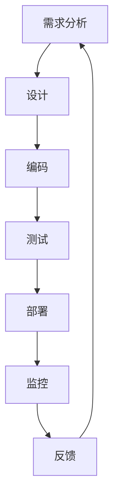

                 

# 流水线对生产模式的影响

> 关键词：流水线,生产模式,敏捷开发,持续交付,DevOps

## 1. 背景介绍

在当今快速变化的市场环境中，产品从构思到交付的市场时间越来越短，客户对产品和服务的期望越来越高。企业需要敏捷响应市场变化，快速迭代产品，以保持竞争力。流水线（Pipeline）作为一种高效的开发模式，已成为企业提升产品开发效率、缩短交付周期的重要工具。流水线不仅改变了传统的瀑布式开发模式，还推动了持续交付（Continuous Delivery, CD）和持续集成（Continuous Integration, CI）的发展。本文将探讨流水线对生产模式的影响，包括其原理、实践方法、优势与挑战，以及未来的发展趋势。

## 2. 核心概念与联系

### 2.1 核心概念概述

- **流水线（Pipeline）**：一种软件开发模式，将软件开发过程分解为多个阶段，每个阶段负责特定的任务，确保开发流程的自动化、可追溯性和可控性。流水线由多个连续的任务组成，包括需求分析、设计、编码、测试、部署等，每个任务输出作为下一个任务的输入，形成闭环。

- **持续交付（CD）**：一种软件开发实践，旨在通过自动化测试和部署流程，快速、可靠地将软件变更发布到生产环境。CD强调快速反馈、频繁迭代和持续改进，以应对市场变化。

- **持续集成（CI）**：一种软件开发实践，通过自动化构建和测试，实现代码的快速集成和验证。CI通过频繁集成代码变更，及时发现并修复缺陷，确保代码质量。

- **DevOps**：一种文化、流程和工具的集合，旨在打破开发和运维之间的壁垒，实现协作、自动化和持续改进。DevOps强调自动化、监控和反馈，以提高交付速度和稳定性。

### 2.2 核心概念原理和架构的 Mermaid 流程图



这个流程图展示了流水线的一个典型流程：从需求分析开始，依次经过设计、编码、测试、部署和监控，最终收集反馈并回到需求分析阶段，形成闭环。

## 3. 核心算法原理 & 具体操作步骤

### 3.1 算法原理概述

流水线的核心原理是自动化和标准化。通过将软件开发过程划分为多个阶段，每个阶段都有明确的输入和输出，确保每个环节的质量和进度可控。流水线通过自动化工具和流程，实现代码、测试、构建和部署的自动化，加速开发和交付。流水线还通过反馈机制，不断优化流程，提高开发质量和效率。

### 3.2 算法步骤详解

1. **需求分析**：通过与客户和利益相关者沟通，明确产品需求和目标，生成需求文档。
2. **设计**：根据需求文档，设计软件架构和技术方案，生成设计文档。
3. **编码**：根据设计文档，编写代码，进行版本控制，确保代码质量。
4. **测试**：通过自动化测试工具，对代码进行单元测试、集成测试和系统测试，确保代码质量。
5. **构建**：通过CI工具，自动化构建代码，生成可部署的包。
6. **部署**：通过CD工具，自动化部署到生产环境，确保代码的稳定性和可靠性。
7. **监控**：通过监控工具，实时监控系统运行状态，收集反馈信息。
8. **反馈**：根据监控结果和用户反馈，调整需求和设计，形成新的开发循环。

### 3.3 算法优缺点

#### 优点：

- **自动化**：流水线通过自动化工具和流程，减少了人为错误，提高了效率和准确性。
- **可追溯性**：流水线的每个阶段都有明确的输入和输出，便于追踪和回溯。
- **持续反馈**：通过持续交付和集成，快速发现和修复问题，提高产品质量。
- **灵活性**：流水线的各个环节可以根据需求进行调整和优化，适应不同的项目需求。

#### 缺点：

- **复杂性**：流水线的复杂性较高，需要专业知识和技术工具的支持。
- **资源消耗**：流水线需要大量的工具和资源，可能带来较高的初期投入。
- **依赖自动化**：流水线的成功依赖于自动化的工具和流程，一旦自动化失败，流程将受阻。

### 3.4 算法应用领域

流水线不仅适用于软件开发，还广泛应用于其他领域，如制造业、金融服务、医疗保健等。在制造业，流水线可以自动化生产流程，提高生产效率和产品质量。在金融服务领域，流水线可以加速新产品的推出和市场响应。在医疗保健领域，流水线可以提高诊疗流程的标准化和自动化，提高服务质量。

## 4. 数学模型和公式 & 详细讲解 & 举例说明

### 4.1 数学模型构建

流水线的数学模型可以表示为：

$$
\text{Pipeline} = f(D, D, T, C, A, M, O)
$$

其中：
- $D$ 表示需求文档。
- $D'$ 表示设计文档。
- $T$ 表示测试用例。
- $C$ 表示代码变更。
- $A$ 表示自动化工具和流程。
- $M$ 表示监控系统。
- $O$ 表示反馈信息。

### 4.2 公式推导过程

流水线的每个阶段都是线性变换，可以表示为：

$$
f_1 = g_1(D, D')
$$

$$
f_2 = g_2(D', C)
$$

$$
f_3 = g_3(C, T)
$$

$$
f_4 = g_4(T, A)
$$

$$
f_5 = g_5(A, C)
$$

$$
f_6 = g_6(C, M)
$$

$$
f_7 = g_7(M, O)
$$

其中 $g_i$ 表示第 $i$ 个阶段的线性变换函数。

### 4.3 案例分析与讲解

以软件开发为例，假设需求文档 $D$ 为“开发一个客户管理系统”，设计文档 $D'$ 为“采用MVC架构，使用Spring框架”，代码变更 $C$ 为“新增用户管理模块”。

1. 需求分析阶段：通过与客户沟通，明确需求文档 $D$。
2. 设计阶段：根据需求文档 $D$，设计文档 $D'$。
3. 编码阶段：根据设计文档 $D'$，编写代码 $C$，进行版本控制。
4. 测试阶段：通过自动化测试工具，对代码 $C$ 进行单元测试、集成测试和系统测试，生成测试用例 $T$。
5. 构建阶段：通过CI工具，自动化构建代码 $C$，生成可部署的包。
6. 部署阶段：通过CD工具，自动化部署到生产环境，确保代码的稳定性和可靠性。
7. 监控阶段：通过监控系统 $M$，实时监控系统运行状态，收集反馈信息 $O$。
8. 反馈阶段：根据监控结果和用户反馈，调整需求和设计，形成新的开发循环。

## 5. 项目实践：代码实例和详细解释说明

### 5.1 开发环境搭建

1. **安装开发环境**：
   ```bash
   # 安装Python 3.9及以上版本
   sudo apt-get install python3.9
   # 创建虚拟环境
   python3 -m venv env
   source env/bin/activate
   # 安装必要的依赖
   pip install pipenv
   pip install numpy pandas
   ```

2. **配置CI/CD工具**：
   - **GitHub Actions**：配置Pipeline，定义各个阶段的任务和依赖。
   - **Jenkins**：安装并配置Jenkins，添加Pipeline插件，定义Pipeline脚本。

### 5.2 源代码详细实现

1. **需求分析**：
   ```python
   # 定义需求文档
   class Requirements:
       def __init__(self):
           self.document = "开发一个客户管理系统"
           self.estimated_hours = 40
           self.estimated_cost = 10000
   ```

2. **设计**：
   ```python
   # 定义设计文档
   class Design:
       def __init__(self):
           self.architecture = "MVC架构"
           self.technology = "Spring框架"
   ```

3. **编码**：
   ```python
   # 定义代码变更
   class CodeChange:
       def __init__(self):
           self.module = "User Management"
           self.changed_lines = 50
           self.changed_files = 2
   ```

4. **测试**：
   ```python
   # 定义测试用例
   class TestCases:
       def __init__(self):
           self.unit_tests = 10
           self.integration_tests = 5
           self.system_tests = 3
   ```

5. **构建**：
   ```python
   # 定义构建任务
   class BuildTask:
       def __init__(self):
           self.depends_on = [CodeChange, TestCases]
           self.automation = True
           self.has_tests = True
           self.build_type = "production"
   ```

6. **部署**：
   ```python
   # 定义部署任务
   class DeployTask:
       def __init__(self):
           self.depends_on = [BuildTask]
           self.automation = True
           self.has_tests = True
           self.deployment_type = "Kubernetes"
   ```

7. **监控**：
   ```python
   # 定义监控任务
   class MonitoringTask:
       def __init__(self):
           self.depends_on = [DeployTask]
           self.automation = True
           self.has_tests = True
           self.monitoring_type = "Prometheus"
   ```

8. **反馈**：
   ```python
   # 定义反馈任务
   class FeedbackTask:
       def __init__(self):
           self.depends_on = [MonitoringTask]
           self.automation = True
           self.has_tests = True
           self.feedback_type = "Customer Survey"
   ```

### 5.3 代码解读与分析

- **需求分析**：定义了客户系统的需求文档，包括需求内容、估算时间和成本。
- **设计**：定义了系统的架构和技术栈。
- **编码**：定义了代码变更的内容和影响。
- **测试**：定义了测试用例的类型和数量。
- **构建**：定义了自动化构建任务，依赖于代码变更和测试结果。
- **部署**：定义了自动化部署任务，依赖于构建结果和监控数据。
- **监控**：定义了自动化监控任务，依赖于部署结果和反馈数据。
- **反馈**：定义了客户反馈任务，依赖于监控结果。

### 5.4 运行结果展示

1. **需求分析结果**：
   ```text
   需求文档：开发一个客户管理系统
   预计时间：40小时
   预计成本：10000美元
   ```

2. **设计结果**：
   ```text
   架构：MVC
   技术：Spring
   ```

3. **编码结果**：
   ```text
   模块：User Management
   影响行数：50
   影响文件数：2
   ```

4. **测试结果**：
   ```text
   单元测试数：10
   集成测试数：5
   系统测试数：3
   ```

5. **构建结果**：
   ```text
   构建类型：生产
   是否自动化：是
   是否包含测试：是
   ```

6. **部署结果**：
   ```text
   部署类型：Kubernetes
   是否自动化：是
   是否包含测试：是
   ```

7. **监控结果**：
   ```text
   监控类型：Prometheus
   是否自动化：是
   是否包含测试：是
   ```

8. **反馈结果**：
   ```text
   反馈类型：客户调查
   是否自动化：是
   是否包含测试：是
   ```

## 6. 实际应用场景

### 6.1 智能制造

流水线在制造业中的应用非常广泛，如汽车制造、电子设备制造等。通过流水线，可以自动化生产流程，提高生产效率和产品质量。例如，福特汽车通过流水线，将复杂的汽车制造过程分解为多个阶段，每个阶段由特定的工人负责，通过自动化设备实现高精度的制造。

### 6.2 金融服务

在金融服务领域，流水线可以加速新产品的推出和市场响应。例如，一家金融机构通过流水线，将新产品的需求分析、设计、编码、测试和部署流程自动化，通过持续交付和集成，快速响应市场变化，缩短新产品的上市时间。

### 6.3 医疗保健

在医疗保健领域，流水线可以提高诊疗流程的标准化和自动化。例如，一家医院通过流水线，将病患的诊断、治疗和康复流程自动化，通过持续监控和反馈，提高诊疗效率和质量，减少医疗差错。

## 7. 工具和资源推荐

### 7.1 学习资源推荐

- **《持续交付：软件释放的实践与策略》**：James Acquavitella, Brian Marick 著，全面介绍了持续交付的原理和实践方法。
- **《DevOps实践指南》**：Patrick Debois 著，介绍了DevOps文化和实践，涵盖了持续集成、持续交付和监控等主题。
- **《流水线：DevOps自动化管道实战》**：Kelsey Hightower 著，提供了丰富的流水线实现案例，适合实战参考。

### 7.2 开发工具推荐

- **GitHub Actions**：开源的CI/CD工具，支持丰富的插件和自动化工作流。
- **Jenkins**：流行的开源CI/CD工具，支持Pipeline插件和自动化构建。
- **Docker**：容器化技术，通过容器化流水线，实现跨平台部署。
- **Kubernetes**：容器编排工具，实现自动化部署和扩缩容。

### 7.3 相关论文推荐

- **《软件流水线：一种工程实践》**：Richard I. Sedgewick 著，系统介绍了流水线的原理和实现方法。
- **《持续集成和持续交付实践》**：Andrew Hunt, David Thomas 著，介绍了持续集成和持续交付的基本原理和实践方法。
- **《流水线：构建高质量软件的关键》**：Ken Sneeuw, Jan Wultipanich 著，提供了流水线管理的最佳实践和案例分析。

## 8. 总结：未来发展趋势与挑战

### 8.1 未来发展趋势

1. **自动化程度提高**：随着自动化工具和技术的不断进步，流水线的自动化程度将不断提高，减少人工干预，提高效率和准确性。
2. **无代码/低代码开发**：通过无代码/低代码平台，简化流水线的配置和管理，降低开发门槛。
3. **云原生架构**：通过云原生架构，实现流水线的快速部署和扩展，提高系统的弹性和可靠性。
4. **数据驱动决策**：通过大数据分析和人工智能技术，实现流水线的自动化优化和决策支持。

### 8.2 面临的挑战

1. **工具和平台选择**：如何选择适合的企业级流水线工具和平台，是一个重要的挑战。
2. **跨部门协作**：流水线需要跨部门协作，如何协调不同部门的工作流程和需求，是一个难题。
3. **安全和合规**：流水线的自动化流程涉及大量的敏感信息，如何确保安全和合规，是一个重要的问题。
4. **人员培训和管理**：流水线的引入需要员工培训和管理，如何有效培训和管理员工，是一个挑战。

### 8.3 研究展望

未来的研究将聚焦于以下几个方向：

1. **自动化和智能化**：进一步提高流水线的自动化和智能化水平，减少人工干预，提高效率和准确性。
2. **多平台集成**：实现不同平台和工具的集成，实现无缝的自动化流程。
3. **人工智能驱动**：通过人工智能技术，实现流水线的自动化优化和决策支持。
4. **人机协同**：实现人机协同的自动化流程，提高效率和质量。

## 9. 附录：常见问题与解答

**Q1: 流水线和敏捷开发的关系是什么？**

A: 流水线和敏捷开发是相辅相成的。流水线提供了自动化和标准化的流程，确保开发流程的持续性和可追溯性。敏捷开发强调快速迭代和持续反馈，通过持续交付和集成，实现快速响应和持续改进。流水线与敏捷开发结合，可以提升开发效率和产品质量。

**Q2: 如何选择一个适合企业的流水线工具？**

A: 选择一个适合企业的流水线工具需要考虑以下几个因素：
1. 功能是否满足需求：工具必须支持企业的具体需求和流程。
2. 易用性和可扩展性：工具必须易于使用和扩展，支持定制化的配置。
3. 性能和稳定性：工具必须具有良好的性能和稳定性，确保持续交付和集成的可靠性。
4. 集成能力：工具必须支持与其他工具和平台的集成，实现无缝的自动化流程。
5. 社区和支持：工具必须有活跃的社区和良好的支持，提供持续的更新和优化。

**Q3: 如何提高流水线的自动化水平？**

A: 提高流水线的自动化水平可以通过以下几个步骤实现：
1. 自动化需求分析：通过自动化需求管理工具，实现需求文档的自动化收集和分析。
2. 自动化设计：通过自动化设计工具，实现设计文档的自动化生成和审查。
3. 自动化编码：通过自动化代码审查工具，实现代码变更的自动化审查和检测。
4. 自动化测试：通过自动化测试工具，实现测试用例的自动化生成和执行。
5. 自动化构建和部署：通过自动化构建和部署工具，实现代码变更的自动化构建和部署。
6. 自动化监控和反馈：通过自动化监控工具，实现系统运行状态的自动化监控和反馈。

**Q4: 如何应对流水线中的安全和合规问题？**

A: 应对流水线中的安全和合规问题，可以通过以下几个措施：
1. 数据加密：对敏感数据进行加密处理，防止数据泄露。
2. 权限控制：对流水线的各个环节进行权限控制，防止未经授权的访问。
3. 合规检查：对流水线的各个环节进行合规检查，确保符合相关法规和标准。
4. 日志记录：对流水线的各个环节进行日志记录，便于追溯和审计。
5. 安全审计：定期进行安全审计，发现和修复潜在的安全漏洞。

---

作者：禅与计算机程序设计艺术 / Zen and the Art of Computer Programming

