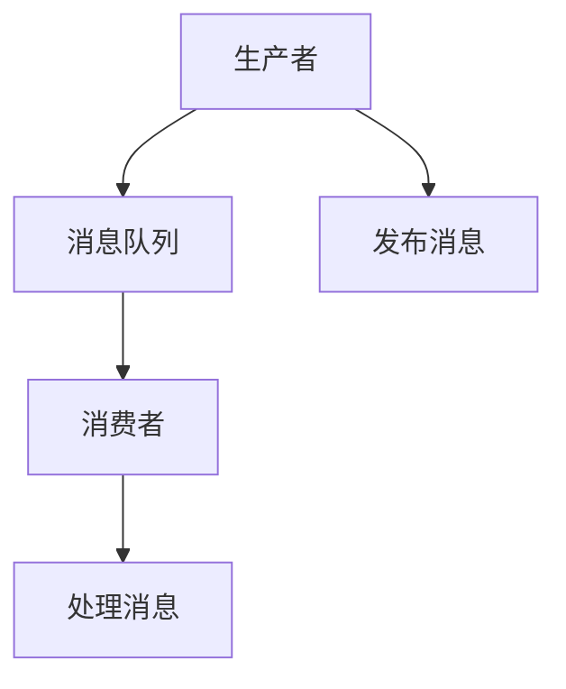

                 

# 消息队列 原理与代码实例讲解

> 关键词：消息队列, 异步通信, 分布式系统, 可靠性, 高可用性, 高吞吐量, 订阅者, 生产者

## 1. 背景介绍

### 1.1 问题由来
在分布式系统中，系统组件之间需要频繁进行通信，但直接通过网络进行调用会面临诸如网络延迟、数据传输效率低、处理不稳定等挑战。为解决这些问题，消息队列应运而生。消息队列是一种异步通信方式，通过中介系统实现生产者和消费者之间的解耦，大大提升了分布式系统的通信效率和稳定性。

### 1.2 问题核心关键点
消息队列的核心思想是利用中介系统实现生产者和消费者之间的异步通信。生产者（Producer）负责向队列中发布消息（Message），消费者（Consumer）负责从队列中获取消息进行处理。通过消息队列，系统可以更好地处理高并发场景，提高系统稳定性，确保数据可靠性。

### 1.3 问题研究意义
研究消息队列的原理与实现方式，对于提升分布式系统的性能和稳定性，优化系统架构设计，具有重要意义：

1. 提升系统吞吐量。消息队列可以通过异步通信，有效提升系统的并行处理能力。
2. 保证数据可靠性。消息队列提供消息持久化、重试机制，确保数据的可靠传输和处理。
3. 降低系统耦合度。消息队列实现了生产者和消费者之间的解耦，使得系统模块更加灵活，易于维护。
4. 提升系统稳定性。消息队列提供了重试机制、消息确认机制，降低系统故障风险。

## 2. 核心概念与联系

### 2.1 核心概念概述

为更好地理解消息队列的原理与实现，本节将介绍几个关键概念：

- 消息队列 (Message Queue)：一种异步通信机制，实现生产者和消费者之间的解耦，提高系统效率和稳定性。
- 生产者 (Producer)：消息发布方，负责向消息队列发布消息。
- 消费者 (Consumer)：消息订阅方，负责从消息队列中获取消息并进行处理。
- 消息 (Message)：生产者发布的数据包，包含消息内容、消息类型等属性。
- 队列 (Queue)：消息的存储介质，具有先进先出（FIFO）的访问方式。

这些核心概念之间的逻辑关系可以通过以下Mermaid流程图来展示：



这个流程图展示了消息队列的核心组件和消息流动过程：

1. 生产者向消息队列发布消息。
2. 消息队列存储消息。
3. 消费者从消息队列中获取消息进行处理。

## 3. 核心算法原理 & 具体操作步骤
### 3.1 算法原理概述

消息队列的核心原理是通过中介系统实现生产者和消费者之间的异步通信。其核心流程包括：

1. 生产者将消息发布到消息队列。
2. 消息队列存储消息，并提供消息持久化、消息重试机制。
3. 消费者从消息队列中订阅消息，并根据消息类型进行异步处理。

消息队列的底层实现主要依赖于分布式系统的网络通信协议、数据存储机制、消息持久化机制等技术。常见的消息队列系统包括RabbitMQ、Kafka、ActiveMQ等。

### 3.2 算法步骤详解

以下我们以RabbitMQ为例，详细介绍消息队列的核心实现步骤：

**Step 1: 生产者发布消息**
- 创建RabbitMQ连接对象，并连接到消息队列服务器。
- 通过连接对象创建通道对象，用于发送消息。
- 定义消息内容和消息类型，并设置消息属性。
- 调用通道对象的`basic_publish`方法将消息发布到消息队列中。

**Step 2: 消费者订阅消息**
- 创建RabbitMQ连接对象，并连接到消息队列服务器。
- 通过连接对象创建通道对象，用于接收消息。
- 定义消息队列名称和消息类型，并创建队列对象。
- 调用通道对象的`basic_consume`方法，指定队列、消息类型和回调函数，订阅消息。

**Step 3: 消费者处理消息**
- 当有消息到达队列时，消费者被触发，回调函数被调用。
- 从回调函数参数中获取消息内容，并进行异步处理。

### 3.3 算法优缺点

消息队列的优点包括：

1. 异步通信：生产者发送消息后不需要等待消费者确认，提高了系统效率。
2. 解耦合：生产者和消费者解耦，降低了系统耦合度，提高了系统灵活性。
3. 可靠性：消息队列提供了消息持久化、消息重试机制，确保消息可靠传输。
4. 高吞吐量：消息队列支持高并发处理，提高了系统的吞吐量。

但消息队列也存在一些局限性：

1. 延迟：消息队列存在一定延迟，可能影响实时性要求较高的场景。
2. 复杂性：消息队列实现较为复杂，增加了系统维护成本。
3. 数据冗余：消息队列需要存储大量消息，占用了较多空间。

### 3.4 算法应用领域

消息队列被广泛应用于各种分布式系统场景，包括但不限于以下领域：

- 分布式系统通信：实现生产者和消费者之间的解耦，提升系统效率和稳定性。
- 数据处理系统：如ETL（Extract-Transform-Load）系统，利用消息队列异步处理数据，提高系统吞吐量。
- 微服务架构：实现微服务之间的通信，支持服务的异步调用和故障隔离。
- 大数据系统：利用消息队列实现分布式任务调度，提升任务处理能力。
- 流数据处理：如实时数据处理系统，利用消息队列实现消息的缓冲和分发。

## 4. 数学模型和公式 & 详细讲解 & 举例说明

### 4.1 数学模型构建

消息队列的数学模型主要包括消息的发布、存储、消费等操作。以下以RabbitMQ为例，构建消息队列的数学模型。

**定义符号：**
- $P$：生产者；$C$：消费者；$Q$：消息队列。
- $m$：消息数；$s$：单条消息大小；$k$：批量消息数量；$b$：消息队列容量；$n$：消费者数量。

**消息发布模型：**
- 生产者将$m$条消息发布到消息队列，消息大小为$s$，消息类型标识为$t$。

**消息存储模型：**
- 消息队列接收生产者发布的消息，将其存储在消息队列中。如果队列已满，则消息会被阻塞，直到队列有空闲位置。

**消息消费模型：**
- 消费者从消息队列中订阅消息，并根据消息类型进行异步处理。

### 4.2 公式推导过程

以下对消息队列的核心数学公式进行推导：

**消息发布公式：**
$$
\mathcal{B} = f(P, Q, m, s, t)
$$
表示生产者发布$m$条大小为$s$的消息到消息队列$Q$，消息类型为$t$的操作。

**消息存储公式：**
$$
\mathcal{S} = g(Q, P, m, s, t)
$$
表示消息队列接收生产者发布的消息，并存储到队列中的操作。

**消息消费公式：**
$$
\mathcal{C} = h(Q, C, m, s, t)
$$
表示消费者从消息队列$Q$中订阅消息，并根据消息类型进行异步处理的操作。

### 4.3 案例分析与讲解

假设系统中有$N$个生产者，每个生产者每秒发布$1$条消息，消息大小为$1$KB。消息队列容量为$1024$条消息。根据公式计算系统单位时间内的消息存储容量：

- 每秒消息发布率：$N \times 1 = N$条消息/秒。
- 每秒消息存储容量：$1024 \times 1$KB = $1024$KB。

如果系统中有$M$个消费者，每个消费者每秒消费$1$条消息，则消息队列能够支持的消息存储容量为$1024 \times M$KB。

## 5. 项目实践：代码实例和详细解释说明
### 5.1 开发环境搭建

在进行消息队列开发前，我们需要准备好开发环境。以下是使用Python和RabbitMQ进行开发的环境配置流程：

1. 安装Anaconda：从官网下载并安装Anaconda，用于创建独立的Python环境。

2. 创建并激活虚拟环境：
```bash
conda create -n rabbitmq-env python=3.8 
conda activate rabbitmq-env
```

3. 安装RabbitMQ：从官网下载并安装RabbitMQ，包括服务器和客户端。

4. 安装相关依赖包：
```bash
pip install pika
```

完成上述步骤后，即可在`rabbitmq-env`环境中开始消息队列开发。

### 5.2 源代码详细实现

以下是使用Python和RabbitMQ实现消息队列的示例代码：

**生产者代码：**
```python
import pika
import time

def main():
    # 创建RabbitMQ连接
    connection = pika.BlockingConnection(pika.ConnectionParameters('localhost'))
    channel = connection.channel()

    # 定义队列名称和消息类型
    queue_name = 'task_queue'
    message_type = 'task'

    # 发布消息
    for i in range(10):
        channel.basic_publish(exchange='',
                             routing_key=queue_name,
                             body=f'This is message {i}.',
                             properties=pika.BasicProperties(message_type=message_type))
        print(f'发布消息 {i}')
        time.sleep(1)

if __name__ == '__main__':
    main()
```

**消费者代码：**
```python
import pika
import time

def main():
    # 创建RabbitMQ连接
    connection = pika.BlockingConnection(pika.ConnectionParameters('localhost'))
    channel = connection.channel()

    # 定义队列名称和消息类型
    queue_name = 'task_queue'
    message_type = 'task'

    # 订阅消息
    channel.basic_consume(queue=queue_name,
                         on_message_callback=on_message,
                         auto_ack=True)

    print(f'等待队列 {queue_name}')
    channel.start_consuming()

def on_message(ch, method, properties, body):
    # 处理消息
    print(f'处理消息: {body}')
    ch.basic_ack(delivery_tag=method.delivery_tag)

if __name__ == '__main__':
    main()
```

### 5.3 代码解读与分析

让我们再详细解读一下关键代码的实现细节：

**生产者代码：**
- 使用pika库创建RabbitMQ连接对象，并连接到本地RabbitMQ服务器。
- 创建通道对象，用于发布消息。
- 定义队列名称和消息类型，通过`basic_publish`方法发布消息到队列。

**消费者代码：**
- 使用pika库创建RabbitMQ连接对象，并连接到本地RabbitMQ服务器。
- 创建通道对象，用于接收消息。
- 定义队列名称和消息类型，通过`basic_consume`方法订阅消息，并设置回调函数`on_message`。
- `on_message`函数接收消息，并调用`basic_ack`方法进行消息确认。

### 5.4 运行结果展示

运行上述代码后，生产者会不断发布消息到RabbitMQ队列，消费者会接收到消息并进行处理。可以通过监控RabbitMQ控制台查看消息的发布和消费情况。

```
发布消息 0
处理消息: This is message 0
发布消息 1
处理消息: This is message 1
...
```

以上示例展示了消息队列的基本实现，利用RabbitMQ的异步通信机制，实现了生产者与消费者之间的解耦。在实际应用中，需要根据具体业务需求进行优化和扩展，如增加消息重试机制、支持批量发布等。

## 6. 实际应用场景

### 6.1 分布式系统通信

在分布式系统中，消息队列用于实现生产者和消费者之间的异步通信。例如，在前端服务发布订单后，消息队列将订单信息传递给后端服务进行订单处理。通过消息队列，前后端服务实现解耦，提高了系统的稳定性和可扩展性。

### 6.2 数据处理系统

在ETL系统中，消息队列用于异步处理数据。例如，从多个数据源异步收集数据，然后统一存储到数据仓库中。通过消息队列，系统能够高效处理大规模数据，提高系统吞吐量。

### 6.3 微服务架构

在微服务架构中，消息队列用于实现微服务之间的异步通信。例如，一个微服务调用另一个微服务获取数据，然后通过消息队列返回结果。通过消息队列，服务之间的调用更加灵活，降低系统耦合度。

### 6.4 大数据系统

在大数据系统中，消息队列用于实现分布式任务调度。例如，分布式计算任务通过消息队列进行分发和执行。通过消息队列，系统能够高效处理大规模分布式任务，提高任务处理能力。

### 6.5 流数据处理

在流数据处理系统中，消息队列用于实现消息的缓冲和分发。例如，实时数据处理系统通过消息队列缓存数据，然后统一处理。通过消息队列，系统能够高效处理实时数据，提高数据处理效率。

## 7. 工具和资源推荐

### 7.1 学习资源推荐

为了帮助开发者系统掌握消息队列的原理和实现方法，以下是一些优质的学习资源：

1. RabbitMQ官方文档：详细介绍了RabbitMQ的使用方法和API接口。
2. Pika官方文档：提供了Python编程语言的RabbitMQ客户端库。
3. "RabbitMQ in Action"：深入浅出地介绍了RabbitMQ的使用方法和最佳实践。
4. "RabbitMQ Cookbook"：提供了大量的RabbitMQ实用技巧和示例代码。
5. "Learning RabbitMQ"：适合初学者的RabbitMQ入门书籍，详细介绍了RabbitMQ的各个组件和工作原理。

通过对这些资源的学习实践，相信你一定能够快速掌握消息队列的精髓，并用于解决实际的业务问题。

### 7.2 开发工具推荐

高效的开发离不开优秀的工具支持。以下是几款用于消息队列开发的常用工具：

1. RabbitMQ：Apache基金会开源的消息队列系统，支持多种编程语言。
2. Kafka：Apache基金会开源的流数据处理系统，支持高吞吐量、高可靠性。
3. Apache ActiveMQ：Apache基金会开源的消息队列系统，支持多种协议和消息格式。
4. AMQP：高级消息队列协议，支持多种消息队列系统。
5. Pika：Python编程语言的RabbitMQ客户端库，方便与RabbitMQ进行交互。

合理利用这些工具，可以显著提升消息队列的开发效率，加快创新迭代的步伐。

### 7.3 相关论文推荐

消息队列的研究源于学界的持续研究。以下是几篇奠基性的相关论文，推荐阅读：

1. "RabbitMQ: What's under the hood?"：详细介绍了RabbitMQ的消息传输机制和底层实现。
2. "Kafka: The log-structured storage system for high-throughput, distributed publishing and subscribe"：介绍了Kafka的消息存储机制和系统架构。
3. "Message Queue for Large-Scale Distributed Systems"：综述了大型分布式系统中的消息队列实现。
4. "ActiveMQ in Action"：介绍了ActiveMQ的架构和使用方法。
5. "Scalability of RabbitMQ"：讨论了RabbitMQ在大规模场景下的性能优化。

这些论文代表了大规模分布式系统中的消息队列研究脉络，通过学习这些前沿成果，可以帮助研究者把握学科前进方向，激发更多的创新灵感。

## 8. 总结：未来发展趋势与挑战

### 8.1 总结

本文对消息队列的原理与实现方式进行了全面系统的介绍。首先阐述了消息队列的背景和意义，明确了消息队列在分布式系统中的重要地位。其次，从原理到实践，详细讲解了消息队列的数学模型和核心步骤，给出了消息队列任务开发的完整代码实例。同时，本文还广泛探讨了消息队列在分布式系统、数据处理系统、微服务架构等众多领域的应用前景，展示了消息队列范式的强大潜力。此外，本文精选了消息队列的学习资源，力求为读者提供全方位的技术指引。

通过本文的系统梳理，可以看到，消息队列作为一种异步通信机制，在大规模分布式系统中发挥了重要作用。其通过中介系统实现生产者和消费者之间的解耦，大大提升了系统效率和稳定性。未来，伴随消息队列的持续演进，相信其在更多领域中将会得到更广泛的应用，为分布式系统的建设提供重要的支撑。

### 8.2 未来发展趋势

展望未来，消息队列的发展趋势如下：

1. 高并发性能：随着大规模分布式系统的不断演进，消息队列需要支持更高的并发性能，以满足海量数据处理需求。
2. 可靠性增强：消息队列需要提供更可靠的持久化机制和消息重试机制，确保消息的可靠传输和处理。
3. 跨平台支持：消息队列需要支持更多的编程语言和平台，适应不同行业的需求。
4. 云原生支持：消息队列需要与云原生生态进行更深入的整合，支持容器化部署和微服务架构。
5. 微服务治理：消息队列需要支持微服务的治理功能，如服务发现、负载均衡、故障恢复等。

这些趋势表明，消息队列在分布式系统中的地位将更加重要，成为构建高可用、高性能、可扩展分布式系统的重要组件。

### 8.3 面临的挑战

尽管消息队列在分布式系统中发挥了重要作用，但在迈向更加智能化、普适化应用的过程中，它仍面临着诸多挑战：

1. 性能瓶颈：消息队列在高并发场景下可能出现性能瓶颈，需要优化系统的吞吐量和响应速度。
2. 数据一致性：消息队列需要保证数据的一致性，避免数据丢失和重复处理。
3. 消息队列安全性：消息队列需要保证消息的安全性，避免消息被篡改或泄露。
4. 多租户支持：消息队列需要支持多租户环境，确保不同租户之间数据隔离和隔离机制。
5. 跨域通信：消息队列需要支持跨域通信，确保系统在不同的环境中有良好的兼容性。

这些挑战需要研究者在性能优化、数据一致性保障、安全性提升、多租户支持等方面进行更深入的研究和实践。

### 8.4 研究展望

为了应对消息队列面临的挑战，未来的研究需要在以下几个方面寻求新的突破：

1. 微服务架构下的消息队列：在微服务架构下，消息队列需要更好地支持服务的异步调用和故障恢复。
2. 分布式事务处理：在分布式系统中，消息队列需要支持分布式事务处理，确保数据的一致性和可靠性。
3. 高效消息传输：消息队列需要优化消息传输机制，提高系统的吞吐量和响应速度。
4. 实时监控和告警：消息队列需要提供实时监控和告警机制，及时发现系统异常并进行处理。
5. 分布式系统协同：消息队列需要支持分布式系统协同，实现系统组件之间的协同工作。

这些研究方向将引领消息队列技术的进一步发展，提升系统的稳定性和可靠性，满足更多业务场景的需求。

## 9. 附录：常见问题与解答

**Q1：消息队列是否适用于所有分布式系统场景？**

A: 消息队列适用于大多数分布式系统场景，特别是需要异步通信和系统解耦的场景。但对于实时性要求极高的场景，消息队列的延迟可能成为瓶颈。此时需要结合其他技术进行优化，如零拷贝、消息压缩等。

**Q2：消息队列与缓存队列的区别是什么？**

A: 消息队列和缓存队列的主要区别在于其设计目标和使用场景。消息队列主要解决系统组件之间的异步通信问题，支持高并发处理；而缓存队列主要解决系统的缓存和数据同步问题，支持低延迟处理。

**Q3：消息队列中的消息类型有哪些？**

A: 消息队列中的消息类型主要包括以下几种：
1. 任务消息：用于业务处理的任务消息，如订单处理、用户注册等。
2. 事件消息：用于系统事件的通知消息，如系统故障、登录登出等。
3. 日志消息：用于系统日志记录的消息，如错误日志、访问日志等。

**Q4：消息队列如何保证消息的可靠性？**

A: 消息队列主要通过以下方式保证消息的可靠性：
1. 消息持久化：将消息存储在持久化介质中，保证消息不丢失。
2. 消息确认：消费者处理消息后需要发送确认信息，表示消息已经成功处理。
3. 消息重试：如果消费者处理失败，消息会被重试，直到成功处理或达到最大重试次数。
4. 消息重放：在消息重试过程中，可能需要对已处理的消息进行重放，以确保数据的一致性。

**Q5：如何优化消息队列的性能？**

A: 消息队列的性能优化主要包括以下几个方面：
1. 批量发布：批量发布消息可以减少网络传输次数，提高系统效率。
2. 消息压缩：对消息进行压缩，减少消息大小，提高系统吞吐量。
3. 多消费者处理：增加消费者数量，并行处理消息，提高系统处理能力。
4. 缓存机制：利用缓存机制减少消息的重复处理，提高系统响应速度。

以上示例展示了消息队列的基本实现，利用RabbitMQ的异步通信机制，实现了生产者与消费者之间的解耦。在实际应用中，需要根据具体业务需求进行优化和扩展，如增加消息重试机制、支持批量发布等。

---

作者：禅与计算机程序设计艺术 / Zen and the Art of Computer Programming

