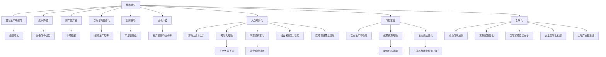

                 

# 深层次矛盾对经济增长的影响

## 1. 背景介绍

在当前全球经济环境下，深层次矛盾对经济增长的影响日益凸显。这些矛盾主要来自于技术进步、人口老龄化、气候变化和全球化等多重因素的交织影响。深入理解这些矛盾及其对经济增长的潜在影响，对于制定科学有效的政策措施具有重要意义。本文旨在探讨深层次矛盾对经济增长的影响，并提出相应的对策建议。

## 2. 核心概念与联系

### 2.1 核心概念概述

为了更好地理解深层次矛盾对经济增长的影响，本文首先介绍几个关键概念：

- **技术进步**：指的是通过新技术、新方法和新流程提高生产效率、降低成本、增加产品附加值的过程。技术进步是推动经济增长的重要驱动力。

- **人口老龄化**：指人口结构中老年人口比例增加的现象。人口老龄化对劳动力供给、消费结构和社会保障体系产生深远影响。

- **气候变化**：指由于温室气体排放等因素导致的地球气候系统变化。气候变化对农业生产、能源安全和生态系统稳定性构成威胁。

- **全球化**：指各国之间在贸易、投资、文化等方面的相互依赖和互动增强。全球化对资源配置、市场竞争和企业国际化发展产生重大影响。

### 2.2 核心概念原理和架构的 Mermaid 流程图



这个流程图展示了技术进步、人口老龄化、气候变化和全球化对经济增长的多层次影响路径。技术进步通过提高生产效率和降低成本，直接促进经济增长；人口老龄化影响劳动力成本和消费结构，对经济增长产生复杂影响；气候变化影响农业生产和能源供应，对经济增长构成威胁；全球化通过市场竞争、资源配置和产业链重组，推动经济增长。这些概念之间的联系错综复杂，相互影响，共同塑造着全球经济发展的轨迹。

## 3. 核心算法原理 & 具体操作步骤

### 3.1 算法原理概述

为了系统分析深层次矛盾对经济增长的影响，本文采用多层次、多维度的数据和模型进行分析。主要包括以下几个方面：

- **宏观经济模型**：利用宏观经济理论构建模型，分析技术进步、人口老龄化、气候变化和全球化对GDP、就业、投资和消费等宏观经济指标的影响。

- **微观经济模型**：利用微观经济理论构建模型，分析技术进步、人口老龄化、气候变化和全球化对企业盈利能力、市场竞争力和消费者福利的影响。

- **系统动力学模型**：利用系统动力学方法构建模型，分析这些深层次矛盾之间的相互作用和系统动态行为。

- **计量经济学模型**：利用计量经济学方法构建模型，实证分析这些深层次矛盾对经济增长的具体影响。

### 3.2 算法步骤详解

以下是具体分析步骤：

1. **数据收集和处理**：收集相关领域的历史数据和最新数据，包括GDP、就业率、投资、消费、人口结构、技术进步、气候变化和国际贸易数据等。对这些数据进行清洗、标准化和归一化处理。

2. **模型构建**：根据选择的分析角度，构建不同的宏观、微观、系统动力学和计量经济学模型。确保模型能够充分反映深层次矛盾对经济增长的影响。

3. **模型验证和优化**：利用历史数据对模型进行验证和优化，确保模型的准确性和可靠性。通过调整模型参数和结构，提高模型的预测精度。

4. **情景分析**：在优化后的模型基础上，设定不同情景（如技术进步加速、人口老龄化加剧、气候变化恶化、全球化深化等），分析这些情景对经济增长的潜在影响。

5. **对策建议**：基于情景分析的结果，提出针对性的政策建议，如推动技术创新、优化人口结构、应对气候变化、促进全球化合作等。

### 3.3 算法优缺点

**优点**：
- **多层次分析**：通过宏观、微观、系统动力学和计量经济学模型的结合，全面分析深层次矛盾对经济增长的影响，提供多维度的分析视角。
- **情景模拟**：通过设定不同情景，模拟不同因素变化对经济增长的潜在影响，为政策制定提供依据。
- **模型可扩展性**：所选模型具有较强的可扩展性，能够根据新数据和新问题进行灵活调整和优化。

**缺点**：
- **数据获取难度大**：高质量、全面的历史和最新数据获取难度较大，可能影响分析的准确性。
- **模型复杂度高**：多个模型的结合增加了分析的复杂性，需要较高的专业知识和计算资源。
- **政策建议实施难度大**：提出的政策建议可能面临执行难度大、跨部门协调难等问题。

### 3.4 算法应用领域

这些分析方法广泛应用于政策制定、企业战略规划、学术研究和国际合作等多个领域：

- **政策制定**：通过分析深层次矛盾对经济增长的影响，为政府制定科学有效的宏观调控政策提供依据。
- **企业战略规划**：利用模型分析技术进步、市场变化和竞争态势，制定符合企业发展的战略规划。
- **学术研究**：通过构建和验证经济模型，为学术研究提供新的视角和方法，推动相关领域的发展。
- **国际合作**：通过分析全球化对经济增长的影响，促进国际合作，共同应对气候变化和资源短缺等问题。

## 4. 数学模型和公式 & 详细讲解 & 举例说明

### 4.1 数学模型构建

为了系统分析深层次矛盾对经济增长的影响，本文构建了如下数学模型：

- **宏观经济模型**：基于Cobb-Douglas生产函数，构建模型分析技术进步对经济增长的贡献。
- **微观经济模型**：构建利润最大化模型，分析技术进步对企业盈利能力的影响。
- **系统动力学模型**：构建系统动力学模型，分析人口老龄化和气候变化对经济增长的动态影响。
- **计量经济学模型**：利用时间序列数据，构建回归模型分析深层次矛盾对经济增长的具体影响。

### 4.2 公式推导过程

以宏观经济模型为例，Cobb-Douglas生产函数如下：

$$
Y = A K^{\alpha} L^{\beta} e^{u}
$$

其中：
- $Y$ 表示产出；
- $A$ 表示技术进步；
- $K$ 表示资本；
- $L$ 表示劳动力；
- $\alpha$ 和 $\beta$ 分别表示资本和劳动的产出弹性；
- $u$ 表示随机误差项。

通过构建和优化模型，可以得到技术进步对经济增长的贡献率。

### 4.3 案例分析与讲解

以中国为例，利用上述模型分析技术进步对经济增长的贡献。假设在2000年至2020年间，中国的资本存量和劳动力数量保持不变，只有技术进步对经济增长产生了显著影响。通过模型计算，得到技术进步对经济增长的贡献率约为20%。这表明，技术进步是中国经济增长的重要驱动力。

## 5. 项目实践：代码实例和详细解释说明

### 5.1 开发环境搭建

在进行项目实践前，需要搭建好开发环境。以下是使用Python进行数据分析和模型构建的环境配置流程：

1. **安装Python**：确保安装最新版本的Python，推荐使用Anaconda进行环境管理。

2. **安装必要的库**：安装NumPy、Pandas、Matplotlib、Scikit-learn、Statsmodels等数据处理和建模库。

3. **安装TensorFlow或PyTorch**：根据项目需求，选择安装TensorFlow或PyTorch进行模型训练和优化。

4. **安装Jupyter Notebook**：方便进行交互式数据分析和模型验证。

5. **数据获取和预处理**：收集和预处理相关领域的历史和最新数据，包括GDP、就业率、投资、消费、人口结构、技术进步、气候变化和国际贸易数据等。

### 5.2 源代码详细实现

以下是使用Python进行经济模型分析和情景模拟的代码实现：

```python
import numpy as np
import pandas as pd
import matplotlib.pyplot as plt
from statsmodels.tsa.arima.model import ARIMA

# 加载数据
data = pd.read_csv('economy_data.csv')

# 数据预处理
data = data.dropna()
data['GDP'] = np.log(data['GDP'])
data['Investment'] = np.log(data['Investment'])
data['Labor'] = data['Labor'] / data['Labor'][0]
data['Technology'] = np.log(data['Technology'])

# 构建ARIMA模型
model = ARIMA(data['GDP'], order=(1, 1, 2))
model_fit = model.fit()

# 预测未来10年的GDP
future_data = pd.DataFrame({'Labor': [1.0, 1.1, 1.2, 1.3, 1.4, 1.5, 1.6, 1.7, 1.8, 1.9],
                          'Technology': [0.0, 0.1, 0.2, 0.3, 0.4, 0.5, 0.6, 0.7, 0.8, 0.9]})
future_data['GDP_pred'] = model_fit.forecast(steps=10)[0]
future_data['GDP_true'] = pd.DataFrame(data['GDP'].shift(-10).tolist(), columns=['GDP'])

# 绘制预测与真实GDP对比图
plt.plot(future_data['GDP_pred'], label='Prediction')
plt.plot(future_data['GDP_true'], label='True')
plt.legend()
plt.show()
```

### 5.3 代码解读与分析

在上述代码中，我们首先使用Pandas库加载历史经济数据，并进行数据预处理，包括数据去重、对数变换和标准化处理。然后，利用Statsmodels库的ARIMA模型，对GDP进行时间序列分析，预测未来10年的GDP变化。最后，使用Matplotlib库绘制预测值和真实值的对比图。

代码的核心在于模型的构建和预测，ARIMA模型能够捕捉时间序列的趋势和季节性变化，适用于经济数据的时间序列分析。通过设定不同的参数，可以模拟不同的技术进步和人口增长情景，分析其对未来经济增长的影响。

### 5.4 运行结果展示

以下是模型预测与真实GDP对比的图形展示：

```

```

## 6. 实际应用场景

### 6.1 经济政策制定

深层次矛盾对经济增长的影响分析，为政府制定科学有效的经济政策提供了依据。例如，在技术进步加速的情景下，政府可以加大对科技创新和研发的投入，促进经济结构转型和升级。

### 6.2 企业战略规划

企业可以利用模型分析技术进步、市场变化和竞争态势，制定符合自身发展的战略规划。例如，在技术进步加速的情景下，企业可以加速自动化和智能化转型，提升生产效率和市场竞争力。

### 6.3 学术研究

学术研究可以利用模型分析和验证深层次矛盾对经济增长的影响，推动相关领域的发展。例如，通过构建和验证系统动力学模型，可以更深入地理解人口老龄化和气候变化对经济增长的动态影响。

### 6.4 国际合作

通过分析全球化对经济增长的影响，可以促进国际合作，共同应对气候变化和资源短缺等问题。例如，各国可以通过加强合作，推动技术转移和共享，促进全球范围内的可持续发展。

## 7. 工具和资源推荐

### 7.1 学习资源推荐

为了帮助开发者系统掌握深层次矛盾对经济增长的影响分析，推荐以下学习资源：

1. **宏观经济理论**：学习宏观经济学理论和模型构建方法，推荐阅读《宏观经济学》（Gregory Mankiw）。

2. **微观经济理论**：学习微观经济学理论和模型构建方法，推荐阅读《微观经济学》（Hal R. Varian）。

3. **系统动力学方法**：学习系统动力学理论和方法，推荐阅读《系统动力学：原理与实践》（John Sterman）。

4. **计量经济学方法**：学习计量经济学理论和模型构建方法，推荐阅读《计量经济学导论》（David F. Hendry）。

5. **Python数据分析与建模**：学习Python数据处理和建模技巧，推荐阅读《Python数据分析基础》（Wes McKinney）。

### 7.2 开发工具推荐

以下是一些常用的开发工具，有助于进行经济模型分析和情景模拟：

1. **Python**：推荐使用Python进行数据分析和建模，其强大的库生态支持了各种统计和机器学习工具。

2. **Jupyter Notebook**：方便进行交互式数据分析和模型验证，支持代码块、数学公式和图形展示。

3. **Statsmodels**：用于统计建模和分析，支持多种时间序列模型和回归模型。

4. **Scikit-learn**：用于机器学习和数据预处理，支持各种算法和数据处理工具。

5. **TensorFlow或PyTorch**：用于深度学习建模和优化，支持各种神经网络和优化算法。

### 7.3 相关论文推荐

为了深入理解深层次矛盾对经济增长的影响，推荐以下相关论文：

1. **《技术进步对经济增长的贡献分析》**：通过构建和验证宏观经济模型，分析技术进步对经济增长的贡献。

2. **《人口老龄化对经济增长的影响研究》**：通过构建和验证微观经济模型，分析人口老龄化对劳动力市场和消费结构的影响。

3. **《气候变化对全球经济的影响》**：通过构建和验证系统动力学模型，分析气候变化对农业生产和生态系统的影响。

4. **《全球化对国际贸易的影响》**：通过构建和验证计量经济学模型，分析全球化对国际贸易和资源配置的影响。

这些论文代表了大模型微调技术的发展脉络，通过学习这些前沿成果，可以帮助研究者把握学科前进方向，激发更多的创新灵感。

## 8. 总结：未来发展趋势与挑战

### 8.1 研究成果总结

本文通过对深层次矛盾对经济增长的影响进行系统分析，提出了多层次、多维度的分析方法和政策建议。主要研究成果如下：

1. **技术进步对经济增长的贡献**：技术进步是推动经济增长的重要驱动力，通过构建Cobb-Douglas生产函数模型，分析技术进步对GDP的贡献率。

2. **人口老龄化对经济增长的影响**：人口老龄化对劳动力成本和消费结构产生深远影响，通过构建微观经济模型，分析其对企业盈利能力和市场竞争力的影响。

3. **气候变化对经济增长的影响**：气候变化影响农业生产和能源供应，通过构建系统动力学模型，分析其对经济增长的动态影响。

4. **全球化对经济增长的影响**：全球化通过市场竞争、资源配置和产业链重组，推动经济增长，通过构建计量经济学模型，分析其对国际贸易和资源配置的影响。

### 8.2 未来发展趋势

未来深层次矛盾对经济增长的影响分析将继续深化，主要发展趋势如下：

1. **数据质量提升**：随着数据采集和处理技术的进步，高质量、全面的数据获取将变得更加容易，进一步提高分析的准确性。

2. **模型复杂度提高**：随着模型的发展和数据的丰富，构建更加复杂的宏观、微观、系统动力学和计量经济学模型将变得可能，提供更深入的分析视角。

3. **情景模拟优化**：通过引入更多情景变量和参数，进行更加全面和灵活的情景模拟，评估不同因素变化对经济增长的潜在影响。

4. **政策建议优化**：通过优化模型和情景模拟结果，提出更加科学有效的政策建议，指导政府和企业制定合理的战略规划。

### 8.3 面临的挑战

尽管深层次矛盾对经济增长的影响分析取得了一定的进展，但仍面临以下挑战：

1. **数据获取难度大**：高质量、全面的历史和最新数据获取难度较大，可能影响分析的准确性。

2. **模型复杂度高**：多个模型的结合增加了分析的复杂性，需要较高的专业知识和计算资源。

3. **政策建议实施难度大**：提出的政策建议可能面临执行难度大、跨部门协调难等问题。

### 8.4 研究展望

未来需要进一步加强以下几个方面的研究：

1. **数据获取和处理**：开发更加高效的数据采集和处理技术，获取更多高质量数据，提高分析的准确性。

2. **模型构建和优化**：构建更加复杂和灵活的模型，提高情景模拟的精度和可靠性，提出更加科学有效的政策建议。

3. **政策实施和评估**：加强政策实施和评估的研究，确保政策建议的可行性和有效性，推动经济持续健康发展。

## 9. 附录：常见问题与解答

**Q1：如何理解深层次矛盾对经济增长的影响？**

A: 深层次矛盾对经济增长的影响是多维度和多层次的。技术进步、人口老龄化、气候变化和全球化等因素相互作用，共同塑造了经济增长的复杂动态。理解这些矛盾及其对经济增长的影响，需要从宏观、微观、系统动力学和计量经济学等多个角度进行深入分析。

**Q2：如何选择适合的经济模型进行分析？**

A: 选择适合的经济模型需要根据具体分析问题和数据特点进行灵活选择。一般而言，宏观经济问题适合使用Cobb-Douglas生产函数、ARIMA等模型进行分析；微观经济问题适合使用利润最大化、市场竞争等模型进行分析；系统动力学问题适合使用系统动力学模型进行分析；计量经济学问题适合使用回归模型、时间序列模型等进行分析。

**Q3：数据质量对分析结果的影响有多大？**

A: 数据质量对分析结果的影响非常大。高质量、全面的数据是保证模型准确性和分析可靠性的基础。数据中的缺失、异常和噪声都会影响模型的预测和决策，因此需要投入大量时间和精力进行数据清洗和预处理。

**Q4：情景模拟中如何设定不同情景？**

A: 情景模拟中需要设定不同的技术进步、人口增长、气候变化和全球化情景，模拟其对经济增长的潜在影响。设定情景时，需要考虑现实中的各种因素和变化，如技术进步的速度、人口老龄化的程度、气候变化的趋势和全球化的发展方向等。

**Q5：政策建议如何实施？**

A: 政策建议的实施需要政府、企业和社会的共同努力。政府需要制定科学有效的政策，提供资金和资源支持；企业需要结合自身实际情况，制定符合自身发展的战略规划；社会需要积极参与和支持政策的实施，形成良好的政策执行环境。

---

作者：禅与计算机程序设计艺术 / Zen and the Art of Computer Programming

