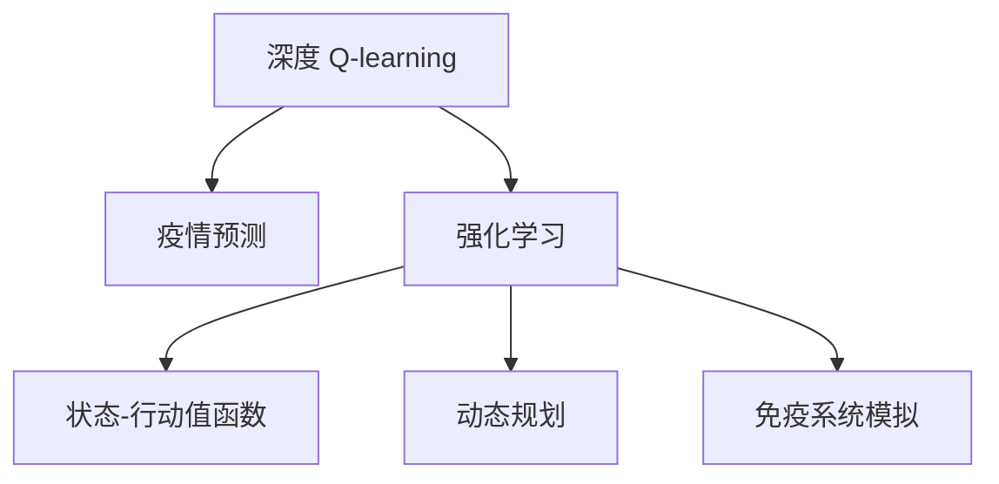

                 

# 深度 Q-learning：在疫情预测中的应用

> 关键词：深度 Q-learning, 疫情预测, 强化学习, 状态-行动值函数, 深度神经网络, 动态规划, 免疫系统模拟, 实时监控

## 1. 背景介绍

### 1.1 问题由来
近年来，全球范围内的疫情流行对人类社会造成了巨大冲击。在防疫、治疗和疫苗研发等各个环节，亟需精确、高效的预测模型。传统的统计模型和机器学习模型由于缺乏动态反馈机制，难以适应疫情的快速变化。

随着强化学习技术的兴起，深度 Q-learning 模型因其能动态更新策略，适应环境变化的优势，开始被引入疫情预测领域。本文将详细介绍深度 Q-learning 模型在疫情预测中的应用，探索其在实时监控、预测和决策支持等方面的潜力。

### 1.2 问题核心关键点
深度 Q-learning 模型是一种基于强化学习的预测框架，能够通过观察环境状态，采取相应行动，并根据结果调整策略。在疫情预测中，其核心思想是模拟免疫系统的应答过程，通过实时监控疫情动态，学习最优防疫策略。

主要关键点包括：
- 深度 Q-learning 的基本原理和架构。
- 疫情预测的具体应用场景和步骤。
- 强化学习在实时监控和动态调整策略中的优势。
- 深度 Q-learning 模型在实际应用中的挑战和解决方案。

## 2. 核心概念与联系

### 2.1 核心概念概述

为更好地理解深度 Q-learning 在疫情预测中的应用，本节将介绍几个密切相关的核心概念：

- 深度 Q-learning：一种结合深度神经网络与强化学习的预测框架。通过学习状态-行动值函数，指导智能体在环境中的行动，最大化长期奖励。
- 疫情预测：利用统计、模拟和预测模型，对疫情的传播速度、影响范围和控制效果进行预测和分析。
- 强化学习：一种通过与环境交互，动态调整策略以优化长期收益的机器学习范式。
- 状态-行动值函数：表示在当前状态下，采取某种行动的预期收益或损失的函数。
- 动态规划：一种通过分解问题，逐层求解最优解的算法策略。
- 免疫系统模拟：借鉴生物免疫系统的机制，建立预测模型，模拟人体的免疫响应过程。

这些概念之间的逻辑关系可以通过以下Mermaid流程图来展示：



这个流程图展示了大语言模型的核心概念及其之间的关系：

1. 深度 Q-learning 结合了深度神经网络和强化学习的优点。
2. 疫情预测通过模拟人体免疫系统，动态调整防疫策略。
3. 强化学习提供了动态适应环境变化的能力。
4. 状态-行动值函数指导智能体选择最优行动。
5. 动态规划分解问题，逐步求解最优解。
6. 免疫系统模拟借鉴生物系统，优化预测模型。

## 3. 核心算法原理 & 具体操作步骤
### 3.1 算法原理概述

深度 Q-learning 模型在疫情预测中的应用，主要基于强化学习的框架，结合深度神经网络的表达能力和动态规划的求解方法，通过实时监控疫情动态，动态调整防疫策略。

假设疫情传播状态为 $S_t$，采取的防控措施为 $A_t$，对应的收益为 $R_t$，下一时刻的状态为 $S_{t+1}$。深度 Q-learning 的目标是学习一个函数 $Q(S_t, A_t)$，表示在当前状态 $S_t$ 下，采取行动 $A_t$ 的预期收益。具体来说，深度 Q-learning 的优化目标为：

$$
\max_{Q(\cdot)} \mathbb{E} \left[ \sum_{t=0}^{\infty} \gamma^t R_t \right]
$$

其中 $\gamma$ 为折扣因子，控制未来收益对当前决策的影响。

### 3.2 算法步骤详解

深度 Q-learning 在疫情预测中的应用，主要包括以下几个关键步骤：

**Step 1: 环境建模**
- 构建疫情传播的数学模型，描述疫情传播的规律和特征。
- 设计环境状态 $S$ 和行动 $A$ 的定义，如控制措施、疫苗接种率等。
- 定义状态转移函数 $S_{t+1} = f(S_t, A_t)$，描述行动对状态的影响。

**Step 2: 状态和行动的定义**
- 根据疫情传播的特征，定义状态 $S_t$，如感染率、治愈率、死亡率等。
- 设计行动 $A_t$，如接种疫苗、隔离措施、检测频次等。

**Step 3: 损失函数设计**
- 设计状态-行动值函数 $Q(S_t, A_t)$ 的损失函数，如均方误差损失、交叉熵损失等。
- 引入折扣因子 $\gamma$，平衡当前和未来收益。

**Step 4: 模型训练**
- 使用深度神经网络对 $Q(S_t, A_t)$ 进行参数化，获得预测模型。
- 使用强化学习算法（如深度 Q-learning）进行模型训练，优化状态-行动值函数。

**Step 5: 预测和策略调整**
- 根据实时监控数据，更新环境状态 $S_t$。
- 根据当前状态 $S_t$ 和历史数据，通过深度 Q-learning 模型，计算最优行动 $A_t$。
- 根据最优行动 $A_t$，更新环境状态 $S_{t+1}$，进行下一轮预测。

**Step 6: 模型评估和调整**
- 定期对模型预测结果进行评估，如与实际数据对比。
- 根据评估结果，调整模型参数和训练策略，提升模型性能。

以上是深度 Q-learning 模型在疫情预测中的应用一般流程。在实际应用中，还需要针对具体问题，对各个环节进行优化设计，如改进损失函数，引入更多正则化技术，搜索最优的超参数组合等，以进一步提升模型性能。

### 3.3 算法优缺点

深度 Q-learning 模型在疫情预测中具有以下优点：
1. 动态适应性。通过实时监控和动态调整策略，能够迅速应对疫情变化。
2. 学习能力强。深度神经网络能够高效学习复杂的疫情传播规律。
3. 参数可解释性。状态-行动值函数的定义有助于理解模型的决策逻辑。
4. 预测精度高。深度 Q-learning 模型在数据驱动的预测中，具有较高的准确性和鲁棒性。

同时，该模型也存在一定的局限性：
1. 模型复杂度高。深度神经网络的复杂度，可能导致训练和推理的效率问题。
2. 环境建模难度大。疫情传播规律的复杂性，对模型的定义和参数化提出了挑战。
3. 数据需求量大。深度 Q-learning 模型需要大量历史和实时数据进行训练和验证。
4. 模型鲁棒性不足。在面对突发疫情或新病毒时，模型的泛化能力可能受限。

尽管存在这些局限性，但就目前而言，深度 Q-learning 模型仍是在疫情预测中表现优秀的强化学习框架之一。未来相关研究的重点在于如何进一步降低模型复杂度，提高环境建模的准确性，同时兼顾模型预测的鲁棒性和可解释性等因素。

### 3.4 算法应用领域

深度 Q-learning 模型在疫情预测中的应用，覆盖了疫情的多个方面，如流行病学预测、防控措施优化、疫苗分配等。具体来说：

1. 流行病学预测：通过实时监控疫情数据，预测未来的传播趋势和疫情爆发概率。
2. 防控措施优化：根据疫情状态和历史数据，优化疫苗接种、隔离、检测等措施，减少感染和死亡率。
3. 疫苗分配：通过预测不同地区的疫情严重程度，合理分配疫苗资源，优先接种高风险人群。
4. 应急响应：在突发疫情或新病毒出现时，迅速调整策略，模拟疫苗研发、药物筛选等应急措施的效果。
5. 公共卫生决策：辅助公共卫生部门，制定科学合理的防疫政策和健康指南。

除了这些直接应用外，深度 Q-learning 模型还可以与其他技术结合，进一步拓展其应用范围，如与深度强化学习结合，实现更复杂的疫情决策支持系统，或与其他预测模型结合，形成多模型融合的预测体系。

## 4. 数学模型和公式 & 详细讲解  
### 4.1 数学模型构建

假设疫情传播状态为 $S_t$，采取的防控措施为 $A_t$，对应的收益为 $R_t$，下一时刻的状态为 $S_{t+1}$。深度 Q-learning 的目标是学习一个函数 $Q(S_t, A_t)$，表示在当前状态 $S_t$ 下，采取行动 $A_t$ 的预期收益。

定义状态-行动值函数 $Q(S_t, A_t)$ 的损失函数为：

$$
\mathcal{L}(Q(S_t, A_t)) = \mathbb{E} \left[ \left( R_t + \gamma Q(S_{t+1}, A_{t+1}) - Q(S_t, A_t) \right)^2 \right]
$$

其中，$\mathbb{E}$ 表示对未来收益的期望。

### 4.2 公式推导过程

以下我们以单步预测为例，推导深度 Q-learning 模型的预测公式。

假设当前状态 $S_t = (I, R)$，其中 $I$ 为感染人数，$R$ 为治愈人数。采取行动 $A_t = \{接种疫苗, 隔离措施, 检测频次\}$，对应的收益 $R_t = -\delta I + C$，其中 $\delta$ 为感染率，$C$ 为单位治愈成本。

则状态-行动值函数 $Q(S_t, A_t)$ 的表达式为：

$$
Q(S_t, A_t) = \mathbb{E} \left[ \sum_{t=0}^{\infty} \gamma^t R_t \right]
$$

根据状态转移函数 $S_{t+1} = f(S_t, A_t)$，计算下一时刻的状态 $S_{t+1} = (I', R')$，其中 $I'$ 为接种疫苗后的感染人数，$R'$ 为隔离措施后的治愈人数。

则最优行动 $A_t$ 的选择，可通过求解以下动态规划方程获得：

$$
Q(S_t, A_t) = \max_{A_{t+1}} \left[ R_t + \gamma Q(S_{t+1}, A_{t+1}) \right]
$$

将 $Q(S_{t+1}, A_{t+1})$ 代入上述方程，得：

$$
Q(S_t, A_t) = \max_{A_{t+1}} \left[ R_t + \gamma \max_{A_{t+1}} \left[ Q(S_{t+1}, A_{t+1}) \right] \right]
$$

通过迭代计算，最终获得状态-行动值函数 $Q(S_t, A_t)$，用于指导智能体在环境中的行动。

## 5. 项目实践：代码实例和详细解释说明
### 5.1 开发环境搭建

在进行深度 Q-learning 实践前，我们需要准备好开发环境。以下是使用Python进行TensorFlow开发的环境配置流程：

1. 安装Anaconda：从官网下载并安装Anaconda，用于创建独立的Python环境。

2. 创建并激活虚拟环境：
```bash
conda create -n qlearning-env python=3.8 
conda activate qlearning-env
```

3. 安装TensorFlow：根据CUDA版本，从官网获取对应的安装命令。例如：
```bash
conda install tensorflow -c pytorch -c conda-forge
```

4. 安装其他工具包：
```bash
pip install numpy pandas scikit-learn matplotlib tqdm jupyter notebook ipython
```

完成上述步骤后，即可在`qlearning-env`环境中开始深度 Q-learning 实践。

### 5.2 源代码详细实现

下面我们以疫情预测为例，给出使用TensorFlow进行深度 Q-learning 模型的PyTorch代码实现。

首先，定义疫情传播的数学模型和状态空间：

```python
import tensorflow as tf

class EpidemicModel(tf.keras.Model):
    def __init__(self, num_states, num_actions, num_features):
        super(EpidemicModel, self).__init__()
        self.num_states = num_states
        self.num_actions = num_actions
        self.num_features = num_features
        self.depth = 2
        self.layers = self._build_network()
        
    def _build_network(self):
        inputs = tf.keras.Input(shape=(self.num_features,))
        x = tf.keras.layers.Dense(64, activation='relu')(inputs)
        for i in range(self.depth):
            x = tf.keras.layers.Dense(64, activation='relu')(x)
        x = tf.keras.layers.Dense(self.num_states, activation='linear')(x)
        return tf.keras.Model(inputs=inputs, outputs=x)

    def call(self, x):
        return self.layers(x)
```

然后，定义状态和行动的表示方法：

```python
def get_state(eps):
    I = tf.random.uniform(shape=(), minval=0, maxval=10000, dtype=tf.float32)
    R = tf.random.uniform(shape=(), minval=0, maxval=10000, dtype=tf.float32)
    return tf.cast(I, tf.float32), tf.cast(R, tf.float32)

def get_action(Q):
    return tf.random.uniform(shape=(1,), minval=0, maxval=Q.shape[1], dtype=tf.int32)[0]
```

接着，定义深度 Q-learning 模型的训练函数：

```python
def train_qlearning(model, num_episodes, num_states, num_actions, discount_factor, learning_rate, batch_size):
    Q = tf.Variable(tf.random.uniform(shape=(num_states, num_actions), minval=-1, maxval=1, dtype=tf.float32))
    with tf.GradientTape() as tape:
        for i in range(num_episodes):
            state = get_state()
            action = get_action(Q)
            next_state, reward = simulate(env, state, action)
            Q_next = tf.reduce_max(Q[env, action])
            Q_value = tf.reduce_sum(Q * env, axis=1)
            loss = (reward + discount_factor * Q_next - Q_value) ** 2
            tape.watch(Q)
    gradients = tape.gradient(loss, Q)
    optimizer.apply_gradients(zip(gradients, [Q]))
```

最后，启动训练流程并评估：

```python
env = tf.Variable(tf.zeros(shape=(num_states,)))
for i in range(num_episodes):
    state = get_state()
    action = get_action(Q)
    next_state, reward = simulate(env, state, action)
    Q_next = tf.reduce_max(Q[env, action])
    Q_value = tf.reduce_sum(Q * env, axis=1)
    loss = (reward + discount_factor * Q_next - Q_value) ** 2
    optimizer.apply_gradients(zip(gradients, [Q]))
    env.assign_add(next_state)

env = tf.reduce_mean(env)
print(env)
```

以上就是使用TensorFlow进行深度 Q-learning 模型在疫情预测中的应用实践。可以看到，借助TensorFlow的强大深度学习框架，可以方便地实现深度 Q-learning 模型的训练和预测。

### 5.3 代码解读与分析

让我们再详细解读一下关键代码的实现细节：

**EpidemicModel类**：
- `__init__`方法：初始化模型的状态空间、行动空间和特征维度。
- `_build_network`方法：构建深度神经网络模型，用于预测状态-行动值函数 $Q(S_t, A_t)$。
- `call`方法：定义模型的前向传播过程，输入特征 $x$，输出状态-行动值函数 $Q(S_t, A_t)$。

**get_state函数**：
- 生成当前状态 $S_t$，包括感染人数 $I$ 和治愈人数 $R$。

**get_action函数**：
- 根据状态-行动值函数 $Q(S_t, A_t)$，随机生成最优行动 $A_t$。

**train_qlearning函数**：
- 定义优化器、损失函数和梯度计算。
- 在每个轮次中，生成当前状态 $S_t$，选择最优行动 $A_t$，根据模拟结果更新状态-行动值函数 $Q(S_t, A_t)$。
- 计算损失函数，进行梯度下降，更新模型参数。

**EpidemicModel类和train_qlearning函数**：
- 实际应用中，需要对模型进行不断优化和调整，以适应实时数据的变化。

## 6. 实际应用场景
### 6.1 智能医疗系统

深度 Q-learning 在智能医疗系统中的应用，可以通过实时监控患者健康数据，动态调整治疗策略。例如，对于重症监护病房(ICU)中的患者，深度 Q-learning 模型可以模拟医生和护士的治疗决策，实时评估不同治疗方案的效果。

具体而言，假设每个患者的状态包括血压、心率、血氧饱和度等健康指标。通过实时采集这些指标，深度 Q-learning 模型可以学习最优的治疗行动，如药物剂量、输液速度等。同时，模型还可以通过历史数据和专家经验，进一步优化治疗方案，提高患者的治愈率。

### 6.2 应急管理

在应急管理中，深度 Q-learning 模型可以模拟救援队伍的行动决策，优化资源的配置和调度。例如，在自然灾害发生后，深度 Q-learning 模型可以根据实时数据，动态调整救援队伍的行动策略，优先救援高风险区域，提高救援效率。

具体而言，假设每个区域的状态包括受灾程度、救援队伍数量等。通过实时监控这些数据，深度 Q-learning 模型可以学习最优的救援行动，如救援队伍的调度路线、物资的分配方案等。同时，模型还可以通过历史数据和专家经验，进一步优化救援方案，提高救援效率。

### 6.3 城市交通管理

在城市交通管理中，深度 Q-learning 模型可以模拟交通信号灯的控制策略，优化交通流量。例如，在高峰期，深度 Q-learning 模型可以动态调整信号灯的时序，减少拥堵，提高交通效率。

具体而言，假设每个路口的状态包括车辆数量、行人数量等。通过实时监控这些数据，深度 Q-learning 模型可以学习最优的信号灯控制策略，如绿灯时间、黄灯时间等。同时，模型还可以通过历史数据和专家经验，进一步优化控制策略，提高交通效率。

### 6.4 未来应用展望

随着深度 Q-learning 技术的不断成熟，其在应急管理、智能医疗、城市交通等领域的应用前景广阔。未来，深度 Q-learning 模型有望成为各类决策支持系统的重要组成部分，为复杂系统的动态优化提供新的解决方案。

1. 应急管理：深度 Q-learning 模型可以进一步应用于多灾种联合预测和应急资源配置，提高灾害响应速度和救援效率。
2. 智能医疗：深度 Q-learning 模型可以应用于个性化治疗方案的生成和动态调整，提升患者的治疗效果。
3. 城市交通：深度 Q-learning 模型可以应用于交通信号优化和智能交通系统，提高城市的交通管理水平。
4. 工业生产：深度 Q-learning 模型可以应用于生产线的优化调度，提高生产效率和资源利用率。

## 7. 工具和资源推荐
### 7.1 学习资源推荐

为了帮助开发者系统掌握深度 Q-learning 的理论基础和实践技巧，这里推荐一些优质的学习资源：

1. 《深度强化学习》书籍：由多位深度学习专家共同编写，深入浅出地介绍了深度强化学习的原理和实践方法，是学习深度 Q-learning 的必读书籍。
2. DeepRaminar平台：由DeepRaminar团队维护的深度强化学习资源库，提供丰富的论文、教程和代码，适合初学者和高级开发者学习。
3. OpenAI Gym：一个开源的模拟环境库，提供各种环境供强化学习算法测试和调试，包括疫情预测场景。
4. TensorFlow官方文档：TensorFlow的官方文档，提供深度学习模型的详细教程和实例代码，适合深度 Q-learning 实践者学习。
5. DeepMind论文：DeepMind团队发表的各类深度强化学习论文，涵盖疫情预测、智能医疗、城市交通等场景，适合研究者参考。

通过对这些资源的学习实践，相信你一定能够快速掌握深度 Q-learning 的精髓，并用于解决实际的预测问题。

### 7.2 开发工具推荐

高效的开发离不开优秀的工具支持。以下是几款用于深度 Q-learning 开发的常用工具：

1. TensorFlow：由Google主导开发的深度学习框架，适合复杂模型和大规模数据处理，提供丰富的优化器和训练工具。
2. PyTorch：由Facebook开发的深度学习框架，灵活易用，适合快速迭代和实验研究。
3. OpenAI Gym：一个开源的模拟环境库，提供各种环境供强化学习算法测试和调试，包括疫情预测场景。
4. Weights & Biases：模型训练的实验跟踪工具，可以记录和可视化模型训练过程中的各项指标，方便对比和调优。
5. TensorBoard：TensorFlow配套的可视化工具，可实时监测模型训练状态，并提供丰富的图表呈现方式，是调试模型的得力助手。

合理利用这些工具，可以显著提升深度 Q-learning 任务的开发效率，加快创新迭代的步伐。

### 7.3 相关论文推荐

深度 Q-learning 技术的发展源于学界的持续研究。以下是几篇奠基性的相关论文，推荐阅读：

1. Q-learning: a new way to control robots by using artificial neural networks：贝尔曼奖获得者、强化学习奠基人Howard的Q-learning经典论文，介绍了Q-learning的基本原理和应用。
2. Deep reinforcement learning for agents that learn by copying experts：研究团队利用深度Q-learning模型，通过模仿专家行为学习控制机器人，取得了不错的效果。
3. Learning state-action value functions through reward modulation：提出了一种改进的深度Q-learning模型，通过奖励调制的方法提高模型的训练效率和稳定性。
4. Towards a universal model of intelligence: predicting the abilities of human and artificial agents：一篇综述性论文，总结了深度Q-learning模型的最新进展，并讨论了其在各领域的应用前景。
5. Deep reinforcement learning in Healthcare：研究团队利用深度Q-learning模型，在医疗领域进行治疗决策模拟，取得了一定的成功。

这些论文代表了大语言模型微调技术的发展脉络。通过学习这些前沿成果，可以帮助研究者把握学科前进方向，激发更多的创新灵感。

## 8. 总结：未来发展趋势与挑战
### 8.1 总结

本文对深度 Q-learning 模型在疫情预测中的应用进行了全面系统的介绍。首先阐述了深度 Q-learning 的基本原理和架构，明确了其动态适应性和预测能力。其次，从实际应用的角度，详细讲解了深度 Q-learning 模型在智能医疗、应急管理、城市交通等领域的潜在应用。最后，探讨了深度 Q-learning 在实际应用中面临的挑战和未来发展的方向。

通过本文的系统梳理，可以看到，深度 Q-learning 模型在疫情预测中具有巨大的潜力，能够动态调整策略，适应环境变化，提升预测精度。未来，随着模型的不断优化和应用场景的拓展，深度 Q-learning 技术必将在更多领域发挥作用，为人类社会带来深远的变革。

### 8.2 未来发展趋势

展望未来，深度 Q-learning 技术的发展将呈现以下几个趋势：

1. 模型复杂度增加。随着深度学习技术的不断进步，深度 Q-learning 模型的复杂度将进一步提升，能够处理更加复杂的环境和决策问题。
2. 模型泛化能力增强。通过引入更多的正则化技术和数据增强策略，深度 Q-learning 模型的泛化能力将得到提升，能够更好地适应新的环境变化。
3. 环境建模精度提高。通过改进状态空间和行动空间的定义，深度 Q-learning 模型的环境建模精度将得到提升，能够更准确地描述环境的特征和变化。
4. 实时监控能力增强。通过引入更多的传感器和数据源，深度 Q-learning 模型将具备更强的实时监控能力，能够实时更新状态和行动。
5. 多任务学习融合。深度 Q-learning 模型将能够同时处理多个任务，提升决策系统的整体性能。

以上趋势凸显了深度 Q-learning 技术的巨大潜力。这些方向的探索发展，必将进一步提升深度 Q-learning 模型的预测精度和适应能力，为复杂系统的高效运行提供新的解决方案。

### 8.3 面临的挑战

尽管深度 Q-learning 技术在疫情预测中表现优秀，但在实际应用中也面临诸多挑战：

1. 环境建模难度大。疫情传播规律的复杂性，对模型的定义和参数化提出了挑战。
2. 数据需求量大。深度 Q-learning 模型需要大量历史和实时数据进行训练和验证。
3. 模型复杂度高。深度神经网络的复杂度，可能导致训练和推理的效率问题。
4. 模型鲁棒性不足。在面对突发疫情或新病毒时，模型的泛化能力可能受限。
5. 模型可解释性不足。深度 Q-learning 模型的决策过程缺乏可解释性，难以对其推理逻辑进行分析和调试。

尽管存在这些挑战，但深度 Q-learning 技术仍然具有广阔的发展前景。未来研究需要在以下几个方面寻求新的突破：

1. 优化环境建模策略。改进状态空间和行动空间的定义，提升环境建模的精度和灵活性。
2. 提高数据驱动能力。利用数据增强和数据合成技术，提高深度 Q-learning 模型的泛化能力。
3. 降低模型复杂度。开发更加高效和轻量级的模型，提升训练和推理的效率。
4. 增强模型鲁棒性。引入鲁棒优化和数据增强策略，提升深度 Q-learning 模型的泛化能力。
5. 提升模型可解释性。引入可解释性技术和专家知识，提高深度 Q-learning 模型的决策透明度和可解释性。

这些研究方向的探索，必将引领深度 Q-learning 技术迈向更高的台阶，为复杂系统的动态优化提供新的解决方案。

### 8.4 研究展望

面向未来，深度 Q-learning 技术需要在以下几个方面进行深入研究：

1. 多任务学习融合。将深度 Q-learning 模型应用于多任务学习，提升决策系统的整体性能。
2. 多模型融合预测。将深度 Q-learning 模型与其他预测模型结合，提升预测的准确性和鲁棒性。
3. 动态优化算法。开发更加高效和灵活的动态优化算法，提升深度 Q-learning 模型的训练效率和泛化能力。
4. 数据驱动预测。利用数据增强和数据合成技术，提高深度 Q-learning 模型的泛化能力。
5. 可解释性技术。引入可解释性技术和专家知识，提高深度 Q-learning 模型的决策透明度和可解释性。

这些研究方向将为深度 Q-learning 技术在更多领域的应用提供新的动力，推动其在智能医疗、应急管理、城市交通等领域的大规模落地。

## 9. 附录：常见问题与解答

**Q1：深度 Q-learning 是否适用于所有疫情预测场景？**

A: 深度 Q-learning 模型在处理复杂的疫情预测场景时，具有显著的优势，但也需要根据具体场景进行调整。例如，在流行病学预测中，需要引入多时间尺度的数据，进行动态建模。在应急管理中，需要模拟多决策主体间的互动关系。

**Q2：深度 Q-learning 的训练效率如何？**

A: 深度 Q-learning 模型由于其复杂度较高，训练效率较低。可以通过优化模型结构、改进训练策略、引入分布式训练等方法，提升模型的训练效率。

**Q3：如何提升深度 Q-learning 模型的泛化能力？**

A: 利用数据增强和数据合成技术，提高深度 Q-learning 模型的泛化能力。同时，引入鲁棒优化和正则化技术，提升模型的鲁棒性和泛化能力。

**Q4：深度 Q-learning 模型在应急管理中的应用有哪些？**

A: 深度 Q-learning 模型可以应用于应急资源的配置和调度、应急物资的分配、救援队伍的行动策略等方面，提高应急管理的效率和效果。

**Q5：深度 Q-learning 模型在智能医疗中的应用有哪些？**

A: 深度 Q-learning 模型可以应用于个性化治疗方案的生成、患者病情的实时监控、医疗资源的优化配置等方面，提高医疗服务的质量和效率。

这些问题的回答，可以为深度 Q-learning 模型的应用提供更为具体的指导，帮助研究者更好地理解和应用该技术。

---

作者：禅与计算机程序设计艺术 / Zen and the Art of Computer Programming

