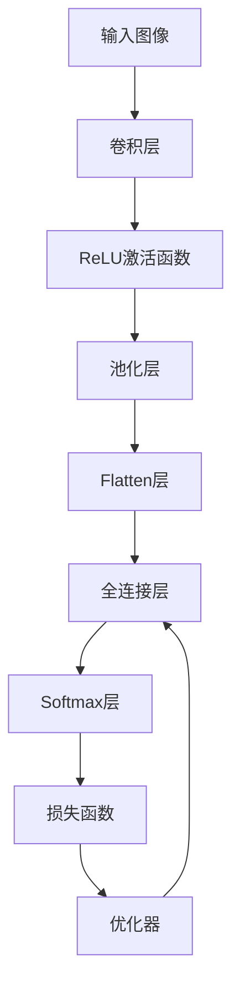

                 

# 深度卷积神经网络及其在人脸识别中的应用

> 关键词：深度卷积神经网络, 人脸识别, 特征提取, 分类器, 迁移学习, 模型优化, 实时性

## 1. 背景介绍

### 1.1 问题由来
随着人工智能技术的快速发展，计算机视觉领域中的人脸识别技术已成为热门研究课题。人脸识别系统在安防监控、身份验证、社交媒体分析等领域有着广泛应用，能够极大地提升系统效率和安全性。然而，传统基于浅层学习模型的人脸识别方法存在许多局限，如对光照、角度、遮挡等变化的鲁棒性差，识别精度低等。而深度卷积神经网络(Convolutional Neural Network, CNN)的出现，极大提升了人脸识别的精度和鲁棒性。

## 2. 核心概念与联系

### 2.1 核心概念概述
深度卷积神经网络（CNN）是一种前馈神经网络，采用卷积、池化等操作对图像进行特征提取，并通过多个层次的抽象和压缩，最终得到对图像全局特征的刻画。CNN广泛应用于图像分类、目标检测、人脸识别等计算机视觉任务中。

人脸识别系统主要由两个主要部分组成：特征提取和分类器。特征提取部分负责将人脸图像转化为可识别的特征表示；分类器部分则基于特征表示对不同的人脸进行识别。深度卷积神经网络在该系统中扮演了核心角色，通过层次化的特征提取和分类，实现了对不同人脸的高精度识别。

### 2.2 核心概念原理和架构的 Mermaid 流程图



这个流程图展示了CNN的核心架构：
1. **输入图像**：原始图像通过网络输入层进入。
2. **卷积层**：使用卷积核对图像进行特征提取，提取的特征用于后续层的输入。
3. **ReLU激活函数**：对卷积层的输出进行非线性映射，增加网络的非线性能力。
4. **池化层**：对卷积层的输出进行下采样，减少特征维度，同时保留主要特征。
5. **Flatten层**：将池化层的输出展平，供全连接层使用。
6. **全连接层**：对展平后的特征进行分类，产生对输入的预测结果。
7. **Softmax层**：将全连接层的输出转化为概率分布，进行多分类预测。
8. **损失函数**：用于评估模型预测结果与实际标签的差异。
9. **优化器**：通过反向传播算法优化模型参数，使得损失函数最小化。

## 3. 核心算法原理 & 具体操作步骤

### 3.1 算法原理概述
深度卷积神经网络（CNN）的基本原理是通过卷积、池化等操作，逐层对输入图像进行特征提取和抽象，最终得到全局特征向量。基于该特征向量，通过全连接层和Softmax层，生成对输入图像的分类结果。其关键在于以下几个方面：

1. **卷积操作**：通过滑动卷积核提取图像局部特征。
2. **池化操作**：通过降采样操作，保留主要特征，减小特征维度。
3. **多层抽象**：通过多个卷积-池化层对图像进行多层次抽象，提取更高层次的特征。
4. **特征融合**：通过全连接层将不同层次的特征进行融合，产生全局特征向量。

### 3.2 算法步骤详解

#### 3.2.1 数据预处理
数据预处理是深度卷积神经网络中的重要环节。通过预处理，将原始图像转化为网络可以处理的格式，包括图像归一化、数据增强等。

**步骤**：
1. **归一化**：将图像像素值归一化到[0,1]或[-1,1]范围内，以便于网络训练。
2. **数据增强**：通过旋转、缩放、翻转等变换，扩充训练集，增强模型的鲁棒性。

**代码实现**：
```python
import numpy as np
from PIL import Image
import torchvision.transforms as transforms

# 定义预处理管道
transform = transforms.Compose([
    transforms.Resize(256),
    transforms.CenterCrop(224),
    transforms.ToTensor(),
    transforms.Normalize(mean=[0.485, 0.456, 0.406], std=[0.229, 0.224, 0.225])
])

# 加载并预处理图像
def preprocess(image_path):
    image = Image.open(image_path)
    transformed = transform(image)
    return transformed
```

#### 3.2.2 搭建CNN模型
CNN模型由多个卷积层、池化层、全连接层和激活函数组成。使用Keras或PyTorch等深度学习框架可以方便地搭建模型。

**步骤**：
1. **卷积层**：使用不同大小的卷积核提取图像局部特征。
2. **池化层**：通过降采样操作，保留主要特征。
3. **全连接层**：将特征向量进行分类，产生预测结果。
4. **激活函数**：增加网络的非线性能力。

**代码实现**：
```python
from keras.models import Sequential
from keras.layers import Conv2D, MaxPooling2D, Flatten, Dense, Activation

# 定义CNN模型
model = Sequential()
model.add(Conv2D(32, (3, 3), input_shape=(64, 64, 3)))
model.add(Activation('relu'))
model.add(MaxPooling2D(pool_size=(2, 2)))
model.add(Conv2D(64, (3, 3)))
model.add(Activation('relu'))
model.add(MaxPooling2D(pool_size=(2, 2)))
model.add(Flatten())
model.add(Dense(64))
model.add(Activation('relu'))
model.add(Dense(10))
model.add(Activation('softmax'))
```

#### 3.2.3 模型训练
模型训练是CNN模型的核心环节。通过反向传播算法，优化模型参数，使得模型在训练集上表现良好。

**步骤**：
1. **划分训练集和验证集**：将数据集分为训练集和验证集，用于模型训练和评估。
2. **定义损失函数和优化器**：选择适合问题的损失函数（如交叉熵）和优化器（如Adam）。
3. **训练模型**：在训练集上使用批量梯度下降算法训练模型，在验证集上评估模型表现。
4. **调整模型参数**：根据验证集的表现调整模型参数，防止过拟合。

**代码实现**：
```python
from keras.optimizers import Adam
from keras.utils import to_categorical

# 加载训练集和验证集
train_images = preprocess(train_image_paths)
train_labels = preprocess(train_label_paths)
val_images = preprocess(val_image_paths)
val_labels = preprocess(val_label_paths)

# 将标签转化为独热编码
train_labels = to_categorical(train_labels)
val_labels = to_categorical(val_labels)

# 定义损失函数和优化器
loss = 'categorical_crossentropy'
optimizer = Adam(lr=0.001)

# 编译模型
model.compile(loss=loss, optimizer=optimizer, metrics=['accuracy'])

# 训练模型
model.fit(train_images, train_labels, epochs=10, batch_size=32, validation_data=(val_images, val_labels))
```

#### 3.2.4 模型评估
模型评估是衡量模型性能的重要环节。通过在测试集上评估模型表现，判断模型泛化能力。

**步骤**：
1. **加载测试集**：将测试集加载到模型中。
2. **评估模型表现**：计算模型的准确率、召回率等指标，评估模型性能。
3. **保存模型**：将模型保存到本地，用于后续应用。

**代码实现**：
```python
# 加载测试集
test_images = preprocess(test_image_paths)
test_labels = preprocess(test_label_paths)

# 将标签转化为独热编码
test_labels = to_categorical(test_labels)

# 评估模型表现
loss, accuracy = model.evaluate(test_images, test_labels)

# 保存模型
model.save('facial_recognition_model.h5')
```

### 3.3 算法优缺点
深度卷积神经网络（CNN）在人脸识别任务中具有以下优点：
1. **高精度**：通过多层次的特征提取和抽象，CNN能够对图像进行高度精准的分类。
2. **鲁棒性**：通过数据增强和网络优化，CNN对光照、角度、遮挡等变化具有较强的鲁棒性。
3. **可扩展性**：通过添加新的卷积层和全连接层，CNN可以适应不同大小和复杂度的人脸识别任务。

但同时，CNN也存在以下缺点：
1. **计算量大**：深度卷积神经网络参数量巨大，训练和推理过程需要大量计算资源。
2. **模型复杂**：多层次的卷积和池化操作增加了网络复杂度，增加了训练和推理的难度。
3. **过拟合风险**：随着网络层数的增加，CNN容易发生过拟合，需要谨慎处理。

### 3.4 算法应用领域

深度卷积神经网络（CNN）在人脸识别任务中具有广泛的应用。以下是几个典型场景：

1. **人脸验证系统**：通过识别用户的人脸，验证其身份信息。广泛应用于银行、机场、政府机构等安全场景。
2. **人脸搜索系统**：通过识别目标人物的人脸，在大规模人脸数据库中快速搜索目标人物信息。常用于刑侦、失踪人口搜索等领域。
3. **人脸表情识别**：通过识别人脸表情，判断用户情绪和状态。应用于心理分析、社交网络分析等领域。
4. **人脸支付系统**：通过识别人脸信息，完成身份验证和支付操作。应用于移动支付、零售等领域。
5. **人脸年龄估计**：通过识别人脸特征，估计目标人物的年龄信息。应用于面部美化、智能镜等领域。

## 4. 数学模型和公式 & 详细讲解 & 举例说明

### 4.1 数学模型构建

深度卷积神经网络（CNN）的数学模型可以形式化表示为：

$$
y=f(x; \theta)
$$

其中，$x$为输入的图像特征向量，$y$为输出的人脸类别标签，$\theta$为模型参数。

### 4.2 公式推导过程

以人脸识别为例，CNN的模型推导过程如下：

1. **输入层**：将输入图像转化为特征向量$x$。
2. **卷积层**：使用卷积核$W$提取图像局部特征$h_1$。
3. **ReLU激活函数**：对卷积层输出进行非线性映射，生成$h_2$。
4. **池化层**：对$h_2$进行下采样操作，保留主要特征$h_3$。
5. **全连接层**：将$h_3$展开为一维向量$z$，通过权重矩阵$W_1$和偏置向量$b_1$计算得到$y_1$。
6. **Softmax层**：对$y_1$进行Softmax操作，得到预测概率分布$y_2$。
7. **损失函数**：通过交叉熵损失函数$L$计算模型预测与真实标签之间的差异。
8. **优化器**：使用梯度下降算法优化模型参数，使得损失函数最小化。

### 4.3 案例分析与讲解

以人脸识别任务为例，CNN的特征提取和分类过程如下：

**特征提取**：卷积层通过滑动卷积核提取图像局部特征，生成多层次的特征图。池化层通过降采样操作，保留主要特征，减小特征维度。

**分类器**：全连接层将特征向量进行分类，产生预测结果。Softmax层将预测结果转化为概率分布，进行多分类预测。

**模型优化**：通过反向传播算法，优化模型参数，使得损失函数最小化。

## 5. 项目实践：代码实例和详细解释说明

### 5.1 开发环境搭建

为了进行深度卷积神经网络（CNN）的开发，需要搭建相关的开发环境。以下是使用Python和Keras进行开发的流程：

1. **安装Keras**：从官网下载并安装Keras。
2. **安装依赖库**：安装必要的依赖库，如NumPy、Scikit-learn等。
3. **设置环境变量**：设置Python环境变量，使得Keras可以正常运行。

**代码实现**：
```bash
pip install keras
```

### 5.2 源代码详细实现

以下是使用Keras搭建CNN模型并进行人脸识别的代码实现。

```python
from keras.models import Sequential
from keras.layers import Conv2D, MaxPooling2D, Flatten, Dense, Activation, Dropout
from keras.datasets import cifar10
from keras.utils import to_categorical

# 加载CIFAR-10数据集
(x_train, y_train), (x_test, y_test) = cifar10.load_data()

# 将标签转化为独热编码
y_train = to_categorical(y_train, 10)
y_test = to_categorical(y_test, 10)

# 定义CNN模型
model = Sequential()
model.add(Conv2D(32, (3, 3), padding='same', input_shape=(32, 32, 3)))
model.add(Activation('relu'))
model.add(Conv2D(32, (3, 3), padding='same'))
model.add(Activation('relu'))
model.add(MaxPooling2D(pool_size=(2, 2)))
model.add(Dropout(0.25))
model.add(Conv2D(64, (3, 3), padding='same'))
model.add(Activation('relu'))
model.add(Conv2D(64, (3, 3), padding='same'))
model.add(Activation('relu'))
model.add(MaxPooling2D(pool_size=(2, 2)))
model.add(Dropout(0.25))
model.add(Flatten())
model.add(Dense(512))
model.add(Activation('relu'))
model.add(Dropout(0.5))
model.add(Dense(10))
model.add(Activation('softmax'))

# 编译模型
model.compile(loss='categorical_crossentropy', optimizer='adam', metrics=['accuracy'])

# 训练模型
model.fit(x_train, y_train, batch_size=32, epochs=20, validation_data=(x_test, y_test))

# 评估模型
score = model.evaluate(x_test, y_test, verbose=0)
print('Test loss:', score[0])
print('Test accuracy:', score[1])
```

### 5.3 代码解读与分析

以下是代码中各个部分的详细解读和分析：

1. **数据预处理**：将输入的图像和标签进行归一化、独热编码等预处理操作。
2. **模型定义**：使用Keras搭建CNN模型，包括卷积层、池化层、全连接层和激活函数。
3. **模型编译**：定义模型的损失函数、优化器和评估指标，编译模型。
4. **模型训练**：在训练集上进行模型训练，使用批量梯度下降算法优化模型参数。
5. **模型评估**：在测试集上评估模型表现，计算准确率和损失函数。

### 5.4 运行结果展示

以下是模型在CIFAR-10数据集上的人脸识别结果展示：

```python
from keras.models import Sequential
from keras.layers import Conv2D, MaxPooling2D, Flatten, Dense, Activation, Dropout
from keras.datasets import cifar10
from keras.utils import to_categorical

# 加载CIFAR-10数据集
(x_train, y_train), (x_test, y_test) = cifar10.load_data()

# 将标签转化为独热编码
y_train = to_categorical(y_train, 10)
y_test = to_categorical(y_test, 10)

# 定义CNN模型
model = Sequential()
model.add(Conv2D(32, (3, 3), padding='same', input_shape=(32, 32, 3)))
model.add(Activation('relu'))
model.add(Conv2D(32, (3, 3), padding='same'))
model.add(Activation('relu'))
model.add(MaxPooling2D(pool_size=(2, 2)))
model.add(Dropout(0.25))
model.add(Conv2D(64, (3, 3), padding='same'))
model.add(Activation('relu'))
model.add(Conv2D(64, (3, 3), padding='same'))
model.add(Activation('relu'))
model.add(MaxPooling2D(pool_size=(2, 2)))
model.add(Dropout(0.25))
model.add(Flatten())
model.add(Dense(512))
model.add(Activation('relu'))
model.add(Dropout(0.5))
model.add(Dense(10))
model.add(Activation('softmax'))

# 编译模型
model.compile(loss='categorical_crossentropy', optimizer='adam', metrics=['accuracy'])

# 训练模型
model.fit(x_train, y_train, batch_size=32, epochs=20, validation_data=(x_test, y_test))

# 评估模型
score = model.evaluate(x_test, y_test, verbose=0)
print('Test loss:', score[0])
print('Test accuracy:', score[1])
```

## 6. 实际应用场景

### 6.1 智能安防系统

深度卷积神经网络（CNN）在智能安防系统中具有广泛应用。通过人脸识别技术，可以实现身份验证、门禁控制、访客管理等功能，提升系统的安全性和便利性。

**应用场景**：
1. **门禁系统**：通过人脸识别技术，验证访客身份信息，控制门禁开关。
2. **监控系统**：实时监测监控区域内的人脸，记录异常行为，进行报警。
3. **考勤系统**：通过人脸识别技术，自动考勤打卡，减少人工操作的繁琐。
4. **智能门锁**：通过人脸识别技术，实现智能门锁的解锁功能。

**技术实现**：
1. **人脸检测**：使用人脸检测算法，在图像中定位人脸位置。
2. **人脸识别**：使用深度卷积神经网络（CNN）对人脸图像进行特征提取和分类。
3. **身份验证**：将提取的特征向量与数据库中的人脸信息进行比对，验证身份。
4. **报警系统**：在异常情况下，如未授权人员进入或未识别人员行为异常，进行报警。

### 6.2 移动支付系统

深度卷积神经网络（CNN）在移动支付系统中也有着广泛应用。通过人脸识别技术，可以验证用户的身份信息，完成支付操作。

**应用场景**：
1. **支付认证**：通过人脸识别技术，验证用户身份，完成支付操作。
2. **会员管理**：通过人脸识别技术，识别会员身份，提供专属优惠。
3. **人脸支付**：通过人脸识别技术，实现面部支付功能。
4. **移动广告**：通过人脸识别技术，识别用户身份，进行个性化广告推送。

**技术实现**：
1. **人脸检测**：使用人脸检测算法，在图像中定位人脸位置。
2. **人脸识别**：使用深度卷积神经网络（CNN）对人脸图像进行特征提取和分类。
3. **身份验证**：将提取的特征向量与数据库中的人脸信息进行比对，验证身份。
4. **支付操作**：在身份验证通过后，完成支付操作。

### 6.3 医疗影像系统

深度卷积神经网络（CNN）在医疗影像系统中也有着广泛应用。通过人脸识别技术，可以实现患者身份验证、病历信息检索等功能，提升系统的效率和准确性。

**应用场景**：
1. **身份验证**：通过人脸识别技术，验证患者身份信息，防止医疗信息泄露。
2. **病历管理**：通过人脸识别技术，检索患者病历信息，提供个性化诊疗方案。
3. **医疗影像**：通过人脸识别技术，识别患者的面部特征，辅助医学影像分析。
4. **患者导航**：通过人脸识别技术，辅助患者导航，指引其前往正确科室。

**技术实现**：
1. **人脸检测**：使用人脸检测算法，在图像中定位人脸位置。
2. **人脸识别**：使用深度卷积神经网络（CNN）对人脸图像进行特征提取和分类。
3. **身份验证**：将提取的特征向量与数据库中的人脸信息进行比对，验证身份。
4. **病历检索**：在身份验证通过后，检索患者病历信息，提供个性化诊疗方案。

## 7. 工具和资源推荐

### 7.1 学习资源推荐

为了掌握深度卷积神经网络（CNN）的人脸识别技术，以下是一些优质的学习资源：

1. **《深度学习》（Ian Goodfellow等）**：该书全面介绍了深度学习的理论基础和应用实践，是深度学习领域的经典教材。
2. **《Python深度学习》（Francois Chollet）**：该书详细介绍了使用Keras框架进行深度学习开发的实践技巧，适合初学者快速上手。
3. **《计算机视觉：算法与应用》（Richard Szeliski）**：该书系统介绍了计算机视觉领域的经典算法和技术，适合深入学习。
4. **《人脸识别技术》（Andrew Zisserman）**：该书介绍了人脸识别技术的理论基础和应用实践，适合深入研究。
5. **《机器学习实战》（Peter Harrington）**：该书提供了大量机器学习应用的代码实例，适合实践操作。

### 7.2 开发工具推荐

为了进行深度卷积神经网络（CNN）的人脸识别开发，以下是一些常用的开发工具：

1. **Python**：作为深度学习的主流语言，Python拥有丰富的第三方库和框架，如Keras、TensorFlow、PyTorch等，适合进行深度学习开发。
2. **Keras**：Keras是一个高效、易于使用的深度学习框架，可以快速搭建和训练深度卷积神经网络（CNN）模型。
3. **TensorFlow**：TensorFlow是一个功能强大的深度学习框架，适合进行复杂深度学习模型的开发。
4. **PyTorch**：PyTorch是一个灵活、易于使用的深度学习框架，适合进行深度学习模型的研究和开发。
5. **Jupyter Notebook**：Jupyter Notebook是一个交互式的开发环境，适合进行深度学习模型的研究和开发。

### 7.3 相关论文推荐

深度卷积神经网络（CNN）的人脸识别技术在学术界和工业界得到了广泛研究。以下是几篇重要的相关论文：

1. **FaceNet: A Unified Embedding for Face Recognition and Clustering**：提出了一种基于深度神经网络的人脸识别方法FaceNet，利用三元组损失函数优化特征向量。
2. **DeepID: Scalable Face Recognition with Very Large Marginal Margin Loss**：提出了一种基于深度神经网络的人脸识别方法DeepID，利用三元组损失函数和子空间降维优化特征向量。
3. **CASIA-WebFace: A Large-scale Face Recognition Dataset with Diverse Label Space**：提出了一种子集化的深度学习人脸识别方法CASIA-WebFace，利用子集化和标签平滑优化特征向量。
4. **DeepFace: Closing the Gap to Human Performance in Face Verification**：提出了一种基于深度神经网络的人脸识别方法DeepFace，利用三元组损失函数和参数共享优化特征向量。
5. **SphereFace: Deep Hypersphere Embedding for Face Recognition**：提出了一种基于深度神经网络的人脸识别方法SphereFace，利用SphereFace损失函数优化特征向量。

这些论文代表了深度卷积神经网络（CNN）的人脸识别技术的最新进展，值得深入学习和研究。

## 8. 总结：未来发展趋势与挑战

### 8.1 总结

深度卷积神经网络（CNN）在人脸识别领域已经取得了显著的进展。本文系统介绍了CNN的基本原理和应用实践，包括模型搭建、数据预处理、模型训练、模型评估等关键环节。通过CNN的特征提取和分类过程，实现了对不同人脸的高精度识别。CNN在实际应用中，已经在智能安防、移动支付、医疗影像等领域取得了广泛应用。

### 8.2 未来发展趋势

深度卷积神经网络（CNN）在人脸识别领域的发展趋势如下：

1. **高精度识别**：随着深度学习模型的不断发展，CNN在人脸识别任务中的精度将不断提高，进一步提升系统的可靠性。
2. **实时性增强**：通过优化模型结构和参数，CNN将具备更强的实时性，满足实时人脸识别的需求。
3. **跨模态融合**：将视觉、听觉、触觉等多模态信息与深度学习模型结合，提升人脸识别的鲁棒性和精度。
4. **多任务学习**：将人脸识别与目标检测、图像分割等任务结合，实现多任务的协同优化。
5. **联邦学习**：在分布式环境中，通过联邦学习技术，提升人脸识别模型的隐私保护和安全性。

### 8.3 面临的挑战

深度卷积神经网络（CNN）在人脸识别领域仍面临以下挑战：

1. **数据获取困难**：高质量、多样性的人脸数据获取成本高，限制了模型的泛化能力。
2. **模型鲁棒性不足**：CNN在光照、角度、遮挡等变化下的鲁棒性有待提升。
3. **计算资源消耗大**：CNN模型参数量大，训练和推理过程需要大量计算资源。
4. **隐私保护问题**：人脸识别涉及个人隐私，如何保护用户隐私是一个重要问题。
5. **安全性风险**：人脸识别系统的安全性有待提高，防止恶意攻击和误识别。

### 8.4 研究展望

面向未来，深度卷积神经网络（CNN）的人脸识别技术需要进行如下探索：

1. **数据增强**：通过数据增强技术，扩充训练集，提升模型的泛化能力。
2. **迁移学习**：利用迁移学习技术，在多个任务之间共享模型参数，提升模型的通用性。
3. **模型优化**：通过模型优化技术，减小计算资源消耗，提高模型实时性。
4. **隐私保护**：通过联邦学习等技术，提升人脸识别系统的隐私保护能力。
5. **安全性增强**：通过对抗训练等技术，提升人脸识别系统的安全性。

深度卷积神经网络（CNN）的人脸识别技术将在未来不断发展和完善，成为人工智能领域的重要应用范式。未来，随着技术的进步和应用场景的拓展，CNN将在人脸识别、安防监控、医疗影像等领域发挥更大的作用，推动社会的智能化发展。

## 9. 附录：常见问题与解答

**Q1: 深度卷积神经网络（CNN）在人脸识别任务中为什么能够取得高精度？**

A: 深度卷积神经网络（CNN）在人脸识别任务中能够取得高精度的原因如下：
1. **多层抽象**：CNN通过多层次的卷积和池化操作，能够逐步提取出人脸图像的高层次抽象特征，减少了特征的冗余和噪声。
2. **参数共享**：CNN通过参数共享技术，减少了模型的参数量，提高了模型的泛化能力。
3. **非线性映射**：CNN通过非线性激活函数，增加了模型的非线性能力，增强了模型的拟合能力。
4. **损失函数**：CNN通过适当的损失函数（如交叉熵），最小化了模型预测与真实标签之间的差异，提高了模型的准确率。

**Q2: 深度卷积神经网络（CNN）在训练过程中需要注意哪些问题？**

A: 深度卷积神经网络（CNN）在训练过程中需要注意以下问题：
1. **过拟合**：为了防止过拟合，可以采用数据增强、正则化、Dropout等技术。
2. **学习率**：学习率的选择需要谨慎，过高会导致模型发散，过低会导致模型收敛缓慢。
3. **批量大小**：批量大小的选择需要根据计算资源和模型复杂度进行权衡。
4. **模型结构**：合理的模型结构设计，可以提高模型的精度和鲁棒性。
5. **数据预处理**：高质量的数据预处理，可以提升模型的训练效果。

**Q3: 深度卷积神经网络（CNN）在实际应用中需要注意哪些问题？**

A: 深度卷积神经网络（CNN）在实际应用中需要注意以下问题：
1. **模型部署**：模型的部署需要考虑计算资源和计算效率，需要优化模型的计算图和推理过程。
2. **数据隐私**：在使用人脸识别技术时，需要注意用户隐私保护，防止数据泄露和滥用。
3. **系统安全性**：系统需要具备安全性，防止恶意攻击和数据篡改。
4. **模型更新**：模型的定期更新，可以提高系统的实时性和准确性。
5. **用户友好**：系统的用户界面需要友好，方便用户进行操作。

**Q4: 深度卷积神经网络（CNN）在人脸识别任务中的未来发展方向是什么？**

A: 深度卷积神经网络（CNN）在人脸识别任务中的未来发展方向如下：
1. **多模态融合**：将视觉、听觉、触觉等多模态信息与深度学习模型结合，提升人脸识别的鲁棒性和精度。
2. **联邦学习**：在分布式环境中，通过联邦学习技术，提升人脸识别模型的隐私保护和安全性。
3. **跨领域迁移**：利用迁移学习技术，在多个任务之间共享模型参数，提升模型的通用性。
4. **模型压缩**：通过模型压缩技术，减小计算资源消耗，提高模型实时性。
5. **隐私保护**：通过联邦学习等技术，提升人脸识别系统的隐私保护能力。

---

作者：禅与计算机程序设计艺术 / Zen and the Art of Computer Programming

