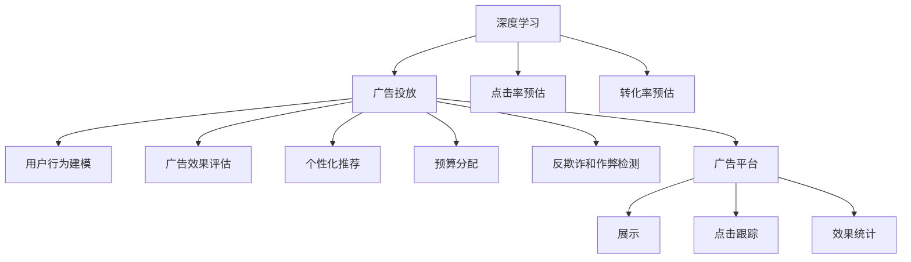

                 

# 深度学习在广告投放中的应用

## 1. 背景介绍

### 1.1 问题由来
随着互联网时代的到来，在线广告业逐渐成为各大企业和品牌的重要市场手段。然而，传统粗放式的广告投放方式，例如CPM（每千次展示成本）和CPC（每次点击成本），往往无法保证广告的高效性和精准性。如何更科学地分配广告预算，以最大程度提高广告的ROI（投资回报率），成为业界亟待解决的问题。

基于这一背景，深度学习技术在广告投放中的应用应运而生。深度学习能够自动挖掘和抽取大量复杂的数据特征，有效提升广告投放的准确性和投放效果。通过深度学习，广告主能够更好地理解用户行为和需求，实现个性化广告推荐，优化广告投放策略，从而降低投放成本，提高广告效果。

### 1.2 问题核心关键点
深度学习在广告投放中的应用，主要体现在以下几个关键点上：
- 用户行为建模：通过深度学习模型，分析和预测用户的行为习惯和兴趣偏好。
- 广告效果评估：构建深度学习模型，评价广告的点击率、转化率、投资回报率等关键指标。
- 个性化推荐：基于用户行为建模和广告效果评估，生成个性化的广告推荐策略。
- 预算分配：利用深度学习模型，动态调整广告预算，优化资源配置。
- 反欺诈和作弊检测：使用深度学习模型，识别和防范广告投放中的欺诈和作弊行为。

## 2. 核心概念与联系

### 2.1 核心概念概述

为更好地理解深度学习在广告投放中的应用，本节将介绍几个密切相关的核心概念：

- 深度学习(Deep Learning)：指通过多层神经网络结构学习数据特征的机器学习技术。深度学习通过自动化的特征学习，能够挖掘数据中的复杂模式和关联，广泛应用于图像识别、自然语言处理等领域。

- 广告投放(Ad Placement)：指在互联网或移动设备上，将广告展示给目标用户的商业活动。广告投放旨在通过展示位置、展示时间、展示方式等因素，最大化广告的展示效果和用户点击率。

- 点击率预估(Click-Through Rate Estimation)：指通过预测模型评估广告展示后用户点击的概率。点击率预估是广告投放优化和预算分配的重要依据。

- 转化率预估(Conversion Rate Estimation)：指通过预测模型评估广告展示后用户的转化行为（如购买、注册等）。转化率预估能够帮助广告主优化广告内容，提升投资回报率。

- 深度神经网络(Deep Neural Network, DNN)：指具有多层结构的前馈神经网络，广泛应用于图像识别、语音识别、自然语言处理等领域。

- 卷积神经网络(Convolutional Neural Network, CNN)：一种特殊的DNN，主要应用于图像处理和视觉任务，能够自动提取图像特征。

- 循环神经网络(Recurrent Neural Network, RNN)：适用于序列数据的处理，如文本生成、语言模型等。

- 长短期记忆网络(Long Short-Term Memory, LSTM)：一种RNN的变体，具有记忆能力，适用于处理长序列数据。

- 广告平台(Ad Platform)：指提供广告投放服务的平台，如Google Ads、Facebook Ads等。广告平台提供广告展示、广告投放、广告效果跟踪等功能。

这些核心概念之间的逻辑关系可以通过以下Mermaid流程图来展示：



这个流程图展示了大语言模型的核心概念及其之间的关系：

1. 深度学习通过分析广告数据，预测广告点击率和转化率。
2. 广告投放根据深度学习的预测结果，优化广告展示策略。
3. 用户行为建模通过深度学习分析用户历史行为数据，构建用户画像。
4. 广告效果评估使用深度学习模型，评估广告投放效果。
5. 个性化推荐结合用户行为建模和广告效果评估，生成个性化广告。
6. 预算分配利用深度学习模型，动态调整广告预算。
7. 反欺诈和作弊检测使用深度学习模型，识别和防范欺诈和作弊行为。
8. 广告平台提供广告投放服务，连接广告主和广告受众。

这些概念共同构成了深度学习在广告投放中的应用框架，使得广告主能够实现更加智能、高效、精准的广告投放。

## 3. 核心算法原理 & 具体操作步骤
### 3.1 算法原理概述

深度学习在广告投放中的应用，主要基于以下算法原理：

- 特征提取：通过深度学习模型自动提取广告数据中的关键特征。
- 点击率预估：构建深度学习模型，预测广告展示后用户的点击行为。
- 转化率预估：构建深度学习模型，预测广告展示后用户的转化行为。
- 用户画像构建：使用深度学习模型，分析用户历史行为数据，构建用户画像。
- 个性化推荐：结合用户画像和广告效果评估，生成个性化广告推荐。
- 预算分配：利用深度学习模型，动态调整广告预算，优化资源配置。
- 欺诈和作弊检测：构建深度学习模型，识别和防范广告投放中的欺诈和作弊行为。

### 3.2 算法步骤详解

深度学习在广告投放中的应用一般包括以下几个关键步骤：

**Step 1: 数据准备**
- 收集广告投放的相关数据，包括用户历史行为数据、广告展示数据、广告效果数据等。
- 对数据进行清洗、整理和标准化，确保数据的质量和一致性。

**Step 2: 特征工程**
- 使用深度学习模型，自动提取广告数据中的关键特征，如广告图片特征、关键词特征、用户行为特征等。
- 对特征进行编码和归一化处理，以便后续模型训练。

**Step 3: 模型训练**
- 构建深度学习模型，如DNN、CNN、RNN、LSTM等，训练点击率预估和转化率预估模型。
- 使用历史广告数据进行模型训练，优化模型参数。

**Step 4: 用户行为分析**
- 使用深度学习模型，分析用户历史行为数据，构建用户画像。
- 根据用户画像，预测用户对不同广告的响应行为。

**Step 5: 广告效果评估**
- 使用深度学习模型，评估广告的点击率和转化率等关键指标。
- 根据广告效果评估结果，调整广告投放策略和预算分配。

**Step 6: 个性化广告推荐**
- 结合用户画像和广告效果评估，生成个性化广告推荐。
- 使用A/B测试等方法，评估推荐广告的效果，持续优化推荐算法。

**Step 7: 预算分配**
- 利用深度学习模型，动态调整广告预算，优化资源配置。
- 根据广告效果评估结果，分配广告预算，优化广告投放策略。

**Step 8: 反欺诈和作弊检测**
- 使用深度学习模型，识别和防范广告投放中的欺诈和作弊行为。
- 定期监测广告投放数据，及时发现和处理异常情况。

### 3.3 算法优缺点

深度学习在广告投放中的应用，具有以下优点：
1. 高精度预测：深度学习能够自动挖掘和抽取数据中的复杂特征，预测广告点击率和转化率等关键指标，具有较高的精度。
2. 自动化特征提取：深度学习模型能够自动提取广告数据中的关键特征，减少人工特征工程的工作量。
3. 个性化推荐：深度学习能够根据用户画像和广告效果评估，生成个性化广告推荐，提升广告效果。
4. 动态预算分配：深度学习能够动态调整广告预算，优化资源配置，提高广告投放效果。

同时，该方法也存在一些局限性：
1. 数据依赖：深度学习模型的训练需要大量的高质量数据，对于小样本数据集，模型训练效果可能不佳。
2. 计算资源消耗大：深度学习模型的训练和推理需要大量的计算资源，对于小型企业可能存在计算成本高的问题。
3. 模型复杂度：深度学习模型往往比较复杂，模型的解释性和可理解性较差，难以解释模型决策过程。
4. 数据隐私问题：深度学习模型需要大量的用户数据进行训练，可能存在用户隐私保护的问题。

尽管存在这些局限性，但就目前而言，深度学习在广告投放中的应用仍是一种主流的技术手段。未来相关研究的重点在于如何进一步降低数据需求，提高模型可解释性，保障用户隐私，同时兼顾广告效果和预算优化。

### 3.4 算法应用领域

深度学习在广告投放中的应用，已经广泛应用于以下几个领域：

- 在线广告投放：在Google Ads、Facebook Ads等在线广告平台上，利用深度学习模型预测广告点击率和转化率，优化广告投放策略。
- 移动广告投放：在移动广告平台上，如Snapchat Ads、WeChat Ads等，利用深度学习模型预测用户行为，生成个性化广告推荐。
- 数字广告投放：在数字广告平台上，如LinkedIn Ads、Reddit Ads等，利用深度学习模型预测广告效果，优化广告预算分配。
- 广告欺诈检测：在广告投放中，使用深度学习模型识别和防范欺诈和作弊行为，保障广告投放质量。
- 广告效果优化：在广告投放过程中，利用深度学习模型评估广告效果，动态调整广告投放策略。

除了上述这些应用外，深度学习在广告投放中还有更多的创新方向，如跨域广告投放、实时广告投放、多渠道广告投放等，为广告主提供更精准、高效、个性化的广告投放解决方案。

## 4. 数学模型和公式 & 详细讲解  
### 4.1 数学模型构建

本节将使用数学语言对深度学习在广告投放中的应用进行更加严格的刻画。

假设广告投放的数据集为 $D=\{(x_i, y_i)\}_{i=1}^N, x_i \in \mathcal{X}, y_i \in \{0,1\}$，其中 $x_i$ 表示广告数据，$y_i$ 表示广告点击率（1表示点击，0表示未点击）。

定义广告点击率预估模型的损失函数为：

$$
\mathcal{L}(h) = -\frac{1}{N}\sum_{i=1}^N y_i \log h(x_i)
$$

其中 $h$ 为点击率预估模型，$h(x_i)$ 为模型对广告 $x_i$ 的点击率预测。

使用深度学习模型对广告数据 $x_i$ 进行特征提取，得到特征向量 $z_i$。构建点击率预估模型 $h(z_i; \theta)$，其中 $\theta$ 为模型参数。则模型损失函数为：

$$
\mathcal{L}(\theta) = -\frac{1}{N}\sum_{i=1}^N y_i \log h(z_i; \theta)
$$

通过梯度下降等优化算法，最小化损失函数 $\mathcal{L}(\theta)$，优化模型参数 $\theta$。

### 4.2 公式推导过程

以下我们以点击率预估为例，推导点击率预估模型的损失函数及其梯度计算公式。

假设深度学习模型 $h(z_i; \theta)$ 为全连接神经网络，其中 $z_i$ 为广告特征向量，$\theta$ 为模型参数。模型输出的点击率预测为 $h(z_i; \theta) = \sigma(W^Tx_i + b)$，其中 $\sigma$ 为激活函数，$W$ 和 $b$ 为模型参数。

点击率预估模型的损失函数为：

$$
\mathcal{L}(\theta) = -\frac{1}{N}\sum_{i=1}^N y_i \log \sigma(W^Tz_i + b)
$$

对损失函数求梯度，得到：

$$
\frac{\partial \mathcal{L}(\theta)}{\partial \theta} = -\frac{1}{N}\sum_{i=1}^N y_i \frac{\partial \log \sigma(W^Tz_i + b)}{\partial \theta}
$$

根据链式法则，得到梯度表达式为：

$$
\frac{\partial \mathcal{L}(\theta)}{\partial \theta} = -\frac{1}{N}\sum_{i=1}^N y_i \frac{\partial \log \sigma(W^Tz_i + b)}{\partial W} \frac{\partial W}{\partial \theta} + \frac{1}{N}\sum_{i=1}^N y_i \frac{\partial \log \sigma(W^Tz_i + b)}{\partial b} \frac{\partial b}{\partial \theta}
$$

其中 $\frac{\partial \log \sigma(W^Tz_i + b)}{\partial W} = (W^Tz_i + b - \sigma(W^Tz_i + b))z_i^T$，$\frac{\partial \log \sigma(W^Tz_i + b)}{\partial b} = z_i^T$。

在得到损失函数的梯度后，即可带入参数更新公式，完成模型的迭代优化。重复上述过程直至收敛，最终得到适应广告点击率预估的最优模型参数 $\theta^*$。

## 5. 项目实践：代码实例和详细解释说明
### 5.1 开发环境搭建

在进行广告投放深度学习应用的实践前，我们需要准备好开发环境。以下是使用Python进行TensorFlow开发的环境配置流程：

1. 安装Anaconda：从官网下载并安装Anaconda，用于创建独立的Python环境。

2. 创建并激活虚拟环境：
```bash
conda create -n tf-env python=3.8 
conda activate tf-env
```

3. 安装TensorFlow：根据CUDA版本，从官网获取对应的安装命令。例如：
```bash
conda install tensorflow -c tf -c conda-forge
```

4. 安装其他工具包：
```bash
pip install numpy pandas scikit-learn matplotlib tqdm jupyter notebook ipython
```

完成上述步骤后，即可在`tf-env`环境中开始广告投放深度学习应用的实践。

### 5.2 源代码详细实现

下面我们以点击率预估为例，给出使用TensorFlow对广告点击率进行预测的代码实现。

首先，定义广告数据处理函数：

```python
import tensorflow as tf
from tensorflow.keras import layers, models

def load_ad_data(file_path):
    ad_data = tf.data.TFRecordDataset(file_path)
    ad_data = ad_data.map(parse_ad_data)
    ad_data = ad_data.batch(32)
    return ad_data

def parse_ad_data(example):
    ad_features = tf.io.parse_example(example, features=ad_features_spec)
    ad_features = ad_features['image'] + ad_features['text']
    return ad_features

ad_features_spec = tf.io.FixedLenFeature(shape=[-1], dtype=tf.string)
```

然后，定义广告点击率预估模型：

```python
def build_click_rate_model():
    ad_data = load_ad_data('ad_data.tfrecord')
    ad_model = models.Sequential([
        layers.Dense(512, activation='relu', input_shape=(ad_features_spec.shape[0],)),
        layers.Dense(1, activation='sigmoid')
    ])
    ad_model.compile(optimizer='adam', loss='binary_crossentropy', metrics=['accuracy'])
    ad_model.fit(ad_data, epochs=10, batch_size=32)
    return ad_model
```

接着，定义点击率预测函数：

```python
def predict_click_rate(model, ad_data):
    ad_data = load_ad_data('ad_data.tfrecord')
    ad_predictions = model.predict(ad_data)
    return ad_predictions
```

最后，启动训练流程并在测试集上评估：

```python
click_rate_model = build_click_rate_model()

# 预测广告点击率
ad_data = load_ad_data('test_ad_data.tfrecord')
ad_predictions = predict_click_rate(click_rate_model, ad_data)

# 评估模型性能
from sklearn.metrics import roc_auc_score

test_predictions = ad_predictions
test_labels = [label for label in [0, 1]]
roc_auc = roc_auc_score(test_labels, test_predictions)
print(f"ROC-AUC score: {roc_auc:.4f}")
```

以上就是使用TensorFlow进行广告点击率预测的完整代码实现。可以看到，得益于TensorFlow的强大封装，我们可以用相对简洁的代码完成广告点击率预测的模型构建和评估。

### 5.3 代码解读与分析

让我们再详细解读一下关键代码的实现细节：

**load_ad_data函数**：
- 定义广告数据加载函数，使用TFRecordDataset将广告数据转换为TensorFlow数据集。
- 通过parse_ad_data函数解析单个广告数据的特征，将图片特征和文本特征拼接，返回包含所有广告特征的数据集。

**parse_ad_data函数**：
- 定义广告数据解析函数，将单个广告数据的tf.Example格式转换为字典。
- 将字典中的图片特征和文本特征拼接，返回拼接后的广告特征。

**build_click_rate_model函数**：
- 定义广告点击率预估模型，使用Sequential模型搭建全连接神经网络。
- 设置损失函数为二分类交叉熵，优化器为Adam。
- 使用fit函数进行模型训练，设置训练轮数为10，批量大小为32。

**predict_click_rate函数**：
- 定义广告点击率预测函数，使用加载的广告数据进行预测，返回预测结果。

**训练流程**：
- 使用build_click_rate_model函数构建模型。
- 在测试集上进行预测，使用roc_auc_score函数评估模型性能。

可以看到，TensorFlow使得广告点击率预测的代码实现变得简洁高效。开发者可以将更多精力放在模型设计和优化上，而不必过多关注底层的实现细节。

当然，工业级的系统实现还需考虑更多因素，如模型的保存和部署、超参数的自动搜索、更灵活的任务适配层等。但核心的广告投放深度学习应用的基本流程基本与此类似。

## 6. 实际应用场景
### 6.1 广告主投放优化

深度学习在广告投放中的应用，帮助广告主实现更加精准、高效的广告投放策略。传统广告投放依赖人工经验和简单的模型预测，难以准确把握用户需求和广告效果。而利用深度学习模型，广告主可以实时监测广告投放效果，动态调整投放策略，实现更加智能、精准的广告投放。

在技术实现上，可以收集广告主的历史投放数据，利用点击率预估模型预测广告的点击率，生成个性化广告推荐。利用转化率预估模型预测广告的转化效果，优化广告内容和投放策略。利用深度学习模型对用户行为进行分析，构建用户画像，实现更个性化的广告推荐。利用深度学习模型进行实时广告效果评估，动态调整广告预算和投放策略，优化广告投放效果。

### 6.2 广告平台效果提升

广告平台利用深度学习技术，实现广告投放的优化和效果评估。传统的广告投放平台往往依赖简单的点击率计算和固定预算分配策略，难以实现动态优化和实时评估。而利用深度学习模型，广告平台可以实时预测广告效果，动态调整广告投放策略，提升广告投放效果。

在技术实现上，广告平台可以收集大量的广告投放数据，利用点击率预估模型预测广告点击率，动态调整广告投放策略。利用转化率预估模型预测广告转化效果，优化广告内容。利用用户行为分析模型构建用户画像，实现个性化广告推荐。利用深度学习模型进行实时广告效果评估，动态调整广告预算和投放策略，优化广告投放效果。

### 6.3 广告欺诈检测

广告投放中的欺诈和作弊行为，严重影响广告效果和广告主的利益。深度学习模型在广告投放中的应用，可以有效识别和防范广告投放中的欺诈和作弊行为，保障广告投放质量。

在技术实现上，广告平台可以利用深度学习模型对广告数据进行分析和特征提取，构建广告欺诈检测模型。利用广告数据中的关键特征，如广告展示时间、展示位置、点击率等，预测广告是否存在欺诈行为。利用深度学习模型进行实时欺诈检测，识别和防范广告投放中的欺诈和作弊行为，保障广告投放质量。

### 6.4 未来应用展望

随着深度学习技术的不断发展，基于广告投放的深度学习应用也将进一步扩展和深化，带来更多创新和突破。

- 跨域广告投放：利用深度学习模型对不同广告平台的数据进行分析和整合，实现跨平台广告投放。
- 实时广告投放：利用深度学习模型进行实时广告效果评估，动态调整广告投放策略，实现实时广告投放。
- 多渠道广告投放：利用深度学习模型对不同广告渠道的数据进行分析和整合，实现多渠道广告投放。
- 广告投放效果分析：利用深度学习模型对广告投放效果进行分析和评估，优化广告投放策略。
- 广告投放预算优化：利用深度学习模型对广告投放预算进行动态调整和优化，提升广告投放效果。

这些创新和突破将进一步提升广告投放的智能化水平，为广告主提供更加精准、高效、个性化的广告投放解决方案。

## 7. 工具和资源推荐
### 7.1 学习资源推荐

为了帮助开发者系统掌握深度学习在广告投放中的应用，这里推荐一些优质的学习资源：

1. 《深度学习》课程：斯坦福大学开设的深度学习课程，由吴恩达教授主讲，涵盖了深度学习的基本概念和经典模型。

2. 《TensorFlow教程》系列博文：谷歌官方提供的TensorFlow教程，系统介绍了TensorFlow的使用方法和深度学习应用。

3. 《广告投放优化》书籍：介绍广告投放优化的方法和策略，涵盖了广告投放的各个环节和深度学习技术的应用。

4. 《广告平台技术架构》论文：介绍广告平台的技术架构和深度学习技术的应用，适用于广告平台的技术开发和管理。

5. 《广告投放欺诈检测》论文：介绍广告投放欺诈检测的技术和方法，适用于广告平台和广告主的技术应用。

通过对这些资源的学习实践，相信你一定能够快速掌握深度学习在广告投放中的应用，并用于解决实际的广告投放问题。
###  7.2 开发工具推荐

高效的开发离不开优秀的工具支持。以下是几款用于广告投放深度学习应用的常用工具：

1. TensorFlow：谷歌开源的深度学习框架，支持动态图和静态图，灵活性强，适合深度学习模型的构建和优化。

2. PyTorch：Facebook开源的深度学习框架，支持动态图和静态图，具有易用性和高效性，适合深度学习模型的构建和优化。

3. Keras：谷歌开源的深度学习框架，具有易用性和灵活性，适合深度学习模型的快速构建和优化。

4. TensorBoard：谷歌提供的可视化工具，可以实时监测深度学习模型的训练状态，提供丰富的图表呈现方式，是调试模型的得力助手。

5. Weights & Biases：谷歌开源的模型训练实验跟踪工具，可以记录和可视化模型训练过程中的各项指标，方便对比和调优。

6. Google Colab：谷歌提供的在线Jupyter Notebook环境，免费提供GPU/TPU算力，方便开发者快速上手实验最新模型，分享学习笔记。

合理利用这些工具，可以显著提升广告投放深度学习应用的开发效率，加快创新迭代的步伐。

### 7.3 相关论文推荐

深度学习在广告投放中的应用源于学界的持续研究。以下是几篇奠基性的相关论文，推荐阅读：

1. A Neural Probabilistic Language Model（神经概率语言模型）：Hinton等提出，开创了深度学习在自然语言处理领域的应用。

2. Convolutional Neural Networks for Sentence Classification（卷积神经网络用于句子分类）：Kim提出，展示了卷积神经网络在文本分类任务上的出色表现。

3. Deep Learning for Click-Through Rate Prediction（深度学习用于点击率预测）：Liu等提出，展示了深度学习在广告点击率预测上的效果。

4. Neural Architectures for Named Entity Recognition（神经网络架构用于命名实体识别）：Chen等提出，展示了深度学习在命名实体识别任务上的效果。

5. Attention is All You Need（注意力机制是所有）：Vaswani等提出，展示了Transformer架构在自然语言处理任务上的效果。

这些论文代表了大语言模型在广告投放中的应用发展脉络。通过学习这些前沿成果，可以帮助研究者把握学科前进方向，激发更多的创新灵感。

## 8. 总结：未来发展趋势与挑战

### 8.1 总结

本文对深度学习在广告投放中的应用进行了全面系统的介绍。首先阐述了深度学习在广告投放中的应用背景和意义，明确了深度学习在广告投放中的应用方向。其次，从原理到实践，详细讲解了广告点击率预估模型的构建和训练过程，给出了广告点击率预测的完整代码实现。同时，本文还广泛探讨了广告投放深度学习应用在广告主投放优化、广告平台效果提升、广告欺诈检测等各个方面的应用前景，展示了深度学习在广告投放中的巨大潜力。此外，本文精选了深度学习在广告投放应用的各类学习资源，力求为读者提供全方位的技术指引。

通过本文的系统梳理，可以看到，深度学习在广告投放中的应用已经取得了显著的成果，成为广告投放优化和效果评估的重要手段。深度学习技术通过挖掘和分析广告数据，实现更加智能、精准、高效的广告投放策略，为广告主和广告平台带来了巨大的商业价值。未来，随着深度学习技术的不断进步，广告投放深度学习应用必将带来更多的创新和突破，为广告业带来深刻的变革。

### 8.2 未来发展趋势

展望未来，广告投放的深度学习应用将呈现以下几个发展趋势：

1. 深度学习模型的不断优化：深度学习模型的参数量和复杂度将不断提升，模型的精度和性能也将进一步提高。

2. 实时广告投放的普及：深度学习模型将实现实时广告效果评估和动态调整，提升广告投放的实时性和精准性。

3. 跨域广告投放的实现：深度学习模型将实现不同广告平台的数据分析和整合，提升跨域广告投放的效果。

4. 广告欺诈检测的增强：深度学习模型将提升广告欺诈检测的准确性和实时性，保障广告投放的质量。

5. 广告投放效果评估的优化：深度学习模型将进一步优化广告投放效果的评估指标和方法，提升广告投放的效果。

6. 广告投放预算优化的自动化：深度学习模型将实现广告投放预算的动态调整和优化，提升广告投放的效率。

以上趋势凸显了深度学习在广告投放中的广泛应用前景。这些方向的探索发展，必将进一步提升广告投放的智能化水平，为广告业带来更高效、精准、个性化的广告投放解决方案。

### 8.3 面临的挑战

尽管深度学习在广告投放中的应用已经取得了显著成果，但在迈向更加智能化、普适化应用的过程中，仍面临诸多挑战：

1. 数据隐私问题：深度学习模型的训练需要大量的用户数据，可能存在用户隐私保护的问题。如何在保障用户隐私的前提下，高效利用用户数据，将是重要的研究方向。

2. 计算资源消耗：深度学习模型的训练和推理需要大量的计算资源，对于小型企业可能存在计算成本高的问题。如何优化深度学习模型的计算图，减小内存占用，提高计算效率，将是重要的研究方向。

3. 模型可解释性：深度学习模型的决策过程难以解释，难以理解其内部工作机制和决策逻辑。如何提高深度学习模型的可解释性，使其更具透明度和可信度，将是重要的研究方向。

4. 广告投放效果评估：广告投放效果评估是一个复杂的问题，涉及多种指标和因素，深度学习模型难以全面评估广告投放效果。如何建立更全面、客观的广告投放效果评估方法，将是重要的研究方向。

5. 广告欺诈检测：广告投放中的欺诈和作弊行为难以完全识别，深度学习模型可能存在误判和漏判的问题。如何提高广告欺诈检测的准确性和鲁棒性，将是重要的研究方向。

6. 广告投放预算优化：广告投放预算的动态调整和优化需要考虑多种因素，深度学习模型可能存在过拟合和欠拟合的问题。如何实现更高效、灵活的广告投放预算优化，将是重要的研究方向。

这些挑战凸显了深度学习在广告投放中的应用尚需不断优化和改进。只有从数据、算法、工程、业务等多个维度协同发力，才能进一步提升深度学习在广告投放中的效果和应用价值。

### 8.4 研究展望

面向未来，深度学习在广告投放中的应用需要从以下几个方面进行突破：

1. 探索无监督和半监督深度学习：摆脱对大量标注数据的依赖，利用自监督学习、主动学习等无监督和半监督范式，最大限度利用非结构化数据，实现更加灵活高效的广告投放。

2. 研究参数高效和计算高效的深度学习：开发更加参数高效的深度学习模型，在固定大部分模型参数的情况下，只更新极少量的任务相关参数，以提高广告投放效率。同时优化深度学习模型的计算图，减小内存占用，提高计算效率，实现更轻量级、实时性的部署。

3. 引入因果分析和博弈论工具：通过引入因果分析方法，增强广告投放决策的稳定性，学习更加普适、鲁棒的广告投放策略。借助博弈论工具，刻画人机交互过程，主动探索并规避模型的脆弱点，提高广告投放的鲁棒性和安全性。

4. 结合多模态数据：利用深度学习模型对广告数据进行多模态分析，融合视觉、语音、文本等多种数据，提升广告投放的智能化水平。

5. 引入先验知识和专家规则：将符号化的先验知识，如知识图谱、逻辑规则等，与深度学习模型进行巧妙融合，引导深度学习模型学习更全面、合理的广告投放策略。

6. 保障数据隐私和用户安全：在广告投放中，注重用户数据隐私保护和广告投放安全，通过数据脱敏、访问控制等技术手段，保障用户数据和广告投放的安全性。

这些研究方向将引领深度学习在广告投放中的应用向更智能、普适、可信的方向发展，为广告业带来更高效、精准、个性化的广告投放解决方案。

## 9. 附录：常见问题与解答

**Q1：深度学习在广告投放中的数据依赖程度如何？**

A: 深度学习在广告投放中的应用，需要大量的高质量标注数据进行模型训练。数据的质量和数量对广告点击率预测、转化率预测等模型的性能有着直接的影响。对于小样本数据集，模型的训练效果可能不佳。因此，如何降低数据需求，提高模型的泛化能力，是深度学习在广告投放中的重要研究方向。

**Q2：深度学习在广告投放中是否容易过拟合？**

A: 深度学习在广告投放中，容易在数据量较少的场景下出现过拟合的问题。过拟合会导致模型在训练集上表现良好，但在测试集上表现较差。因此，在广告投放深度学习应用中，需要采取数据增强、正则化等方法，避免模型过拟合。

**Q3：深度学习在广告投放中是否适用于实时广告投放？**

A: 深度学习在广告投放中，可以用于实时广告投放。利用深度学习模型进行实时广告效果评估和动态调整，可以提升广告投放的实时性和精准性。但在实时广告投放中，模型的计算速度和资源消耗需要进一步优化，以确保实时响应。

**Q4：深度学习在广告投放中是否存在数据隐私问题？**

A: 深度学习在广告投放中的应用，需要大量的用户数据进行模型训练。用户隐私保护是一个重要的研究方向。如何在保障用户隐私的前提下，高效利用用户数据，是深度学习在广告投放中的重要挑战。

**Q5：深度学习在广告投放中是否需要高计算资源？**

A: 深度学习在广告投放中的应用，需要大量的计算资源进行模型训练和推理。对于小型企业可能存在计算成本高的问题。如何优化深度学习模型的计算图，减小内存占用，提高计算效率，是深度学习在广告投放中的重要研究方向。

综上所述，深度学习在广告投放中的应用具有巨大的潜力，但也面临着诸多挑战。通过不断优化和改进，深度学习将能够实现更智能、普适、高效的广告投放策略，为广告业带来更多的商业价值和创新突破。

---

作者：禅与计算机程序设计艺术 / Zen and the Art of Computer Programming

