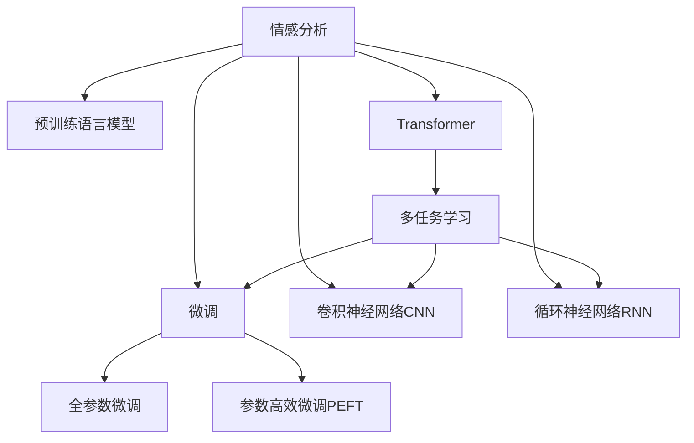

                 

# 深度学习在情感分析中的前沿技术

> 关键词：深度学习,情感分析,卷积神经网络,循环神经网络,Transformer,迁移学习,注意力机制,多任务学习

## 1. 背景介绍

### 1.1 问题由来
情感分析(Sentiment Analysis)是自然语言处理(NLP)领域的一个重要任务，旨在从文本中自动判断情感倾向，如积极、消极、中性等。传统的情感分析方法主要依赖于基于规则的特征提取和手工构建的词典，难以捕捉文本中的深层次语义关系。近年来，随着深度学习技术的兴起，通过大规模预训练语言模型进行微调，情感分析在精度和泛化能力上取得了长足进步。

目前，基于深度学习的大规模语言模型已经在情感分析任务上取得了显著成果。BERT、GPT等通用语言模型通过对大规模文本数据进行预训练，学习到了丰富的语言表示，可以高效地进行情感分析等下游任务的微调。而基于这些预训练模型的迁移学习范式，进一步提升了情感分析的准确性和泛化能力。

### 1.2 问题核心关键点
本文聚焦于深度学习在情感分析中的前沿技术，特别是利用预训练语言模型进行微调的过程。关键问题包括：
- 如何选择最适合的预训练模型和微调策略？
- 如何利用注意力机制和多任务学习提升情感分析的效果？
- 如何应对大规模文本数据的多样性和复杂性，提升模型的泛化能力？
- 如何设计高效的模型架构，以在保持精度的同时提升推理效率？

## 2. 核心概念与联系

### 2.1 核心概念概述

为更好地理解深度学习在情感分析中的应用，本节将介绍几个关键概念及其相互关系：

- 情感分析(Sentiment Analysis)：识别和提取文本中的情感倾向，通常分为情感分类和情感强度分析两类任务。
- 预训练语言模型(Pre-trained Language Model)：如BERT、GPT等，通过大规模无标签文本数据进行自监督学习，学习通用的语言表示，具备强大的语言理解和生成能力。
- 微调(Fine-tuning)：指在预训练模型的基础上，使用下游任务的少量标注数据，通过有监督学习优化模型在该任务上的性能。
- 迁移学习(Transfer Learning)：将一个领域学习到的知识，迁移应用到另一个不同但相关的领域的学习范式。
- 卷积神经网络(Convolutional Neural Network, CNN)：通过卷积操作提取文本局部特征，适用于序列较短的文本。
- 循环神经网络(Recurrent Neural Network, RNN)：通过循环结构捕捉文本的时序依赖关系，适用于序列较长的文本。
- Transformer：一种基于自注意力机制的神经网络结构，可以高效地处理长序列文本，适用于大规模预训练。
- 注意力机制(Attention Mechanism)：通过学习文本中的不同部分之间的关系，提高模型对关键信息的关注度。
- 多任务学习(Multi-task Learning)：同时训练多个相关任务，通过共享参数提升整体性能。

这些核心概念之间的逻辑关系可以通过以下Mermaid流程图来展示：



这个流程图展示了大语言模型的核心概念及其之间的联系：

1. 情感分析任务可以利用预训练语言模型进行微调，提高模型性能。
2. 预训练模型包括卷积神经网络、循环神经网络和Transformer等不同架构。
3. 多任务学习通过共享模型参数，进一步提升模型的整体性能。
4. 注意力机制用于提升模型对关键信息的关注度，增强模型表达能力。

## 3. 核心算法原理 & 具体操作步骤
### 3.1 算法原理概述

情感分析的本质是通过机器学习模型对文本中的情感倾向进行分类或评分。常用的深度学习模型包括卷积神经网络(CNN)、循环神经网络(RNN)和Transformer等。其中，Transformer结构因其高效处理长序列文本的能力，在情感分析中取得了显著成果。

Transformer的注意力机制能够捕捉文本中的全局依赖关系，在情感分析任务中，通过上下文信息来确定文本的情感倾向。常见的情感分析任务可以分为两类：情感分类和情感强度分析。情感分类任务将文本分为积极、消极或中性；情感强度分析任务则进一步量化情感的强度。

### 3.2 算法步骤详解

情感分析的深度学习模型一般包括以下几个关键步骤：

**Step 1: 准备预训练模型和数据集**
- 选择合适的预训练语言模型 $M_{\theta}$ 作为初始化参数，如 BERT、GPT 等。
- 准备情感分析任务的标注数据集 $D=\{(x_i,y_i)\}_{i=1}^N$，其中 $x_i$ 为文本，$y_i$ 为情感标签。

**Step 2: 添加情感分析层**
- 根据任务类型，在预训练模型顶层设计合适的输出层和损失函数。
- 对于情感分类任务，通常在顶层添加softmax分类器，使用交叉熵损失函数。
- 对于情感强度分析任务，通常使用回归器，以均方误差损失函数。

**Step 3: 设置微调超参数**
- 选择合适的优化算法及其参数，如 AdamW、SGD 等，设置学习率、批大小、迭代轮数等。
- 设置正则化技术及强度，包括权重衰减、Dropout、Early Stopping等。
- 确定冻结预训练参数的策略，如仅微调顶层，或全部参数都参与微调。

**Step 4: 执行梯度训练**
- 将训练集数据分批次输入模型，前向传播计算损失函数。
- 反向传播计算参数梯度，根据设定的优化算法和学习率更新模型参数。
- 周期性在验证集上评估模型性能，根据性能指标决定是否触发 Early Stopping。
- 重复上述步骤直到满足预设的迭代轮数或 Early Stopping 条件。

**Step 5: 测试和部署**
- 在测试集上评估微调后模型 $M_{\hat{\theta}}$ 的性能，对比微调前后的精度提升。
- 使用微调后的模型对新样本进行推理预测，集成到实际的应用系统中。

以上是深度学习在情感分析任务中的微调范式。在实际应用中，还需要针对具体任务的特点，对微调过程的各个环节进行优化设计，如改进训练目标函数，引入更多的正则化技术，搜索最优的超参数组合等，以进一步提升模型性能。

### 3.3 算法优缺点

深度学习在情感分析中的微调方法具有以下优点：
1. 简单高效。只需准备少量标注数据，即可对预训练模型进行快速适配，获得较大的性能提升。
2. 通用适用。适用于各种情感分析任务，包括情感分类和情感强度分析，设计简单的任务适配层即可实现微调。
3. 参数高效。利用参数高效微调技术，在固定大部分预训练权重不变的情况下，仍可取得不错的提升。
4. 效果显著。在学术界和工业界的诸多任务上，基于微调的方法已经刷新了最先进的性能指标。

同时，该方法也存在一定的局限性：
1. 依赖标注数据。微调的效果很大程度上取决于标注数据的质量和数量，获取高质量标注数据的成本较高。
2. 迁移能力有限。当目标任务与预训练数据的分布差异较大时，微调的性能提升有限。
3. 可解释性不足。微调模型的决策过程通常缺乏可解释性，难以对其推理逻辑进行分析和调试。

尽管存在这些局限性，但就目前而言，深度学习在情感分析中的微调方法仍是情感分析任务的主流范式。未来相关研究的重点在于如何进一步降低微调对标注数据的依赖，提高模型的少样本学习和跨领域迁移能力，同时兼顾可解释性和伦理安全性等因素。

### 3.4 算法应用领域

深度学习在情感分析中的应用已经覆盖了诸多领域，如社交媒体分析、用户评论分析、产品评测、舆情监测等。以下是几个典型的应用场景：

- 社交媒体情感分析：对社交媒体平台上的用户评论和帖子进行情感分类，了解用户的情绪状态，指导企业进行产品改进和市场策略调整。
- 产品评测分析：对产品评测文本进行情感强度分析，评估产品的用户满意度和市场表现，指导企业进行产品优化和市场推广。
- 品牌舆情监测：对社交媒体、新闻、论坛等渠道上的文本进行情感分类，监控品牌声誉，及时应对负面信息，维护品牌形象。
- 情感驱动的内容推荐：根据用户的历史情感记录和实时情感分析结果，推荐相关的内容，提升用户体验。

除了上述这些经典任务外，深度学习在情感分析中的应用还在不断扩展，如情感驱动的对话系统、情感驱动的广告投放等，为NLP技术带来了更多的应用场景。随着深度学习模型的不断演进，相信情感分析技术将在更多领域得到广泛应用，提升社会的智能化水平。

## 4. 数学模型和公式 & 详细讲解  
### 4.1 数学模型构建

本节将使用数学语言对深度学习在情感分析中的微调过程进行更加严格的刻画。

记预训练语言模型为 $M_{\theta}$，其中 $\theta$ 为预训练得到的模型参数。假设情感分析任务的训练集为 $D=\{(x_i,y_i)\}_{i=1}^N, x_i \in \mathcal{X}, y_i \in \mathcal{Y}$，其中 $\mathcal{X}$ 为文本输入空间，$\mathcal{Y}$ 为情感标签空间。

定义模型 $M_{\theta}$ 在文本 $x$ 上的输出为 $\hat{y}=M_{\theta}(x) \in [0,1]$，表示文本的情感倾向概率。情感分析任务包括情感分类和情感强度分析两类，对应的损失函数分别为：

- 情感分类任务：$\ell(M_{\theta}(x),y) = -[y\log M_{\theta}(x)+(1-y)\log(1-M_{\theta}(x))]$

- 情感强度分析任务：$\ell(M_{\theta}(x),y) = (\hat{y}-y)^2$

将这些损失函数代入经验风险公式，得：

$$
\mathcal{L}(\theta) = -\frac{1}{N}\sum_{i=1}^N \ell(M_{\theta}(x_i),y_i)
$$

在实践中，我们通常使用基于梯度的优化算法（如SGD、Adam等）来近似求解上述最优化问题。设 $\eta$ 为学习率，$\lambda$ 为正则化系数，则参数的更新公式为：

$$
\theta \leftarrow \theta - \eta \nabla_{\theta}\mathcal{L}(\theta) - \eta\lambda\theta
$$

其中 $\nabla_{\theta}\mathcal{L}(\theta)$ 为损失函数对参数 $\theta$ 的梯度，可通过反向传播算法高效计算。

### 4.2 公式推导过程

以情感分类任务为例，推导交叉熵损失函数及其梯度的计算公式。

假设模型 $M_{\theta}$ 在输入 $x$ 上的输出为 $\hat{y}=M_{\theta}(x) \in [0,1]$，真实标签 $y \in \{0,1\}$。则情感分类任务的交叉熵损失函数定义为：

$$
\ell(M_{\theta}(x),y) = -[y\log \hat{y} + (1-y)\log(1-\hat{y})]
$$

将其代入经验风险公式，得：

$$
\mathcal{L}(\theta) = -\frac{1}{N}\sum_{i=1}^N [y_i\log M_{\theta}(x_i)+(1-y_i)\log(1-M_{\theta}(x_i))]
$$

根据链式法则，损失函数对参数 $\theta_k$ 的梯度为：

$$
\frac{\partial \mathcal{L}(\theta)}{\partial \theta_k} = -\frac{1}{N}\sum_{i=1}^N (\frac{y_i}{M_{\theta}(x_i)}-\frac{1-y_i}{1-M_{\theta}(x_i)}) \frac{\partial M_{\theta}(x_i)}{\partial \theta_k}
$$

其中 $\frac{\partial M_{\theta}(x_i)}{\partial \theta_k}$ 可进一步递归展开，利用自动微分技术完成计算。

在得到损失函数的梯度后，即可带入参数更新公式，完成模型的迭代优化。重复上述过程直至收敛，最终得到适应情感分析任务的最优模型参数 $\theta^*$。

## 5. 项目实践：代码实例和详细解释说明
### 5.1 开发环境搭建

在进行情感分析的微调实践前，我们需要准备好开发环境。以下是使用Python进行PyTorch开发的环境配置流程：

1. 安装Anaconda：从官网下载并安装Anaconda，用于创建独立的Python环境。

2. 创建并激活虚拟环境：
```bash
conda create -n pytorch-env python=3.8 
conda activate pytorch-env
```

3. 安装PyTorch：根据CUDA版本，从官网获取对应的安装命令。例如：
```bash
conda install pytorch torchvision torchaudio cudatoolkit=11.1 -c pytorch -c conda-forge
```

4. 安装Transformers库：
```bash
pip install transformers
```

5. 安装各类工具包：
```bash
pip install numpy pandas scikit-learn matplotlib tqdm jupyter notebook ipython
```

完成上述步骤后，即可在`pytorch-env`环境中开始微调实践。

### 5.2 源代码详细实现

下面我以情感分类任务为例，给出使用Transformers库对BERT模型进行微调的PyTorch代码实现。

首先，定义情感分类任务的数据处理函数：

```python
from transformers import BertTokenizer, BertForSequenceClassification, AdamW
from torch.utils.data import Dataset
import torch

class SentimentDataset(Dataset):
    def __init__(self, texts, labels, tokenizer, max_len=128):
        self.texts = texts
        self.labels = labels
        self.tokenizer = tokenizer
        self.max_len = max_len
        
    def __len__(self):
        return len(self.texts)
    
    def __getitem__(self, item):
        text = self.texts[item]
        label = self.labels[item]
        
        encoding = self.tokenizer(text, return_tensors='pt', max_length=self.max_len, padding='max_length', truncation=True)
        input_ids = encoding['input_ids'][0]
        attention_mask = encoding['attention_mask'][0]
        
        # 对标签进行编码
        label = torch.tensor(label, dtype=torch.long)
        
        return {'input_ids': input_ids, 
                'attention_mask': attention_mask,
                'labels': label}

# 标签与id的映射
label2id = {'negative': 0, 'positive': 1}

# 创建dataset
tokenizer = BertTokenizer.from_pretrained('bert-base-cased')

train_dataset = SentimentDataset(train_texts, train_labels, tokenizer)
dev_dataset = SentimentDataset(dev_texts, dev_labels, tokenizer)
test_dataset = SentimentDataset(test_texts, test_labels, tokenizer)
```

然后，定义模型和优化器：

```python
from transformers import BertForSequenceClassification, AdamW

model = BertForSequenceClassification.from_pretrained('bert-base-cased', num_labels=2)

optimizer = AdamW(model.parameters(), lr=2e-5)
```

接着，定义训练和评估函数：

```python
from torch.utils.data import DataLoader
from tqdm import tqdm
from sklearn.metrics import accuracy_score

device = torch.device('cuda') if torch.cuda.is_available() else torch.device('cpu')
model.to(device)

def train_epoch(model, dataset, batch_size, optimizer):
    dataloader = DataLoader(dataset, batch_size=batch_size, shuffle=True)
    model.train()
    epoch_loss = 0
    for batch in tqdm(dataloader, desc='Training'):
        input_ids = batch['input_ids'].to(device)
        attention_mask = batch['attention_mask'].to(device)
        labels = batch['labels'].to(device)
        model.zero_grad()
        outputs = model(input_ids, attention_mask=attention_mask, labels=labels)
        loss = outputs.loss
        epoch_loss += loss.item()
        loss.backward()
        optimizer.step()
    return epoch_loss / len(dataloader)

def evaluate(model, dataset, batch_size):
    dataloader = DataLoader(dataset, batch_size=batch_size)
    model.eval()
    preds, labels = [], []
    with torch.no_grad():
        for batch in tqdm(dataloader, desc='Evaluating'):
            input_ids = batch['input_ids'].to(device)
            attention_mask = batch['attention_mask'].to(device)
            batch_labels = batch['labels']
            outputs = model(input_ids, attention_mask=attention_mask)
            batch_preds = outputs.logits.argmax(dim=1).to('cpu').tolist()
            batch_labels = batch_labels.to('cpu').tolist()
            for pred, label in zip(batch_preds, batch_labels):
                preds.append(pred.item())
                labels.append(label.item())
                
    print('Accuracy:', accuracy_score(labels, preds))
```

最后，启动训练流程并在测试集上评估：

```python
epochs = 5
batch_size = 16

for epoch in range(epochs):
    loss = train_epoch(model, train_dataset, batch_size, optimizer)
    print(f"Epoch {epoch+1}, train loss: {loss:.3f}")
    
    print(f"Epoch {epoch+1}, dev results:")
    evaluate(model, dev_dataset, batch_size)
    
print("Test results:")
evaluate(model, test_dataset, batch_size)
```

以上就是使用PyTorch对BERT进行情感分类任务微调的完整代码实现。可以看到，得益于Transformers库的强大封装，我们可以用相对简洁的代码完成BERT模型的加载和微调。

### 5.3 代码解读与分析

让我们再详细解读一下关键代码的实现细节：

**SentimentDataset类**：
- `__init__`方法：初始化文本、标签、分词器等关键组件。
- `__len__`方法：返回数据集的样本数量。
- `__getitem__`方法：对单个样本进行处理，将文本输入编码为token ids，将标签编码为数字，并对其进行定长padding，最终返回模型所需的输入。

**label2id字典**：
- 定义了标签与数字id之间的映射关系，用于将标签转换为模型可以处理的格式。

**训练和评估函数**：
- 使用PyTorch的DataLoader对数据集进行批次化加载，供模型训练和推理使用。
- 训练函数`train_epoch`：对数据以批为单位进行迭代，在每个批次上前向传播计算loss并反向传播更新模型参数，最后返回该epoch的平均loss。
- 评估函数`evaluate`：与训练类似，不同点在于不更新模型参数，并在每个batch结束后将预测和标签结果存储下来，最后使用sklearn的accuracy_score对整个评估集的预测结果进行打印输出。

**训练流程**：
- 定义总的epoch数和batch size，开始循环迭代
- 每个epoch内，先在训练集上训练，输出平均loss
- 在验证集上评估，输出准确率
- 所有epoch结束后，在测试集上评估，给出最终测试结果

可以看到，PyTorch配合Transformers库使得BERT微调的代码实现变得简洁高效。开发者可以将更多精力放在数据处理、模型改进等高层逻辑上，而不必过多关注底层的实现细节。

当然，工业级的系统实现还需考虑更多因素，如模型的保存和部署、超参数的自动搜索、更灵活的任务适配层等。但核心的微调范式基本与此类似。

## 6. 实际应用场景
### 6.1 情感分析在金融舆情监测中的应用

情感分析在金融舆情监测中具有广泛的应用前景。金融市场瞬息万变，舆情信息对投资者决策和市场波动有着重要影响。通过情感分析，可以实时监控市场舆情，及时发现和应对潜在的负面信息，规避金融风险。

具体而言，可以收集金融领域的社交媒体、新闻、财经博客等文本数据，利用情感分析模型对其中的情感倾向进行判断。如果发现负面舆情激增，系统会自动发出警报，提示投资者注意风险。此外，情感分析还可以用于评估市场对某一事件的情绪反应，为投资者提供决策参考。

### 6.2 情感分析在品牌舆情监测中的应用

品牌舆情监测是情感分析的重要应用领域之一。通过情感分析，企业可以实时监控品牌在社交媒体、新闻、论坛等渠道的情感倾向，及时应对负面信息，维护品牌形象。

具体而言，企业可以利用情感分析模型对品牌的在线提及数据进行情感分类，了解用户对品牌的情感态度。对于负面舆情，可以及时采取应对措施，如回应负面评论、调整产品策略等。同时，情感分析还可以用于品牌声誉管理，通过对比不同时间段的情感趋势，评估品牌形象的变化和市场反应。

### 6.3 情感分析在社交媒体分析中的应用

社交媒体是情感分析的重要数据来源之一。通过情感分析，可以了解用户在社交媒体上的情感倾向，指导企业进行市场策略调整。

具体而言，企业可以收集用户在社交媒体上的评论、帖子、转发等文本数据，利用情感分析模型对其中的情感倾向进行判断。如果发现某一产品或服务的情感倾向负面，可以及时采取措施进行改进。同时，情感分析还可以用于分析用户对某一事件的情感反应，为品牌营销和产品优化提供参考。

### 6.4 情感分析在用户评论分析中的应用

用户评论是情感分析的重要数据来源之一。通过情感分析，企业可以了解用户对产品、服务等的情感态度，指导产品优化和市场推广。

具体而言，企业可以收集用户在电商网站、应用市场、社交媒体等平台上的评论数据，利用情感分析模型对其中的情感倾向进行判断。如果发现某一产品的情感倾向负面，可以及时采取措施进行改进。同时，情感分析还可以用于分析用户对某一产品的情感变化，评估产品优化的效果。

## 7. 工具和资源推荐
### 7.1 学习资源推荐

为了帮助开发者系统掌握深度学习在情感分析中的应用，这里推荐一些优质的学习资源：

1. 《深度学习》课程：由吴恩达教授主讲，介绍了深度学习的基本原理和应用，包括卷积神经网络、循环神经网络等。

2. 《自然语言处理综论》课程：由斯坦福大学开设，涵盖NLP的基本概念和前沿技术，包括情感分析在内。

3. 《Python深度学习》书籍：Yoshua Bengio等作者编写的经典教材，系统介绍了深度学习在NLP中的应用，包括情感分析等。

4. 《TensorFlow官方文档》：Google开发的深度学习框架，提供了丰富的情感分析样例代码和API文档。

5. 《Kaggle情感分析竞赛》：Kaggle举办的情感分析竞赛，提供大量数据集和评估指标，是实践情感分析的好机会。

通过对这些资源的学习实践，相信你一定能够快速掌握深度学习在情感分析中的应用，并用于解决实际的NLP问题。
###  7.2 开发工具推荐

高效的开发离不开优秀的工具支持。以下是几款用于情感分析的开发工具：

1. PyTorch：基于Python的开源深度学习框架，灵活动态的计算图，适合快速迭代研究。大部分预训练语言模型都有PyTorch版本的实现。

2. TensorFlow：由Google主导开发的开源深度学习框架，生产部署方便，适合大规模工程应用。同样有丰富的预训练语言模型资源。

3. Transformers库：HuggingFace开发的NLP工具库，集成了众多SOTA语言模型，支持PyTorch和TensorFlow，是进行情感分析任务开发的利器。

4. Weights & Biases：模型训练的实验跟踪工具，可以记录和可视化模型训练过程中的各项指标，方便对比和调优。与主流深度学习框架无缝集成。

5. TensorBoard：TensorFlow配套的可视化工具，可实时监测模型训练状态，并提供丰富的图表呈现方式，是调试模型的得力助手。

6. Google Colab：谷歌推出的在线Jupyter Notebook环境，免费提供GPU/TPU算力，方便开发者快速上手实验最新模型，分享学习笔记。

合理利用这些工具，可以显著提升情感分析任务的开发效率，加快创新迭代的步伐。

### 7.3 相关论文推荐

深度学习在情感分析中的应用源于学界的持续研究。以下是几篇奠基性的相关论文，推荐阅读：

1. Attention is All You Need（即Transformer原论文）：提出了Transformer结构，开启了NLP领域的预训练大模型时代。

2. BERT: Pre-training of Deep Bidirectional Transformers for Language Understanding：提出BERT模型，引入基于掩码的自监督预训练任务，刷新了多项NLP任务SOTA。

3. Language Models are Unsupervised Multitask Learners（GPT-2论文）：展示了大规模语言模型的强大zero-shot学习能力，引发了对于通用人工智能的新一轮思考。

4. Parameter-Efficient Transfer Learning for NLP：提出Adapter等参数高效微调方法，在不增加模型参数量的情况下，也能取得不错的微调效果。

5. Multi-task Learning for Language Understanding：提出多任务学习框架，通过共享参数提升模型的整体性能，应用于情感分析等任务。

6. Attention Is All You Need for Sequence Labeling：将Transformer应用于序列标注任务，提升情感分析的效果。

这些论文代表了大语言模型在情感分析中的演进脉络。通过学习这些前沿成果，可以帮助研究者把握学科前进方向，激发更多的创新灵感。

## 8. 总结：未来发展趋势与挑战

### 8.1 总结

本文对深度学习在情感分析中的应用进行了全面系统的介绍。首先阐述了情感分析任务的背景和重要性，明确了深度学习在此任务中的独特优势。其次，从原理到实践，详细讲解了深度学习在情感分析中的微调过程，给出了情感分类和情感强度分析任务的代码实现。同时，本文还广泛探讨了情感分析在金融舆情监测、品牌舆情监测、社交媒体分析、用户评论分析等多个行业领域的应用前景，展示了深度学习在情感分析中的广阔应用场景。

通过本文的系统梳理，可以看到，深度学习在情感分析中的应用已经从简单的文本分类扩展到了更复杂的情感强度分析，从传统的单模态数据扩展到了多模态数据，从简单的静态文本扩展到了动态社交媒体数据。这些方向的探索发展，必将进一步提升情感分析的精度和泛化能力，为社会各行业带来更加智能化的服务体验。

### 8.2 未来发展趋势

展望未来，深度学习在情感分析中的发展趋势如下：

1. 模型规模持续增大。随着算力成本的下降和数据规模的扩张，预训练语言模型的参数量还将持续增长。超大规模语言模型蕴含的丰富语言知识，有望支撑更加复杂多变的情感分析任务。

2. 情感分类和情感强度分析的融合。情感分析任务的复杂度不断增加，未来的研究将更加关注情感强度分析，即对情感的强度进行量化，提升情感分析的细粒度。

3. 多模态情感分析的崛起。当前的情感分析主要聚焦于文本数据，未来将更多地拓展到图像、视频、语音等多模态数据，提升情感分析的全面性和鲁棒性。

4. 迁移学习、多任务学习和知识蒸馏的结合。未来的研究将更多地利用迁移学习、多任务学习和知识蒸馏等技术，提升情感分析的泛化能力和通用性。

5. 注意力机制的进一步应用。未来的情感分析将更多地利用注意力机制，捕捉文本中的关键信息，提升模型的表达能力和泛化能力。

6. 可解释性和公平性的加强。未来的情感分析将更多地关注模型的可解释性和公平性，通过引入因果分析、对抗训练等技术，提升模型的鲁棒性和可信度。

以上趋势凸显了深度学习在情感分析中的广阔前景。这些方向的探索发展，必将进一步提升情感分析的精度和泛化能力，为社会各行业带来更加智能化的服务体验。

### 8.3 面临的挑战

尽管深度学习在情感分析中的应用已经取得了显著进展，但在迈向更加智能化、普适化应用的过程中，仍面临诸多挑战：

1. 标注数据质量问题。情感分析的效果很大程度上取决于标注数据的质量和数量，获取高质量标注数据的成本较高，且标注过程繁琐，容易引入主观偏差。

2. 模型的可解释性问题。情感分析模型的决策过程通常缺乏可解释性，难以对其推理逻辑进行分析和调试。

3. 模型的鲁棒性问题。情感分析模型面对域外数据时，泛化性能往往大打折扣，难以应对新出现的语言表达和情感表达方式。

4. 模型的公平性问题。情感分析模型可能会学习到有偏见、有害的信息，传递到下游任务，造成负面影响。

5. 模型的效率问题。情感分析模型在推理时可能面临计算资源和存储资源的限制，难以在大规模数据集上高效运行。

6. 模型的跨领域迁移能力问题。情感分析模型在不同领域和不同情感表达方式上的迁移能力有限，难以在多个场景下通用。

这些挑战凸显了深度学习在情感分析中的应用瓶颈，需要在算法、数据、模型等方面进行进一步的优化和改进。

### 8.4 研究展望

未来的研究需要在以下几个方面寻求新的突破：

1. 无监督和半监督学习方法的探索。摆脱对大规模标注数据的依赖，利用自监督学习、主动学习等无监督和半监督范式，最大限度利用非结构化数据，实现更加灵活高效的情感分析。

2. 多模态情感分析方法的开发。将文本、图像、语音等多模态数据结合起来，提升情感分析的全面性和鲁棒性。

3. 迁移学习和多任务学习方法的结合。通过共享模型参数，提升情感分析的泛化能力和通用性。

4. 可解释性和公平性研究。通过引入因果分析、对抗训练等技术，提升情感分析模型的可解释性和公平性。

5. 知识蒸馏和参数高效微调方法的探索。通过知识蒸馏和参数高效微调等技术，提升情感分析模型的效率和泛化能力。

6. 跨领域情感分析方法的研究。通过跨领域迁移学习和多模态数据融合等技术，提升情感分析模型的跨领域迁移能力。

这些研究方向的探索，必将引领深度学习在情感分析中的应用走向更加智能化、普适化的阶段，为社会各行业带来更加智能化的服务体验。

## 9. 附录：常见问题与解答

**Q1：为什么深度学习在情感分析中的应用效果比传统方法好？**

A: 深度学习在情感分析中的应用效果优于传统方法，主要原因有以下几点：
1. 自动特征提取。深度学习模型可以自动学习文本中的特征，避免了传统方法中需要手动提取特征的繁琐过程。
2. 非线性建模。深度学习模型可以捕捉文本中的非线性关系，更好地适应复杂多变的情感表达方式。
3. 大规模数据训练。深度学习模型通过在大规模数据集上进行训练，学习到了丰富的语言知识和语义表示，能够适应不同领域的情感表达方式。

**Q2：如何进行参数高效微调？**

A: 参数高效微调(Parameter-Efficient Fine-Tuning, PEFT)是指在微调过程中，只更新少量的模型参数，而固定大部分预训练权重不变，以提高微调效率，避免过拟合。具体方法包括：
1. 冻结底层参数。通过固定Transformer模型的底层参数，只微调顶层分类器或解码器。
2. 使用Adapter层。通过引入Adapter层，固定模型的底层参数，只更新顶层分类器或解码器的参数。
3. 基于提示的微调。通过精心设计提示模板，引导模型按期望方式输出，减少微调参数。

**Q3：如何提高情感分析的鲁棒性？**

A: 提高情感分析的鲁棒性，可以从以下几个方面进行：
1. 数据增强。通过对训练样本进行数据增强，如回译、同义词替换等，增加训练样本的多样性，提高模型的泛化能力。
2. 对抗训练。引入对抗样本，训练模型对噪声和扰动的鲁棒性，提升模型的鲁棒性。
3. 多任务学习。通过联合训练多个情感分析任务，提升模型的泛化能力和鲁棒性。
4. 迁移学习。利用预训练语言模型在不同任务上的通用表示，提升情感分析的泛化能力和鲁棒性。

**Q4：如何进行情感分析任务的多模态融合？**

A: 进行情感分析任务的多模态融合，可以通过以下方法实现：
1. 特征融合。将不同模态的特征进行拼接或融合，形成多模态特征向量，输入到情感分析模型中。
2. 模型融合。通过训练多个单模态模型，将它们的输出进行融合，得到多模态情感分析结果。
3. 多模态注意力。通过引入多模态注意力机制，对不同模态的特征进行加权融合，提升模型的鲁棒性和泛化能力。

**Q5：如何在情感分析中引入因果分析？**

A: 在情感分析中引入因果分析，可以从以下几个方面进行：
1. 因果推理。通过引入因果推理模型，建立文本中的因果关系，提高情感分析的准确性和可解释性。
2. 因果分析框架。通过引入因果分析框架，对情感分析模型的推理过程进行可视化，解释情感分析的因果关系。
3. 因果影响评估。通过评估情感分析模型的因果影响，确定模型对不同情感表达方式的影响，提升情感分析的公平性和鲁棒性。

通过这些方法的引入，可以使情感分析模型更加智能化、可解释化，提高情感分析的精度和泛化能力。

---

作者：禅与计算机程序设计艺术 / Zen and the Art of Computer Programming

