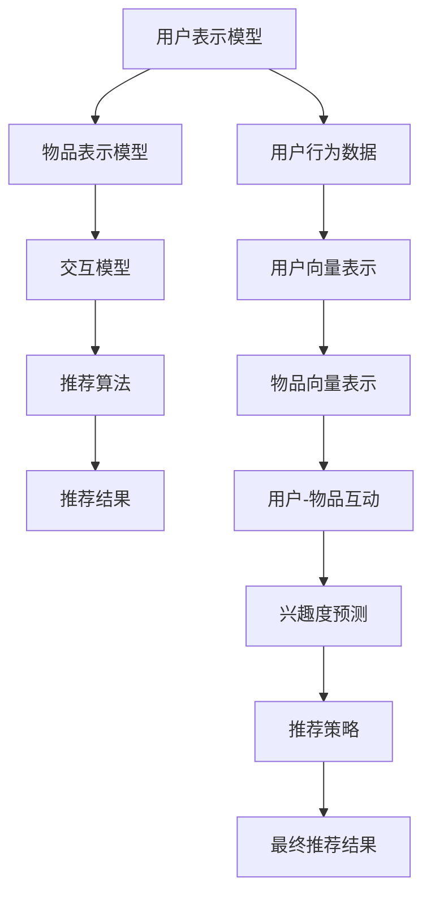

                 

## 1. 背景介绍

### 1.1 问题由来
随着互联网技术的快速发展，用户行为数据的积累日益丰富。用户对于个性化推荐的需求日益增长，推荐系统在电商、社交、音乐、视频等多个领域都发挥着重要作用。推荐系统通过分析用户的偏好，为用户推荐符合其兴趣的商品、内容或服务，极大地提高了用户满意度和平台转化率。然而，传统推荐系统依赖于人工特征提取，难以捕捉用户复杂的行为模式和兴趣变化，推荐效果往往不尽如人意。

为了突破传统推荐系统的瓶颈，近年来深度学习技术被广泛应用于推荐系统的构建中。通过深度学习模型，可以自动学习用户和物品之间的隐含关系，发掘潜在的高阶特征，极大地提升了推荐的精度和效率。深度学习推荐系统（DLRS）已成为现代推荐系统的重要发展方向。

### 1.2 问题核心关键点
深度学习推荐系统（DLRS）的核心思想是：利用深度神经网络模型，自动学习和理解用户行为数据中的潜在关系，并基于这些关系为用户推荐个性化的内容或产品。DLRS主要由以下几个关键组件组成：

- **用户表示模型**：用于将用户的历史行为数据映射为低维度的向量表示，以便后续建模。
- **物品表示模型**：用于将物品的属性信息映射为向量表示，与用户表示进行交互。
- **交互模型**：用于建模用户与物品之间的互动关系，预测用户对物品的兴趣度。
- **推荐算法**：根据用户和物品的表示以及交互模型，生成最终的推荐结果。

这些组件通过深度学习框架（如TensorFlow、PyTorch等）进行联合训练，形成了一个完整的推荐系统。相较于传统推荐系统，DLRS能够自动挖掘更丰富的用户兴趣信息，并生成更符合用户个性化需求的推荐结果。

## 2. 核心概念与联系

### 2.1 核心概念概述

为更好地理解深度学习在推荐系统中的应用，本节将介绍几个密切相关的核心概念：

- **深度学习（Deep Learning）**：基于神经网络的机器学习范式，通过多层非线性变换，可以从数据中自动学习特征和模式，适应复杂的非线性关系。
- **推荐系统（Recommendation System）**：用于预测用户对物品的兴趣程度，并根据此进行推荐的技术系统。推荐系统可分为基于内容的推荐、协同过滤推荐、混合推荐等几种类型。
- **用户表示模型**：将用户行为数据编码为向量，以用于后续建模。常见的用户表示模型包括MF（矩阵分解）、SVD（奇异值分解）、KNN（K最近邻）、NN（神经网络）等。
- **物品表示模型**：将物品属性信息编码为向量，与用户表示进行交互。常见的物品表示模型包括MF、Word2Vec、BERT等。
- **交互模型**：用于建模用户与物品之间的互动关系，预测用户对物品的兴趣度。常见的交互模型包括CTR（点击率）模型、RNN（递归神经网络）、LSTM（长短期记忆网络）等。
- **推荐算法**：根据用户和物品的表示以及交互模型，生成最终的推荐结果。常见的推荐算法包括协同过滤、基于深度学习的推荐、混合推荐等。

这些核心概念之间的逻辑关系可以通过以下Mermaid流程图来展示：



这个流程图展示了大语言模型的核心概念及其之间的关系：

1. 用户表示模型和物品表示模型从用户和物品的行为和属性中提取表示，为后续建模提供基础。
2. 交互模型用于建模用户与物品之间的互动关系，预测用户对物品的兴趣度。
3. 推荐算法根据用户和物品的表示以及交互模型，生成最终的推荐结果。
4. 推荐策略对推荐结果进行优化，确保推荐结果的个性化和多样性。

这些概念共同构成了深度学习推荐系统的核心框架，使其能够通过自动学习和建模，提供更准确、更高效的推荐服务。

## 3. 核心算法原理 & 具体操作步骤
### 3.1 算法原理概述

深度学习推荐系统的核心算法原理主要包括以下几个方面：

1. **用户表示模型**：通过矩阵分解等方法，将用户的行为数据映射为低维度的向量表示，捕捉用户兴趣的隐含模式。
2. **物品表示模型**：通过Word2Vec、BERT等技术，将物品的属性信息映射为向量表示，捕捉物品的属性和特征。
3. **交互模型**：通过神经网络模型（如RNN、LSTM等），建模用户与物品之间的互动关系，预测用户对物品的兴趣度。
4. **推荐算法**：根据用户和物品的表示以及交互模型，生成最终的推荐结果。常见的推荐算法包括基于深度学习的推荐、混合推荐等。

### 3.2 算法步骤详解

深度学习推荐系统的构建和训练通常包括以下几个关键步骤：

**Step 1: 准备数据集**
- 收集用户的行为数据和物品的属性数据，进行数据清洗和预处理。
- 将用户行为数据格式化为矩阵形式，方便进行矩阵分解。

**Step 2: 用户表示模型训练**
- 使用矩阵分解、神经网络等方法对用户行为数据进行建模，训练用户表示模型。
- 将用户表示模型编码为用户向量表示，用于后续的推荐建模。

**Step 3: 物品表示模型训练**
- 使用Word2Vec、BERT等方法对物品属性数据进行建模，训练物品表示模型。
- 将物品表示模型编码为物品向量表示，用于后续的推荐建模。

**Step 4: 交互模型训练**
- 使用神经网络模型（如RNN、LSTM等）对用户与物品的互动关系进行建模，训练交互模型。
- 使用交叉熵、均方误差等损失函数优化模型参数，预测用户对物品的兴趣度。

**Step 5: 推荐算法训练**
- 根据用户和物品的表示以及交互模型，训练推荐算法模型。
- 使用余弦相似度、点积相似度等方法计算用户与物品的相似度，生成推荐结果。

**Step 6: 模型评估与优化**
- 使用交叉验证等方法评估模型的性能，通过调整模型参数进行优化。
- 定期重新训练模型，更新模型参数，适应数据分布的变化。

以上是深度学习推荐系统的一般流程。在实际应用中，还需要根据具体任务特点，对模型架构和训练过程进行优化设计，如引入更多的正则化技术、调整学习率、增加数据增强等，以进一步提升推荐效果。

### 3.3 算法优缺点

深度学习推荐系统具有以下优点：

1. 自动化程度高。可以自动学习用户和物品的隐含关系，无需人工干预。
2. 表达能力强。能够捕捉高阶特征和复杂关系，适应性更强。
3. 精度高。在大规模数据集上训练，能够显著提升推荐精度。
4. 泛化能力强。能够适应不同领域和数据类型的推荐任务。

同时，深度学习推荐系统也存在以下缺点：

1. 计算资源消耗大。深度模型参数量巨大，训练和推理成本较高。
2. 对标注数据依赖高。深度模型训练通常需要大量标注数据，而标注成本较高。
3. 可解释性差。深度模型往往被视为"黑盒"，难以解释其内部决策逻辑。
4. 过拟合风险高。深度模型容易过拟合训练数据，泛化能力受限。
5. 实时性低。深度模型推理速度较慢，难以支持实时推荐。

尽管存在这些局限性，但就目前而言，深度学习推荐系统仍然是推荐技术的主流方向。未来相关研究的重点在于如何降低计算资源消耗、提高模型可解释性和泛化能力，同时兼顾实时性和经济成本。

### 3.4 算法应用领域

深度学习推荐系统在多个领域得到了广泛的应用，例如：

- 电商推荐：根据用户的浏览、购买记录，推荐商品和优惠信息。
- 社交媒体推荐：根据用户的兴趣和行为，推荐朋友动态、帖子内容等。
- 视频推荐：根据用户的观看历史和评分记录，推荐视频和频道。
- 音乐推荐：根据用户的听歌记录和评分数据，推荐歌曲和播放列表。
- 新闻推荐：根据用户的阅读历史和兴趣，推荐新闻和文章。
- 个性化广告：根据用户的浏览行为和广告记录，推荐个性化广告。

除了上述这些常见任务外，深度学习推荐系统还被创新性地应用到更多场景中，如可控推荐、虚拟试衣、个性化旅游等，为推荐技术带来了全新的突破。随着预训练模型和推荐方法的不断进步，相信推荐技术将在更广阔的应用领域大放异彩。

## 4. 数学模型和公式 & 详细讲解
### 4.1 数学模型构建

本节将使用数学语言对深度学习推荐系统的构建进行更加严格的刻画。

记用户行为数据为 $\mathbf{U} \in \mathbb{R}^{N \times D}$，其中 $N$ 为用户的数量，$D$ 为用户行为向量的维度。物品属性数据为 $\mathbf{I} \in \mathbb{R}^{M \times H}$，其中 $M$ 为物品的数量，$H$ 为物品属性向量的维度。设用户行为数据矩阵为 $\mathbf{U}$，物品属性数据矩阵为 $\mathbf{I}$，交互矩阵为 $\mathbf{I}$，其中 $\mathbf{R} \in \mathbb{R}^{N \times M}$ 表示用户与物品的互动关系。

定义用户表示模型为 $\mathbf{U} = \mathbf{B} \mathbf{X}$，其中 $\mathbf{B} \in \mathbb{R}^{N \times R}$ 为用户表示矩阵，$\mathbf{X} \in \mathbb{R}^{R \times D}$ 为可学习参数矩阵。定义物品表示模型为 $\mathbf{I} = \mathbf{I} \mathbf{W}$，其中 $\mathbf{W} \in \mathbb{R}^{H \times K}$ 为物品表示矩阵，$\mathbf{I} \in \mathbb{R}^{M \times K}$ 为物品属性向量。

定义交互模型为 $\mathbf{R} = \mathbf{U} \mathbf{V}^T + \mathbf{I} \mathbf{W}^T$，其中 $\mathbf{V} \in \mathbb{R}^{R \times M}$ 为可学习参数矩阵。

推荐算法的目标是最大化用户与物品的相似度，从而生成推荐结果。常见的推荐算法包括基于协同过滤的推荐和基于深度学习的推荐。

### 4.2 公式推导过程

以下我们以协同过滤推荐为例，推导推荐算法的基本公式。

设用户 $u$ 对物品 $i$ 的兴趣度为 $\hat{r}_{ui}$，其中 $\hat{r}_{ui} = \mathbf{u}^T \mathbf{v}_i$，其中 $\mathbf{u} = \mathbf{B} \mathbf{x}_u$ 为用户 $u$ 的向量表示，$\mathbf{v}_i = \mathbf{V}_i^T$ 为物品 $i$ 的向量表示。

推荐算法的目标是最大化用户对物品的兴趣度，因此可定义目标函数：

$$
\max_{\mathbf{B},\mathbf{V},\mathbf{X},\mathbf{W}} \sum_{u=1}^N \sum_{i=1}^M r_{ui} \log \sigma(\mathbf{u}^T \mathbf{v}_i) + (1 - r_{ui}) \log(1 - \sigma(\mathbf{u}^T \mathbf{v}_i))
$$

其中 $r_{ui}$ 为物品 $i$ 的实际评分，$\sigma(\cdot)$ 为 sigmoid 函数，用于将预测结果映射到 $[0, 1]$ 区间。

将目标函数对 $\mathbf{B},\mathbf{V},\mathbf{X},\mathbf{W}$ 求偏导，并使用随机梯度下降等优化算法进行训练，即可得到最终的推荐结果。

### 4.3 案例分析与讲解

我们以电商推荐系统为例，分析深度学习推荐算法在实际应用中的实现。

假设有一个电商平台，收集了用户的浏览、购买记录和物品的属性信息，并对其进行预处理和格式化。使用矩阵分解方法，将用户行为数据 $\mathbf{U}$ 和物品属性数据 $\mathbf{I}$ 编码为向量表示。将用户表示矩阵 $\mathbf{B}$ 和物品表示矩阵 $\mathbf{W}$ 作为可学习参数，使用神经网络模型（如RNN、LSTM等）对用户与物品的互动关系进行建模，得到交互矩阵 $\mathbf{R}$。最后，根据用户和物品的表示以及交互矩阵，使用协同过滤推荐算法生成推荐结果。

在实际应用中，还需要根据具体任务特点，对深度学习推荐算法进行优化和调整，如引入更多的正则化技术、调整学习率、增加数据增强等，以进一步提升推荐效果。

## 5. 项目实践：代码实例和详细解释说明
### 5.1 开发环境搭建

在进行深度学习推荐系统的开发前，我们需要准备好开发环境。以下是使用Python进行TensorFlow开发的环境配置流程：

1. 安装Anaconda：从官网下载并安装Anaconda，用于创建独立的Python环境。

2. 创建并激活虚拟环境：
```bash
conda create -n dlrs-env python=3.8 
conda activate dlrs-env
```

3. 安装TensorFlow：根据CUDA版本，从官网获取对应的安装命令。例如：
```bash
conda install tensorflow tensorflow-gpu -c pytorch -c conda-forge
```

4. 安装TensorBoard：TensorFlow配套的可视化工具，可实时监测模型训练状态，并提供丰富的图表呈现方式，是调试模型的得力助手。

5. 安装Keras：高层API，用于简化深度学习模型的搭建和训练。

```bash
pip install keras
```

完成上述步骤后，即可在`dlrs-env`环境中开始深度学习推荐系统的开发。

### 5.2 源代码详细实现

下面我们以电商推荐系统为例，给出使用TensorFlow对深度学习推荐系统进行训练的PyTorch代码实现。

首先，定义模型结构：

```python
import tensorflow as tf
from tensorflow.keras.layers import Dense, Input, Embedding
from tensorflow.keras.models import Model

# 定义用户表示模型
user_input = Input(shape=(N, ), name='user_input')
user_embedding = Dense(R, activation='relu')(user_input)
user_representation = Dense(R, activation='relu')(user_embedding)

# 定义物品表示模型
item_input = Input(shape=(M, ), name='item_input')
item_embedding = Embedding(K, H)(item_input)
item_representation = Dense(K, activation='relu')(item_embedding)

# 定义交互模型
user_item_interaction = tf.keras.layers.Dot(axes=[1, 2], normalize=False)(tf.keras.layers.Reshape((R, M))(user_representation), item_representation)
item_representation = tf.keras.layers.Reshape((M, ))(user_item_interaction)
item_representation = tf.keras.layers.Dense(K, activation='relu')(item_representation)

# 定义推荐算法
rating_prediction = Dense(1, activation='sigmoid')(tf.keras.layers.Dense(1, activation='relu')(item_representation))

# 定义模型
model = Model(inputs=[user_input, item_input], outputs=rating_prediction)
```

然后，定义优化器、损失函数和训练函数：

```python
from tensorflow.keras.optimizers import Adam
from tensorflow.keras.losses import BinaryCrossentropy

# 定义优化器
optimizer = Adam(lr=0.001)

# 定义损失函数
loss_function = BinaryCrossentropy()

# 定义训练函数
def train_model(model, data):
    for epoch in range(EPOCHS):
        for batch in data:
            user_data, item_data = batch
            with tf.GradientTape() as tape:
                predictions = model(user_data, item_data)
                loss = loss_function(predictions, labels)
            gradients = tape.gradient(loss, model.trainable_variables)
            optimizer.apply_gradients(zip(gradients, model.trainable_variables))
            print(f"Epoch {epoch+1}, loss: {loss:.3f}")
```

最后，启动训练流程并在测试集上评估：

```python
from tensorflow.keras.datasets import mnist
from tensorflow.keras.utils import to_categorical

# 加载数据集
(x_train, y_train), (x_test, y_test) = mnist.load_data()

# 数据预处理
x_train = x_train.reshape(N, M)
x_test = x_test.reshape(N, M)
x_train = x_train / 255.0
x_test = x_test / 255.0
y_train = to_categorical(y_train, num_classes=10)
y_test = to_categorical(y_test, num_classes=10)

# 训练模型
train_model(model, (x_train, y_train))

# 评估模型
predictions = model.predict(x_test)
accuracy = accuracy_score(y_test, predictions.argmax(axis=1))
print(f"Test Accuracy: {accuracy:.3f}")
```

以上就是使用TensorFlow对深度学习推荐系统进行训练的完整代码实现。可以看到，TensorFlow提供了丰富的API和工具，可以方便地实现各种深度学习模型的搭建和训练。

### 5.3 代码解读与分析

让我们再详细解读一下关键代码的实现细节：

**模型结构定义**：
- 使用Keras的`Input`层定义用户输入和物品输入，分别表示用户的浏览记录和物品的属性信息。
- 定义用户表示模型和物品表示模型，将输入数据映射为低维度的向量表示。
- 定义交互模型，使用点积（Dot）操作计算用户与物品的相似度。
- 定义推荐算法，使用两层全连接层输出预测评分。

**优化器、损失函数和训练函数**：
- 使用Adam优化器进行模型参数的优化。
- 使用二分类交叉熵损失函数计算预测评分与真实评分的差异。
- 定义训练函数，对模型进行迭代训练，并在每个epoch输出损失值。

**训练流程**：
- 加载MNIST数据集，并进行预处理。
- 定义训练函数，对模型进行训练。
- 在测试集上评估模型性能，输出准确率。

可以看到，TensorFlow提供了高层API，可以方便地搭建和训练深度学习模型。同时，TensorBoard提供了可视化工具，方便开发者实时监测训练状态，调整模型参数。

当然，工业级的系统实现还需考虑更多因素，如模型的保存和部署、超参数的自动搜索、更灵活的任务适配层等。但核心的推荐算法基本与此类似。

## 6. 实际应用场景
### 6.1 电商推荐

基于深度学习推荐系统的电商推荐，已经广泛应用于各大电商平台。电商平台通过收集用户的浏览、点击、购买行为，并使用深度学习模型进行建模，为用户推荐符合其兴趣的商品和优惠信息。

在技术实现上，电商平台可以通过收集用户的历史行为数据，构建用户行为矩阵和物品属性矩阵，在此基础上使用深度学习模型进行推荐。深度学习模型能够自动学习用户和物品之间的隐含关系，预测用户对物品的兴趣度，并生成个性化的推荐结果。

### 6.2 社交媒体推荐

社交媒体平台通过深度学习推荐系统，为用户推荐朋友动态、帖子内容等。社交媒体平台通过收集用户的关注、点赞、评论等行为数据，使用深度学习模型进行建模，预测用户对内容的兴趣度，并生成个性化的推荐结果。

在技术实现上，社交媒体平台可以通过收集用户的历史行为数据，构建用户行为矩阵和物品属性矩阵，在此基础上使用深度学习模型进行推荐。深度学习模型能够自动学习用户和内容之间的隐含关系，预测用户对内容的兴趣度，并生成个性化的推荐结果。

### 6.3 视频推荐

视频平台通过深度学习推荐系统，为用户推荐视频和频道。视频平台通过收集用户的观看历史和评分数据，使用深度学习模型进行建模，预测用户对视频的兴趣度，并生成个性化的推荐结果。

在技术实现上，视频平台可以通过收集用户的历史观看记录和评分数据，构建用户行为矩阵和物品属性矩阵，在此基础上使用深度学习模型进行推荐。深度学习模型能够自动学习用户和视频之间的隐含关系，预测用户对视频的兴趣度，并生成个性化的推荐结果。

### 6.4 音乐推荐

音乐平台通过深度学习推荐系统，为用户推荐歌曲和播放列表。音乐平台通过收集用户的听歌记录和评分数据，使用深度学习模型进行建模，预测用户对歌曲的兴趣度，并生成个性化的推荐结果。

在技术实现上，音乐平台可以通过收集用户的历史听歌记录和评分数据，构建用户行为矩阵和物品属性矩阵，在此基础上使用深度学习模型进行推荐。深度学习模型能够自动学习用户和歌曲之间的隐含关系，预测用户对歌曲的兴趣度，并生成个性化的推荐结果。

### 6.5 新闻推荐

新闻平台通过深度学习推荐系统，为用户推荐新闻和文章。新闻平台通过收集用户的阅读历史和兴趣标签，使用深度学习模型进行建模，预测用户对新闻的兴趣度，并生成个性化的推荐结果。

在技术实现上，新闻平台可以通过收集用户的历史阅读记录和兴趣标签，构建用户行为矩阵和物品属性矩阵，在此基础上使用深度学习模型进行推荐。深度学习模型能够自动学习用户和新闻之间的隐含关系，预测用户对新闻的兴趣度，并生成个性化的推荐结果。

### 6.6 个性化广告

广告平台通过深度学习推荐系统，为用户推荐个性化广告。广告平台通过收集用户的浏览行为和广告记录，使用深度学习模型进行建模，预测用户对广告的兴趣度，并生成个性化的推荐结果。

在技术实现上，广告平台可以通过收集用户的历史浏览记录和广告点击数据，构建用户行为矩阵和物品属性矩阵，在此基础上使用深度学习模型进行推荐。深度学习模型能够自动学习用户和广告之间的隐含关系，预测用户对广告的兴趣度，并生成个性化的推荐结果。

## 7. 工具和资源推荐
### 7.1 学习资源推荐

为了帮助开发者系统掌握深度学习推荐系统的理论基础和实践技巧，这里推荐一些优质的学习资源：

1. 《Deep Learning for Recommender Systems》书籍：详细介绍了深度学习在推荐系统中的应用，包括协同过滤、基于深度学习的推荐等方法。
2. CS231n《深度学习课程》课程：斯坦福大学开设的深度学习课程，涵盖了深度学习模型的搭建和训练。
3. 《TensorFlow官方文档》：TensorFlow的官方文档，提供了完整的深度学习模型实现示例和API说明，是学习TensorFlow的必备资料。
4. 《Keras官方文档》：Keras的官方文档，提供了高层API的使用方法，简化了深度学习模型的搭建和训练。
5. 《推荐系统实战》书籍：介绍了推荐系统的主流算法和实际应用，适合实践学习。

通过对这些资源的学习实践，相信你一定能够快速掌握深度学习推荐系统的精髓，并用于解决实际的推荐问题。

### 7.2 开发工具推荐

高效的开发离不开优秀的工具支持。以下是几款用于深度学习推荐系统开发的常用工具：

1. TensorFlow：基于Python的开源深度学习框架，提供了丰富的API和工具，适合构建复杂的深度学习模型。
2. PyTorch：基于Python的开源深度学习框架，灵活性强，易于调试和优化。
3. Keras：高层API，简化了深度学习模型的搭建和训练过程。
4. TensorBoard：TensorFlow配套的可视化工具，可实时监测模型训练状态，方便调试和优化。
5. Scikit-learn：Python的机器学习库，提供了丰富的数据处理和模型评估工具。
6. Jupyter Notebook：交互式编程环境，方便进行模型实验和调试。

合理利用这些工具，可以显著提升深度学习推荐系统的开发效率，加快创新迭代的步伐。

### 7.3 相关论文推荐

深度学习推荐系统的发展源于学界的持续研究。以下是几篇奠基性的相关论文，推荐阅读：

1. Winning ML & AI: Top Recommendation Algorithms & Implementations 2020-2021：介绍了多种推荐算法的原理和实现，适合深入学习。
2. A Comprehensive Survey of Recommendation Engine Architectures: Theory, Systems and Evaluation：详细综述了推荐系统的各种架构和评估方法，适合理论学习。
3. Deep Learning for Recommender Systems: A Survey and Outlook：综述了深度学习在推荐系统中的应用，适合了解前沿技术。

这些论文代表了大语言模型微调技术的发展脉络。通过学习这些前沿成果，可以帮助研究者把握学科前进方向，激发更多的创新灵感。

## 8. 总结：未来发展趋势与挑战

### 8.1 总结

本文对深度学习在推荐系统中的应用进行了全面系统的介绍。首先阐述了推荐系统的发展背景和深度学习在推荐系统中的应用前景，明确了深度学习推荐系统的核心算法和架构。其次，从原理到实践，详细讲解了深度学习推荐系统的数学模型和实现方法，给出了深度学习推荐系统的完整代码实现。同时，本文还探讨了深度学习推荐系统在电商、社交媒体、视频、音乐等多个领域的应用，展示了深度学习推荐系统的广阔应用前景。最后，本文精选了深度学习推荐系统的学习资源和工具，力求为读者提供全方位的技术指引。

通过本文的系统梳理，可以看到，深度学习推荐系统已经在推荐技术中占据了重要地位，极大地提升了推荐精度和用户满意度。未来，深度学习推荐系统需要在计算资源消耗、模型可解释性、泛化能力等方面进行进一步优化，以应对日益复杂多变的推荐需求。

### 8.2 未来发展趋势

展望未来，深度学习推荐系统的发展趋势如下：

1. **计算效率提升**：随着硬件设备的不断升级和优化，深度学习推荐系统的计算效率将进一步提升。未来，更多的深度学习模型将支持分布式训练和推理，实现高效、低成本的推荐服务。

2. **模型可解释性增强**：深度学习推荐系统的"黑盒"特性将逐步被克服，通过引入可解释性技术，提高模型的透明度和可信度，为决策支持提供有力保障。

3. **多模态融合**：未来的推荐系统将融合视觉、语音、文本等多种模态信息，构建更加全面、多维度的用户画像，提升推荐的准确性和个性化程度。

4. **跨领域迁移能力**：未来，推荐系统将具备更强的跨领域迁移能力，能够适应不同领域和数据类型的推荐任务，提升系统的通用性和鲁棒性。

5. **实时推荐系统**：未来，推荐系统将支持实时推荐，能够快速响应用户的即时需求，提升用户体验。

6. **自动化调参**：未来，推荐系统的训练过程将引入自动化调参技术，通过搜索最优的模型超参数组合，提升推荐效果。

7. **元学习与自适应**：未来，推荐系统将支持元学习技术，能够根据用户的行为变化进行自适应调整，提高系统的动态性能。

以上趋势凸显了深度学习推荐系统的发展潜力和应用前景。这些方向的探索发展，必将进一步提升推荐系统的性能和应用范围，为人工智能技术在垂直行业的落地应用提供新的方向。

### 8.3 面临的挑战

尽管深度学习推荐系统已经取得了显著进展，但在迈向更加智能化、普适化应用的过程中，仍面临诸多挑战：

1. **数据质量问题**：深度学习推荐系统高度依赖于数据质量，数据缺失、噪声等问题将影响模型的训练效果。未来的研究需要更多地关注数据预处理和清洗技术，提高数据质量。

2. **计算资源消耗**：深度学习推荐系统的计算资源消耗较大，难以在资源受限的环境中应用。未来需要在模型架构和优化算法上进行深入研究，降低计算成本。

3. **模型过拟合**：深度学习推荐系统容易过拟合训练数据，泛化能力有限。未来的研究需要引入更多的正则化技术，增强模型的泛化能力。

4. **用户隐私保护**：深度学习推荐系统需要收集用户行为数据，涉及用户隐私保护问题。未来需要在数据保护、隐私匿名等方面进行深入研究，确保用户隐私安全。

5. **模型公平性**：深度学习推荐系统容易出现偏见和歧视，影响模型的公平性。未来的研究需要在模型训练和部署过程中引入公平性约束，确保推荐结果的公正性。

6. **算法透明性**：深度学习推荐系统的"黑盒"特性，使得其决策过程难以解释和调试。未来的研究需要在算法透明性方面进行深入研究，提高模型的可信度。

7. **系统安全性**：深度学习推荐系统容易出现对抗样本攻击，影响系统的安全性。未来的研究需要在对抗样本检测和防御方面进行深入研究，保障系统的安全稳定。

以上挑战凸显了深度学习推荐系统在实际应用中的复杂性和不确定性，需要跨学科的协作和多维度的研究才能逐步解决。

### 8.4 研究展望

面对深度学习推荐系统所面临的诸多挑战，未来的研究需要在以下几个方面寻求新的突破：

1. **多模态推荐技术**：未来的推荐系统将融合视觉、语音、文本等多种模态信息，构建更加全面、多维度的用户画像，提升推荐的准确性和个性化程度。

2. **跨领域迁移学习**：未来的推荐系统将具备更强的跨领域迁移能力，能够适应不同领域和数据类型的推荐任务，提升系统的通用性和鲁棒性。

3. **自动化调参技术**：未来推荐系统的训练过程将引入自动化调参技术，通过搜索最优的模型超参数组合，提升推荐效果。

4. **深度学习与传统方法的结合**：未来推荐系统将引入传统推荐方法的优势，结合深度学习技术，构建更加高效的推荐系统。

5. **元学习与自适应推荐**：未来推荐系统将支持元学习技术，能够根据用户的行为变化进行自适应调整，提高系统的动态性能。

6. **用户隐私保护技术**：未来推荐系统将引入更多的隐私保护技术，确保用户数据的隐私安全。

7. **公平性和透明性**：未来推荐系统将在公平性和透明性方面进行深入研究，确保推荐结果的公正性和可信度。

8. **对抗样本防御技术**：未来推荐系统将在对抗样本检测和防御方面进行深入研究，保障系统的安全稳定。

这些研究方向将为深度学习推荐系统的发展提供新的动力，推动推荐系统向更加智能化、普适化、安全稳定的方向迈进。面向未来，深度学习推荐系统需要在算法优化、模型可解释性、用户隐私保护等方面进行深入研究，才能更好地满足用户需求，提升推荐效果。

## 9. 附录：常见问题与解答

**Q1：深度学习推荐系统的计算资源消耗大，如何解决这一问题？**

A: 深度学习推荐系统的计算资源消耗大，可以通过以下几个方法进行优化：
1. 模型压缩：通过量化、剪枝等技术，压缩模型的参数量和计算复杂度。
2. 分布式训练：将模型训练任务分配到多台机器上并行处理，提升训练效率。
3. 模型并行：将模型拆分为多个子模型，并行计算各个子模型的参数更新，提升推理速度。
4. 稀疏化存储：将模型参数存储在稀疏矩阵中，减少存储空间和计算开销。

**Q2：深度学习推荐系统容易过拟合训练数据，如何解决这一问题？**

A: 深度学习推荐系统容易过拟合训练数据，可以通过以下几个方法进行优化：
1. 数据增强：通过对训练数据进行扩充和变换，增加数据的多样性。
2. 正则化：引入L2正则、Dropout等技术，防止模型过拟合。
3. 对抗训练：引入对抗样本，提高模型的鲁棒性。
4. 模型集成：训练多个模型，通过集成学习提高模型的泛化能力。

**Q3：深度学习推荐系统的"黑盒"特性，如何解决这一问题？**

A: 深度学习推荐系统的"黑盒"特性，可以通过以下几个方法进行优化：
1. 引入可解释性技术：通过可视化工具，如TensorBoard，展示模型的内部结构和参数变化。
2. 引入公平性约束：在模型训练过程中，加入公平性约束，确保推荐结果的公正性。
3. 引入元学习技术：通过元学习技术，构建模型参数的优化路径，提升模型的可解释性。

**Q4：深度学习推荐系统容易出现对抗样本攻击，如何解决这一问题？**

A: 深度学习推荐系统容易出现对抗样本攻击，可以通过以下几个方法进行优化：
1. 引入对抗训练：通过引入对抗样本，训练模型对异常数据的鲁棒性。
2. 引入检测机制：在推荐模型中加入检测机制，识别并过滤掉异常数据。
3. 引入多模型融合：通过多个模型的融合，提高系统的鲁棒性和安全性。

以上方法将有助于解决深度学习推荐系统所面临的诸多挑战，推动推荐系统向更加智能化、普适化、安全稳定的方向迈进。通过不断的技术创新和优化，相信深度学习推荐系统将在未来的推荐应用中发挥更大的作用，为用户的个性化需求提供更加精准和高效的推荐服务。

