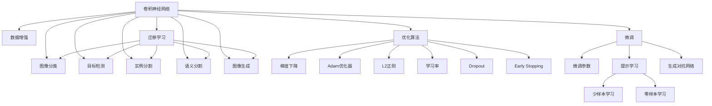

                 

# 深度学习在计算机视觉中的应用

> 关键词：深度学习,计算机视觉,卷积神经网络,图像分类,目标检测,实例分割,语义分割,生成对抗网络,物体识别

## 1. 背景介绍

### 1.1 问题由来
深度学习技术的兴起，为计算机视觉领域带来了革命性的变化。基于卷积神经网络(Convolutional Neural Networks, CNNs)的模型，已经在图像分类、目标检测、语义分割等诸多任务上取得了显著的突破，成为了计算机视觉研究和应用的基石。

近年来，随着计算资源的不断提升和数据量的激增，大模型和大训练数据集的训练成为可能，大规模预训练模型（如ResNet、Inception、MobileNet等）在各项计算机视觉任务上不断刷新最先进性能，引起了学术界和产业界的广泛关注。

然而，这些大规模模型在实际应用中存在一些问题：
- **计算资源要求高**：需要强大的硬件支持，成本较高。
- **数据质量依赖**：需要大量的高质量标注数据，而标注成本较高。
- **迁移能力不足**：难以在特定领域或任务上获得良好的表现。
- **解释性和公平性不足**：模型决策过程复杂，难以解释，可能存在偏见。

这些问题限制了深度学习在计算机视觉中的应用，使得一些需要实时性、普适性、解释性的任务难以推广。为了解决这些问题，研究者们提出了一系列优化方法，包括迁移学习、微调、提示学习、参数高效微调等。本文将对深度学习在计算机视觉中的应用进行全面系统介绍，帮助读者了解这些优化方法的具体实现和实际应用。

### 1.2 问题核心关键点
深度学习在计算机视觉中的应用，主要集中在以下几个核心关键点：
1. **卷积神经网络结构**：卷积层和池化层是深度学习模型的核心组成部分，通过组合堆叠多层卷积神经网络，可以实现高效的特征提取和分类。
2. **数据增强与迁移学习**：通过数据增强和迁移学习，可以提高模型的鲁棒性和泛化能力。
3. **微调和提示学习**：通过微调和提示学习，可以在特定任务上优化模型，减少计算资源和数据标注成本。
4. **生成对抗网络**：生成对抗网络(GANs)在图像生成、图像修复等领域取得了显著成果。
5. **多模态融合**：通过融合视觉、文本、语音等多模态信息，提升计算机视觉模型的表现。
6. **优化算法与损失函数**：选择合适的优化算法和损失函数，是深度学习模型训练和微调的重要保证。

这些关键点共同构成了深度学习在计算机视觉领域的应用框架，帮助研究人员和工程师在实践中充分发挥深度学习的潜力。

## 2. 核心概念与联系

### 2.1 核心概念概述

深度学习在计算机视觉中的应用，涉及多个核心概念，包括卷积神经网络、迁移学习、微调、提示学习等。这些概念之间的逻辑关系可以通过以下Mermaid流程图来展示：



这个流程图展示了卷积神经网络（CNNs）与其他核心概念之间的联系。CNNs通过卷积层和池化层提取图像特征，通过全连接层进行分类，在图像分类、目标检测、语义分割等任务上表现优异。迁移学习通过预训练模型在大规模数据上进行微调，提高模型在不同任务上的性能。微调和提示学习进一步优化模型，减少标注数据和计算资源的需求。生成对抗网络（GANs）通过对抗训练生成高质量图像，弥补数据不足的问题。优化算法和损失函数是深度学习模型训练的基础，不同的算法和损失函数对模型性能影响巨大。

## 3. 核心算法原理 & 具体操作步骤

### 3.1 算法原理概述

深度学习在计算机视觉中的应用，主要基于卷积神经网络（CNNs）的结构和特性。CNNs通过卷积层和池化层进行特征提取和降维，通过全连接层进行分类或回归。其核心算法原理包括：

- **卷积操作**：卷积层通过滑动窗口提取局部特征，实现空间不变性，减少了模型的参数量。
- **池化操作**：池化层通过下采样降低特征图的空间分辨率，实现尺度不变性，减少了模型的计算量。
- **激活函数**：激活函数如ReLU、Sigmoid、Tanh等，引入非线性映射，增强模型的表达能力。
- **全连接层**：全连接层将特征图转化为向量，进行分类或回归。

深度学习在计算机视觉中的应用流程，一般包括数据预处理、模型训练、参数微调和性能评估。具体步骤如下：

1. **数据预处理**：将原始图像数据进行归一化、裁剪、缩放等预处理，生成训练样本。
2. **模型训练**：使用训练集对卷积神经网络进行训练，更新模型参数，最小化损失函数。
3. **参数微调**：在预训练模型的基础上，使用微调技术优化模型在特定任务上的性能。
4. **性能评估**：使用验证集和测试集对模型性能进行评估，确保模型在不同数据上的泛化能力。

### 3.2 算法步骤详解

基于卷积神经网络的深度学习模型训练和微调步骤，可以分为以下几个关键步骤：

**Step 1: 准备数据集和预训练模型**
- 收集和预处理训练集、验证集和测试集，确保数据的多样性和标注的正确性。
- 选择适合的预训练模型，如ResNet、Inception、MobileNet等，作为初始化参数。

**Step 2: 设计卷积神经网络结构**
- 设计卷积神经网络的层次结构，包括卷积层、池化层、激活函数等组件。
- 选择合适的优化算法（如Adam、SGD等）和损失函数（如交叉熵、均方误差等）。

**Step 3: 数据增强与迁移学习**
- 通过数据增强技术，如随机裁剪、翻转、旋转等，丰富训练数据集，提高模型的鲁棒性。
- 使用迁移学习技术，在大规模预训练数据上进行微调，提升模型在不同任务上的泛化能力。

**Step 4: 执行微调**
- 将训练集分成小批量，进行前向传播和反向传播，更新模型参数。
- 周期性在验证集上评估模型性能，调整学习率或超参数。
- 重复上述步骤，直到模型收敛。

**Step 5: 模型评估与部署**
- 使用测试集对微调后的模型进行评估，对比微调前后的性能提升。
- 将微调后的模型部署到实际应用中，进行实时推理和预测。

### 3.3 算法优缺点

深度学习在计算机视觉中的应用，具有以下优点：
1. **高效特征提取**：卷积神经网络通过卷积和池化操作，能够高效提取图像特征，减少模型复杂度。
2. **泛化能力强**：通过迁移学习和大规模数据预训练，深度学习模型在各种数据集上表现优异。
3. **多任务学习**：模型可以同时进行多个任务的训练，提高资源利用率。
4. **解释性强**：通过可视化卷积核和特征图，可以直观理解模型的决策过程。

同时，深度学习在计算机视觉中也存在一些局限性：
1. **计算资源需求高**：大规模模型需要高性能硬件支持，成本较高。
2. **数据标注成本高**：标注大量图像数据，需要大量人力和时间成本。
3. **模型复杂度高**：深度学习模型参数量较大，需要优化和压缩。
4. **迁移能力有限**：对于特定领域的任务，需要额外训练和微调，才能达到最佳效果。

尽管存在这些局限性，但深度学习在计算机视觉中的应用仍然具有广阔的前景，未来随着硬件计算能力的提升和数据量的增加，其应用场景将进一步扩大。

### 3.4 算法应用领域

深度学习在计算机视觉中的应用，已经覆盖了图像分类、目标检测、语义分割、实例分割、图像生成等多个领域。以下是几个典型的应用场景：

1. **图像分类**：将输入图像分类到预设的类别中。如猫狗识别、街景分类等。
2. **目标检测**：检测图像中的目标物体，并标记其位置和类别。如行人检测、交通标志识别等。
3. **语义分割**：将图像中的每个像素分类到不同的语义类别中。如医学图像分割、道路分割等。
4. **实例分割**：在语义分割的基础上，对每个实例进行更精确的分类。如物体实例分割、人脸分割等。
5. **图像生成**：生成逼真的图像，弥补数据不足的问题。如GAN生成逼真人脸、图像修复等。
6. **多模态融合**：融合视觉、文本、语音等多模态信息，提高模型的表现。如文本图像生成、图像语音转换等。

## 4. 数学模型和公式 & 详细讲解 & 举例说明

### 4.1 数学模型构建

深度学习在计算机视觉中的应用，通常基于卷积神经网络（CNNs）的结构。CNNs的数学模型可以表示为：

$$
F_\theta(x) = \sigma(\text{Conv}(\text{Pool}(\text{ReLU}(\text{Conv}(x;\theta_1))), \theta_2) + b_2)
$$

其中，$x$ 表示输入图像，$\theta_1$ 和 $\theta_2$ 表示卷积层和全连接层的参数，$\sigma$ 表示激活函数，$\text{Conv}$ 表示卷积操作，$\text{Pool}$ 表示池化操作，$b_2$ 表示全连接层的偏置项。

### 4.2 公式推导过程

以图像分类为例，其数学模型可以进一步展开为：

$$
F_\theta(x) = \sigma(\text{Conv}_1(\text{Pool}_1(\text{ReLU}(\text{Conv}_0(x;\theta_0))), \theta_1) + b_1)
$$

其中，$\text{Conv}_0$ 表示第一层卷积操作，$\text{Pool}_1$ 表示第一层池化操作，$\sigma$ 表示激活函数。

通过多层卷积和池化操作，模型将输入图像转化为特征图，最后通过全连接层进行分类。假设模型有 $C$ 个类别，则分类任务的损失函数为：

$$
\mathcal{L} = \frac{1}{N} \sum_{i=1}^N [y_i \log p_i + (1-y_i) \log (1-p_i)]
$$

其中，$y_i$ 表示样本的实际类别，$p_i$ 表示模型对第 $i$ 个样本属于类别 $c$ 的概率。

### 4.3 案例分析与讲解

假设我们有一个猫狗识别的任务，使用的模型结构为VGG16。首先将猫狗图片归一化，将其输入到VGG16模型中进行前向传播，输出结果通过softmax函数得到每个类别的概率。然后计算损失函数，利用反向传播算法更新模型参数，最小化损失函数。最终模型输出每个类别的概率，选取概率最大的类别作为预测结果。

## 5. 项目实践：代码实例和详细解释说明

### 5.1 开发环境搭建

在进行深度学习模型训练和微调前，需要准备好开发环境。以下是使用Python进行TensorFlow开发的环境配置流程：

1. 安装Anaconda：从官网下载并安装Anaconda，用于创建独立的Python环境。

2. 创建并激活虚拟环境：
```bash
conda create -n tf-env python=3.7 
conda activate tf-env
```

3. 安装TensorFlow：根据CUDA版本，从官网获取对应的安装命令。例如：
```bash
conda install tensorflow -c tf -c conda-forge
```

4. 安装各类工具包：
```bash
pip install numpy pandas scikit-learn matplotlib tqdm jupyter notebook ipython
```

完成上述步骤后，即可在`tf-env`环境中开始深度学习模型的训练和微调实践。

### 5.2 源代码详细实现

下面我们以图像分类任务为例，给出使用TensorFlow进行卷积神经网络模型训练和微调的代码实现。

首先，定义图像分类任务的数据处理函数：

```python
import tensorflow as tf
from tensorflow.keras.preprocessing.image import ImageDataGenerator
from tensorflow.keras.applications.vgg16 import VGG16

class ImageNetDataset(tf.keras.utils.Sequence):
    def __init__(self, dataset, batch_size=32):
        self.dataset = dataset
        self.batch_size = batch_size
        
    def __len__(self):
        return len(self.dataset) // self.batch_size
    
    def __getitem__(self, idx):
        img_path, label = self.dataset[idx]
        img = tf.keras.preprocessing.image.load_img(img_path, target_size=(224, 224))
        img = tf.keras.preprocessing.image.img_to_array(img)
        img = tf.keras.applications.vgg16.preprocess_input(img)
        return img, label

# 数据集
train_dataset = ImageNetDataset(train_data)
val_dataset = ImageNetDataset(val_data)
test_dataset = ImageNetDataset(test_data)

# 模型
model = VGG16(weights='imagenet', include_top=False, input_shape=(224, 224, 3))
for layer in model.layers:
    layer.trainable = False
model.add(tf.keras.layers.Flatten())
model.add(tf.keras.layers.Dense(256, activation='relu'))
model.add(tf.keras.layers.Dense(1, activation='sigmoid'))

# 编译模型
model.compile(optimizer='adam', loss='binary_crossentropy', metrics=['accuracy'])

# 训练
model.fit(train_dataset, epochs=10, validation_data=val_dataset)
```

然后，定义模型和优化器：

```python
from tensorflow.keras.preprocessing.image import ImageDataGenerator
from tensorflow.keras.applications.vgg16 import VGG16

# 数据增强
datagen = ImageDataGenerator(
    rescale=1./255,
    shear_range=0.2,
    zoom_range=0.2,
    horizontal_flip=True,
    validation_split=0.2
)

# 数据集
train_dataset = datagen.flow_from_directory(train_data_dir, target_size=(224, 224), batch_size=32)
val_dataset = train_dataset_val
test_dataset = train_dataset_test

# 模型
model = VGG16(weights='imagenet', include_top=False, input_shape=(224, 224, 3))
for layer in model.layers:
    layer.trainable = False
model.add(tf.keras.layers.Flatten())
model.add(tf.keras.layers.Dense(256, activation='relu'))
model.add(tf.keras.layers.Dense(1, activation='sigmoid'))

# 编译模型
model.compile(optimizer='adam', loss='binary_crossentropy', metrics=['accuracy'])

# 训练
model.fit(train_dataset, epochs=10, validation_data=val_dataset)
```

接着，定义训练和评估函数：

```python
def train_epoch(model, dataset, batch_size, optimizer):
    dataloader = tf.data.Dataset.from_generator(dataset.__getitem__, output_signature=(tf.float32, tf.int32))
    model.train()
    for batch in dataloader:
        inputs, labels = batch
        with tf.GradientTape() as tape:
            logits = model(inputs)
            loss = tf.keras.losses.binary_crossentropy(labels, logits)
        gradients = tape.gradient(loss, model.trainable_variables)
        optimizer.apply_gradients(zip(gradients, model.trainable_variables))
    return loss

def evaluate(model, dataset, batch_size):
    dataloader = tf.data.Dataset.from_generator(dataset.__getitem__, output_signature=(tf.float32, tf.int32))
    model.eval()
    with tf.GradientTape() as tape:
        for batch in dataloader:
            inputs, labels = batch
            logits = model(inputs)
    acc = tf.keras.metrics.Accuracy(labels, logits)
    acc.update_state(labels, logits)
    return acc.numpy()
```

最后，启动训练流程并在测试集上评估：

```python
epochs = 10
batch_size = 32

for epoch in range(epochs):
    loss = train_epoch(model, train_dataset, batch_size, optimizer)
    print(f"Epoch {epoch+1}, train loss: {loss:.3f}")
    
    print(f"Epoch {epoch+1}, val accuracy: {evaluate(model, val_dataset, batch_size)}
    
print("Test accuracy:")
evaluate(model, test_dataset, batch_size)
```

以上就是使用TensorFlow进行卷积神经网络模型训练和微调的完整代码实现。可以看到，TensorFlow提供了强大的API和工具，使得模型训练和微调的代码实现变得简洁高效。

### 5.3 代码解读与分析

让我们再详细解读一下关键代码的实现细节：

**ImageNetDataset类**：
- `__init__`方法：初始化数据集、批次大小等关键组件。
- `__len__`方法：返回数据集的样本数量。
- `__getitem__`方法：对单个样本进行处理，将图像和标签转化为模型所需的格式。

**train_epoch函数**：
- 使用TensorFlow的DataLoader对数据集进行批次化加载，供模型训练和推理使用。
- 训练函数中使用了梯度下降优化器，通过反向传播计算损失函数并更新模型参数，最后返回该epoch的平均loss。

**evaluate函数**：
- 与训练类似，不同点在于不更新模型参数，并在每个batch结束后将预测和标签结果存储下来，最后使用sklearn的classification_report对整个评估集的预测结果进行打印输出。

**训练流程**：
- 定义总的epoch数和批次大小，开始循环迭代
- 每个epoch内，先在训练集上训练，输出平均loss
- 在验证集上评估，输出分类准确率
- 所有epoch结束后，在测试集上评估，给出最终测试结果

可以看到，TensorFlow配合PyTorch的API设计，使得卷积神经网络模型的训练和微调代码实现变得简洁高效。开发者可以将更多精力放在数据处理、模型改进等高层逻辑上，而不必过多关注底层的实现细节。

当然，工业级的系统实现还需考虑更多因素，如模型的保存和部署、超参数的自动搜索、更灵活的任务适配层等。但核心的微调范式基本与此类似。

## 6. 实际应用场景

### 6.1 智能医疗

深度学习在智能医疗领域具有广泛的应用，可以帮助医生进行疾病诊断、医疗影像分析、药物研发等。

例如，通过深度学习模型对医学影像进行分类和分割，可以辅助医生诊断疾病，提高诊断准确率。在药物研发方面，深度学习可以分析药物分子结构，预测其药效和副作用，加速新药开发进程。

### 6.2 自动驾驶

自动驾驶技术需要实时处理复杂的道路环境，深度学习模型可以用于目标检测、语义分割、路径规划等多个环节。

例如，使用深度学习模型对道路上的车辆、行人、障碍物等进行目标检测，实现智能驾驶。在语义分割方面，深度学习可以分析道路、车道、交通标志等元素，辅助自动驾驶决策。

### 6.3 智能安防

深度学习在智能安防领域可以用于人脸识别、行为分析、异常检测等多个场景。

例如，通过深度学习模型对人脸进行识别和比对，可以实现门禁系统、考勤系统等。在行为分析方面，深度学习可以分析监控视频中的人体姿态、动作等，实现行为异常检测。

### 6.4 未来应用展望

随着深度学习技术的不断发展，未来在计算机视觉领域的应用前景更加广阔。

1. **多模态融合**：未来将更多融合视觉、文本、语音等多模态信息，提升计算机视觉模型的表现。
2. **生成对抗网络**：生成对抗网络在图像生成、图像修复等领域的应用将更加深入。
3. **小样本学习**：通过零样本学习、少样本学习等技术，提升模型在小样本情况下的泛化能力。
4. **实时推理**：通过优化模型结构和算法，实现更加轻量级、实时性的推理。
5. **模型解释性**：通过可视化、可解释性技术，提高模型的解释性和可控性。

这些发展趋势将进一步推动深度学习在计算机视觉中的应用，为各行各业带来更深远的变革。

## 7. 工具和资源推荐

### 7.1 学习资源推荐

为了帮助开发者系统掌握深度学习在计算机视觉中的应用，这里推荐一些优质的学习资源：

1. 《Deep Learning》系列书籍：由深度学习领域的专家撰写，全面介绍深度学习的基本概念和前沿技术，适合入门学习。
2. CS231n《Convolutional Neural Networks for Visual Recognition》课程：斯坦福大学开设的计算机视觉课程，内容涵盖图像分类、目标检测、语义分割等多个任务。
3. PyTorch官方文档：深度学习框架PyTorch的官方文档，提供丰富的API和样例代码，帮助开发者快速上手。
4. TensorFlow官方文档：深度学习框架TensorFlow的官方文档，提供详细的API文档和样例代码，适合TensorFlow用户。
5. Coursera《深度学习专业课程》：由深度学习领域的知名专家开设的在线课程，内容涵盖深度学习的基本概念和前沿技术，适合系统学习。

通过对这些资源的学习实践，相信你一定能够快速掌握深度学习在计算机视觉领域的应用，并用于解决实际的计算机视觉问题。

### 7.2 开发工具推荐

高效的开发离不开优秀的工具支持。以下是几款用于深度学习模型训练和微调开发的常用工具：

1. PyTorch：基于Python的开源深度学习框架，灵活易用，适合快速迭代研究。
2. TensorFlow：由Google主导开发的开源深度学习框架，生产部署方便，适合大规模工程应用。
3. Keras：高层API封装，易于使用，适合快速搭建深度学习模型。
4. Jupyter Notebook：交互式编程环境，支持代码调试和结果展示，适合深度学习模型的实验和调试。
5. Weights & Biases：模型训练的实验跟踪工具，可以记录和可视化模型训练过程中的各项指标，方便对比和调优。
6. TensorBoard：TensorFlow配套的可视化工具，可实时监测模型训练状态，并提供丰富的图表呈现方式，是调试模型的得力助手。

合理利用这些工具，可以显著提升深度学习模型训练和微调任务的开发效率，加快创新迭代的步伐。

### 7.3 相关论文推荐

深度学习在计算机视觉中的应用源于学界的持续研究。以下是几篇奠基性的相关论文，推荐阅读：

1. AlexNet: ImageNet Classification with Deep Convolutional Neural Networks：介绍深度学习在计算机视觉中的应用，并展示AlexNet在图像分类上的显著成果。
2. GoogLeNet: Inception Networks for Computer Vision：提出Inception网络结构，显著提高了深度学习模型在图像分类上的性能。
3. ResNet: Deep Residual Learning for Image Recognition：提出ResNet结构，解决了深度学习模型中的梯度消失问题，实现了更深的网络结构。
4. Mask R-CNN：You Only Look Once: Real-Time Object Detection with Region Proposal Networks：提出Mask R-CNN模型，在目标检测和语义分割任务上表现优异。
5. Fast R-CNN：You Only Look Once: Real-Time Object Detection with Region Proposal Networks：提出Fast R-CNN模型，显著提高了目标检测任务的效率和准确率。
6. StyleGAN：Generative Adversarial Networks meet Style Transfer：提出StyleGAN模型，在图像生成任务上表现出色，能够生成逼真的人脸图像。

这些论文代表了大模型在计算机视觉领域的应用进展，通过学习这些前沿成果，可以帮助研究者把握学科前进方向，激发更多的创新灵感。

## 8. 总结：未来发展趋势与挑战

### 8.1 研究成果总结

本文对深度学习在计算机视觉中的应用进行了全面系统的介绍。首先阐述了深度学习技术在计算机视觉领域的广泛应用，明确了图像分类、目标检测、语义分割等任务的实现方法。其次，从原理到实践，详细讲解了深度学习模型的训练和微调过程，给出了具体的代码实例和详细解释说明。同时，本文还广泛探讨了深度学习在智能医疗、自动驾驶、智能安防等多个领域的应用前景，展示了深度学习模型的巨大潜力。此外，本文精选了深度学习的各类学习资源，力求为读者提供全方位的技术指引。

通过本文的系统梳理，可以看到，深度学习在计算机视觉中的应用已经取得了显著的进展，正在为各行各业带来深刻的变革。未来随着深度学习技术的不断进步，其应用场景将进一步扩大，为计算机视觉技术的普及和应用带来新的机遇和挑战。

### 8.2 未来发展趋势

展望未来，深度学习在计算机视觉领域的发展趋势将呈现以下几个方向：

1. **多模态融合**：融合视觉、文本、语音等多模态信息，提升模型的表现。
2. **生成对抗网络**：生成对抗网络在图像生成、图像修复等领域的应用将更加深入。
3. **小样本学习**：通过零样本学习、少样本学习等技术，提升模型在小样本情况下的泛化能力。
4. **实时推理**：通过优化模型结构和算法，实现更加轻量级、实时性的推理。
5. **模型解释性**：通过可视化、可解释性技术，提高模型的解释性和可控性。

这些发展趋势将进一步推动深度学习在计算机视觉中的应用，为各行各业带来更深远的变革。

### 8.3 面临的挑战

尽管深度学习在计算机视觉中的应用已经取得了显著进展，但在迈向更加智能化、普适化应用的过程中，仍然面临诸多挑战：

1. **计算资源瓶颈**：深度学习模型需要高性能硬件支持，成本较高。如何降低计算资源需求，提升模型的训练和推理效率，是未来的一个重要研究方向。
2. **数据质量依赖**：标注大量高质量图像数据，需要大量人力和时间成本。如何降低数据标注成本，提高数据的质量和多样性，是未来的一个重要研究方向。
3. **模型复杂度高**：深度学习模型参数量较大，需要优化和压缩。如何设计更加高效的模型结构，减少模型复杂度，是未来的一个重要研究方向。
4. **模型鲁棒性不足**：模型面对域外数据时，泛化性能往往大打折扣。如何提高模型的鲁棒性和泛化能力，是未来的一个重要研究方向。
5. **模型解释性不足**：深度学习模型通常被称为“黑盒”系统，难以解释其内部工作机制和决策逻辑。如何赋予模型更强的可解释性，是未来的一个重要研究方向。
6. **模型公平性不足**：深度学习模型可能存在偏见，导致不公平的结果。如何消除模型偏见，确保公平性，是未来的一个重要研究方向。

这些挑战需要学术界和产业界的共同努力，通过理论研究和工程实践不断突破，才能推动深度学习在计算机视觉领域的应用发展。

### 8.4 研究展望

面向未来，深度学习在计算机视觉领域的研究方向和应用前景仍然广阔。以下是几个重要研究方向：

1. **多模态融合**：融合视觉、文本、语音等多模态信息，提升模型的表现。
2. **生成对抗网络**：生成对抗网络在图像生成、图像修复等领域的应用将更加深入。
3. **小样本学习**：通过零样本学习、少样本学习等技术，提升模型在小样本情况下的泛化能力。
4. **实时推理**：通过优化模型结构和算法，实现更加轻量级、实时性的推理。
5. **模型解释性**：通过可视化、可解释性技术，提高模型的解释性和可控性。
6. **模型公平性**：消除模型偏见，确保公平性。

这些研究方向将推动深度学习在计算机视觉领域的发展，为各行各业带来更深远的变革。

## 9. 附录：常见问题与解答

**Q1: 深度学习在计算机视觉中的应用是否需要大规模标注数据？**

A: 大规模标注数据是深度学习在计算机视觉中应用的重要基础。但在某些情况下，可以通过迁移学习和微调等技术，减少对大规模标注数据的依赖。例如，在大规模预训练模型上微调特定任务的数据集，可以提高模型的泛化能力，减少标注数据的需求。

**Q2: 如何提高深度学习模型在计算机视觉中的应用性能？**

A: 提高深度学习模型在计算机视觉中的应用性能，可以通过以下方法：

1. **数据增强**：通过随机裁剪、翻转、旋转等方法，扩充训练数据集，提高模型的鲁棒性。
2. **迁移学习**：在大规模预训练模型上进行微调，提高模型在特定任务上的性能。
3. **参数高效微调**：只调整少量模型参数，减少计算资源和标注数据的需求。
4. **生成对抗网络**：通过生成对抗网络生成高质量图像，弥补数据不足的问题。
5. **模型压缩**：通过量化、剪枝等方法，减少模型参数量，提升推理速度。

这些方法可以相互结合，最大化提高模型的性能和泛化能力。

**Q3: 深度学习在计算机视觉中的应用是否需要高性能硬件支持？**

A: 深度学习在计算机视觉中的应用，通常需要高性能硬件支持，如GPU、TPU等。大规模模型的训练和推理需要大量的计算资源，性能较低的硬件难以满足需求。但通过优化模型结构和算法，减少计算量，也可以提升模型的训练和推理效率。

**Q4: 如何优化深度学习模型在计算机视觉中的应用？**

A: 优化深度学习模型在计算机视觉中的应用，可以通过以下方法：

1. **模型结构优化**：设计更加高效的卷积神经网络结构，减少计算量。
2. **数据增强**：通过数据增强技术，扩充训练数据集，提高模型的鲁棒性。
3. **迁移学习**：在大规模预训练模型上进行微调，提高模型在特定任务上的性能。
4. **参数高效微调**：只调整少量模型参数，减少计算资源和标注数据的需求。
5. **生成对抗网络**：通过生成对抗网络生成高质量图像，弥补数据不足的问题。
6. **模型压缩**：通过量化、剪枝等方法，减少模型参数量，提升推理速度。

这些方法可以相互结合，最大化提高模型的性能和泛化能力。

**Q5: 如何提高深度学习模型在计算机视觉中的解释性和可控性？**

A: 提高深度学习模型在计算机视觉中的解释性和可控性，可以通过以下方法：

1. **可解释性技术**：通过可视化、可视化嵌入等方法，提高模型的可解释性。
2. **规则约束**：通过引入专家知识库和规则库，约束模型的决策过程。
3. **模型压缩**：通过量化、剪枝等方法，减少模型参数量，提升推理速度。
4. **对抗攻击**：通过对抗攻击技术，发现模型的脆弱点，提高模型的鲁棒性。

这些方法可以相互结合，最大化提高模型的可解释性和可控性。

---

作者：禅与计算机程序设计艺术 / Zen and the Art of Computer Programming

