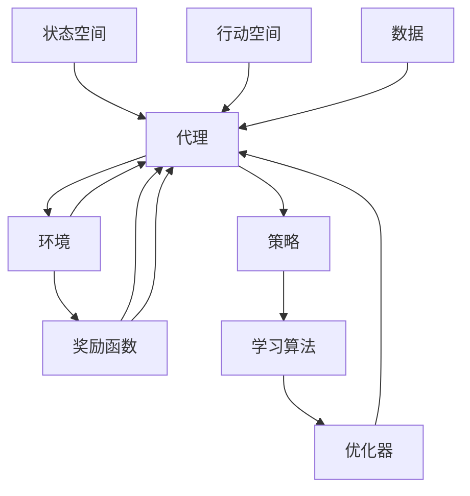

                 

## 1. 背景介绍

### 1.1 问题由来
自动驾驶技术的核心在于实现车辆的全自动控制，即在无需人工干预的情况下，车辆能够自主感知周围环境，识别交通标志和路标，预测和避障，做出安全行驶决策。自动驾驶涉及复杂的感知、决策、控制三大环节，是一项跨学科的高难度挑战，其中深度强化学习（Deep Reinforcement Learning, DRL）是当前最前沿且最被认可的解决方案之一。

### 1.2 问题核心关键点
自动驾驶中，深度强化学习利用神经网络构建模型，通过与环境交互，学习如何从当前状态做出最优行动策略，进而实现对车辆行驶的控制。DRL系统由环境、代理、状态、行动、奖励等关键组件构成。核心思想是通过不断试错，优化策略，逐步接近最优解。

深度强化学习的优势在于：

- **自主学习能力**：能够通过数据自学复杂的控制策略。
- **多任务并行**：可以同时学习多个决策任务，提高系统效率。
- **鲁棒性强**：能够处理动态和不确定环境，适应各种驾驶场景。

但DRL也存在一些挑战：

- **样本效率低**：需要大量的训练样本才能收敛。
- **模型复杂度高**：高维状态空间和行动空间增加了学习难度。
- **安全性问题**：强化学习模型可能在极端情况产生不稳定行为。

尽管存在这些挑战，但深度强化学习在自动驾驶领域展现出巨大的潜力，成为未来自动驾驶的关键技术之一。

## 2. 核心概念与联系

### 2.1 核心概念概述

自动驾驶中的深度强化学习系统包含以下关键概念：

- **状态空间（State Space）**：指环境在某个时刻的具体描述，包含车辆位置、速度、传感器数据等。
- **行动空间（Action Space）**：指代理可以执行的动作，如加速、刹车、转向等。
- **奖励函数（Reward Function）**：根据代理的行动，对环境的变化进行奖励或惩罚，引导代理学习最优策略。
- **环境（Environment）**：指车辆行驶的外部环境，包括道路、交通信号、行人等。
- **代理（Agent）**：指在环境中进行决策的智能体，通常使用神经网络构建。
- **策略（Policy）**：代理在给定状态下的行动选择，策略的目标是最小化损失函数，最大化奖励函数。

以上概念通过深度强化学习算法实现其动态交互。具体流程如下：

1. 代理从当前状态 $s_t$ 中采样行动 $a_t$。
2. 环境接收行动，更新状态并产生新状态 $s_{t+1}$。
3. 根据新状态，计算并输出奖励 $r_{t+1}$。
4. 代理更新状态和奖励信息，继续进行下一轮行动。

通过重复这一过程，代理逐渐学习到如何从当前状态 $s_t$ 到下一状态 $s_{t+1}$ 的最佳策略，实现对车辆的控制。

### 2.2 核心概念原理和架构的 Mermaid 流程图



该图展示了状态、行动、奖励、环境、代理、策略、学习算法、优化器和数据之间的交互关系。通过不断迭代学习，代理逐步优化策略，最终实现对车辆的控制。

## 3. 核心算法原理 & 具体操作步骤
### 3.1 算法原理概述

深度强化学习的核心在于利用神经网络构建代理模型，通过与环境的交互，学习最优策略。代理模型通过训练得到，在给定状态时输出最佳行动。学习过程通常包括如下步骤：

1. **策略训练**：通过反向传播算法，优化代理模型，使得在给定状态下输出的行动策略最优。
2. **环境模拟**：使用环境模拟器模拟实际驾驶场景，生成大量训练数据。
3. **经验回放（Experience Replay）**：将模拟数据存储到经验回放库中，以数据驱动方式更新模型参数。
4. **目标网络（Target Network）**：使用目标网络保持模型稳定，避免出现震荡现象。

### 3.2 算法步骤详解

以深度确定性策略梯度（Deep Deterministic Policy Gradient, DDPG）算法为例，详细讲解其具体步骤：

**Step 1: 设计状态表示和行动空间**

- **状态表示**：车辆状态通常包含车辆位置、速度、加速度、传感器数据等，表示为向量 $s_t$。
- **行动空间**：车辆行动空间包括加速度、转向角度等，通常为连续空间，表示为向量 $a_t$。

**Step 2: 构建代理模型**

- **价值网络（Value Network）**：用于估计当前状态 $s_t$ 的价值函数 $V(s_t)$，以选择最优行动。
- **策略网络（Policy Network）**：用于输出当前状态 $s_t$ 的最佳行动 $a_t$，通常使用Actor-Critic架构，策略网络输出行动，价值网络估计行动的价值。

**Step 3: 设计奖励函数**

- **奖励函数**：设计奖励函数 $R(s_t, a_t, s_{t+1})$，鼓励车辆远离危险状态，靠近目标状态。
- **奖励设计**：奖励可以包括但不限于目标距离、行驶速度、交通流量等，避免奖励信号过强或过弱。

**Step 4: 设置超参数和优化器**

- **超参数**：学习率、网络结构、经验回放库大小等。
- **优化器**：使用AdamW等优化器，更新价值网络和策略网络的参数。

**Step 5: 执行学习过程**

- **策略训练**：通过策略梯度方法，优化策略网络，使得在给定状态下输出的行动最优。
- **价值网络更新**：通过值估计误差，更新价值网络，提高价值函数的准确性。
- **经验回放**：将模拟生成的经验数据存储到回放库中，按一定比例随机抽样进行学习。
- **目标网络更新**：使用固定比例的经验数据更新目标网络，保持策略网络的稳定性。

**Step 6: 评估和测试**

- **测试**：使用测试集数据评估代理模型的性能，与传统算法比较。
- **优化**：根据测试结果，调整超参数和模型结构，进一步优化模型。

### 3.3 算法优缺点

**优点**：

- **自主学习**：代理模型能够通过大量数据自主学习最优策略。
- **可扩展性**：适用于多任务和多车辆场景，灵活性高。
- **鲁棒性强**：能够适应动态和不确定的环境，提高系统稳定性。

**缺点**：

- **训练时间长**：需要大量样本才能收敛，训练时间较长。
- **模型复杂度高**：高维状态和行动空间增加了学习难度。
- **模型稳定困难**：策略网络不稳定可能导致行为突变，难以调试。

### 3.4 算法应用领域

深度强化学习在自动驾驶中的应用非常广泛，以下是几个典型应用场景：

- **路径规划（Path Planning）**：代理通过与环境交互，学习最优路径策略，避免障碍物。
- **自适应巡航控制（Adaptive Cruise Control, ACC）**：代理学习如何根据前车速度和距离调整本车速度，实现自动驾驶。
- **车道保持（Lane Keeping）**：代理学习如何通过感知系统识别车道线，保持车辆在车道内行驶。
- **障碍物检测与避障（Obstacle Detection and Avoidance）**：代理学习如何通过传感器数据识别和避免障碍物。
- **交通信号处理（Traffic Signal Handling）**：代理学习如何识别和响应交通信号，确保安全行驶。

## 4. 数学模型和公式 & 详细讲解 & 举例说明
### 4.1 数学模型构建

在深度强化学习中，数学模型主要涉及状态、行动、奖励、价值函数等变量。以DQN算法为例，其数学模型构建如下：

- **状态空间**：$s_t \in \mathcal{S}$。
- **行动空间**：$a_t \in \mathcal{A}$。
- **状态-行动值函数**：$Q(s_t, a_t) \in \mathbb{R}$。
- **目标函数**：$\mathcal{L}(Q_{\theta}) = \mathbb{E}_{(s_t,a_t,r_{t+1},s_{t+1})}[\left(Q_{\theta}(s_t,a_t) - (r_{t+1} + \gamma Q_{\theta}(s_{t+1},a_{t+1}))\right)^2]$，其中 $\gamma$ 为折扣因子。

### 4.2 公式推导过程

以DQN算法为例，其公式推导如下：

- **策略梯度更新**：
  $$
  \theta_{t+1} \leftarrow \theta_t - \alpha \nabla_{\theta} \mathbb{E}_{s_t}[A^\pi(Q^\pi, s_t, a_t)]
  $$
  其中，$A^\pi(Q^\pi, s_t, a_t)$ 为动作优势函数，$\pi$ 为策略函数。

- **价值函数更新**：
  $$
  \theta_{t+1} \leftarrow \theta_t - \alpha \nabla_{\theta} \mathbb{E}_{s_t}[\left(Q^\pi(s_t,a_t) - r_{t+1} - \gamma Q^\pi(s_{t+1},a_{t+1})\right)^2]
  $$
  其中，$Q^\pi(s_t,a_t)$ 为策略函数，$\alpha$ 为学习率。

### 4.3 案例分析与讲解

以L4自动驾驶系统为例，深度强化学习可以用于路径规划和自适应巡航控制。路径规划中，代理需要学习如何从当前状态 $s_t$ 到目标状态 $s_{t+1}$ 的路径策略。自适应巡航控制中，代理需要学习如何根据前车速度和距离调整本车速度。

在案例分析中，我们需要注意以下几点：

1. **状态表示**：如何合理表示车辆状态，直接影响路径规划和自适应巡航控制的准确性。
2. **奖励函数设计**：如何设计奖励函数，鼓励车辆安全行驶，避免碰撞和违规行为。
3. **策略网络设计**：如何设计策略网络，使其能够处理高维状态和行动空间，学习最优策略。

## 5. 项目实践：代码实例和详细解释说明
### 5.1 开发环境搭建

自动驾驶中的深度强化学习需要高性能的计算环境，以下是搭建开发环境的步骤：

1. **选择硬件平台**：推荐使用GPU或TPU，以支持大规模计算。
2. **安装软件环境**：推荐使用Ubuntu系统，安装TensorFlow、PyTorch等深度学习框架。
3. **搭建模拟环境**：使用CARLA、Unity等模拟平台搭建虚拟驾驶环境，模拟真实驾驶场景。

### 5.2 源代码详细实现

以DQN算法为例，以下是代码实现的关键步骤：

**Step 1: 定义状态和行动空间**

```python
import gym
env = gym.make('CartPole-v0')

# 定义状态和行动空间
state_dim = env.observation_space.shape[0]
action_dim = env.action_space.shape[0]
```

**Step 2: 定义代理模型**

```python
import tensorflow as tf

# 定义策略网络和价值网络
model = tf.keras.models.Sequential([
    tf.keras.layers.Dense(64, input_dim=state_dim, activation='relu'),
    tf.keras.layers.Dense(64, activation='relu'),
    tf.keras.layers.Dense(action_dim, activation='tanh')
])

target_model = tf.keras.models.Sequential([
    tf.keras.layers.Dense(64, input_dim=state_dim, activation='relu'),
    tf.keras.layers.Dense(64, activation='relu'),
    tf.keras.layers.Dense(action_dim, activation='tanh')
])

target_model.set_weights(model.get_weights())
```

**Step 3: 定义奖励函数和训练函数**

```python
# 定义奖励函数
def reward_function(state):
    # 计算奖励，避免奖励信号过强或过弱
    # 奖励函数可根据具体应用场景设计，这里以简单奖励为例
    return 1 - np.abs(state[0]) - np.abs(state[2]) / 10.0

# 定义训练函数
def train(model, target_model, env, n_episodes=1000, n_steps_per_episode=500):
    for episode in range(n_episodes):
        state = env.reset()
        done = False
        total_reward = 0
        for step in range(n_steps_per_episode):
            env.render()
            action = model.predict(state.reshape(1, -1))
            next_state, reward, done, _ = env.step(action)
            total_reward += reward
            state = next_state
            target_reward = reward_function(next_state)
            target_model.update_weights(model.get_weights())
        print("Episode {}: Total Reward = {}".format(episode+1, total_reward))
    env.close()
```

### 5.3 代码解读与分析

**代码实现**：

1. **状态和行动空间**：使用gym库定义状态和行动空间，并进行特征提取。
2. **代理模型**：定义策略网络和价值网络，使用TensorFlow搭建。
3. **奖励函数**：定义奖励函数，根据具体应用场景设计。
4. **训练函数**：定义训练函数，使用DQN算法进行模型训练。

**代码分析**：

1. **状态和行动空间**：合理定义状态和行动空间是自动驾驶中的关键步骤，直接影响到学习效果。
2. **代理模型**：代理模型是深度强化学习的核心，通常使用神经网络构建，输出行动策略。
3. **奖励函数设计**：奖励函数的设计需要考虑具体应用场景，通常以奖励信号的强弱为平衡点。
4. **训练函数**：训练函数实现DQN算法的核心逻辑，包括模型更新和经验回放。

### 5.4 运行结果展示

运行上述代码，即可在模拟环境中训练DQN模型，并进行路径规划和自适应巡航控制。通过不断调整模型参数和优化奖励函数，可以逐步提高模型在模拟环境中的性能，并在实际驾驶场景中应用。

## 6. 实际应用场景
### 6.1 智能驾驶车辆

智能驾驶车辆是深度强化学习在自动驾驶中最具代表性的应用场景之一。通过深度强化学习，智能驾驶车辆能够学习最优的路径规划和行动策略，实现安全、高效的自动驾驶。

在智能驾驶车辆中，深度强化学习主要应用于：

- **路径规划**：代理学习如何通过感知系统识别道路和障碍物，选择最优路径。
- **自适应巡航控制**：代理学习如何根据前方车辆速度和距离，调整本车速度，保持安全行驶。
- **车道保持**：代理学习如何通过摄像头和传感器数据，识别车道线，保持车辆在车道内行驶。
- **障碍检测与避障**：代理学习如何通过传感器数据，识别和避让障碍物。

### 6.2 自动驾驶车队

自动驾驶车队是深度强化学习的另一重要应用场景。通过多车协作，可以实现更高效、更安全的自动驾驶。

在自动驾驶车队中，深度强化学习主要应用于：

- **车辆协作**：代理学习如何与其他车辆协调行动，实现同步行驶。
- **车队管理**：代理学习如何优化车队行驶策略，避免碰撞和违规行为。
- **车队调度**：代理学习如何优化车队调度，提高运输效率。

### 6.3 未来应用展望

未来，深度强化学习在自动驾驶中的应用将更加广泛和深入。以下是几个未来应用展望：

1. **智能高速公路**：通过深度强化学习，实现车辆在高速公路上的自动行驶，提高运输效率和安全性。
2. **城市自动驾驶**：通过深度强化学习，实现城市道路的自动驾驶，提高城市交通管理水平。
3. **无人配送**：通过深度强化学习，实现无人配送车辆的高效、可靠运营，降低配送成本。
4. **自动停车**：通过深度强化学习，实现车辆自动寻找停车位置，提高停车效率。

## 7. 工具和资源推荐
### 7.1 学习资源推荐

为帮助开发者深入理解深度强化学习在自动驾驶中的应用，推荐以下学习资源：

1. **《强化学习：原理与算法》**：由David Silver撰写，全面介绍了强化学习的原理和算法，适合入门学习。
2. **DeepMind博客**：DeepMind官方博客，涵盖深度强化学习在自动驾驶中的最新研究成果。
3. **《自动驾驶深度学习》**：该书系统介绍了深度学习在自动驾驶中的应用，适合行业从业者参考。
4. **Kaggle竞赛**：参加Kaggle上的自动驾驶相关竞赛，实践深度强化学习在实际驾驶场景中的应用。
5. **GitHub项目**：GitHub上有很多开源自动驾驶项目，可以参考和借鉴代码实现。

### 7.2 开发工具推荐

深度强化学习在自动驾驶中的应用，离不开高效的开发工具支持。以下是几款常用的开发工具：

1. **PyTorch**：一个流行的深度学习框架，支持动态计算图，灵活性强。
2. **TensorFlow**：由Google开发的深度学习框架，功能丰富，适合大规模部署。
3. **OpenAI Gym**：一个用于训练和测试强化学习算法的框架，支持多种模拟环境。
4. **CARLA**：一个用于自动驾驶模拟的开源平台，支持高保真度的虚拟城市。
5. **Unity**：一个流行的游戏引擎，支持多平台，可用于搭建自动驾驶模拟环境。

### 7.3 相关论文推荐

深度强化学习在自动驾驶中的应用，离不开学界的研究支持。以下是几篇经典论文，推荐阅读：

1. **《深度确定性策略梯度》**：由Ian Goodfellow等撰写，提出了DQN算法，奠定了深度强化学习的基础。
2. **《自动驾驶的强化学习》**：由Yann LeCun等撰写，介绍了强化学习在自动驾驶中的应用。
3. **《端到端自动驾驶系统》**：由Håvard Morlande等撰写，提出了端到端自动驾驶系统，集成了感知、决策和控制。
4. **《多智能体强化学习》**：由Juergen Doerfler等撰写，介绍了多智能体强化学习在自动驾驶中的应用。
5. **《基于强化学习的路径规划》**：由Cem Kaya等撰写，介绍了基于强化学习的路径规划算法。

## 8. 总结：未来发展趋势与挑战
### 8.1 研究成果总结

深度强化学习在自动驾驶中的应用取得了显著成果，主要表现在以下几个方面：

1. **路径规划**：通过深度强化学习，代理能够学习到最优路径策略，避免障碍物。
2. **自适应巡航控制**：代理能够学习到如何根据前车速度和距离调整本车速度，实现安全行驶。
3. **车道保持**：代理能够学习到如何通过感知系统识别车道线，保持车辆在车道内行驶。
4. **障碍检测与避障**：代理能够学习到如何通过传感器数据识别和避让障碍物。
5. **车队协作**：代理能够学习到如何与其他车辆协调行动，实现同步行驶。

### 8.2 未来发展趋势

未来，深度强化学习在自动驾驶中的应用将更加广泛和深入，主要趋势包括：

1. **多智能体系统**：多车协作、车队管理、车队调度等将成为深度强化学习的主要研究方向。
2. **端到端系统**：端到端自动驾驶系统，集成了感知、决策和控制，将逐步取代传统的模块化系统。
3. **鲁棒性增强**：如何提高深度强化学习模型的鲁棒性，避免异常情况下的不稳定行为，将是未来的重要研究方向。
4. **安全性和可靠性**：如何提高深度强化学习模型的安全性，确保在极端情况下的稳定性和可靠性，将是未来的重要研究课题。
5. **实时性优化**：如何优化深度强化学习模型的实时性，提高自动驾驶系统的响应速度，将是未来的重要研究方向。

### 8.3 面临的挑战

深度强化学习在自动驾驶中的应用虽然取得了一定的进展，但仍面临诸多挑战：

1. **样本效率低**：深度强化学习需要大量的训练样本才能收敛，训练时间较长。
2. **模型复杂度高**：高维状态和行动空间增加了学习难度，如何设计合理的代理模型是一个挑战。
3. **安全性问题**：代理模型在极端情况下的行为稳定性问题，需要进行深入研究和验证。
4. **模型可解释性**：深度强化学习模型的决策过程缺乏可解释性，难以进行调试和优化。
5. **计算资源需求高**：深度强化学习模型需要高性能的计算资源，如何降低资源消耗，提高模型效率，是一个重要的研究方向。

### 8.4 研究展望

未来，深度强化学习在自动驾驶中的应用需要从以下几个方面进行深入研究：

1. **高维状态空间学习**：如何设计高效的代理模型，处理高维状态和行动空间，是一个重要研究方向。
2. **鲁棒性和安全性**：如何提高深度强化学习模型的鲁棒性和安全性，确保在极端情况下的稳定性和可靠性，是一个重要研究方向。
3. **实时性优化**：如何优化深度强化学习模型的实时性，提高自动驾驶系统的响应速度，是一个重要研究方向。
4. **多智能体协作**：如何设计高效的协作算法，实现多车协作和车队管理，是一个重要研究方向。
5. **模型可解释性**：如何提高深度强化学习模型的可解释性，方便进行调试和优化，是一个重要研究方向。

通过不断探索和研究，相信深度强化学习在自动驾驶中的应用将更加深入和广泛，为自动驾驶技术的发展带来新的突破和机遇。

## 9. 附录：常见问题与解答

**Q1: 深度强化学习在自动驾驶中的应用有哪些？**

A: 深度强化学习在自动驾驶中的应用非常广泛，主要包括以下几个方面：

1. **路径规划**：代理学习如何通过感知系统识别道路和障碍物，选择最优路径。
2. **自适应巡航控制**：代理学习如何根据前方车辆速度和距离，调整本车速度，保持安全行驶。
3. **车道保持**：代理学习如何通过摄像头和传感器数据，识别车道线，保持车辆在车道内行驶。
4. **障碍检测与避障**：代理学习如何通过传感器数据，识别和避让障碍物。
5. **车队协作**：代理学习如何与其他车辆协调行动，实现同步行驶。

**Q2: 如何设计有效的奖励函数？**

A: 奖励函数的设计需要考虑具体应用场景，通常以奖励信号的强弱为平衡点。以下是设计奖励函数的一些常见方法：

1. **正向奖励**：当代理达到目标状态时，给予正向奖励，鼓励行为向目标靠近。
2. **负向奖励**：当代理到达危险状态时，给予负向奖励，惩罚危险行为。
3. **折中奖励**：综合正向和负向奖励，设计折中奖励函数。
4. **自适应奖励**：根据具体任务，设计自适应奖励函数，根据行为表现动态调整奖励大小。

**Q3: 如何提高深度强化学习模型的可解释性？**

A: 深度强化学习模型的可解释性通常较差，但可以通过以下方法进行改进：

1. **特征可视化**：通过可视化技术，显示代理模型在每个状态下的决策特征。
2. **解释性模型**：使用解释性模型，如LIME（Local Interpretable Model-agnostic Explanations），解释代理模型的决策过程。
3. **模型分解**：将代理模型分解为多个子模型，每个子模型解释一部分决策过程。
4. **异常检测**：通过异常检测技术，识别异常行为和决策，进行调试和优化。

**Q4: 如何优化深度强化学习模型的实时性？**

A: 优化深度强化学习模型的实时性，通常需要从以下几个方面进行改进：

1. **网络结构优化**：使用轻量级神经网络结构，减少计算量。
2. **模型压缩**：使用模型压缩技术，减少模型参数量，提高推理速度。
3. **推理加速**：使用推理加速技术，如剪枝、量化等，优化推理速度。
4. **分布式计算**：使用分布式计算技术，实现模型并行化，提高计算效率。

**Q5: 深度强化学习在自动驾驶中的安全性问题有哪些？**

A: 深度强化学习在自动驾驶中的安全性问题主要包括：

1. **异常情况下的不稳定行为**：代理模型在异常情况下的行为稳定性问题，需要进行深入研究和验证。
2. **模型偏见**：代理模型可能会学习到有偏见的行为，需要进行模型偏见检测和矫正。
3. **安全性漏洞**：代理模型可能存在安全性漏洞，需要进行模型漏洞检测和修复。
4. **攻击防护**：代理模型可能受到攻击，需要进行攻击防护和防御。

---

作者：禅与计算机程序设计艺术 / Zen and the Art of Computer Programming

