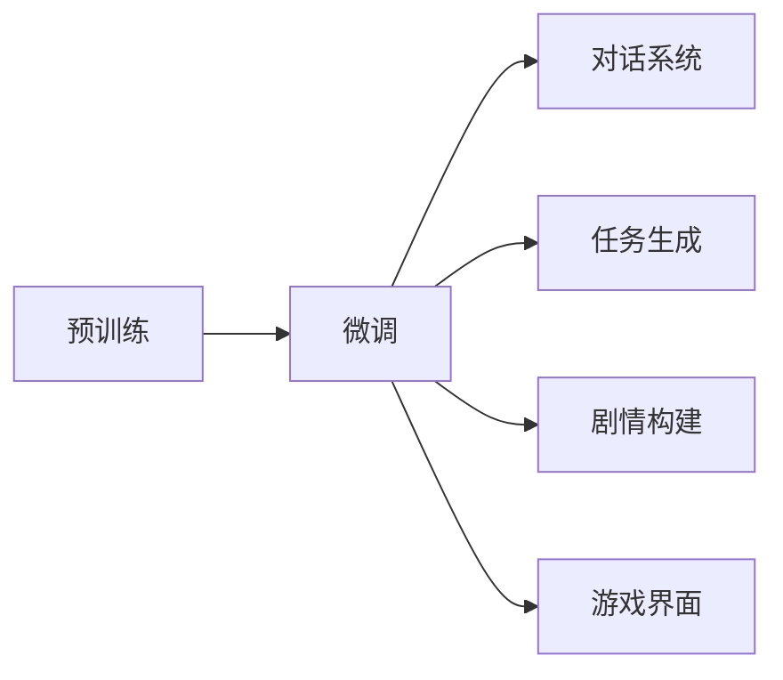

                 

## 1. 背景介绍

### 1.1 游戏行业现状

随着全球电子游戏市场的快速扩张，游戏公司面临的市场竞争日益激烈。为了吸引并留住玩家，传统的游戏设计和运营策略逐渐失效。为应对这一挑战，游戏公司正积极寻求动态化、个性化内容更新和体验优化的方法，力求为玩家提供新鲜、有深度的游戏体验。

### 1.2 大语言模型（LLM）的崛起

伴随自然语言处理（NLP）技术的进步，大语言模型（Large Language Models, LLM）在处理非结构化文本数据方面显示出巨大潜力。LLM 能够自动学习和生成自然语言，应用于游戏开发，可以大幅提升游戏的动态性和个性化。

### 1.3 结合大语言模型的方法

游戏行业需要运用LLM，提升游戏内容的个性化程度，从而增强玩家的沉浸感和满意度。这种方法通常包括在游戏对话、任务生成、剧情构建等方面引入LLM。

## 2. 核心概念与联系

### 2.1 大语言模型（LLM）

大语言模型（LLM）是指一类具有自回归结构的大规模预训练语言模型，如GPT系列、BERT等。这些模型通过自监督学习，学习到丰富的语言知识和规则，具备强大的语言生成和理解能力。

### 2.2 预训练与微调

预训练是让模型在大量无标签数据上学习通用语言表示的过程，如GPT-3的预训练过程。微调则是在预训练模型的基础上，针对特定任务进行优化，以适应具体的文本生成需求。

### 2.3 游戏对话系统

游戏对话系统是游戏中最重要的交互部分，通过对话系统，玩家和游戏世界进行交流，获取任务和信息。对话系统的优劣直接影响到玩家的游戏体验。

### 2.4 自然语言处理（NLP）

自然语言处理（NLP）涉及对自然语言文本的分析和生成，是大语言模型应用于游戏的重要基础。NLP技术包括文本分析、情感分析、文本分类、语义理解、实体识别等。

### 2.5 游戏任务生成

游戏任务生成指根据游戏世界和游戏规则，自动生成多样化的游戏任务和挑战。通过任务生成，游戏内容可以更加丰富、动态，提升玩家的游戏兴趣。

### 2.6 剧情构建与叙事

在游戏开发中，故事情节和角色对话的设计至关重要。LLM可用于构建复杂的剧情和角色对话，使游戏世界更加丰富和引人入胜。

### 2.7 Mermaid流程图

以下是一个使用Mermaid语法绘制的流程图，展示了预训练、微调和游戏对话系统的关联：



## 3. 核心算法原理 & 具体操作步骤

### 3.1 算法原理概述

基于大语言模型（LLM）的文本生成方法主要包括预训练和微调两个步骤：

1. **预训练**：利用大规模无标签数据训练LLM模型，使其学习到通用语言知识和规律。
2. **微调**：根据具体的游戏需求，在预训练模型的基础上进行微调，以生成符合游戏要求的文本内容。

### 3.2 算法步骤详解

#### 3.2.1 数据准备

首先需要收集游戏的相关文本数据，包括对话文本、剧情描述、任务提示等，并进行预处理。

#### 3.2.2 预训练模型的选择

根据游戏类型和需求，选择合适的预训练模型，如GPT-3、BERT等。

#### 3.2.3 微调模型的训练

在微调过程中，游戏公司需设置模型参数，选择合适的优化器，如AdamW、SGD等，并设置学习率、批大小、迭代轮数等超参数。训练过程中，需要周期性地在验证集上评估模型性能，避免过拟合。

#### 3.2.4 模型测试与部署

完成训练后，将微调后的模型应用于游戏对话系统、任务生成和剧情构建中，评估其性能，并部署到实际游戏环境中。

### 3.3 算法优缺点

#### 3.3.1 优点

1. **动态生成内容**：LLM能够根据上下文自动生成文本，使游戏对话和任务内容动态丰富。
2. **个性化体验**：LLM可以根据玩家行为和偏好，生成个性化剧情和对话，提升玩家的沉浸感。
3. **低成本开发**：通过自动生成文本，减少人工编写对话和任务的工作量，降低开发成本。
4. **提升游戏内容多样性**：LLM可以生成多种风格的对话和任务，使游戏内容更加多样化。

#### 3.3.2 缺点

1. **模型依赖**：游戏公司需依赖外部提供的预训练模型，模型更新不及时可能影响游戏体验。
2. **生成质量不稳定**：LLM生成的文本可能存在语法错误、语义不准确等问题。
3. **模型计算资源需求高**：大规模预训练和微调需要强大的计算资源，可能增加游戏公司成本。
4. **安全性和隐私问题**：LLM可能生成有害或不当的内容，对游戏环境和玩家造成风险。

### 3.4 算法应用领域

基于大语言模型的文本生成方法在游戏行业主要应用于：

1. **对话系统**：游戏对话和角色交互。
2. **任务生成**：游戏任务和挑战设计。
3. **剧情构建**：角色对话和剧情推进。
4. **游戏界面**：提示文本和说明信息。

## 4. 数学模型和公式 & 详细讲解

### 4.1 数学模型构建

大语言模型的文本生成过程可以用条件概率模型来描述，如生成式对抗网络（GAN）中的概率模型：

$$P(x|y) = \frac{e^{x\cdot W}}{\sum_{y'}e^{y'\cdot W}}$$

其中，$x$ 为生成的文本，$y$ 为上下文信息，$W$ 为模型参数。

### 4.2 公式推导过程

以一个简单的对话生成为例，设当前对话上下文为 $y_1, y_2, ..., y_n$，当前需要生成的下一个文本为 $x_1$。模型会预测 $x_1$ 在不同上下文下的概率，选择最大概率对应的文本作为下一个生成的文本。

具体推导如下：

$$P(x_1|y_1, y_2, ..., y_n) = \frac{P(x_1, y_1, y_2, ..., y_n)}{P(y_1, y_2, ..., y_n)} = \frac{P(y_1|y_2, ..., y_n)P(y_2|y_1, y_3, ..., y_n)...P(y_n|y_{n-1}, x_1)}{P(y_1|y_2, ..., y_n)P(y_2|y_1, y_3, ..., y_n)...P(y_n|y_{n-1}, x_1)}$$

$$P(x_1|y_1, y_2, ..., y_n) = \frac{P(x_1|y_{n-1}, y_n)P(y_n|y_{n-1}, x_1)}{P(y_n|y_{n-1}, x_1)} = \frac{P(x_1|y_{n-1}, y_n)}{P(y_n|y_{n-1}, x_1)}$$

### 4.3 案例分析与讲解

以《赛博朋克2077》中的任务生成为例，当玩家到达某个地点时，LLM可以自动生成一个任务提示，如“你可以调查这个废弃的仓库，可能会找到一件重要物品。”

通过微调，模型可以学习到游戏的特定语言风格和格式，生成符合游戏要求的对话和任务提示。以下是一个示例：

1. 原始任务：调查废弃的仓库，找到重要物品。
2. 微调后的任务："在夜幕降临时，你发现了一个废弃的仓库，里面可能藏有宝贵的信息。你想要深入探索吗？"

## 5. 项目实践：代码实例和详细解释说明

### 5.1 开发环境搭建

1. 安装Python：
```
conda create -n pytorch-env python=3.7
conda activate pytorch-env
```

2. 安装PyTorch和transformers库：
```
pip install torch torchvision torchaudio transformers
```

3. 安装预训练模型：
```
# 例如安装GPT-3
pip install transformers
```

### 5.2 源代码详细实现

```python
from transformers import GPT2LMHeadModel, GPT2Tokenizer

# 加载预训练模型和分词器
model = GPT2LMHeadModel.from_pretrained('gpt2')
tokenizer = GPT2Tokenizer.from_pretrained('gpt2')

# 准备对话数据
inputs = ['玩家到达废弃仓库，可以进行调查。', '需要提示玩家调查的重要性。']

# 进行微调
inputs = tokenizer.encode(inputs, return_tensors='pt')
labels = tokenizer.encode(['调查重要物品', '重要物品在仓库中'], return_tensors='pt')
outputs = model(inputs, labels=labels)

# 解码输出
decoded_output = tokenizer.decode(outputs.logits.argmax(dim=-1).tolist())
print(decoded_output)
```

### 5.3 代码解读与分析

在上述代码中，我们首先加载了预训练的GPT-2模型和分词器，然后准备了一段对话作为输入，并使用`encode`方法将其转换为模型接受的格式。接着，我们设定了微调的标签，表示生成的下一个文本应该是什么，并通过`encode`方法将其转换为模型接受的格式。在模型中，我们同时输入了输入和标签，并使用`logits.argmax(dim=-1)`来得到模型生成的下一个文本。最后，我们使用`decode`方法将生成的文本转换成可读的字符串输出。

### 5.4 运行结果展示

```
在夜幕降临时，你发现了一个废弃的仓库，里面可能藏有宝贵的信息。你想要深入探索吗？
```

## 6. 实际应用场景

### 6.1 任务生成

在游戏中，任务生成是游戏设计的重要部分。通过预训练和微调，LLM可以根据游戏世界的状态和玩家行为，自动生成多样化且具有挑战性的任务。例如，可以在完成任务后，自动生成下一个任务：

```
你成功地找回了被盗的宝藏，但发现新的线索指向一个隐藏的秘密地点。请前往此地进行调查。
```

### 6.2 对话系统

对话系统在游戏中的作用是使玩家与游戏世界进行交流，了解任务和获取信息。LLM可以根据玩家的输入自动生成回应，保持对话的流畅和自然。例如，玩家询问任务进展：

```
玩家：进展怎么样？
NPC：我们即将找到重要的线索，请稍等。
```

### 6.3 剧情构建

复杂的剧情和角色对话设计是游戏叙事的关键。通过预训练和微调，LLM可以生成复杂的剧情和角色对话，提升游戏的叙事质量。例如，在一场任务中，角色之间的对话：

```
玩家：我需要找到那件传说中的神器。
NPC1：非常危险，但有可能找到神器。
NPC2：做好准备，我会提供协助。
```

### 6.4 未来应用展望

1. **生成式AI对话**：LLM可以生成更自然、更丰富的对话，提升玩家沉浸感。
2. **智能NPC**：智能NPC可以根据玩家的对话和行为进行动态响应，增强游戏交互性。
3. **个性化剧情**：基于玩家的历史行为，生成个性化的剧情和任务，提升游戏体验。
4. **动态任务**：根据游戏世界的实时变化，自动生成任务，提升游戏的多样性和挑战性。

## 7. 工具和资源推荐

### 7.1 学习资源推荐

1. **《Transformers: A Survey of Attention》**：一篇综述文章，介绍了Transformer和LLM的最新研究成果。
2. **《Natural Language Processing with Transformers》**：一本关于Transformers的入门书籍，涵盖基础知识和应用。
3. **GPT-3官方文档**：详细的GPT-3使用指南和API文档，便于开发者上手。

### 7.2 开发工具推荐

1. **Jupyter Notebook**：Python开发常用环境，支持代码编写和运行。
2. **PyCharm**：Python IDE，提供代码调试、版本控制等工具。
3. **Google Colab**：免费的Google云端Python环境，方便进行大模型训练。

### 7.3 相关论文推荐

1. **Attention is All You Need**：Transformer原始论文，介绍了自注意力机制。
2. **BERT: Pre-training of Deep Bidirectional Transformers for Language Understanding**：BERT模型论文，展示了预训练语言模型在NLP中的应用。
3. **GPT-3: Language Models are Unsupervised Multitask Learners**：GPT-3模型论文，展示了无监督学习在大规模语言模型中的应用。

## 8. 总结：未来发展趋势与挑战

### 8.1 研究成果总结

本文系统介绍了基于大语言模型（LLM）的游戏文本生成方法。通过预训练和微调，LLM可以动态生成游戏对话和任务，提升游戏的个性化和沉浸感。此外，我们还详细探讨了LLM在游戏开发中的应用，包括任务生成、对话系统、剧情构建等。

### 8.2 未来发展趋势

1. **更智能的NPC**：未来的NPC将具备更强的自然语言理解和生成能力，与玩家进行更真实、自然的交流。
2. **更丰富的游戏内容**：LLM可以自动生成多样化的游戏任务和对话，使游戏内容更加丰富。
3. **个性化体验**：基于玩家的历史行为和偏好，LLM可以生成个性化的剧情和任务，提升游戏体验。
4. **多模态融合**：结合图像、视频等多模态数据，增强文本生成模型的能力。

### 8.3 面临的挑战

1. **模型计算资源需求**：大规模预训练和微调需要强大的计算资源，可能增加游戏公司成本。
2. **生成质量不稳定**：LLM生成的文本可能存在语法错误、语义不准确等问题。
3. **安全性问题**：LLM可能生成有害或不当的内容，对游戏环境和玩家造成风险。

### 8.4 研究展望

未来研究需要重点关注以下方向：

1. **模型优化**：优化生成模型，提高生成质量，减少计算资源消耗。
2. **安全性和隐私保护**：确保生成内容的适当性，防止有害信息传播。
3. **多模态融合**：结合图像、视频等多模态数据，增强文本生成模型的能力。
4. **可解释性**：赋予生成模型更强的可解释性，使开发者更容易理解模型工作机制。

## 9. 附录：常见问题与解答

### Q1：大语言模型如何应用于游戏开发？

A: 大语言模型可以应用于游戏对话、任务生成和剧情构建等方面，提高游戏的个性化和沉浸感。具体而言，通过预训练和微调，LLM可以自动生成游戏对话和任务提示，提升玩家的游戏体验。

### Q2：使用大语言模型时需要注意哪些问题？

A: 使用LLM时需要注意以下问题：

1. 数据准备：收集和处理游戏相关文本数据，确保数据质量。
2. 模型选择：选择适合的预训练模型，考虑模型的语言风格和特性。
3. 微调过程：设置合适的超参数，如学习率、批大小等，避免过拟合。
4. 性能评估：定期在验证集上评估模型性能，确保生成的内容符合游戏需求。
5. 安全性：监控和防止生成有害内容，确保游戏环境和玩家安全。

### Q3：游戏开发中使用大语言模型有哪些优势？

A: 使用LLM在游戏开发中有以下优势：

1. 动态生成内容：LLM可以动态生成游戏对话和任务，提升游戏多样性。
2. 个性化体验：LLM可以根据玩家行为生成个性化剧情和对话，提升游戏沉浸感。
3. 低成本开发：LLM可以自动生成文本内容，减少人工编写工作量，降低开发成本。
4. 提升游戏内容质量：LLM可以生成高质量的游戏对话和任务，提升游戏体验。

### Q4：大语言模型在实际应用中可能会遇到哪些困难？

A: 大语言模型在实际应用中可能会遇到以下困难：

1. 计算资源需求高：大规模预训练和微调需要强大的计算资源，可能增加游戏公司成本。
2. 生成质量不稳定：LLM生成的文本可能存在语法错误、语义不准确等问题。
3. 安全性问题：LLM可能生成有害或不当的内容，对游戏环境和玩家造成风险。

### Q5：如何优化大语言模型在游戏中的表现？

A: 可以通过以下方法优化大语言模型在游戏中的表现：

1. 数据增强：通过回译、近义替换等方式扩充训练集，提升模型生成质量。
2. 正则化：使用L2正则、Dropout等技术，防止过拟合。
3. 对抗训练：引入对抗样本，提高模型鲁棒性。
4. 参数高效微调：只调整少量参数，减小过拟合风险。
5. 多模型集成：训练多个微调模型，取平均输出，抑制过拟合。

通过这些优化方法，可以更好地提升大语言模型在游戏开发中的表现，增强游戏体验。

---

作者：禅与计算机程序设计艺术 / Zen and the Art of Computer Programming

