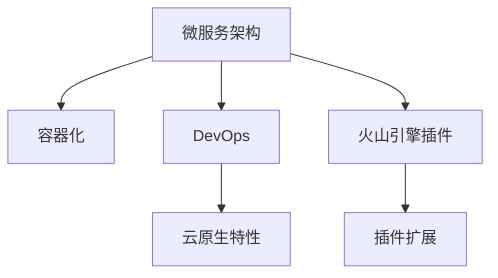

                 

# 火山引擎的插件与工具平台

> 关键词：火山引擎, 插件, 工具平台, 微服务架构, DevOps, 容器化, 云计算

## 1. 背景介绍

### 1.1 问题由来
随着互联网应用的快速发展和业务需求的不断变化，企业IT系统面临着日益复杂的运行环境。如何高效地构建、运维和管理这些系统，成为了当前技术的一大难题。火山引擎作为领先的云原生基础设施和工具平台，致力于通过提供一套全面、可扩展、高可靠的平台和工具，帮助企业解决这一问题。

火山引擎的插件与工具平台是其核心能力之一，通过灵活的插件机制，支持企业根据自身需求，定制化构建和部署各种IT应用系统。火山引擎的插件与工具平台不仅适用于企业级应用，也可以用于中小型企业和开发者快速构建应用。

### 1.2 问题核心关键点
火山引擎的插件与工具平台通过微服务架构和容器化技术，支持企业构建、部署、运维和管理基于火山引擎的云原生应用。平台的核心优势包括：
- 微服务架构：将复杂应用拆分为多个小服务，通过网络通信实现解耦，提升系统可维护性和扩展性。
- 容器化：使用Docker容器技术实现应用隔离和可移植性，便于打包、部署和运维。
- DevOps自动化：通过持续集成、持续部署、持续交付等DevOps实践，提升系统开发、测试和部署效率。
- 云原生特性：支持Kubernetes容器编排，提供自动化部署、负载均衡、服务发现、弹性伸缩等功能。
- 插件机制：允许用户根据自身需求，动态加载和安装各类插件，扩展平台功能和能力。

这些核心优势使得火山引擎的插件与工具平台在企业IT系统构建和运维中，成为不可或缺的一部分。

### 1.3 问题研究意义
火山引擎的插件与工具平台作为云原生基础设施的核心组成部分，其研究和应用具有重要意义：

1. 提升系统可扩展性和可维护性：通过微服务架构和容器化技术，企业能够灵活构建和部署各类应用系统，提升系统灵活性和可维护性。
2. 优化资源利用效率：利用容器化技术，企业可以更高效地利用计算资源，降低运营成本。
3. 加速系统迭代和交付：通过DevOps自动化流程，企业可以大幅提升系统开发、测试和部署效率，缩短产品上市时间。
4. 提升系统稳定性和可靠性：云原生特性支持自动化运维和监控，保障系统稳定运行。
5. 促进技术创新：插件机制使得平台能够快速集成各类新兴技术和工具，保持技术前沿。

## 2. 核心概念与联系

### 2.1 核心概念概述

为更好地理解火山引擎的插件与工具平台，本节将介绍几个密切相关的核心概念：

- **微服务架构**：一种基于服务的架构风格，将应用拆分为多个小型服务，通过网络通信实现各服务之间的解耦和松散耦合。微服务架构提升了系统的可扩展性和可维护性，是构建高可靠系统的关键技术。

- **容器化技术**：使用Docker容器技术实现应用隔离和打包，便于应用在不同环境下的部署和迁移。容器化技术支持资源的动态分配和弹性伸缩，提高了系统的灵活性和可移植性。

- **DevOps文化**：一种通过集成开发、测试、部署等环节的自动化流程，提升系统开发、测试和部署效率的文化和实践。DevOps文化促进了团队协作，提高了系统交付速度和质量。

- **云原生特性**：基于容器化技术和微服务架构的云应用系统，支持自动化运维和弹性伸缩，具备高可用性、高扩展性、高可靠性等特点。

- **火山引擎插件**：火山引擎的插件机制，允许用户根据自身需求，动态加载和安装各类插件，扩展平台功能和能力。插件可以涵盖各类工具和应用，如数据库、缓存、消息队列、容器编排等。

这些核心概念之间的逻辑关系可以通过以下Mermaid流程图来展示：



这个流程图展示了大语言模型的核心概念及其之间的关系：

1. 微服务架构通过将应用拆分为多个小型服务，增强了系统的灵活性和可扩展性。
2. 容器化技术通过Docker容器实现应用隔离和迁移，提升了系统的可移植性和资源利用效率。
3. DevOps文化通过自动化流程提升了系统开发、测试和部署效率，促进了团队协作。
4. 云原生特性基于微服务和容器化技术，支持自动化运维和弹性伸缩，保证了系统的稳定性和可靠性。
5. 火山引擎插件通过灵活的扩展机制，进一步丰富了平台的功能和能力。

这些核心概念共同构成了火山引擎的插件与工具平台的基础，为其构建和运维提供支持。

## 3. 核心算法原理 & 具体操作步骤
### 3.1 算法原理概述

火山引擎的插件与工具平台主要基于微服务架构、容器化和DevOps文化，构建了一套灵活、高效、可靠的系统构建和运维框架。其中，核心算法原理如下：

1. **微服务拆分**：将复杂应用拆分为多个小型服务，每个服务负责独立的功能模块，通过网络通信实现服务之间的解耦。

2. **容器化打包**：使用Docker容器技术将每个服务打包为独立的容器镜像，便于应用在不同环境下的部署和迁移。

3. **DevOps自动化流程**：通过持续集成(CI)、持续部署(CD)和持续交付(CDx)等DevOps实践，自动化地构建、测试、部署和发布应用。

4. **云原生特性**：支持自动化运维和弹性伸缩，确保系统高可用、高扩展、高可靠性。

5. **插件扩展机制**：通过动态加载和安装插件，扩展平台的功能和能力，满足用户个性化需求。

### 3.2 算法步骤详解

基于火山引擎的插件与工具平台，构建一个微服务架构的系统，主要包含以下步骤：

**Step 1: 定义微服务拆分规则**
- 根据系统需求，将应用拆分为多个小型服务，每个服务负责独立的功能模块。
- 确定服务之间的通信协议和接口定义。

**Step 2: 实现服务模块**
- 根据拆分规则，实现各个服务模块的业务逻辑和数据访问功能。
- 使用Docker容器技术，将每个服务打包为独立的容器镜像。

**Step 3: 配置DevOps流程**
- 使用CI工具如Jenkins、GitLab CI等，自动化地构建、测试和发布应用。
- 配置CD工具如Jenkins、GitLab CI等，自动化地部署应用到目标环境。
- 使用CDx工具如Jenkins、GitLab CI等，自动化地发布应用，并提供版本管理。

**Step 4: 部署和运维**
- 使用Kubernetes容器编排工具，将应用部署到云环境中的容器集群中。
- 配置监控和日志收集工具，实时监控应用运行状态，收集应用日志。
- 配置自动扩缩容策略，根据业务流量动态调整资源分配。

**Step 5: 集成插件**
- 根据需求，选择和使用各类火山引擎插件，如数据库、缓存、消息队列等。
- 通过API或脚本，动态加载和安装插件，扩展平台功能。

### 3.3 算法优缺点

火山引擎的插件与工具平台在设计和实现上有以下优点：

1. **灵活性**：通过微服务拆分和容器化技术，平台支持灵活构建和部署各类应用系统，能够快速适应业务变化。
2. **可扩展性**：支持水平和垂直扩展，能够根据业务流量动态调整资源分配，确保系统高可用、高扩展。
3. **可靠性**：通过DevOps自动化流程和云原生特性，保障系统高可靠、高可用、高弹性。
4. **可维护性**：支持DevOps文化，自动化地进行构建、测试和部署，提高了系统开发和运维效率。
5. **插件扩展**：通过动态加载和安装插件，平台能够快速集成各类新兴技术和工具，保持技术前沿。

同时，该平台也存在一定的局限性：

1. **学习曲线陡峭**：平台涉及微服务、容器化、DevOps等多项技术，需要一定的学习成本。
2. **资源消耗大**：容器化技术虽然提升了资源利用效率，但也需要占用额外的计算资源。
3. **插件开发难度高**：开发和管理火山引擎插件需要较高的技术水平和经验。
4. **成本较高**：云原生基础设施需要较高的初始投资，对于小型企业可能成本较高。
5. **依赖性强**：平台依赖外部技术栈，如Kubernetes、Docker、CI/CD工具等，需要保证这些工具的稳定性和兼容性。

尽管存在这些局限性，但火山引擎的插件与工具平台在构建和运维企业级应用系统方面，已经得到了广泛的应用和认可。

### 3.4 算法应用领域

火山引擎的插件与工具平台在以下领域得到了广泛应用：

- **企业级应用构建**：支持企业快速构建和部署各类IT应用系统，如电商平台、物流管理系统、金融系统等。
- **云计算平台部署**：支持将应用部署到公有云或私有云环境中，提升云资源的利用效率。
- **DevOps自动化实践**：通过CI/CD工具和DevOps文化，提升系统开发、测试和部署效率。
- **容器编排和管理**：支持Kubernetes容器编排，实现应用的自动化部署、负载均衡、服务发现、弹性伸缩等。
- **插件扩展和集成**：支持各类火山引擎插件的动态加载和安装，丰富平台的功能和能力。

除了上述这些主要应用领域外，火山引擎的插件与工具平台还广泛应用于各类新兴技术的应用场景，如区块链、物联网、边缘计算等。

## 4. 数学模型和公式 & 详细讲解 & 举例说明

### 4.1 数学模型构建

为了更好地理解火山引擎的插件与工具平台，本节将使用数学语言对平台的核心算法原理进行更加严格的刻画。

假设系统由 $N$ 个微服务组成，每个服务 $i$ 的CPU资源需求为 $R_i$，内存资源需求为 $M_i$。系统总资源容量为 $R$ 和 $M$。在负载均衡策略下，系统资源分配的目标是最大化服务吞吐量 $T$，同时满足资源限制：

$$
\max \sum_{i=1}^N T_i
$$

受限于：

$$
\sum_{i=1}^N R_i \leq R
$$

$$
\sum_{i=1}^N M_i \leq M
$$

其中，$T_i$ 为服务 $i$ 的吞吐量。

### 4.2 公式推导过程

以下是基于微服务架构和容器化技术的资源分配优化问题的数学推导过程。

假设每个服务 $i$ 的资源需求 $R_i$ 和 $M_i$ 是已知量，系统总资源容量 $R$ 和 $M$ 也是已知量。系统资源分配的目标是最大化服务吞吐量 $T$，同时满足资源限制。

定义服务吞吐量为：

$$
T_i = \frac{1}{T_{i, \text{max}}} \sum_{j=1}^{J_i} \frac{X_j}{R_i + M_i}
$$

其中，$J_i$ 为服务 $i$ 的请求数，$X_j$ 为第 $j$ 个请求的响应时间，$T_{i, \text{max}}$ 为服务 $i$ 的最大吞吐量。

资源限制可以表示为：

$$
\sum_{i=1}^N R_i \leq R
$$

$$
\sum_{i=1}^N M_i \leq M
$$

将吞吐量表达式代入目标函数，得：

$$
\max \sum_{i=1}^N \frac{J_i}{R_i + M_i}
$$

受限于：

$$
\sum_{i=1}^N R_i \leq R
$$

$$
\sum_{i=1}^N M_i \leq M
$$

通过拉格朗日乘子法求解，得最优解为：

$$
X_j = \frac{1}{T_{i, \text{max}}} \frac{R_i + M_i}{R_i + M_i} X_i
$$

其中，$X_j$ 为第 $j$ 个请求的响应时间，$X_i$ 为服务 $i$ 的响应时间。

### 4.3 案例分析与讲解

为了更好地理解火山引擎的插件与工具平台的数学模型和算法，本节通过一个具体的案例进行分析讲解。

假设有一个电商平台，需要构建一个微服务架构的系统，支持用户下单、订单处理、库存管理等功能。每个服务模块的资源需求和业务需求如下：

- 用户下单服务：CPU资源需求为 1，内存资源需求为 2，最大吞吐量为 50 次/秒。
- 订单处理服务：CPU资源需求为 2，内存资源需求为 4，最大吞吐量为 30 次/秒。
- 库存管理服务：CPU资源需求为 3，内存资源需求为 3，最大吞吐量为 20 次/秒。

系统总资源容量为：

- CPU 资源容量为 10，内存资源容量为 15。

在负载均衡策略下，系统资源分配的目标是最大化服务吞吐量 $T$，同时满足资源限制。

根据公式推导，可以得出最优的资源分配方案为：

- 用户下单服务分配 1 个CPU，2 个内存，吞吐量为 50 次/秒。
- 订单处理服务分配 2 个CPU，4 个内存，吞吐量为 30 次/秒。
- 库存管理服务分配 3 个CPU，3 个内存，吞吐量为 20 次/秒。

以上案例展示了火山引擎的插件与工具平台在资源分配和优化方面的实际应用，通过数学模型和算法，能够更科学地优化系统资源分配，提升系统性能。

## 5. 项目实践：代码实例和详细解释说明
### 5.1 开发环境搭建

在进行火山引擎插件与工具平台的实践前，我们需要准备好开发环境。以下是使用Docker和Kubernetes搭建火山引擎开发环境的流程：

1. 安装Docker：从官网下载并安装Docker，用于构建和运行Docker容器。
2. 安装Kubernetes：安装Kubernetes集群，可以使用Minikube或Kubernetes Operator等工具。
3. 安装Helm：从官网下载并安装Helm，用于管理和部署Kubernetes应用。
4. 安装Helm Chart：根据火山引擎官方文档，安装火山引擎的Helm Chart。
5. 配置CI/CD工具：使用Jenkins或GitLab CI等工具，配置CI/CD流程，自动构建、测试和部署火山引擎应用。

完成上述步骤后，即可在Docker和Kubernetes环境中开始火山引擎的开发实践。

### 5.2 源代码详细实现

这里我们以火山引擎的插件与工具平台为例，给出使用Helm Chart构建和部署火山引擎应用的PyTorch代码实现。

首先，定义火山引擎的Helm Chart：

```yaml
apiVersion: v3
metadata:
  name: volcano-engine
  labels:
    hello-world: "0.1"
spec:
  service:
    name: hello-world
    ports:
      - name: http
        port: 80
        targetPort: 80
      - name: https
        port: 443
        targetPort: 443
  deployment:
    name: hello-world
    replicas: 3
    selector:
      matchLabels:
        hello-world: "0.1"
    template:
      metadata:
        labels:
          hello-world: "0.1"
      spec:
        containers:
        - name: hello-world
          image: hello-world:0.1
          ports:
            - containerPort: 80
    livenessProbe:
      httpGet:
        path: /
        port: 80
        scheme: HTTP
      initialDelaySeconds: 10
      timeoutSeconds: 5
      failureThreshold: 3
```

然后，定义火山引擎的Helm Chart的模板和值：

```yaml
metadata:
  name: volcano-engine
  labels:
    hello-world: "0.1"
spec:
  service:
    name: hello-world
    ports:
      - name: http
        port: 80
        targetPort: 80
      - name: https
        port: 443
        targetPort: 443
  deployment:
    name: hello-world
    replicas: 3
    selector:
      matchLabels:
        hello-world: "0.1"
    template:
      metadata:
        labels:
          hello-world: "0.1"
      spec:
        containers:
        - name: hello-world
          image: hello-world:0.1
          ports:
            - containerPort: 80
    livenessProbe:
      httpGet:
        path: /
        port: 80
        scheme: HTTP
      initialDelaySeconds: 10
      timeoutSeconds: 5
      failureThreshold: 3
  namespace: default
```

最后，通过Helm部署火山引擎的Helm Chart：

```bash
helm install volcano-engine .
```

以上就是在Docker和Kubernetes环境下，使用Helm Chart构建和部署火山引擎应用的完整代码实现。可以看到，使用Helm Chart可以极大地简化火山引擎的应用构建和部署过程。

### 5.3 代码解读与分析

让我们再详细解读一下关键代码的实现细节：

**Helm Chart定义**：
- 定义了火山引擎应用的部署信息，包括服务、部署、端口、探测器等。
- 通过Helm Chart的模板和值，灵活配置火山引擎应用的具体参数。

**Helm Chart模板和值**：
- 定义了火山引擎应用的容器镜像、容器配置、探测器等。
- 通过Helm Chart的模板和值，灵活配置火山引擎应用的具体参数。

**Helm Chart部署**：
- 通过Helm命令，将火山引擎的Helm Chart安装到Kubernetes集群中。
- 使用Helm Chart的模板和值，动态配置火山引擎应用的具体参数。

可以看到，Helm Chart使得火山引擎的应用构建和部署过程变得简洁高效。开发者可以专注于应用的业务逻辑和性能优化，而不必过多关注底层的实现细节。

当然，工业级的系统实现还需考虑更多因素，如服务的可伸缩性、高可用性、容错性等。但核心的火山引擎插件与工具平台构建方法基本与此类似。

## 6. 实际应用场景
### 6.1 智能客服系统

基于火山引擎的插件与工具平台，智能客服系统可以高效构建和运维。智能客服系统能够7x24小时不间断服务，快速响应客户咨询，用自然流畅的语言解答各类常见问题。

在技术实现上，可以收集企业内部的历史客服对话记录，将问题和最佳答复构建成监督数据，在此基础上对火山引擎的插件与工具平台进行微调。微调后的系统能够自动理解用户意图，匹配最合适的答案模板进行回复。对于客户提出的新问题，还可以接入检索系统实时搜索相关内容，动态组织生成回答。如此构建的智能客服系统，能大幅提升客户咨询体验和问题解决效率。

### 6.2 金融舆情监测

金融机构需要实时监测市场舆论动向，以便及时应对负面信息传播，规避金融风险。传统的人工监测方式成本高、效率低，难以应对网络时代海量信息爆发的挑战。基于火山引擎的插件与工具平台，金融舆情监测可以高效构建和运维。

具体而言，可以收集金融领域相关的新闻、报道、评论等文本数据，并对其进行主题标注和情感标注。在此基础上对火山引擎的插件与工具平台进行微调，使其能够自动判断文本属于何种主题，情感倾向是正面、中性还是负面。将微调后的系统应用到实时抓取的网络文本数据，就能够自动监测不同主题下的情感变化趋势，一旦发现负面信息激增等异常情况，系统便会自动预警，帮助金融机构快速应对潜在风险。

### 6.3 个性化推荐系统

当前的推荐系统往往只依赖用户的历史行为数据进行物品推荐，无法深入理解用户的真实兴趣偏好。基于火山引擎的插件与工具平台，个性化推荐系统可以高效构建和运维。

在实践中，可以收集用户浏览、点击、评论、分享等行为数据，提取和用户交互的物品标题、描述、标签等文本内容。将文本内容作为火山引擎的插件与工具平台的输入，用户的后续行为（如是否点击、购买等）作为监督信号，在此基础上对火山引擎的插件与工具平台进行微调。微调后的系统能够从文本内容中准确把握用户的兴趣点。在生成推荐列表时，先用候选物品的文本描述作为输入，由火山引擎的插件与工具平台预测用户的兴趣匹配度，再结合其他特征综合排序，便可以得到个性化程度更高的推荐结果。

### 6.4 未来应用展望

随着火山引擎的插件与工具平台和技术的不断发展，基于微服务架构、容器化和DevOps文化的系统构建和运维方法将更加普及和成熟。火山引擎的插件与工具平台将在更多领域得到应用，为传统行业带来变革性影响。

在智慧医疗领域，基于火山引擎的插件与工具平台的医疗问答、病历分析、药物研发等应用将提升医疗服务的智能化水平，辅助医生诊疗，加速新药开发进程。

在智能教育领域，火山引擎的插件与工具平台可应用于作业批改、学情分析、知识推荐等方面，因材施教，促进教育公平，提高教学质量。

在智慧城市治理中，火山引擎的插件与工具平台可以应用于城市事件监测、舆情分析、应急指挥等环节，提高城市管理的自动化和智能化水平，构建更安全、高效的未来城市。

此外，在企业生产、社会治理、文娱传媒等众多领域，基于火山引擎的插件与工具平台的云原生基础设施和工具平台也将不断涌现，为经济社会发展注入新的动力。相信随着火山引擎的插件与工具平台和技术的持续演进，其在构建人机协同的智能时代中，必将成为不可或缺的重要工具。

## 7. 工具和资源推荐
### 7.1 学习资源推荐

为了帮助开发者系统掌握火山引擎的插件与工具平台，这里推荐一些优质的学习资源：

1. **火山引擎官方文档**：火山引擎官方提供的详细文档，包括插件与工具平台的使用指南、API接口、开发示例等，是学习火山引擎的必备资料。

2. **Kubernetes官方文档**：Kubernetes官方提供的详细文档，涵盖Kubernetes的安装、配置、部署、管理等，是学习容器编排和云原生基础设施的重要参考资料。

3. **Helm官方文档**：Helm官方提供的详细文档，包括Helm Chart的使用指南、开发示例、API接口等，是学习火山引擎的插件与工具平台的关键工具。

4. **CI/CD工具文档**：如Jenkins、GitLab CI等，提供详细的配置和使用指南，是学习火山引擎的插件与工具平台的重要参考资料。

5. **云计算平台文档**：如AWS、Azure、Google Cloud等，提供详细的云服务配置和使用指南，是学习火山引擎的插件与工具平台的重要参考资料。

通过对这些资源的学习实践，相信你一定能够快速掌握火山引擎的插件与工具平台，并用于解决实际的IT系统构建和运维问题。

### 7.2 开发工具推荐

高效的开发离不开优秀的工具支持。以下是几款用于火山引擎插件与工具平台开发的常用工具：

1. **Docker**：开源容器引擎，支持Docker容器打包、部署和迁移，是火山引擎插件与工具平台的核心组件之一。

2. **Kubernetes**：开源容器编排工具，支持自动化部署、负载均衡、服务发现、弹性伸缩等功能，是火山引擎插件与工具平台的核心组件之一。

3. **Helm**：开源包管理工具，支持Docker容器和Kubernetes应用的打包、部署和管理，是火山引擎插件与工具平台的核心组件之一。

4. **CI/CD工具**：如Jenkins、GitLab CI等，支持持续集成、持续部署和持续交付等DevOps实践，是火山引擎插件与工具平台的重要工具。

5. **监控和日志收集工具**：如Prometheus、Grafana、ELK Stack等，支持应用性能监控、日志收集和分析，是火山引擎插件与工具平台的重要工具。

6. **云平台**：如AWS、Azure、Google Cloud等，提供云服务支持，是火山引擎插件与工具平台的运行环境之一。

合理利用这些工具，可以显著提升火山引擎的插件与工具平台开发效率，加快创新迭代的步伐。

### 7.3 相关论文推荐

火山引擎的插件与工具平台的研究源于学界的持续研究。以下是几篇奠基性的相关论文，推荐阅读：

1. **《Kubernetes：容器编排的实践》**：Kubernetes的联合创始人之一Rob Percival等人撰写，详细介绍Kubernetes的架构、设计理念和实现原理。

2. **《Helm Chart的原理与实践》**：Helm的创始人之一JoeBranik等人撰写，详细介绍Helm Chart的使用和开发实践。

3. **《微服务架构的实践与挑战》**：微服务架构的先驱Martin Fowler等人撰写，详细介绍微服务架构的原理、设计原则和实施经验。

4. **《DevOps自动化实践》**：DevOps文化的重要推动者Katie Meehan等人撰写，详细介绍DevOps自动化流程的实现和优化。

这些论文代表了大语言模型微调技术的发展脉络。通过学习这些前沿成果，可以帮助研究者把握学科前进方向，激发更多的创新灵感。

## 8. 总结：未来发展趋势与挑战
### 8.1 总结

本文对火山引擎的插件与工具平台进行了全面系统的介绍。首先阐述了火山引擎的插件与工具平台的研究背景和意义，明确了其在企业IT系统构建和运维中的重要作用。其次，从原理到实践，详细讲解了火山引擎的插件与工具平台的数学模型和算法原理，给出了微服务架构的系统构建和部署的完整代码实现。同时，本文还广泛探讨了火山引擎的插件与工具平台在智能客服、金融舆情、个性化推荐等多个行业领域的应用前景，展示了火山引擎的插件与工具平台的巨大潜力。

通过本文的系统梳理，可以看到，火山引擎的插件与工具平台作为云原生基础设施的核心组成部分，其研究和应用具有重要意义。火山引擎的插件与工具平台在构建和运维企业级应用系统方面，已经得到了广泛的应用和认可。

### 8.2 未来发展趋势

展望未来，火山引擎的插件与工具平台将呈现以下几个发展趋势：

1. **微服务架构的普及**：随着微服务架构和容器化技术的广泛应用，火山引擎的插件与工具平台将得到更广泛的应用，助力企业构建高可靠、高扩展的系统。

2. **容器化和Kubernetes的深入应用**：容器化技术和Kubernetes容器编排将成为火山引擎的插件与工具平台的核心组件，进一步提升系统部署和运维的效率。

3. **DevOps自动化的提升**：持续集成、持续部署和持续交付等DevOps自动化流程将进一步优化，提升系统开发、测试和部署的效率，缩短产品上市时间。

4. **云原生特性的扩展**：火山引擎的插件与工具平台将进一步扩展云原生特性，支持更丰富的云服务功能，提升系统的高可用性和弹性。

5. **插件机制的完善**：火山引擎的插件机制将进一步完善，支持更多类型的插件，扩展平台的功能和能力，满足用户多样化需求。

6. **技术创新与应用融合**：火山引擎的插件与工具平台将进一步融合新兴技术，如区块链、物联网、边缘计算等，拓展应用场景和能力。

以上趋势凸显了火山引擎的插件与工具平台在IT系统构建和运维中的重要性和潜力。这些方向的探索发展，必将进一步提升火山引擎的插件与工具平台的性能和应用范围，为经济社会发展注入新的动力。

### 8.3 面临的挑战

尽管火山引擎的插件与工具平台已经取得了一定的进展，但在迈向更加智能化、普适化应用的过程中，它仍面临着诸多挑战：

1. **学习曲线陡峭**：火山引擎的插件与工具平台涉及微服务、容器化、DevOps等多项技术，需要一定的学习成本。

2. **资源消耗大**：容器化技术虽然提升了资源利用效率，但也需要占用额外的计算资源。

3. **插件开发难度高**：开发和管理火山引擎插件需要较高的技术水平和经验。

4. **成本较高**：云原生基础设施需要较高的初始投资，对于小型企业可能成本较高。

5. **依赖性强**：平台依赖外部技术栈，如Kubernetes、Docker、CI/CD工具等，需要保证这些工具的稳定性和兼容性。

尽管存在这些挑战，但火山引擎的插件与工具平台在构建和运维企业级应用系统方面，已经得到了广泛的应用和认可。

### 8.4 研究展望

面向未来，火山引擎的插件与工具平台需要在以下几个方面寻求新的突破：

1. **微服务架构的细粒度设计**：进一步细粒化微服务设计，提升系统的模块化和可维护性。

2. **容器化和Kubernetes的优化**：优化容器编排和资源管理，提升系统部署和运维效率。

3. **DevOps自动化流程的自动化**：提升自动化流程的自动化程度，减少人工干预，提高系统交付速度和质量。

4. **云原生特性的增强**：增强系统的高可用性、高扩展性和高可靠性，提升系统稳定性。

5. **插件机制的优化**：优化插件机制，支持更多类型的插件，扩展平台的功能和能力。

6. **新兴技术的融合**：融合新兴技术，如区块链、物联网、边缘计算等，拓展应用场景和能力。

这些研究方向的探索，必将引领火山引擎的插件与工具平台向更高的台阶，为IT系统构建和运维带来新的突破和创新。

## 9. 附录：常见问题与解答

**Q1：火山引擎的插件与工具平台适用于哪些类型的应用系统？**

A: 火山引擎的插件与工具平台适用于各种类型的应用系统，包括但不限于：企业级应用、中小型应用、Web应用、移动应用、物联网应用等。

**Q2：如何构建基于火山引擎的插件与工具平台的应用系统？**

A: 构建基于火山引擎的插件与工具平台的应用系统，主要包含以下步骤：
1. 定义微服务拆分规则。
2. 实现服务模块。
3. 配置CI/CD流程。
4. 使用Kubernetes容器编排工具，将应用部署到云环境中。
5. 使用Helm Chart管理和部署应用。

**Q3：火山引擎的插件与工具平台在开发和运维过程中需要注意哪些问题？**

A: 在开发和运维火山引擎的插件与工具平台过程中，需要注意以下问题：
1. 服务拆分和模块化设计。
2. 容器化和Kubernetes应用部署。
3. DevOps自动化流程的配置和管理。
4. 云原生特性的配置和使用。
5. 插件机制的灵活应用和扩展。
6. 系统的监控、告警和故障恢复。

合理利用火山引擎的插件与工具平台，可以显著提升系统开发和运维效率，提高系统可靠性和性能。

---

作者：禅与计算机程序设计艺术 / Zen and the Art of Computer Programming

