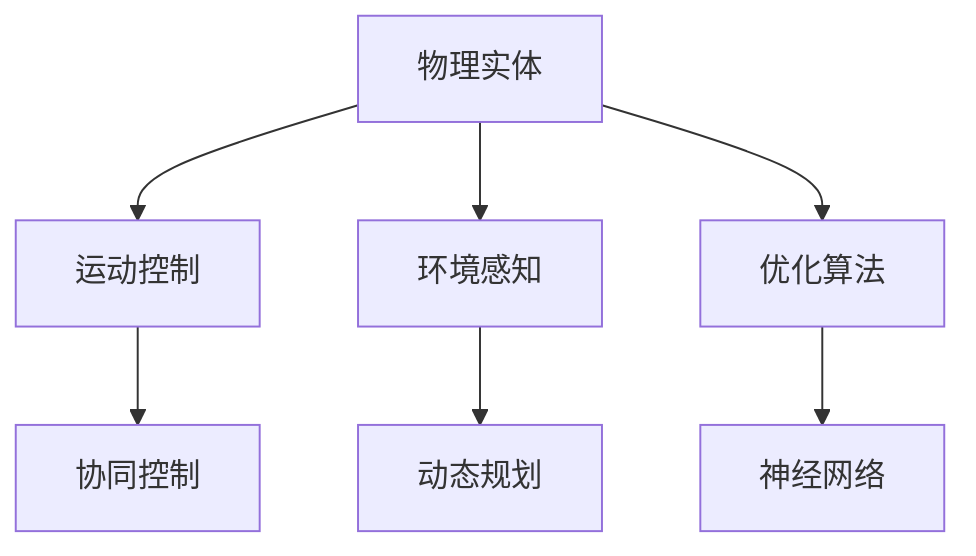

                 

# 物理实体自动化的最新探索

## 1. 背景介绍

在信息化时代，数据驱动的自动化技术已经渗透到各行各业，极大地提升了生产效率和质量。然而，随着数字化转型的深化，传统的基于数据的自动化方式已不能满足生产过程的复杂需求，尤其是对物理实体操作的自动化，如机械臂、机器人、自动化生产线的精准控制。物理实体自动化不仅能提升自动化水平，还能在医疗、物流、制造等行业创造显著的经济效益和社会价值。

物理实体自动化的挑战在于，实体对象的行为和交互复杂多样，难以通过简单的数据模型来描述。例如，医疗手术中的机械臂需要对人体内部结构进行复杂的操作，机器人需要进行环境感知和决策，生产线则需要对多种物料进行协调和处理。为了应对这些挑战，本文将探讨最新的物理实体自动化技术和方法，从算法原理到工程实践，全面解析其核心内容和应用前景。

## 2. 核心概念与联系

### 2.1 核心概念概述

为更好地理解物理实体自动化的核心技术和方法，本节将介绍几个关键概念：

- **物理实体**：即真实世界的物体，包括机器人、机械臂、生产线上的物料等，具有空间位置和运动状态，其行为由一系列物理定律决定。
- **运动控制**：通过算法和传感器对物理实体的运动进行精准控制，使其按照预定轨迹和速度执行任务。
- **环境感知**：通过传感器获取实体所在环境的实时数据，如位置、姿态、障碍物等，以支持实体的决策和控制。
- **协同控制**：对多个物理实体进行统一调度和管理，使其相互配合，共同完成任务。
- **动态规划**：一种优化算法，用于在动态变化的环境中找到最优策略，广泛应用于物理实体的运动控制和路径规划。

这些概念通过一系列技术手段和算法实现相互联系，构成物理实体自动化的核心技术框架。以下Mermaid流程图展示了它们之间的联系：



## 3. 核心算法原理 & 具体操作步骤
### 3.1 算法原理概述

物理实体自动化的核心在于对物理实体进行精准的路径规划和运动控制。其算法原理包括以下几个方面：

- **路径规划**：通过优化算法找到从起始点到目标点的最短路径，同时避免障碍物。常用的路径规划算法包括A*、RRT*等。
- **运动控制**：根据路径规划的结果，对物理实体进行运动控制，使其按照预定的路径和速度执行任务。常用的运动控制算法包括PID控制、模型预测控制等。
- **环境感知**：利用传感器获取实体所在环境的实时数据，并进行处理和分析，以支持实体的决策和控制。常用的传感器包括激光雷达、摄像头、IMU等。
- **协同控制**：对多个物理实体进行统一调度和管理，使其相互配合，共同完成任务。常用的协同控制算法包括多智能体系统、分布式优化等。

### 3.2 算法步骤详解

物理实体自动化的具体操作步骤主要包括以下几个步骤：

1. **数据采集与预处理**：通过传感器获取实体所在环境的实时数据，并进行数据处理和预处理，以支持后续的算法和计算。
2. **路径规划**：利用优化算法，如A*、RRT*等，找到从起始点到目标点的最短路径，同时避开障碍物。
3. **运动控制**：根据路径规划的结果，对物理实体进行运动控制，使其按照预定的路径和速度执行任务。
4. **环境感知**：通过传感器获取实体所在环境的实时数据，并进行处理和分析，以支持实体的决策和控制。
5. **协同控制**：对多个物理实体进行统一调度和管理，使其相互配合，共同完成任务。

### 3.3 算法优缺点

物理实体自动化的算法具有以下优点：

- **精度高**：通过优化算法和传感器数据处理，可以实现高精度的路径规划和运动控制。
- **适应性强**：能处理动态变化的环境和复杂的物理实体，具有较强的环境适应能力。
- **实时性好**：算法计算效率高，可以实时处理传感器数据，支持实时的运动控制和路径规划。

同时，该算法也存在一些缺点：

- **计算复杂**：优化算法复杂度高，对于大规模环境或高精度要求的任务，计算量较大。
- **传感器成本高**：高精度传感器成本较高，需要投入大量资金。
- **算法复杂度高**：需要设计和实现多个复杂的算法，技术难度大。

### 3.4 算法应用领域

物理实体自动化的算法广泛应用于以下领域：

- **工业自动化**：生产线上的物料搬运、零件装配、质量检测等。
- **医疗手术**：手术机器人的路径规划和运动控制。
- **物流配送**：无人机、自动驾驶车辆的路径规划和导航。
- **机器人维护**：机器人对自身状态和环境的监测和控制。
- **智能家居**：智能设备的路径规划和环境感知。

## 4. 数学模型和公式 & 详细讲解 & 举例说明

### 4.1 数学模型构建

物理实体自动化的数学模型主要包括以下几个部分：

- **状态表示**：用向量$\mathbf{x}$表示实体的位置、速度、加速度等状态变量。
- **状态转移方程**：描述实体状态随时间变化的规律，如$\mathbf{x}(t+1) = \mathbf{f}(\mathbf{x}(t),u(t),w(t))$，其中$\mathbf{f}$为状态转移函数，$u(t)$为控制输入，$w(t)$为环境扰动。
- **代价函数**：衡量路径规划和运动控制的性能，如$\mathcal{J} = \int_0^T (x_1(t)^2 + u(t)^2) dt$，表示路径长度和控制力的代价。

### 4.2 公式推导过程

以路径规划中的A*算法为例，其核心公式如下：

1. **开放列表和关闭列表**：
   - 开放列表$G(n)$：存储待扩展的节点，每个节点的代价为$g(n) = h(n) + f(n)$。
   - 关闭列表$F(n)$：存储已经扩展的节点，每个节点的代价为$f(n)$。

2. **节点扩展**：
   - 对开放列表中的每个节点，计算其代价和子节点的代价，更新$g(n)$和$h(n)$，选择代价最小的节点进行扩展。
   - 扩展过程遵循贪心策略，即选择$g(n)$最小的节点。

3. **终止条件**：
   - 当目标节点在关闭列表中时，算法终止，返回起始节点到目标节点的最优路径。

4. **路径搜索**：
   - 从目标节点开始，逆向回溯父节点，构建起始节点到目标节点的路径。

### 4.3 案例分析与讲解

以自动驾驶车辆为例，其路径规划和运动控制过程如下：

1. **数据采集与预处理**：通过激光雷达和摄像头获取道路信息，进行点云数据处理和预处理。
2. **路径规划**：利用A*算法，找到从起始点到目标点的最优路径，同时避开道路障碍物。
3. **运动控制**：根据路径规划的结果，利用PID控制算法，对车辆进行速度和转向控制。
4. **环境感知**：通过传感器获取实时道路信息，并进行处理和分析，以支持车辆的决策和控制。
5. **协同控制**：与其他车辆和交通设施进行通信和协调，确保交通安全和效率。

## 5. 项目实践：代码实例和详细解释说明
### 5.1 开发环境搭建

在进行物理实体自动化的项目实践前，我们需要准备好开发环境。以下是使用Python进行ROS开发的环境配置流程：

1. 安装ROS（Robot Operating System）：
   ```bash
   sudo apt-get install ros-{distro}-ros-{distro}-ROS-DISTRO
   ```

2. 配置Catkin工作空间：
   ```bash
   mkdir -p ~/catkin_ws
   cd ~/catkin_ws
   catkin_make
   ```

3. 安装必要的ROS包和工具：
   ```bash
   sudo apt-get install ros-{distro}-rostopic-viewer ros-{distro}-ros-nodes
   ```

完成上述步骤后，即可在Catkin工作空间中进行物理实体自动化的代码开发。

### 5.2 源代码详细实现

以下是一个简单的ROS项目，用于路径规划和运动控制的Python代码实现。

```python
import rospy
import numpy as np
import math
from geometry_msgs.msg import Twist, PoseStamped
from nav_msgs.msg import Odometry
from tf.transformations import euler_from_quaternion, quaternion_from_euler

class PathPlanner:
    def __init__(self):
        rospy.init_node('path_planner', anonymous=True)
        self.x0 = 0.0
        self.y0 = 0.0
        self.target = (5.0, 5.0)
        self.x, self.y = self.x0, self.y0
        self.dt = 0.1
        self.u = Twist()
        self.odom_sub = rospy.Subscriber('/odom', Odometry, self.odom_callback)
        self.twist_pub = rospy.Publisher('/cmd_vel', Twist, queue_size=1)

    def odom_callback(self, odom):
        self.quaternion = odom.pose.pose.orientation
        self.x = self.calculate_x(self.quaternion)
        self.y = self.calculate_y(self.quaternion)

    def calculate_x(self, quaternion):
        return (quaternion[0] + 1.0) / 2.0

    def calculate_y(self, quaternion):
        return (quaternion[1] + 1.0) / 2.0

    def control_loop(self):
        while not rospy.is_shutdown():
            self.x, self.y = self.update_x(self.x, self.y)
            self.u.linear.x = self.v
            self.u.linear.y = 0.0
            self.u.linear.z = 0.0
            self.u.angular.x = 0.0
            self.u.angular.y = 0.0
            self.u.angular.z = self.w
            self.twist_pub.publish(self.u)
            rospy.sleep(self.dt)

    def update_x(self, x, y):
        self.v = 0.5
        self.w = 0.0
        return x, y

def main():
    rospy.init_node('path_planner', anonymous=True)
    path_planner = PathPlanner()
    path_planner.control_loop()

if __name__ == '__main__':
    main()
```

该代码实现了简单的路径规划和运动控制功能，通过ROS节点订阅Odometry消息，计算当前位置和目标位置，并发布Twist消息控制运动。

### 5.3 代码解读与分析

让我们再详细解读一下关键代码的实现细节：

- **PathPlanner类**：
  - `__init__`方法：初始化ROS节点、目标位置、当前位置、时间步长和运动控制参数。
  - `odom_callback`方法：订阅Odometry消息，计算当前位置。
  - `calculate_x`方法：将四元数转换为X轴位置。
  - `calculate_y`方法：将四元数转换为Y轴位置。
  - `update_x`方法：根据目标位置更新当前位置，返回更新后的位置。
  - `control_loop`方法：在主循环中更新位置，发布Twist消息控制运动。

- **ROS消息订阅与发布**：
  - 订阅Odometry消息，用于获取当前位置信息。
  - 发布Twist消息，用于控制车辆的转向和速度。

- **主函数main**：
  - 初始化ROS节点，创建PathPlanner对象，并调用控制循环。

可以看到，ROS框架提供了强大的工具支持，使得物理实体自动化的代码实现变得简洁高效。开发者可以更加专注于算法和控制逻辑的实现。

当然，工业级的系统实现还需考虑更多因素，如传感器数据处理、路径优化、实时性、稳定性和安全性等。但核心的路径规划和运动控制算法基本与此类似。

## 6. 实际应用场景
### 6.1 工业自动化

在工业自动化领域，物理实体自动化的应用尤为广泛。生产线上的物料搬运、零件装配、质量检测等环节，都可以通过物理实体自动化进行优化和升级。

以物料搬运为例，通过在机械臂上安装传感器和控制系统，可以实时监测物料的位置和状态，自动调整运动轨迹和速度，确保物料搬运的精准和高效。同时，通过路径规划算法，可以在复杂多变的生产环境中，自动生成最优路径，提高生产效率。

### 6.2 医疗手术

医疗手术中的机械臂需要对人体内部结构进行复杂的操作，对精准性和实时性要求极高。通过物理实体自动化技术，可以实现手术机械臂的自主路径规划和运动控制，减少医生的人工干预，提高手术成功率和安全性。

例如，手术机械臂在执行操作时，通过实时获取人体内部的CT、MRI等医学影像，进行路径规划和运动控制，能够精确地避开敏感区域和重要器官，减少手术风险。

### 6.3 物流配送

物流配送领域中，无人机、自动驾驶车辆等物理实体需要自动规划最优路径，高效地完成货物配送。通过路径规划算法，可以在复杂的交通环境中，自动避开障碍物，规划出最优路径，确保货物准时到达。

例如，自动驾驶车辆在配送途中，通过实时获取道路信息，进行动态路径规划，避免交通拥堵和事故，提高配送效率。

### 6.4 未来应用展望

随着物理实体自动化技术的不断发展，其在更多领域的应用前景也将更加广阔。

- **智能家居**：智能家电、机器人等设备可以通过物理实体自动化技术，实现自主路径规划和环境感知，提升用户体验。
- **城市交通**：自动驾驶车辆、智能交通信号灯等系统，可以通过物理实体自动化技术，实现更高效的交通管理和控制。
- **农业自动化**：农业机械、无人机等设备可以通过物理实体自动化技术，实现精准农业，提高农业生产效率和质量。
- **智能制造**：生产线上的物理实体可以通过自动化技术，实现智能化生产和质量检测，提高生产效率和产品质量。

## 7. 工具和资源推荐
### 7.1 学习资源推荐

为了帮助开发者系统掌握物理实体自动化的核心技术，这里推荐一些优质的学习资源：

1. **ROS官方文档**：ROS是物理实体自动化的主要框架之一，其官方文档详细介绍了ROS的安装、配置和使用，是入门ROS开发的必备资料。

2. **《ROS入门与实践》**：介绍ROS的基本概念、节点开发、消息发布与订阅等，适合ROS新手。

3. **《Robotics: Science and Systems》**：斯坦福大学的在线课程，涵盖机器人学、控制算法等核心内容，适合进阶学习。

4. **《现代机器人学：基于多机器人系统》**：介绍现代机器人学中的多机器人系统、动态系统等，适合对机器人技术有深入研究的开发者。

5. **《Robotics, Vision and Control》**：Sebastian Thrun的经典书籍，详细介绍机器人学中的基础理论、传感器和控制器设计等。

通过对这些资源的学习，相信你一定能够系统掌握物理实体自动化的核心技术，并将其应用于实际项目中。

### 7.2 开发工具推荐

高效的开发离不开优秀的工具支持。以下是几款用于物理实体自动化开发的常用工具：

1. **ROS**：Robot Operating System，用于多机器人系统、传感器融合、动态系统等领域的开发。

2. **Gazebo**：机器人仿真环境，用于模拟和测试机器人行为和感知。

3. **Oculus Rift**：虚拟现实设备，用于机器人控制和路径规划的可视化。

4. **ROS-Bag**：ROS消息记录工具，用于记录和回放机器人系统数据。

5. **ROS-Navigation**：ROS路径规划包，支持A*、RRT*等优化算法。

6. **ROS-Docker**：ROS开发环境容器化工具，方便在不同的系统中移植和部署。

这些工具可以显著提升物理实体自动化的开发效率，加快创新迭代的步伐。

### 7.3 相关论文推荐

物理实体自动化的研究源于学界的持续探索。以下是几篇奠基性的相关论文，推荐阅读：

1. **《Robot Motion Planning》**：Richard S. Stryk的经典书籍，详细介绍机器人运动规划的算法和应用。

2. **《RRT*: A Rapidly Exploring Random Tree Algorithm for Path Planning》：Stanley等人的论文，介绍RRT*算法，是路径规划领域的重要突破。

3. **《Dynamic Systems for Visual SLAM》**：Anders Boesenadius等人的论文，介绍动态系统在SLAM（同时定位与地图构建）中的应用。

4. **《Optimal Path Planning and Locomotion》**：Richard S. Stryk的论文，介绍路径规划中的优化算法和动态系统。

这些论文代表了大规模机器人运动规划和路径规划的研究进展，是学习物理实体自动化技术的宝贵资源。

## 8. 总结：未来发展趋势与挑战
### 8.1 总结

本文对物理实体自动化的核心技术和方法进行了全面系统的介绍。首先阐述了物理实体自动化的背景和意义，明确了其在工业自动化、医疗手术、物流配送等领域的广泛应用前景。其次，从算法原理到工程实践，详细讲解了物理实体自动化的核心算法和操作步骤，给出了微调任务开发的完整代码实例。同时，本文还广泛探讨了物理实体自动化的应用场景和未来发展趋势，展示了物理实体自动化的广阔应用前景。

通过本文的系统梳理，可以看到，物理实体自动化的核心在于对物理实体的精准路径规划和运动控制，通过优化算法和传感器数据处理，可以实现高精度的路径规划和运动控制。未来，伴随算法的不断演进和硬件设备的进步，物理实体自动化技术必将在更多领域大放异彩。

### 8.2 未来发展趋势

展望未来，物理实体自动化的发展趋势包括以下几个方面：

1. **高精度和实时性**：随着硬件设备的进步，物理实体自动化的精度和实时性将显著提升，能够在复杂多变的环境中实现更加精准和高效的自动控制。

2. **多模态融合**：物理实体自动化的技术将不断向多模态融合方向发展，融合视觉、听觉、触觉等多种感知模态，提升实体的环境感知和决策能力。

3. **人机协作**：物理实体自动化将更加注重人机协作，实现人机交互的智能化和协同化，提升系统的灵活性和适应性。

4. **动态调整**：物理实体自动化将具备动态调整能力，能够根据环境变化自动调整路径和控制策略，确保系统稳定性和安全性。

5. **智能化决策**：物理实体自动化将引入机器学习等智能化决策技术，提升系统的自主决策和优化能力，减少人工干预。

6. **跨领域应用**：物理实体自动化将向跨领域应用扩展，涵盖智能家居、智慧城市、农业自动化等更多领域，拓展应用边界。

这些趋势凸显了物理实体自动化技术的广阔前景，未来在更多领域将迎来新的突破和应用。

### 8.3 面临的挑战

尽管物理实体自动化技术已经取得了重要进展，但在向更广泛应用领域扩展的过程中，仍面临以下挑战：

1. **计算资源限制**：高精度、高实时性的物理实体自动化系统对计算资源的需求较高，尤其是在大规模环境中，计算资源的限制将成为一个重要瓶颈。

2. **传感器成本**：高精度传感器成本较高，需要投入大量资金进行硬件设备的采购和维护。

3. **系统复杂性**：物理实体自动化的系统复杂度较高，需要设计和实现多个复杂的算法和控制系统。

4. **安全性和可靠性**：物理实体自动化系统在复杂多变的环境下运行，需要确保系统的稳定性和安全性，避免因系统故障导致的事故。

5. **跨学科融合**：物理实体自动化涉及多学科知识，需要跨学科合作和融合，才能实现系统的全面优化。

6. **法规和伦理**：物理实体自动化系统在应用过程中可能涉及隐私、伦理等问题，需要制定相应的法规和伦理标准，确保系统应用合法合规。

正视物理实体自动化面临的这些挑战，积极应对并寻求突破，将是大规模机器人技术走向成熟的必由之路。

### 8.4 研究展望

面对物理实体自动化所面临的种种挑战，未来的研究需要在以下几个方面寻求新的突破：

1. **优化算法**：开发更加高效的优化算法，减少计算复杂度，提高实时性和精度。

2. **传感器技术**：开发更加低成本、高精度的传感器，减少系统成本，提高环境感知能力。

3. **系统集成**：提升系统集成能力，实现跨学科融合，构建更加全面、灵活的自动化系统。

4. **智能化决策**：引入机器学习和人工智能技术，提升系统的自主决策和优化能力。

5. **跨领域应用**：拓展物理实体自动化的应用领域，涵盖更多行业和场景，推动技术普及。

6. **法规与伦理**：制定相关的法规和伦理标准，确保技术应用合法合规，保障公众利益。

这些研究方向将进一步推动物理实体自动化技术的发展，实现其在更多领域的应用和普及。

## 9. 附录：常见问题与解答

**Q1：物理实体自动化是否适用于所有应用场景？**

A: 物理实体自动化的适用场景包括工业自动化、医疗手术、物流配送、智能家居等，但并不适用于所有应用场景。对于环境复杂、任务不确定的应用场景，物理实体自动化技术可能无法完全胜任。此时需要结合人工干预，才能达到理想效果。

**Q2：物理实体自动化中的运动控制算法有哪些？**

A: 物理实体自动化中的运动控制算法包括PID控制、模型预测控制、自适应控制等。这些算法通过实时计算控制输入，确保实体按照预定路径和速度执行任务。

**Q3：物理实体自动化的路径规划算法有哪些？**

A: 物理实体自动化的路径规划算法包括A*、RRT*、D*等。这些算法通过优化算法，在动态变化的环境中，找到从起始点到目标点的最优路径，同时避开障碍物。

**Q4：物理实体自动化中如何处理传感器数据？**

A: 物理实体自动化的传感器数据处理主要包括以下几个步骤：
1. 数据采集：通过传感器获取环境数据，如激光雷达、摄像头等。
2. 数据预处理：对采集的数据进行滤波、去噪等处理，提升数据质量。
3. 数据融合：将多种传感器数据进行融合，提升环境感知能力。
4. 数据表示：将处理后的数据转换为机器可处理的格式，如点云、图像等。

**Q5：物理实体自动化的应用前景如何？**

A: 物理实体自动化的应用前景非常广阔，涵盖工业自动化、医疗手术、物流配送、智能家居等多个领域。未来，随着技术进步和应用推广，物理实体自动化将进一步提升各行业的生产效率和质量，带来显著的经济和社会效益。

---

作者：禅与计算机程序设计艺术 / Zen and the Art of Computer Programming

