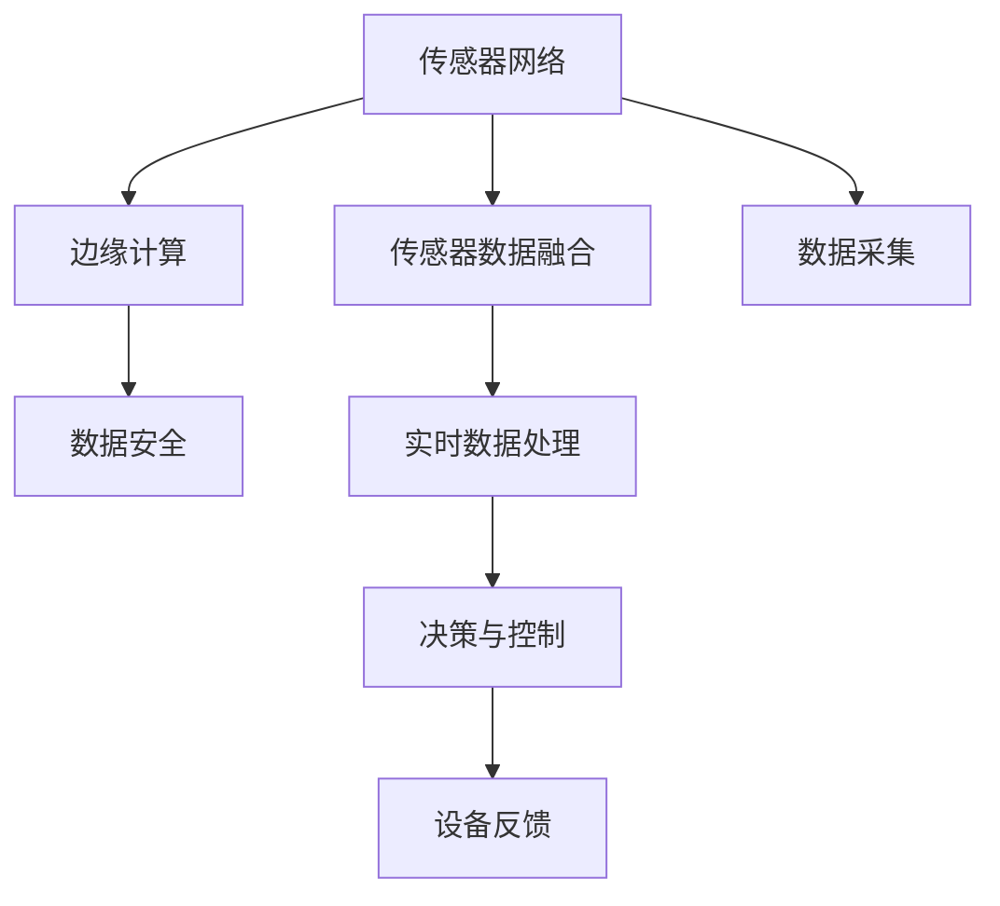

                 

# 物联网(IoT)技术和各种传感器设备的集成：传感器网络的设计与优化

> 关键词：物联网,传感器网络,传感器数据融合,边缘计算,无线传感器网络,大数据,数据安全

## 1. 背景介绍

### 1.1 问题由来
随着数字化和信息化的不断深入，物联网(IoT)技术在各个领域的应用越来越广泛。物联网通过互联各种传感器设备，收集实时数据，实现设备之间、人与设备之间的无缝通信和信息交互，有效提升生产效率、优化运营管理、增强用户体验。然而，传感器数据的高频采集、海量存储、实时处理等需求，对系统架构、数据融合、隐私保护等方面提出了新的挑战。本文将深入探讨传感器网络的构建、数据融合技术、边缘计算应用以及数据安全机制，希望能为传感器网络的优化设计和应用实践提供参考。

### 1.2 问题核心关键点
- **传感器网络(Sensor Network)**：由大量传感器节点构成的网络系统，实现对环境信息的实时监测和数据采集。
- **传感器数据融合(Sensor Data Fusion)**：通过对不同传感器数据进行综合分析，提取出最有价值的信息。
- **边缘计算(Edge Computing)**：在数据源附近进行实时数据分析和处理，降低网络传输压力，提升响应速度。
- **数据安全(Data Security)**：保护传感器数据在采集、存储、传输过程中的安全性，防止数据泄露和攻击。

## 2. 核心概念与联系

### 2.1 核心概念概述

传感器网络由多个传感器节点组成，每个节点包含传感器、微控制器和无线通信模块。通过无线通信协议，节点之间进行数据交互，构成一个自治的网络系统。传感器数据融合是利用多源数据的信息冗余和互补性，提高数据精度和可靠性。边缘计算是指在网络边缘对数据进行实时分析和处理，减少数据传输，提升系统响应速度和可靠性。数据安全涉及传感器数据的保护，防止数据泄露、篡改和非法访问。

这些概念之间的关系可以通过以下Mermaid流程图来展示：



这个流程图展示了传感器网络从数据采集到处理、控制的完整流程：

1. 传感器网络通过无线通信协议采集环境数据。
2. 采集到的数据通过传感器数据融合技术进行综合分析。
3. 融合后的数据在边缘计算设备上进行实时处理。
4. 处理后的数据用于决策和控制，并反馈到传感器网络节点。

这些环节之间相互依赖，构成了一个完整的传感器网络系统。

## 3. 核心算法原理 & 具体操作步骤
### 3.1 算法原理概述

传感器网络的设计与优化，涉及多个关键算法和步骤。包括传感器部署策略、数据采集方式、数据融合算法、边缘计算架构以及数据安全机制。这些算法和步骤相互关联，共同构成了传感器网络的完整系统。

### 3.2 算法步骤详解

**Step 1: 传感器网络部署**
- 选择合适的传感器类型和节点布局，确保网络覆盖范围和数据采集密度。
- 确定传感器的采样频率和采样周期，优化数据采集效率。
- 设计传感器节点的通信协议，确保网络可靠性。

**Step 2: 数据融合处理**
- 选择合适的数据融合算法，如卡尔曼滤波、加权平均、小波变换等，对采集到的数据进行综合处理。
- 设计融合算法中的权重系数和融合规则，优化数据融合效果。
- 进行数据异常检测和剔除，提高数据质量。

**Step 3: 边缘计算架构设计**
- 选择合适的边缘计算平台，如Raspberry Pi、Arduino等，实现实时数据处理。
- 设计数据流管道和处理流程，优化数据传输和处理效率。
- 应用缓存和压缩技术，减少数据传输量。

**Step 4: 数据安全机制**
- 设计数据加密算法和传输协议，保障数据安全。
- 实施访问控制和身份验证机制，限制非法访问。
- 进行数据备份和恢复，防止数据丢失。

### 3.3 算法优缺点

传感器网络的优势在于能够实时采集大量环境数据，为决策提供依据。但同时也存在以下缺点：

- **数据冗余和噪声**：多个传感器采集同一数据可能存在冗余和噪声，影响数据精度。
- **网络通信瓶颈**：大量数据传输可能导致网络拥堵，影响数据实时性。
- **隐私和安全问题**：传感器数据可能包含敏感信息，存在隐私泄露和数据篡改风险。

### 3.4 算法应用领域

传感器网络技术已经在智慧城市、智能农业、工业物联网、智慧家居等多个领域得到了广泛应用，推动了这些领域的信息化和智能化进程。

- **智慧城市**：通过传感器网络监测交通流量、空气质量、水质等环境指标，提升城市管理效率和居民生活质量。
- **智能农业**：利用传感器网络监测土壤湿度、温度、光照等农业参数，优化农业生产，提高作物产量和品质。
- **工业物联网**：通过传感器网络监测设备运行状态、生产环境参数，提高生产效率和产品质量。
- **智慧家居**：通过传感器网络监测室内温度、湿度、安全状态等，提升家居环境舒适度和安全性。

## 4. 数学模型和公式 & 详细讲解 & 举例说明

### 4.1 数学模型构建

传感器网络的优化涉及到多个数学模型，包括数据融合模型、边缘计算模型和数据安全模型。以卡尔曼滤波为例，构建数据融合模型：

设传感器测量数据为 $z(t)$，传感器状态为 $x(t)$，模型参数为 $A$，观测矩阵为 $H$，观测噪声为 $w(t)$，状态噪声为 $v(t)$，则卡尔曼滤波的预测和更新公式如下：

$$
\begin{aligned}
\hat{x}(t|t-1) &= A \hat{x}(t-1|t-1) \\
\hat{P}(t|t-1) &= A \hat{P}(t-1|t-1)A^T + Q \\
K(t) &= \hat{P}(t|t-1)H^T (H \hat{P}(t|t-1)H^T + R)^{-1} \\
\hat{x}(t|t) &= \hat{x}(t|t-1) + K(t) (z(t)-H \hat{x}(t|t-1))
\end{aligned}
$$

其中 $\hat{x}(t|t-1)$ 和 $\hat{P}(t|t-1)$ 为预测值和协方差矩阵，$K(t)$ 为卡尔曼增益，$z(t)$ 为观测值，$Q$ 和 $R$ 为系统噪声和观测噪声协方差矩阵。

### 4.2 公式推导过程

卡尔曼滤波的推导基于系统状态空间模型，分为预测和更新两个阶段：

1. **预测阶段**：根据上一时刻的状态和模型参数，预测当前时刻的状态和协方差矩阵。
2. **更新阶段**：利用观测值和预测值，计算卡尔曼增益，更新当前时刻的状态和协方差矩阵。

卡尔曼滤波的核心在于对状态和噪声的线性化处理，通过递归求解最优解，实现对动态系统的高精度估计。

### 4.3 案例分析与讲解

以智能农业中的土壤湿度监测为例，传感器网络采集多个土壤湿度传感器数据，通过卡尔曼滤波进行数据融合，提升数据精度。具体步骤如下：

1. 选择传感器节点位置，确保覆盖整个农田。
2. 设定传感器采样周期，如每隔10分钟采集一次。
3. 使用卡尔曼滤波对采集到的数据进行融合，得到当前土壤湿度的最优估计。
4. 根据最优估计，控制灌溉系统，确保土壤湿度在适宜范围内。

## 5. 项目实践：代码实例和详细解释说明
### 5.1 开发环境搭建

开发传感器网络应用，需要搭建合适的开发环境。以下是常用的开发工具和库：

1. **Python**：作为传感器网络应用的主要开发语言，Python具有丰富的第三方库和工具。
2. **Raspberry Pi**：低成本、高性能的物联网开发板，适合作为边缘计算平台。
3. **Arduino**：易于上手、功能强大的开源硬件平台，适合进行传感器数据采集。
4. **WiFi和蓝牙模块**：用于传感器节点间的无线通信。
5. **MQTT协议**：轻量级的物联网通信协议，适合传感器网络数据传输。

完成环境搭建后，即可进行传感器网络应用开发。

### 5.2 源代码详细实现

以下是一个简单的智能农业传感器网络应用的Python代码实现：

```python
import paho.mqtt.client as mqtt
import time

# MQTT配置信息
broker_ip = "192.168.1.100"
broker_port = 1883
client = mqtt.Client()

# 传感器节点ID
node_id = "soil_moisture"

# 传感器采样周期
sampling_period = 10 * 60

# 传感器数据转换函数
def convert_value(value):
    return (value - 1023) / 1023 * 100  # 传感器值转换到湿度百分比

# MQTT发布和订阅回调函数
def on_publish(client, userdata, result):
    print("Data published successfully")

def on_connect(client, userdata, flags, rc):
    print(f"Connected to broker with result code {rc}")
    client.subscribe(f"{node_id}/#")

def on_message(client, userdata, msg):
    data = msg.payload.decode('utf-8').split(',')
    sampling_time = time.time()
    if sampling_time % sampling_period == 0:
        print(f"Received data from node {msg.topic}: {data}")
        # 处理传感器数据
        # ...

# 连接MQTT服务器
client.on_publish = on_publish
client.on_connect = on_connect
client.on_message = on_message
client.connect(broker_ip, broker_port, 0)
client.loop_start()

# 循环等待消息
while True:
    time.sleep(1)
```

代码中，通过MQTT协议连接传感器节点，订阅传感器数据，并进行采样周期控制和数据转换处理。

### 5.3 代码解读与分析

**MQTT配置信息**：配置MQTT服务器地址和端口，用于连接传感器节点。

**传感器节点ID和采样周期**：定义传感器节点ID和采样周期，用于传感器数据的管理和处理。

**传感器数据转换函数**：将传感器采集到的值转换为湿度百分比。

**MQTT发布和订阅回调函数**：实现MQTT连接和数据订阅的回调函数。

**连接MQTT服务器**：创建MQTT客户端，连接服务器，并订阅传感器节点数据。

**循环等待消息**：进入无限循环，等待新的传感器数据。

## 6. 实际应用场景
### 6.1 智能家居环境监测

智能家居系统通过传感器网络监测室内环境参数，如温度、湿度、光照等。传感器数据通过边缘计算设备进行实时分析，控制空调、加湿器、窗帘等设备，实现自动化和智能化家居环境管理。

### 6.2 智慧城市交通管理

智慧城市通过传感器网络监测交通流量、道路状况等信息，结合边缘计算和大数据分析，优化交通信号灯控制和车辆调度，提升交通效率和安全性。

### 6.3 智能农业生产监控

智能农业系统通过传感器网络监测土壤湿度、温度、光照等农业参数，结合边缘计算和物联网技术，实现精准农业生产，提高作物产量和品质。

### 6.4 工业物联网设备监控

工业物联网系统通过传感器网络监测设备运行状态、环境参数等信息，结合边缘计算和大数据分析，实现设备故障预测和预警，优化生产流程，提高设备利用率和生产效率。

## 7. 工具和资源推荐
### 7.1 学习资源推荐

为了帮助开发者系统掌握传感器网络技术和应用，以下是一些优质的学习资源：

1. **《物联网基础与技术》**：详细介绍了物联网技术的基本概念、应用场景和实现方法。
2. **《传感器网络基础与设计》**：介绍了传感器网络的基本原理、设计方法和优化策略。
3. **《嵌入式系统设计与开发》**：讲解了嵌入式系统在传感器网络中的应用，包括硬件设计、软件开发和调试。
4. **《物联网安全技术》**：介绍了物联网数据安全和隐私保护的基本技术和实现方法。
5. **《传感器数据融合算法》**：讲解了传感器数据融合的基本算法和应用案例。

通过这些学习资源，相信你一定能够快速掌握传感器网络技术和应用的核心要点。

### 7.2 开发工具推荐

高效的开发离不开优秀的工具支持。以下是几款用于传感器网络开发的常用工具：

1. **Python**：作为传感器网络应用的主要开发语言，Python具有丰富的第三方库和工具。
2. **Raspberry Pi**：低成本、高性能的物联网开发板，适合作为边缘计算平台。
3. **Arduino**：易于上手、功能强大的开源硬件平台，适合进行传感器数据采集。
4. **WiFi和蓝牙模块**：用于传感器节点间的无线通信。
5. **MQTT协议**：轻量级的物联网通信协议，适合传感器网络数据传输。

合理利用这些工具，可以显著提升传感器网络应用的开发效率，加快创新迭代的步伐。

### 7.3 相关论文推荐

传感器网络技术的不断发展，源于学界的持续研究。以下是几篇奠基性的相关论文，推荐阅读：

1. **"Low-power, high-throughput, and full duplex wireless communication: how close are we?"**：介绍低功耗全双工无线通信技术，提升传感器网络数据传输效率。
2. **"A survey on smart home wireless sensor networks: technologies and applications"**：全面综述智能家居无线传感器网络技术及其应用。
3. **"The role of edge computing in IoT and 5G networks: survey, challenges and future directions"**：探讨边缘计算在物联网和5G网络中的作用及其面临的挑战。
4. **"Sensor data fusion techniques: an overview"**：综述传感器数据融合技术的基本算法和方法。
5. **"Security and privacy issues in IoT sensor networks"**：介绍物联网传感器网络的安全和隐私保护技术。

这些论文代表了大规模传感器网络技术的发展脉络。通过学习这些前沿成果，可以帮助研究者把握学科前进方向，激发更多的创新灵感。

## 8. 总结：未来发展趋势与挑战
### 8.1 总结

本文对传感器网络技术进行了全面系统的介绍。首先阐述了传感器网络的基本概念和核心算法，详细讲解了传感器数据的采集、融合、边缘计算和数据安全机制。通过案例分析和代码实现，展示了传感器网络在智慧家居、智慧城市、智能农业和工业物联网等领域的应用。

通过本文的系统梳理，可以看到，传感器网络技术正在成为物联网应用的重要基础，极大地拓展了物联网系统的功能和应用范围，推动了物联网技术的产业化进程。未来，伴随传感器技术的持续演进和算法优化，传感器网络必将在更广阔的应用领域大放异彩。

### 8.2 未来发展趋势

展望未来，传感器网络技术将呈现以下几个发展趋势：

1. **传感器技术创新**：新型的传感器技术不断涌现，如纳米传感器、柔性传感器等，将进一步提升传感器网络的分辨率和可靠性。
2. **边缘计算优化**：随着边缘计算技术的不断发展，传感器数据处理的延迟和带宽需求将进一步降低，提升系统响应速度和稳定性。
3. **数据融合算法改进**：新的数据融合算法将不断涌现，进一步提升传感器数据的精度和可靠性。
4. **物联网安全技术**：数据安全和隐私保护技术将不断升级，保障传感器网络的数据安全。
5. **跨领域应用拓展**：传感器网络将在更多垂直行业得到应用，推动各行业的智能化升级。

以上趋势凸显了传感器网络技术的广阔前景。这些方向的探索发展，必将进一步提升传感器网络的性能和应用范围，为物联网技术的落地应用提供坚实的技术支撑。

### 8.3 面临的挑战

尽管传感器网络技术已经取得了显著进展，但在迈向更加智能化、普适化应用的过程中，仍面临诸多挑战：

1. **传感器功耗问题**：大量传感器设备部署在户外或偏远地区，电池寿命和能耗问题仍需解决。
2. **数据融合精度**：传感器数据的融合需要高精度算法，尤其是在多源数据融合场景中，数据的精度和可靠性难以保证。
3. **边缘计算资源有限**：边缘计算设备的计算能力和存储资源有限，难以支持大规模数据的实时处理。
4. **数据安全风险**：传感器数据涉及个人隐私和商业机密，数据泄露和攻击风险较高。
5. **标准和互操作性**：传感器网络的通信协议和数据格式多样，标准和互操作性问题仍需解决。

这些挑战亟需通过技术创新和产业合作加以解决，以实现传感器网络的广泛应用。

### 8.4 研究展望

面向未来，传感器网络技术需要在以下几个方面寻求新的突破：

1. **低功耗传感器设计**：开发低功耗传感器芯片和模块，延长传感器设备的电池寿命，提升网络覆盖范围和部署灵活性。
2. **分布式边缘计算**：构建分布式边缘计算架构，优化资源配置，提升大规模数据的处理能力。
3. **高精度数据融合算法**：研究和应用高精度数据融合算法，提升传感器数据的精度和可靠性。
4. **安全隐私保护技术**：研究和应用安全隐私保护技术，保障传感器数据的安全性。
5. **统一通信标准**：推动传感器网络通信协议和数据格式的统一标准，促进各设备和系统的互操作性。

这些研究方向的探索，必将引领传感器网络技术迈向更高的台阶，为物联网技术的产业化应用提供坚实的技术保障。

## 9. 附录：常见问题与解答

**Q1：传感器网络的部署策略有哪些？**

A: 传感器网络的部署策略包括：

1. **随机部署**：随机布置传感器节点，确保网络覆盖范围和数据采集密度。
2. **集中部署**：将传感器节点集中部署在特定区域，提高数据采集效率。
3. **分层部署**：按照不同层次布置传感器节点，实现多层次数据采集和处理。

选择合适的部署策略，需要考虑传感器类型、采集频率、网络带宽等因素。

**Q2：传感器数据融合有哪些方法？**

A: 传感器数据融合方法包括：

1. **卡尔曼滤波**：适用于动态系统的数据融合，融合精度高。
2. **加权平均**：简单易实现，适用于静态系统的数据融合。
3. **小波变换**：适用于非线性系统的数据融合，具有多分辨率特性。
4. **神经网络**：利用深度学习技术进行数据融合，适用于复杂系统的数据融合。

选择合适的融合方法，需要考虑系统类型、数据特点和计算资源等因素。

**Q3：边缘计算的架构设计有哪些要求？**

A: 边缘计算架构设计需要考虑：

1. **计算能力**：确保边缘计算设备具有足够的计算能力，支持实时数据处理。
2. **存储能力**：确保边缘计算设备具有足够的存储能力，支持数据缓存和持久化。
3. **网络带宽**：确保边缘计算设备具有足够的带宽，支持数据传输和通信。
4. **安全性**：确保边缘计算设备具有安全性保障，防止数据泄露和攻击。

合理设计边缘计算架构，可以提升传感器网络的响应速度和可靠性。

**Q4：传感器网络的数据安全有哪些措施？**

A: 传感器网络的数据安全措施包括：

1. **数据加密**：使用加密算法对传感器数据进行加密，防止数据泄露。
2. **访问控制**：使用访问控制技术，限制非法访问传感器数据。
3. **身份验证**：使用身份验证技术，确保通信双方的身份合法性。
4. **数据备份**：定期备份传感器数据，防止数据丢失。

合理应用数据安全措施，可以保障传感器网络的数据安全。

---

作者：禅与计算机程序设计艺术 / Zen and the Art of Computer Programming

