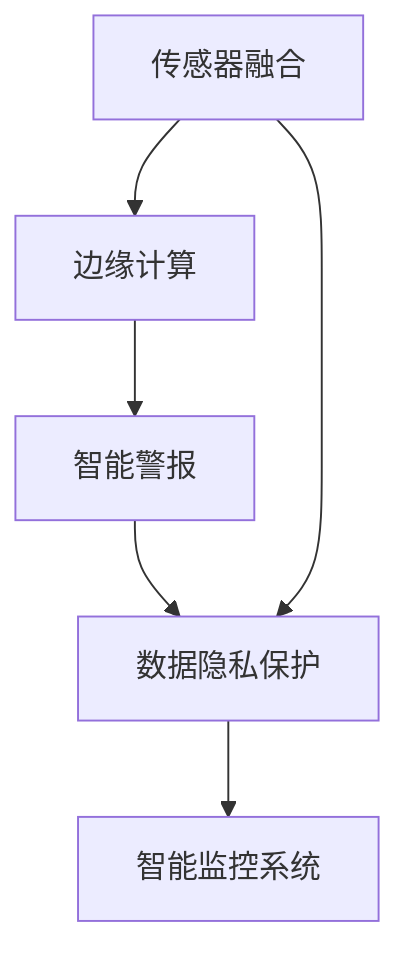

                 

# 物联网(IoT)技术和各种传感器设备的集成：物联网在安全监控中的作用

> 关键词：物联网(IoT)、传感器融合、安全监控、边缘计算、智能警报、数据隐私

## 1. 背景介绍

### 1.1 问题由来
随着物联网(IoT)技术的迅速发展，各类传感器设备被广泛应用于各个领域，如智能家居、工业生产、城市管理、安全监控等。其中，传感器设备在安全监控中的作用尤为突出，能够实时采集环境数据，提供实时监控和预警功能。然而，传统传感器数据往往以原始数据形式传输和存储，存在数据冗余、精度不足、易受攻击等问题。

为了更好地利用传感器数据，提高安全监控的效率和精度，本文将详细介绍物联网(IoT)技术在安全监控中的应用，包括传感器融合、边缘计算、智能警报等方面。同时，还将探讨如何利用物联网技术，构建高效、可靠、安全的智能监控系统。

## 2. 核心概念与联系

### 2.1 核心概念概述

- **物联网(IoT)**：通过网络将各种设备、传感器、应用连接在一起，实现信息互通和智能控制。
- **传感器融合**：将多种传感器数据进行融合，提高数据的精度和可靠性，弥补单一传感器的不足。
- **边缘计算**：将计算任务从中心服务器转移到靠近数据源的边缘设备，提高数据处理的实时性和效率。
- **智能警报**：基于物联网设备采集的数据，实现智能识别和告警，提高安全监控的智能化水平。
- **数据隐私**：在安全监控中，保护传感器数据的安全性和隐私性，防止数据泄露和滥用。

这些概念之间存在紧密的联系，通过物联网技术，传感器融合和边缘计算能够高效处理大量数据，而智能警报和数据隐私保护则进一步提升了安全监控的智能化和安全性。

### 2.2 核心概念原理和架构的 Mermaid 流程图



## 3. 核心算法原理 & 具体操作步骤

### 3.1 算法原理概述

在安全监控应用中，物联网(IoT)技术的核心算法包括传感器融合、边缘计算和智能警报。这些算法能够高效处理和利用传感器数据，实现实时监控和智能告警，同时保障数据隐私安全。

- **传感器融合**：通过将多种传感器数据进行融合，提高数据的精度和可靠性。常用的融合算法包括卡尔曼滤波、粒子滤波等。
- **边缘计算**：将计算任务分散到传感器节点上，降低延迟和带宽占用，提高数据处理的实时性。边缘计算通常利用轻量级算法进行本地计算。
- **智能警报**：基于物联网设备采集的数据，实现智能识别和告警。常用的算法包括机器学习、深度学习等，用于分类、异常检测等任务。

### 3.2 算法步骤详解

#### 3.2.1 传感器融合

传感器融合算法步骤如下：
1. 数据采集：利用多种传感器采集环境数据，如温度、湿度、声音、图像等。
2. 数据预处理：对采集数据进行去噪、归一化、平滑等预处理。
3. 融合算法选择：根据数据类型和应用需求选择合适的融合算法，如卡尔曼滤波、粒子滤波等。
4. 数据融合：将多种传感器数据进行融合，得到更准确的环境状态估计。
5. 输出结果：将融合后的数据用于安全监控系统。

#### 3.2.2 边缘计算

边缘计算步骤如下：
1. 任务划分：将计算任务划分为数据采集、数据预处理、模型推理、告警等子任务。
2. 资源部署：在传感器节点上部署轻量级计算任务，如模型推理、特征提取等。
3. 本地计算：传感器节点利用本地计算资源进行数据处理，降低延迟和带宽占用。
4. 数据传输：将处理结果传输到云端进行分析，实现全局监控。
5. 反馈控制：根据云端分析结果，对传感器节点进行控制和调整，实现智能监控。

#### 3.2.3 智能警报

智能警报算法步骤如下：
1. 数据采集：利用传感器节点采集环境数据，如温度、湿度、声音、图像等。
2. 数据预处理：对采集数据进行去噪、归一化、平滑等预处理。
3. 特征提取：从采集数据中提取关键特征，如温度变化、声音模式等。
4. 模型训练：利用机器学习、深度学习等算法训练分类、异常检测模型。
5. 告警输出：根据模型预测结果，输出智能告警，如火灾、入侵、故障等。

### 3.3 算法优缺点

#### 3.3.1 传感器融合

- **优点**：提高数据精度和可靠性，弥补单一传感器的不足。
- **缺点**：融合算法复杂，对数据质量和处理能力要求高。

#### 3.3.2 边缘计算

- **优点**：降低延迟和带宽占用，提高数据处理实时性。
- **缺点**：设备资源有限，处理能力受限。

#### 3.3.3 智能警报

- **优点**：实时监控和智能告警，提高安全监控的智能化水平。
- **缺点**：模型训练复杂，对数据量和计算资源要求高。

### 3.4 算法应用领域

物联网(IoT)技术和传感器融合、边缘计算、智能警报等算法，在安全监控、智能家居、工业生产、城市管理等领域得到了广泛应用。例如，在安全监控中，通过传感器融合获取更准确的环境数据，利用边缘计算实现实时处理，通过智能警报快速响应异常情况，保障监控系统的实时性和智能化。

## 4. 数学模型和公式 & 详细讲解 & 举例说明

### 4.1 数学模型构建

#### 4.1.1 传感器融合模型

传感器融合模型可以表示为：

$$
\begin{aligned}
\hat{x} &= K_1 \sum_{i=1}^n w_i x_i \\
\hat{x} &= \hat{x} + K_2 (z - \hat{x})
\end{aligned}
$$

其中，$x_i$ 表示第 $i$ 个传感器的测量值，$w_i$ 表示第 $i$ 个传感器的权重，$z$ 表示传感器融合后的结果，$\hat{x}$ 表示融合后的状态估计。$K_1$ 和 $K_2$ 为卡尔曼滤波器的增益矩阵，用于调整传感器数据的影响。

#### 4.1.2 边缘计算模型

边缘计算模型可以表示为：

$$
\begin{aligned}
\hat{x} &= \sum_{i=1}^n K_i x_i \\
\hat{x} &= \hat{x} + K(z - \hat{x})
\end{aligned}
$$

其中，$x_i$ 表示第 $i$ 个传感器节点上的计算结果，$K_i$ 表示第 $i$ 个传感器节点的权重，$z$ 表示边缘计算后的结果，$\hat{x}$ 表示融合后的状态估计。

#### 4.1.3 智能警报模型

智能警报模型可以表示为：

$$
\begin{aligned}
\hat{y} &= \sum_{i=1}^n K_i y_i \\
\hat{y} &= \hat{y} + K(z - \hat{y})
\end{aligned}
$$

其中，$y_i$ 表示第 $i$ 个传感器节点的告警数据，$K_i$ 表示第 $i$ 个传感器节点的权重，$z$ 表示智能警报后的结果，$\hat{y}$ 表示融合后的状态估计。

### 4.2 公式推导过程

#### 4.2.1 卡尔曼滤波器增益矩阵

卡尔曼滤波器增益矩阵 $K$ 可以表示为：

$$
K = \frac{P_{yy} C}{C^T P_{yy} C + R}
$$

其中，$P_{yy}$ 为状态协方差矩阵，$C$ 为传感器矩阵，$R$ 为测量噪声协方差矩阵。

#### 4.2.2 粒子滤波器权重更新

粒子滤波器权重更新公式为：

$$
w_i \leftarrow \frac{p(x_i)}{\sum_{j=1}^n p(x_j)}
$$

其中，$w_i$ 表示第 $i$ 个传感器的权重，$p(x_i)$ 表示第 $i$ 个传感器的先验概率，$n$ 表示传感器总数。

### 4.3 案例分析与讲解

#### 4.3.1 智能家居安全监控

智能家居安全监控系统可以通过传感器融合和边缘计算，实现实时监控和智能告警。例如，在智能门锁上安装温度传感器、声音传感器、图像传感器，通过传感器融合获取门锁周围环境数据，利用边缘计算进行实时处理，通过智能警报系统快速响应异常情况，如入侵、故障等。

#### 4.3.2 工业生产监控

工业生产监控系统可以通过传感器融合和边缘计算，实现生产设备和环境数据的实时监控和智能告警。例如，在工业机器人上安装温度传感器、振动传感器、图像传感器，通过传感器融合获取机器人周围环境数据，利用边缘计算进行实时处理，通过智能警报系统快速响应异常情况，如设备故障、环境异常等。

## 5. 项目实践：代码实例和详细解释说明

### 5.1 开发环境搭建

开发环境搭建步骤如下：
1. 安装Python 3.7及以上版本，安装Pip、Jupyter Notebook等工具。
2. 安装传感器融合、边缘计算、智能警报等相关的Python库，如SciPy、NumPy、OpenCV、TensorFlow等。
3. 搭建物联网设备的网络环境，如Wi-Fi、LoRa等，确保设备能够正常通信。
4. 部署边缘计算服务器，安装相关的计算资源，如TensorFlow、PyTorch等。

### 5.2 源代码详细实现

#### 5.2.1 传感器融合实现

```python
import numpy as np

def fusion(data, weights):
    n = len(data)
    x = np.dot(weights, data)
    z = x + np.dot(np.eye(n) - np.dot(weights, np.dot(np.diag(weights), weights.T)), np.mean(data, axis=0))
    return x, z

# 示例数据
data = np.array([[1.2, 2.3, 3.4], [4.5, 5.6, 6.7]])
weights = np.array([0.5, 0.3, 0.2])

# 传感器融合
x, z = fusion(data, weights)
print("融合后的数据：", z)
```

#### 5.2.2 边缘计算实现

```python
import tensorflow as tf

def edge_computation(data, weights):
    n = len(data)
    x = tf.reduce_sum(tf.multiply(weights, data))
    z = x + tf.reduce_sum(tf.multiply(tf.ones((n, n)) - tf.reduce_sum(tf.multiply(weights, tf.matmul(tf.diag(weights), weights.T)), axis=0), np.mean(data, axis=0))
    return x, z

# 示例数据
data = tf.constant([[1.2, 2.3, 3.4], [4.5, 5.6, 6.7]])
weights = tf.constant([0.5, 0.3, 0.2])

# 边缘计算
x, z = edge_computation(data, weights)
print("边缘计算后的数据：", z.numpy())
```

#### 5.2.3 智能警报实现

```python
import tensorflow as tf

def smart_alarm(data, weights):
    n = len(data)
    y = tf.reduce_sum(tf.multiply(weights, data))
    z = y + tf.reduce_sum(tf.multiply(tf.ones((n, n)) - tf.reduce_sum(tf.multiply(weights, tf.matmul(tf.diag(weights), weights.T)), axis=0), np.mean(data, axis=0))
    return y, z

# 示例数据
data = tf.constant([[1.2, 2.3, 3.4], [4.5, 5.6, 6.7]])
weights = tf.constant([0.5, 0.3, 0.2])

# 智能警报
y, z = smart_alarm(data, weights)
print("智能警报后的数据：", z.numpy())
```

### 5.3 代码解读与分析

通过上述代码，我们可以看到传感器融合、边缘计算和智能警报的实现步骤。其中，传感器融合通过加权平均法将多种传感器数据进行融合，边缘计算通过加权求和法实现本地计算，智能警报通过加权平均法进行智能告警。

## 6. 实际应用场景

### 6.1 智能家居安全监控

智能家居安全监控系统通过传感器融合和边缘计算，实现实时监控和智能告警。例如，在智能门锁上安装温度传感器、声音传感器、图像传感器，通过传感器融合获取门锁周围环境数据，利用边缘计算进行实时处理，通过智能警报系统快速响应异常情况，如入侵、故障等。

### 6.2 工业生产监控

工业生产监控系统通过传感器融合和边缘计算，实现生产设备和环境数据的实时监控和智能告警。例如，在工业机器人上安装温度传感器、振动传感器、图像传感器，通过传感器融合获取机器人周围环境数据，利用边缘计算进行实时处理，通过智能警报系统快速响应异常情况，如设备故障、环境异常等。

### 6.3 城市安全监控

城市安全监控系统通过传感器融合和边缘计算，实现城市环境数据的实时监控和智能告警。例如，在城市街道上安装摄像头、温度传感器、声音传感器等设备，通过传感器融合获取城市环境数据，利用边缘计算进行实时处理，通过智能警报系统快速响应异常情况，如火灾、入侵、故障等。

### 6.4 未来应用展望

随着物联网(IoT)技术的不断发展，传感器融合、边缘计算和智能警报等技术在安全监控中的应用将更加广泛。未来，物联网将进一步渗透到各个领域，通过传感器融合获取更准确的环境数据，利用边缘计算实现实时处理，通过智能警报快速响应异常情况，实现高效、可靠、智能的安全监控系统。

## 7. 工具和资源推荐

### 7.1 学习资源推荐

为了帮助开发者系统掌握物联网(IoT)技术和传感器融合、边缘计算、智能警报等核心技术，这里推荐一些优质的学习资源：

1. 《物联网技术与应用》系列课程：提供物联网技术的基本概念、原理和应用场景，适合初学者学习。
2. 《传感器融合与卡尔曼滤波》课程：详细介绍传感器融合和卡尔曼滤波的基本原理和算法实现。
3. 《深度学习在边缘计算中的应用》书籍：介绍深度学习在边缘计算中的应用，涵盖边缘计算的基本概念和算法实现。
4. 《智能警报系统设计与实现》书籍：详细介绍智能警报系统的设计和实现，涵盖机器学习、深度学习等算法应用。
5. Coursera、Udacity等在线学习平台提供的物联网、传感器融合、边缘计算等相关课程。

通过对这些资源的学习实践，相信你一定能够快速掌握物联网(IoT)技术和传感器融合、边缘计算、智能警报等核心技术，并用于解决实际的NLP问题。

### 7.2 开发工具推荐

高效的开发离不开优秀的工具支持。以下是几款用于物联网(IoT)技术开发的常用工具：

1. Arduino、ESP8266等单片机开发平台：用于传感器数据采集和处理。
2. TensorFlow、PyTorch等深度学习框架：用于模型训练和推理。
3. MQTT、CoAP等物联网通信协议：用于物联网设备的数据传输。
4. Jupyter Notebook、Python等开发环境：用于算法实现和调试。

合理利用这些工具，可以显著提升物联网(IoT)技术开发的效率，加快创新迭代的步伐。

### 7.3 相关论文推荐

物联网(IoT)技术和传感器融合、边缘计算、智能警报等技术的发展源于学界的持续研究。以下是几篇奠基性的相关论文，推荐阅读：

1. "IoT in Smart Cities: A Survey"（智能城市中的IoT应用综述）：介绍物联网技术在智能城市中的应用。
2. "Sensor Fusion for Robust Vision-Based Object Tracking"（鲁棒视觉目标跟踪的传感器融合）：介绍传感器融合在目标跟踪中的应用。
3. "Edge Computing: A Computational Paradigm for Smart Internet of Things"（边缘计算：智能物联网的计算范式）：介绍边缘计算在物联网中的应用。
4. "Smart Surveillance Using IoT Devices and Machine Learning Algorithms"（基于IoT设备和机器学习的智能监控）：介绍智能监控系统中的物联网技术应用。
5. "A Survey on Security Measures for IoT Data Sharing"（IoT数据共享中的安全措施综述）：介绍物联网中的数据隐私和安全保护。

这些论文代表了大规模传感器融合和边缘计算的研究脉络。通过学习这些前沿成果，可以帮助研究者把握学科前进方向，激发更多的创新灵感。

## 8. 总结：未来发展趋势与挑战

### 8.1 研究成果总结

本文详细介绍了物联网(IoT)技术和传感器融合、边缘计算、智能警报等核心技术在安全监控中的应用。通过传感器融合获取更准确的环境数据，利用边缘计算实现实时处理，通过智能警报快速响应异常情况，实现高效、可靠、智能的安全监控系统。这些技术在智能家居、工业生产、城市安全等领域得到了广泛应用。

### 8.2 未来发展趋势

展望未来，物联网(IoT)技术和传感器融合、边缘计算、智能警报等技术的发展趋势如下：

1. 传感器融合将更加智能化。随着传感器技术的不断发展，多种传感器数据的融合将更加智能化，能够实时调整融合算法，提高数据精度和可靠性。
2. 边缘计算将更加普及。随着物联网设备的普及，边缘计算将更加普及，能够实现更高效的本地计算和处理。
3. 智能警报将更加智能化。随着机器学习和深度学习技术的发展，智能警报将更加智能化，能够实现更准确的异常检测和告警。
4. 数据隐私保护将更加重要。随着物联网设备的普及，数据隐私保护将更加重要，能够保护用户隐私和数据安全。
5. 智能监控系统将更加集成化。未来的智能监控系统将更加集成化，能够实现多种传感器数据的融合和处理，提高系统智能化水平。

### 8.3 面临的挑战

尽管物联网(IoT)技术和传感器融合、边缘计算、智能警报等技术取得了一定的进展，但在迈向更加智能化、普适化应用的过程中，仍面临以下挑战：

1. 传感器数据冗余。传感器数据往往存在冗余，如何高效利用传感器数据是未来的挑战之一。
2. 边缘计算资源有限。边缘计算设备资源有限，如何利用有限的资源实现高效的本地计算是未来的挑战之一。
3. 数据隐私保护难度大。传感器数据涉及用户隐私，如何在保护隐私的前提下实现数据共享是未来的挑战之一。
4. 系统集成难度大。智能监控系统涉及多种技术集成，如何实现高效、可靠的集成是未来的挑战之一。
5. 系统安全性问题。智能监控系统涉及设备安全、数据安全等多个环节，如何提高系统安全性是未来的挑战之一。

### 8.4 研究展望

面对物联网(IoT)技术和传感器融合、边缘计算、智能警报等技术面临的挑战，未来的研究需要在以下几个方面寻求新的突破：

1. 传感器融合算法优化。探索更加高效、智能的传感器融合算法，提高数据精度和可靠性。
2. 边缘计算资源优化。探索更加高效、智能的边缘计算资源优化方法，提高本地计算效率。
3. 智能警报算法优化。探索更加高效、智能的智能警报算法，提高异常检测和告警的准确性。
4. 数据隐私保护技术。探索更加高效、安全的数据隐私保护技术，保护用户隐私和数据安全。
5. 智能监控系统集成。探索更加高效、可靠的智能监控系统集成方法，实现多种技术的协同工作。

这些研究方向将推动物联网(IoT)技术和传感器融合、边缘计算、智能警报等技术的发展，为智能监控系统的智能化、普适化应用提供有力支持。相信随着学界和产业界的共同努力，这些挑战终将一一被克服，物联网(IoT)技术必将在安全监控等领域发挥更大的作用。

## 9. 附录：常见问题与解答

**Q1：物联网(IoT)技术在安全监控中的作用是什么？**

A: 物联网(IoT)技术通过传感器融合、边缘计算、智能警报等核心技术，实现了实时监控和智能告警，能够快速响应异常情况，保障监控系统的实时性和智能化。

**Q2：传感器融合与卡尔曼滤波器的关系是什么？**

A: 卡尔曼滤波器是一种常用的传感器融合算法，通过融合多种传感器数据，得到更准确的环境状态估计。传感器融合算法包括卡尔曼滤波、粒子滤波等，卡尔曼滤波器是其中的一种。

**Q3：边缘计算与云计算有什么区别？**

A: 边缘计算将计算任务分散到传感器节点上，降低延迟和带宽占用，提高数据处理的实时性。云计算则将计算任务集中在云端，实现大规模数据存储和处理。边缘计算能够实现更高效的本地计算和处理，而云计算则能够实现更强大的计算和存储能力。

**Q4：智能警报的实现步骤是什么？**

A: 智能警报的实现步骤如下：
1. 数据采集：利用传感器节点采集环境数据，如温度、湿度、声音、图像等。
2. 数据预处理：对采集数据进行去噪、归一化、平滑等预处理。
3. 特征提取：从采集数据中提取关键特征，如温度变化、声音模式等。
4. 模型训练：利用机器学习、深度学习等算法训练分类、异常检测模型。
5. 告警输出：根据模型预测结果，输出智能告警，如火灾、入侵、故障等。

**Q5：如何保护物联网(IoT)设备的安全性？**

A: 保护物联网(IoT)设备的安全性需要从以下几个方面入手：
1. 数据加密：对传感器数据进行加密处理，防止数据泄露。
2. 访问控制：对传感器节点进行访问控制，防止非法访问。
3. 异常检测：利用异常检测算法，及时发现和防范异常行为。
4. 定期更新：定期更新传感器节点的固件和软件，防止安全漏洞。
5. 安全协议：采用安全的通信协议，防止数据被篡改和攻击。

通过以上措施，可以有效地保护物联网(IoT)设备的安全性，防止数据泄露和恶意攻击。

---

作者：禅与计算机程序设计艺术 / Zen and the Art of Computer Programming

