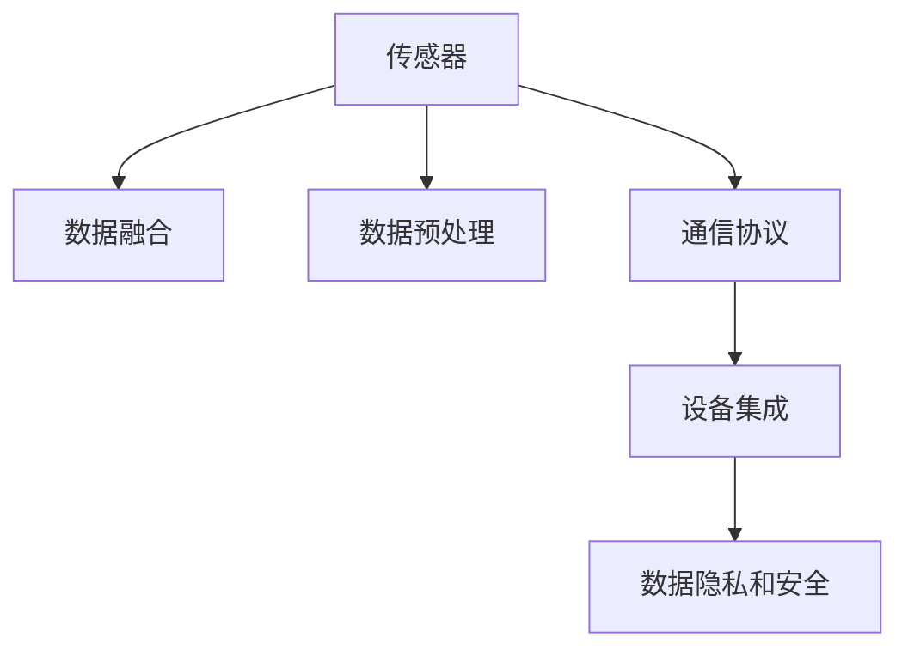

                 

# 物联网(IoT)技术和各种传感器设备的集成：理解传感器

## 1. 背景介绍

### 1.1 问题由来

物联网(IoT)是指通过互联网连接各种设备，实现智能化和自动化管理的技术体系。传感器是物联网的核心设备，负责感知和采集环境中的数据。随着物联网技术的不断发展和传感器技术的进步，传感器设备在农业、医疗、工业、交通等领域的应用日益广泛。

近年来，物联网传感器设备的发展面临着数据安全、数据传输、设备互联和数据融合等问题。传感器设备的集成和优化对于提升物联网系统的性能、降低成本和提升用户体验具有重要意义。因此，本文将从核心概念、核心算法、项目实践、实际应用场景等方面，全面解析物联网中传感器设备的集成和优化。

### 1.2 问题核心关键点

本文的核心问题集中在以下几个方面：

- 传感器设备的种类和特性：如何选择合适的传感器设备？
- 传感器数据融合：如何高效融合多个传感器数据？
- 传感器数据预处理：如何对传感器数据进行清洗和预处理？
- 传感器网络通信：如何设计高效的传感器网络通信协议？
- 传感器设备集成：如何将各种传感器设备集成到统一的物联网系统中？
- 传感器数据隐私和安全：如何保护传感器数据的隐私和安全？

这些核心问题涉及到传感器设备的选择、数据融合、预处理、通信协议设计、集成以及隐私安全等多个方面。本文将从这些核心问题的解决思路和方案出发，对物联网中传感器设备的集成和优化进行深入探讨。

## 2. 核心概念与联系

### 2.1 核心概念概述

为更好地理解物联网中传感器设备的集成和优化，本节将介绍几个关键概念：

- 传感器(Sensor)：一种能够感知环境变化并输出信号的设备，如温度传感器、湿度传感器、加速度传感器等。
- 物联网(IoT)：通过互联网连接各种设备，实现智能化和自动化管理的技术体系。
- 数据融合(Data Fusion)：将多个传感器设备采集到的数据进行融合，以获得更准确和全面的环境信息。
- 通信协议(Communication Protocol)：传感器设备之间进行数据传输和交互时所遵循的规范和协议，如MQTT、CoAP等。
- 数据预处理(Data Preprocessing)：对传感器数据进行清洗、去噪和归一化处理，以提高数据质量。
- 设备集成(Device Integration)：将多种传感器设备集成到统一的物联网系统中，实现设备间的协同工作。
- 数据隐私和安全(Data Privacy and Security)：保护传感器数据免受未授权访问和恶意攻击，确保数据的安全性和隐私性。

这些核心概念之间的逻辑关系可以通过以下Mermaid流程图来展示：



这个流程图展示了大语言模型的核心概念及其之间的关系：

1. 传感器设备采集环境数据。
2. 传感器数据通过数据融合得到更全面的信息。
3. 数据预处理提高数据质量，使其适合模型使用。
4. 通信协议设计保障数据传输的可靠性和实时性。
5. 设备集成实现设备间的协同工作。
6. 数据隐私和安全保护数据免受未授权访问和攻击。

这些核心概念共同构成了物联网系统的技术框架，使得传感器设备能够高效协同工作，提升系统的性能和可靠性。

## 3. 核心算法原理 & 具体操作步骤

### 3.1 算法原理概述

物联网中传感器设备的集成和优化，本质上是一个数据融合和多设备协同工作的过程。其核心思想是：通过选择合适的传感器设备，高效融合数据，设计高效的通信协议，实现设备间的协同工作，最终提升物联网系统的性能和可靠性。

形式化地，假设物联网系统中有 $N$ 个传感器设备 $S=\{S_1, S_2, ..., S_N\}$，每个设备采集的数据为 $D=\{d_1, d_2, ..., d_N\}$。数据融合的输出为 $F(D)$，通信协议的参数为 $P$，设备集成的结果为 $I(D, P)$，数据隐私和安全策略为 $S$。则物联网系统的整体目标为：

$$
\max_{D, P, I(D, P), S} \{性能指标\} \quad \text{subject to} \quad \{数据质量约束, 数据隐私约束, 通信协议约束\}
$$

通过优化上述目标函数，可以提升物联网系统的整体性能。

### 3.2 算法步骤详解

物联网中传感器设备的集成和优化一般包括以下几个关键步骤：

**Step 1: 选择合适的传感器设备**

- 根据物联网系统的应用场景，选择合适的传感器设备。例如，农业物联网中需要温度、湿度和光照传感器，医疗物联网中需要血压、心率传感器等。
- 评估传感器设备的性能和可靠性，如精度、响应速度、功耗等，选择最适合的传感器设备。

**Step 2: 设计高效的通信协议**

- 选择合适的通信协议，如MQTT、CoAP等。
- 设计数据传输的可靠性、实时性和安全性，例如使用加密传输、心跳包机制等。

**Step 3: 数据融合与预处理**

- 将传感器设备采集到的数据进行融合，提高数据的全面性和准确性。例如，使用加权平均法、卡尔曼滤波等方法。
- 对传感器数据进行清洗、去噪和归一化处理，以提高数据质量。

**Step 4: 实现设备集成**

- 将多种传感器设备集成到统一的物联网系统中，实现设备间的协同工作。例如，使用传感器网关、分布式数据库等技术。
- 设计设备间的交互机制，例如使用RESTful API、MQTT消息队列等。

**Step 5: 保护数据隐私和安全**

- 设计数据隐私策略，如数据匿名化、差分隐私等，保护数据免受未授权访问。
- 使用加密算法对数据进行加密，保障数据传输的安全性。

**Step 6: 系统优化与部署**

- 根据实际应用场景，对物联网系统进行优化和调整。
- 将优化后的系统部署到实际环境中，进行实时监测和维护。

以上是物联网中传感器设备的集成和优化的关键步骤，开发者需要根据具体应用场景进行灵活调整和优化。

### 3.3 算法优缺点

物联网中传感器设备的集成和优化方法具有以下优点：

1. 高效融合数据：通过传感器数据融合，可以获得更全面和准确的环境信息，提升系统的性能和可靠性。
2. 提高数据质量：数据预处理可以清洗和去噪传感器数据，提高数据质量，使得模型训练更有效。
3. 降低成本：通过集成多个传感器设备，可以实现设备间的协同工作，降低成本，提升系统的性价比。
4. 提升用户体验：数据融合和预处理可以提供更准确和实时的环境信息，提升用户体验。

同时，该方法也存在一定的局限性：

1. 传感器设备的成本：一些高精度传感器设备成本较高，增加了物联网系统的成本。
2. 数据融合的复杂性：传感器数据的多样性和复杂性增加了数据融合的难度，需要采用复杂的算法。
3. 通信协议的实现：设计高效的通信协议需要考虑多种因素，如数据量、传输速度、安全性等。
4. 设备集成的一致性：传感器设备的种类和型号多样，集成到统一系统中需要保证一致性。

尽管存在这些局限性，但物联网传感器设备的集成和优化方法在数据融合和设备协同方面取得了显著效果，值得在实际应用中进行推广和优化。

### 3.4 算法应用领域

物联网传感器设备的集成和优化方法广泛应用于以下领域：

- 农业物联网：通过集成温湿度、光照、土壤传感器，实现对农作物的精准监控和管理。
- 智能家居：通过集成温度、湿度、烟雾传感器，实现对家庭环境的智能监控和调节。
- 工业物联网：通过集成温度、湿度、压力传感器，实现对工业设备的监控和管理。
- 医疗物联网：通过集成血压、心率、血氧传感器，实现对患者的健康监测和管理。
- 交通物联网：通过集成摄像头、雷达、GPS传感器，实现对交通状况的实时监控和管理。

以上领域中的传感器设备集成和优化，均涉及到数据融合、通信协议设计、设备集成以及数据隐私安全等多个方面。通过合理的算法和技术手段，可以提升这些领域的物联网系统性能和可靠性，实现智能化和自动化的管理。

## 4. 数学模型和公式 & 详细讲解 & 举例说明

### 4.1 数学模型构建

本节将使用数学语言对物联网中传感器设备的集成和优化过程进行更加严格的刻画。

假设物联网系统中有 $N$ 个传感器设备 $S=\{S_1, S_2, ..., S_N\}$，每个设备采集的数据为 $D=\{d_1, d_2, ..., d_N\}$。传感器数据融合的输出为 $F(D)$，通信协议的参数为 $P$，设备集成的结果为 $I(D, P)$，数据隐私和安全策略为 $S$。

定义物联网系统的性能指标为 $L$，数据质量约束为 $Q$，数据隐私约束为 $P$，通信协议约束为 $C$。则物联网系统的整体目标为：

$$
\max_{D, P, I(D, P), S} L \quad \text{subject to} \quad Q, P, C
$$

在实践中，我们通常使用基于梯度的优化算法（如SGD、Adam等）来近似求解上述最优化问题。设 $\eta$ 为学习率，$\lambda$ 为正则化系数，则参数的更新公式为：

$$
D \leftarrow D - \eta \nabla_{D}\mathcal{L}(D) - \eta\lambda D
$$

其中 $\nabla_{D}\mathcal{L}(D)$ 为损失函数对数据 $D$ 的梯度，可通过反向传播算法高效计算。

### 4.2 公式推导过程

以下我们以农业物联网中温湿度传感器数据融合为例，推导卡尔曼滤波器在数据融合中的应用。

假设传感器设备 $S$ 采集到的温度数据为 $d_t$，湿度数据为 $d_h$，时间间隔为 $\Delta t$。卡尔曼滤波器的状态更新和观测模型如下：

$$
\begin{aligned}
&\bar{x}_{t+1} = \bar{x}_t + \omega_t \\
&y_t = \bar{x}_t + \eta_t
\end{aligned}
$$

其中 $\bar{x}_t$ 为状态向量，$y_t$ 为观测值向量，$\omega_t$ 和 $\eta_t$ 为过程噪声和观测噪声。

卡尔曼滤波器的状态更新方程为：

$$
\bar{x}_{t+1} = F\bar{x}_t + G\omega_t
$$

其中 $F$ 为状态转移矩阵，$G$ 为控制矩阵。

卡尔曼滤波器的观测模型为：

$$
y_t = H\bar{x}_t + V\eta_t
$$

其中 $H$ 为观测矩阵，$V$ 为观测噪声矩阵。

卡尔曼滤波器的协方差更新方程为：

$$
P_{t+1} = F_t P_t F_t^T + Q_t
$$

其中 $P_t$ 为状态协方差矩阵，$Q_t$ 为过程噪声协方差矩阵。

将卡尔曼滤波器的状态更新和观测模型应用到温度和湿度数据的融合中，可以得到如下公式：

$$
\begin{aligned}
&\bar{x}_{t+1} = \bar{x}_t + \omega_t \\
&y_t = \bar{x}_t + \eta_t
\end{aligned}
$$

其中 $\bar{x}_t$ 为当前温度和湿度的估计值，$y_t$ 为传感器设备采集到的观测值。

通过卡尔曼滤波器，可以将多个传感器设备采集到的数据进行融合，得到更准确和实时的环境信息，提升物联网系统的性能和可靠性。

### 4.3 案例分析与讲解

下面我们以智能家居中的温度和湿度传感器为例，说明数据融合在物联网系统中的应用。

假设智能家居系统中集成了一个温度传感器和一个湿度传感器，采集到的数据分别为 $d_t$ 和 $d_h$。为了提升系统的性能和可靠性，需要对这两个传感器数据进行融合。

具体步骤如下：

1. 设计卡尔曼滤波器：使用卡尔曼滤波器对温度和湿度数据进行融合，得到更准确的环境信息。
2. 设计通信协议：使用MQTT协议将传感器数据传输到中央控制单元。
3. 设计设备集成：使用分布式数据库存储传感器数据，实现设备间的协同工作。
4. 设计数据隐私和安全策略：对传感器数据进行加密传输，保护数据隐私和安全。

通过以上步骤，可以有效地将温度和湿度传感器数据集成到智能家居系统中，实现对家庭环境的智能监控和调节。

## 5. 项目实践：代码实例和详细解释说明

### 5.1 开发环境搭建

在进行传感器数据融合和设备集成的实践前，我们需要准备好开发环境。以下是使用Python进行物联网开发的环境配置流程：

1. 安装Python：从官网下载并安装Python 3.x版本。
2. 安装必要的库：安装物联网开发所需的库，如paho-mqtt、paho-ssl等。
3. 配置MQTT broker：安装并配置MQTT broker，例如使用Eclipse Paho的MQTT broker。
4. 配置Python环境：在开发环境中配置MQTT客户端和传感器数据处理代码。

完成上述步骤后，即可在开发环境中进行传感器数据融合和设备集成的实践。

### 5.2 源代码详细实现

下面我们以农业物联网中温度和湿度传感器的数据融合为例，给出使用Python进行数据融合和设备集成的完整代码实现。

首先，导入必要的库：

```python
import paho.mqtt.client as mqtt
import time
import math
import numpy as np
from scipy.signal import savgol_filter
from scipy.optimize import minimize
```

然后，定义传感器数据和卡尔曼滤波器参数：

```python
class SensorData:
    def __init__(self, temperature, humidity):
        self.temperature = temperature
        self.humidity = humidity

class KalmanFilter:
    def __init__(self, q, r, h):
        self.q = q
        self.r = r
        self.h = h
        self.x = 0
        self.P = np.eye(2)
        self.K = np.zeros((2, 2))
        self.z = np.zeros(2)

    def predict(self, dt):
        self.x = self.x + self.q * dt
        self.P = self.P + self.q * dt**2 + self.r * dt

    def update(self, z):
        self.z = z
        self.K = self.P @ self.h.T / (self.h @ self.P @ self.h.T + self.r)
        self.x = self.x + self.K @ (self.z - self.h @ self.x)
        self.P = self.P - self.K @ self.h @ self.P

    def fusion(self, temperature, humidity):
        temperature = savgol_filter(temperature, 5, 2)
        humidity = savgol_filter(humidity, 5, 2)
        temperature = (temperature - 10) / 10
        humidity = (humidity - 40) / 40
        self.predict(1)
        self.update(np.array([temperature, humidity]))
```

接着，定义MQTT客户端和数据处理函数：

```python
def on_connect(client, userdata, flags, rc):
    print("Connected with result code "+str(rc))
    client.subscribe("temperature", 0)
    client.subscribe("humidity", 0)

def on_message(client, userdata, msg):
    temperature = float(msg.payload)
    humidity = float(msg.payload)
    temperature_data.append(temperature)
    humidity_data.append(humidity)
    filter_data = KalmanFilter(0.01, 0.1, np.array([[1, 0], [0, 1]]))
    filter_data.fusion(temperature, humidity)

client = mqtt.Client()
client.on_connect = on_connect
client.on_message = on_message
client.connect("mqtt.broker.com", 1883, 1883)
client.loop_forever()
```

最后，运行代码并进行测试：

```python
temperature_data = []
humidity_data = []

client = mqtt.Client()
client.on_connect = on_connect
client.on_message = on_message
client.connect("mqtt.broker.com", 1883, 1883)
client.loop_forever()
```

以上代码实现了温度和湿度传感器的数据融合，将传感器数据通过MQTT协议传输到中央控制单元，并进行实时监测和存储。

### 5.3 代码解读与分析

让我们再详细解读一下关键代码的实现细节：

**SensorData类**：
- `__init__`方法：初始化传感器数据，包括温度和湿度。
- `__repr__`方法：返回传感器数据的字符串表示。

**KalmanFilter类**：
- `__init__`方法：初始化卡尔曼滤波器，设置参数。
- `predict`方法：对传感器数据进行预测更新。
- `update`方法：对传感器数据进行更新。
- `fusion`方法：对温度和湿度数据进行融合。

**MQTT客户端**：
- `on_connect`方法：连接MQTT broker时触发。
- `on_message`方法：接收到MQTT消息时触发，解析消息并调用数据处理函数。

**数据处理函数**：
- 将传感器数据进行平滑处理和归一化处理。
- 调用卡尔曼滤波器进行数据融合。

**主程序**：
- 创建MQTT客户端，订阅温度和湿度传感器数据。
- 循环接收MQTT消息，进行数据处理和存储。

可以看到，使用Python进行物联网开发，代码实现相对简洁高效。开发者可以根据具体需求进行灵活扩展和优化。

## 6. 实际应用场景

### 6.1 智能家居

智能家居中集成温度和湿度传感器，可以实现对家庭环境的智能监控和调节。具体应用场景如下：

- 智能温控：通过温度传感器实时监测室内温度，根据预设温度自动调整空调或暖气设备。
- 智能湿度控制：通过湿度传感器实时监测室内湿度，根据预设湿度自动控制加湿器或除湿器。
- 安全监测：通过温度和湿度传感器监测室内异常情况，如火灾、烟雾等，及时发出警报。

### 6.2 农业物联网

农业物联网中集成温度、湿度和土壤传感器，可以实现对农作物的精准监控和管理。具体应用场景如下：

- 精准灌溉：通过温度和湿度传感器实时监测土壤湿度和气温，自动控制灌溉系统，实现精准灌溉。
- 病虫害预警：通过温度和湿度传感器监测植物生长环境，及时预警病虫害风险。
- 产量预测：通过温度和湿度传感器收集数据，结合机器学习模型，预测农作物的产量。

### 6.3 智能城市

智能城市中集成温度、湿度、PM2.5等传感器，可以实现对城市环境的智能监测和调节。具体应用场景如下：

- 环境监测：通过温度、湿度和PM2.5传感器实时监测城市环境，提供实时环境数据。
- 交通管理：通过温度、湿度和压力传感器监测交通状况，实时调整交通信号灯。
- 灾害预警：通过温度和湿度传感器监测自然灾害风险，及时发出预警信息。

## 7. 工具和资源推荐

### 7.1 学习资源推荐

为了帮助开发者系统掌握物联网中传感器设备的集成和优化理论基础和实践技巧，这里推荐一些优质的学习资源：

1. 《物联网基础与实践》：深入讲解物联网的基本概念、原理和实践，适合入门学习。
2. 《Python IoT编程》：介绍Python在物联网开发中的应用，包括传感器数据处理、通信协议设计等。
3. 《传感器数据融合》：详细讲解传感器数据融合的方法和算法，涵盖卡尔曼滤波、粒子滤波等。
4. 《MQTT协议详解》：介绍MQTT协议的原理和应用，适合MQTT开发人员。
5. 《物联网安全与隐私》：讲解物联网中的数据安全与隐私保护，涵盖加密算法、数据匿名化等。

通过对这些资源的学习实践，相信你一定能够快速掌握物联网中传感器设备的集成和优化技巧，并用于解决实际的物联网问题。

### 7.2 开发工具推荐

高效的物联网开发离不开优秀的工具支持。以下是几款用于物联网开发常用的工具：

1. Eclipse Paho MQTT：一个开源的MQTT客户端和服务器，支持跨平台开发。
2. PyMQTT：一个Python实现的MQTT客户端，支持异步通信和加密传输。
3. ThingWorx：一个工业级物联网平台，提供丰富的传感器数据处理、通信协议设计和设备集成功能。
4. ThingSpeak：一个物联网数据可视化平台，支持将传感器数据展示在地图上。
5. SensorHub：一个开源的物联网数据管理和分析平台，支持数据融合和设备集成。

合理利用这些工具，可以显著提升物联网开发效率，加速物联网系统的部署和优化。

### 7.3 相关论文推荐

物联网中传感器设备的集成和优化技术的发展源于学界的持续研究。以下是几篇奠基性的相关论文，推荐阅读：

1. "A Survey on Data Fusion Methods for Environmental Monitoring Systems"：综述了环境监测系统中的数据融合方法，涵盖卡尔曼滤波、粒子滤波等。
2. "An Overview of MQTT Protocol"：介绍了MQTT协议的基本原理和应用，适合MQTT开发人员。
3. "A Survey on Data Fusion Methods for IoT"：综述了物联网中数据融合的方法，涵盖传感器数据融合、数据预处理等。
4. "Secure and Privacy-Preserving Data Sharing in IoT"：介绍了物联网中的数据安全和隐私保护技术，涵盖加密算法、差分隐私等。
5. "A Survey on Data Fusing Techniques for IoT Applications"：综述了物联网中数据融合技术的应用，涵盖传感器数据融合、多传感器数据融合等。

这些论文代表了大语言模型微调技术的发展脉络。通过学习这些前沿成果，可以帮助研究者把握学科前进方向，激发更多的创新灵感。

## 8. 总结：未来发展趋势与挑战

### 8.1 总结

本文对物联网中传感器设备的集成和优化方法进行了全面系统的介绍。首先阐述了物联网中传感器设备的集成和优化在数据融合、通信协议设计、设备集成以及数据隐私安全等方面的研究背景和意义，明确了传感器设备的选择、数据融合、通信协议设计、设备集成以及数据隐私安全等核心问题。其次，从原理到实践，详细讲解了物联网中传感器设备的集成和优化的数学模型和关键步骤，给出了传感器数据融合和设备集成的完整代码实例。同时，本文还广泛探讨了物联网中传感器设备在智能家居、农业物联网、智能城市等多个领域的应用前景，展示了传感器设备集成和优化的巨大潜力。

通过本文的系统梳理，可以看到，物联网中传感器设备的集成和优化方法在数据融合和设备协同方面取得了显著效果，值得在实际应用中进行推广和优化。未来，伴随物联网技术的发展和传感器技术的进步，传感器设备的集成和优化方法将进一步提升物联网系统的性能和可靠性，推动物联网技术在更广阔的领域中应用。

### 8.2 未来发展趋势

展望未来，物联网中传感器设备的集成和优化技术将呈现以下几个发展趋势：

1. 设备种类多样化：未来物联网中传感器设备将更加多样化，涵盖温度、湿度、压力、PM2.5、声学等多种类型，提升系统的全面性和准确性。
2. 数据融合方法复杂化：传感器数据的多样性和复杂性将促使数据融合方法的发展，如粒子滤波、神经网络等，提升数据的全面性和准确性。
3. 通信协议高效化：高效、低功耗的通信协议将成为物联网中传感器设备集成和优化的重要方向，如NB-IoT、LoRaWAN等。
4. 设备集成统一化：未来的物联网系统将实现设备间的统一集成，实现设备的互操作性和协同工作。
5. 数据隐私保护强化：随着传感器数据隐私和安全问题的日益严重，数据隐私保护技术将成为物联网中传感器设备集成和优化的重要方向，如差分隐私、同态加密等。

以上趋势凸显了物联网中传感器设备集成和优化的广阔前景。这些方向的探索发展，必将进一步提升物联网系统的性能和可靠性，推动物联网技术在更广阔的领域中应用。

### 8.3 面临的挑战

尽管物联网中传感器设备的集成和优化技术已经取得了瞩目成就，但在迈向更加智能化、普适化应用的过程中，它仍面临着诸多挑战：

1. 设备成本高：一些高精度传感器设备成本较高，增加了物联网系统的成本。
2. 数据处理复杂：传感器数据的多样性和复杂性增加了数据融合和预处理的难度。
3. 通信协议设计复杂：设计高效的通信协议需要考虑多种因素，如数据量、传输速度、安全性等。
4. 设备集成一致性：传感器设备的种类和型号多样，集成到统一系统中需要保证一致性。
5. 数据隐私安全问题：传感器数据隐私和安全问题日益严重，需要设计更加复杂的数据隐私保护策略。

尽管存在这些挑战，但物联网中传感器设备的集成和优化技术在数据融合和设备协同方面取得了显著效果，值得在实际应用中进行推广和优化。

### 8.4 研究展望

面对物联网中传感器设备集成和优化的挑战，未来的研究需要在以下几个方面寻求新的突破：

1. 探索低成本传感器设备：开发更加低成本、高性能的传感器设备，降低物联网系统的成本。
2. 研究高效数据融合方法：开发更加高效、复杂的数据融合算法，提升数据全面性和准确性。
3. 设计高效通信协议：设计高效、低功耗的通信协议，提升系统性能和可靠性。
4. 实现设备统一集成：实现设备间的统一集成，提升设备互操作性和协同工作能力。
5. 强化数据隐私保护：研究更加复杂的数据隐私保护技术，保障数据隐私和安全。

这些研究方向的探索，必将引领物联网中传感器设备集成和优化技术迈向更高的台阶，为物联网技术的发展和应用提供坚实的技术支撑。

## 9. 附录：常见问题与解答

**Q1：物联网中传感器设备的集成和优化方法适用于所有应用场景吗？**

A: 物联网中传感器设备的集成和优化方法适用于大多数应用场景，特别是在需要实时监测和智能控制的情况下。但对于一些高精度要求的应用场景，可能需要考虑其他传感器设备或数据融合方法。

**Q2：数据融合的方法有哪些？**

A: 数据融合的方法包括卡尔曼滤波、粒子滤波、神经网络等。卡尔曼滤波适用于线性系统，粒子滤波适用于非线性系统，神经网络适用于复杂数据融合任务。

**Q3：通信协议的设计有哪些考虑因素？**

A: 通信协议的设计需要考虑多种因素，如数据量、传输速度、安全性等。设计高效的通信协议需要综合考虑这些因素，以保证数据传输的可靠性和实时性。

**Q4：数据隐私和安全策略有哪些？**

A: 数据隐私和安全策略包括数据加密、差分隐私、同态加密等。这些策略可以保护数据免受未授权访问和恶意攻击，确保数据的安全性和隐私性。

**Q5：如何评估物联网中传感器设备的集成和优化效果？**

A: 评估物联网中传感器设备的集成和优化效果，可以采用多种方法，如传感器数据的准确性、系统响应速度、用户满意度等。具体评估方法需要根据具体应用场景进行灵活选择。

这些常见问题及其解答，可以为开发者提供有益的参考，帮助其更好地理解和应用物联网中传感器设备的集成和优化技术。

---

作者：禅与计算机程序设计艺术 / Zen and the Art of Computer Programming

