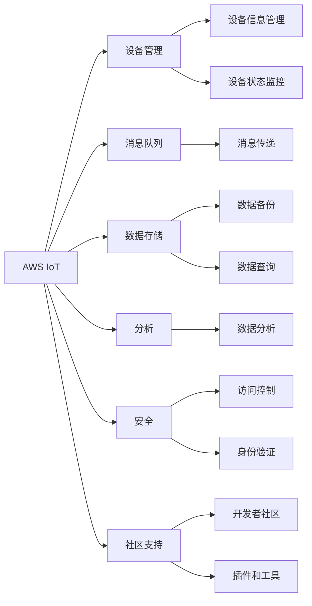

                 

## 1. 背景介绍

### 1.1 问题由来

近年来，随着物联网(IoT)技术的快速发展，越来越多的企业和组织开始利用IoT设备进行数据收集、监控和自动化控制。然而，选择适合的物联网平台是所有物联网项目的第一步。当前市面上流行的三大物联网平台为AWS IoT、Azure IoT和Google IoT，它们各有优缺点，需要根据实际需求进行合理选择。

### 1.2 问题核心关键点

选择物联网平台时，需要综合考虑以下几个关键点：

- **云服务提供商的支持和服务水平**：包括云服务的稳定性、可用性、性能、安全性和扩展性等。
- **平台的易用性和开发工具的丰富度**：平台提供的SDK和API是否易用，以及是否有丰富的第三方工具和插件。
- **数据处理和分析能力**：平台能否高效处理和管理海量IoT数据，并提供强大的分析功能。
- **成本效益**：平台的服务费用、数据存储和传输成本等。
- **生态系统和社区支持**：平台是否有广泛的开发者社区和丰富的生态系统，以获得更好的支持和资源。

## 2. 核心概念与联系

### 2.1 核心概念概述

为了更好地理解AWS IoT、Azure IoT和Google IoT之间的差异，本节将介绍以下核心概念：

- **AWS IoT**：由亚马逊AWS提供的物联网平台，基于云架构构建，支持设备管理、消息队列、数据存储、分析和安全等功能。
- **Azure IoT**：由微软Azure提供的物联网平台，支持设备管理、消息队列、数据存储、分析和身份验证等功能。
- **Google IoT**：由谷歌Google提供的物联网平台，支持设备管理、消息队列、数据存储、分析和身份验证等功能。

这些平台之间的联系主要体现在它们都提供了类似的物联网服务，包括设备管理、消息队列、数据存储、分析和安全等功能。但它们在云服务提供商的支持、易用性、数据处理能力、成本效益和生态系统等方面存在差异。

### 2.2 核心概念原理和架构的 Mermaid 流程图(Mermaid 流程节点中不要有括号、逗号等特殊字符)



这个流程图展示了AWS IoT、Azure IoT和Google IoT的核心服务组件及其相互联系。

## 3. 核心算法原理 & 具体操作步骤
### 3.1 算法原理概述

在选择物联网平台时，需要综合考虑多个因素，包括云服务提供商的支持和服务水平、平台的易用性和开发工具的丰富度、数据处理和分析能力、成本效益以及生态系统和社区支持。

### 3.2 算法步骤详解

以下是选择物联网平台的具体步骤：

**Step 1: 明确项目需求**

首先，需要明确物联网项目的实际需求，包括数据类型、数据量、设备类型、预期功能和预算限制等。这将有助于缩小选择范围，避免选择不适合的平台。

**Step 2: 评估云服务提供商**

比较AWS、Azure和Google提供的云服务，包括可用性、性能、扩展性和安全性等。在选择云服务时，需要根据项目的特定需求和预算进行权衡。

**Step 3: 比较平台功能**

详细比较AWS IoT、Azure IoT和Google IoT的核心功能，包括设备管理、消息队列、数据存储、分析和安全等。选择最适合项目需求的平台。

**Step 4: 评估易用性和开发工具**

比较各平台提供的SDK和API的易用性，以及是否有丰富的第三方工具和插件。选择开发效率高、易维护的平台。

**Step 5: 评估数据处理和分析能力**

比较各平台的数据处理和分析能力，包括数据存储、查询和分析等。选择数据处理能力强、分析功能丰富的平台。

**Step 6: 评估成本效益**

比较各平台的费用，包括设备管理、数据存储和传输成本等。选择性价比高的平台。

**Step 7: 评估生态系统和社区支持**

比较各平台的生态系统和社区支持，包括开发者社区的活跃度、工具和插件的丰富度等。选择社区支持强的平台。

**Step 8: 做出选择**

根据上述评估结果，选择最适合项目需求和预算的物联网平台。

### 3.3 算法优缺点

AWS IoT、Azure IoT和Google IoT各有优缺点：

**AWS IoT的优点**：

- 强大的数据处理和分析能力，支持大规模数据存储和分析。
- 丰富的开发工具和SDK，方便开发者快速开发和部署。
- 强大的生态系统，拥有广泛的开发者社区和丰富的第三方工具。

**AWS IoT的缺点**：

- 高昂的初期费用，需要投入较多的预算。
- 复杂的管理和配置，需要一定的技术背景。

**Azure IoT的优点**：

- 简单易用，开发工具和SDK易上手。
- 良好的集成性，可与Azure的其他云服务无缝集成。
- 免费使用，适合小规模项目。

**Azure IoT的缺点**：

- 数据处理能力相对较弱，不适合大规模数据存储和分析。
- 生态系统相对较弱，第三方工具和插件较少。

**Google IoT的优点**：

- 强大的数据处理能力，适合大规模数据存储和分析。
- 免费使用，适合小规模项目。
- 与Google的其他云服务集成方便。

**Google IoT的缺点**：

- 数据处理和分析能力相对较弱。
- 生态系统相对较弱，第三方工具和插件较少。

### 3.4 算法应用领域

AWS IoT、Azure IoT和Google IoT广泛应用于各个领域，包括但不限于以下方面：

- **智能家居**：通过智能设备和云平台实现家居自动化。
- **工业物联网**：通过传感器和云平台实现设备监控和自动化控制。
- **智慧城市**：通过智能设备和云平台实现城市管理和公共服务。
- **物流和供应链管理**：通过设备监控和数据分析实现高效物流和供应链管理。

这些领域对物联网平台的选择提出了不同的需求，需要根据实际情况进行选择。

## 4. 数学模型和公式 & 详细讲解 & 举例说明（备注：数学公式请使用latex格式，latex嵌入文中独立段落使用 $$，段落内使用 $)
### 4.1 数学模型构建

在进行物联网平台选择时，我们需要建立数学模型来评估各个平台的优劣。我们以成本效益作为评估指标，构建以下数学模型：

设平台A的总成本为C_A，包括设备管理费用、数据存储费用、数据传输费用等。设平台A的处理能力为P_A，包括数据处理速度、存储容量等。则平台A的成本效益为：

$$
\text{Cost-effectiveness}_A = \frac{P_A}{C_A}
$$

### 4.2 公式推导过程

以AWS IoT为例，假设设备管理费用为$M$，数据存储费用为$S$，数据传输费用为$T$，则总成本为：

$$
C_A = M + S + T
$$

假设数据处理速度为$V$，存储容量为$C$，则成本效益为：

$$
\text{Cost-effectiveness}_A = \frac{V \times C}{M + S + T}
$$

### 4.3 案例分析与讲解

假设平台A为AWS IoT，设备管理费用为$M=1000$美元/月，数据存储费用为$S=0.5$美元/GB/月，数据传输费用为$T=0.1$美元/GB/月，数据处理速度为$V=10^8$次/秒，存储容量为$C=10^9$GB。则成本效益为：

$$
\text{Cost-effectiveness}_A = \frac{10^8 \times 10^9}{1000 + 0.5 \times 10^9 + 0.1 \times 10^9} \approx 10^5 \frac{\text{次}}{\text{美元}}
$$

## 5. 项目实践：代码实例和详细解释说明
### 5.1 开发环境搭建

在进行物联网平台选择时，需要先搭建好开发环境。以下是使用Python进行AWS SDK的开发环境配置流程：

1. 安装Anaconda：从官网下载并安装Anaconda，用于创建独立的Python环境。

2. 创建并激活虚拟环境：
```bash
conda create -n aws-sdk python=3.8 
conda activate aws-sdk
```

3. 安装AWS SDK：
```bash
pip install boto3
```

4. 安装AWS CLI：
```bash
pip install awscli
```

5. 配置AWS CLI：
```bash
aws configure
```

完成上述步骤后，即可在`aws-sdk`环境中开始AWS IoT的开发实践。

### 5.2 源代码详细实现

这里我们以AWS IoT为例，给出使用Python进行设备管理的代码实现。

```python
import boto3

# 创建IOT客户端
client = boto3.client('iot', region_name='us-east-1')

# 创建设备
response = client.create_device Shadow=DeviceShadow(
    state=DeviceShadowState(
        reported={'device_name': 'my_device', 'temperature': 25, 'humidity': 60}
    )
)

# 获取设备状态
response = client.get_device_shadow(
    device_name='my_device'
)
```

### 5.3 代码解读与分析

让我们再详细解读一下关键代码的实现细节：

**boto3库**：
- `boto3`是AWS SDK的Python版本，提供了丰富的AWS云服务API。

**创建设备**：
- `client.create_device`方法用于创建设备，需要提供设备名称和设备状态。

**获取设备状态**：
- `client.get_device_shadow`方法用于获取设备状态，需要提供设备名称。

**设备状态**：
- 设备状态是一个JSON对象，包括设备名称和设备属性，属性值可以是字符串、整数、浮点数等。

**AWS CLI配置**：
- 使用`aws configure`命令进行AWS CLI的配置，包括AWS账户、region、访问密钥等。

**注意事项**：
- 在进行AWS IoT开发时，需要确保已配置AWS CLI，并授予足够的权限。

## 6. 实际应用场景
### 6.1 智能家居

智能家居是物联网平台的重要应用场景之一。智能家居系统通过传感器和设备管理平台实现家居自动化，提升用户的生活体验。AWS IoT、Azure IoT和Google IoT都提供了丰富的API和SDK，支持设备管理和状态监控。

**AWS IoT在智能家居中的应用**：

- 设备管理：AWS IoT设备管理服务支持设备注册、状态监控和设备配置等功能。
- 消息队列：AWS IoT消息队列支持设备间的数据传输和通信。
- 数据存储：AWS IoT支持将设备数据存储在Amazon S3或Amazon DynamoDB中。
- 数据分析：AWS IoT支持使用Amazon Athena和Amazon Redshift进行大数据分析和报表生成。

### 6.2 工业物联网

工业物联网通过传感器和云平台实现设备监控和自动化控制，提高生产效率和设备利用率。AWS IoT、Azure IoT和Google IoT都支持工业物联网应用，提供设备管理和状态监控功能。

**AWS IoT在工业物联网中的应用**：

- 设备管理：AWS IoT支持设备注册、状态监控和设备配置等功能。
- 消息队列：AWS IoT消息队列支持设备间的数据传输和通信。
- 数据存储：AWS IoT支持将设备数据存储在Amazon S3或Amazon DynamoDB中。
- 数据分析：AWS IoT支持使用Amazon Athena和Amazon Redshift进行大数据分析和报表生成。

### 6.3 智慧城市

智慧城市通过智能设备和云平台实现城市管理和公共服务，提升城市治理效率和居民生活质量。AWS IoT、Azure IoT和Google IoT都支持智慧城市应用，提供设备管理和状态监控功能。

**AWS IoT在智慧城市中的应用**：

- 设备管理：AWS IoT支持设备注册、状态监控和设备配置等功能。
- 消息队列：AWS IoT消息队列支持设备间的数据传输和通信。
- 数据存储：AWS IoT支持将设备数据存储在Amazon S3或Amazon DynamoDB中。
- 数据分析：AWS IoT支持使用Amazon Athena和Amazon Redshift进行大数据分析和报表生成。

### 6.4 未来应用展望

未来，物联网平台将继续向更加智能化、普适化和集成化的方向发展。云计算、人工智能、区块链等技术的融合，将进一步提升物联网平台的能力和应用范围。

- **智能化**：未来的物联网平台将具备更加智能化的数据分析和决策能力，支持基于人工智能的预测和优化。
- **普适化**：未来的物联网平台将更加普适化，支持更多类型的设备和数据源。
- **集成化**：未来的物联网平台将支持与其他云服务、物联网设备和业务系统的集成，实现多平台协同。

## 7. 工具和资源推荐
### 7.1 学习资源推荐

为了帮助开发者掌握物联网平台的选择方法，这里推荐一些优质的学习资源：

1. **AWS IoT文档**：Amazon提供的AWS IoT官方文档，包括设备管理、消息队列、数据存储和分析等功能。
2. **Azure IoT文档**：Microsoft提供的Azure IoT官方文档，包括设备管理、消息队列、身份验证和安全性等功能。
3. **Google IoT文档**：Google提供的Google IoT官方文档，包括设备管理、消息队列和数据存储等功能。
4. **物联网平台比较博客**：各种博客和论坛上的比较文章，介绍了AWS IoT、Azure IoT和Google IoT的优缺点和应用场景。
5. **物联网开发指南**：各种书籍和在线课程，提供了物联网开发的详细指南和最佳实践。

通过对这些资源的学习实践，相信你一定能够掌握物联网平台的选择方法和技巧，更好地构建物联网应用。

### 7.2 开发工具推荐

高效的开发离不开优秀的工具支持。以下是几款用于物联网平台开发的常用工具：

1. **AWS CLI**：AWS的命令行工具，方便进行设备管理和配置。
2. **Azure CLI**：Azure的命令行工具，方便进行设备管理和配置。
3. **Google Cloud CLI**：Google Cloud的命令行工具，方便进行设备管理和配置。
4. **Amazon IoT Explorer**：AWS提供的可视化工具，方便进行设备管理和数据分析。
5. **Azure IoT Hub Explorer**：Azure提供的可视化工具，方便进行设备管理和数据分析。
6. **Google Cloud IoT Core**：Google Cloud提供的物联网服务，支持设备管理和数据分析。

合理利用这些工具，可以显著提升物联网平台开发的速度和质量，加快创新迭代的步伐。

### 7.3 相关论文推荐

物联网平台的选择和应用涉及多个学科，包括计算机科学、通信工程、电子工程和工业工程等。以下是几篇相关的经典论文，推荐阅读：

1. **IoT Cloud Computing**：介绍物联网云计算技术的基本概念、体系结构和应用场景。
2. **IoT Platform Comparison**：比较AWS IoT、Azure IoT和Google IoT的核心功能和优缺点，帮助选择合适的物联网平台。
3. **IoT Security**：介绍物联网安全的基本概念、威胁和防御措施。
4. **IoT Big Data**：介绍物联网大数据的基本概念、技术和应用。
5. **IoT Edge Computing**：介绍物联网边缘计算的基本概念、体系结构和应用场景。

这些论文代表了大规模物联网平台研究和应用的最新进展，值得深入学习和参考。

## 8. 总结：未来发展趋势与挑战
### 8.1 总结

本文对AWS IoT、Azure IoT和Google IoT进行了全面系统的比较，帮助开发者选择合适的物联网平台。首先，阐述了物联网平台选择的基本步骤和关键点，明确了选择平台的依据。其次，从云服务提供商的支持、平台功能、易用性和开发工具、数据处理和分析能力、成本效益以及生态系统和社区支持等方面，详细比较了AWS IoT、Azure IoT和Google IoT的优缺点。最后，提供了实际应用场景的案例分析，展示了各大平台的应用潜力和未来发展趋势。

通过本文的系统梳理，可以看到，AWS IoT、Azure IoT和Google IoT作为主流的物联网平台，各有优势和不足。选择最适合的物联网平台需要综合考虑项目需求和预算，结合实际应用场景进行选择。

### 8.2 未来发展趋势

展望未来，物联网平台将继续向更加智能化、普适化和集成化的方向发展。云计算、人工智能、区块链等技术的融合，将进一步提升物联网平台的能力和应用范围。

- **智能化**：未来的物联网平台将具备更加智能化的数据分析和决策能力，支持基于人工智能的预测和优化。
- **普适化**：未来的物联网平台将更加普适化，支持更多类型的设备和数据源。
- **集成化**：未来的物联网平台将支持与其他云服务、物联网设备和业务系统的集成，实现多平台协同。

### 8.3 面临的挑战

尽管物联网平台的选择和应用前景广阔，但仍然面临以下挑战：

- **安全性**：物联网设备可能成为黑客攻击的目标，数据泄露和设备破坏等安全问题需高度重视。
- **复杂性**：物联网设备种类繁多，设备和系统的管理维护复杂，需要专业的运维团队。
- **互操作性**：不同物联网平台和设备之间的互操作性问题需解决，避免信息孤岛和数据壁垒。
- **成本控制**：物联网设备和系统的部署和运维成本较高，需进行合理的预算和资源管理。

### 8.4 研究展望

未来，物联网平台的选择和应用还需要在以下几个方面进行研究：

- **安全性增强**：研究如何提高物联网平台的安全性，防范黑客攻击和数据泄露。
- **复杂性简化**：研究如何简化物联网设备和管理系统的运维，提升用户体验。
- **互操作性提升**：研究如何提升不同物联网平台和设备之间的互操作性，实现数据共享和系统协同。
- **成本控制**：研究如何优化物联网设备和系统的部署和运维成本，提升经济性。

## 9. 附录：常见问题与解答

**Q1：AWS IoT、Azure IoT和Google IoT各有什么优缺点？**

A: 各平台各有优缺点，具体如下：

- **AWS IoT**：
  优点：强大的数据处理和分析能力，丰富的开发工具和SDK，广泛的应用生态系统。
  缺点：高昂的初期费用，复杂的配置和管理。

- **Azure IoT**：
  优点：简单易用，低成本，良好的集成性。
  缺点：数据处理能力相对较弱，生态系统相对较弱。

- **Google IoT**：
  优点：免费使用，与Google的其他云服务集成方便。
  缺点：数据处理和分析能力相对较弱，生态系统相对较弱。

**Q2：如何选择最适合的物联网平台？**

A: 选择物联网平台时，需要综合考虑以下因素：

- **项目需求**：明确设备类型、数据量、预期功能和预算限制。
- **云服务提供商**：比较AWS、Azure和Google提供的云服务，包括可用性、性能、扩展性和安全性等。
- **平台功能**：详细比较各平台的核心功能，包括设备管理、消息队列、数据存储和分析等。
- **易用性和开发工具**：比较各平台提供的SDK和API的易用性，以及是否有丰富的第三方工具和插件。
- **数据处理和分析能力**：比较各平台的数据处理和分析能力，包括数据存储、查询和分析等。
- **成本效益**：比较各平台的费用，包括设备管理、数据存储和传输成本等。
- **生态系统和社区支持**：比较各平台的生态系统和社区支持，包括开发者社区的活跃度、工具和插件的丰富度等。

根据上述评估结果，选择最适合项目需求和预算的物联网平台。

**Q3：如何进行物联网设备的部署和运维？**

A: 物联网设备的部署和运维需要遵循以下步骤：

1. 设备连接：将设备连接到物联网平台，进行设备注册和认证。
2. 数据采集：使用设备管理API进行数据采集和存储。
3. 数据分析：使用数据存储和分析API进行数据处理和分析。
4. 设备管理：使用设备管理API进行设备监控和配置。
5. 设备维护：定期检查设备状态，进行设备升级和故障排除。

在进行设备部署和运维时，需要确保设备和系统的稳定性和安全性，定期进行系统备份和更新，及时处理设备和数据异常。

**Q4：如何进行物联网平台的安全性保障？**

A: 物联网平台的安全性保障需要从以下几个方面进行：

1. 设备认证：使用安全的认证机制，防止未授权的设备访问平台。
2. 数据加密：对数据进行加密传输和存储，防止数据泄露和篡改。
3. 访问控制：使用严格的访问控制机制，限制用户和设备的访问权限。
4. 安全监控：实时监控设备和系统的安全状况，及时发现和处理安全威胁。
5. 漏洞修复：定期更新系统和设备，修补安全漏洞和弱点。

在进行安全性保障时，需要综合考虑设备和系统的安全需求，采用多层次的安全措施，确保平台的安全稳定。

---

作者：禅与计算机程序设计艺术 / Zen and the Art of Computer Programming

