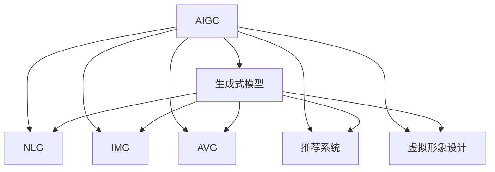

                 

# 生成式AIGC：智能时代的商业新生态

## 1. 背景介绍

### 1.1 问题由来
随着人工智能技术的发展，生成式人工智能(AIGC, AI-Generated Content)正在成为新一轮科技革命的重要驱动力。AIGC技术融合了深度学习、自然语言处理、计算机视觉等多领域知识，通过生成式模型将大量非结构化数据转化为结构化信息，极大拓展了数据的利用价值。

在商业应用中，AIGC能够实现自动内容生成、智能推荐、客户画像构建、虚拟形象设计等功能，为各行各业带来前所未有的机遇和挑战。从新闻媒体、广告创意到医疗健康、金融风控，再到社交娱乐、游戏影视，AIGC技术正在全方位渗透到各个行业，重塑商业生态。

### 1.2 问题核心关键点
AIGC的核心在于生成式模型的构建与应用。常用的生成式模型包括GANs、VAE、Transformer等，其中基于Transformer的生成模型（如GPT系列）在自然语言生成领域取得了卓越的成果。AIGC的商业应用涉及数据采集、模型训练、内容生成、效果评估等多个环节，如何高效、安全、可靠地实现AIGC系统，成为当前研究热点。

本文将从生成式AIGC系统的构建和应用角度，系统介绍AIGC技术原理、典型应用场景、核心算法与优化策略。通过这些内容，帮助读者深入理解AIGC的商业价值与技术挑战，为相关领域的实践提供指导。

## 2. 核心概念与联系

### 2.1 核心概念概述

为更好地理解生成式AIGC技术，本节将介绍几个关键概念：

- **生成式人工智能(AIGC)**：利用生成式模型将大量非结构化数据转化为结构化信息，实现自动内容生成、智能推荐、客户画像构建等功能。
- **生成式模型(Generative Model)**：能够从随机噪声中生成数据样本，常用模型包括GANs、VAE、Transformer等。
- **自然语言生成(NLG, Natural Language Generation)**：生成式模型在自然语言处理领域的应用，包括文本生成、对话生成、摘要生成等。
- **图像生成(IMG, Image Generation)**：生成式模型在计算机视觉领域的应用，包括图像生成、图像修复、图像转换等。
- **音频生成(AVG, Audio Generation)**：生成式模型在音频处理领域的应用，包括音乐创作、语音合成、声音分离等。
- **推荐系统(Recommendation System)**：利用生成式模型实现智能推荐，个性化推荐系统是AIGC的重要应用之一。
- **虚拟形象设计(VI, Virtual Image Design)**：生成式模型在虚拟现实、游戏影视等领域的应用，包括虚拟形象生成、动画制作、虚拟场景构建等。

这些核心概念之间的逻辑关系可以通过以下Mermaid流程图来展示：



这个流程图展示了大语言模型的工作原理和其应用领域：

1. 大语言模型通过生成式模型学习大规模数据，获得语言生成能力。
2. NLG、IMG、AVG等各领域应用，将生成式模型应用于文本生成、图像生成、音频生成等任务。
3. 推荐系统和虚拟形象设计等应用，利用生成式模型实现个性化推荐和虚拟形象设计。

## 3. 核心算法原理 & 具体操作步骤
### 3.1 算法原理概述

生成式AIGC的核心算法是生成式模型，其中基于Transformer的生成模型最为流行。该模型通过预训练语言模型的大规模语料学习到语言的统计规律，并通过微调任务适配层，实现特定场景下的生成任务。

### 3.2 算法步骤详解

基于生成式Transformer的AIGC系统一般包括以下几个关键步骤：

**Step 1: 准备预训练模型和数据集**
- 选择合适的预训练语言模型 $M_{\theta}$ 作为初始化参数，如 GPT-3、BERT 等。
- 准备目标任务的数据集 $D$，划分为训练集、验证集和测试集。数据集应涵盖不同场景下的生成任务，如文本生成、图像生成、音乐创作等。

**Step 2: 设计任务适配层**
- 根据目标任务类型，设计合适的输出层和损失函数。
- 对于文本生成任务，通常使用softmax函数作为输出层，并设置交叉熵损失函数。
- 对于图像生成任务，通常使用KL散度作为输出层，并设置MSE损失函数。
- 对于音乐创作任务，通常使用MFCC特征作为输出层，并设置MSE损失函数。

**Step 3: 设置微调超参数**
- 选择合适的优化算法及其参数，如 Adam、SGD 等，设置学习率、批大小、迭代轮数等。
- 设置正则化技术及强度，包括L2正则、Dropout等。
- 确定冻结预训练参数的策略，如仅微调顶层，或全部参数都参与微调。

**Step 4: 执行梯度训练**
- 将训练集数据分批次输入模型，前向传播计算损失函数。
- 反向传播计算参数梯度，根据设定的优化算法和学习率更新模型参数。
- 周期性在验证集上评估模型性能，根据性能指标决定是否触发Early Stopping。
- 重复上述步骤直到满足预设的迭代轮数或Early Stopping条件。

**Step 5: 测试和部署**
- 在测试集上评估微调后模型 $M_{\hat{\theta}}$ 的性能，对比微调前后的生成质量。
- 使用微调后的模型对新数据进行生成，集成到实际的应用系统中。
- 持续收集新的数据，定期重新微调模型，以适应数据分布的变化。

以上是基于生成式Transformer的AIGC系统的一般流程。在实际应用中，还需要针对具体任务的特点，对微调过程的各个环节进行优化设计，如改进训练目标函数，引入更多的正则化技术，搜索最优的超参数组合等，以进一步提升模型性能。

### 3.3 算法优缺点

生成式AIGC技术具有以下优点：
1. 适用范围广。生成式模型能够处理多种数据类型，广泛应用于文本生成、图像生成、音频生成等多个领域。
2. 生成质量高。基于Transformer的生成模型已经能够在自然语言生成、图像生成等任务上取得接近人类水平的生成效果。
3. 应用价值大。生成式AIGC在内容创作、智能推荐、虚拟形象设计等方面具有广泛的应用前景，能够极大地提升用户体验和运营效率。
4. 训练效率高。Transformer模型在计算资源上具有较高效率，适合在大规模数据集上训练。

同时，该技术也存在一定的局限性：
1. 模型复杂度高。生成式模型参数量巨大，训练和推理过程中对计算资源要求较高。
2. 泛化能力不足。生成式模型通常依赖大规模数据进行训练，泛化能力在数据分布发生变化时容易下降。
3. 生成结果多样性不足。生成式模型生成的结果往往较为单一，缺乏创意和个性化。
4. 安全性问题。生成式模型可能生成有害内容，需要严格监控和审核。
5. 伦理道德问题。生成式模型可能带来伦理道德问题，如误导信息、版权侵权等。

尽管存在这些局限性，但就目前而言，生成式AIGC技术仍是大规模数据应用的重要手段。未来相关研究的重点在于如何进一步降低训练和推理资源消耗，提高生成结果的多样性和创意性，同时兼顾模型安全性和伦理性。

### 3.4 算法应用领域

生成式AIGC技术已经在多个领域取得了广泛的应用，例如：

- 内容创作：生成新闻、文章、小说、诗歌等，辅助作家创作，提升内容生产效率。
- 广告创意：自动生成广告文案、图片、视频等，提升广告设计质量和创意水平。
- 客户画像：根据用户行为数据生成客户画像，指导精准营销和个性化推荐。
- 虚拟形象设计：生成虚拟形象、动画、虚拟场景等，支持游戏、影视、虚拟现实等应用。
- 医学影像分析：自动生成医学影像，辅助医生诊断和治疗决策。
- 金融风险预警：生成金融报告、新闻摘要等，提供风险预警和投资建议。
- 娱乐内容制作：自动生成音乐、歌曲、视频等，丰富娱乐内容生产。

除了上述这些经典应用外，生成式AIGC技术还在教育、司法、气象、农业等众多领域找到了应用场景，推动了各行各业的技术进步。

## 4. 数学模型和公式 & 详细讲解  
### 4.1 数学模型构建

本节将使用数学语言对基于生成式Transformer的AIGC系统进行更加严格的刻画。

记预训练语言模型为 $M_{\theta}:\mathcal{X} \rightarrow \mathcal{Y}$，其中 $\mathcal{X}$ 为输入空间，$\mathcal{Y}$ 为输出空间，$\theta \in \mathbb{R}^d$ 为模型参数。假设生成任务 $T$ 的训练集为 $D=\{(x_i,y_i)\}_{i=1}^N, x_i \in \mathcal{X}, y_i \in \mathcal{Y}$。

定义模型 $M_{\theta}$ 在输入 $x$ 上的生成输出为 $\hat{y}=M_{\theta}(x)$，并定义损失函数为 $\ell(\hat{y}, y)$，则经验风险为：

$$
\mathcal{L}(\theta) = \frac{1}{N} \sum_{i=1}^N \ell(\hat{y}_i, y_i)
$$

其中 $\ell(\hat{y}, y)$ 为任务 $T$ 定义的损失函数。对于文本生成任务，通常使用交叉熵损失函数；对于图像生成任务，通常使用MSE损失函数。

模型的训练目标是最小化经验风险，即找到最优参数：

$$
\theta^* = \mathop{\arg\min}_{\theta} \mathcal{L}(\theta)
$$

在实践中，我们通常使用基于梯度的优化算法（如SGD、Adam等）来近似求解上述最优化问题。设 $\eta$ 为学习率，$\lambda$ 为正则化系数，则参数的更新公式为：

$$
\theta \leftarrow \theta - \eta \nabla_{\theta}\mathcal{L}(\theta) - \eta\lambda\theta
$$

其中 $\nabla_{\theta}\mathcal{L}(\theta)$ 为损失函数对参数 $\theta$ 的梯度，可通过反向传播算法高效计算。

### 4.2 公式推导过程

以下我们以文本生成任务为例，推导生成式Transformer模型的训练目标函数。

假设生成模型 $M_{\theta}$ 在输入 $x$ 上的输出为 $\hat{y}=M_{\theta}(x)$，真实标签 $y \in \{1,0\}$，其中1表示真实文本包含目标词汇，0表示不包含。则二分类交叉熵损失函数定义为：

$$
\ell(M_{\theta}(x),y) = -y\log \hat{y} + (1-y)\log (1-\hat{y})
$$

将其代入经验风险公式，得：

$$
\mathcal{L}(\theta) = -\frac{1}{N}\sum_{i=1}^N [y_i\log \hat{y}_i+(1-y_i)\log(1-\hat{y}_i)]
$$

根据链式法则，损失函数对参数 $\theta_k$ 的梯度为：

$$
\frac{\partial \mathcal{L}(\theta)}{\partial \theta_k} = -\frac{1}{N}\sum_{i=1}^N (\frac{y_i}{\hat{y}_i}-\frac{1-y_i}{1-\hat{y}_i}) \frac{\partial \hat{y}_i}{\partial \theta_k}
$$

其中 $\frac{\partial \hat{y}_i}{\partial \theta_k}$ 可进一步递归展开，利用自动微分技术完成计算。

在得到损失函数的梯度后，即可带入参数更新公式，完成模型的迭代优化。重复上述过程直至收敛，最终得到适应生成任务的最优模型参数 $\theta^*$。

## 5. 项目实践：代码实例和详细解释说明
### 5.1 开发环境搭建

在进行生成式AIGC实践前，我们需要准备好开发环境。以下是使用Python进行PyTorch开发的环境配置流程：

1. 安装Anaconda：从官网下载并安装Anaconda，用于创建独立的Python环境。

2. 创建并激活虚拟环境：
```bash
conda create -n pytorch-env python=3.8 
conda activate pytorch-env
```

3. 安装PyTorch：根据CUDA版本，从官网获取对应的安装命令。例如：
```bash
conda install pytorch torchvision torchaudio cudatoolkit=11.1 -c pytorch -c conda-forge
```

4. 安装Transformers库：
```bash
pip install transformers
```

5. 安装各类工具包：
```bash
pip install numpy pandas scikit-learn matplotlib tqdm jupyter notebook ipython
```

完成上述步骤后，即可在`pytorch-env`环境中开始生成式AIGC实践。

### 5.2 源代码详细实现

下面我们以文本生成任务为例，给出使用Transformers库对GPT-2模型进行生成式微调的PyTorch代码实现。

首先，定义生成任务的数据处理函数：

```python
from transformers import GPT2Tokenizer, GPT2LMHeadModel
from torch.utils.data import Dataset
import torch

class TextDataset(Dataset):
    def __init__(self, texts, tokenizer, max_len=512):
        self.texts = texts
        self.tokenizer = tokenizer
        self.max_len = max_len
        
    def __len__(self):
        return len(self.texts)
    
    def __getitem__(self, item):
        text = self.texts[item]
        encoding = self.tokenizer(text, return_tensors='pt', max_length=self.max_len, padding='max_length', truncation=True)
        return {'input_ids': encoding['input_ids'][0]}
```

然后，定义模型和优化器：

```python
from transformers import AdamW

model = GPT2LMHeadModel.from_pretrained('gpt2', output_attentions=False)
tokenizer = GPT2Tokenizer.from_pretrained('gpt2')
optimizer = AdamW(model.parameters(), lr=2e-5)
```

接着，定义训练和评估函数：

```python
from tqdm import tqdm
from sklearn.metrics import perplexity

device = torch.device('cuda') if torch.cuda.is_available() else torch.device('cpu')
model.to(device)

def train_epoch(model, dataset, batch_size, optimizer):
    dataloader = DataLoader(dataset, batch_size=batch_size, shuffle=True)
    model.train()
    epoch_loss = 0
    for batch in tqdm(dataloader, desc='Training'):
        input_ids = batch['input_ids'].to(device)
        model.zero_grad()
        outputs = model(input_ids)
        loss = outputs.loss
        epoch_loss += loss.item()
        loss.backward()
        optimizer.step()
    return epoch_loss / len(dataloader)

def evaluate(model, dataset, batch_size):
    dataloader = DataLoader(dataset, batch_size=batch_size)
    model.eval()
    total_loss = 0
    for batch in dataloader:
        input_ids = batch['input_ids'].to(device)
        outputs = model(input_ids)
        loss = outputs.loss
        total_loss += loss.item()
    return total_loss / len(dataloader)
```

最后，启动训练流程并在测试集上评估：

```python
epochs = 5
batch_size = 32

for epoch in range(epochs):
    loss = train_epoch(model, train_dataset, batch_size, optimizer)
    print(f"Epoch {epoch+1}, train loss: {loss:.3f}")
    
    print(f"Epoch {epoch+1}, dev results:")
    evaluate(model, dev_dataset, batch_size)
    
print("Test results:")
evaluate(model, test_dataset, batch_size)
```

以上就是使用PyTorch对GPT-2进行文本生成任务生成式微调的完整代码实现。可以看到，得益于Transformers库的强大封装，我们可以用相对简洁的代码完成GPT-2模型的加载和微调。

### 5.3 代码解读与分析

让我们再详细解读一下关键代码的实现细节：

**TextDataset类**：
- `__init__`方法：初始化文本、分词器等关键组件。
- `__len__`方法：返回数据集的样本数量。
- `__getitem__`方法：对单个样本进行处理，将文本输入编码为token ids。

**模型和优化器**：
- 使用GPT-2模型作为生成任务适配层，使用AdamW优化器进行参数更新。
- GPT-2模型在输出时仅返回logits，无需返回attention等中间结果，以提高计算效率。

**训练和评估函数**：
- 使用PyTorch的DataLoader对数据集进行批次化加载，供模型训练和推理使用。
- 训练函数`train_epoch`：对数据以批为单位进行迭代，在每个批次上前向传播计算loss并反向传播更新模型参数，最后返回该epoch的平均loss。
- 评估函数`evaluate`：与训练类似，不同点在于不更新模型参数，并在每个batch结束后将预测结果存储下来，最后使用perplexity指标评估生成结果的质量。

**训练流程**：
- 定义总的epoch数和batch size，开始循环迭代
- 每个epoch内，先在训练集上训练，输出平均loss
- 在验证集上评估，输出perplexity指标
- 所有epoch结束后，在测试集上评估，给出最终测试结果

可以看到，PyTorch配合Transformers库使得GPT-2模型的生成式微调代码实现变得简洁高效。开发者可以将更多精力放在数据处理、模型改进等高层逻辑上，而不必过多关注底层的实现细节。

当然，工业级的系统实现还需考虑更多因素，如模型的保存和部署、超参数的自动搜索、更灵活的任务适配层等。但核心的生成式微调范式基本与此类似。

## 6. 实际应用场景
### 6.1 智能内容创作

生成式AIGC技术在智能内容创作领域具有广泛的应用前景。通过自动生成新闻、文章、小说、视频等，可以大幅提升内容创作的效率和质量，降低人力成本。

例如，新闻媒体可以通过自动生成新闻摘要和标题，减轻记者工作负担，提高新闻发布速度和点击率。社交媒体平台可以利用生成式模型自动生成帖子和评论，增强用户互动，提升用户粘性。影视制作公司可以使用生成式模型自动生成动画短片，减少制作成本，丰富内容多样性。

### 6.2 个性化推荐系统

推荐系统是生成式AIGC的重要应用场景之一。通过自动生成个性化的内容，可以极大地提升用户体验和系统效果。

例如，电子商务平台可以根据用户行为数据生成个性化商品推荐，提升用户体验和销售额。视频网站可以根据用户观看记录生成个性化视频推荐，提升用户观看时间和粘性。音乐平台可以根据用户听歌记录生成个性化歌曲推荐，提升用户满意度和留存率。

### 6.3 虚拟形象设计

虚拟形象设计是生成式AIGC技术在虚拟现实、游戏影视等领域的重要应用。通过自动生成虚拟形象、动画、虚拟场景等，可以极大提升虚拟现实和游戏影视的制作效率和效果。

例如，游戏公司可以使用生成式模型自动生成虚拟角色和场景，降低游戏开发成本，丰富游戏内容。虚拟现实平台可以使用生成式模型自动生成虚拟环境和人脸表情，增强用户体验。影视制作公司可以使用生成式模型自动生成动画和特效，提升制作效率。

### 6.4 未来应用展望

随着生成式AIGC技术的不断发展，其在更多领域的应用前景将逐步显现：

- **医疗健康**：自动生成医学影像、病历报告、治疗方案等，辅助医生诊断和治疗。
- **金融风控**：自动生成金融报告、新闻摘要、市场分析等，提供风险预警和投资建议。
- **教育培训**：自动生成教材、习题、课程等，辅助教师教学和学生学习。
- **司法审判**：自动生成司法文书、案例分析、判决书等，辅助法官判案和法律研究。
- **气象预报**：自动生成气象数据报告、天气预报、预警信息等，提高气象服务的准确性和时效性。
- **农业生产**：自动生成农业技术指南、病虫害报告、种植方案等，提升农业生产效率和质量。

此外，生成式AIGC技术还将与其他人工智能技术进行更深入的融合，如知识表示、因果推理、强化学习等，多路径协同发力，共同推动自然语言理解和智能交互系统的进步。

## 7. 工具和资源推荐
### 7.1 学习资源推荐

为了帮助开发者系统掌握生成式AIGC的理论基础和实践技巧，这里推荐一些优质的学习资源：

1. 《Generative Adversarial Networks: An Overview》（生成对抗网络综述）：由Ioannis Goodfellow等人撰写，系统介绍GANs原理、算法和应用，是GANs学习的必备资料。
2. 《Neural Text Generation with Language Models》（基于语言模型的文本生成）：由Richard S. Sutton等人撰写，深入介绍NLP领域的文本生成技术，包括RNN、Transformer等模型。
3. 《Text Generation with GPT-2》（使用GPT-2进行文本生成）：由OpenAI团队撰写，详细介绍GPT-2模型的训练和应用，提供完整代码和实验结果。
4. CS231n《Convolutional Neural Networks for Visual Recognition》课程：斯坦福大学开设的计算机视觉课程，涵盖卷积神经网络在图像生成中的应用，是图像生成学习的推荐课程。
5. Coursera《Machine Learning with TensorFlow》课程：由Google开设的深度学习课程，涵盖TensorFlow在文本生成、图像生成等任务中的应用，是AIGC学习的推荐课程。

通过对这些资源的学习实践，相信你一定能够快速掌握生成式AIGC的精髓，并用于解决实际的NLP问题。

### 7.2 开发工具推荐

高效的开发离不开优秀的工具支持。以下是几款用于生成式AIGC开发的常用工具：

1. PyTorch：基于Python的开源深度学习框架，灵活动态的计算图，适合快速迭代研究。
2. TensorFlow：由Google主导开发的开源深度学习框架，生产部署方便，适合大规模工程应用。
3. Transformers库：HuggingFace开发的NLP工具库，集成了众多SOTA语言模型，支持PyTorch和TensorFlow，是生成式AIGC开发的利器。
4. Weights & Biases：模型训练的实验跟踪工具，可以记录和可视化模型训练过程中的各项指标，方便对比和调优。
5. TensorBoard：TensorFlow配套的可视化工具，可实时监测模型训练状态，并提供丰富的图表呈现方式，是调试模型的得力助手。
6. Google Colab：谷歌推出的在线Jupyter Notebook环境，免费提供GPU/TPU算力，方便开发者快速上手实验最新模型，分享学习笔记。

合理利用这些工具，可以显著提升生成式AIGC系统的开发效率，加快创新迭代的步伐。

### 7.3 相关论文推荐

生成式AIGC技术的发展源于学界的持续研究。以下是几篇奠基性的相关论文，推荐阅读：

1. Generative Adversarial Nets（生成对抗网络）：由Ian Goodfellow等人提出，开创了生成式模型的研究方向。
2. Improving Language Models with Self-supervision（通过自监督改进语言模型）：由Joséf Pereira et al.提出，利用自监督任务对语言模型进行预训练，提升模型性能。
3. Attention Is All You Need（注意力机制）：由Jacques Le Quot et al.提出，通过Transformer结构实现注意力机制，提升模型的生成效果。
4. Deep Text Generation with Neural Attention（使用神经注意力进行深度文本生成）：由Zhou Huang et al.提出，利用神经注意力机制实现文本生成。
5. DALL-E: A DALL·E for Diffusion Models（DALL-E：扩散模型中的DALL·E）：由OpenAI团队提出，利用扩散模型实现高质量的图像生成。

这些论文代表了大语言模型微调技术的发展脉络。通过学习这些前沿成果，可以帮助研究者把握学科前进方向，激发更多的创新灵感。

## 8. 总结：未来发展趋势与挑战

### 8.1 总结

本文对生成式AIGC技术的构建和应用进行了全面系统的介绍。首先阐述了生成式AIGC系统的构建流程和核心算法，明确了生成式AIGC在智能内容创作、个性化推荐、虚拟形象设计等领域的应用价值。通过这些内容，帮助读者深入理解生成式AIGC的商业价值与技术挑战，为相关领域的实践提供指导。

通过本文的系统梳理，可以看到，生成式AIGC技术正在成为人工智能技术的重要组成部分，推动了内容创作、推荐系统、虚拟形象设计等多个领域的智能化转型。得益于生成式模型的强大生成能力，生成式AIGC技术将在未来带来更多的创新突破，引领人工智能技术的新发展方向。

### 8.2 未来发展趋势

展望未来，生成式AIGC技术将呈现以下几个发展趋势：

1. 模型规模持续增大。随着算力成本的下降和数据规模的扩张，生成式模型的参数量还将持续增长。超大规模模型蕴含的丰富知识，将极大提升生成式AIGC的生成效果和应用场景。
2. 生成结果多样性增加。未来模型将更加注重生成结果的多样性和创意性，通过引入更多先验知识，生成更具个性化、多样化的内容。
3. 实时生成能力提升。未来模型将更加注重实时生成能力，通过优化计算图和模型结构，实现更加轻量级、实时性的部署。
4. 多模态生成融合。生成式AIGC将更多地与其他模态数据融合，实现视觉、语音等多模态信息的协同生成。
5. 人机协同增强。未来模型将更加注重人机协同，通过引入主动学习、交互式学习等方法，提升生成式AIGC的系统效果和用户满意度。
6. 伦理道德规范加强。未来生成式AIGC技术将更加注重伦理道德规范，通过引入伦理导向的评估指标，避免生成有害内容，保障系统安全性和可控性。

以上趋势凸显了生成式AIGC技术的广阔前景。这些方向的探索发展，必将进一步提升生成式AIGC的生成效果和应用范围，为各行业带来更多的智能化转型。

### 8.3 面临的挑战

尽管生成式AIGC技术已经取得了瞩目成就，但在迈向更加智能化、普适化应用的过程中，它仍面临着诸多挑战：

1. 计算资源消耗高。生成式模型参数量巨大，训练和推理过程中对计算资源要求较高。如何在资源有限的条件下，实现高效的模型训练和推理，是一大难题。
2. 生成结果质量不稳定。生成式模型生成的结果可能存在多样性、一致性不足等问题，影响用户体验和系统效果。如何提高生成结果的稳定性和可靠性，是一大挑战。
3. 伦理道德风险大。生成式模型可能生成有害内容，带来伦理道德风险。如何确保生成内容的安全性和合规性，是一大挑战。
4. 数据隐私保护困难。生成式模型需要大量数据进行训练，数据隐私保护成为重要问题。如何保护用户隐私，避免数据滥用，是一大挑战。
5. 算法公平性问题。生成式模型可能存在算法偏见，影响公平性。如何消除模型偏见，保障公平性，是一大挑战。

尽管存在这些挑战，但随着生成式AIGC技术的不断发展和完善，相信这些问题都将逐步得到解决。未来，生成式AIGC技术将在多个行业得到广泛应用，推动各行业的智能化转型。

### 8.4 研究展望

面对生成式AIGC技术所面临的挑战，未来的研究需要在以下几个方面寻求新的突破：

1. 参数高效生成。开发更加参数高效的生成模型，在固定大部分预训练参数的情况下，仅更新极少量的任务相关参数，提高生成效率。
2. 多模态融合生成。实现多模态数据融合，提升生成结果的多样性和创意性。
3. 实时生成优化。优化生成模型的计算图和模型结构，实现实时生成能力。
4. 人机协同增强。引入主动学习、交互式学习等方法，提升生成式AIGC的系统效果和用户满意度。
5. 伦理道德规范加强。引入伦理导向的评估指标，避免生成有害内容，保障系统安全性和可控性。

这些研究方向的探索，必将引领生成式AIGC技术迈向更高的台阶，为各行业带来更多的智能化转型。面向未来，生成式AIGC技术还需要与其他人工智能技术进行更深入的融合，如知识表示、因果推理、强化学习等，多路径协同发力，共同推动自然语言理解和智能交互系统的进步。只有勇于创新、敢于突破，才能不断拓展生成式AIGC的边界，让智能技术更好地造福人类社会。

## 9. 附录：常见问题与解答

**Q1：生成式AIGC是否适用于所有应用场景？**

A: 生成式AIGC在大多数应用场景中都能取得不错的效果，特别是在内容生成、推荐系统等场景。但对于一些需要高精度、高鲁棒性、低成本的应用场景，如金融风控、医学诊断等，生成式AIGC的效果可能不尽如人意。需要在具体场景中综合评估，选择合适的技术方案。

**Q2：如何选择生成式模型进行微调？**

A: 选择合适的生成式模型进行微调，需要综合考虑任务类型、数据规模、计算资源等因素。对于文本生成任务，可以选择GPT系列、T5等模型。对于图像生成任务，可以选择GANs、VAE等模型。对于音乐生成任务，可以选择WaveNet、Xformer-X等模型。

**Q3：生成式AIGC如何处理数据分布变化？**

A: 生成式AIGC模型的泛化能力通常在数据分布发生变化时容易下降。为应对数据分布变化，可以定期重新训练模型，或者在训练集和测试集中引入域适应等技术，提升模型的泛化能力。

**Q4：生成式AIGC是否存在伦理道德问题？**

A: 生成式AIGC技术可能存在伦理道德问题，如生成有害内容、版权侵权等。需要引入伦理导向的评估指标，审查生成内容，保障生成内容的安全性和合规性。

**Q5：生成式AIGC如何确保数据隐私保护？**

A: 生成式AIGC模型需要大量数据进行训练，数据隐私保护成为重要问题。需要采用数据脱敏、差分隐私等技术，保障数据隐私安全。

这些问题的解答，可以帮助开发者更好地理解生成式AIGC技术，并在实际应用中避免常见错误。通过系统学习和不断实践，相信你将能够掌握生成式AIGC技术的精髓，为各行业带来更多的智能化转型。

---

作者：禅与计算机程序设计艺术 / Zen and the Art of Computer Programming

