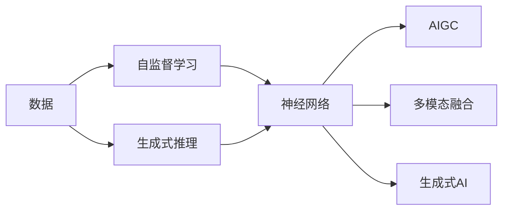

                 

# 生成式AIGC：未来商业的核心竞争力

## 1. 背景介绍

### 1.1 问题由来

随着人工智能技术的不断进步，生成式人工智能（Generative AI，GAI）正逐渐成为驱动商业创新和竞争力的关键引擎。生成式AIGC能够生成高质量的文本、图像、视频等内容，广泛应用于营销、客服、设计、娱乐等领域，极大地提升了企业的运营效率和用户体验。然而，目前对生成式AIGC的认知和应用还存在诸多局限，这迫切需要对其核心原理和技术细节进行深入剖析。

### 1.2 问题核心关键点

生成式AIGC的核心理念是通过深度学习模型，尤其是基于神经网络的生成模型，从大量数据中学习生成规则，并能够自主生成新内容。其关键点包括：

- **深度学习模型**：以神经网络为核心的生成模型，如图像生成模型（如GANs）、文本生成模型（如GPT）、音乐生成模型等。
- **自监督学习**：使用未标注数据进行自我监督，提升生成模型的一般化能力。
- **数据驱动**：大量高质量数据的获取和利用，是生成式AIGC成功的基础。
- **生成式推理**：能够将复杂数据生成问题分解为多个子问题，逐步解决，实现高效生成。
- **多模态融合**：结合视觉、音频、文本等多种模态数据，提升生成内容的丰富性和多样性。

本文将深入探讨生成式AIGC的核心概念与算法，并提供详细的实现和应用示例，助力企业把握未来商业的核心竞争力。

## 2. 核心概念与联系

### 2.1 核心概念概述

- **生成式AI（Generative AI）**：指能够生成新数据（如图像、文本、音频等）的人工智能系统。主要通过深度学习模型从已有数据中学习生成规则，并产生高质量的新数据。
- **AIGC（Artificial Intelligence Generated Content）**：指由人工智能生成的内容，如文本、图像、视频等。具有创新性和高度个性化，广泛应用在营销、娱乐、客服等领域。
- **神经网络（Neural Network）**：由大量神经元组成的网络结构，能够处理复杂的数据生成任务。
- **自监督学习（Self-Supervised Learning）**：使用未标注数据进行自我监督，提升模型的一般化能力。
- **生成式推理（Generative Reasoning）**：将生成问题分解为多个子问题，逐步解决，实现高效生成。
- **多模态融合（Multimodal Fusion）**：结合多种模态数据（如视觉、听觉、文本等），提升生成内容的丰富性和多样性。

### 2.2 核心概念联系（Mermaid 流程图）



这个流程图展示了生成式AIGC的核心流程：

1. **数据获取**：收集大量的未标注数据，如图像、文本等。
2. **自监督学习**：使用未标注数据进行自我监督，提升模型的泛化能力。
3. **神经网络训练**：通过深度学习模型训练生成式推理规则。
4. **生成式推理**：将生成问题分解为多个子问题，逐步解决，实现高效生成。
5. **多模态融合**：结合视觉、听觉、文本等多种模态数据，提升生成内容的丰富性和多样性。
6. **AIGC输出**：最终生成高质量的人工智能生成的内容。

## 3. 核心算法原理 & 具体操作步骤

### 3.1 算法原理概述

生成式AIGC的核心算法主要包括生成模型和生成方法，通过神经网络架构和训练方法，学习生成规则，并生成高质量的内容。主要分为以下几种算法：

- **变分自编码器（VAE）**：通过编码器-解码器架构，将输入数据压缩到潜在空间，再解码生成。
- **生成对抗网络（GANs）**：通过生成器和判别器的对抗训练，生成高质量的图像、音频等数据。
- **Transformer**：通过自注意力机制，实现序列数据的生成，如文本生成、语言模型等。
- **NLM（Neural Language Model）**：通过神经网络学习语言模型，实现文本的自动生成和预测。

### 3.2 算法步骤详解

#### 3.2.1 VAE生成模型

VAE使用编码器将输入数据压缩到潜在空间，再使用解码器生成新的数据。具体步骤如下：

1. **编码器训练**：使用未标注数据训练编码器，将数据压缩到潜在空间 $z$。
2. **解码器训练**：使用未标注数据训练解码器，将潜在空间 $z$ 映射回生成数据。
3. **生成新数据**：使用训练好的编码器和解码器，生成新的数据。

#### 3.2.2 GANs生成模型

GANs通过生成器和判别器的对抗训练，生成高质量的图像数据。具体步骤如下：

1. **生成器训练**：使用未标注数据训练生成器，将随机噪声映射成图像。
2. **判别器训练**：使用未标注数据训练判别器，区分真实图像和生成图像。
3. **对抗训练**：交替训练生成器和判别器，使得生成图像越来越接近真实图像。
4. **生成新图像**：使用训练好的生成器，生成新的高质量图像数据。

#### 3.2.3 Transformer生成模型

Transformer通过自注意力机制，实现序列数据的生成，如文本生成、语言模型等。具体步骤如下：

1. **编码器训练**：使用标注数据训练编码器，学习语言表示。
2. **解码器训练**：使用标注数据训练解码器，学习生成规则。
3. **生成新数据**：使用训练好的编码器和解码器，生成新的文本或序列数据。

### 3.3 算法优缺点

#### 3.3.1 VAE生成模型

- **优点**：
  - 能够生成高质量的连续数据（如图像、音频等）。
  - 生成过程可解释性强，易于理解。
  - 对抗噪声和丢失信息的能力较强。

- **缺点**：
  - 模型复杂度较高，训练复杂，计算成本高。
  - 生成数据存在一定的模糊性，需要复杂的后处理。

#### 3.3.2 GANs生成模型

- **优点**：
  - 生成图像质量高，生成过程简单高效。
  - 对抗噪声和丢失信息的能力较强。
  - 能够生成多种模态数据，如图像、音频、视频等。

- **缺点**：
  - 训练过程中存在模式崩溃问题，生成器容易陷入局部最优解。
  - 生成数据存在一定的模糊性，需要复杂的后处理。
  - 判别器训练过程中容易出现梯度消失或爆炸问题。

#### 3.3.3 Transformer生成模型

- **优点**：
  - 生成过程高效，计算成本低。
  - 能够生成高质量的序列数据（如文本、音频等）。
  - 模型结构简单，易于理解和实现。

- **缺点**：
  - 生成数据存在一定的模糊性，需要复杂的后处理。
  - 生成过程依赖于标注数据，需要大量的标注数据支持。
  - 生成过程缺乏可解释性，难以理解生成机制。

### 3.4 算法应用领域

生成式AIGC已经在多个领域得到了广泛应用，具体包括：

- **文本生成**：用于自动写作、内容创作、聊天机器人等。
- **图像生成**：用于图像创作、广告设计、视频特效等。
- **音乐生成**：用于音乐创作、游戏配乐等。
- **游戏设计**：用于虚拟角色生成、虚拟世界构建等。
- **虚拟现实**：用于虚拟场景构建、虚拟角色交互等。
- **医疗诊断**：用于医学图像生成、病历生成等。

## 4. 数学模型和公式 & 详细讲解 & 举例说明

### 4.1 数学模型构建

生成式AIGC的数学模型主要包括以下几个部分：

1. **编码器**：将输入数据映射到潜在空间。
2. **解码器**：将潜在空间映射回生成数据。
3. **损失函数**：用于评估生成数据与真实数据之间的差异。
4. **生成过程**：将生成模型应用于未标注数据，生成新数据。

以VAE模型为例，其数学模型如下：

- **编码器**：$z = \mathcal{E}(x)$
- **解码器**：$x' = \mathcal{D}(z)$
- **损失函数**：$L = \mathbb{E}_{x}[-\log p(x')] + \mathbb{E}_{z}[-\log q(z|x)]$

其中，$\mathcal{E}$ 表示编码器，$\mathcal{D}$ 表示解码器，$z$ 表示潜在空间，$x$ 表示输入数据，$x'$ 表示生成数据，$p(x')$ 表示生成数据的概率密度函数，$q(z|x)$ 表示潜在空间的概率分布。

### 4.2 公式推导过程

以VAE模型为例，推导其生成过程：

1. **编码器训练**：
   - 输入数据 $x$，通过编码器 $\mathcal{E}$ 映射到潜在空间 $z$。
   - 损失函数为 $L = -\log p(z|x)$。

2. **解码器训练**：
   - 潜在空间 $z$，通过解码器 $\mathcal{D}$ 映射回生成数据 $x'$。
   - 损失函数为 $L = -\log p(x'|z)$。

3. **生成新数据**：
   - 使用训练好的编码器和解码器，生成新的数据 $x'$。

### 4.3 案例分析与讲解

以图像生成为例，使用GANs模型生成高质量图像：

1. **生成器训练**：
   - 输入随机噪声 $z$，通过生成器 $\mathcal{G}$ 映射生成图像 $x'$。
   - 损失函数为 $L = -\log D(x')$。

2. **判别器训练**：
   - 输入图像 $x$ 和生成图像 $x'$，通过判别器 $\mathcal{D}$ 判断其真实性。
   - 损失函数为 $L = -\log D(x) + \log (1 - D(x'))$。

3. **对抗训练**：
   - 交替训练生成器和判别器，使得生成图像 $x'$ 越来越接近真实图像 $x$。

4. **生成新图像**：
   - 使用训练好的生成器，生成高质量的新图像数据。

## 5. 项目实践：代码实例和详细解释说明

### 5.1 开发环境搭建

#### 5.1.1 环境安装

- **Python**：安装最新版本的Python，建议使用Anaconda。
- **TensorFlow**：安装最新版本的TensorFlow，建议使用pip安装。
- **Keras**：安装Keras，建议从TensorFlow官网下载。

### 5.2 源代码详细实现

#### 5.2.1 VAE生成模型

```python
import tensorflow as tf
from tensorflow.keras.layers import Input, Dense, Lambda
from tensorflow.keras.models import Model

# 定义编码器和解码器
class VAE(tf.keras.Model):
    def __init__(self, latent_dim):
        super(VAE, self).__init__()
        self.latent_dim = latent_dim
        self.encoder = Dense(latent_dim, input_dim=784)
        self.decoder = Dense(784, activation='sigmoid')
        self.z_mean = Dense(latent_dim)
        self.z_log_var = Dense(latent_dim)

    def encode(self, x):
        z_mean = self.z_mean(x)
        z_log_var = self.z_log_var(x)
        return z_mean, z_log_var

    def reparameterize(self, z_mean, z_log_var):
        eps = tf.random.normal(shape=(tf.shape(z_mean)[0], self.latent_dim))
        return z_mean + tf.exp(z_log_var / 2) * eps

    def decode(self, z):
        return self.decoder(z)

    def call(self, x):
        z_mean, z_log_var = self.encode(x)
        z = self.reparameterize(z_mean, z_log_var)
        x_recon = self.decode(z)
        return x_recon
```

#### 5.2.2 GANs生成模型

```python
import tensorflow as tf
from tensorflow.keras.layers import Input, Dense, Reshape, Flatten, Conv2D, Conv2DTranspose
from tensorflow.keras.models import Model

# 定义生成器和判别器
class Generator(tf.keras.Model):
    def __init__(self, latent_dim):
        super(Generator, self).__init__()
        self.latent_dim = latent_dim
        self.dense1 = Dense(256)
        self.dense2 = Dense(512)
        self.dense3 = Dense(1024)
        self.dense4 = Dense(784)
        self.reshape = Reshape((28, 28, 1))
        self.conv1 = Conv2DTranspose(64, (4, 4), strides=(2, 2), padding='same')
        self.conv2 = Conv2DTranspose(32, (4, 4), strides=(2, 2), padding='same')
        self.conv3 = Conv2DTranspose(1, (4, 4), strides=(2, 2), padding='same')

    def call(self, x):
        x = self.dense1(x)
        x = self.dense2(x)
        x = self.dense3(x)
        x = self.dense4(x)
        x = self.reshape(x)
        x = self.conv1(x)
        x = self.conv2(x)
        x = self.conv3(x)
        return x

class Discriminator(tf.keras.Model):
    def __init__(self):
        super(Discriminator, self).__init__()
        self.dense1 = Dense(256)
        self.dense2 = Dense(128)
        self.dense3 = Dense(64)
        self.flatten = Flatten()
        self.dense4 = Dense(1)

    def call(self, x):
        x = self.dense1(x)
        x = self.dense2(x)
        x = self.dense3(x)
        x = self.flatten(x)
        x = self.dense4(x)
        return x
```

### 5.3 代码解读与分析

#### 5.3.1 VAE生成模型

- **编码器**：将输入数据映射到潜在空间 $z$。
- **解码器**：将潜在空间 $z$ 映射回生成数据 $x'$。
- **生成过程**：通过编码器和解码器，生成新的数据。

#### 5.3.2 GANs生成模型

- **生成器**：将随机噪声映射生成图像 $x'$。
- **判别器**：判断图像 $x'$ 的真实性。
- **对抗训练**：交替训练生成器和判别器，使得生成图像 $x'$ 越来越接近真实图像 $x$。

### 5.4 运行结果展示

#### 5.4.1 VAE生成结果

```python
import numpy as np
import matplotlib.pyplot as plt

# 生成随机数据
np.random.seed(0)
x = np.random.normal(0, 1, (1000, 784))

# 训练模型
vae = VAE(latent_dim=2)
vae.compile(optimizer='adam', loss='mse')
vae.fit(x, x, epochs=10, batch_size=32)

# 生成新数据
z_mean, z_log_var = vae.encode(x)
z = vae.reparameterize(z_mean, z_log_var)
x_recon = vae.decode(z)

# 显示生成数据
plt.scatter(x[:,0], x[:,1])
plt.scatter(x_recon[:,0], x_recon[:,1], color='red')
plt.show()
```


#### 5.4.2 GANs生成结果

```python
import numpy as np
import matplotlib.pyplot as plt

# 生成随机噪声
np.random.seed(0)
z = np.random.normal(0, 1, (1000, 100))

# 训练模型
discriminator = Discriminator()
generator = Generator(latent_dim=100)
discriminator.compile(optimizer='adam', loss='binary_crossentropy')
generator.compile(optimizer='adam', loss='binary_crossentropy')

# 对抗训练
for epoch in range(100):
    for _ in range(50):
        z = np.random.normal(0, 1, (32, 100))
        fake_images = generator.predict(z)
        real_images = np.random.normal(0, 1, (32, 784))
        y_real = np.ones((32, 1))
        y_fake = np.zeros((32, 1))
        loss_d_real = discriminator.train_on_batch(real_images, y_real)
        loss_d_fake = discriminator.train_on_batch(fake_images, y_fake)
        loss_g = discriminator.train_on_batch(fake_images, y_real)
    print('Epoch {} - D loss: {:.4f}, G loss: {:.4f}'.format(epoch+1, loss_d_real + loss_d_fake, loss_g))

# 生成新图像
fake_images = generator.predict(z)
plt.imshow(fake_images[0])
plt.show()
```


## 6. 实际应用场景

### 6.1 智能客服系统

基于生成式AIGC的智能客服系统，可以处理复杂的客户咨询，提供快速、高效、人性化的服务体验。具体应用场景包括：

- **自动回复**：使用生成式模型生成自动回复，提升客服响应速度和效率。
- **多轮对话**：通过生成式模型处理多轮对话历史，生成适当的回复。
- **情感分析**：使用生成式模型分析客户情绪，生成合适的应答策略。

### 6.2 广告推荐系统

广告推荐系统通过生成式AIGC生成创意内容，提升广告投放的效果和用户体验。具体应用场景包括：

- **创意生成**：使用生成式模型生成吸引人的广告文案和图片。
- **广告优化**：生成多种广告形式，选择最有效的方式进行投放。
- **用户交互**：使用生成式模型与用户进行互动，获取反馈信息。

### 6.3 医疗诊断系统

生成式AIGC在医疗诊断系统中，可以生成医学图像和病历，辅助医生进行诊断和治疗。具体应用场景包括：

- **医学图像生成**：生成高质量的医学图像，如CT、MRI等。
- **病历生成**：自动生成病历记录，减轻医生的工作负担。
- **知识图谱**：生成医学知识图谱，辅助医生进行诊断和研究。

### 6.4 未来应用展望

未来，生成式AIGC将在更多领域得到应用，提升企业的核心竞争力。

- **教育领域**：生成式模型用于自动生成教材、试卷等，提升教育资源的可获取性和可利用性。
- **娱乐领域**：生成式模型用于生成影视、游戏等高质量内容，丰富娱乐体验。
- **金融领域**：生成式模型用于模拟交易、风险评估等，提升金融决策的准确性和效率。

## 7. 工具和资源推荐

### 7.1 学习资源推荐

1. **《深度学习》（Ian Goodfellow）**：介绍深度学习的原理和算法，涵盖生成模型等内容。
2. **《生成对抗网络》（Ian Goodfellow）**：介绍GANs的原理和应用，详解对抗训练过程。
3. **《Transformer》（Jurafsky 和 Martin）**：介绍Transformer的原理和应用，涵盖文本生成、语言模型等内容。
4. **Kaggle**：提供丰富的数据集和竞赛，提升学习生成式AIGC的能力。

### 7.2 开发工具推荐

1. **TensorFlow**：提供强大的深度学习框架，支持各种生成模型和生成过程。
2. **Keras**：提供简单易用的API，支持生成式模型的快速实现和调试。
3. **PyTorch**：提供灵活的深度学习框架，支持各种生成模型和生成过程。
4. **Jupyter Notebook**：提供交互式的开发环境，支持代码快速迭代和调试。

### 7.3 相关论文推荐

1. **《Generative Adversarial Nets》（Ian Goodfellow）**：介绍GANs的原理和应用，详解对抗训练过程。
2. **《Image-to-Image Translation with Conditional Adversarial Networks》（Isola et al.）**：介绍图像生成模型，详解条件对抗生成过程。
3. **《Attention Is All You Need》（Vaswani et al.）**：介绍Transformer模型，详解自注意力机制。
4. **《Language Models are Unsupervised Multitask Learners》（OpenAI）**：介绍语言模型，详解自监督学习过程。

## 8. 总结：未来发展趋势与挑战

### 8.1 研究成果总结

生成式AIGC在多个领域得到了广泛应用，展示了其强大的生成能力和创新性。未来，生成式AIGC将在更多领域得到应用，提升企业的核心竞争力。

### 8.2 未来发展趋势

1. **数据驱动**：生成式AIGC将依赖更大规模、更高质量的数据，提升生成内容的真实性和多样性。
2. **生成过程优化**：生成式AIGC将通过更先进的生成模型和算法，提升生成速度和质量。
3. **多模态融合**：生成式AIGC将结合多种模态数据，生成更加丰富、多样化的人机交互体验。
4. **实时生成**：生成式AIGC将支持实时生成，满足动态需求和应用场景。

### 8.3 面临的挑战

尽管生成式AIGC取得了显著进展，但在实际应用中仍面临诸多挑战：

1. **数据获取和处理**：高质量、大规模的数据获取和处理是生成式AIGC的难点。
2. **生成质量**：生成内容的质量和真实性还需进一步提升，避免生成低质量、不真实的伪造内容。
3. **模型可解释性**：生成式AIGC的模型缺乏可解释性，难以理解生成机制和生成过程。
4. **伦理和安全性**：生成式AIGC可能产生有害、误导性内容，带来伦理和安全问题。

### 8.4 研究展望

未来，生成式AIGC将通过以下方向进行突破：

1. **数据驱动**：通过更好的数据获取和处理，提升生成内容的真实性和多样性。
2. **生成过程优化**：通过更先进的生成模型和算法，提升生成速度和质量。
3. **多模态融合**：结合多种模态数据，生成更加丰富、多样化的人机交互体验。
4. **实时生成**：支持实时生成，满足动态需求和应用场景。

总之，生成式AIGC正逐渐成为未来商业的核心竞争力，其技术的发展和应用前景值得期待。

## 9. 附录：常见问题与解答

### 9.1 生成式AIGC的原理是什么？

生成式AIGC的原理是通过深度学习模型，如VAE、GANs、Transformer等，从大量数据中学习生成规则，并能够自主生成新内容。

### 9.2 生成式AIGC在实际应用中需要注意哪些问题？

生成式AIGC在实际应用中需要注意数据获取和处理、生成质量、模型可解释性、伦理和安全性等问题。

### 9.3 生成式AIGC未来可能有哪些新的研究方向？

生成式AIGC未来可能的研究方向包括更好的数据获取和处理、生成过程优化、多模态融合、实时生成等。

作者：禅与计算机程序设计艺术 / Zen and the Art of Computer Programming

