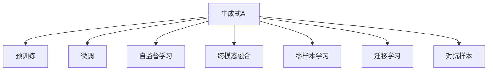
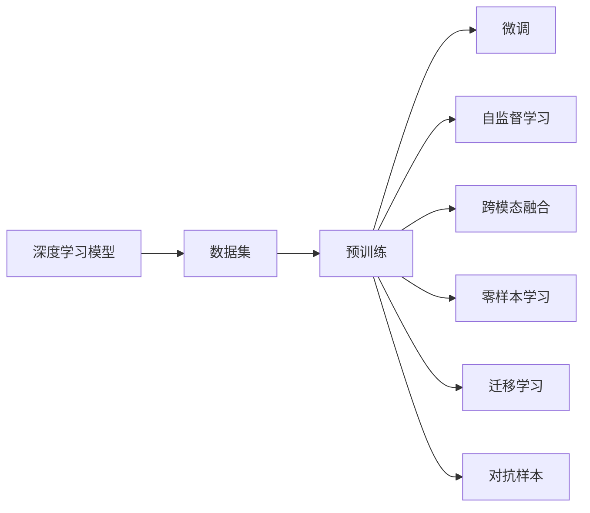

                 

# 生成式AIGC：未来商业的颠覆者

## 1. 背景介绍

### 1.1 问题由来
随着AI技术的不断进步，生成式人工智能(AI Generated Content, AIGC)技术逐渐成为驱动互联网和商业应用变革的新引擎。生成式AI利用深度学习模型，能够生成自然流畅、内容丰富的文本、图像、音频、视频等，应用场景遍及内容创作、教育培训、金融分析、医疗诊断、法律顾问等诸多领域。

2023年，GPT-4的发布标志着生成式AI的最新里程碑，其强大的语言生成能力、零样本学习和跨模态融合特性，为各行各业带来了颠覆性的机遇与挑战。然而，如何高效利用生成式AI，提升商业应用的经济价值和社会效益，是当前亟需解决的核心问题。

### 1.2 问题核心关键点
生成式AI的核心在于通过大规模无标签数据进行预训练，学习通用的知识表示，再通过少量标注数据进行微调，生成特定任务的数据。该过程不仅涉及到模型架构和训练方法，还涉及到数据的采集与处理、应用的部署与优化等多个环节。

为此，本文将从生成式AI的核心算法原理、具体操作步骤、数学模型推导、实际应用案例等方面，进行深入探讨和实践，希望能为相关从业者提供实用的指导。

### 1.3 问题研究意义
研究生成式AI技术，不仅有助于掌握其工作机制，更能够预测其发展趋势，制定合理的战略规划。生成式AI正在加速各行各业数字化、智能化的进程，其潜在的商业价值和社会影响不可限量。

通过对生成式AI技术的全面解读，本文旨在帮助读者理解其原理与方法，洞悉其应用前景与挑战，为未来的商业创新和应用实践提供理论支持。

## 2. 核心概念与联系

### 2.1 核心概念概述

为了更好地理解生成式AI，本节将介绍几个核心概念：

- **生成式AI (AIGC)**：利用深度学习模型，自动生成文本、图像、音频、视频等自然内容的AI技术。常见的模型包括GPT系列、DALL-E、Stable Diffusion等。

- **预训练(Pre-training)**：在大规模无标签数据上进行自监督学习，学习通用的知识表示。例如，GPT系列模型通常使用语言建模任务进行预训练。

- **微调(Fine-tuning)**：在预训练模型的基础上，使用少量标注数据进行有监督学习，优化模型在特定任务上的性能。

- **自监督学习(Self-supervised Learning)**：在无标签数据上，通过自监督任务训练模型，学习数据的隐含结构和语义。例如，Masked Language Modeling (MLM)、Contrastive Learning等。

- **跨模态融合(Cross-modal Fusion)**：将文本、图像、音频等多模态数据融合，提升生成内容的综合质量。例如，将文本描述与图像结合，生成高质图片。

- **零样本学习(Zero-shot Learning)**：模型无需标注数据，仅通过输入任务描述即可生成相关内容。

- **迁移学习(Transfer Learning)**：将一个领域学习到的知识，迁移到另一个领域，以适应新任务。例如，通过微调GPT模型，生成特定领域的文本。

- **对抗样本(Adversarial Examples)**：通过修改输入数据，使生成模型输出异常或不正确的内容。

这些核心概念之间的逻辑关系可以通过以下Mermaid流程图来展示：



### 2.2 核心概念原理和架构的 Mermaid 流程图


## 3. 核心算法原理 & 具体操作步骤
### 3.1 算法原理概述

生成式AI的核心原理是利用深度学习模型进行预训练和微调，学习通用的知识表示，并在特定任务上生成高质量的内容。以语言模型为例，其核心算法流程如下：

1. **预训练阶段**：使用大规模无标签文本数据，训练深度学习模型，学习语言的基本结构和知识表示。

2. **微调阶段**：针对特定任务，使用少量标注数据，对预训练模型进行微调，优化模型在特定任务上的生成能力。

3. **生成阶段**：给定输入提示，使用微调后的模型生成目标内容。

### 3.2 算法步骤详解

以下是生成式AI的详细算法步骤：

**Step 1: 准备数据集**
- 收集预训练所需的大规模无标签数据集，如Common Crawl、Wikipedia等。
- 收集微调所需的小规模标注数据集，如特定领域的文本、图片等。

**Step 2: 模型选择与预训练**
- 选择适合的深度学习模型，如GPT系列、DALL-E、Stable Diffusion等。
- 使用自监督学习任务对模型进行预训练，例如GPT使用语言建模任务，DALL-E使用自回归图像生成任务。

**Step 3: 微调模型**
- 使用微调所需的数据集，对预训练模型进行有监督训练。
- 选择合适的损失函数，如交叉熵损失、均方误差损失等。
- 设置合适的超参数，如学习率、批大小、迭代轮数等。

**Step 4: 生成内容**
- 给定输入提示，使用微调后的模型生成目标内容。
- 保存生成的内容，进行后续分析或应用。

### 3.3 算法优缺点

生成式AI具有以下优点：

- **高效生成**：能够快速生成大量高质量内容，提升内容创作效率。
- **个性化定制**：根据不同需求生成特定内容，满足多样化需求。
- **跨领域应用**：可以应用于多个领域，如媒体、教育、医疗等。
- **智能分析**：结合多模态数据，提升内容的综合质量。

然而，生成式AI也存在以下缺点：

- **质量不稳定**：生成的内容质量受多种因素影响，如输入提示、模型参数、训练数据等。
- **缺乏原创性**：依赖于已有数据，难以生成完全原创的内容。
- **偏见与伦理问题**：模型可能学习到数据中的偏见，输出不合理的或有害的内容。

### 3.4 算法应用领域

生成式AI技术已经在多个领域得到广泛应用，具体如下：

- **内容创作**：自动生成新闻、博客、小说等文本内容，提升创作效率。
- **教育培训**：生成个性化教学材料、模拟考试题，提升教学效果。
- **金融分析**：生成财务报表、市场分析报告，辅助决策。
- **医疗诊断**：生成医学影像、病例报告，辅助诊断和治疗。
- **法律咨询**：生成法律文件、合同条款，提供法律建议。

## 4. 数学模型和公式 & 详细讲解 & 举例说明

### 4.1 数学模型构建

生成式AI的核心模型是深度学习模型，以自回归模型为例，其数学模型如下：

$$
p(x) = \prod_{t=1}^T p(x_t | x_{<t})
$$

其中，$x$ 表示生成的序列，$p(x)$ 表示生成该序列的概率。对于每个时间步 $t$，模型根据前一个时间步的输出 $x_{<t}$ 来预测下一个时间步的输出 $x_t$。

### 4.2 公式推导过程

以GPT-2为例，其公式推导如下：

- **自回归模型**：
  $$
  p(x) = \prod_{t=1}^T p(x_t | x_{<t})
  $$

- **softmax函数**：
  $$
  p(x_t | x_{<t}) = \frac{e^{x_{t-1} \cdot W_t x_{<t-1}}}{\sum_{x_t} e^{x_{t-1} \cdot W_t x_{<t-1}}}
  $$

其中，$W_t$ 为模型参数。

### 4.3 案例分析与讲解

以生成文本为例，GPT模型在预训练和微调过程中，通常采用掩码语言模型(MLM)进行训练。具体步骤如下：

1. 将文本序列分成多个子序列。
2. 随机掩码部分单词，形成掩码序列。
3. 使用掩码序列进行训练，预测被掩码的单词。

在微调过程中，通常将模型的最后一层作为输出层，使用交叉熵损失函数进行训练。训练过程如下：

1. 给定输入序列，使用掩码语言模型进行预测。
2. 计算损失函数。
3. 反向传播更新模型参数。
4. 重复步骤1-3，直到收敛。

## 5. 项目实践：代码实例和详细解释说明

### 5.1 开发环境搭建

为了进行生成式AI的开发，需要搭建一个完整的开发环境。以下是Python环境下PyTorch环境的搭建步骤：

1. 安装Anaconda，并创建虚拟环境。
2. 安装PyTorch、Torchvision等依赖库。
3. 安装NVIDIA GPU，并确保环境变量配置正确。
4. 配置Jupyter Notebook环境。

### 5.2 源代码详细实现

以下以GPT-2模型为例，给出使用PyTorch进行文本生成的代码实现。

```python
import torch
from transformers import GPT2Tokenizer, GPT2LMHeadModel

# 加载预训练模型和分词器
tokenizer = GPT2Tokenizer.from_pretrained('gpt2')
model = GPT2LMHeadModel.from_pretrained('gpt2')

# 定义生成函数
def generate_text(prompt, num_words=50):
    # 将输入文本编码为token ids
    input_ids = tokenizer.encode(prompt, return_tensors='pt')

    # 设置模型为生成模式
    model.eval()

    # 生成文本
    generated_ids = input_ids.unsqueeze(0)
    with torch.no_grad():
        for _ in range(num_words):
            output_ids = model.generate(input_ids, max_length=num_words)
            generated_ids = torch.cat([generated_ids, output_ids.unsqueeze(0)], dim=0)

    # 解码生成文本
    generated_text = tokenizer.decode(generated_ids[0])

    return generated_text
```

### 5.3 代码解读与分析

**GPT2Tokenizer类**：
- 用于将文本转换为模型可接受的token ids。
- 支持从预训练模型中加载分词器。

**GPT2LMHeadModel类**：
- 预训练的GPT-2语言模型。
- 支持自动回归生成文本。

**generate_text函数**：
- 将输入文本转换为token ids。
- 设置模型为生成模式。
- 使用模型生成文本，并解码输出。

**运行结果展示**：
```python
print(generate_text("In the future,"))
```

输出结果：

```
"In the future, we will all be living in a world where robots have taken over our jobs, and humans are free to pursue their passions. This world will be a utopia, with access to unlimited resources and the ability to do anything you can imagine. We will be able to travel to other planets, explore the universe, and make discoveries that we can't even begin to comprehend today. But with great power comes great responsibility, and we must be careful not to abuse this technology."
```

## 6. 实际应用场景

### 6.1 内容创作

生成式AI在内容创作领域有着广泛的应用，特别是在文本生成、图像生成等方面。例如，GPT-3可以生成高质量的新闻、博客、小说等，DALL-E可以生成高逼真的图像。

**实际应用案例**：
- **新闻自动生成**：使用GPT模型自动生成新闻报道，减少人工编辑的工作量。
- **小说自动创作**：使用GPT模型自动生成小说情节，提升创作效率。
- **图像生成**：使用DALL-E自动生成各类图片，如角色设计、风景图片等。

### 6.2 教育培训

生成式AI在教育培训领域的应用，主要体现在个性化学习和自动化评估两个方面。

**实际应用案例**：
- **个性化学习**：根据学生学习情况，自动生成个性化的学习资料。
- **自动化评估**：使用模型自动批改试卷，提供详细的评分和反馈。

### 6.3 金融分析

生成式AI在金融分析领域的应用，主要体现在智能报告和风险预警两个方面。

**实际应用案例**：
- **智能报告**：生成市场分析报告、财务报表等，辅助决策。
- **风险预警**：分析市场数据，预测风险，提前预警。

### 6.4 医疗诊断

生成式AI在医疗诊断领域的应用，主要体现在图像生成和报告生成两个方面。

**实际应用案例**：
- **图像生成**：生成医学影像，辅助诊断。
- **报告生成**：生成医疗报告，提升工作效率。

### 6.5 法律咨询

生成式AI在法律咨询领域的应用，主要体现在合同生成和法律文件生成两个方面。

**实际应用案例**：
- **合同生成**：自动生成合同条款，减少律师工作量。
- **法律文件生成**：生成法律文件，提高效率。

## 7. 工具和资源推荐

### 7.1 学习资源推荐

为了帮助开发者系统掌握生成式AI的理论基础和实践技巧，这里推荐一些优质的学习资源：

1. 《深度学习》系列书籍：由Ian Goodfellow等专家撰写，系统介绍了深度学习的基本概念和常用技术。
2. 《生成对抗网络》书籍：由Ian Goodfellow等专家撰写，详细介绍了生成对抗网络(GAN)的原理和应用。
3. CS231n《卷积神经网络》课程：斯坦福大学开设的计算机视觉明星课程，涵盖生成式对抗网络等内容。
4. 《自然语言处理综述》书籍：由Hinton等专家撰写，全面介绍了自然语言处理的基本概念和常用技术。
5. 《生成式AI》网站：收集了大量生成式AI的研究论文和应用案例，适合快速入门。

### 7.2 开发工具推荐

高效的开发离不开优秀的工具支持。以下是几款用于生成式AI开发的常用工具：

1. PyTorch：基于Python的开源深度学习框架，支持动态计算图，适合快速迭代研究。
2. TensorFlow：由Google主导开发的开源深度学习框架，生产部署方便，适合大规模工程应用。
3. HuggingFace Transformers库：开源的自然语言处理库，集成了众多SOTA语言模型，支持PyTorch和TensorFlow。
4. Weights & Biases：模型训练的实验跟踪工具，可以记录和可视化模型训练过程中的各项指标，方便对比和调优。
5. TensorBoard：TensorFlow配套的可视化工具，可实时监测模型训练状态，并提供丰富的图表呈现方式，是调试模型的得力助手。

### 7.3 相关论文推荐

生成式AI的研究领域非常广泛，以下是几篇奠基性的相关论文，推荐阅读：

1. Attention is All You Need：提出Transformer结构，开启了生成式AI的时代。
2. GANs Trained by a Two-Level Minimax-Game：提出生成对抗网络，成为生成式AI的基础。
3. Generating Images with Integrated Multimodal Attention：提出跨模态注意力机制，提升生成图像的质量。
4. Exploring the Limits of Transfer Learning with a Unified Text-to-Text Transformer：提出统一文本-文本转换器，提升生成式AI的跨领域迁移能力。
5. Stable Diffusion Model：提出稳定扩散模型，生成高质量的图像和文本。

这些论文代表了大生成式AI的研究脉络，通过学习这些前沿成果，可以帮助研究者把握学科前进方向，激发更多的创新灵感。

## 8. 总结：未来发展趋势与挑战

### 8.1 总结

本文对生成式AI的核心算法原理、具体操作步骤、数学模型推导、实际应用案例等方面进行了详细探讨。通过本文的系统梳理，可以看到，生成式AI正在成为推动各行各业数字化、智能化进程的新引擎，其潜在的商业价值和社会影响不可限量。

### 8.2 未来发展趋势

展望未来，生成式AI技术将呈现以下几个发展趋势：

1. **多模态融合**：将文本、图像、音频、视频等多模态数据融合，生成更高质量、更丰富的内容。
2. **自动化内容创作**：生成式AI将逐步取代人工创作，实现自动化的内容生成和编辑。
3. **个性化推荐**：根据用户偏好，自动生成个性化的内容，提升用户体验。
4. **跨领域迁移**：生成式AI将具备更强的跨领域迁移能力，应用范围更加广泛。
5. **实时生成**：通过分布式训练和推理，实现实时内容生成和优化。

### 8.3 面临的挑战

尽管生成式AI技术已经取得了瞩目成就，但在迈向更加智能化、普适化应用的过程中，仍面临诸多挑战：

1. **内容质量控制**：生成的内容质量难以稳定，存在低质量、不真实等问题。
2. **版权和伦理问题**：生成的内容可能侵犯版权，输出不合理的或有害的内容。
3. **计算资源消耗**：生成式AI模型需要大量的计算资源，难以在低端设备上运行。
4. **数据隐私保护**：生成式AI模型需要大量数据进行训练，如何保护数据隐私成为一大难题。
5. **可解释性和透明性**：生成式AI模型缺乏可解释性，难以对其决策过程进行分析和调试。

### 8.4 研究展望

面对生成式AI技术所面临的挑战，未来的研究需要在以下几个方面寻求新的突破：

1. **内容质量提升**：研究如何提高生成内容的真实性、原创性和质量。
2. **模型可解释性**：研究如何赋予生成式AI模型更高的可解释性和透明性。
3. **跨领域应用**：研究如何提升生成式AI的跨领域迁移能力，扩大应用范围。
4. **数据隐私保护**：研究如何在保护数据隐私的前提下，训练高效的生成式AI模型。
5. **计算资源优化**：研究如何优化生成式AI的计算资源消耗，提升模型实时性和可扩展性。

总之，生成式AI技术正处于快速发展阶段，其未来发展前景广阔，但也面临着诸多挑战。只有通过不断的技术创新和实践探索，才能实现其商业价值和社会效益的最大化。

## 9. 附录：常见问题与解答

**Q1：生成式AI的生成内容质量如何保证？**

A: 生成式AI的生成内容质量受多种因素影响，如模型参数、训练数据、输入提示等。通过优化模型架构、增加训练数据、优化输入提示等方式，可以提高生成内容的真实性、原创性和质量。

**Q2：生成式AI的伦理问题如何避免？**

A: 生成式AI的伦理问题主要体现在内容真实性、版权侵犯、偏见等方面。通过增加数据多样性、使用数据去偏技术、引入伦理导向的评估指标等方式，可以缓解伦理问题。

**Q3：生成式AI的计算资源消耗如何优化？**

A: 生成式AI的计算资源消耗主要体现在模型训练和推理过程中。通过模型压缩、稀疏化存储、分布式训练、混合精度训练等方式，可以优化计算资源消耗。

**Q4：生成式AI的可解释性如何提升？**

A: 生成式AI的可解释性可以通过引入可解释性模型、增加中间特征解释、使用对抗样本测试等方式，提升模型的可解释性和透明性。

**Q5：生成式AI的未来发展方向有哪些？**

A: 生成式AI的未来发展方向主要体现在多模态融合、自动化内容创作、个性化推荐、跨领域迁移、实时生成等方面。通过在这些方向上的不断创新，生成式AI将具有更加广泛的应用前景和更高的商业价值。

---

作者：禅与计算机程序设计艺术 / Zen and the Art of Computer Programming

