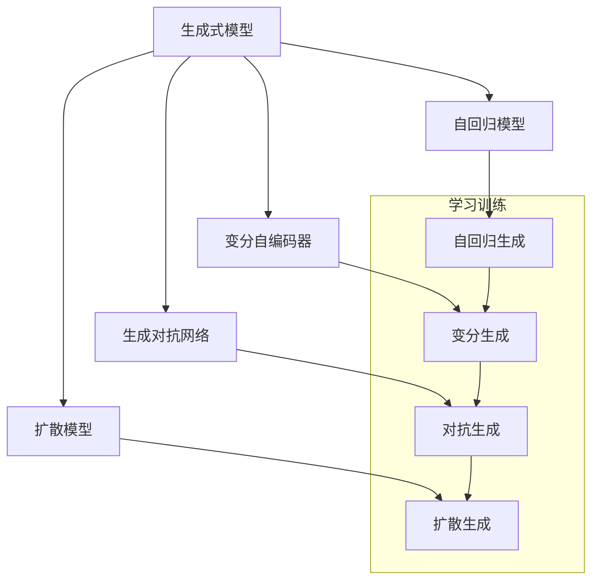

                 

# 生成式人工智能时代的到来

## 1. 背景介绍

### 1.1 问题由来

生成式人工智能（Generative AI），又称创造性AI，是指能够生成新的、具有创造性内容的AI系统。这种技术能够模仿人类的创作过程，生成艺术作品、文学作品、音乐、视频等内容。与传统的基于推理的AI不同，生成式AI更加注重内容的创造性和创新性。

生成式AI的兴起源于深度学习技术的突破，尤其是GANs（生成对抗网络）和Transformer等架构的发展。这些技术使得AI系统能够更加高效地生成高质量内容。当前，生成式AI在影视制作、艺术创作、游戏设计、虚拟形象等领域取得了显著的进展。

### 1.2 问题核心关键点

生成式AI的核心在于其创造力和生成能力。与基于规则和逻辑的推理AI不同，生成式AI主要通过学习大量的数据，尤其是带有创造性特点的数据（如图像、文本、音频等），来生成新的内容。这种技术不仅能够模仿现有内容，还能创造出全新的、未知的内容。

生成式AI的技术主要涉及以下几方面：
- **神经网络架构**：如CNNs（卷积神经网络）、RNNs（循环神经网络）、Transformer等。
- **生成模型**：如GANs、VQ-VAE、Diffusion Models等。
- **优化算法**：如Adam、SGD、Adaptive Learning Rate等。
- **数据增强和数据生成**：通过数据扩充、合成数据等技术，增强模型的泛化能力。

### 1.3 问题研究意义

生成式AI的研究具有重要的理论和实践意义：
1. **推动人工智能的发展**：生成式AI的进步，代表了AI领域的一个重大突破，是人工智能发展的重要里程碑。
2. **提升创意产业效率**：生成式AI可以大幅提升内容创意和制作效率，降低成本，带来更高的商业价值。
3. **增强用户体验**：通过生成高质量的内容，如音乐、影视作品等，增强用户对AI的信任和依赖，提升用户体验。
4. **推动创新应用场景**：生成式AI不仅应用于艺术创作、游戏设计等领域，还可应用于教育、医疗、法律等传统行业，推动这些行业的创新和变革。

## 2. 核心概念与联系

### 2.1 核心概念概述

为了更好地理解生成式AI，我们首先介绍几个关键概念：

- **生成式模型（Generative Model）**：能够生成新样本的模型，如GAN、VAE、Diffusion Models等。
- **自回归模型（Autoregressive Model）**：通过先确定前一项的生成结果，再决定下一项的生成方式。
- **变分自编码器（Variational Autoencoder, VAE）**：通过学习数据生成概率分布，生成新的数据样本。
- **生成对抗网络（Generative Adversarial Networks, GANs）**：由生成器和判别器两个网络组成，通过对抗训练生成高质量的数据。
- **扩散模型（Diffusion Models）**：通过逐步添加噪声的方式，将噪声和目标数据结合起来，生成逼真的数据。

这些概念之间有着紧密的联系，通过不断的技术演进，它们共同推动了生成式AI的发展。

### 2.2 核心概念原理和架构的 Mermaid 流程图



这个流程图展示了生成式AI中几个主要模型的基本结构和训练方式。可以看到，不同的模型通过各自的生成方式，最终共同实现了高质量内容的生成。

## 3. 核心算法原理 & 具体操作步骤

### 3.1 算法原理概述

生成式AI的核心算法原理是生成模型，其主要任务是学习数据的分布，并从中生成新的样本。常用的生成模型包括GAN、VAE和Diffusion Models等。

以GANs为例，其核心思想是通过一个生成器网络和一个判别器网络，通过对抗训练的方式生成逼真的数据。生成器网络的任务是生成假样本，判别器网络的任务是区分真实样本和假样本。通过不断优化两个网络的权重，最终生成器能够生成高质量的样本，判别器能够准确区分样本的真实性。

### 3.2 算法步骤详解

以下是基于GAN的生成式AI的详细步骤：

1. **数据准备**：收集并准备训练所需的数据集。数据集应包含足够的多样性和覆盖面。
2. **构建模型**：构建一个生成器和一个判别器。生成器通常使用DNN（深度神经网络）或GAN变体。判别器可以使用DNN或CNN。
3. **训练模型**：通过对抗训练的方式，不断调整生成器和判别器的权重，使得生成器能够生成逼真的样本，判别器能够准确区分样本的真实性。
4. **生成样本**：通过训练好的生成器，生成新的样本。

### 3.3 算法优缺点

生成式AI的优点包括：
- **创造性**：能够生成新的、具有创造性的内容。
- **多样性**：可以生成多种形式的内容，如文本、图像、音乐等。
- **灵活性**：可以根据不同的应用场景进行调整和优化。

生成式AI的缺点包括：
- **难以控制**：生成的内容可能不符合预期，需要大量的训练和调试。
- **资源消耗大**：生成高质量内容需要大量的计算资源和存储空间。
- **对抗样本风险**：生成的内容可能存在对抗性，导致系统安全性问题。

### 3.4 算法应用领域

生成式AI的应用领域非常广泛，涵盖以下几个方面：

1. **影视制作**：生成逼真的特效、背景、角色等，大大降低制作成本，提升制作效率。
2. **艺术创作**：生成各种形式的艺术作品，如绘画、雕塑、音乐等，推动艺术创新。
3. **游戏设计**：生成逼真的游戏场景、角色、道具等，提升游戏体验和趣味性。
4. **虚拟形象**：生成逼真的虚拟角色，用于虚拟现实、增强现实等应用。
5. **医疗影像**：生成高质量的医学影像数据，辅助医学研究和诊断。
6. **智能客服**：生成自然流畅的对话内容，提升客服体验。

## 4. 数学模型和公式 & 详细讲解 & 举例说明

### 4.1 数学模型构建

生成式AI的核心数学模型是生成模型，常用的模型包括GAN、VAE、Diffusion Models等。这里以GAN为例，构建其数学模型。

GAN的训练目标是通过优化生成器和判别器的权重，使得生成器能够生成逼真的样本。目标函数可以表示为：

$$
\min_G \max_D V(D,G)
$$

其中，$V(D,G)$是生成器和判别器的联合损失函数，定义为：

$$
V(D,G) = \mathbb{E}_{x\sim p_{data}(x)} [\log D(x)] + \mathbb{E}_{z\sim p(z)} [\log(1-D(G(z)))]
$$

其中，$D$是判别器，$G$是生成器，$z$是生成器的输入噪声，$p(z)$是噪声分布，$p_{data}(x)$是真实数据的分布。

### 4.2 公式推导过程

在GAN中，生成器和判别器的训练过程是交替进行的。假设生成器生成一个样本$x$，判别器根据$x$的真实性给出预测结果$y$。生成器的损失函数为：

$$
L_G = -\mathbb{E}_{z\sim p(z)} [\log D(G(z))]
$$

判别器的损失函数为：

$$
L_D = -\mathbb{E}_{x\sim p_{data}(x)} [\log D(x)] - \mathbb{E}_{z\sim p(z)} [\log(1-D(G(z)))]
$$

通过对这两个损失函数进行优化，生成器和判别器的权重将被调整到最优状态，使得生成器能够生成逼真的样本。

### 4.3 案例分析与讲解

以图像生成为例，假设有一个人脸图像数据集，其中包含10万张高质量的人脸图像。使用GAN生成高质量的人脸图像步骤如下：

1. **数据准备**：收集并准备人脸图像数据集。
2. **构建模型**：构建一个生成器和一个判别器，生成器和判别器都使用DNN网络结构。
3. **训练模型**：使用对抗训练的方式，不断调整生成器和判别器的权重，使得生成器能够生成逼真的人脸图像。
4. **生成样本**：使用训练好的生成器，生成高质量的人脸图像。

## 5. 项目实践：代码实例和详细解释说明

### 5.1 开发环境搭建

在实践中，生成式AI通常使用深度学习框架进行开发。这里以PyTorch为例，搭建生成式AI的开发环境：

1. **安装PyTorch**：
```bash
pip install torch torchvision torchaudio
```

2. **安装TensorBoard**：
```bash
pip install tensorboard
```

3. **安装GAN库**：
```bash
pip install tensorboard
```

### 5.2 源代码详细实现

以下是使用PyTorch实现GAN生成人脸图像的代码：

```python
import torch
import torch.nn as nn
import torchvision.transforms as transforms
import torchvision.datasets as datasets
from torch.utils.data import DataLoader

# 定义生成器和判别器
class Generator(nn.Module):
    def __init__(self):
        super(Generator, self).__init__()
        self.fc1 = nn.Linear(100, 256)
        self.fc2 = nn.Linear(256, 512)
        self.fc3 = nn.Linear(512, 1024)
        self.fc4 = nn.Linear(1024, 28*28)
        self.fc5 = nn.Linear(28*28, 784)

    def forward(self, x):
        x = nn.functional.relu(self.fc1(x))
        x = nn.functional.relu(self.fc2(x))
        x = nn.functional.relu(self.fc3(x))
        x = torch.tanh(self.fc4(x))
        x = self.fc5(x)
        return x

class Discriminator(nn.Module):
    def __init__(self):
        super(Discriminator, self).__init__()
        self.fc1 = nn.Linear(784, 1024)
        self.fc2 = nn.Linear(1024, 512)
        self.fc3 = nn.Linear(512, 256)
        self.fc4 = nn.Linear(256, 1)

    def forward(self, x):
        x = nn.functional.relu(self.fc1(x))
        x = nn.functional.relu(self.fc2(x))
        x = nn.functional.relu(self.fc3(x))
        x = torch.sigmoid(self.fc4(x))
        return x

# 定义训练过程
def train_epochs(model, dataloader, optimizer):
    for epoch in range(num_epochs):
        for i, (img, label) in enumerate(dataloader):
            # 训练生成器
            optimizer_G.zero_grad()
            z = torch.randn(batch_size, 100)
            fake_img = model_G(z)
            gen_loss = nn.functional.mse_loss(fake_img.view(-1, 784), img.view(-1, 784))
            gen_loss.backward()
            optimizer_G.step()

            # 训练判别器
            optimizer_D.zero_grad()
            real_img = img.view(-1, 784)
            fake_img = fake_img.view(-1, 784)
            real_loss = nn.functional.mse_loss(real_img, img.view(-1, 784))
            fake_loss = nn.functional.mse_loss(fake_img, img.view(-1, 784))
            d_loss = real_loss + fake_loss
            d_loss.backward()
            optimizer_D.step()

        print(f'Epoch {epoch+1}, G Loss: {gen_loss.data}, D Loss: {d_loss.data}')

# 加载数据集
transform = transforms.Compose([transforms.ToTensor()])
train_dataset = datasets.MNIST('mnist/', train=True, download=True, transform=transform)
train_loader = DataLoader(train_dataset, batch_size=64, shuffle=True)

# 初始化模型和优化器
model_G = Generator()
model_D = Discriminator()
optimizer_G = torch.optim.Adam(model_G.parameters(), lr=0.0002)
optimizer_D = torch.optim.Adam(model_D.parameters(), lr=0.0002)

# 训练模型
train_epochs(model_G, train_loader, optimizer_G)
train_epochs(model_D, train_loader, optimizer_D)
```

### 5.3 代码解读与分析

在上述代码中，我们首先定义了生成器和判别器的结构，并使用PyTorch的优化器进行参数初始化。接着，我们定义了训练过程，其中包括生成器和判别器的损失函数和优化器。最后，我们使用MNIST数据集进行训练，并输出生成器和判别器的损失函数。

## 6. 实际应用场景

### 6.1 影视制作

生成式AI在影视制作中的应用非常广泛。例如，使用GAN生成逼真的特效、背景、角色等，可以大大降低制作成本，提升制作效率。Google DeepDream等技术已经成功地将生成式AI应用于影视特效制作中。

### 6.2 艺术创作

生成式AI在艺术创作中的应用也非常重要。例如，使用GAN生成各种形式的艺术作品，如绘画、雕塑、音乐等，推动艺术创新。一些艺术创作软件已经利用GAN技术，帮助艺术家生成具有创新性的作品。

### 6.3 游戏设计

生成式AI在游戏设计中的应用也非常重要。例如，使用GAN生成逼真的游戏场景、角色、道具等，提升游戏体验和趣味性。一些游戏公司已经使用GAN技术，生成高质量的游戏素材，提升游戏质量。

### 6.4 虚拟形象

生成式AI在虚拟形象中的应用也非常重要。例如，使用GAN生成逼真的虚拟角色，用于虚拟现实、增强现实等应用。一些虚拟现实应用已经使用GAN技术，生成高质量的虚拟角色，提升用户体验。

## 7. 工具和资源推荐

### 7.1 学习资源推荐

为了帮助开发者系统掌握生成式AI的理论基础和实践技巧，这里推荐一些优质的学习资源：

1. **《深度学习》（Ian Goodfellow, Yoshua Bengio, Aaron Courville）**：
   - 这本书是深度学习领域的经典教材，详细介绍了生成式AI的理论基础和实现方法。

2. **Deep Learning Specialization by Andrew Ng**：
   - 由斯坦福大学提供的深度学习课程，包含生成式AI的详细介绍和实现方法。

3. **Generative Adversarial Nets（GANs）in TensorFlow**：
   - 由Google提供的TensorFlow教程，详细介绍了GAN的实现方法和应用场景。

4. **GAN Zoo**：
   - 一个收集了各种GAN变体的开源项目，包含丰富的学习资源和实现示例。

5. **Unsupervised Representation Learning with Deep Convolutional Generative Adversarial Networks**：
   - 一篇关于GAN的著名论文，详细介绍了GAN的原理和实现方法。

### 7.2 开发工具推荐

生成式AI的开发通常使用深度学习框架进行。以下是几款常用的开发工具：

1. **PyTorch**：
   - 一个功能强大的深度学习框架，支持各种生成模型和优化算法。

2. **TensorFlow**：
   - 由Google主导的深度学习框架，支持各种生成模型和优化算法。

3. **Keras**：
   - 一个高层深度学习框架，提供了简单易用的API，方便开发者进行模型构建和训练。

4. **TensorBoard**：
   - 一个可视化工具，可以实时监测模型训练状态，并提供丰富的图表呈现方式。

### 7.3 相关论文推荐

生成式AI的研究领域非常活跃，以下是几篇奠基性的相关论文，推荐阅读：

1. **Generative Adversarial Nets**：
   - Ian Goodfellow, Jean Pouget-Abadie, Mehryar Mohri, Aaron Courville, Yoshua Bengio. 
   - 介绍了GAN的基本原理和实现方法。

2. **A Tutorial on Variational Autoencoders**：
   - Diederik P. Kingma, Max Welling. 
   - 详细介绍了VAE的原理和实现方法。

3. **Denoising Autoencoders with Adversarial Training**：
   - L. Ma, C. Y. Li, J. T. Kwok. 
   - 介绍了一种使用对抗训练的生成模型，提高了生成质量。

4. **Semi-Supervised Learning with Deep Generative Models**：
   - Max Welling, Yann LeCun. 
   - 讨论了使用生成模型进行半监督学习的方法。

## 8. 总结：未来发展趋势与挑战

### 8.1 总结

生成式AI代表了人工智能领域的一个重大突破，具有广阔的应用前景和研究价值。本文对生成式AI的核心算法原理、具体操作步骤进行了详细讲解，并给出了实际应用场景和工具资源推荐。

### 8.2 未来发展趋势

展望未来，生成式AI将呈现以下几个发展趋势：

1. **技术进步**：生成式AI的技术将会不断进步，生成模型的精度和效率将会不断提升。
2. **应用广泛**：生成式AI将会被广泛应用于更多领域，如影视制作、艺术创作、游戏设计、虚拟形象等。
3. **融合创新**：生成式AI将与更多先进技术融合，如知识图谱、因果推理等，推动人工智能的创新发展。
4. **伦理和安全**：生成式AI将更多关注伦理和安全问题，避免生成有害内容，保障用户隐私。

### 8.3 面临的挑战

生成式AI在发展过程中，仍面临诸多挑战：

1. **资源消耗**：生成高质量内容需要大量的计算资源和存储空间，如何优化资源使用是一个重要问题。
2. **控制难度**：生成的内容可能不符合预期，如何控制生成内容的质量和多样性是一个挑战。
3. **对抗样本**：生成的内容可能存在对抗性，如何提高系统的安全性是一个重要问题。
4. **伦理和法律**：生成的内容可能存在伦理和法律问题，如何避免生成有害内容是一个重要问题。

### 8.4 研究展望

未来，生成式AI的研究方向可以从以下几个方面进行：

1. **优化生成模型**：提升生成模型的精度和效率，减少资源消耗。
2. **控制生成内容**：开发新的控制技术，生成符合预期的高质量内容。
3. **提高系统安全性**：加强对抗样本防护，保障系统的安全性。
4. **解决伦理和法律问题**：开发伦理导向的生成模型，避免生成有害内容。

总之，生成式AI是一个充满挑战和机遇的研究领域，未来将会有更多创新和突破，推动人工智能技术的发展。

## 9. 附录：常见问题与解答

**Q1：生成式AI是否适用于所有应用场景？**

A: 生成式AI适用于需要生成高质量内容的应用场景，如影视制作、艺术创作、游戏设计等。但对于需要精确推理和决策的应用场景，如金融预测、医学诊断等，生成式AI可能不够适用。

**Q2：生成式AI的训练过程是否需要大量的标注数据？**

A: 生成式AI的训练通常需要大量的未标注数据，通过无监督学习生成高质量的内容。标注数据主要用于模型优化和微调，不是必须的。

**Q3：生成式AI在实际应用中是否存在技术瓶颈？**

A: 生成式AI在实际应用中面临技术瓶颈，如生成内容质量控制、系统安全性等问题。需要在技术上不断突破，才能更好地服务于实际应用。

**Q4：生成式AI在生成内容时如何避免版权问题？**

A: 生成式AI生成的内容通常是基于数据集训练得到的，版权问题需要根据具体情况进行判断。在生成内容时，应确保使用的数据集不会侵犯版权。

**Q5：生成式AI在生成内容时如何保证质量？**

A: 生成式AI的质量控制需要从多个方面进行，如数据质量、模型结构、优化算法等。需要不断优化训练过程，才能生成高质量的内容。

---

作者：禅与计算机程序设计艺术 / Zen and the Art of Computer Programming

