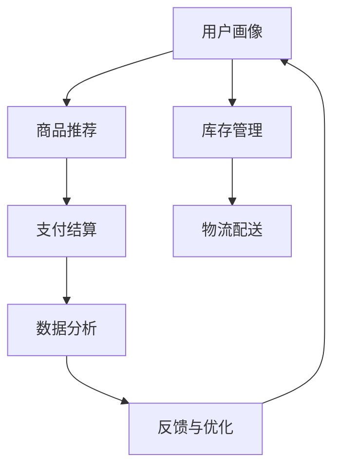

                 

# 电商业务和多元化业务模式

## 1. 背景介绍

### 1.1 电商业务概述

电商业务是指通过互联网进行的商品或服务的在线销售。随着移动互联网的普及和物流技术的进步，电商业务已成为现代零售的主流模式之一。电商业务的线上线下融合，打破了传统的时间和空间限制，极大地提升了购物的便捷性和覆盖面。

电商业务主要包括以下几个关键环节：

- **营销推广**：通过广告、搜索、推荐等手段，吸引用户点击访问和购买。
- **商品展示**：通过网页、APP、小程序等渠道，展示商品信息、图片、视频等。
- **交易结算**：通过支付网关、银行卡、电子钱包等工具，完成订单支付和结算。
- **物流配送**：通过仓储、配送、运送等环节，实现商品从商家到消费者的物理传输。
- **售后服务**：通过客服、评价、退换货等机制，提供售前咨询、售中引导和售后支持。

电商业务的复杂性和动态性，对系统架构、技术选型和运营管理都提出了极高的要求。如何构建高效的电商系统，实现优质服务体验，提升业务增长和运营效率，是电商企业面临的重要挑战。

### 1.2 多元化业务模式

电商业务的快速发展催生了多种新兴业务模式，如直播电商、社交电商、订阅电商等，各具特色。

**直播电商**：通过主播在直播平台展示商品，吸引观众实时下单。直播电商具有即时互动性、高转化率的特点，近年来发展迅猛。

**社交电商**：利用社交网络的传播和影响力，推荐商品给社交关系中的用户。社交电商的口碑效应强，能够显著降低获客成本。

**订阅电商**：提供定期配送、会员制服务的模式，锁定长期客户关系。订阅电商能够提升客户粘性和品牌忠诚度，增加复购率。

多元化业务模式的出现，要求电商企业具备更灵活的技术和运营能力，以适应不同的市场和客户需求。

## 2. 核心概念与联系

### 2.1 核心概念概述

电商业务的核心概念主要包括：

- **用户画像**：通过分析用户行为、偏好、历史数据等，建立用户特征画像，实现个性化推荐和服务。
- **商品推荐**：基于用户画像、商品属性、历史交易数据等，构建商品推荐模型，提升用户购买意愿。
- **库存管理**：实时监控商品库存，平衡供需关系，避免缺货和积压。
- **支付结算**：提供安全的支付工具和结算方式，确保交易安全。
- **物流配送**：高效管理物流链路，确保商品快速送达。
- **数据分析**：通过统计分析、机器学习等技术，挖掘业务数据价值，指导决策。

这些概念之间通过电商系统的数据流和业务流程紧密联系。用户画像和商品推荐共同驱动用户购买决策，库存管理和物流配送保障订单履约，支付结算和数据分析则支撑业务运营效率。

### 2.2 核心概念原理和架构的 Mermaid 流程图



这个流程图展示了电商业务的关键数据流和业务流程。用户画像和商品推荐通过电商平台的搜索、推荐算法产生，驱动用户下单。支付结算和库存管理保障订单生成和库存更新。物流配送实现商品配送，数据分析则从全局角度提供业务优化建议。反馈与优化将用户反馈和业务数据反向传导，更新用户画像和商品推荐模型，形成闭环。

## 3. 核心算法原理 & 具体操作步骤

### 3.1 算法原理概述

电商业务的各个环节涉及大量数据处理和实时计算，算法设计是系统性能的关键。以下是电商业务中几个核心算法的概述：

- **推荐算法**：基于协同过滤、内容过滤、混合过滤等方法，为用户提供个性化的商品推荐。
- **库存管理算法**：利用动态规划、贪心算法等方法，实时调整库存，满足供需平衡。
- **支付算法**：采用安全、高效的支付协议，如SSL/TLS、数字签名等，确保交易安全。
- **物流配送算法**：通过路径规划、配送调度等技术，优化配送路径和时间，提升物流效率。
- **数据分析算法**：利用机器学习、深度学习等技术，挖掘用户行为、商品销量等数据价值，指导业务决策。

这些算法通常通过大规模分布式系统实现，利用集群计算和内存计算提升处理能力。

### 3.2 算法步骤详解

以**推荐算法**为例，详细讲解算法的具体步骤：

**Step 1: 数据准备**
- 收集用户行为数据（如浏览记录、购买历史、评分数据）。
- 收集商品属性数据（如商品ID、分类、品牌）。
- 将数据进行清洗、归一化处理，准备输入模型。

**Step 2: 模型选择**
- 根据业务需求选择合适的推荐算法，如协同过滤、内容过滤、混合过滤等。
- 设计模型参数，如相似度计算方法、特征权重等。

**Step 3: 模型训练**
- 将数据集划分为训练集和测试集。
- 使用训练集对推荐模型进行训练，最小化损失函数。
- 通过交叉验证等技术，选择最优模型。

**Step 4: 模型评估**
- 在测试集上对推荐模型进行评估，计算准确率、召回率、F1值等指标。
- 进行A/B测试，比较推荐模型与基准模型的效果。

**Step 5: 上线运行**
- 将训练好的推荐模型部署到线上系统。
- 实时接收用户行为数据，调用推荐模型进行商品推荐。
- 监控推荐效果，不断调整模型参数和优化算法。

### 3.3 算法优缺点

电商业务中的推荐算法具有以下优点：

- **个性化**：通过分析用户历史行为和偏好，提供个性化的商品推荐，提高转化率。
- **高效性**：推荐算法能够实时处理用户行为数据，快速响应推荐请求，提升用户体验。
- **扩展性**：推荐算法可以应用于多种电商业务场景，如搜索、浏览、购物车等。

同时，这些算法也存在一些缺点：

- **数据依赖**：推荐算法需要大量历史数据进行训练，数据质量对推荐效果影响较大。
- **复杂度**：推荐算法涉及复杂的数学模型和计算，对系统硬件要求较高。
- **多样性**：用户需求多样，单一推荐算法难以覆盖所有场景，需要进行多策略融合。

### 3.4 算法应用领域

电商业务的推荐算法广泛应用于以下场景：

- **首页推荐**：利用算法在用户进入电商首页时，展示个性化商品。
- **搜索排序**：对用户搜索的商品进行排序，推荐最相关的商品。
- **购物车推荐**：向用户推荐购物车中已选商品的互补品。
- **活动促销**：根据用户行为，推荐打折商品和促销活动。
- **个性化服务**：提供个性化商品、优惠券等增值服务，提升用户体验。

## 4. 数学模型和公式 & 详细讲解 & 举例说明

### 4.1 数学模型构建

电商业务中的推荐算法通常采用协同过滤、内容过滤等方法，构建用户-商品评分矩阵 $R \in \mathbb{R}^{U \times I}$，其中 $U$ 表示用户数，$I$ 表示商品数。

目标是最小化损失函数 $L$，以获取最优评分矩阵：

$$
L = \frac{1}{2\lambda} ||R - R_{pred}||^2_F + \frac{\lambda}{2} ||\beta||^2_2
$$

其中 $R_{pred}$ 表示预测评分矩阵，$\lambda$ 为正则化系数，$\beta$ 为模型参数。

### 4.2 公式推导过程

以下对推荐算法中的**协同过滤算法**进行详细推导：

协同过滤算法分为基于用户的协同过滤和基于物品的协同过滤。这里以基于用户的协同过滤为例，推导算法的核心公式：

假设用户 $u$ 对商品 $i$ 的评分 $r_{ui}$ 由其对其他商品 $j$ 的评分 $r_{uj}$ 和商品 $j$ 对商品 $i$ 的评分 $r_{ji}$ 共同决定，即：

$$
r_{ui} \propto \sum_{j \in J} \alpha_j \frac{r_{uj}}{s_j}
$$

其中 $J$ 表示用户 $u$ 喜欢的其他商品集合，$s_j$ 表示商品 $j$ 的评分分布，$\alpha_j$ 为调节因子。

进一步，通过迭代优化算法，求解最优评分矩阵 $R$：

$$
R_{ui} = \frac{1}{1 + \exp(-\sum_{j \in J} \alpha_j \frac{r_{uj}}{s_j})}
$$

这个公式展示了协同过滤算法的核心思想：通过分析用户对其他商品的评分，预测其对当前商品的评分。

### 4.3 案例分析与讲解

假设有一个电商平台的商品推荐系统，需要对用户 $u$ 推荐商品 $i$。用户 $u$ 对其他商品 $j$ 的评分如下：

| 商品 $j$  | 评分 $r_{uj}$ |
| --------- | ------------ |
| 商品1     | 4            |
| 商品2     | 3            |
| 商品3     | 2            |
| 商品4     | 5            |

假设商品 $j$ 对商品 $i$ 的评分如下：

| 商品 $j$  | 评分 $r_{ji}$ |
| --------- | ------------ |
| 商品1     | 3            |
| 商品2     | 5            |
| 商品3     | 2            |
| 商品4     | 4            |

取 $\alpha_j = 0.5$，商品 $j$ 的评分分布 $s_j = 3$，根据协同过滤算法的公式：

$$
r_{ui} = \frac{1}{1 + \exp(-0.5(4+3+2+5))} = 0.5
$$

因此，推荐系统可以推荐商品 $i$ 给用户 $u$，评分预测值为 $0.5$。

## 5. 项目实践：代码实例和详细解释说明

### 5.1 开发环境搭建

电商业务系统通常采用微服务架构，包括用户管理、商品管理、订单管理、物流管理等多个模块。开发环境搭建一般采用Docker容器技术，支持分布式部署和管理。

**Step 1: 安装Docker和Kubernetes**
- 安装Docker，配置Docker网络。
- 安装Kubernetes，部署Minikube集群。

**Step 2: 容器化开发**
- 使用Dockerfile定义容器镜像，编写应用代码。
- 构建Docker镜像，推送到Docker Hub。

**Step 3: Kubernetes部署**
- 在Kubernetes集群中创建Deployment和Service，部署应用。
- 配置自动扩缩容、服务发现、负载均衡等。

**Step 4: 监控告警**
- 使用Prometheus和Grafana监控应用性能和资源使用情况。
- 配置告警规则，及时发现异常情况。

### 5.2 源代码详细实现

电商平台的推荐算法实现主要包括以下几个部分：

**推荐算法模块**
```python
class RecommendationAlgorithm:
    def __init__(self, model):
        self.model = model

    def predict(self, user_id, item_id):
        return self.model.predict(user_id, item_id)
```

**评分预测模块**
```python
class RatingPredictor:
    def __init__(self, matrix):
        self.matrix = matrix

    def predict(self, user_id, item_id):
        return self.matrix[user_id][item_id]
```

**协同过滤模块**
```python
class CollaborativeFiltering:
    def __init__(self, matrix, alpha=0.5, s=3):
        self.matrix = matrix
        self.alpha = alpha
        self.s = s

    def predict(self, user_id, item_id):
        ratings = [self.matrix[user_id][j] for j in self.matrix]
        weights = [1 / (self.s + ratings[j]) for j in ratings]
        return self.alpha * sum([self.matrix[j][item_id] * w for j, w in zip(ratings, weights)]) / (1 + sum(weights))
```

**推荐系统模块**
```python
class RecommendationSystem:
    def __init__(self, algorithm):
        self.algorithm = algorithm

    def recommend(self, user_id, item_ids):
        return {item_id: self.algorithm.predict(user_id, item_id) for item_id in item_ids}
```

**调用示例**
```python
matrix = np.array([[4, 3, 2, 5],
                   [3, 5, 2, 4],
                   [2, 3, 5, 2],
                   [5, 4, 4, 3]])

collaborative = CollaborativeFiltering(matrix, alpha=0.5, s=3)
rating_predictor = RatingPredictor(matrix)

algorithm = RecommendationAlgorithm(collaborative)
recommendation_system = RecommendationSystem(algorithm)

user_id = 1
item_ids = [2, 3, 4, 5]
recommendations = recommendation_system.recommend(user_id, item_ids)
print(recommendations)
```

### 5.3 代码解读与分析

以上代码展示了电商推荐系统的核心模块和调用方式。推荐系统通过协同过滤算法，预测用户对不同商品的评分，从而生成推荐结果。调用示例中，首先将评分矩阵加载到内存，创建协同过滤算法和评分预测模块，然后创建推荐算法和推荐系统模块，最后根据用户ID和商品ID列表，调用推荐系统模块进行推荐。

## 6. 实际应用场景

### 6.1 智能推荐系统

智能推荐系统是电商业务的核心之一。通过推荐系统，电商平台能够精准预测用户需求，提供个性化商品，提升用户满意度和购买率。智能推荐系统的核心在于推荐算法的设计和优化。

**案例分析**
一家电商网站通过协同过滤算法和内容过滤算法，为用户提供个性化推荐。协同过滤算法基于用户行为数据，通过相似度计算推荐商品。内容过滤算法则基于商品属性和用户偏好，通过匹配规则推荐商品。

**技术挑战**
智能推荐系统需要处理海量数据，实时响应用户请求，保障推荐结果的准确性和多样性。同时需要应对数据冷启动、用户多样性等挑战，实现长期稳定运营。

### 6.2 库存管理系统

库存管理系统是电商业务中的重要组成部分，通过实时监控商品库存，保障商品供需平衡，避免缺货和积压。库存管理系统包括订单管理、订单预测、库存优化等多个子系统。

**案例分析**
一家电商公司通过预测算法，根据订单数据和库存情况，生成订单预测结果。同时通过库存优化算法，动态调整库存水平，保障订单履约率。

**技术挑战**
库存管理系统需要处理大量订单数据和库存数据，实时进行预测和优化。同时需要考虑物流运输、配送时间等因素，实现高效的库存管理。

### 6.3 支付结算系统

支付结算系统是电商业务中的关键环节，通过安全、高效的支付协议，保障用户交易安全。支付结算系统包括身份验证、支付通道、退款管理等多个子系统。

**案例分析**
一家电商公司通过支付网关和数字签名技术，实现安全的交易支付。同时通过退款管理算法，快速处理用户退款请求，保障交易双方的权益。

**技术挑战**
支付结算系统需要处理复杂的支付场景，保障支付安全性和实时性。同时需要应对恶意攻击、网络故障等风险，实现高可用性。

## 7. 工具和资源推荐

### 7.1 学习资源推荐

**推荐系统**
- 《推荐系统实战》一书：详细讲解推荐算法、系统架构、用户画像等多个方面。
- Coursera《推荐系统》课程：由斯坦福大学开设，提供推荐系统理论和实践的全面讲解。
- Kaggle推荐系统竞赛：参与实战竞赛，提升推荐系统技能。

**库存管理**
- 《库存管理：理论与实践》一书：介绍库存管理的基本理论和实践方法。
- Coursera《库存管理》课程：提供库存管理的理论基础和案例分析。
- Google Colab《库存管理》项目：实现库存管理系统的代码示例。

**支付结算**
- 《支付系统设计》一书：讲解支付系统的设计理念和实现方法。
- Coursera《支付系统》课程：介绍支付系统的核心技术和安全措施。
- GitHub《支付系统》项目：提供支付系统的开源实现和代码示例。

### 7.2 开发工具推荐

**推荐系统**
- Elasticsearch：分布式搜索和分析引擎，支持大规模推荐数据存储。
- Apache Hadoop：大数据处理框架，支持大规模数据处理和分布式计算。
- PyTorch：深度学习框架，支持机器学习和深度学习算法的实现。

**库存管理**
- Google Cloud Storage：云存储服务，支持海量数据存储和管理。
- Apache Kafka：分布式消息队列，支持实时数据处理和数据流计算。
- Docker：容器化技术，支持分布式系统和应用部署。

**支付结算**
- Stripe API：支付网关API，提供安全的支付处理和交易管理。
- OpenSSL：安全套接字层协议，支持数字签名和加密技术。
- PostgreSQL：关系型数据库，支持复杂事务处理和数据存储。

### 7.3 相关论文推荐

**推荐系统**
- "Item-based collaborative filtering in e-commerce recommendation systems"（ICML'12）
- "The factorization machine approach for prediction"（ICML'07）
- "Matrix factorization techniques for recommendation systems"（SIGKDD'08）

**库存管理**
- "Optimal inventory control models"（Management Science'64）
- "Inventory management in a supply chain environment with multiregional supply bases"（Operations Research'98）
- "The theory of inventory management for demand replenishment"（Management Science'93）

**支付结算**
- "Secure online shopping: extending beyond SSL/TLS"（ACM Trans. Inf. Syst. 2002）
- "Building a scalable online payment system"（ICDDS'05）
- "Payment system security"（IEEE Security & Privacy'00）

## 8. 总结：未来发展趋势与挑战

### 8.1 研究成果总结

电商业务和多元化业务模式的研究方向主要包括以下几个方面：

- **推荐算法**：通过协同过滤、内容过滤等算法，提供个性化推荐服务。
- **库存管理**：通过预测算法和优化算法，实现库存管理和动态调整。
- **支付结算**：通过支付网关和数字签名技术，保障交易安全。
- **物流配送**：通过路径规划和配送调度算法，优化配送时间和成本。

这些研究方向在理论和实践上都取得了重要进展，推动了电商业务的快速发展。

### 8.2 未来发展趋势

未来电商业务的发展趋势主要包括以下几个方面：

- **个性化推荐**：通过多模态数据融合、深度学习等技术，提供更精准的个性化推荐服务。
- **实时计算**：利用流计算、边缘计算等技术，实现实时数据分析和处理，提升业务效率。
- **分布式系统**：采用微服务架构和容器化技术，实现分布式部署和弹性扩展。
- **人工智能**：引入AI技术，提升营销推广、客户服务、运营管理等多个环节的智能化水平。

### 8.3 面临的挑战

电商业务的发展仍面临一些挑战：

- **数据隐私和安全**：电商业务涉及大量用户数据和交易数据，数据隐私和安全问题需要重视。
- **系统复杂性**：电商业务系统复杂度较高，需要具备较高的技术和管理能力。
- **用户满意度**：电商业务的用户满意度直接影响用户留存和忠诚度，需要持续优化用户体验。
- **供应链管理**：电商业务的物流配送环节较为复杂，需要高效管理供应链和物流网络。

### 8.4 研究展望

未来电商业务的研究方向主要包括以下几个方面：

- **数据隐私保护**：采用区块链、联邦学习等技术，保护用户隐私和交易安全。
- **多模态融合**：通过多模态数据融合技术，提供更全面的用户画像和商品推荐。
- **实时化运营**：引入实时计算和边缘计算技术，实现实时数据分析和处理。
- **智能决策**：利用人工智能技术，提升电商业务的智能化水平，实现精准决策。

## 9. 附录：常见问题与解答

**Q1：电商业务中的推荐算法有哪些？**

A: 电商业务中的推荐算法主要包括协同过滤算法、内容过滤算法、混合过滤算法等。协同过滤算法基于用户历史行为数据和相似度计算，提供个性化推荐。内容过滤算法基于商品属性和用户偏好，通过匹配规则推荐商品。混合过滤算法综合两种算法，提升推荐效果。

**Q2：电商业务中的库存管理算法有哪些？**

A: 电商业务中的库存管理算法主要包括需求预测算法和库存优化算法。需求预测算法基于历史订单数据和销售趋势，预测未来订单量。库存优化算法通过动态调整库存水平，平衡供需关系，避免缺货和积压。

**Q3：电商业务中的支付算法有哪些？**

A: 电商业务中的支付算法主要包括支付网关协议和数字签名技术。支付网关协议提供安全的交易处理和支付通道。数字签名技术保障交易的安全性和可靠性。

**Q4：电商业务中的物流配送算法有哪些？**

A: 电商业务中的物流配送算法主要包括路径规划算法和配送调度算法。路径规划算法通过优化配送路径，提升配送效率。配送调度算法通过调度策略，平衡配送资源和订单需求。

**Q5：电商业务中的数据分析算法有哪些？**

A: 电商业务中的数据分析算法主要包括统计分析和机器学习技术。统计分析通过基本统计方法，挖掘业务数据价值。机器学习通过建模预测和分类，提升业务决策的准确性。

作者：禅与计算机程序设计艺术 / Zen and the Art of Computer Programming

