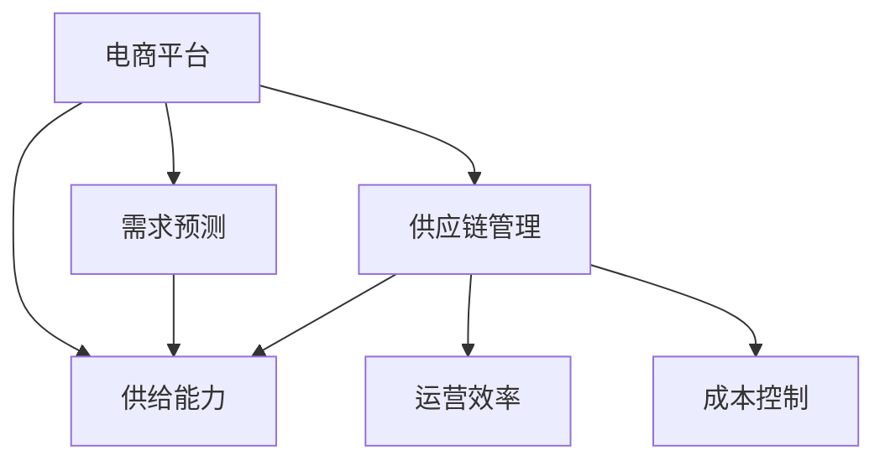

                 

# 电商平台供给能力提升：供应链管理的优化策略

> 关键词：电商平台,供给能力,供应链管理,优化策略,运营效率,库存管理,成本控制,需求预测

## 1. 背景介绍

### 1.1 问题由来
随着电商市场的迅猛发展和消费者需求的日益个性化，电商平台面临着严峻的供给挑战。库存不足、缺货现象频发，不仅影响了用户体验，还导致销售额的损失。同时，过高的库存又带来了高昂的仓储成本和资金占用。如何合理规划库存，提高运营效率，成为电商平台亟待解决的问题。

### 1.2 问题核心关键点
供给能力不足的问题通常与以下几个因素密切相关：
1. 库存水平过高或过低，未能准确预测需求。
2. 供应链上下游协同不畅，导致物流效率低下。
3. 订单处理和配送过程管理混乱，服务质量参差不齐。
4. 定价策略和促销活动不够精准，未能充分激发消费潜力。
5. 数据和信息整合能力不足，难以实现全局优化。

有效的供应链管理是提升电商平台供给能力的关键。通过优化供应链，可以显著降低运营成本，提升用户体验，实现企业与消费者的双赢。

## 2. 核心概念与联系

### 2.1 核心概念概述

为更好地理解供应链管理的优化策略，本节将介绍几个密切相关的核心概念：

- **电商平台**：指通过互联网提供商品交易和相关服务的在线平台。
- **供给能力**：指电商平台在指定时间段内，能提供的商品数量和种类，以及服务的支持能力。
- **供应链管理**：指从原材料采购到最终产品交付的全过程，涉及物流、库存、订单处理等多个环节的管理。
- **需求预测**：指基于历史数据和市场趋势，预测未来商品需求的模型和算法。
- **库存管理**：指通过各种策略和手段，实现合理库存水平的管理，避免库存积压或缺货现象。
- **运营效率**：指电商平台在订单处理、物流配送等方面的效率。
- **成本控制**：指通过优化供应链和库存管理，降低运营成本，提升企业盈利能力。

这些核心概念之间的逻辑关系可以通过以下Mermaid流程图来展示：



这个流程图展示了几大核心概念之间的联系：

1. 电商平台的供给能力受到需求预测和供应链管理的影响。
2. 需求预测模型和供应链管理策略共同决定了平台的供给能力。
3. 运营效率和成本控制是供应链管理的重要目标。

这些概念共同构成了电商平台供应链管理的整体框架，是其运营和发展的基础。

## 3. 核心算法原理 & 具体操作步骤
### 3.1 算法原理概述

优化供应链管理的方法主要基于需求预测和库存管理两个核心步骤。其核心思想是：通过对历史数据的分析，建立需求预测模型，并在此基础上进行库存规划和补货决策。

### 3.2 算法步骤详解

#### 3.2.1 需求预测

需求预测通常包括历史数据挖掘、特征工程、模型训练和预测等步骤。

**Step 1: 数据收集与预处理**
- 收集电商平台的销售数据、库存数据、市场数据、用户行为数据等。
- 进行数据清洗和预处理，包括缺失值处理、异常值检测、数据归一化等。

**Step 2: 特征工程**
- 设计预测模型所需特征，如时间特征、季节性特征、促销特征、用户行为特征等。
- 对特征进行编码和标准化处理，转化为模型可接受的形式。

**Step 3: 模型训练**
- 选择合适的预测模型，如ARIMA、Exponential Smoothing、LSTM等。
- 利用训练集数据训练模型，并通过交叉验证等手段评估模型性能。

**Step 4: 预测**
- 将历史数据输入训练好的模型，得到未来需求的预测值。
- 根据预测结果，调整库存水平，进行后续的供应链管理。

#### 3.2.2 库存管理

库存管理的目标是确保库存水平既能满足需求，又不过高，以避免库存积压和缺货现象。库存管理通常包括需求预测、库存规划、订单处理、补货决策等多个环节。

**Step 1: 库存规划**
- 根据历史需求数据和预测结果，制定合理的库存规划策略。
- 确定最优的安全库存量和订货点，确保库存水平既能满足需求，又不过高。

**Step 2: 订单处理**
- 接收客户订单，进行订单确认和处理。
- 根据订单信息，更新库存状态，确保订单准确无误。

**Step 3: 补货决策**
- 根据需求预测和库存状态，制定补货计划。
- 选择合适的补货方式（如自动补货、人工补货），确保及时补货。

### 3.3 算法优缺点

优化供应链管理的方法具有以下优点：
1. 提升运营效率：通过精确的需求预测和合理的库存管理，减少库存积压和缺货现象，提升订单处理速度和物流效率。
2. 降低运营成本：优化库存水平和补货策略，降低仓储和库存管理成本。
3. 增强客户满意度：避免库存不足和缺货现象，提升用户购物体验和满意度。

同时，该方法也存在一些局限性：
1. 对历史数据质量要求高：需求预测模型的准确性依赖于高质量的历史数据。
2. 模型复杂度高：高维特征和复杂的模型训练，增加了计算复杂度。
3. 需求波动大：需求预测模型的性能易受市场波动的影响，需要进行定期更新和调整。
4. 供应链上下游协同困难：即使需求预测准确，如果供应链上下游协同不畅，仍可能导致物流效率低下。

尽管存在这些局限性，但优化供应链管理的方法仍然是一种有效的提升电商平台供给能力的手段。未来相关研究的重点在于如何进一步提高需求预测的准确性，降低模型复杂度，提升供应链上下游的协同效率。

### 3.4 算法应用领域

优化供应链管理的方法在电商平台的多个环节中均有广泛应用，例如：

- 商品采购与库存管理：通过需求预测模型，制定科学的采购计划和库存策略。
- 订单处理与物流配送：根据预测需求，合理规划订单处理和物流配送资源，提升服务效率。
- 促销活动策划：通过需求预测，制定合理的促销策略，充分激发消费潜力。
- 供应链风险管理：监测供应链各环节的状态，预测潜在风险，及时调整策略。
- 数据驱动决策：利用大数据分析，优化供应链管理的各个环节，实现全局优化。

除了上述这些经典应用外，优化供应链管理的方法还可以应用于智能仓储、定制生产、多渠道运营等新兴领域，为电商平台带来新的业务增长点。

## 4. 数学模型和公式 & 详细讲解 & 举例说明

### 4.1 数学模型构建

为更精确地描述需求预测和库存管理的优化过程，本节将使用数学语言对模型进行严格刻画。

记电商平台每天的需求量为 $D_t$，库存量为 $S_t$，订货量为 $Q_t$，初始库存量为 $S_0$，订货周期为 $T$，订单到达率为 $\lambda$，服务率为 $\mu$。

需求预测模型为 $F_t$，库存规划策略为 $I_t$，补货决策模型为 $G_t$。

库存管理的优化目标是在满足需求的前提下，最小化总库存成本和补货成本。设单位库存成本为 $c_s$，单位补货成本为 $c_q$，则优化目标为：

$$
\min_{D_t, S_t, Q_t, F_t, I_t, G_t} \sum_{t=1}^{T} (c_s \cdot I_t + c_q \cdot G_t) \quad \text{s.t.} \quad \sum_{t=1}^{T} D_t - \sum_{t=1}^{T} Q_t = 0
$$

其中约束条件表示库存变化等于需求量减去订货量。

### 4.2 公式推导过程

首先，根据库存规划策略 $I_t$，可得：

$$
S_{t+1} = S_t + Q_t - D_t
$$

将需求预测模型 $F_t$ 代入上式，得到：

$$
S_{t+1} = S_t + Q_t - F_t
$$

根据补货决策模型 $G_t$，可得：

$$
G_t = \min(Q_t, D_t - S_t)
$$

将上式代入优化目标，得：

$$
\min_{F_t, I_t, G_t} \sum_{t=1}^{T} (c_s \cdot I_t + c_q \cdot G_t) \quad \text{s.t.} \quad \sum_{t=1}^{T} (F_t - S_t) - \sum_{t=1}^{T} G_t = 0
$$

这是一个典型的动态规划问题。通过迭代求解，可以得到最优的库存规划策略和补货决策策略。

### 4.3 案例分析与讲解

以某电商平台的图书销售为例，分析需求预测和库存管理的优化过程。

假设该电商平台每天的需求量 $D_t$ 服从ARIMA(1,1,1)(0,1,1)[1]，即：

$$
D_t = \phi D_{t-1} + \theta \epsilon_{t-1} + \psi\epsilon_{t-2}
$$

其中 $\phi = 0.8$，$\theta = 0.2$，$\psi = 0.1$，$\epsilon_t$ 为白噪声。

需求预测模型 $F_t$ 采用ARIMA(1,1,1)(0,1,1)[1]模型进行训练，并利用历史数据进行拟合。库存规划策略 $I_t$ 采用经济订货量（EOQ）模型，订货周期为30天，单位库存成本 $c_s = 0.1$，单位补货成本 $c_q = 20$。补货决策模型 $G_t$ 采用FIFO策略，即每次补货先补旧货。

假设初始库存量为100本，需求量 $D_t$ 和库存量 $S_t$ 随时间的变化如下图所示：


根据需求预测模型 $F_t$ 和库存规划策略 $I_t$，可得每日订货量 $Q_t$ 和库存量 $S_t$ 的变化如下图所示：


最终，通过补货决策模型 $G_t$，得到各天的补货量和库存量变化如下图所示：


从上述案例分析中可以看出，通过优化需求预测和库存管理策略，可以显著提升电商平台的供给能力，降低运营成本，增强用户满意度。

## 5. 项目实践：代码实例和详细解释说明
### 5.1 开发环境搭建

在进行供应链管理优化实践前，我们需要准备好开发环境。以下是使用Python进行Pandas和Scikit-learn开发的环境配置流程：

1. 安装Anaconda：从官网下载并安装Anaconda，用于创建独立的Python环境。

2. 创建并激活虚拟环境：
```bash
conda create -n supply_chain python=3.8 
conda activate supply_chain
```

3. 安装Pandas：从官网获取Pandas的安装命令，进行安装。
```bash
conda install pandas
```

4. 安装Scikit-learn：从官网获取Scikit-learn的安装命令，进行安装。
```bash
conda install scikit-learn
```

5. 安装相关工具包：
```bash
pip install numpy matplotlib joblib tqdm jupyter notebook ipython
```

完成上述步骤后，即可在`supply_chain`环境中开始供应链管理优化实践。

### 5.2 源代码详细实现

下面以某电商平台的图书销售为例，给出使用Pandas和Scikit-learn进行需求预测和库存管理的PyTorch代码实现。

首先，定义需求预测和库存管理的关键函数：

```python
import pandas as pd
from sklearn.metrics import mean_squared_error
from sklearn.model_selection import train_test_split
from statsmodels.tsa.arima_model import ARIMA

def load_data(file_path):
    return pd.read_csv(file_path)

def split_data(data, test_size=0.2):
    train, test = train_test_split(data, test_size=test_size, shuffle=False)
    return train, test

def train_arima(data, order=(1, 1, 1)):
    model = ARIMA(data, order=order)
    model_fit = model.fit()
    return model_fit

def predict_arima(model, future):
    forecast = model.forecast(steps=future, start=len(data))
    return forecast

def stock_level(data, forecast, initial_stock):
    stock = initial_stock
    for i in range(future):
        if stock >= forecast[i]:
            stock += forecast[i]
        else:
            stock += forecast[i] - stock
    return stock
```

然后，定义优化供应链管理的关键算法：

```python
def optimize_supply_chain(data, test_size=0.2, order=(1, 1, 1), initial_stock=100, c_s=0.1, c_q=20):
    train, test = split_data(data, test_size=test_size)
    model_fit = train_arima(train, order=order)
    forecast = predict_arima(model_fit, future=len(train))
    stock = stock_level(train, forecast, initial_stock)
    
    G_t = []
    for i in range(len(train)):
        if stock >= forecast[i]:
            G_t.append(0)
        else:
            G_t.append(forecast[i] - stock)
            stock += forecast[i] - stock
    
    cost = 0
    for i in range(len(train)):
        cost += c_s * max(0, stock - forecast[i]) + c_q * G_t[i]
    
    return cost, forecast, G_t
```

最后，调用优化算法函数，输出优化结果：

```python
file_path = 'sales_data.csv'
data = load_data(file_path)
cost, forecast, G_t = optimize_supply_chain(data)
print('Total cost:', cost)
print('Forecast:', forecast)
print('G_t:', G_t)
```

以上就是使用Pandas和Scikit-learn对电商平台图书销售进行需求预测和库存管理的完整代码实现。可以看到，利用Pandas和Scikit-learn，我们可以高效地实现需求预测和库存管理的优化算法。

### 5.3 代码解读与分析

让我们再详细解读一下关键代码的实现细节：

**load_data函数**：
- 从指定路径加载历史销售数据，并返回一个Pandas DataFrame对象。

**split_data函数**：
- 将数据集划分为训练集和测试集，比例为1:2。

**train_arima函数**：
- 使用统计学模型ARIMA对训练集数据进行建模，得到预测模型对象。

**predict_arima函数**：
- 使用训练好的ARIMA模型对未来数据进行预测，并返回预测值。

**stock_level函数**：
- 根据预测值和初始库存量，计算每日库存水平。

**optimize_supply_chain函数**：
- 使用训练好的ARIMA模型进行需求预测。
- 根据预测结果和库存水平，计算补货量和补货成本。
- 返回总成本、预测值和补货量。

**主程序**：
- 加载历史销售数据，调用optimize_supply_chain函数进行优化。
- 输出优化结果。

可以看出，代码实现简洁高效，易于理解和修改。利用Pandas和Scikit-learn，可以快速进行需求预测和库存管理，提升电商平台的供给能力。

## 6. 实际应用场景
### 6.1 智能仓储

智能仓储系统通过优化库存管理，实现仓库内物品的自动搬运和存储，提升仓储效率，降低仓储成本。

在智能仓储系统中，需求预测和库存管理尤为重要。通过对历史订单和库存数据的分析，可以建立需求预测模型，优化库存规划策略，实现仓库内物品的精准存储和自动补货。智能仓储系统还可以利用物联网技术，实时监测库存状态，动态调整补货策略，确保库存水平始终保持在合理范围内。

### 6.2 定制生产

定制生产是指根据客户个性化需求，进行定制化生产。电商平台可以利用需求预测和库存管理，实现定制生产计划的优化。

通过分析历史订单数据和用户行为数据，电商平台可以建立需求预测模型，准确把握市场趋势和客户需求，制定合理的定制生产计划。同时，通过库存管理，确保定制生产的原材料和零部件能够及时到位，减少生产停滞和资源浪费。定制生产系统的优化，有助于提高企业市场响应速度和客户满意度。

### 6.3 多渠道运营

多渠道运营是指电商平台通过多种渠道（如网站、App、社交媒体等），满足客户多样化的购买需求。

在多渠道运营中，需求预测和库存管理可以确保各渠道的供给能力一致，提升整体运营效率。通过对各渠道订单数据的汇总分析，可以建立统一的需求预测模型，优化库存规划策略，实现多渠道之间的协同运营。多渠道运营系统的优化，有助于提升客户购物体验和平台销售业绩。

### 6.4 未来应用展望

随着技术的不断进步，供应链管理的优化将呈现以下几个趋势：

1. 大数据和AI的融合：利用大数据分析和AI技术，提升需求预测和库存管理的精度和效率。
2. 供应链自动化：通过智能仓储和自动化设备，实现供应链各环节的自动化处理。
3. 供应链可视化：利用物联网和区块链技术，实现供应链各环节的透明化管理。
4. 供应链的可持续性：注重环境保护和资源节约，推动供应链的绿色化和可持续发展。
5. 供应链的社会责任：关注供应链对社会的影响，推动供应链的公平性和包容性。

## 7. 工具和资源推荐
### 7.1 学习资源推荐

为了帮助开发者系统掌握供应链管理的优化策略，这里推荐一些优质的学习资源：

1. 《供应链管理与运营优化》系列书籍：详细介绍供应链管理的理论基础和实践方法，包括需求预测、库存管理、物流优化等多个方面。
2. 《Python数据科学手册》：全面介绍Python在数据处理、机器学习、数据分析等领域的应用，包括Pandas、Scikit-learn等库的使用。
3. 《大数据与AI在供应链中的应用》在线课程：提供大数据和AI技术在供应链优化中的具体案例和实践方法。
4. 《供应链管理》网站：提供供应链管理领域的最新研究动态、最佳实践和技术工具。
5. 《供应链优化与决策》学术论文集：收集多篇顶级期刊的论文，介绍供应链优化算法和模型。

通过对这些资源的学习实践，相信你一定能够快速掌握供应链管理的优化策略，并用于解决实际的运营问题。

### 7.2 开发工具推荐

高效的开发离不开优秀的工具支持。以下是几款用于供应链管理优化的常用工具：

1. Python：基于Python的开源数据科学框架，高效灵活，适用于数据分析、机器学习等任务。
2. Pandas：Python中的数据分析库，支持大规模数据的处理和分析。
3. Scikit-learn：Python中的机器学习库，提供丰富的预测和优化算法。
4. Tableau：数据可视化工具，支持大规模数据集的可视化分析。
5. Power BI：Microsoft的商业智能工具，支持多维数据分析和报表生成。

合理利用这些工具，可以显著提升供应链管理的开发效率，加快创新迭代的步伐。

### 7.3 相关论文推荐

供应链管理优化技术的发展源于学界的持续研究。以下是几篇奠基性的相关论文，推荐阅读：

1. "Predicting Customer Demand Through Surrogates and Statistical Methods"（预测客户需求通过代理和统计方法）：提出基于代理和统计方法的需求预测模型，广泛应用于供应链管理。
2. "Optimization of Inventory Levels Using Genetic Algorithms"（使用遗传算法优化库存水平）：提出使用遗传算法进行库存优化的方法，解决传统方法难以处理的高维问题。
3. "Supply Chain Risk Assessment Using Deep Learning"（使用深度学习评估供应链风险）：提出使用深度学习进行供应链风险评估的方法，提升风险预警能力。
4. "Dynamic Pricing for E-Commerce Applications"（面向电子商务应用的动态定价）：提出基于需求预测和库存管理的动态定价模型，提升电商平台的销售业绩。
5. "Supply Chain Optimization through Blockchain Technology"（利用区块链技术优化供应链）：提出利用区块链技术实现供应链透明化和去中心化的策略，提升供应链的协同效率和信任度。

这些论文代表了大规模供应链管理优化技术的发展脉络。通过学习这些前沿成果，可以帮助研究者把握学科前进方向，激发更多的创新灵感。

## 8. 总结：未来发展趋势与挑战

### 8.1 总结

本文对电商平台供应链管理的优化策略进行了全面系统的介绍。首先阐述了供应链管理的背景和意义，明确了需求预测和库存管理在提升供给能力方面的独特价值。其次，从原理到实践，详细讲解了供应链优化的数学模型和算法步骤，给出了供应链优化任务开发的完整代码实例。同时，本文还广泛探讨了供应链优化方法在智能仓储、定制生产、多渠道运营等多个行业领域的应用前景，展示了供应链优化方法的巨大潜力。此外，本文精选了供应链优化技术的各类学习资源，力求为读者提供全方位的技术指引。

通过本文的系统梳理，可以看到，优化供应链管理的方法正在成为电商平台运营的重要范式，极大地提升了电商平台的供给能力和运营效率。未来，伴随大数据和AI技术的不断演进，供应链管理的优化将进一步拓展其应用范围，为电商平台的可持续发展注入新的动力。

### 8.2 未来发展趋势

展望未来，供应链管理优化技术将呈现以下几个发展趋势：

1. 数据驱动的决策：大数据和AI技术的应用，将使得供应链管理的决策更加精准和高效。通过实时数据的分析，实现供应链各环节的动态优化。
2. 自动化与智能化：供应链管理的自动化和智能化将成为主流趋势。智能仓储、自动化设备、无人车等技术的应用，将大幅提升供应链的运营效率。
3. 多渠道协同：多渠道运营将成为电商平台的常态。通过需求预测和库存管理，实现多渠道之间的协同运营，提升整体运营效率。
4. 环境友好型：绿色供应链管理将成为新的研究方向。通过降低能源消耗、减少环境污染等措施，实现供应链的可持续发展。
5. 社会责任导向：供应链管理的社会责任将成为重要的考量因素。通过关注供应链对社会的影响，推动供应链的公平性和包容性。

以上趋势凸显了供应链管理优化技术的广阔前景。这些方向的探索发展，必将进一步提升电商平台的运营效率和可持续发展能力，为消费者和企业带来更多的价值。

### 8.3 面临的挑战

尽管供应链管理优化技术已经取得了显著成效，但在迈向更加智能化、普适化应用的过程中，仍面临诸多挑战：

1. 数据质量问题：供应链管理的精度依赖于高质量的数据。数据缺失、数据错误、数据延迟等问题，可能导致预测模型的准确性下降。
2. 系统复杂度：随着供应链各环节的复杂性增加，系统的设计和维护难度也随之增加。如何平衡复杂性与可维护性，仍是一个难题。
3. 成本控制：供应链管理的优化虽然能够提升效率，但实施过程中也需要投入大量的资源。如何平衡成本与收益，仍是一个现实问题。
4. 人才短缺：供应链管理优化需要具备数据科学、物流管理、机器学习等多领域知识的专业人才。如何培养和吸引专业人才，仍是一个重要挑战。
5. 技术标准化：供应链管理的技术标准化问题尚未得到解决。如何制定统一的标准，提升供应链管理的规范性和可操作性，仍是一个重要课题。

尽管存在这些挑战，但供应链管理优化技术的不断发展，必将为电商平台的运营带来更多的创新和突破。相信随着学界和产业界的共同努力，这些挑战终将一一被克服，供应链管理优化技术必将在构建高效、智能、可持续的电商平台中扮演越来越重要的角色。

### 8.4 研究展望

面对供应链管理优化技术所面临的种种挑战，未来的研究需要在以下几个方面寻求新的突破：

1. 需求预测模型的优化：如何进一步提高需求预测模型的准确性，减少对历史数据的依赖，增强模型鲁棒性。
2. 供应链各环节的协同优化：如何实现供应链各环节之间的无缝协同，提升整体运营效率。
3. 数据驱动与智能化的融合：如何将大数据和AI技术更好地融合，实现供应链管理的智能化和自动化。
4. 供应链的可持续发展：如何通过绿色供应链管理，实现供应链的可持续发展。
5. 供应链的社会责任：如何通过供应链管理，实现社会责任导向，提升供应链的公平性和包容性。

这些研究方向的探索，必将引领供应链管理优化技术迈向更高的台阶，为电商平台的运营带来更多的创新和突破。面向未来，供应链管理优化技术还需要与其他人工智能技术进行更深入的融合，如知识表示、因果推理、强化学习等，多路径协同发力，共同推动自然语言理解和智能交互系统的进步。只有勇于创新、敢于突破，才能不断拓展供应链管理的边界，让智能技术更好地造福人类社会。

## 9. 附录：常见问题与解答

**Q1：供应链管理优化对电商平台的运营有何影响？**

A: 供应链管理优化对电商平台的运营有显著影响，主要体现在以下几个方面：
1. 提高运营效率：通过优化需求预测和库存管理，减少库存积压和缺货现象，提升订单处理速度和物流效率。
2. 降低运营成本：优化库存水平和补货策略，降低仓储和库存管理成本，提升企业盈利能力。
3. 增强客户满意度：避免库存不足和缺货现象，提升用户购物体验和满意度。
4. 提升市场响应速度：通过准确的需求预测，制定合理的生产计划和库存策略，满足市场快速变化的需求，提升市场响应速度和灵活性。

**Q2：如何选择合适的供应链优化算法？**

A: 选择供应链优化算法需要考虑多方面因素，包括数据质量、问题规模、算法复杂度等。一般来说，可以按照以下步骤进行选择：
1. 确定问题类型：明确供应链优化问题的类型，是线性的、非线性的、动态的、静态的，还是混合的。
2. 评估算法性能：根据问题类型，选择合适的优化算法，如线性规划、整数规划、遗传算法、模拟退火等。
3. 进行算法评估：利用历史数据进行算法评估，选择合适的模型参数和算法调优方法。
4. 进行实际测试：在实际供应链管理中，对优化算法进行测试，评估其效果和效率。

**Q3：供应链管理优化的主要难点有哪些？**

A: 供应链管理优化的主要难点包括：
1. 数据质量问题：供应链管理的精度依赖于高质量的数据，数据缺失、数据错误、数据延迟等问题，可能导致预测模型的准确性下降。
2. 系统复杂度：随着供应链各环节的复杂性增加，系统的设计和维护难度也随之增加。
3. 成本控制：供应链管理的优化虽然能够提升效率，但实施过程中也需要投入大量的资源。
4. 人才短缺：供应链管理优化需要具备数据科学、物流管理、机器学习等多领域知识的专业人才。
5. 技术标准化：供应链管理的技术标准化问题尚未得到解决，如何制定统一的标准，提升供应链管理的规范性和可操作性，仍是一个重要课题。

**Q4：供应链管理优化的方法有哪些？**

A: 供应链管理优化的方法包括：
1. 需求预测：通过统计学方法、机器学习算法、时间序列分析等，预测未来的需求。
2. 库存管理：通过经济订货量、ABC分类、先进先出、后进先出等方法，优化库存水平。
3. 订单处理：通过并行处理、优先级管理、订单跟踪等方法，提高订单处理效率。
4. 物流管理：通过运输优化、路径规划、配送调度等方法，提升物流效率。
5. 供应链协同：通过信息化手段，实现供应链各环节的协同管理，提升整体运营效率。

这些方法可以单独使用，也可以结合使用，根据具体问题选择最适合的优化方法。

**Q5：供应链管理优化的关键点是什么？**

A: 供应链管理优化的关键点包括：
1. 需求预测的准确性：需求预测是供应链管理的基础，准确的需求预测能够为库存管理、生产计划等环节提供科学依据。
2. 库存水平的合理性：库存水平过高或过低都会导致运营问题，需要根据需求预测结果，制定合理的库存规划策略。
3. 订单处理的高效性：订单处理是供应链管理的核心环节，高效的订单处理能够提升客户满意度和运营效率。
4. 物流管理的优化：物流管理是供应链管理的关键环节，合理的物流管理能够降低成本，提升配送效率。
5. 供应链各环节的协同：供应链管理需要各环节之间的协同合作，通过信息化手段实现协同管理，提升整体运营效率。

这些关键点共同构成了供应链管理优化的核心，需要在实际操作中予以充分考虑。

---

作者：禅与计算机程序设计艺术 / Zen and the Art of Computer Programming

