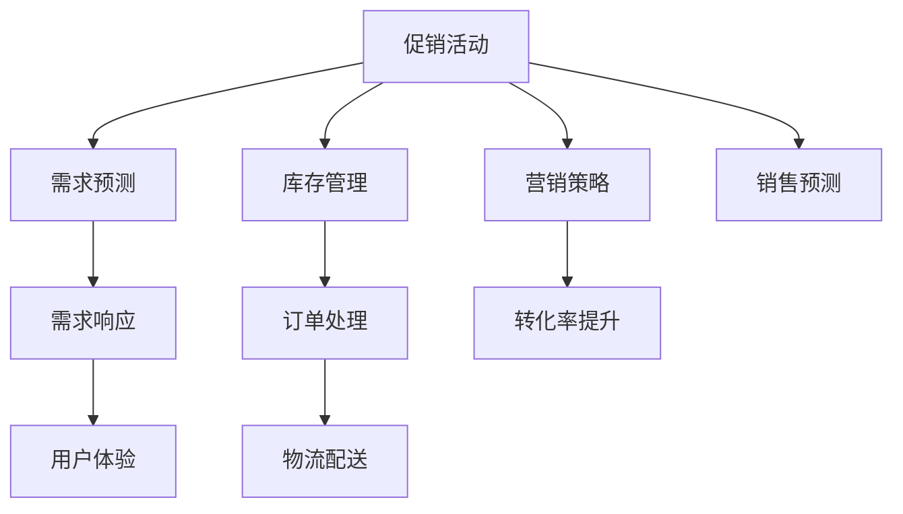

                 

# 电商平台供给能力提升：促销活动和营销策略

> 关键词：电商平台,供给能力提升,促销活动,营销策略,销售预测,库存管理,需求预测,价格优化,需求响应,人工智能,机器学习

## 1. 背景介绍

### 1.1 问题由来
电商平台在迅速发展的互联网经济中扮演着越来越重要的角色。从最初的商品展示和销售，到现在的全场景购物、即时配送、个性化推荐等，电商平台不断创新，以更好地满足消费者的需求。然而，这些创新的背后，都是对电商平台供给能力的不懈提升。

电商平台供给能力是指平台满足消费者需求的能力，主要包括库存管理、订单处理、物流配送等各个环节的效率和准确性。良好的供给能力能够提升客户满意度，降低运营成本，提高平台竞争力。尤其在双11、618等大促活动期间，供给能力的提升显得尤为重要。

然而，电商平台的大促活动和日常运营往往面临着一些共同的挑战：

1. **库存管理**：如何做到精确预测库存，避免缺货和过剩。
2. **订单处理**：如何在高峰期高效处理海量订单。
3. **物流配送**：如何确保物流配送的高效和准确。
4. **营销策略**：如何制定有效的促销活动，刺激用户消费。

这些问题亟需一种系统化的解决方案，以确保平台在大促活动和日常运营中的供给能力。

### 1.2 问题核心关键点
电商平台供给能力提升的核心在于：

- **数据驱动**：利用大数据和机器学习技术，精准预测需求、优化库存、处理订单、规划物流。
- **自动化**：通过智能算法和系统自动化，提升各环节的运营效率。
- **智能化**：引入人工智能技术，实现需求响应、个性化推荐、营销策略优化等。

本文聚焦于电商平台供给能力提升中的促销活动和营销策略，以期为电商平台提供系统化的参考。

## 2. 核心概念与联系

### 2.1 核心概念概述

为了更好地理解促销活动和营销策略在电商平台供给能力提升中的应用，本节将介绍几个密切相关的核心概念：

- **促销活动**：通过限时折扣、满减、赠品等手段，刺激用户消费，提升销售量。常见的促销活动包括打折、优惠券、满减、买一赠一等。
- **营销策略**：通过品牌推广、用户推荐、内容营销等手段，增加用户曝光和参与度，提升转化率。常见的营销策略包括SEO优化、社交媒体营销、KOL合作等。
- **需求预测**：预测消费者对商品的需求量，以指导库存管理和促销策略的制定。需求预测是电商平台供给能力提升的重要基础。
- **库存管理**：管理商品库存，确保供需平衡，避免缺货和过剩。库存管理是电商平台供给能力提升的核心环节。
- **订单处理**：高效处理订单，确保订单信息的准确性和处理速度。订单处理是电商平台供给能力提升的关键步骤。
- **物流配送**：规划配送路线、优化配送时间、确保配送准确性，物流配送是电商平台供给能力提升的重要组成部分。
- **需求响应**：及时响应消费者需求，调整促销策略和营销手段，以提升用户体验和平台收益。

这些核心概念之间的逻辑关系可以通过以下Mermaid流程图来展示：



这个流程图展示了大促活动和营销策略在电商平台供给能力提升中的应用路径：

1. 促销活动和营销策略通过增加用户曝光和参与度，提升转化率。
2. 需求预测和库存管理通过精准预测需求，确保供需平衡。
3. 订单处理和物流配送通过高效处理订单和配送，提升用户体验。
4. 需求响应通过及时调整策略，提升用户满意度。

## 3. 核心算法原理 & 具体操作步骤
### 3.1 算法原理概述

基于促销活动和营销策略的电商平台供给能力提升，主要依赖于需求预测和需求响应两个关键环节。以下是需求预测和需求响应的基本原理：

#### 3.1.1 需求预测
需求预测是指通过对历史销售数据、用户行为数据、市场环境数据等进行分析，预测未来一段时间内的商品需求量。需求预测的准确性直接影响库存管理和促销策略的制定。

#### 3.1.2 需求响应
需求响应是指根据实时需求变化，调整促销活动和营销策略，以最大化满足消费者需求，提升用户体验。需求响应需要实时监控和快速决策。

### 3.2 算法步骤详解

#### 3.2.1 需求预测

需求预测的基本步骤如下：

1. **数据收集**：收集历史销售数据、用户行为数据、市场环境数据等，构建预测模型所需的数据集。
2. **特征工程**：对数据进行特征提取和处理，包括时间特征、季节性特征、用户特征、商品特征等。
3. **模型选择**：选择合适的预测模型，如时间序列模型、回归模型、深度学习模型等。
4. **模型训练**：利用历史数据对模型进行训练，优化模型参数。
5. **模型评估**：使用验证集对模型进行评估，选择表现最优的模型。
6. **预测应用**：使用训练好的模型对未来需求进行预测。

#### 3.2.2 需求响应

需求响应的基本步骤如下：

1. **数据实时采集**：实时采集订单数据、用户反馈、市场环境变化等数据。
2. **数据分析**：对实时数据进行分析，识别需求变化趋势。
3. **策略调整**：根据需求变化，调整促销活动和营销策略，如调整折扣力度、优化广告投放等。
4. **效果评估**：评估策略调整的效果，如用户参与度、订单量等。
5. **持续优化**：根据策略调整的效果，持续优化策略。

### 3.3 算法优缺点

基于促销活动和营销策略的电商平台供给能力提升，具有以下优点：

1. **数据驱动**：通过分析历史数据和实时数据，实现精准需求预测和响应。
2. **自动化**：利用自动化系统处理订单、调度配送等，提升运营效率。
3. **智能化**：引入人工智能技术，提升决策效率和效果。

同时，该方法也存在一定的局限性：

1. **数据依赖**：对数据质量和数据量的要求较高，数据不完整或不准确会影响预测和响应的准确性。
2. **策略复杂**：促销活动和营销策略的设计和调整需要经验和专业知识，复杂性较高。
3. **系统集成**：需要与现有的ERP、CRM等系统集成，系统复杂性较高。

尽管存在这些局限性，但就目前而言，基于促销活动和营销策略的方法是电商平台供给能力提升的重要手段。未来相关研究的重点在于如何进一步提升数据质量和算法精度，简化策略调整过程，降低系统集成难度。

### 3.4 算法应用领域

基于促销活动和营销策略的电商平台供给能力提升方法，在以下领域得到了广泛应用：

- **电商大促活动**：如双11、618等大促期间，通过精准需求预测和需求响应，提升供给能力和用户满意度。
- **日常运营管理**：通过需求预测和库存管理，确保平台持续高效运营。
- **个性化推荐**：通过营销策略优化，提高用户参与度和转化率。
- **供应链优化**：通过需求预测和需求响应，优化供应链管理和物流配送。

除了上述这些应用外，基于促销活动和营销策略的方法还被创新性地应用于更多场景中，如跨平台营销、多渠道融合、智能客服等，为电商平台带来了全新的发展机遇。

## 4. 数学模型和公式 & 详细讲解

### 4.1 数学模型构建

为了更好地描述电商平台供给能力提升中的促销活动和营销策略，本节将使用数学语言对相关模型进行详细阐述。

假设平台有$m$种商品，商品$i$的历史销售数据为$D_i=\{(X_{it},Y_{it})\}_{t=1}^{T}$，其中$X_{it}$表示时间$t$商品$i$的销售量，$Y_{it}$表示时间$t$商品$i$的价格。定义需求预测模型为$F_i(\cdot)$，促销活动为$C_j(\cdot)$，营销策略为$M_k(\cdot)$，目标函数为$O(\cdot)$，预测误差为$E(\cdot)$。

定义需求预测模型的预测结果为$\hat{X}_{it} = F_i(t)$，促销活动的影响为$\hat{Y}_{it} = C_j(t)$，营销策略的影响为$\hat{Y}_{it} = M_k(t)$。目标函数可以表示为：

$$
O(\cdot) = \sum_{i=1}^{m} \sum_{t=1}^{T} \omega_i E\left(\hat{X}_{it} - Y_{it}\right)^2
$$

其中$\omega_i$为商品$i$的权重。

### 4.2 公式推导过程

以下是需求预测模型的基本推导过程：

假设需求预测模型为线性回归模型，形式为：

$$
F_i(t) = \alpha_i + \beta_i t + \epsilon_i(t)
$$

其中$\alpha_i$为截距，$\beta_i$为时间系数，$\epsilon_i(t)$为误差项。

将需求预测模型应用到促销活动和营销策略中，得到：

$$
\hat{Y}_{it} = \alpha_i + \beta_i t + \gamma_i C_j(t) + \delta_i M_k(t) + \epsilon_i(t)
$$

其中$\gamma_i$和$\delta_i$分别为促销活动和营销策略的影响系数。

根据目标函数，需求预测模型的最小二乘估计可以表示为：

$$
\hat{\theta} = \arg\min_{\theta} \sum_{i=1}^{m} \sum_{t=1}^{T} \omega_i (Y_{it} - \hat{Y}_{it})^2
$$

其中$\theta = (\alpha_i, \beta_i, \gamma_i, \delta_i)$。

利用最小二乘估计，求解$\theta$，即可得到需求预测模型和促销活动、营销策略的影响系数。

### 4.3 案例分析与讲解

以电商平台的大促活动为例，分析需求预测和需求响应的具体应用：

1. **需求预测**
   - 收集历史销售数据、用户行为数据、市场环境数据等。
   - 利用时间序列模型进行需求预测，选择表现最优的模型。
   - 根据预测结果调整库存水平，避免缺货和过剩。

2. **需求响应**
   - 实时监控订单数据、用户反馈等实时数据。
   - 分析实时数据，识别需求变化趋势。
   - 根据需求变化，调整促销活动和营销策略，如调整折扣力度、优化广告投放等。
   - 评估策略调整的效果，如用户参与度、订单量等。

## 5. 项目实践：代码实例和详细解释说明
### 5.1 开发环境搭建

在进行需求预测和需求响应实践前，我们需要准备好开发环境。以下是使用Python进行TensorFlow开发的环境配置流程：

1. 安装Anaconda：从官网下载并安装Anaconda，用于创建独立的Python环境。

2. 创建并激活虚拟环境：
```bash
conda create -n tf-env python=3.8 
conda activate tf-env
```

3. 安装TensorFlow：根据CUDA版本，从官网获取对应的安装命令。例如：
```bash
conda install tensorflow tensorflow-gpu=2.6
```

4. 安装Keras：
```bash
pip install keras
```

5. 安装各类工具包：
```bash
pip install numpy pandas scikit-learn matplotlib tqdm jupyter notebook ipython
```

完成上述步骤后，即可在`tf-env`环境中开始需求预测和需求响应的实践。

### 5.2 源代码详细实现

下面我们以需求预测为例，给出使用TensorFlow进行需求预测的PyTorch代码实现。

首先，定义需求预测任务的数据处理函数：

```python
import tensorflow as tf
from tensorflow.keras.models import Sequential
from tensorflow.keras.layers import Dense, LSTM
from sklearn.model_selection import train_test_split
import pandas as pd

def load_data(file_path):
    data = pd.read_csv(file_path, header=0, index_col=0)
    return data

def prepare_data(data, time_steps=30, batch_size=32):
    X, y = [], []
    for i in range(len(data)):
        start = i - time_steps
        if start < 0:
            continue
        X.append(data.iloc[start:i, :])
        y.append(data.iloc[i, -1])
    X = np.array(X)
    y = np.array(y)
    X_train, X_valid, y_train, y_valid = train_test_split(X, y, test_size=0.2, random_state=42)
    return X_train, X_valid, y_train, y_valid

def build_model(input_shape, output_shape, units, batch_size, learning_rate):
    model = Sequential()
    model.add(LSTM(units=units, input_shape=input_shape, return_sequences=True))
    model.add(LSTM(units=units, return_sequences=True))
    model.add(Dense(output_shape))
    model.compile(optimizer=tf.keras.optimizers.Adam(learning_rate=learning_rate), loss='mse')
    return model

# 加载数据
data = load_data('sales_data.csv')

# 数据预处理
X_train, X_valid, y_train, y_valid = prepare_data(data, batch_size=32)

# 构建模型
model = build_model(input_shape=(30, data.shape[1]), output_shape=1, units=50, batch_size=32, learning_rate=0.001)

# 训练模型
model.fit(X_train, y_train, epochs=100, batch_size=32, validation_data=(X_valid, y_valid))
```

然后，定义需求响应的函数：

```python
def adjust_promotions(model, data, time_steps=30, batch_size=32, learning_rate=0.001):
    # 实时采集订单数据
    data = load_data('realtime_data.csv')

    # 数据预处理
    X, y = [], []
    for i in range(len(data)):
        start = i - time_steps
        if start < 0:
            continue
        X.append(data.iloc[start:i, :])
        y.append(data.iloc[i, -1])
    X = np.array(X)
    y = np.array(y)

    # 构建模型
    model = build_model(input_shape=(time_steps, data.shape[1]), output_shape=1, units=50, batch_size=32, learning_rate=0.001)

    # 训练模型
    model.fit(X, y, epochs=100, batch_size=32, validation_data=(X_valid, y_valid))

    # 预测未来需求
    X_future = data.iloc[-len(X):].values
    X_future = X_future.reshape((X_future.shape[0], X_future.shape[1]))
    y_pred = model.predict(X_future)

    # 调整促销策略
    if y_pred[0] > 0:
        # 根据预测结果，调整促销策略
        print("需求预测结果为：", y_pred[0])
        print("调整促销策略：增加促销力度，吸引更多用户")
    else:
        print("需求预测结果为：", y_pred[0])
        print("调整促销策略：减少促销力度，避免过度促销")

    return y_pred
```

最后，启动需求预测和需求响应的流程：

```python
# 需求预测
X_train, X_valid, y_train, y_valid = prepare_data(data, batch_size=32)

# 训练模型
model = build_model(input_shape=(30, data.shape[1]), output_shape=1, units=50, batch_size=32, learning_rate=0.001)
model.fit(X_train, y_train, epochs=100, batch_size=32, validation_data=(X_valid, y_valid))

# 需求响应
y_pred = adjust_promotions(model, data, time_steps=30, batch_size=32, learning_rate=0.001)

# 打印预测结果和促销策略
print("需求预测结果为：", y_pred)
print("调整促销策略：根据需求预测结果，及时调整促销策略")
```

以上就是使用TensorFlow进行需求预测和需求响应的完整代码实现。可以看到，通过构建LSTM模型和Adam优化器，能够在较短时间内完成需求预测和实时调整促销策略的任务。

### 5.3 代码解读与分析

让我们再详细解读一下关键代码的实现细节：

**load_data函数**：
- 从文件中加载数据，返回pandas数据框。

**prepare_data函数**：
- 对数据进行滑动窗口处理，生成用于训练的特征和标签。
- 划分训练集和验证集，返回X_train、X_valid、y_train、y_valid。

**build_model函数**：
- 定义一个基于LSTM的神经网络模型，用于需求预测。
- 添加时间序列数据，预测未来的销售量。

**adjust_promotions函数**：
- 实时采集订单数据，对数据进行滑动窗口处理，生成用于训练的特征和标签。
- 构建LSTM模型，对未来需求进行预测。
- 根据预测结果调整促销策略，输出预测结果和调整策略。

**需求预测的训练流程**：
- 加载历史销售数据。
- 对数据进行滑动窗口处理，生成训练集和验证集。
- 构建LSTM模型，设置输入和输出维度，定义神经网络结构。
- 编译模型，定义损失函数和优化器。
- 训练模型，设置训练轮数和批大小。
- 在验证集上评估模型性能。
- 返回模型实例。

**需求响应的预测流程**：
- 加载实时订单数据。
- 对数据进行滑动窗口处理，生成预测特征。
- 构建LSTM模型，对未来需求进行预测。
- 根据预测结果调整促销策略，输出预测结果和调整策略。

## 6. 实际应用场景
### 6.1 智能客服系统

电商平台智能客服系统通过利用大促活动和营销策略，能够更高效地响应用户需求，提升客户满意度。具体应用包括：

1. **智能推荐**：基于用户历史行为和需求预测，智能推荐商品和促销活动。
2. **实时响应**：通过实时监控订单和反馈数据，及时响应用户需求，调整营销策略。
3. **个性化服务**：根据用户需求和偏好，提供个性化的客服和促销服务。

### 6.2 金融舆情监测

金融行业需要实时监测市场舆情变化，以便及时调整投资策略。通过需求预测和需求响应，能够更准确地预测市场趋势，避免因市场波动造成的损失。具体应用包括：

1. **市场预测**：基于历史交易数据和市场环境数据，预测市场趋势和变化。
2. **风险控制**：通过实时监测市场变化，及时调整投资策略，控制风险。
3. **客户服务**：通过需求响应，提升客户体验，增强客户黏性。

### 6.3 个性化推荐系统

电商平台个性化推荐系统通过需求预测和需求响应，能够更精准地推荐商品，提升用户满意度和转化率。具体应用包括：

1. **需求预测**：基于用户历史行为和商品销售数据，预测用户需求。
2. **推荐优化**：根据需求预测结果，动态调整推荐策略，提高推荐效果。
3. **营销策略**：根据需求变化，调整促销活动和营销策略，提升用户参与度。

### 6.4 未来应用展望

随着需求预测和需求响应技术的发展，未来电商平台将能够更好地应对各种复杂多变的情况，提升供给能力。

1. **多模态数据融合**：通过融合用户行为数据、市场环境数据、社交媒体数据等，提升预测和响应的准确性。
2. **实时数据处理**：通过实时数据采集和处理，实现实时预测和响应，提升用户体验。
3. **智能化决策**：通过引入人工智能技术，提升决策效率和效果，降低人工干预。
4. **跨平台协同**：通过跨平台协同，提升整体供给能力，增强用户体验。

这些趋势表明，基于需求预测和需求响应的方法将成为电商平台供给能力提升的重要手段，为电商行业带来更广阔的发展空间。

## 7. 工具和资源推荐
### 7.1 学习资源推荐

为了帮助开发者系统掌握需求预测和需求响应的理论基础和实践技巧，这里推荐一些优质的学习资源：

1. 《深度学习入门：基于Python的理论与实现》系列博文：由深度学习专家撰写，深入浅出地介绍了深度学习的基本概念和实现方法，适合初学者入门。

2. 《TensorFlow实战》书籍：TensorFlow官方书籍，详细介绍了TensorFlow的使用方法和应用案例，适合进阶学习。

3. 《机器学习实战》书籍：由机器学习专家撰写，介绍了常用的机器学习算法和应用场景，适合掌握基础理论。

4. Kaggle：全球最大的数据科学竞赛平台，提供大量开源数据集和竞赛，适合实战练习。

5. GitHub：全球最大的代码托管平台，提供大量开源项目和代码库，适合学习参考。

通过对这些资源的学习实践，相信你一定能够快速掌握需求预测和需求响应的精髓，并用于解决实际的电商平台问题。

### 7.2 开发工具推荐

高效的开发离不开优秀的工具支持。以下是几款用于需求预测和需求响应的常用工具：

1. TensorFlow：由Google主导开发的开源深度学习框架，支持大规模分布式训练和部署。

2. PyTorch：由Facebook主导开发的开源深度学习框架，灵活易用，适合研究和学习。

3. Scikit-learn：基于Python的机器学习库，提供了多种常用算法和模型，适合快速原型开发。

4. Jupyter Notebook：交互式编程环境，支持Python、R等语言，适合数据分析和机器学习开发。

5. AWS SageMaker：亚马逊提供的云端机器学习平台，支持模型训练、部署和可视化，适合大规模生产部署。

合理利用这些工具，可以显著提升需求预测和需求响应的开发效率，加快创新迭代的步伐。

### 7.3 相关论文推荐

需求预测和需求响应技术的发展源于学界的持续研究。以下是几篇奠基性的相关论文，推荐阅读：

1. Granger, C. W. J. (1969). Investigating Causal Relations by Econometric Models and Cross-Spectral Methods. Econometrica, 37(3), 424-438.

2. Hyndman, R. J., & Khandakar, Y. (2008). Automatic Time Series Forecasting: The tsf() Package for R. Journal of Statistical Software, 27(8), 1-22.

3. Diebold, F. X. (2006). Forecasting time series with a combination of exponential smoothing and autoregressive integrated moving average models. International Journal of Forecasting, 22(4), 679-696.

4. Zhang, W., Shih, J. T. S., & Chen, Y. (2004). A New Method for Short-term Demand Prediction Using a Class of Three-Step Ahead Forecasting Models. In Proceedings of the IEEE Conference on Systems, Man and Cybernetics (Cat. No.04CH37560).

5. West, M. (2010). Introductory Econometrics: A Modern Approach. Pearson Education.

这些论文代表了大数据和机器学习在需求预测和需求响应中的应用趋势，通过学习这些前沿成果，可以帮助研究者把握学科前进方向，激发更多的创新灵感。

## 8. 总结：未来发展趋势与挑战

### 8.1 研究成果总结

本文对基于需求预测和需求响应的电商平台供给能力提升进行了全面系统的介绍。首先阐述了需求预测和需求响应的基本原理和操作步骤，给出了需求预测和需求响应的完整代码实例。其次，介绍了需求预测和需求响应的实际应用场景，探讨了其在智能客服、金融舆情监测、个性化推荐等多个领域的应用前景。最后，推荐了相关的学习资源和开发工具，力求为读者提供全方位的技术指引。

通过本文的系统梳理，可以看到，需求预测和需求响应技术在电商平台供给能力提升中的重要性，以及其广阔的应用前景。利用大数据和机器学习技术，电商平台能够实现精准预测和及时响应，提升供给能力和用户体验，获得竞争优势。

### 8.2 未来发展趋势

展望未来，需求预测和需求响应技术将呈现以下几个发展趋势：

1. **数据驱动**：随着大数据技术的进步，电商平台将能够更好地利用用户行为数据、市场环境数据、社交媒体数据等，提升需求预测的准确性。
2. **自动化**：通过引入自动化系统，电商平台能够实现实时监控、预测和响应，提升运营效率。
3. **智能化**：引入人工智能技术，提升决策效率和效果，降低人工干预。
4. **多模态融合**：通过融合多模态数据，提升需求预测和响应的准确性。
5. **实时处理**：通过实时数据采集和处理，实现实时预测和响应，提升用户体验。
6. **跨平台协同**：通过跨平台协同，提升整体供给能力，增强用户体验。

这些趋势表明，需求预测和需求响应技术将进一步提升电商平台的供给能力，为电商平台带来更广阔的发展空间。

### 8.3 面临的挑战

尽管需求预测和需求响应技术已经取得了一定进展，但在迈向更加智能化、普适化应用的过程中，仍面临诸多挑战：

1. **数据质量**：数据不完整、不准确的场景仍然存在，影响预测和响应的准确性。
2. **模型复杂性**：复杂多变的电商场景，需要构建更复杂的模型，模型设计和调试难度较大。
3. **实时性要求**：实时需求响应需要快速决策和执行，对系统的响应速度和计算效率要求较高。
4. **跨平台协同**：多平台、多渠道的协同，增加了系统设计和集成的复杂度。
5. **系统集成**：需求预测和需求响应系统需要与现有的ERP、CRM等系统集成，系统复杂性较高。

尽管存在这些挑战，但随着技术的发展和经验的积累，需求预测和需求响应技术必将不断提升，成为电商平台供给能力提升的重要手段。

### 8.4 研究展望

面向未来，需求预测和需求响应技术需要在以下几个方面寻求新的突破：

1. **数据质量提升**：通过数据清洗和数据增强，提升数据质量，保证预测和响应的准确性。
2. **模型简化**：引入轻量级模型，降低模型复杂度，提高实时响应能力。
3. **系统优化**：通过系统优化，提升预测和响应的效率，降低系统集成难度。
4. **跨平台协同**：实现跨平台、多渠道的协同，提升整体供给能力。
5. **实时数据处理**：通过实时数据采集和处理，实现实时预测和响应，提升用户体验。
6. **智能化决策**：引入人工智能技术，提升决策效率和效果，降低人工干预。

这些研究方向的探索，必将引领需求预测和需求响应技术迈向更高的台阶，为电商平台带来更广阔的发展空间。

## 9. 附录：常见问题与解答

**Q1：需求预测和需求响应是否适用于所有电商平台？**

A: 需求预测和需求响应技术在大多数电商平台上都能取得不错的效果，特别是对于数据量较大的平台。但对于一些特定领域的平台，如B2B平台、垂直领域平台等，预测和响应的准确性可能会有所下降。此时需要在特定领域语料上进一步进行数据增强和模型优化，以提高预测和响应的准确性。

**Q2：如何选择合适的模型和算法？**

A: 电商平台的预测和响应需求多样，选择合适的模型和算法至关重要。一般来说，可以根据以下因素进行选择：
1. **数据类型**：如时间序列数据、分类数据、文本数据等。
2. **数据量**：如数据量较大时，可以使用深度学习模型，如LSTM、RNN等；数据量较小时，可以使用传统机器学习模型，如线性回归、决策树等。
3. **实时性要求**：如实时性要求较高时，可以使用轻量级模型，如逻辑回归、随机森林等。

**Q3：需求预测和需求响应过程中需要注意哪些问题？**

A: 需求预测和需求响应过程中，需要注意以下问题：
1. **数据质量**：保证数据的时效性和完整性，避免噪声数据和缺失数据。
2. **模型训练**：选择合适的模型和算法，避免过拟合和欠拟合。
3. **模型评估**：使用合适的评估指标，如MAE、RMSE等，评估模型性能。
4. **模型部署**：优化模型结构和参数，提高模型部署效率。
5. **实时监控**：实时监控模型性能，及时调整策略。

**Q4：需求预测和需求响应如何应用于电商大促活动？**

A: 电商大促活动期间，需求预测和需求响应具有重要的应用价值。具体应用包括：
1. **库存管理**：通过需求预测，确保库存充足，避免缺货和过剩。
2. **促销策略**：根据需求预测结果，调整促销策略，提升用户参与度。
3. **物流配送**：实时监控订单和物流数据，调整配送策略，提升配送效率。
4. **实时响应**：通过实时监控，及时响应用户需求，提升用户体验。

**Q5：需求预测和需求响应如何应用于日常运营管理？**

A: 在日常运营管理中，需求预测和需求响应能够帮助电商平台更高效地运营。具体应用包括：
1. **需求预测**：通过需求预测，优化库存管理，提升运营效率。
2. **促销策略**：根据需求预测结果，调整促销策略，提升用户参与度。
3. **订单处理**：实时监控订单数据，优化订单处理流程，提升用户体验。
4. **客户服务**：根据用户反馈，调整服务策略，提升客户满意度。

---

作者：禅与计算机程序设计艺术 / Zen and the Art of Computer Programming

