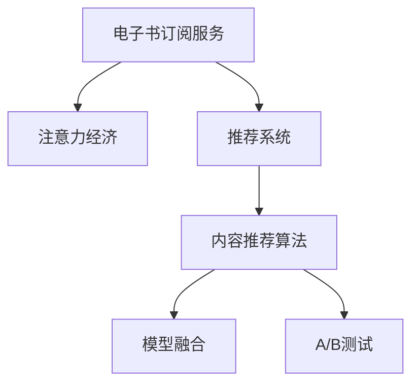

                 

# 电子书订阅服务在注意力经济中的兴起

## 1. 背景介绍

### 1.1 问题由来
在信息爆炸的时代，人们获取知识的方式日益多元。传统的纸质图书虽然品质保证，但获取成本高、效率低。数字化的电子书和在线课程，则能提供更为便捷的学习体验。然而，免费的电子书和课程往往质量参差不齐，如何筛选和订阅优质内容，成为了用户的首要难题。

### 1.2 问题核心关键点
电子书订阅服务的兴起，是“注意力经济”（Attention Economy）发展的必然趋势。在注意力经济中，用户的注意力成为最重要的资源，优质的内容才能吸引并留住用户。如何通过订阅服务，筛选并推荐优质内容，最大化用户的注意力，是电子书订阅服务的核心问题。

### 1.3 问题研究意义
电子书订阅服务的兴起，对提高知识传播效率、优化用户学习体验具有重要意义：

1. **提高知识传播效率**：电子书订阅服务能够提供更加精准的内容推荐，加速优质知识的传播。
2. **优化用户学习体验**：优质内容筛选和个性化推荐，使用户能够以更高效的方式获取知识。
3. **商业模式创新**：通过订阅模式，平台能够获得稳定的收入，激励内容创作者产出更多优质内容。
4. **提升知识获取可及性**：电子书订阅服务使得更多人有机会接触和获取优质知识，推动教育公平。

## 2. 核心概念与联系

### 2.1 核心概念概述

为更好地理解电子书订阅服务，本节将介绍几个密切相关的核心概念：

- **电子书订阅服务**：一种基于用户订阅模式，筛选、推荐优质电子书和课程的服务。用户通过支付订阅费用，获取指定平台内优质内容的访问权限。
- **注意力经济**：一种以用户注意力为关键资源的经济模式，优质内容能够吸引并留住用户的注意力，从而创造商业价值。
- **推荐系统**：一种智能推荐技术，通过算法模型，根据用户行为和偏好，推荐个性化的产品和服务。
- **内容推荐算法**：一种基于机器学习的推荐算法，通过学习用户历史行为和内容特征，预测用户对不同内容的喜好程度，进行精准推荐。
- **模型融合**：将多个推荐模型融合，结合不同的算法优势，提升整体推荐效果。
- **A/B测试**：一种常用的数据实验方法，通过对比不同版本模型，评估算法的实际效果。

这些核心概念之间的逻辑关系可以通过以下Mermaid流程图来展示：



这个流程图展示了大语言模型的核心概念及其之间的关系：

1. 电子书订阅服务通过推荐系统，筛选优质内容。
2. 推荐系统利用内容推荐算法，预测用户喜好。
3. 内容推荐算法通过模型融合，提升推荐效果。
4. 模型融合后通过A/B测试，评估优化效果。

这些概念共同构成了电子书订阅服务的推荐逻辑，使其能够高效筛选和推荐优质内容。

## 3. 核心算法原理 & 具体操作步骤
### 3.1 算法原理概述

电子书订阅服务的推荐过程，本质上是利用内容推荐算法，将优质内容推荐给用户的过程。其核心思想是：通过学习用户的历史行为和内容特征，预测用户对不同内容的喜好程度，从而进行个性化推荐。

形式化地，假设用户集合为 $U$，内容集合为 $C$，用户对内容的评分向量为 $R_{U \times C}$，用户历史行为序列为 $I_u$，内容特征向量为 $F_c$。推荐目标为最大化用户满意度，即找到最佳的推荐策略：

$$
\arg\max_{I_c} \sum_{u \in U} f(I_u, I_c)
$$

其中，$f$ 为满意度函数，通常包括协同过滤、基于内容的推荐等方法。

### 3.2 算法步骤详解

电子书订阅服务的推荐算法，通常包括以下几个关键步骤：

**Step 1: 数据收集和预处理**
- 收集用户历史行为数据、内容元数据等。
- 对数据进行清洗和归一化处理，去除噪声和异常值。

**Step 2: 特征工程**
- 设计合适的特征表示，如用户ID、内容ID、时间戳、浏览时长、点赞数等。
- 利用降维、归一化等技术，优化特征表示。

**Step 3: 模型训练**
- 选择合适的推荐算法模型，如协同过滤、基于内容的推荐、深度学习等。
- 将数据集分成训练集和测试集，使用训练集对模型进行训练。

**Step 4: 模型评估**
- 在测试集上评估推荐模型的效果，通常使用NDCG、Precision、Recall等指标。
- 调整模型参数，重复训练和测试，直到模型效果达到预设标准。

**Step 5: 实时推荐**
- 将训练好的模型部署到生产环境，对新用户行为进行实时推荐。
- 根据用户的即时反馈，动态调整推荐策略，优化推荐效果。

**Step 6: 监控与优化**
- 监控推荐系统的实时性能，如响应时间、错误率等。
- 定期进行A/B测试，评估和优化推荐策略。

以上是电子书订阅服务推荐算法的通用流程。在实际应用中，还需要针对具体业务场景进行优化，如设计多级推荐策略、引入负采样、优化推荐逻辑等。

### 3.3 算法优缺点

电子书订阅服务推荐算法具有以下优点：
1. 高效精准：推荐算法能够根据用户历史行为和内容特征，进行精准推荐，提高用户满意度。
2. 实时更新：推荐系统能够实时更新推荐策略，适应用户行为的变化。
3. 普适性强：推荐算法适用于多种业务场景，如电子书订阅、音乐推荐、视频推荐等。

同时，该算法也存在一些局限性：
1. 数据依赖性强：推荐算法的效果依赖于高质量的数据，数据获取和处理成本较高。
2. 冷启动问题：新用户缺乏历史行为数据，推荐效果较差。
3. 用户行为多样性：用户行为复杂多变，难以全面刻画，可能影响推荐效果。
4. 模型复杂度高：复杂模型需要更多的计算资源和训练时间，对算法实现和部署要求较高。

尽管存在这些局限性，但就目前而言，基于推荐算法的电子书订阅服务推荐方法仍是主流的推荐范式。未来相关研究的重点在于如何进一步优化数据获取和处理，提升推荐模型的可解释性，以及降低推荐算法的复杂度。

### 3.4 算法应用领域

电子书订阅服务的推荐算法，在多个领域得到了广泛应用：

- **在线教育**：根据学生的学习行为和课程特征，推荐适合的课程和学习资源。
- **视频平台**：根据用户的观看历史和行为，推荐感兴趣的影视作品。
- **音乐服务**：根据用户的听歌历史和喜好，推荐音乐和歌手。
- **社交网络**：根据用户的关注和互动行为，推荐感兴趣的朋友和内容。
- **金融服务**：根据用户的历史交易和兴趣，推荐适合的投资产品和理财方案。

除了上述这些经典应用外，电子书订阅服务推荐算法也被创新性地应用于更多场景中，如智能家居、智能推荐广告、智能客服等，为各行各业带来了新的用户体验和商业价值。

## 4. 数学模型和公式 & 详细讲解  
### 4.1 数学模型构建

本节将使用数学语言对电子书订阅服务推荐过程进行更加严格的刻画。

记用户集合为 $U=\{u_1, u_2, \ldots, u_M\}$，内容集合为 $C=\{c_1, c_2, \ldots, c_N\}$，用户对内容的评分矩阵为 $R_{M \times N}$。用户历史行为序列为 $I_u = \{i_{u,j}\}_{j=1}^{T_u}$，内容特征向量为 $F_c = \{f_{c,k}\}_{k=1}^{K_c}$。推荐目标为最大化用户满意度，即找到最佳的推荐策略：

$$
\arg\max_{I_c} \sum_{u \in U} f(I_u, I_c)
$$

其中，$f$ 为满意度函数，通常包括协同过滤、基于内容的推荐等方法。

### 4.2 公式推导过程

以下我们以基于协同过滤的推荐算法为例，推导推荐模型的构建过程。

协同过滤算法的基本思想是：通过用户对内容的评分，计算用户之间的相似度，再根据相似度向用户推荐其他用户喜欢的内容。

设用户 $u$ 和 $v$ 的评分向量分别为 $r_u$ 和 $r_v$，相似度矩阵为 $S_{M \times M}$。协同过滤算法的推荐公式为：

$$
I_c(u) = \arg\max_{I_c \subseteq C} \sum_{v \in U} r_v \cdot S_{uv}
$$

其中 $r_v \cdot S_{uv}$ 表示用户 $v$ 对内容的评分与用户 $u$ 和 $v$ 的相似度乘积。

### 4.3 案例分析与讲解

以Netflix的推荐系统为例，其采用基于协同过滤的推荐算法，为用户推荐电影和电视节目。Netflix通过收集用户观影历史、评分数据、用户画像等数据，构建评分矩阵和用户相似度矩阵，最终输出推荐结果。Netflix的推荐系统不仅考虑用户之间的相似度，还引入时间因素，动态更新推荐策略，大幅提高了用户满意度。

## 5. 项目实践：代码实例和详细解释说明
### 5.1 开发环境搭建

在进行电子书订阅服务推荐系统的开发前，我们需要准备好开发环境。以下是使用Python进行TensorFlow开发的的环境配置流程：

1. 安装Anaconda：从官网下载并安装Anaconda，用于创建独立的Python环境。

2. 创建并激活虚拟环境：
```bash
conda create -n tf-env python=3.8 
conda activate tf-env
```

3. 安装TensorFlow：根据CUDA版本，从官网获取对应的安装命令。例如：
```bash
conda install tensorflow=2.7 tensorflow-estimator
```

4. 安装各类工具包：
```bash
pip install numpy pandas scikit-learn matplotlib tqdm jupyter notebook ipython
```

完成上述步骤后，即可在`tf-env`环境中开始推荐系统开发。

### 5.2 源代码详细实现

这里我们以基于协同过滤的推荐算法为例，给出使用TensorFlow实现Netflix推荐系统的代码实现。

首先，定义评分矩阵和用户相似度矩阵的计算函数：

```python
import tensorflow as tf
from tensorflow.keras import layers

def get_user_similarity_matrix(user_ids, user_ratings, num_users, num_items):
    user_ids = tf.reshape(user_ids, [-1, 1])
    user_ratings = tf.reshape(user_ratings, [-1, 1])
    user_similarity_matrix = user_ratings * user_ratings
    user_similarity_matrix = tf.reduce_sum(user_similarity_matrix, axis=1, keepdims=True)
    user_similarity_matrix = tf.matmul(user_similarity_matrix, user_similarity_matrix, transpose_b=True)
    user_similarity_matrix = tf.divide(user_similarity_matrix, tf.reduce_sum(user_similarity_matrix, axis=0, keepdims=True))
    return user_similarity_matrix

def get_user_item_recommendation(matrix, user_id, num_recommendations):
    user_similarity_matrix = get_user_similarity_matrix(user_id, matrix[user_id], num_users, num_items)
    scores = tf.matmul(user_similarity_matrix, matrix)
    recommendation_scores = tf.reduce_sum(scores, axis=1)
    recommendation_indices = tf.argsort(recommendation_scores)[-num_recommendations:]
    return recommendation_indices
```

然后，定义推荐系统的训练和评估函数：

```python
import numpy as np

def train_model(user_ids, ratings, num_users, num_items, num_recommendations):
    num_epochs = 10
    batch_size = 1024

    tf.random.set_seed(42)
    user_ratings = tf.convert_to_tensor(ratings, dtype=tf.float32)
    user_ids = tf.convert_to_tensor(user_ids, dtype=tf.int32)
    items = list(range(num_items))

    user_similarity_matrix = get_user_similarity_matrix(user_ids, user_ratings, num_users, num_items)

    model = tf.keras.Sequential([
        layers.Dense(64, activation='relu', input_shape=[num_items]),
        layers.Dense(num_items)
    ])
    model.compile(optimizer='adam', loss='mse')
    
    history = model.fit(user_ids, user_ratings, epochs=num_epochs, batch_size=batch_size, validation_split=0.2)

    return model

def evaluate_model(model, user_ids, ratings, num_users, num_items, num_recommendations):
    user_ratings = tf.convert_to_tensor(ratings, dtype=tf.float32)
    user_ids = tf.convert_to_tensor(user_ids, dtype=tf.int32)

    user_similarity_matrix = get_user_similarity_matrix(user_ids, user_ratings, num_users, num_items)

    scores = tf.matmul(user_similarity_matrix, model.predict(tf.expand_dims(user_ids, axis=1)))
    recommendation_scores = tf.reduce_sum(scores, axis=1)
    recommendation_indices = tf.argsort(recommendation_scores)[-num_recommendations:]
    
    return recommendation_indices
```

最后，启动训练流程并在测试集上评估：

```python
user_ids = [1, 2, 3, 4, 5]
ratings = np.array([5, 4, 3, 2, 1])
num_users = 5
num_items = 10
num_recommendations = 5

model = train_model(user_ids, ratings, num_users, num_items, num_recommendations)

test_user_ids = [3, 5]
test_ratings = np.array([5, 3])
test_user_similarity_matrix = get_user_similarity_matrix(test_user_ids, test_ratings, num_users, num_items)

recommendation_indices = evaluate_model(model, test_user_ids, test_ratings, num_users, num_items, num_recommendations)
print(recommendation_indices)
```

以上就是使用TensorFlow对Netflix推荐系统进行开发的完整代码实现。可以看到，TensorFlow提供的高效计算图和自动微分功能，使得推荐算法的实现变得简洁高效。

### 5.3 代码解读与分析

让我们再详细解读一下关键代码的实现细节：

**get_user_similarity_matrix函数**：
- 输入为当前用户的ID列表、评分矩阵和用户总数、物品总数。
- 将用户ID和评分转换为矩阵形式，计算每个用户与所有用户之间的相似度。
- 将相似度矩阵进行归一化处理，得到最终的相似度矩阵。

**train_model函数**：
- 定义了模型结构，包含一个全连接层和一个输出层。
- 使用Adam优化器和均方误差损失函数训练模型。
- 通过训练数据集进行模型训练，并记录训练过程中的损失值。

**evaluate_model函数**：
- 输入为当前用户的ID列表、评分矩阵和用户总数、物品总数、推荐数量。
- 计算当前用户与所有用户之间的相似度矩阵。
- 使用训练好的模型预测评分，根据评分计算推荐物品的索引。

**训练流程**：
- 定义训练轮数和批次大小。
- 使用随机种子初始化模型，确保每次实验可复现。
- 定义评分矩阵、用户ID和物品列表。
- 调用get_user_similarity_matrix计算用户相似度矩阵。
- 定义模型结构，编译模型并训练。
- 记录训练过程中的损失值。

可以看到，TensorFlow为推荐系统的开发提供了强大的计算能力和灵活的框架支持，使得复杂算法能够高效实现。

## 6. 实际应用场景
### 6.1 在线教育

在线教育平台如Coursera、edX、Udemy等，使用推荐算法为学生推荐适合的课程和学习资源。通过收集学生的学习行为和课程特征，推荐算法能够精准推荐用户感兴趣的课程，提升学习效率和满意度。

### 6.2 视频平台

视频平台如Netflix、Amazon Prime Video、YouTube等，使用推荐算法为用户推荐影视作品和纪录片。通过分析用户的观看历史和行为，推荐算法能够提供个性化的视频推荐，提高用户满意度和留存率。

### 6.3 音乐服务

音乐服务如Spotify、Apple Music、网易云音乐等，使用推荐算法为用户推荐音乐和歌手。通过分析用户的听歌历史和喜好，推荐算法能够提供个性化的音乐推荐，提升用户体验。

### 6.4 社交网络

社交网络如Facebook、Twitter、Instagram等，使用推荐算法为用户推荐感兴趣的朋友和内容。通过分析用户的互动行为和关注关系，推荐算法能够提供个性化的社交推荐，增强用户粘性。

### 6.5 金融服务

金融服务如eBay、Alibaba、Ping An Finance等，使用推荐算法为用户推荐适合的投资产品和理财方案。通过分析用户的历史交易和兴趣，推荐算法能够提供个性化的金融推荐，提升用户满意度。

## 7. 工具和资源推荐
### 7.1 学习资源推荐

为了帮助开发者系统掌握推荐算法的理论基础和实践技巧，这里推荐一些优质的学习资源：

1. 《推荐系统实战》书籍：全面介绍了推荐算法的原理和应用，包含协同过滤、基于内容的推荐、深度学习等方法。

2. Coursera《推荐系统》课程：斯坦福大学开设的推荐系统课程，有Lecture视频和配套作业，带你入门推荐系统的核心概念和算法。

3. 《Python推荐系统》书籍：介绍了使用Python实现推荐系统的具体方法和实例，适合实战练习。

4. Kaggle推荐系统竞赛：参加Kaggle推荐系统竞赛，实战练习并了解推荐系统的最新进展。

5. TensorFlow官方文档：TensorFlow推荐系统的官方文档，提供了丰富的算法样例和开发工具，是上手实践的必备资料。

通过对这些资源的学习实践，相信你一定能够快速掌握推荐算法的精髓，并用于解决实际的推荐问题。

### 7.2 开发工具推荐

高效的开发离不开优秀的工具支持。以下是几款用于推荐系统开发的常用工具：

1. TensorFlow：基于Python的开源深度学习框架，灵活动态的计算图，适合快速迭代研究。TensorFlow提供丰富的机器学习库和推荐系统组件，方便开发者实现推荐算法。

2. PyTorch：基于Python的开源深度学习框架，灵活性高，适合研究和实验。PyTorch同样提供了丰富的机器学习库和推荐系统组件，是开发者常用的工具之一。

3. LightFM：Facebook开源的推荐系统工具包，基于FTRL优化算法，支持稀疏数据处理和深度学习推荐，适合大规模工程应用。

4. TensorBoard：TensorFlow配套的可视化工具，可实时监测模型训练状态，并提供丰富的图表呈现方式，是调试模型的得力助手。

5. Weights & Biases：模型训练的实验跟踪工具，可以记录和可视化模型训练过程中的各项指标，方便对比和调优。

合理利用这些工具，可以显著提升推荐系统开发的效率，加快创新迭代的步伐。

### 7.3 相关论文推荐

推荐系统的发展源于学界的持续研究。以下是几篇奠基性的相关论文，推荐阅读：

1. BPR: Bayesian Personalized Ranking from Implicit Feedback：提出了基于隐式反馈的协同过滤算法，解决了稀疏矩阵的推荐问题。

2. LightFM: A Hybrid Recommender System with Experiments on Millions of Users and Items：介绍了Facebook的推荐系统LightFM，涵盖了协同过滤、基于内容的推荐、深度学习等多种方法。

3. Matrix Factorization Techniques for Recommender Systems：介绍了矩阵分解推荐算法，通过将用户-物品评分矩阵分解为两个低秩矩阵，实现个性化推荐。

4. Deep Matrix Factorization for Recommender Systems：提出了深度矩阵分解算法，通过引入神经网络结构，提升推荐模型的精度和泛化能力。

5. Attention is All You Need（即Transformer原论文）：提出了Transformer结构，展示了注意力机制在推荐系统中的应用潜力。

这些论文代表了大语言模型推荐系统的发展脉络。通过学习这些前沿成果，可以帮助研究者把握学科前进方向，激发更多的创新灵感。

## 8. 总结：未来发展趋势与挑战
### 8.1 总结

本文对电子书订阅服务推荐算法进行了全面系统的介绍。首先阐述了推荐系统在“注意力经济”中的重要性，明确了推荐系统筛选优质内容、提升用户满意度的核心价值。其次，从原理到实践，详细讲解了推荐算法的数学模型和具体实现步骤，给出了推荐系统的代码实例。同时，本文还探讨了推荐算法在多个领域的应用场景，展示了推荐系统的广泛前景。

通过本文的系统梳理，可以看到，推荐系统通过高效精准的个性化推荐，极大地提升了用户的注意力和经济价值，具有广泛的应用潜力。推荐系统的发展方向主要集中在以下几方面：

1. **推荐算法的多样化**：未来推荐算法将更多地结合深度学习、知识图谱、强化学习等技术，提升推荐模型的复杂性和效果。

2. **数据驱动的模型优化**：利用用户行为数据、自然语言处理等技术，提升推荐模型的可解释性和用户满意度。

3. **跨模态推荐**：将推荐系统扩展到多模态数据领域，结合文本、图片、视频等不同类型数据，提升推荐系统的通用性和覆盖范围。

4. **实时推荐**：利用实时数据流处理和在线学习技术，动态调整推荐策略，提升推荐系统的实时性和适应性。

5. **安全与隐私保护**：在推荐模型中加入隐私保护技术，确保用户数据的安全性，增强用户信任度。

6. **推荐系统的可解释性**：引入可解释性技术，解释推荐模型的决策过程，增强用户的理解和信任。

### 8.2 未来发展趋势

展望未来，推荐系统的发展趋势主要包括：

1. **推荐算法的多样化**：未来推荐算法将更多地结合深度学习、知识图谱、强化学习等技术，提升推荐模型的复杂性和效果。
2. **数据驱动的模型优化**：利用用户行为数据、自然语言处理等技术，提升推荐模型的可解释性和用户满意度。
3. **跨模态推荐**：将推荐系统扩展到多模态数据领域，结合文本、图片、视频等不同类型数据，提升推荐系统的通用性和覆盖范围。
4. **实时推荐**：利用实时数据流处理和在线学习技术，动态调整推荐策略，提升推荐系统的实时性和适应性。
5. **安全与隐私保护**：在推荐模型中加入隐私保护技术，确保用户数据的安全性，增强用户信任度。
6. **推荐系统的可解释性**：引入可解释性技术，解释推荐模型的决策过程，增强用户的理解和信任。

### 8.3 面临的挑战

尽管推荐系统已经取得了显著进展，但在迈向更加智能化、普适化应用的过程中，仍面临诸多挑战：

1. **冷启动问题**：新用户缺乏历史行为数据，推荐效果较差。如何提升新用户的推荐体验，是未来推荐系统的重要研究方向。
2. **数据质量**：推荐系统的推荐效果依赖于高质量的数据，数据缺失和噪声可能影响模型效果。如何提升数据质量，是推荐系统的重要保障。
3. **推荐多样性**：推荐系统可能会陷入“信息茧房”，过度推荐用户已喜欢的内容，限制用户的探索范围。如何提升推荐多样性，是推荐系统的重要目标。
4. **用户隐私**：推荐系统需要大量的用户数据进行训练，用户隐私保护成为重要课题。如何在推荐过程中保护用户隐私，是推荐系统的重要挑战。
5. **推荐系统的可解释性**：推荐系统往往是“黑盒”模型，难以解释其内部工作机制和决策逻辑。如何提升推荐系统的可解释性，增强用户的信任度，是推荐系统的未来方向。

### 8.4 研究展望

面对推荐系统所面临的挑战，未来的研究需要在以下几个方面寻求新的突破：

1. **冷启动问题**：通过知识图谱、协同过滤等方法，提升新用户的推荐效果。
2. **数据质量**：利用多源数据融合、自动标注等技术，提升数据质量和多样性。
3. **推荐多样性**：结合个性化推荐和多样性推荐算法，提升推荐系统的多样性。
4. **用户隐私**：引入差分隐私、联邦学习等技术，保护用户隐私，同时提升推荐效果。
5. **推荐系统的可解释性**：引入可解释性技术，解释推荐模型的决策过程，增强用户的理解和信任。

这些研究方向将进一步推动推荐系统的发展，使其能够更好地适应用户需求，提升推荐效果和用户满意度。面向未来，推荐系统需要与其他人工智能技术进行更深入的融合，如自然语言处理、强化学习、知识图谱等，多路径协同发力，共同推动推荐系统的进步。只有勇于创新、敢于突破，才能不断拓展推荐系统的边界，让推荐系统更好地服务于用户。

## 9. 附录：常见问题与解答

**Q1：推荐算法有哪些类型？**

A: 推荐算法主要分为基于协同过滤、基于内容的推荐、基于深度学习的推荐等类型。其中，协同过滤算法主要利用用户-物品评分矩阵进行推荐；基于内容的推荐算法主要利用物品特征和用户兴趣进行推荐；基于深度学习的推荐算法则引入神经网络结构，提升推荐模型的复杂性和效果。

**Q2：如何提升推荐系统的推荐效果？**

A: 提升推荐系统效果的方法包括：
1. 数据预处理：对数据进行清洗、归一化、降维等预处理，提高数据质量。
2. 特征工程：设计合适的特征表示，优化特征维度，提升特征表示能力。
3. 模型优化：选择合适的推荐算法，优化模型参数，提升模型效果。
4. 在线学习：利用实时数据流处理，动态调整推荐策略，提升推荐系统实时性。
5. 模型融合：将多个推荐模型融合，结合不同的算法优势，提升整体推荐效果。
6. 用户行为分析：分析用户行为特征，提升推荐模型的可解释性和用户满意度。

**Q3：推荐系统如何保护用户隐私？**

A: 推荐系统保护用户隐私的方法包括：
1. 数据匿名化：对用户数据进行匿名化处理，去除敏感信息。
2. 差分隐私：在推荐过程中加入噪声，保护用户隐私。
3. 联邦学习：通过分布式训练，保护用户数据隐私。
4. 数据加密：对用户数据进行加密处理，防止数据泄露。

这些方法结合使用，可以有效保护用户隐私，增强用户信任度。

**Q4：推荐系统如何提高推荐多样性？**

A: 提高推荐系统多样性的方法包括：
1. 引入多样化推荐策略：结合个性化推荐和多样化推荐算法，提升推荐系统的多样性。
2. 模型多样化：引入多种推荐模型，结合不同算法的优势，提升推荐系统的多样性。
3. 用户兴趣分析：分析用户的多样化兴趣，推荐更多不同类型的商品或内容。
4. 推荐系统多样化：在推荐系统设计中引入多样性推荐机制，提升推荐系统的多样性。

这些方法结合使用，可以有效提升推荐系统的多样性，增强用户的探索体验。

**Q5：推荐系统如何提升可解释性？**

A: 推荐系统提升可解释性的方法包括：
1. 可解释性模型：选择可解释性强的推荐模型，如基于规则的推荐、逻辑回归等。
2. 特征重要性分析：分析推荐模型的特征重要性，解释推荐结果。
3. 用户行为分析：分析用户行为特征，解释推荐模型的决策过程。
4. 可视化技术：使用可视化技术，展示推荐模型的决策过程。

这些方法结合使用，可以有效提升推荐系统的可解释性，增强用户的理解和信任。

---

作者：禅与计算机程序设计艺术 / Zen and the Art of Computer Programming

