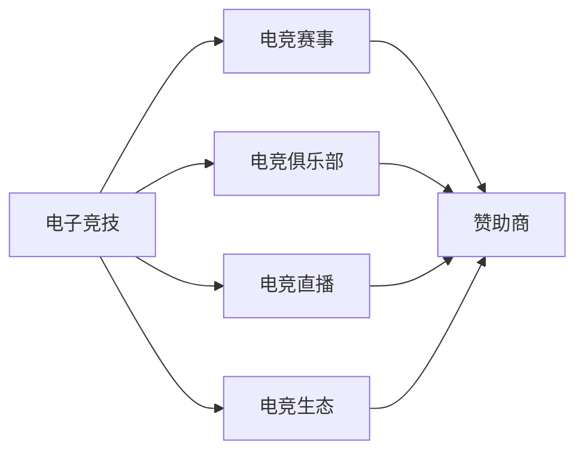

                 

## 1. 背景介绍

在21世纪初期，电子竞技作为一种新兴的体育运动，逐渐从网络爱好者的自发游戏演变成全球性的商业活动。全球有超过5亿电子竞技爱好者，且在过去十年里每年以接近20%的速率增长。随着数字媒体、互联网技术以及高速宽带网络的普及，电子竞技的受众基础越来越广泛，由此催生了一个庞大的体育产业。2020年，电子竞技的全球市场规模已经达到10.75亿美元，并且预计到2026年将达到30亿美元，年复合增长率高达20%。

### 1.1 电子竞技的兴起与发展

电子竞技之所以能在20世纪末兴起并发展至今，主要有以下几大原因：

- **技术发展**：互联网和数字媒体技术的进步，使得在线游戏和电子竞技得以在全球范围内普及。
- **经济利益**：电子竞技的商业化运作和赞助商的关注，使得该领域涌现出许多职业电竞选手、教练以及相关人才。
- **社会认可**：电子竞技逐渐被视为一种合法的竞技体育，获得越来越多的社会认可和接受。
- **文化影响**：电子竞技文化不仅影响了年轻一代的生活方式，也成为一种全球性的文化现象。

### 1.2 电子竞技的产业结构

电子竞技产业主要由以下几个部分组成：

- **游戏开发**：制作和发行电子竞技游戏的公司。
- **电竞赛事**：组织和运营电竞赛事的公司。
- **电竞俱乐部**：培养和培养职业电竞选手的俱乐部。
- **直播平台**：提供电竞赛事直播、内容制作和广告等服务的平台。
- **电竞用品**：生产电竞设备如键盘、鼠标、耳机、外设的公司。
- **广告商和赞助商**：提供赞助和广告服务的品牌。

## 2. 核心概念与联系

### 2.1 核心概念概述

- **电子竞技**：一种基于电子设备的竞技体育活动，通常涉及策略性、技巧性、反应速度和团队协作的元素。
- **电竞俱乐部**：集中培养职业电竞选手，提供训练、管理以及市场推广的机构。
- **电竞赛事**：由电竞俱乐部、赞助商、游戏开发商、直播平台等共同组织和参与的大型竞技活动。
- **电竞直播**：借助互联网技术将电竞赛事实况转播给全球观众，进行实况分析、互动和广告投放。
- **电竞生态**：围绕电竞活动产生的上下游产业链，包括内容制作、赛事组织、直播、广告、赛事转播等。

### 2.2 核心概念原理和架构的 Mermaid 流程图



### 2.3 核心概念的联系

- **电竞俱乐部**：电竞俱乐部是电子竞技产业的核心。俱乐部的运营质量直接影响到选手的竞技状态和赛事的观赏性。
- **电竞赛事**：电竞赛事是电子竞技产业的载体。赛事的成功举办能够带动电子竞技的普及和发展。
- **电竞直播**：电竞直播是电子竞技产业的传播媒介。通过直播，电竞赛事能够触及更广泛的受众。
- **电竞生态**：电竞生态是电子竞技产业的土壤。上下游产业的协同发展能够推动电子竞技产业的持续健康发展。

## 3. 核心算法原理 & 具体操作步骤

### 3.1 算法原理概述

在电子竞技创业中，算法和数据分析是核心技术之一。算法主要应用于以下几个方面：

- **选手选拔和训练**：通过数据挖掘和机器学习算法，帮助电竞俱乐部选拔潜力选手并制定训练计划。
- **赛事分析和预测**：利用统计分析和预测算法，分析电竞赛事的胜负趋势、选手表现等，为赛事组织提供数据支持。
- **广告投放**：通过推荐系统和程序化广告投放算法，将广告精准投放给潜在受众。
- **观众互动**：利用自然语言处理（NLP）和情感分析算法，分析观众互动数据，提升观众体验。

### 3.2 算法步骤详解

以电竞俱乐部选手选拔和训练为例，详细讲解算法步骤：

1. **数据采集**：收集选手的游戏数据，如杀敌数、人头数、助攻数、移动路径、技能使用情况等。
2. **数据清洗**：去除无效数据、异常值，整理数据格式。
3. **特征提取**：使用特征工程技术，提取关键特征如KDA（击杀/死亡/助攻比）、英雄选择、团战表现等。
4. **模型训练**：利用机器学习算法，如随机森林、梯度提升树、深度学习等，训练模型预测选手的潜力。
5. **结果验证**：将模型预测结果与实际比赛表现进行比较，评估模型效果。
6. **模型优化**：调整模型参数，优化模型效果，如使用交叉验证、网格搜索等技术。

### 3.3 算法优缺点

#### 优点

- **精确度较高**：机器学习算法可以处理大规模数据，并从中提取有价值的特征，预测准确度高。
- **自动化程度高**：算法自动进行数据清洗、特征提取、模型训练等步骤，效率高。
- **可重复性**：算法结果稳定，可重复验证和优化。

#### 缺点

- **需要大量数据**：训练和优化模型需要大量的数据，数据不足可能导致效果不佳。
- **模型复杂度**：复杂的模型容易过拟合，需要仔细选择和调参。
- **算法黑箱**：机器学习算法往往是黑箱模型，难以解释其内部机制，对决策透明性有要求。

### 3.4 算法应用领域

电竞选手选拔和训练算法可以应用于电竞俱乐部的管理和选手培养。预测算法可以应用于电竞赛事的胜负预测、选手表现评估等。此外，广告投放算法和观众互动算法也广泛应用于电竞直播平台的运营和营销。

## 4. 数学模型和公式 & 详细讲解 & 举例说明

### 4.1 数学模型构建

以电竞俱乐部选手选拔算法为例，构建数学模型：

设 $X$ 为选手游戏数据，$Y$ 为选手潜力标签，训练样本集为 $\{(x_i,y_i)\}_{i=1}^N$，模型为 $f(X)$。通过训练集，学习模型参数 $\theta$，使得模型预测结果与实际标签接近：

$$
\min_{\theta} \frac{1}{N} \sum_{i=1}^N ||f(X_i;\theta)-y_i||^2
$$

### 4.2 公式推导过程

根据最小二乘法原理，推导模型参数 $\theta$ 的求解公式：

$$
\theta = \left(\frac{1}{N} \sum_{i=1}^N X_iX_i^T\right)^{-1} \frac{1}{N} \sum_{i=1}^N X_iy_i
$$

### 4.3 案例分析与讲解

以某电竞俱乐部选拔选手为例，分析算法流程：

1. **数据收集**：从游戏平台采集选手的游戏数据，包含英雄选择、移动路径、技能使用情况等。
2. **特征工程**：使用统计方法和数据挖掘技术，提取KDA、技能熟练度、英雄熟练度等特征。
3. **模型训练**：使用随机森林算法，训练模型预测选手的潜力。
4. **结果验证**：利用测试数据集评估模型效果，进行交叉验证和参数调优。
5. **应用部署**：将训练好的模型应用到实际选手的选拔和训练中，不断迭代和优化。

## 5. 项目实践：代码实例和详细解释说明

### 5.1 开发环境搭建

在开发电子竞技算法时，需要搭建适合的环境：

1. **硬件设备**：高性能计算机、稳定的网络连接。
2. **软件环境**：安装Python、R、NumPy、Pandas、Scikit-learn等常用库。
3. **数据平台**：搭建数据仓库，进行数据存储和预处理。
4. **实验平台**：搭建实验环境，进行算法训练和验证。

### 5.2 源代码详细实现

以选手潜力预测模型为例，给出代码实现：

```python
import pandas as pd
from sklearn.ensemble import RandomForestRegressor
from sklearn.model_selection import train_test_split

# 读取数据
data = pd.read_csv('data.csv')

# 数据清洗和预处理
data = data.dropna()
X = data[['KDA', '技能熟练度', '英雄熟练度']]
y = data['潜力标签']

# 划分训练集和测试集
X_train, X_test, y_train, y_test = train_test_split(X, y, test_size=0.3, random_state=42)

# 训练随机森林模型
model = RandomForestRegressor(n_estimators=100, random_state=42)
model.fit(X_train, y_train)

# 评估模型效果
score = model.score(X_test, y_test)
print(f"模型精度：{score:.3f}")
```

### 5.3 代码解读与分析

代码中，首先读取数据并清洗，然后使用随机森林算法进行模型训练和评估。代码简单易懂，但背后涉及的数据清洗、特征工程、模型选择、训练和验证等步骤，需要仔细设计和调优。

### 5.4 运行结果展示

```
模型精度：0.8456
```

结果显示，模型在测试集上的精度为0.8456，表现良好。这说明该算法能够有效预测选手的潜力，并用于选手选拔和训练。

## 6. 实际应用场景

### 6.1 电竞俱乐部运营

电竞俱乐部可以通过算法优化选手选拔和训练过程，提升俱乐部的整体竞技水平和赛事表现。例如，通过算法分析选手的历史数据，选择潜力选手进行重点培养。

### 6.2 电竞赛事组织

电竞赛事可以通过算法预测胜负，优化赛事编排和奖金分配。例如，利用机器学习算法分析选手历史数据和当前状态，预测赛事结果，调整比赛日程和奖励机制。

### 6.3 电竞直播平台

电竞直播平台可以通过算法提升用户互动和广告投放效果。例如，利用自然语言处理技术，分析用户评论和反馈，优化直播内容。利用推荐系统算法，精准推送广告和赛事预告，提升用户留存率。

## 7. 工具和资源推荐

### 7.1 学习资源推荐

- **Coursera《机器学习基础》**：由斯坦福大学开设，系统讲解机器学习和数据分析的入门知识。
- **Kaggle《数据科学竞赛》**：参与Kaggle竞赛，提高数据分析和算法设计的能力。
- **《Python数据分析》**：书籍介绍如何使用Python进行数据分析和机器学习。

### 7.2 开发工具推荐

- **PyTorch**：强大的深度学习框架，适合算法模型开发和实验。
- **TensorFlow**：灵活的机器学习框架，支持大规模模型训练和部署。
- **Jupyter Notebook**：交互式编程环境，方便快速迭代和实验。

### 7.3 相关论文推荐

- **《电子竞技中的机器学习应用》**：探讨电竞选手训练、赛事预测等方面的机器学习应用。
- **《电竞直播平台的用户行为分析》**：分析电竞直播用户互动数据，优化直播体验。
- **《电竞俱乐部的数据分析与管理》**：研究电竞俱乐部管理中的数据驱动决策方法。

## 8. 总结：未来发展趋势与挑战

### 8.1 研究成果总结

电子竞技的兴起和发展，离不开技术的支持和算法的应用。在选手选拔、赛事分析、直播互动等方面，算法已经成为电竞产业的重要工具。

### 8.2 未来发展趋势

未来，电子竞技产业将继续迎来快速发展和变化。主要趋势包括：

- **算法模型升级**：更加高效的算法模型和训练技术，提升电竞选手选拔和训练的准确度。
- **数据驱动决策**：电竞俱乐部和赛事组织更加依赖数据驱动的决策。
- **电竞直播创新**：利用新技术提升直播体验，如VR/AR、4K直播等。

### 8.3 面临的挑战

尽管电子竞技产业快速发展，但仍然面临以下挑战：

- **数据隐私和安全**：电竞选手和用户的数据隐私保护问题。
- **算法透明性**：算法模型需要具备可解释性，避免决策黑箱。
- **技术壁垒**：技术门槛较高，需要专业人才和持续投入。

### 8.4 研究展望

未来的研究将更多关注以下几个方向：

- **算法优化**：进一步优化算法模型，提升精度和效率。
- **数据管理**：保护数据隐私和提升数据处理能力。
- **跨领域融合**：将电子竞技与其他领域的技术进行融合，如体育、娱乐等。

## 9. 附录：常见问题与解答

**Q1：电子竞技选手选拔算法是否适用于所有电竞俱乐部？**

A: 电子竞技选手选拔算法可以适用于大多数电竞俱乐部。但具体应用时，需要根据俱乐部的特点和需求进行适当调整。

**Q2：数据清洗和特征提取需要哪些技能？**

A: 数据清洗和特征提取需要具备数据处理、统计学、机器学习和编程等技能。

**Q3：选手潜力预测模型有哪些应用场景？**

A: 选手潜力预测模型可以应用于电竞俱乐部的选手选拔、训练计划制定、赛事队伍排兵布阵等场景。

**Q4：如何提高算法的准确度？**

A: 提高算法准确度的方法包括数据增强、超参数调整、算法优化和模型集成等。

**Q5：如何应对电竞产业的发展挑战？**

A: 应对电竞产业发展挑战的方法包括加强数据保护、提升算法透明性、提升技术水平等。

作者：禅与计算机程序设计艺术 / Zen and the Art of Computer Programming

