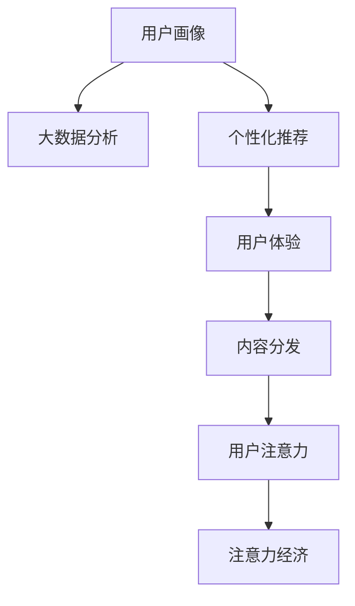

                 

# 电影产业在注意力经济中的新策略

> 关键词：电影产业, 注意力经济, 用户注意力, 大数据分析, 个性化推荐, 用户体验

## 1. 背景介绍

在数字化和互联网时代，媒体行业的竞争格局发生了深刻的变化。注意力成为一种稀缺资源，掌握用户注意力成为了媒体产业的核心竞争力。电影产业作为传统内容产业的重要组成部分，正面临着前所未有的挑战与机遇。传统电影产业以票房为核心，以明星、广告等为主要驱动力的增长模式面临瓶颈。随着大数据、人工智能等技术的崛起，电影产业开始转向以用户注意力为核心的模式，即注意力经济。

注意力经济（Economy of Attention）是以用户注意力为核心的经济模式。通过精准分析和有效运营，最大化地吸引和保持用户注意力，并转化为商业价值。在注意力经济中，电影产业需要重新思考其战略和运营方式，以期在竞争激烈的市场中脱颖而出。

## 2. 核心概念与联系

### 2.1 核心概念概述

为更好地理解电影产业在注意力经济中的新策略，本节将介绍几个核心概念：

- 注意力经济：以用户注意力为核心的经济模式，通过精准分析和有效运营，最大化地吸引和保持用户注意力，并转化为商业价值。

- 用户注意力：用户对信息的集中度，即用户在特定时间、空间内的注意力集中程度，是注意力经济的核心。

- 大数据分析：通过收集、整理和分析大量用户数据，挖掘用户行为和心理特征，预测用户需求和行为趋势。

- 个性化推荐：基于用户数据和行为特征，向用户提供定制化的内容或服务，提升用户体验和满意度。

- 用户体验：用户对产品或服务的满意度和情感体验，是衡量企业竞争力的重要指标。

- 用户画像：基于用户数据构建的详细用户画像，用于精准定位用户需求和行为。

- 内容分发：根据用户画像和行为特征，将合适的内容分发给用户，提升用户粘性。

这些核心概念之间的逻辑关系可以通过以下Mermaid流程图来展示：



这个流程图展示了大数据、个性化推荐、用户体验、内容分发与注意力经济之间的关联，描绘了电影产业在注意力经济中的全流程闭环。

## 3. 核心算法原理 & 具体操作步骤
### 3.1 算法原理概述

注意力经济中的核心是吸引和保持用户注意力，而用户注意力则取决于内容的质量、相关性和个性化程度。通过大数据分析和个性化推荐技术，电影产业可以精准定位用户需求，提供更加匹配的内容，从而提升用户粘性和满意度，实现注意力向商业价值的转化。

在电影产业中，核心算法包括：

- 用户画像构建：基于用户历史行为数据，构建详细的用户画像。
- 个性化推荐：根据用户画像和行为特征，向用户推荐电影、预告片、周边产品等。
- 用户体验优化：通过改进推荐算法、优化内容呈现方式，提升用户的使用体验。

### 3.2 算法步骤详解

电影产业在注意力经济中，主要包括以下几个关键步骤：

**Step 1: 数据收集与预处理**
- 从多个渠道（如社交媒体、电影网站、票务系统等）收集用户数据，包括但不限于浏览历史、评分、购买记录等。
- 对数据进行清洗、去重、填充缺失值等预处理操作，确保数据的准确性和完整性。

**Step 2: 用户画像构建**
- 使用聚类、分类等算法对用户行为数据进行分析，划分出不同的用户群体。
- 根据不同群体的特征，构建用户画像，包括兴趣偏好、观看历史、地理位置、社交行为等。

**Step 3: 个性化推荐系统设计**
- 选择合适的推荐算法，如协同过滤、基于内容的推荐、深度学习等。
- 设计推荐模型的输入输出结构，包括用户画像、电影特征、用户行为等。

**Step 4: 模型训练与优化**
- 利用训练数据对推荐模型进行训练，选择适当的评估指标（如准确率、召回率、用户满意度等）。
- 使用交叉验证、参数调优等技术，对推荐模型进行优化，提升其预测性能。

**Step 5: 用户互动与反馈收集**
- 将推荐结果展示给用户，收集用户的点击、观看、评分等互动数据。
- 分析用户反馈，优化推荐模型和内容呈现方式。

**Step 6: 效果评估与迭代**
- 定期对推荐效果进行评估，通过A/B测试等方法，评估推荐模型的实际效果。
- 根据评估结果，不断迭代优化推荐算法和内容分发策略。

### 3.3 算法优缺点

基于用户注意力的个性化推荐方法具有以下优点：
1. 提升用户体验：通过精准推荐，提升用户满意度和忠诚度。
2. 提高转化率：个性化推荐能够提高用户观看电影、购买周边产品的可能性。
3. 降低营销成本：精准定位用户需求，避免无效广告投放。
4. 增强市场竞争力：通过优化用户体验，提升品牌形象和市场份额。

但该方法也存在以下局限性：
1. 数据隐私问题：收集和分析用户数据可能引发隐私泄露问题。
2. 算法复杂度：推荐算法需要处理大量数据，计算复杂度较高。
3. 冷启动问题：新用户缺乏历史数据，难以进行个性化推荐。
4. 过拟合风险：如果数据偏差较大，推荐模型可能过拟合用户行为。
5. 用户疲劳：频繁推荐可能导致用户注意力疲劳，降低互动意愿。

尽管存在这些局限性，但就目前而言，基于用户注意力的推荐方法仍是大数据时代电影产业提升用户体验和市场竞争力的重要手段。

### 3.4 算法应用领域

基于用户注意力的个性化推荐方法在电影产业中应用广泛，例如：

- 电影推荐：根据用户历史观影记录和评分，推荐感兴趣的电影。
- 预告片推荐：根据用户观看习惯，推荐最新预告片。
- 周边产品推荐：根据用户购买历史和兴趣爱好，推荐相关周边产品。
- 座位推荐：根据用户购买信息和时间偏好，推荐合适座位。
- 影评推荐：根据用户历史评分和影评数据，推荐相关影评。

除了上述这些经典应用外，电影产业还在不断探索新的应用场景，如智能排片、跨平台推广、社交媒体互动等，通过精准运营吸引和保持用户注意力，提升品牌价值和市场份额。

## 4. 数学模型和公式 & 详细讲解 & 举例说明
### 4.1 数学模型构建

在大数据和推荐系统中，常用的数学模型包括协同过滤（Collaborative Filtering）、基于内容的推荐（Content-Based Recommendation）、矩阵分解（Matrix Factorization）和深度学习推荐系统（Deep Learning Based Recommendation）。这里以矩阵分解模型为例，进行详细讲解。

设电影集为$M$，用户集为$U$，电影-用户评分矩阵为$\mathbf{R} \in \mathbb{R}^{M \times U}$，其中$\mathbf{R}_{ij}$表示用户$i$对电影$j$的评分。我们假设存在两个低维矩阵$\mathbf{P} \in \mathbb{R}^{M \times K}$和$\mathbf{Q} \in \mathbb{R}^{U \times K}$，其中$K$为嵌入维度，满足$\mathbf{P} \times \mathbf{Q}^{\top}$与$\mathbf{R}$相近。因此，我们可以最小化如下目标函数：

$$
\min_{\mathbf{P},\mathbf{Q}} \|\mathbf{R} - \mathbf{P}\mathbf{Q}^{\top}\|_F^2
$$

其中$\|\cdot\|_F$表示矩阵的Frobenius范数。

### 4.2 公式推导过程

根据上述目标函数，我们可以通过SVD分解求解$\mathbf{P}$和$\mathbf{Q}$：

$$
\mathbf{R} = \mathbf{P}\mathbf{Q}^{\top} + \mathbf{E}
$$

其中$\mathbf{E}$为误差矩阵。设$\mathbf{U} \in \mathbb{R}^{M \times K}, \mathbf{V} \in \mathbb{R}^{U \times K}$为$\mathbf{P}$和$\mathbf{Q}$的奇异值分解，则：

$$
\mathbf{P} = \mathbf{U}\mathbf{\Sigma}\mathbf{V}^{\top}, \mathbf{Q} = \mathbf{U}^{\top}\mathbf{\Sigma}\mathbf{V}
$$

其中$\mathbf{\Sigma} \in \mathbb{R}^{K \times K}$为奇异值对角矩阵，$\mathbf{\Sigma}_{ii}$为第$i$个奇异值。

将$\mathbf{P}$和$\mathbf{Q}$代入目标函数，得：

$$
\|\mathbf{R} - \mathbf{U}\mathbf{\Sigma}\mathbf{V}^{\top}\mathbf{V}\mathbf{U}^{\top}\|_F^2 = \text{tr}(\mathbf{E}^{\top}\mathbf{E})
$$

其中$\text{tr}(\cdot)$表示矩阵的迹，$\mathbf{E} = \mathbf{R} - \mathbf{U}\mathbf{\Sigma}\mathbf{V}^{\top}\mathbf{V}\mathbf{U}^{\top}$。

### 4.3 案例分析与讲解

以Netflix的推荐系统为例，Netflix通过矩阵分解模型进行个性化推荐。Netflix首先对用户的观看记录和评分进行预处理，得到用户-电影评分矩阵。然后，Netflix利用SVD分解将评分矩阵分解为低维矩阵$\mathbf{P}$和$\mathbf{Q}$，其中$\mathbf{P}$表示电影的潜在特征，$\mathbf{Q}$表示用户的潜在特征。最后，Netflix使用低维矩阵$\mathbf{P}$和$\mathbf{Q}$预测用户对未观看电影的评分，通过用户互动数据进行模型优化。

Netflix的成功案例展示了矩阵分解模型在个性化推荐中的应用潜力，通过优化低维矩阵的参数，Netflix实现了高效的个性化推荐，提升了用户体验和商业价值。

## 5. 项目实践：代码实例和详细解释说明
### 5.1 开发环境搭建

在进行推荐系统开发前，我们需要准备好开发环境。以下是使用Python进行Scikit-learn开发的环境配置流程：

1. 安装Anaconda：从官网下载并安装Anaconda，用于创建独立的Python环境。

2. 创建并激活虚拟环境：
```bash
conda create -n recommendation-env python=3.8 
conda activate recommendation-env
```

3. 安装Scikit-learn：
```bash
conda install scikit-learn
```

4. 安装各类工具包：
```bash
pip install numpy pandas scipy scikit-learn matplotlib seaborn jupyter notebook ipython
```

完成上述步骤后，即可在`recommendation-env`环境中开始推荐系统开发。

### 5.2 源代码详细实现

下面我们以基于矩阵分解的个性化推荐系统为例，给出使用Scikit-learn进行推荐系统开发的Python代码实现。

首先，定义数据处理函数：

```python
from sklearn.metrics.pairwise import cosine_similarity
import pandas as pd
import numpy as np

def load_data(file_path):
    data = pd.read_csv(file_path)
    movies = data['movie_id'].tolist()
    users = data['user_id'].tolist()
    ratings = data['rating'].tolist()
    return movies, users, ratings

def create_user_item_matrix(movies, users, ratings):
    movie_ids = np.unique(movies)
    user_ids = np.unique(users)
    item_ratings = np.zeros((len(movie_ids), len(user_ids)))
    
    for movie_id, user_id, rating in zip(movies, users, ratings):
        item_ratings[movie_ids.index(movie_id) - 1, user_ids.index(user_id) - 1] = rating
    
    return item_ratings

def save_matrix(matrix, file_path):
    np.savetxt(file_path, matrix, fmt='%.4f')
```

然后，定义推荐函数：

```python
from sklearn.decomposition import TruncatedSVD

def recommendation(movies, users, ratings, top_n=10):
    item_ratings = create_user_item_matrix(movies, users, ratings)
    svd = TruncatedSVD(n_components=20)
    svd.fit(item_ratings)
    predictions = svd.transform(item_ratings)
    
    for user_id, user_ratings in enumerate(predictions):
        top_movies = np.argsort(user_ratings)[-top_n:]
        print(f"User {user_id + 1}'s top {top_n} movie recommendations:")
        for movie_id, rating in zip(top_movies, user_ratings[top_movies]):
            print(f"Movie {movie_id + 1}: {rating:.4f}")
```

最后，启动推荐系统：

```python
movies, users, ratings = load_data('data.csv')
recommendation(movies, users, ratings)
```

以上就是使用Scikit-learn进行个性化推荐系统开发的完整代码实现。可以看到，通过Scikit-learn库，开发者可以快速搭建推荐系统，并通过矩阵分解算法实现用户推荐。

### 5.3 代码解读与分析

让我们再详细解读一下关键代码的实现细节：

**load_data函数**：
- 读取数据文件，返回电影、用户和评分列表。

**create_user_item_matrix函数**：
- 将电影、用户和评分列表构建成用户-电影评分矩阵。

**TruncatedSVD类**：
- 定义SVD分解模型，设置分解后的嵌入维度为20。

**recommendation函数**：
- 对用户-电影评分矩阵进行SVD分解，获得低维矩阵。
- 根据低维矩阵，预测用户未观看电影的评分。
- 根据评分从高到低排序，输出推荐结果。

**data.csv**：
- 推荐系统使用的数据文件，包含用户对电影的评分信息。

代码展示了从数据预处理到模型训练和推荐的全过程，对于初学者来说，这种基于Scikit-learn的快速实现方式非常直观和高效。

## 6. 实际应用场景
### 6.1 在线视频平台推荐

在线视频平台如Netflix、YouTube等，需要提供高效的用户推荐服务，帮助用户发现感兴趣的内容。推荐系统可以通过分析用户的观看历史和评分数据，提供个性化的电影、电视剧推荐，提高用户满意度和留存率。

在技术实现上，可以采用基于矩阵分解或深度学习的推荐算法，对用户行为数据进行建模。将模型集成到平台上，实时计算并推荐相关内容。推荐系统能够持续优化，根据用户反馈不断调整推荐策略，提升推荐效果。

### 6.2 电商平台个性化推荐

电商平台如Amazon、淘宝等，需要提供多样化的个性化推荐服务，帮助用户发现更多感兴趣的商品。推荐系统可以通过分析用户的浏览、购买和评价数据，提供个性化的商品推荐，提升用户购买转化率和满意度。

在技术实现上，可以采用协同过滤、基于内容的推荐、深度学习等算法，对用户行为数据进行建模。将模型集成到平台上，实时计算并推荐相关商品。推荐系统能够持续优化，根据用户反馈不断调整推荐策略，提升推荐效果。

### 6.3 旅游平台内容推荐

旅游平台如携程、Airbnb等，需要提供个性化的旅游内容推荐服务，帮助用户发现感兴趣的旅游目的地和活动。推荐系统可以通过分析用户的搜索历史和评价数据，提供个性化的旅游目的地、酒店、活动推荐，提升用户满意度和预订率。

在技术实现上，可以采用协同过滤、基于内容的推荐、深度学习等算法，对用户行为数据进行建模。将模型集成到平台上，实时计算并推荐相关内容。推荐系统能够持续优化，根据用户反馈不断调整推荐策略，提升推荐效果。

### 6.4 未来应用展望

随着推荐算法的不断演进和用户数据的多样化，推荐系统将在更多领域得到应用，为用户带来更好的体验和价值。未来推荐系统的发展趋势包括：

1. 个性化推荐：根据用户的历史行为和实时数据，提供更精准的个性化推荐。

2. 多模态推荐：结合用户的多模态数据（如文本、图像、视频等），提供更加丰富的推荐内容。

3. 实时推荐：利用流式数据处理技术，提供实时更新的推荐服务。

4. 冷启动推荐：处理新用户和未交互数据，提供有效的冷启动推荐策略。

5. 基于语义的推荐：结合自然语言处理技术，理解用户的语义需求，提供更加符合心理预期的推荐结果。

6. 集成化推荐：结合搜索、广告等业务，提供集成化的推荐解决方案。

这些趋势将使得推荐系统更加智能化、个性化和高效，为用户带来更好的体验和价值。

## 7. 工具和资源推荐
### 7.1 学习资源推荐

为了帮助开发者系统掌握推荐系统的理论基础和实践技巧，这里推荐一些优质的学习资源：

1. 《推荐系统实战》系列博文：由推荐系统专家撰写，深入浅出地介绍了推荐系统的工作原理、推荐算法和实践技巧。

2. 《Python推荐系统》书籍：详细介绍了基于Python的推荐系统开发，包括协同过滤、基于内容的推荐等算法。

3. Coursera《Recommender Systems》课程：由斯坦福大学开设的推荐系统课程，涵盖推荐系统的核心算法和应用实例。

4 Scikit-learn官方文档：详细介绍了Scikit-learn库的使用方法和推荐算法。

5 KDD Cup数据集：提供了大量的推荐系统竞赛数据集，帮助开发者实践和调试推荐模型。

通过对这些资源的学习实践，相信你一定能够快速掌握推荐系统的精髓，并用于解决实际的推荐问题。

### 7.2 开发工具推荐

高效的开发离不开优秀的工具支持。以下是几款用于推荐系统开发的常用工具：

1. Scikit-learn：基于Python的机器学习库，提供了丰富的推荐算法和模型评估工具。

2. TensorFlow：由Google主导开发的深度学习框架，支持大规模推荐系统的训练和推理。

3. PyTorch：基于Python的深度学习框架，灵活的动态计算图，适合快速迭代研究。

4. Apache Spark：大数据处理框架，支持分布式推荐系统的构建和优化。

5. Hadoop：大数据处理框架，支持大规模数据处理和推荐系统的训练。

合理利用这些工具，可以显著提升推荐系统的开发效率，加快创新迭代的步伐。

### 7.3 相关论文推荐

推荐系统的发展源于学界的持续研究。以下是几篇奠基性的相关论文，推荐阅读：

1. Collaborative Filtering for Implicit Feedback Datasets（即ALS原论文）：提出了基于协同过滤的矩阵分解方法，为推荐系统奠定了基础。

2. item-based collaborative filtering for implicit feedback datasets（即ALS论文）：进一步扩展了协同过滤算法，提高了推荐系统的效率和准确性。

3. Deep Collaborative Filtering（即DeepFM论文）：引入深度学习技术，提升了推荐系统的性能和泛化能力。

4. Attention and Memory-Based Recommender Systems（即Attention机制论文）：引入了注意力机制，提高了推荐系统的个性化和多样性。

5. Matrix Factorization Techniques for Recommender Systems（即SVD分解论文）：详细介绍了矩阵分解方法，并比较了不同算法的优缺点。

这些论文代表了大规模推荐系统的演进脉络。通过学习这些前沿成果，可以帮助研究者把握学科前进方向，激发更多的创新灵感。

## 8. 总结：未来发展趋势与挑战
### 8.1 总结

本文对基于用户注意力的个性化推荐方法进行了全面系统的介绍。首先阐述了注意力经济的概念及其在电影产业中的重要性，明确了推荐系统在提升用户体验和市场竞争力方面的独特价值。其次，从原理到实践，详细讲解了推荐系统的数学模型和关键步骤，给出了推荐任务开发的完整代码实例。同时，本文还广泛探讨了推荐系统在在线视频平台、电商平台、旅游平台等多个行业领域的应用前景，展示了推荐系统的巨大潜力。此外，本文精选了推荐系统的各类学习资源，力求为读者提供全方位的技术指引。

通过本文的系统梳理，可以看到，基于用户注意力的推荐方法正在成为互联网时代内容推荐的重要手段，极大地提升了用户的满意度和市场竞争力。未来，伴随推荐算法的不断演进和用户数据的持续积累，推荐系统必将为用户带来更好的体验和价值。

### 8.2 未来发展趋势

展望未来，推荐系统的发展趋势包括：

1. 个性化推荐：通过深入分析用户行为数据，提供更加精准的个性化推荐。

2. 多模态推荐：结合用户的多模态数据（如文本、图像、视频等），提供更加丰富的推荐内容。

3. 实时推荐：利用流式数据处理技术，提供实时更新的推荐服务。

4. 冷启动推荐：处理新用户和未交互数据，提供有效的冷启动推荐策略。

5. 基于语义的推荐：结合自然语言处理技术，理解用户的语义需求，提供更加符合心理预期的推荐结果。

6. 集成化推荐：结合搜索、广告等业务，提供集成化的推荐解决方案。

以上趋势凸显了推荐系统的广阔前景。这些方向的探索发展，必将进一步提升推荐系统的性能和应用范围，为人类创造更好的生活体验。

### 8.3 面临的挑战

尽管推荐系统已经取得了瞩目成就，但在迈向更加智能化、个性化和高效应用的过程中，它仍面临着诸多挑战：

1. 数据隐私问题：收集和分析用户数据可能引发隐私泄露问题。

2. 算法复杂度：推荐算法需要处理大量数据，计算复杂度较高。

3. 冷启动问题：新用户缺乏历史数据，难以进行个性化推荐。

4. 过拟合风险：如果数据偏差较大，推荐模型可能过拟合用户行为。

5. 用户疲劳：频繁推荐可能导致用户注意力疲劳，降低互动意愿。

尽管存在这些局限性，但就目前而言，基于用户注意力的推荐方法仍是大数据时代电影产业提升用户体验和市场竞争力的重要手段。

### 8.4 未来突破

面对推荐系统面临的种种挑战，未来的研究需要在以下几个方面寻求新的突破：

1. 探索无监督和半监督推荐方法。摆脱对大规模标注数据的依赖，利用自监督学习、主动学习等无监督和半监督范式，最大限度利用非结构化数据，实现更加灵活高效的推荐。

2. 研究参数高效和计算高效的推荐范式。开发更加参数高效的推荐方法，在固定大部分推荐参数的同时，只更新极少量的任务相关参数。同时优化推荐模型的计算图，减少前向传播和反向传播的资源消耗，实现更加轻量级、实时性的部署。

3. 引入更多先验知识。将符号化的先验知识，如知识图谱、逻辑规则等，与推荐算法进行巧妙融合，引导推荐过程学习更准确、合理的推荐结果。

4. 结合因果分析和博弈论工具。将因果分析方法引入推荐系统，识别出推荐决策的关键特征，增强推荐结果的因果性和逻辑性。借助博弈论工具刻画人机交互过程，主动探索并规避推荐系统的脆弱点，提高系统稳定性。

5. 纳入伦理道德约束。在推荐目标中引入伦理导向的评估指标，过滤和惩罚有害的推荐内容。加强人工干预和审核，建立推荐系统的监管机制，确保输出符合人类价值观和伦理道德。

这些研究方向的探索，必将引领推荐系统技术迈向更高的台阶，为用户带来更好的体验和价值。

## 9. 附录：常见问题与解答
**Q1：推荐系统是否适用于所有行业？**

A: 推荐系统在大多数行业都有广泛的应用，特别是那些依赖用户数据和行为数据的领域。例如电商平台、在线视频平台、旅游平台、社交媒体等。但对于一些数据较少、用户行为单一的行业，推荐系统的效果可能有限。

**Q2：推荐系统如何处理新用户？**

A: 新用户缺乏历史数据，推荐系统可以采用基于内容的推荐或协同过滤等方法，结合用户输入的信息（如性别、年龄、兴趣等），提供初步推荐。随着用户行为数据的积累，推荐系统可以逐步学习和优化推荐模型，提供更加精准的个性化推荐。

**Q3：推荐系统如何避免过拟合？**

A: 推荐系统可以通过引入正则化、交叉验证、模型集成等技术，避免模型对特定数据集的过拟合。同时，推荐系统应该定期更新数据和模型，保持推荐策略的灵活性和鲁棒性。

**Q4：推荐系统如何处理多样化的推荐场景？**

A: 推荐系统需要针对不同的场景和业务需求，设计不同的推荐策略和模型。例如，对于广告推荐，可以采用以点击率为优化目标的点击率预测模型；对于商品推荐，可以采用以转化率为优化目标的转化率预测模型。同时，推荐系统应该能够灵活调整推荐策略，适应不同的业务场景。

**Q5：推荐系统如何平衡个性化和多样性？**

A: 推荐系统需要在个性化推荐和多样性推荐之间取得平衡。可以通过控制推荐列表的长度和顺序，增加多样性推荐的比例。同时，推荐系统应该定期评估推荐结果的多样性，优化推荐策略，避免过度个性化导致的推荐单调性。

这些常见问题展示了推荐系统在实际应用中可能遇到的挑战，通过深入分析，可以更好地应对这些问题，提升推荐系统的实际效果。

---

作者：禅与计算机程序设计艺术 / Zen and the Art of Computer Programming

