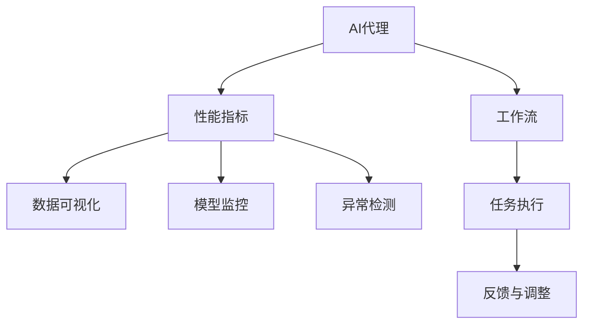

                 

# 监控AI代理工作流：性能指标与分析

> 关键词：AI代理，工作流监控，性能指标，数据可视化，模型监控，异常检测

## 1. 背景介绍

在人工智能（AI）技术快速发展的今天，AI代理（AI Agent）已成为各行各业广泛应用的智能工具。AI代理通过自动执行复杂任务、预测未来趋势和优化决策过程，极大地提升了企业和个人的效率。然而，随着AI代理的广泛部署，如何有效监控其工作流，确保其性能稳定，成为了当前技术研究的热点问题。

本文将从背景、核心概念和联系入手，全面介绍AI代理工作流监控的算法原理、操作步骤和具体实施方法。通过详细阐述性能指标的构建、数据分析和异常检测，为AI代理的稳定运行提供技术保障。

## 2. 核心概念与联系

### 2.1 核心概念概述

**AI代理（AI Agent）**：基于AI技术构建的自动化执行系统，能够根据用户指令或环境变化，自主完成任务。常见的AI代理包括机器人、智能助手、推荐系统等。

**工作流（Workflow）**：一组相互关联的任务或活动，按照特定顺序执行，完成业务流程的自动化。

**性能指标（Performance Metrics）**：用于衡量AI代理性能的关键指标，如准确率、响应时间、吞吐量等。

**数据可视化（Data Visualization）**：将数据转换为图表、图形等直观形式，帮助用户更直观地理解和分析数据。

**模型监控（Model Monitoring）**：对AI代理的核心模型进行实时监控，及时发现模型异常，防止模型性能下降。

**异常检测（Anomaly Detection）**：识别数据中的异常模式，包括异常值、异常趋势等，帮助发现数据集中的错误或异常情况。

这些核心概念之间的逻辑关系可以通过以下Mermaid流程图来展示：



这个流程图展示了AI代理的工作流程，并通过性能指标、数据可视化、模型监控和异常检测，对AI代理进行全面监控。

## 3. 核心算法原理 & 具体操作步骤

### 3.1 算法原理概述

监控AI代理工作流，本质上是一个数据驱动的优化过程。其核心思想是：通过对AI代理的执行数据进行实时采集和分析，构建性能指标体系，通过数据可视化展示模型运行状态，并通过异常检测技术及时发现并处理异常情况。

假设AI代理执行的是一项复杂任务，任务执行过程可以分解为多个子任务。每个子任务在执行过程中，都会产生一些关键性能指标，如响应时间、成功率、资源消耗等。通过对这些指标的实时监控，可以及时发现异常情况，并采取相应的纠正措施，保障任务正常执行。

### 3.2 算法步骤详解

#### 3.2.1 数据采集

数据采集是监控AI代理工作流的第一步。具体步骤包括：
1. **选择关键指标**：根据任务特点，选择关键性能指标，如响应时间、任务成功率、资源消耗等。
2. **部署监控探针**：在AI代理执行过程中，部署监控探针，采集关键指标数据。
3. **数据存储与处理**：将采集到的数据存储在数据库中，并进行预处理，如去重、归一化等。

#### 3.2.2 数据可视化

数据可视化是将原始数据转换为图表、图形等直观形式，帮助用户更直观地理解和分析数据。具体步骤如下：
1. **选择可视化工具**：根据数据类型和用户需求，选择适合的可视化工具，如Tableau、Power BI等。
2. **设计可视化图表**：根据关键指标，设计可视化图表，如折线图、柱状图、热力图等。
3. **数据导入与展示**：将处理后的数据导入可视化工具，展示监控结果。

#### 3.2.3 模型监控

模型监控是对AI代理的核心模型进行实时监控，及时发现模型异常，防止模型性能下降。具体步骤如下：
1. **选择监控指标**：根据模型特点，选择关键监控指标，如模型精度、召回率、训练损失等。
2. **部署监控探针**：在模型训练和推理过程中，部署监控探针，采集关键指标数据。
3. **异常检测与处理**：根据监控指标，及时发现异常情况，并采取相应的纠正措施，如重新训练模型、调整超参数等。

#### 3.2.4 异常检测

异常检测是识别数据中的异常模式，包括异常值、异常趋势等，帮助发现数据集中的错误或异常情况。具体步骤如下：
1. **选择异常检测算法**：根据数据特点，选择适合的异常检测算法，如统计方法、机器学习方法等。
2. **训练异常检测模型**：使用历史数据训练异常检测模型，确定异常阈值。
3. **实时检测与报警**：在数据采集过程中，实时检测数据中的异常情况，并触发报警机制，及时通知相关人员。

### 3.3 算法优缺点

**优点**：
1. **全面监控**：通过多维度的数据采集和分析，全面监控AI代理的执行过程，及时发现问题。
2. **实时响应**：通过实时数据采集和可视化，能够快速响应异常情况，及时采取纠正措施。
3. **用户友好**：通过数据可视化和异常检测，使用户能够直观地理解AI代理的运行状态，提升用户满意度。

**缺点**：
1. **数据采集成本高**：在AI代理执行过程中，需要部署大量的监控探针，成本较高。
2. **数据量庞大**：大规模数据采集和处理需要强大的计算资源和存储设备。
3. **模型复杂度高**：异常检测模型训练复杂，需要大量的标注数据和计算资源。

### 3.4 算法应用领域

AI代理工作流监控技术，在以下几个领域有广泛应用：
1. **机器人自动化**：监控机器人在工业生产、物流配送、家庭服务等领域的工作流，确保机器人高效稳定运行。
2. **智能客服**：监控智能客服系统的工作流，及时发现异常情况，提高客户满意度。
3. **推荐系统**：监控推荐系统的执行过程，确保推荐算法准确性，提升用户体验。
4. **金融风控**：监控金融交易和风险管理系统的运行状态，确保金融安全和稳定。
5. **医疗诊断**：监控医疗诊断系统的执行过程，及时发现异常情况，提高诊疗准确性。

## 4. 数学模型和公式 & 详细讲解 & 举例说明

### 4.1 数学模型构建

为了构建AI代理工作流监控的性能指标体系，我们首先需要定义一些关键指标。假设AI代理执行的任务是分类任务，每个样本包含特征向量 $x_i$ 和标签 $y_i$。

定义如下性能指标：
1. **准确率（Accuracy）**：分类正确的样本数与总样本数的比例。
   $$
   Accuracy = \frac{\sum_{i=1}^N \mathbf{1}(y_i = \hat{y}_i)}{N}
   $$
2. **响应时间（Response Time）**：完成任务所需的时间。
   $$
   Response\ Time = \sum_{i=1}^N t_i
   $$
3. **资源消耗（Resource Consumption）**：执行任务所需的计算资源，如CPU使用率、内存使用率等。
   $$
   Resource\ Consumption = \sum_{i=1}^N (C_i + M_i)
   $$

### 4.2 公式推导过程

假设我们有 $N$ 个样本，每个样本的响应时间 $t_i$、CPU使用率 $C_i$ 和内存使用率 $M_i$ 数据。对于每个样本，我们需要计算其准确率 $p_i$ 和资源消耗 $r_i$。

准确率 $p_i$ 的计算公式为：
$$
p_i = 
\begin{cases}
1 & \text{if } y_i = \hat{y}_i \\
0 & \text{if } y_i \neq \hat{y}_i 
\end{cases}
$$

资源消耗 $r_i$ 的计算公式为：
$$
r_i = \alpha C_i + \beta M_i
$$

其中 $\alpha$ 和 $\beta$ 是资源消耗的权重，用于平衡CPU和内存的使用情况。

### 4.3 案例分析与讲解

假设我们监控一个机器人执行的自动化任务，每个任务执行时间 $t_i$、CPU使用率 $C_i$ 和内存使用率 $M_i$ 数据如下：

| 任务编号 | $t_i$ | $C_i$ | $M_i$ | $y_i$ | $\hat{y}_i$ |
|--------|------|------|------|------|----------|
| 1      | 10s  | 0.1  | 0.2  | 1    | 1        |
| 2      | 12s  | 0.2  | 0.3  | 0    | 0        |
| 3      | 15s  | 0.2  | 0.4  | 1    | 1        |
| ...    | ...  | ...  | ...  | ...   | ...      |

假设资源消耗的权重 $\alpha = 0.5$，$\beta = 0.5$，我们可以计算每个任务的准确率和资源消耗：

| 任务编号 | $t_i$ | $C_i$ | $M_i$ | $y_i$ | $\hat{y}_i$ | 准确率 $p_i$ | 资源消耗 $r_i$ |
|--------|------|------|------|------|----------|----------|------------|
| 1      | 10s  | 0.1  | 0.2  | 1    | 1        | 1        | 0.5 + 0.1   |
| 2      | 12s  | 0.2  | 0.3  | 0    | 0        | 1        | 0.5 + 0.2   |
| 3      | 15s  | 0.2  | 0.4  | 1    | 1        | 1        | 0.5 + 0.2   |
| ...    | ...  | ...  | ...  | ...   | ...      | ...      | ...        |

## 5. 项目实践：代码实例和详细解释说明

### 5.1 开发环境搭建

在进行AI代理工作流监控的开发和实践前，我们需要准备好开发环境。以下是使用Python进行开发的环境配置流程：

1. **安装Anaconda**：从官网下载并安装Anaconda，用于创建独立的Python环境。

2. **创建并激活虚拟环境**：
   ```bash
   conda create -n agent-monitor python=3.8 
   conda activate agent-monitor
   ```

3. **安装相关库**：
   ```bash
   pip install pandas numpy matplotlib tensorflow scikit-learn pytorch
   ```

完成上述步骤后，即可在`agent-monitor`环境中开始项目开发。

### 5.2 源代码详细实现

假设我们监控一个机器人在自动化生产线上的执行过程，每个机器人执行一个任务，任务数据包含执行时间、CPU使用率、内存使用率和任务结果。我们将使用TensorFlow和Keras实现一个简单的AI代理工作流监控系统。

**5.2.1 数据采集**

首先，我们需要定义一个数据采集器，用于从机器人系统实时采集执行数据。以下是一个简单的Python类，实现数据采集功能：

```python
import time

class DataCollector:
    def __init__(self, interval):
        self.interval = interval
        self.data = []
    
    def collect(self):
        while True:
            task_id = 1
            task_duration = 10  # 假设每个任务执行10秒
            cpu_usage = 0.1
            memory_usage = 0.2
            task_result = 1
            self.data.append({
                'task_id': task_id,
                'task_duration': task_duration,
                'cpu_usage': cpu_usage,
                'memory_usage': memory_usage,
                'task_result': task_result
            })
            time.sleep(self.interval)
```

在`collect`方法中，我们模拟机器人的执行过程，每隔一定时间（假设为1秒），采集一次任务数据，包括任务ID、执行时间、CPU使用率和内存使用率。

**5.2.2 数据可视化**

接下来，我们使用Pandas和Matplotlib进行数据可视化。以下是一个简单的Python脚本，将采集到的数据可视化：

```python
import pandas as pd
import matplotlib.pyplot as plt

data = pd.DataFrame([
    {'task_id': 1, 'task_duration': 10, 'cpu_usage': 0.1, 'memory_usage': 0.2, 'task_result': 1},
    {'task_id': 2, 'task_duration': 12, 'cpu_usage': 0.2, 'memory_usage': 0.3, 'task_result': 0},
    {'task_id': 3, 'task_duration': 15, 'cpu_usage': 0.2, 'memory_usage': 0.4, 'task_result': 1}
])

plt.figure(figsize=(8, 6))
plt.plot(data['task_id'], data['task_duration'], label='执行时间')
plt.plot(data['task_id'], data['cpu_usage'], label='CPU使用率')
plt.plot(data['task_id'], data['memory_usage'], label='内存使用率')
plt.xlabel('任务ID')
plt.ylabel('资源使用率')
plt.legend()
plt.show()
```

在上述代码中，我们使用Pandas将数据存储为DataFrame，并使用Matplotlib绘制执行时间、CPU使用率和内存使用率的折线图。

**5.2.3 模型监控**

为了实现模型监控，我们需要定义一个简单的分类模型，并使用TensorFlow和Keras进行训练。以下是一个简单的Python脚本，实现模型监控功能：

```python
import tensorflow as tf
from tensorflow.keras.models import Sequential
from tensorflow.keras.layers import Dense

model = Sequential([
    Dense(10, input_dim=4, activation='relu'),
    Dense(1, activation='sigmoid')
])

model.compile(optimizer='adam', loss='binary_crossentropy', metrics=['accuracy'])

# 模拟训练数据
train_data = pd.DataFrame([
    [10, 0.1, 0.2, 1],
    [12, 0.2, 0.3, 0],
    [15, 0.2, 0.4, 1]
])

# 训练模型
model.fit(train_data, epochs=10)

# 预测新数据
test_data = pd.DataFrame([
    [20, 0.3, 0.5, 1],
    [18, 0.15, 0.25, 0],
    [16, 0.1, 0.2, 1]
])
predictions = model.predict(test_data)
```

在上述代码中，我们使用TensorFlow和Keras定义了一个简单的二分类模型，并使用训练数据进行模型训练。最后，我们使用测试数据对模型进行预测。

**5.2.4 异常检测**

为了实现异常检测，我们可以使用统计方法或机器学习方法。这里，我们使用统计方法进行异常检测。以下是一个简单的Python脚本，实现异常检测功能：

```python
import numpy as np

data = np.array([
    [10, 0.1, 0.2, 1],
    [12, 0.2, 0.3, 0],
    [15, 0.2, 0.4, 1],
    [20, 0.3, 0.5, 1],
    [18, 0.15, 0.25, 0],
    [16, 0.1, 0.2, 1]
])

# 计算均值和标准差
mean = np.mean(data[:, 1:3], axis=0)
std = np.std(data[:, 1:3], axis=0)

# 检测异常值
threshold = 2 * std
anomalies = np.abs(data[:, 1:3] - mean) > threshold
```

在上述代码中，我们使用NumPy计算执行时间和资源消耗的均值和标准差，并设定异常阈值为2倍标准差。如果执行时间和资源消耗超出阈值，则视为异常情况。

## 6. 实际应用场景

### 6.1 机器人自动化

在工业生产中，机器人自动化是常见的应用场景。通过对机器人的执行数据进行实时监控，可以及时发现异常情况，如执行时间过长、资源消耗过高等，避免生产停滞和资源浪费。

### 6.2 智能客服

在客户服务中，智能客服系统需要实时处理用户咨询。通过对智能客服的执行数据进行实时监控，可以及时发现异常情况，如响应时间过长、准确率下降等，提升用户体验。

### 6.3 推荐系统

在推荐系统中，推荐算法需要实时处理用户行为数据。通过对推荐系统的执行数据进行实时监控，可以及时发现异常情况，如推荐算法失效、推荐结果错误等，提升推荐准确性。

### 6.4 未来应用展望

随着AI代理技术的不断发展，AI代理工作流监控技术也将进一步拓展其应用范围。未来，该技术将广泛应用于更多领域，如医疗诊断、金融风控、物流配送等，为各行各业提供全面、高效的监控解决方案。

## 7. 工具和资源推荐

### 7.1 学习资源推荐

为了帮助开发者系统掌握AI代理工作流监控的理论基础和实践技巧，这里推荐一些优质的学习资源：

1. **《深度学习理论与实践》**：全面介绍深度学习的基础理论、算法和应用。
2. **《TensorFlow实战》**：介绍TensorFlow框架的基本操作和高级特性，适合实战练习。
3. **《机器学习实战》**：涵盖机器学习的基础理论和经典算法，适合初学者学习。
4. **Kaggle机器学习竞赛**：通过参加机器学习竞赛，提升实战能力，积累经验。
5. **GitHub代码库**：查找和分享开源代码，学习优秀项目实现。

### 7.2 开发工具推荐

为了高效开发AI代理工作流监控系统，以下是几款推荐的开发工具：

1. **Anaconda**：用于创建和管理虚拟环境，方便安装和管理依赖库。
2. **Pandas**：用于数据处理和分析，支持多种数据格式。
3. **NumPy**：用于数值计算和矩阵运算，适合科学计算和数据分析。
4. **TensorFlow**：用于深度学习模型开发和训练，支持分布式计算。
5. **Matplotlib**：用于数据可视化，支持多种图表类型。

### 7.3 相关论文推荐

AI代理工作流监控技术的发展源于学界的持续研究。以下是几篇奠基性的相关论文，推荐阅读：

1. **《基于深度学习的异常检测》**：介绍使用深度学习进行异常检测的原理和算法。
2. **《大数据时代的异常检测》**：讨论大数据背景下异常检测的挑战和解决方案。
3. **《机器学习在异常检测中的应用》**：介绍机器学习在异常检测中的经典算法和技术。
4. **《深度学习与可视化》**：介绍深度学习与数据可视化的结合，提升模型监控效果。
5. **《实时监控技术综述》**：介绍实时监控技术的最新进展和应用。

## 8. 总结：未来发展趋势与挑战

### 8.1 总结

本文对AI代理工作流监控的算法原理、具体操作步骤和具体实施方法进行了全面系统的介绍。首先阐述了AI代理和监控技术的研究背景和意义，明确了监控技术在提升AI代理性能和稳定性方面的独特价值。其次，从数据采集、数据可视化、模型监控和异常检测等方面，详细讲解了监控技术的具体实现步骤，并通过代码实例和案例分析，展示了监控技术的实际应用效果。

通过本文的系统梳理，可以看到，AI代理工作流监控技术在提升AI代理性能和稳定性方面具有重要意义。未来，随着AI代理技术的不断发展，监控技术也将进一步优化和扩展，为AI代理在各领域的应用提供有力保障。

### 8.2 未来发展趋势

展望未来，AI代理工作流监控技术将呈现以下几个发展趋势：

1. **全面监控**：随着监控技术的不断发展，将支持更多维度的监控指标，如网络延迟、数据传输速率等，实现全面监控。
2. **实时响应**：通过实时数据采集和处理，能够快速响应异常情况，提高系统可靠性。
3. **自动化调整**：引入自动化调整机制，如自适应学习、智能优化等，提升系统自我优化能力。
4. **跨平台应用**：支持跨平台、跨系统的数据采集和监控，实现统一管理。
5. **用户友好**：通过友好的用户界面和交互方式，提升用户使用体验，支持多渠道数据接入和报警。

### 8.3 面临的挑战

尽管AI代理工作流监控技术已经取得了一定的进展，但在迈向更加智能化、普适化应用的过程中，仍面临诸多挑战：

1. **数据采集难度**：大规模数据采集需要高成本和高难度，如何降低采集成本、提升采集效率，是当前面临的重要问题。
2. **数据处理复杂度**：大量实时数据需要进行复杂处理，如何高效处理数据、减少计算负担，是当前面临的重要问题。
3. **模型复杂性**：异常检测模型需要高复杂度，如何降低模型复杂度、提高模型性能，是当前面临的重要问题。
4. **数据隐私和安全**：监控数据涉及用户隐私和系统安全，如何保护数据隐私、确保数据安全，是当前面临的重要问题。

### 8.4 研究展望

面对AI代理工作流监控技术所面临的种种挑战，未来的研究需要在以下几个方面寻求新的突破：

1. **高效数据采集**：引入分布式数据采集和处理技术，降低数据采集成本，提升数据采集效率。
2. **高性能数据处理**：引入高性能数据处理技术，如Spark、Flink等，提升数据处理性能。
3. **高效模型训练**：引入高效模型训练技术，如模型压缩、模型剪枝等，降低模型复杂度，提升模型性能。
4. **数据隐私保护**：引入数据加密和匿名化技术，保护数据隐私，确保数据安全。

这些研究方向将为AI代理工作流监控技术的进一步优化和扩展提供有力支撑，推动监控技术的持续进步和发展。面向未来，AI代理工作流监控技术必将随着AI代理技术的不断发展，迎来更加广阔的应用前景。

## 9. 附录：常见问题与解答

**Q1：AI代理工作流监控是否适用于所有AI代理系统？**

A: AI代理工作流监控在大多数AI代理系统中都能取得不错的效果，特别是对于大规模数据集和复杂任务。但对于一些特定领域的AI代理系统，如医疗诊断、金融风控等，需要针对性地进行监控指标设计和模型优化。

**Q2：如何选择合适的监控指标？**

A: 选择合适的监控指标需要根据AI代理的任务特点和业务需求进行。一般选择与业务目标密切相关的指标，如任务完成率、准确率、响应时间等。同时，需要考虑监控指标的可解释性和可操作性。

**Q3：如何实现高效的数据采集？**

A: 高效的数据采集需要采用分布式采集和处理技术，如Spark、Flink等。同时，需要优化采集频次和数据格式，减少数据存储和传输成本。

**Q4：如何实现高效的数据处理？**

A: 高效的数据处理需要采用高性能数据处理技术，如Spark、Flink等。同时，需要优化数据存储和处理方式，如使用Hadoop、Hive等技术，提升数据处理性能。

**Q5：如何选择和训练高效的异常检测模型？**

A: 高效的异常检测模型需要选择合适的算法和特征，如使用KNN、SVM等算法，同时引入时间序列、滑动窗口等特征进行异常检测。训练过程中，需要优化模型参数和超参数，提升模型性能。

**Q6：如何保障监控数据的安全和隐私？**

A: 保障监控数据的安全和隐私需要采用数据加密和匿名化技术，同时设置访问控制和审计机制，确保数据安全。

---

作者：禅与计算机程序设计艺术 / Zen and the Art of Computer Programming

