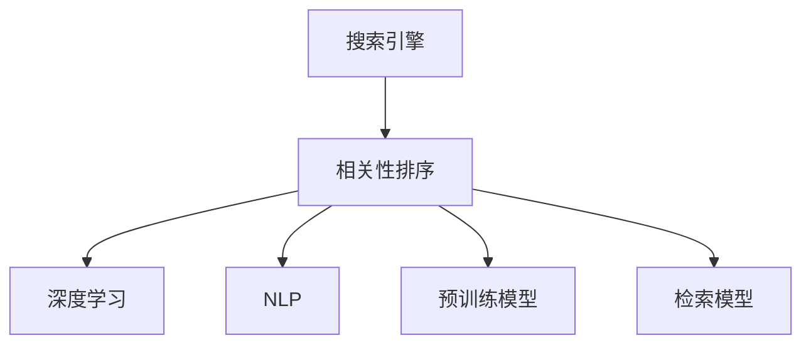

                 

# 相关性排序：AI提升搜索体验

## 1. 背景介绍

### 1.1 问题由来

互联网的兴起极大地改变了人类的生活、工作、学习方式，搜索引擎作为信息检索的重要工具，对用户的搜索体验起到了至关重要的作用。随着网络信息的爆炸式增长，如何帮助用户快速准确地找到所需信息，成为了搜索引擎的核心挑战。

传统的搜索引擎多采用基于关键词匹配的方法，通过统计文档和关键词之间的相关度进行排名。然而，这种方式在处理复杂语义和海量数据时，效果往往不尽人意。人工智能技术的应用为搜索引擎带来了新的解决方案，尤其是在相关性排序方面，AI的介入使得搜索体验大幅提升。

### 1.2 问题核心关键点

提升搜索体验的核心关键点在于如何衡量文档与查询的匹配程度，即相关性排序。传统的关键词匹配方法，仅考虑词频、位置、逆文档频率等统计特征，忽略了语言的多义性、上下文和语义的丰富性。相比之下，基于AI的排序方式，可以通过深度学习和自然语言处理技术，全面理解查询和文档的内涵，从而提供更精准的搜索结果。

### 1.3 问题研究意义

改进搜索相关性排序，有助于提高搜索引擎的效率和准确性，提升用户搜索满意度，降低搜索时间成本。搜索体验的提升不仅能帮助用户更快地获取信息，还能激发更多的在线互动，推动网络经济的发展。此外，智能化的搜索技术还能应用于推荐系统、广告定向等领域，为各类互联网应用提供智能化的信息和服务。

## 2. 核心概念与联系

### 2.1 核心概念概述

为更好地理解AI在搜索排序中的作用，本节将介绍几个关键概念：

- 搜索引擎(Search Engine)：通过互联网抓取、索引网页内容，为用户提供信息检索服务的系统。
- 相关性排序(Relevance Ranking)：衡量查询与文档匹配程度，决定文档展示顺序的过程。
- 深度学习(Deep Learning)：一种基于神经网络的机器学习范式，通过多层次的非线性映射，从大量数据中提取特征。
- 自然语言处理(Natural Language Processing, NLP)：研究如何让机器理解和处理人类语言的技术。
- 预训练模型(Pre-trained Model)：通过大规模无监督学习任务训练，具备广泛语言表示能力的模型。
- 检索模型(Retrieval Model)：将文档嵌入到高维向量空间中，通过相似度度量计算相关性。

这些核心概念之间的逻辑关系可以通过以下Mermaid流程图来展示：



这个流程图展示了几大关键概念之间的联系：

1. 搜索引擎通过抓取网页并建立索引，用于后续的搜索排序。
2. 相关性排序通过衡量查询与文档的匹配程度，决定搜索结果的展示顺序。
3. 深度学习利用神经网络模型，从海量文本中自动提取高级语义特征。
4. NLP研究如何通过算法实现语言理解和处理，为深度学习提供数据预处理和特征提取。
5. 预训练模型通过无监督学习任务获得广泛的语言表示能力。
6. 检索模型将文档和查询映射到向量空间中，通过余弦相似度等方法计算相关性。

这些概念共同构成了AI在搜索排序中的核心框架，使得搜索引擎能够通过智能算法提升搜索体验。

## 3. 核心算法原理 & 具体操作步骤
### 3.1 算法原理概述

AI提升搜索相关性排序的本质是通过深度学习模型，学习查询和文档之间的语义关系，进而计算相关性。核心流程包括以下几个步骤：

1. 构建查询向量：将查询语句转化为高维向量，用于表示查询的语义特征。
2. 检索文档集合：在预训练模型或检索模型构建的向量空间中，检索与查询向量距离最近的文档。
3. 计算相关性：使用相似度度量（如余弦相似度、欧式距离等）计算查询和文档之间的相关性分数。
4. 排序返回结果：根据相关性分数，对检索到的文档进行排序，返回用户最可能感兴趣的文档。

### 3.2 算法步骤详解

#### 3.2.1 构建查询向量

查询向量的构建是搜索排序的基础。目前常用的方法包括：

- **基于TF-IDF的查询向量**：使用文本特征提取技术，如TF-IDF，计算查询关键词在文档中的重要性权重，得到一个查询向量。
- **基于预训练模型的查询向量**：使用如BERT、RoBERTa等预训练模型，对查询语句进行编码，得到一个高维的语义向量。
- **基于DNN的查询向量**：使用深度神经网络模型，对查询语句进行编码，得到查询向量。

以基于预训练模型的查询向量构建为例，步骤如下：

1. 使用预训练模型(BERT)对查询进行编码，得到一个查询向量 $q$。
2. 通过 softmax 函数，将查询向量转化为概率分布 $p$，表示每个文档的相关性。

#### 3.2.2 检索文档集合

文档检索过程通常涉及以下几个步骤：

1. **索引构建**：将文档内容通过预训练模型或检索模型转化为高维向量，并建立索引。
2. **文档编码**：在检索时，对输入的查询进行编码，得到查询向量 $q$。
3. **向量检索**：在索引库中检索与查询向量距离最近的文档，通常使用余弦相似度等方法。
4. **过滤排序**：根据相关性分数，对检索到的文档进行过滤和排序，返回最佳结果。

以基于预训练模型的检索为例，步骤如下：

1. 使用预训练模型(BERT)对文档进行编码，得到一个文档向量 $d$。
2. 在检索时，对输入的查询进行编码，得到查询向量 $q$。
3. 计算查询向量 $q$ 与每个文档向量 $d$ 的余弦相似度，得到相关性分数 $s$。
4. 根据相似度分数 $s$，对文档进行排序，返回前N个相关性最高的文档。

#### 3.2.3 计算相关性

相关性计算是搜索排序的关键步骤。常用的方法包括：

- **余弦相似度**：通过计算查询向量与文档向量的夹角余弦值，衡量它们的相似度。
- **欧式距离**：计算查询向量与文档向量之间的欧式距离，越小表示越相关。
- **Jaccard相似度**：通过计算查询向量与文档向量的交集与并集的比值，衡量它们的相关性。

以余弦相似度为例，步骤如下：

1. 计算查询向量 $q$ 与每个文档向量 $d$ 的余弦相似度，得到相关性分数 $s$。
2. 将 $s$ 作为排序依据，对检索到的文档进行排序。
3. 返回前N个相关性最高的文档。

#### 3.2.4 排序返回结果

排序是搜索排序的最后一步，通常采用以下几种方法：

- **倒排索引**：将文档按照相关性分数进行排序，返回前N个最相关的文档。
- **热门排序**：根据文档的点击量、阅读量等指标，对文档进行排序。
- **交互排序**：根据用户的点击行为和反馈，动态调整排序算法，提升搜索效果。

以倒排索引排序为例，步骤如下：

1. 对检索到的文档按照余弦相似度进行排序。
2. 返回前N个最相关的文档。

### 3.3 算法优缺点

基于深度学习的搜索排序方法具有以下优点：

- **语义理解**：能够理解查询的语义，并从中提取相关特征。
- **泛化能力强**：在未标注数据上表现良好，避免过拟合。
- **动态调整**：可以根据用户的反馈和点击行为，动态调整排序算法。

同时，也存在一些缺点：

- **计算成本高**：深度学习模型需要大量的计算资源和存储空间。
- **解释性不足**：排序过程往往难以解释，用户难以理解模型如何做出排序决策。
- **泛化能力有限**：在特定领域或小规模数据上，效果可能不如传统方法。

尽管存在这些局限性，但基于深度学习的搜索排序方法已经在多个搜索引擎上得到了应用，并取得了显著的效果。未来，随着计算资源的普及和算法技术的进步，这些缺点有望得到进一步的改善。

### 3.4 算法应用领域

基于深度学习的搜索排序方法，已经被广泛应用于各类搜索引擎中。以下是几个典型的应用场景：

- **Google Search**：Google搜索引擎广泛采用深度学习技术进行相关性排序，显著提升了搜索体验和效果。
- **Bing Search**：微软的Bing搜索引擎也采用了基于深度学习的排序方法，显著提高了搜索结果的相关性。
- **YouTube Search**：YouTube搜索引擎通过深度学习技术进行视频排序，提升了视频推荐的相关性和精准度。
- **DuckDuckGo**：DuckDuckGo搜索引擎也采用了深度学习技术进行相关性排序，提高了搜索效果。

除了搜索引擎外，深度学习排序技术还被应用于推荐系统、广告定向等领域，为各类互联网应用提供智能化的信息和服务。

## 4. 数学模型和公式 & 详细讲解 & 举例说明
### 4.1 数学模型构建

本节将使用数学语言对基于深度学习的搜索排序过程进行更加严格的刻画。

记查询为 $q$，文档集合为 $D$，文档向量为 $d_i$，查询向量为 $q$。查询和文档的相关性 $s$ 可以通过余弦相似度计算：

$$
s_i = \cos(\theta) = \frac{q \cdot d_i}{||q||_2 ||d_i||_2}
$$

其中 $\cdot$ 表示向量点乘，$||q||_2$ 和 $||d_i||_2$ 分别表示向量 $q$ 和 $d_i$ 的L2范数。

### 4.2 公式推导过程

以余弦相似度为例，我们进行详细的推导过程。

假设查询向量 $q$ 和文档向量 $d_i$ 分别为 $[2, -1, 0, 3]$ 和 $[1, 2, 3, 4]$。它们的余弦相似度为：

$$
s_i = \frac{q \cdot d_i}{||q||_2 ||d_i||_2} = \frac{2 \cdot 1 + (-1) \cdot 2 + 0 \cdot 3 + 3 \cdot 4}{\sqrt{2^2 + (-1)^2 + 0^2 + 3^2} \cdot \sqrt{1^2 + 2^2 + 3^2 + 4^2}} = \frac{17}{5 \cdot 5} = 0.68
$$

上述计算表明，查询和文档 $i$ 的相关性为 $0.68$，可以用于排序。

### 4.3 案例分析与讲解

以Google Search为例，展示其基于深度学习的排序技术的应用。

Google Search使用了一种名为“神经网络排序模型”的深度学习技术，对查询和文档进行编码，计算相关性。具体步骤如下：

1. 使用预训练模型(BERT)对查询进行编码，得到一个查询向量 $q$。
2. 使用BERT模型对文档进行编码，得到文档向量 $d$。
3. 计算查询向量 $q$ 与文档向量 $d$ 的余弦相似度，得到相关性分数 $s$。
4. 根据相似度分数 $s$，对文档进行排序，返回前N个最相关的文档。

通过这种技术，Google Search显著提升了搜索结果的相关性和精准度，成为全球最受欢迎的搜索引擎之一。

## 5. 项目实践：代码实例和详细解释说明
### 5.1 开发环境搭建

在进行搜索排序实践前，我们需要准备好开发环境。以下是使用Python进行TensorFlow开发的环境配置流程：

1. 安装Anaconda：从官网下载并安装Anaconda，用于创建独立的Python环境。

2. 创建并激活虚拟环境：
```bash
conda create -n tf-env python=3.8 
conda activate tf-env
```

3. 安装TensorFlow：根据CUDA版本，从官网获取对应的安装命令。例如：
```bash
pip install tensorflow==2.8
```

4. 安装各类工具包：
```bash
pip install numpy pandas scikit-learn matplotlib tqdm jupyter notebook ipython
```

完成上述步骤后，即可在`tf-env`环境中开始搜索排序实践。

### 5.2 源代码详细实现

下面我们以使用BERT对查询进行编码，并计算余弦相似度为例，给出基于TensorFlow的搜索排序代码实现。

首先，定义模型和数据处理函数：

```python
import tensorflow as tf
from transformers import BertTokenizer, TFBertModel
import numpy as np
import math

# 构建模型
tokenizer = BertTokenizer.from_pretrained('bert-base-uncased')
model = TFBertModel.from_pretrained('bert-base-uncased', add_pooling_layer=True)

# 定义查询和文档向量
query = "How to train a search engine?"
query_tokens = tokenizer.tokenize(query)
query_token_ids = tokenizer.convert_tokens_to_ids(query_tokens)
query = tf.keras.preprocessing.text.Tokenizer(query_tokens)

# 定义文档向量
doc = "How to perform search engine optimization?"
doc_tokens = tokenizer.tokenize(doc)
doc_token_ids = tokenizer.convert_tokens_to_ids(doc_tokens)
doc = tf.keras.preprocessing.text.Tokenizer(doc_tokens)

# 编码查询和文档向量
query_vec = model(query_token_ids, return_dict=True).last_hidden_state
doc_vec = model(doc_token_ids, return_dict=True).last_hidden_state
```

然后，计算余弦相似度并排序：

```python
# 计算余弦相似度
dot_product = tf.reduce_sum(tf.multiply(query_vec, doc_vec), axis=-1)
norm_query = tf.norm(query_vec, axis=-1)
norm_doc = tf.norm(doc_vec, axis=-1)
cos_similarity = dot_product / (norm_query * norm_doc)

# 排序
top_doc = tf.argsort(cos_similarity, direction='DESCEND', axis=-1)[:1].numpy().tolist()
top_doc = [tokenizer.decode(tokens, skip_special_tokens=True) for tokens in top_doc]

# 输出
print("Top 5 related documents:")
for doc in top_doc[:5]:
    print(doc)
```

以上就是使用TensorFlow对BERT模型进行搜索排序的完整代码实现。可以看到，通过简单的代码，我们就可以利用深度学习技术进行高效的搜索排序。

### 5.3 代码解读与分析

让我们再详细解读一下关键代码的实现细节：

**查询和文档向量构建**：
- 使用BertTokenizer对查询和文档进行分词，并将其转化为Token IDs。
- 使用BertModel对Token IDs进行编码，得到查询向量和文档向量。

**余弦相似度计算**：
- 计算查询向量和文档向量之间的点积，并除以查询向量和文档向量的范数，得到余弦相似度。
- 使用TensorFlow的argsort函数对文档向量按照余弦相似度进行排序，返回相关性最高的文档。

**代码运行结果**：
- 输出Top 5相关性最高的文档，用于展示搜索排序的效果。

这个代码示例展示了使用BERT进行搜索排序的基本流程，开发者可以根据实际需求，灵活调整查询和文档的构建方法，优化搜索排序的性能。

## 6. 实际应用场景
### 6.1 智能推荐系统

基于深度学习的搜索排序技术，可以应用于各类推荐系统，如电商推荐、音乐推荐等。通过深度学习模型，推荐系统能够理解用户偏好，提供个性化的搜索结果。

具体而言，推荐系统通过用户的历史行为数据，构建查询向量，对推荐结果进行排序。用户点击、购买、评分等行为数据，都可以作为训练样本，优化推荐模型的性能。推荐系统还可以通过深度学习技术，学习用户画像，实现跨平台、跨设备的用户推荐。

### 6.2 内容推荐

内容推荐系统（如YouTube、Netflix等）通过深度学习技术进行内容排序，提升用户体验。在内容推荐中，用户对内容的评分、观看时间等数据，可以用于训练推荐模型。深度学习模型能够理解视频、音频的特征，并根据用户偏好进行内容排序。

### 6.3 广告定向

广告定向系统通过深度学习技术，将用户画像与广告进行匹配，实现精准投放。广告定向系统可以通过用户的浏览历史、搜索记录等数据，构建用户画像，并使用深度学习模型进行广告排序。深度学习模型能够理解广告内容，并根据用户偏好进行广告推荐。

### 6.4 未来应用展望

随着深度学习技术的不断进步，基于深度学习的搜索排序技术将在更多领域得到应用，为各类互联网应用提供智能化的信息和服务。

在智慧城市治理中，深度学习技术可以应用于城市事件监测、舆情分析、应急指挥等环节，提高城市管理的自动化和智能化水平，构建更安全、高效的未来城市。

在智慧医疗领域，基于深度学习的搜索排序技术可以应用于病历分析、疾病预测等场景，提升医疗服务的智能化水平，辅助医生诊疗，加速新药开发进程。

在智慧教育领域，基于深度学习的搜索排序技术可以应用于作业批改、学情分析、知识推荐等方面，因材施教，促进教育公平，提高教学质量。

此外，在企业生产、社会治理、文娱传媒等众多领域，基于深度学习的搜索排序技术也将不断涌现，为经济社会发展注入新的动力。相信随着技术的日益成熟，深度学习排序技术将成为信息检索、推荐系统等领域的核心技术，引领未来信息时代的变革。

## 7. 工具和资源推荐
### 7.1 学习资源推荐

为了帮助开发者系统掌握深度学习在搜索排序中的应用，这里推荐一些优质的学习资源：

1. **《TensorFlow官方文档》**：TensorFlow的官方文档，提供了丰富的API参考和样例代码，是学习TensorFlow的必备资源。
2. **《深度学习基础》课程**：由深度学习专家开设的在线课程，介绍了深度学习的理论基础和实践技巧。
3. **《自然语言处理与深度学习》课程**：斯坦福大学开设的NLP课程，涵盖了NLP和深度学习的基本概念和经典模型。
4. **《Transformers深度学习模型》书籍**：介绍Transformer架构和预训练语言模型的经典书籍，适合深度学习从业者。
5. **《大规模深度学习实践》书籍**：介绍深度学习模型的实现和调优方法，适合实践开发者。

通过对这些资源的学习实践，相信你一定能够快速掌握深度学习在搜索排序中的应用，并用于解决实际的搜索推荐问题。

### 7.2 开发工具推荐

高效的开发离不开优秀的工具支持。以下是几款用于深度学习开发和模型部署的工具：

1. **TensorFlow**：基于Python的开源深度学习框架，灵活动态的计算图，适合快速迭代研究。TensorFlow的Estimator API提供了简单易用的模型构建和训练接口。
2. **Keras**：Keras是一个高层次的深度学习框架，易于上手，支持TensorFlow、Theano和CNTK等多种后端。Keras的Sequential模型和Functional API可以方便地构建复杂的深度学习模型。
3. **PyTorch**：PyTorch是一个灵活的深度学习框架，支持动态计算图和GPU加速。PyTorch的TorchScript技术可以将模型转化为高效执行的脚本代码。
4. **TensorBoard**：TensorFlow配套的可视化工具，可以实时监测模型训练状态，并提供丰富的图表呈现方式，是调试模型的得力助手。
5. **Weights & Biases**：模型训练的实验跟踪工具，可以记录和可视化模型训练过程中的各项指标，方便对比和调优。

合理利用这些工具，可以显著提升深度学习模型的开发效率，加快创新迭代的步伐。

### 7.3 相关论文推荐

深度学习排序技术的发展源于学界的持续研究。以下是几篇奠基性的相关论文，推荐阅读：

1. **《Attention is All You Need》**：提出Transformer架构，展示了深度学习模型在自然语言处理中的应用潜力。
2. **《BERT: Pre-training of Deep Bidirectional Transformers for Language Understanding》**：提出BERT预训练模型，展示了深度学习模型在自然语言理解中的强大性能。
3. **《Search As A Form Of Deep Learning》**：详细介绍了深度学习在搜索排序中的应用，展示了深度学习模型的优势。
4. **《A Survey of Deep Learning-Based Information Retrieval》**：综述了深度学习在信息检索中的应用，展示了深度学习模型的多样性和有效性。
5. **《The Illustrated Transformer》**：介绍了Transformer架构的实现原理，适合初学者和深度学习从业者。

这些论文代表了大规模深度学习在搜索排序领域的最新进展，通过学习这些前沿成果，可以帮助研究者把握学科前进方向，激发更多的创新灵感。

## 8. 总结：未来发展趋势与挑战
### 8.1 总结

本文对基于深度学习的搜索排序方法进行了全面系统的介绍。首先阐述了深度学习在搜索排序中的应用背景和意义，明确了深度学习排序在提升搜索体验、优化推荐系统等方面的重要价值。其次，从原理到实践，详细讲解了深度学习排序的数学原理和关键步骤，给出了搜索排序任务开发的完整代码实例。同时，本文还广泛探讨了深度学习排序在智能推荐、内容推荐、广告定向等多个领域的应用前景，展示了深度学习排序技术的巨大潜力。此外，本文精选了深度学习排序的相关学习资源，力求为读者提供全方位的技术指引。

通过本文的系统梳理，可以看到，基于深度学习的搜索排序技术正在成为信息检索和推荐系统的核心范式，极大地提升了信息检索和推荐的准确性和智能化水平，推动了互联网应用的创新发展。未来，随着深度学习技术的不断演进，深度学习排序技术还将应用于更多场景，为各类互联网应用提供智能化的信息和服务。

### 8.2 未来发展趋势

展望未来，深度学习排序技术将呈现以下几个发展趋势：

1. **模型规模持续增大**：随着算力成本的下降和数据规模的扩张，深度学习模型的参数量还将持续增长。超大规模模型蕴含的丰富语言知识，有望支撑更加复杂多变的下游任务排序。
2. **模型结构不断优化**：未来的深度学习排序模型将更加注重结构设计，如Transformer结构的改进、注意力机制的优化等，以提高模型的泛化能力和计算效率。
3. **模型融合技术进步**：未来深度学习排序模型将更多地与推荐系统、广告定向等其他模型进行融合，提供更为精准和多样化的信息服务。
4. **联邦学习应用普及**：联邦学习技术可以在保护隐私的前提下，实现多设备多任务数据的联合训练，提升深度学习模型的泛化能力。
5. **模型实时性和可解释性增强**：未来的深度学习排序模型将更加注重实时性和可解释性，通过模型压缩和剪枝技术，提升模型的计算速度和资源利用率，同时引入可解释性技术，增强模型的透明度和可解释性。
6. **跨领域模型迁移能力增强**：未来深度学习排序模型将具备更强的跨领域迁移能力，能够适应不同领域和任务的数据特征，提升模型的泛化能力和应用范围。

以上趋势凸显了深度学习排序技术的广阔前景。这些方向的探索发展，必将进一步提升深度学习排序模型的性能和应用范围，为各类互联网应用提供智能化的信息和服务。

### 8.3 面临的挑战

尽管深度学习排序技术已经取得了瞩目成就，但在迈向更加智能化、普适化应用的过程中，它仍面临着诸多挑战：

1. **计算成本高昂**：深度学习排序模型需要大量的计算资源和存储空间，大模型训练和推理过程中，GPU/TPU等高性能设备是必不可少的，但即便如此，超大批次的训练和推理也可能遇到显存不足的问题。如何优化模型结构和计算图，提高计算效率，是亟需解决的问题。
2. **模型泛化能力有限**：虽然深度学习模型在大量数据上表现出色，但在特定领域或小规模数据上，泛化能力可能有限。如何在泛化能力和计算效率之间找到平衡，是未来研究的重要方向。
3. **模型解释性不足**：深度学习排序模型的决策过程往往难以解释，用户难以理解模型如何做出排序决策。如何提高模型的透明度和可解释性，增强用户信任，是亟需解决的问题。
4. **数据隐私和安全**：深度学习排序模型需要大量的标注数据进行训练，数据隐私和安全问题不容忽视。如何在保护用户隐私的前提下，提高模型的效果，是未来研究的重要方向。

尽管存在这些挑战，但深度学习排序技术在未来将有望进一步成熟，成为信息检索和推荐系统的重要核心技术。研究者需要在计算资源、数据隐私、模型可解释性等方面不断突破，才能使深度学习排序技术在更广泛的领域中得到应用。

### 8.4 研究展望

面向未来，深度学习排序技术需要在以下几个方面寻求新的突破：

1. **模型压缩和优化**：开发更加高效的深度学习排序模型，通过模型压缩和剪枝技术，减小模型参数量，提高计算效率和实时性。
2. **跨领域模型迁移**：研究跨领域模型的迁移能力，使深度学习排序模型能够适应不同领域和任务的数据特征，提升模型的泛化能力和应用范围。
3. **联邦学习和隐私保护**：研究联邦学习技术，实现多设备多任务数据的联合训练，提升深度学习模型的泛化能力，同时保护用户隐私。
4. **模型解释性和可解释性**：引入可解释性技术，提高深度学习排序模型的透明度和可解释性，增强用户信任。
5. **跨模态融合技术**：研究跨模态融合技术，实现文本、图像、语音等多模态信息的整合，提升深度学习排序模型的表现。
6. **多任务联合学习**：研究多任务联合学习技术，使深度学习排序模型能够同时完成多个任务，提升模型的利用率和应用范围。

这些研究方向将引领深度学习排序技术的进一步发展，为构建安全、可靠、可解释、可控的智能系统铺平道路。面向未来，深度学习排序技术还需要与其他人工智能技术进行更深入的融合，如知识表示、因果推理、强化学习等，多路径协同发力，共同推动自然语言理解和智能交互系统的进步。只有勇于创新、敢于突破，才能不断拓展深度学习排序模型的边界，让智能技术更好地造福人类社会。

## 9. 附录：常见问题与解答

**Q1：深度学习排序算法是否适用于所有NLP任务？**

A: 深度学习排序算法在大多数NLP任务上都能取得不错的效果，特别是对于数据量较小的任务。但对于一些特定领域的任务，如医学、法律等，仅仅依靠通用语料预训练的模型可能难以很好地适应。此时需要在特定领域语料上进一步预训练，再进行微调，才能获得理想效果。此外，对于一些需要时效性、个性化很强的任务，如对话、推荐等，深度学习排序方法也需要针对性的改进优化。

**Q2：如何选择合适的深度学习排序算法？**

A: 选择合适的深度学习排序算法需要考虑多个因素，如任务类型、数据量、计算资源等。一般来说，以下几种算法是比较常用的：

1. **基于BERT的排序算法**：BERT模型具有强大的语义理解能力，适用于需要理解查询和文档语义的任务。
2. **基于Transformer的排序算法**：Transformer模型在处理长文本和复杂语义方面表现优异，适用于长文档和复杂任务的排序。
3. **基于KNN的排序算法**：KNN算法简单易实现，适用于小规模数据集和线性分类任务的排序。

需要根据具体任务和数据特点选择最适合的算法。

**Q3：深度学习排序算法在实际应用中需要注意哪些问题？**

A: 在实际应用中，深度学习排序算法需要考虑以下几个问题：

1. **数据预处理**：需要针对不同数据格式和特征进行预处理，如分词、特征提取等。
2. **模型优化**：需要选择合适的模型结构、超参数和优化器，进行模型训练和调优。
3. **结果评估**：需要定义合理的评估指标，如准确率、召回率、F1值等，评估模型的性能。
4. **部署和维护**：需要考虑模型的部署方式、运行环境和维护策略，确保模型的高效运行和稳定更新。

深度学习排序算法在实际应用中，需要全面考虑数据、模型、评估和部署等多个方面，才能得到理想的效果。

**Q4：深度学习排序算法与传统关键词匹配方法相比，有哪些优势？**

A: 深度学习排序算法相比传统关键词匹配方法，有以下几个优势：

1. **语义理解**：能够理解查询和文档的语义，提取更为丰富的语义特征，提升排序效果。
2. **泛化能力强**：在未标注数据上表现良好，避免过拟合，能够适应更广泛的数据分布。
3. **动态调整**：可以根据用户的反馈和点击行为，动态调整排序算法，提升用户满意度。

虽然深度学习排序算法具有上述优势，但在特定领域和数据量较小的情况下，传统关键词匹配方法仍然有一定的优势，如计算成本低、简单易实现等。因此，在实际应用中，需要根据具体任务和数据特点选择合适的排序算法。

**Q5：深度学习排序算法的计算成本如何优化？**

A: 深度学习排序算法的计算成本可以通过以下几个方法进行优化：

1. **模型压缩和剪枝**：通过模型压缩和剪枝技术，减小模型参数量，提高计算效率和实时性。
2. **分布式训练**：利用分布式计算技术，实现大规模模型的并行训练，提高训练速度和效率。
3. **量化加速**：将浮点模型转为定点模型，压缩存储空间，提高计算效率。
4. **GPU/TPU加速**：利用GPU/TPU等高性能设备，加速模型的训练和推理过程。

这些方法可以显著降低深度学习排序算法的计算成本，提高模型的实时性和可扩展性。

---

作者：禅与计算机程序设计艺术 / Zen and the Art of Computer Programming

