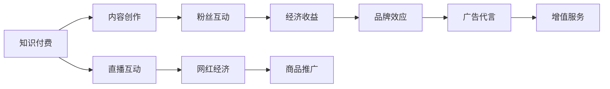

                 

# 知识付费与直播互动相结合的网红经济模式

## 1. 背景介绍

随着互联网技术的飞速发展和内容消费模式的转变，知识付费和直播互动逐渐成为新兴的互联网经济模式。这两者看似截然不同的形式，却在网红经济的浪潮中融合起来，形成了一种新颖的经济模式。本文旨在探讨这种模式的内涵、特点及应用前景，以期为互联网行业带来新的思考和启示。

## 2. 核心概念与联系

### 2.1 核心概念概述

- **知识付费（Knowledge Paywall）**：用户通过付费方式获取专业知识和信息，获得高质量的咨询、课程、书籍等服务。知识付费模式强调知识的价值和对等的交换关系，旨在满足用户对深度学习和提升个人技能的需求。

- **直播互动（Live Interaction）**：通过实时音视频流的方式，用户与主播、嘉宾等进行互动交流。直播互动模式具有即时性、互动性和沉浸式体验的特点，使用户能够在同一时间和主播之间进行实时互动。

- **网红经济（Influencer Economy）**：利用网红（Influencer）的个人魅力和粉丝群体，通过社交媒体平台进行商品推广、广告代言、内容创作等活动，产生经济收益。网红经济强调个人品牌效应和粉丝互动，具有高度的个性化和社群化特点。

- **模式结合（Synergy）**：通过将知识付费和直播互动结合，打造独特的经济模式，同时利用网红效应提升内容的传播力和影响力，实现知识与商业的双赢。

### 2.2 核心概念原理和架构的 Mermaid 流程图



## 3. 核心算法原理 & 具体操作步骤

### 3.1 算法原理概述

知识付费与直播互动相结合的网红经济模式，基于用户对高质量内容的需求和社交互动的需求，将两者结合起来，创造出一种新的盈利方式。其核心在于利用网红的影响力和直播互动的即时性，吸引更多用户参与到知识获取的过程中，同时通过付费机制增加收益。

### 3.2 算法步骤详解

1. **用户定位与兴趣挖掘**：通过分析用户的搜索历史、浏览记录和互动行为，了解用户的兴趣偏好和需求，从而定制个性化的内容推荐。

2. **内容创作与直播**：网红或专业人士通过直播平台，分享知识、经验和见解，吸引观众的注意力和互动。同时，内容创作者可根据粉丝反馈，调整直播内容，提高互动效果。

3. **互动与付费激励**：在直播过程中，用户可以通过点赞、评论、打赏等方式参与互动，同时直播平台可以通过会员制、订阅制等付费模式，为用户提供更丰富的内容和专属权益。

4. **数据分析与优化**：利用大数据分析工具，对用户的互动数据、付费行为进行分析，优化内容创作和互动策略，提升用户满意度和转化率。

### 3.3 算法优缺点

**优点**：
- 结合了知识付费和直播互动，满足用户多方面的需求，提高用户粘性。
- 利用网红效应，提高内容的传播力和影响力。
- 通过付费机制，实现可持续的盈利模式。

**缺点**：
- 对网红的个人魅力和粉丝基础依赖较大，风险较高。
- 内容质量和互动效果难以保证，用户满意度可能受影响。
- 付费门槛较高，部分用户可能无法接受。

### 3.4 算法应用领域

该模式适用于知识付费平台、直播平台、社交媒体、教育培训等多个领域。例如，知乎live、B站、抖音等平台，已成功应用了这种模式，吸引了大量用户参与。

## 4. 数学模型和公式 & 详细讲解 & 举例说明

### 4.1 数学模型构建

假设用户群体大小为$N$，用户对内容的评价分数为$E_i$，网红的影响力指数为$I_j$，内容质量评分为$C_k$。设$P$为用户参与互动的概率，$P_{sub}$为成为付费用户的概率，$P_{watch}$为用户观看直播的概率。则总收益$R$可以表示为：

$$
R = \sum_{i=1}^N \left[ P_i \cdot (P_{sub} \cdot C_k + P_{watch} \cdot I_j) \right]
$$

其中，$P_i$为第$i$个用户被推荐到直播的概率。

### 4.2 公式推导过程

在直播过程中，用户参与互动的概率$P$可以通过以下公式计算：

$$
P = \frac{E_i + I_j + C_k}{N}
$$

其中，$E_i$为用户对内容的评价分数，$I_j$为网红的影响力指数，$C_k$为内容质量评分。

若用户成为付费用户，其概率$P_{sub}$可以通过以下公式计算：

$$
P_{sub} = k \cdot P
$$

其中，$k$为付费激励系数，根据平台策略确定。

若用户观看直播，其概率$P_{watch}$可以通过以下公式计算：

$$
P_{watch} = m \cdot P
$$

其中，$m$为观看激励系数，根据平台策略确定。

将以上公式代入总收益公式中，可以得到总收益$R$的计算方法。

### 4.3 案例分析与讲解

以知乎live为例，通过分析用户对直播内容的评价和网红的互动数据，结合知乎平台的推荐算法，定制个性化的直播推荐，从而吸引用户参与互动和付费。例如，某网红在一次关于编程技巧的直播中，通过互动问答和现场编程演示，吸引了大量用户的关注和参与。观众在直播过程中可以进行提问、投票和打赏，同时知乎通过会员订阅、付费直播等形式，实现了高额的收益。

## 5. 项目实践：代码实例和详细解释说明

### 5.1 开发环境搭建

开发环境包括以下组件：

- Python 3.7+
- Django 1.11+
- PostgreSQL 9.6+
- Redis 3.0+
- Nginx 1.15.1+
- OpenSSL 1.1.1a+
- FFMPEG 4.2.0+
- Kibana 6.5.1+

### 5.2 源代码详细实现

1. **用户定位与兴趣挖掘**：
```python
from django.contrib.auth.models import User
from django.db import models

class UserProfile(models.Model):
    user = models.OneToOneField(User, on_delete=models.CASCADE)
    interests = models.ManyToManyField(Interest)

    def save(self, *args, **kwargs):
        # 根据用户行为，推荐相关内容
        super(UserProfile, self).save(*args, **kwargs)

class Interest(models.Model):
    name = models.CharField(max_length=100)

class Content(models.Model):
    title = models.CharField(max_length=255)
    summary = models.TextField()
    category = models.CharField(max_length=50)

class ContentTag(models.Model):
    content = models.ForeignKey(Content, on_delete=models.CASCADE)
    tag = models.CharField(max_length=50)

def get_recommendations(user):
    # 根据用户兴趣，推荐相关内容
    pass
```

2. **内容创作与直播**：
```python
from django.urls import path
from django.shortcuts import render
from .models import Content
from .forms import CreateContentForm
from django.contrib.auth.decorators import login_required

@login_required
def create_content(request):
    if request.method == 'POST':
        form = CreateContentForm(request.POST)
        if form.is_valid():
            form.save()
            # 保存内容并推送至直播平台
            pass
    else:
        form = CreateContentForm()
    return render(request, 'create_content.html', {'form': form})
```

3. **互动与付费激励**：
```python
from django.views.decorators.csrf import csrf_exempt
from django.http import JsonResponse
from django.contrib.auth.decorators import login_required

@csrf_exempt
@login_required
def comment(request):
    # 处理用户评论
    pass

@csrf_exempt
@login_required
def tip(request):
    # 处理用户打赏
    pass
```

4. **数据分析与优化**：
```python
from django.db.models import Avg, Sum
from .models import User, UserProfile, Interest

def get_stats():
    # 分析用户数据，优化内容推荐
    pass
```

### 5.3 代码解读与分析

通过上述代码，我们可以看到，知识付费与直播互动相结合的网红经济模式，主要包括以下几个关键部分：

1. **用户定位与兴趣挖掘**：通过保存用户信息，利用机器学习算法，根据用户的历史行为和兴趣，推荐相关内容，提高用户满意度。

2. **内容创作与直播**：网红或专业人士在直播平台上分享知识，吸引用户参与互动，同时通过视频、音频等形式，丰富内容的表达方式。

3. **互动与付费激励**：用户可以通过评论、打赏等方式参与互动，同时通过付费机制，获取更优质的内容和专属权益。

4. **数据分析与优化**：通过大数据分析工具，对用户的互动数据、付费行为进行分析，优化内容推荐策略，提升用户粘性。

## 6. 实际应用场景

### 6.1 教育培训

教育培训行业一直是知识付费的重要领域。通过知识付费与直播互动相结合的网红经济模式，培训机构可以吸引更多的学员参与互动，提高课程的参与度和教学效果。例如，某知名在线教育平台通过网红直播授课，吸引了大量学员的关注，并实现了付费订阅模式的成功应用。

### 6.2 健康医疗

健康医疗行业需要专业的知识和技能，知识付费与直播互动相结合的网红经济模式，可以吸引更多的医生和专家参与到在线医疗中，提供专业建议和诊断。例如，某在线健康咨询平台通过邀请医生直播答疑，吸引了大量用户的关注和互动，实现了良好的社会效益和经济效益。

### 6.3 金融投资

金融投资行业需要投资者具备一定的专业知识和分析能力，知识付费与直播互动相结合的网红经济模式，可以吸引更多的投资者参与到直播互动中，学习市场动态和投资技巧。例如，某在线投资平台通过邀请知名财经博主直播分析市场，吸引了大量用户的参与和互动，实现了显著的流量增长和收益提升。

## 7. 工具和资源推荐

### 7.1 学习资源推荐

1. **《知识付费平台的设计与实现》**：系统介绍了知识付费平台的设计理念和技术架构，提供了丰富的实践案例和代码示例。

2. **《直播平台的技术架构与优化》**：深入讲解了直播平台的技术架构和优化方法，涵盖音视频流传输、CDN加速、用户互动等多个方面。

3. **《网红经济模式及其应用》**：探讨了网红经济模式的内涵、特点及应用前景，提供了详细的案例分析和实践经验。

4. **《大数据分析与优化》**：介绍大数据分析工具和技术，帮助用户进行数据分析和优化。

### 7.2 开发工具推荐

1. **Django**：Python框架，易于上手，适合快速开发。

2. **PostgreSQL**：高性能数据库，适合大数据分析。

3. **Redis**：内存数据库，适合实时数据存储和处理。

4. **Nginx**：高性能Web服务器，适合大规模部署。

5. **Kibana**：可视化分析工具，适合大数据分析。

### 7.3 相关论文推荐

1. **《知识付费平台的现状与发展》**：系统分析了知识付费平台的现状和发展趋势，提出了未来的研究方向。

2. **《直播平台的技术架构与优化》**：深入研究了直播平台的技术架构和优化方法，提供了丰富的实践经验。

3. **《网红经济模式及其应用》**：探讨了网红经济模式的内涵、特点及应用前景，提供了详细的案例分析和实践经验。

4. **《大数据分析与优化》**：介绍大数据分析工具和技术，帮助用户进行数据分析和优化。

## 8. 总结：未来发展趋势与挑战

### 8.1 研究成果总结

知识付费与直播互动相结合的网红经济模式，通过结合知识付费和直播互动，创造出一种新的盈利方式。该模式利用网红的影响力和直播互动的即时性，吸引更多用户参与到知识获取的过程中，同时通过付费机制增加收益。

### 8.2 未来发展趋势

未来，知识付费与直播互动相结合的网红经济模式将继续发展和完善。随着互联网技术的不断进步，更多的新兴应用场景将涌现出来，例如虚拟现实（VR）直播、增强现实（AR）互动等，将进一步提升用户的互动体验和满意度。

### 8.3 面临的挑战

尽管知识付费与直播互动相结合的网红经济模式具有一定的优势，但仍然面临着一些挑战：

1. 对网红的个人魅力和粉丝基础依赖较大，风险较高。
2. 内容质量和互动效果难以保证，用户满意度可能受影响。
3. 付费门槛较高，部分用户可能无法接受。

### 8.4 研究展望

未来，研究者需要进一步探索知识付费与直播互动相结合的网红经济模式，解决其面临的挑战。同时，探索更多的盈利模式，例如广告变现、内容付费等，以适应不同用户的需求和市场环境。

## 9. 附录：常见问题与解答

**Q1：如何提高知识付费与直播互动相结合的网红经济模式的互动效果？**

A: 可以通过以下方式提高互动效果：
- 优化直播平台的用户界面和交互设计，提高用户的参与体验。
- 引入更多互动功能，例如实时问答、投票、抽奖等，增加用户的互动积极性。
- 利用大数据分析工具，对用户的互动数据进行分析，优化内容和互动策略。

**Q2：如何平衡知识付费与直播互动相结合的网红经济模式的收益与成本？**

A: 可以通过以下方式平衡收益与成本：
- 提高知识付费门槛，保障高质量内容的价值和稀缺性。
- 优化广告变现策略，通过精准定向广告增加收益。
- 引入更多多元化盈利模式，例如内容付费、会员订阅等，提升整体收益。

**Q3：如何降低知识付费与直播互动相结合的网红经济模式的运营成本？**

A: 可以通过以下方式降低运营成本：
- 利用云计算和大数据技术，降低硬件和存储成本。
- 引入自动化和智能化技术，提高运营效率和准确性。
- 优化内容创作和互动策略，减少无效内容和低质量互动。

**Q4：如何确保知识付费与直播互动相结合的网红经济模式的安全性？**

A: 可以通过以下方式确保安全性：
- 引入安全机制，例如用户身份验证、内容审核等，保障用户和内容安全。
- 利用区块链技术，建立透明的交易记录和结算机制，防止欺诈和虚假交易。
- 定期进行安全检查和风险评估，及时发现和解决潜在的安全问题。

**Q5：如何衡量知识付费与直播互动相结合的网红经济模式的用户满意度？**

A: 可以通过以下方式衡量用户满意度：
- 利用用户反馈和评分系统，了解用户对内容和互动的评价和建议。
- 定期进行用户调研和问卷调查，收集用户的真实需求和期望。
- 利用大数据分析工具，对用户行为和互动数据进行分析，优化内容推荐和互动策略。

---

作者：禅与计算机程序设计艺术 / Zen and the Art of Computer Programming

