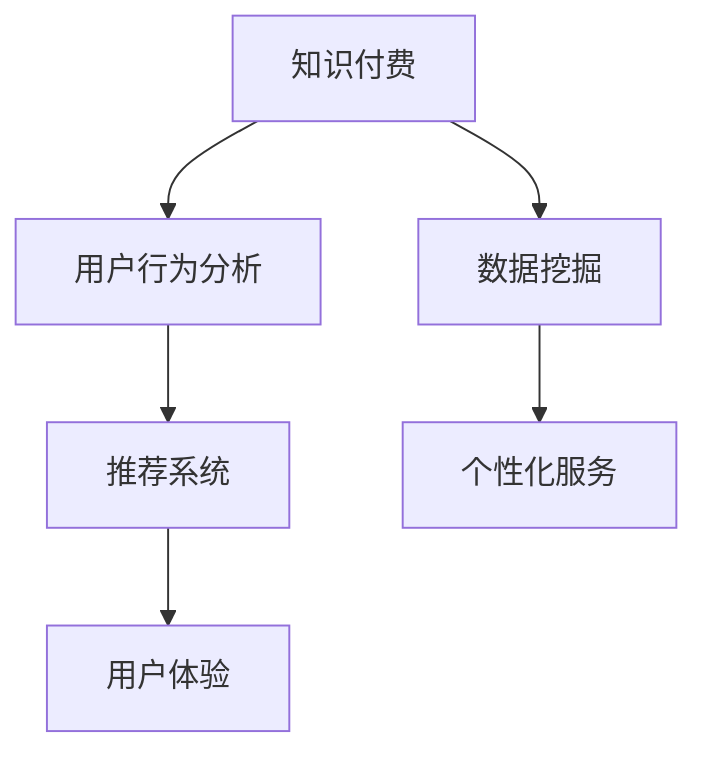

                 

# 知识付费创业中的用户行为分析与应用

> 关键词：知识付费、用户行为分析、数据挖掘、推荐系统、个性化服务、用户体验

## 1. 背景介绍

### 1.1 问题由来
随着互联网的发展和知识的普及，知识付费逐渐成为现代人获取知识的重要方式。无论是在线课程、电子书、音频播客，还是专家咨询、数据分析等服务，都为用户提供了丰富的学习资源。然而，如何在知识付费领域取得成功，却是一个亟待解决的问题。

首先，知识付费市场竞争激烈，如何从众多产品中脱颖而出，需要深入理解用户行为，精准定位用户需求。其次，知识付费服务通常涉及高价值内容，如何保证内容质量和用户满意度，需要有效的用户行为分析。最后，用户支付意愿低下，如何提高用户转化率和粘性，需要精细化的运营策略。

### 1.2 问题核心关键点
本文将围绕知识付费创业中的用户行为分析与应用，探讨如何通过数据挖掘和机器学习技术，深入理解用户行为模式，提升服务质量，增强用户粘性，从而在知识付费领域取得成功。

## 2. 核心概念与联系

### 2.1 核心概念概述

为更好地理解知识付费领域中的用户行为分析与应用，本节将介绍几个密切相关的核心概念：

- **知识付费(Knowledge Pay):** 用户为获取高质量知识内容而支付费用的商业模式。常见的形式包括在线课程、电子书、专家咨询等。

- **用户行为分析(User Behavior Analysis):** 通过分析用户在知识付费平台上的行为数据，挖掘用户兴趣、需求和偏好，为个性化推荐、营销策略等提供支持。

- **数据挖掘(Data Mining):** 从大量数据中发现潜在的有价值信息和知识的过程。常用于用户行为分析，识别用户兴趣模式和行为规律。

- **推荐系统(Recommendation System):** 根据用户历史行为和偏好，为用户推荐相关内容的系统。推荐系统能够提高用户满意度，增强用户粘性。

- **个性化服务(Personalized Service):** 针对用户个性化需求提供定制化服务，提升用户体验。

- **用户体验(User Experience):** 用户在使用产品或服务时的主观感受，包括可用性、易用性、满意度和忠诚度等。

这些核心概念之间的逻辑关系可以通过以下Mermaid流程图来展示：



这个流程图展示了这个体系的核心概念及其之间的关系：

1. 知识付费平台通过数据挖掘获取用户行为数据。
2. 基于用户行为数据，通过推荐系统提供个性化服务，提升用户体验。
3. 个性化服务进一步提升用户体验，增强用户粘性。

## 3. 核心算法原理 & 具体操作步骤
### 3.1 算法原理概述

知识付费创业中的用户行为分析与应用，本质上是一个通过数据挖掘和机器学习技术，对用户行为进行分析和预测的过程。其核心思想是：利用用户历史行为数据，挖掘用户的兴趣模式、行为规律和潜在需求，构建用户画像，然后基于用户画像进行个性化推荐，提高用户满意度和转化率。

形式化地，假设用户行为数据为 $\{(x_i, y_i)\}_{i=1}^N$，其中 $x_i$ 表示用户行为特征向量，$y_i$ 表示用户行为标签，如购买行为、浏览行为等。则用户行为分析的目标是找到模型 $f(x)$，使其能够准确预测用户行为标签 $y$。

一般采用监督学习算法，如线性回归、逻辑回归、决策树、随机森林、梯度提升树等，对用户行为数据进行训练和预测。其基本流程如下：

1. 收集用户行为数据，进行预处理和特征工程。
2. 选择合适的模型，进行训练和调参。
3. 应用训练好的模型，对新用户行为进行预测。
4. 根据预测结果，进行个性化推荐和用户行为干预。

### 3.2 算法步骤详解

具体而言，知识付费创业中的用户行为分析与应用，可以分为以下几个关键步骤：

**Step 1: 数据收集与预处理**
- 收集知识付费平台上的用户行为数据，包括用户的浏览记录、购买记录、搜索记录、评价记录等。
- 对数据进行清洗和归一化，去除重复和噪声数据，生成高质量的特征向量。

**Step 2: 特征工程**
- 设计并提取有意义的特征，如用户的浏览时长、购买频率、学习路径等。
- 对特征进行降维、归一化等预处理，降低数据维度，提升模型训练效率。

**Step 3: 模型训练与调参**
- 选择合适的机器学习算法，如随机森林、梯度提升树等。
- 对模型进行训练，选择适当的超参数，如树深度、决策树数量等。
- 使用交叉验证等技术，评估模型性能，进行调参优化。

**Step 4: 用户行为预测**
- 将新用户行为数据输入训练好的模型，进行行为预测。
- 输出用户行为标签，如是否购买、是否浏览某个课程等。

**Step 5: 个性化推荐**
- 基于用户行为预测结果，进行个性化推荐。
- 推荐用户可能感兴趣的课程、电子书、专家咨询等内容，提升用户满意度和转化率。

**Step 6: 用户行为干预**
- 根据用户行为预测结果，进行用户行为干预。
- 如发送个性化的课程推荐邮件、推送相关内容的通知等，提高用户粘性。

### 3.3 算法优缺点

基于知识付费的用户行为分析与应用，具有以下优点：

1. 提升用户体验：通过个性化推荐，满足用户个性化需求，提升用户体验。
2. 提高转化率：精准推荐用户可能感兴趣的内容，提高用户购买意愿和转化率。
3. 增强用户粘性：通过定期推荐和行为干预，提高用户活跃度和粘性。
4. 降低运营成本：精准营销和个性化服务，减少无效推广和资源浪费。

同时，该方法也存在一定的局限性：

1. 数据质量要求高：模型效果依赖于高质量、标注完整的数据，数据质量不高可能导致预测准确度低。
2. 模型复杂度高：选择合适的模型和参数需要耗费大量时间和资源。
3. 用户隐私风险：大量用户行为数据的收集和处理，可能带来用户隐私风险。
4. 泛化能力有限：不同用户的兴趣和行为模式差异大，模型泛化能力有限。

尽管存在这些局限性，但就目前而言，基于知识付费的用户行为分析与应用，仍是提升用户满意度和转化率的有效手段。未来相关研究的重点在于如何进一步降低数据收集的难度和成本，提高模型的泛化能力，同时兼顾用户隐私和数据安全。

### 3.4 算法应用领域

基于知识付费的用户行为分析与应用，已经在多个领域得到了广泛的应用，例如：

- 在线教育：推荐用户感兴趣的在线课程、电子书、视频等学习资源，提高学习效果和满意度。
- 专家咨询：根据用户咨询历史，推荐相关领域的专家和内容，提供专业建议和解决方案。
- 内容推荐：根据用户浏览和搜索记录，推荐相关内容，提高用户粘性和平台流量。
- 广告投放：通过用户行为数据，精准投放广告，提升广告效果和用户转化率。

除了上述这些经典应用外，知识付费的用户行为分析与应用还被创新性地应用到更多场景中，如用户留存分析、课程评价分析、推荐系统优化等，为知识付费平台提供了更加精准的运营支持。

## 4. 数学模型和公式 & 详细讲解  
### 4.1 数学模型构建

本节将使用数学语言对知识付费领域中的用户行为分析与应用进行更加严格的刻画。

假设用户行为数据为 $\{(x_i, y_i)\}_{i=1}^N$，其中 $x_i$ 表示用户行为特征向量，$y_i$ 表示用户行为标签，如购买行为、浏览行为等。定义用户行为预测模型为 $f(x)$，则用户行为分析的目标是找到最优的模型参数 $\theta$，使得预测结果 $\hat{y}$ 与真实标签 $y$ 之间的误差最小化。常用的评价指标包括均方误差(MSE)、均方根误差(RMSE)、平均绝对误差(MAE)等。

以线性回归模型为例，用户行为预测模型可以表示为：

$$
\hat{y} = f(x; \theta) = \theta^T \phi(x)
$$

其中 $\theta$ 为模型参数，$\phi(x)$ 为特征映射函数，将原始特征向量 $x$ 映射为高维特征空间。

通过最小化损失函数 $\mathcal{L}(\theta)$，得到最优模型参数 $\theta^*$：

$$
\theta^* = \mathop{\arg\min}_{\theta} \mathcal{L}(\theta)
$$

常用的损失函数包括均方误差损失函数：

$$
\mathcal{L}(\theta) = \frac{1}{N}\sum_{i=1}^N (y_i - f(x_i; \theta))^2
$$

### 4.2 公式推导过程

以下我们以线性回归模型为例，推导用户行为预测的公式及其梯度计算。

假设用户行为数据为 $\{(x_i, y_i)\}_{i=1}^N$，其中 $x_i$ 表示用户行为特征向量，$y_i$ 表示用户行为标签。

定义用户行为预测模型为 $f(x; \theta) = \theta^T \phi(x)$，其中 $\theta$ 为模型参数，$\phi(x)$ 为特征映射函数，将原始特征向量 $x$ 映射为高维特征空间。

则均方误差损失函数为：

$$
\mathcal{L}(\theta) = \frac{1}{N}\sum_{i=1}^N (y_i - f(x_i; \theta))^2
$$

根据梯度下降算法，损失函数对模型参数 $\theta$ 的梯度为：

$$
\nabla_{\theta}\mathcal{L}(\theta) = \frac{2}{N}\sum_{i=1}^N (y_i - f(x_i; \theta)) \phi(x_i)
$$

将上述梯度公式带入参数更新公式：

$$
\theta \leftarrow \theta - \eta \nabla_{\theta}\mathcal{L}(\theta)
$$

其中 $\eta$ 为学习率。通过不断迭代优化，最终得到用户行为预测模型 $f(x; \theta^*)$。

### 4.3 案例分析与讲解

下面以推荐系统为例，解释如何通过用户行为数据，进行个性化推荐。

假设用户 A 最近浏览了以下课程：

- 数据科学入门
- 机器学习基础
- 深度学习框架

根据这些浏览记录，我们可以构造特征向量 $x_A = [1, 1, 1]$，表示用户 A 对这三门课程的兴趣。对于其他用户 B，如果其浏览记录为：

- 数据分析
- 人工智能

我们可以构造特征向量 $x_B = [1, 0, 0]$，表示用户 B 对数据分析和人工智能的兴趣。

通过线性回归模型 $f(x; \theta)$，我们可以对用户 A 和用户 B 进行行为预测：

$$
\hat{y}_A = f(x_A; \theta) = \theta^T \phi(x_A)
$$

$$
\hat{y}_B = f(x_B; \theta) = \theta^T \phi(x_B)
$$

假设训练好的模型为 $f(x; \theta) = 0.8x_1 + 0.7x_2 + 0.9x_3$，则：

$$
\hat{y}_A = 0.8 \times 1 + 0.7 \times 1 + 0.9 \times 1 = 2.4
$$

$$
\hat{y}_B = 0.8 \times 1 + 0.7 \times 0 + 0.9 \times 0 = 0.8
$$

根据预测结果，我们可以对用户 A 和用户 B 进行个性化推荐：

- 对用户 A 推荐深度学习框架课程，因为其对数据科学和机器学习有较高的兴趣。
- 对用户 B 推荐数据分析和人工智能课程，因为其对数据分析有较高的兴趣。

通过这种方式，推荐系统能够根据用户行为数据，实现精准的个性化推荐，提升用户满意度和转化率。

## 5. 项目实践：代码实例和详细解释说明
### 5.1 开发环境搭建

在进行用户行为分析与应用实践前，我们需要准备好开发环境。以下是使用Python进行Scikit-learn开发的环境配置流程：

1. 安装Anaconda：从官网下载并安装Anaconda，用于创建独立的Python环境。

2. 创建并激活虚拟环境：
```bash
conda create -n sklearn-env python=3.8 
conda activate sklearn-env
```

3. 安装Scikit-learn：
```bash
pip install scikit-learn
```

4. 安装各类工具包：
```bash
pip install numpy pandas scikit-learn matplotlib tqdm jupyter notebook ipython
```

完成上述步骤后，即可在`sklearn-env`环境中开始用户行为分析与应用的实践。

### 5.2 源代码详细实现

下面我们以推荐系统为例，给出使用Scikit-learn库对用户行为进行个性化推荐和用户行为分析的Python代码实现。

首先，定义推荐系统的特征和标签：

```python
from sklearn.datasets import make_regression
import numpy as np

# 构造用户行为数据
X, y = make_regression(n_samples=100, n_features=3, n_informative=3, shuffle=False, random_state=0)
X = np.array(X)
y = np.array(y)

# 特征向量
features = np.array(X[:, [0, 1, 2]])
# 用户行为标签
labels = np.array(y)

# 划分训练集和测试集
from sklearn.model_selection import train_test_split
X_train, X_test, y_train, y_test = train_test_split(features, labels, test_size=0.2, random_state=0)
```

然后，定义用户行为预测模型：

```python
from sklearn.linear_model import LinearRegression

# 定义线性回归模型
model = LinearRegression()
model.fit(X_train, y_train)

# 预测用户行为
y_pred = model.predict(X_test)
```

接着，定义评估函数：

```python
from sklearn.metrics import mean_squared_error, r2_score

# 计算均方误差和R^2分数
mse = mean_squared_error(y_test, y_pred)
r2 = r2_score(y_test, y_pred)
print("均方误差：", mse)
print("R^2分数：", r2)
```

最后，启动训练流程并在测试集上评估：

```python
# 训练模型
model.fit(X_train, y_train)

# 预测用户行为
y_pred = model.predict(X_test)

# 计算均方误差和R^2分数
mse = mean_squared_error(y_test, y_pred)
r2 = r2_score(y_test, y_pred)
print("均方误差：", mse)
print("R^2分数：", r2)
```

以上就是使用Scikit-learn库对用户行为进行个性化推荐和用户行为分析的完整代码实现。可以看到，Scikit-learn提供了丰富的机器学习算法和评估指标，可以方便地进行模型训练和预测。

### 5.3 代码解读与分析

让我们再详细解读一下关键代码的实现细节：

**make_regression函数**：
- 生成100个样本的回归数据，每个样本包含3个特征和1个标签。

**train_test_split函数**：
- 将数据集划分为训练集和测试集，测试集占比20%，随机化种子为0。

**LinearRegression模型**：
- 定义线性回归模型，对训练集进行拟合。

**mean_squared_error和r2_score函数**：
- 计算均方误差和R^2分数，评估模型预测效果。

**训练流程**：
- 定义线性回归模型，对训练集进行拟合。
- 在测试集上进行预测，计算均方误差和R^2分数。

通过上述代码，可以看出Scikit-learn的强大封装和便捷使用，可以极大地简化模型训练和评估的过程。然而，实际应用中还需要进一步考虑数据的预处理、特征工程、模型优化等问题。

## 6. 实际应用场景
### 6.1 在线教育平台

在线教育平台通过用户行为分析与应用，可以实现以下几个方面的应用：

- 个性化推荐：根据用户浏览和购买历史，推荐相关课程、电子书、视频等学习资源。
- 学习路径规划：根据用户的学习进度和兴趣，推荐合理的学习路径，提升学习效果。
- 学习行为监测：监测用户的学习行为，如学习时长、学习频率等，评估学习效果，提供反馈建议。

### 6.2 专家咨询平台

专家咨询平台通过用户行为分析与应用，可以实现以下几个方面的应用：

- 专家推荐：根据用户咨询历史，推荐相关领域的专家和内容。
- 问题解答：对用户咨询的问题，通过历史数据进行预测，提高回答的准确性。
- 用户引导：引导用户提出有价值的问题，提高专家咨询平台的活跃度和质量。

### 6.3 内容推荐系统

内容推荐系统通过用户行为分析与应用，可以实现以下几个方面的应用：

- 推荐相关内容：根据用户浏览和搜索历史，推荐相关文章、博客、视频等。
- 提升用户粘性：通过个性化推荐和用户行为干预，提高用户活跃度和粘性。
- 广告投放：精准投放广告，提升广告效果和用户转化率。

### 6.4 未来应用展望

随着用户行为分析与应用技术的不断进步，未来的知识付费领域将迎来更广阔的应用前景：

- 自适应推荐：通过动态调整推荐策略，满足用户实时变化的需求，提高推荐效果。
- 交互式学习：通过实时反馈和交互式学习，提升用户的学习效果和体验。
- 社交推荐：通过社交网络数据的挖掘，实现基于社交关系的行为预测和推荐，增强用户互动和粘性。
- 多模态融合：将文本、图像、语音等多种数据融合，提高用户行为分析和推荐的准确性。

## 7. 工具和资源推荐
### 7.1 学习资源推荐

为了帮助开发者系统掌握用户行为分析与应用的理论基础和实践技巧，这里推荐一些优质的学习资源：

1. 《机器学习实战》书籍：由Kaggle竞赛冠军编写，涵盖机器学习基础和实践技巧，适合入门学习。

2. 《Python数据科学手册》书籍：由数据科学领域的专家编写，系统介绍了Python在数据分析和机器学习中的应用。

3. 《推荐系统实践》课程：由CMU教授讲解的推荐系统课程，深入浅出地介绍了推荐系统的原理和实践方法。

4. 《深度学习入门》书籍：由深度学习领域的专家编写，系统介绍了深度学习的基础知识和应用实践。

5. 《数据挖掘基础》课程：由上海交通大学教授讲解的数据挖掘课程，涵盖数据预处理、特征工程、模型训练等内容。

通过对这些资源的学习实践，相信你一定能够快速掌握用户行为分析与应用的核心技术和方法，并用于解决实际的业务问题。

### 7.2 开发工具推荐

高效的开发离不开优秀的工具支持。以下是几款用于用户行为分析与应用开发的常用工具：

1. Python：作为数据科学和机器学习领域的主流编程语言，Python提供了丰富的第三方库和框架，方便开发者快速迭代和实验。

2. Scikit-learn：Python的机器学习库，提供了丰富的算法和工具，方便开发者进行数据挖掘和模型训练。

3. TensorFlow：由Google主导开发的深度学习框架，支持大规模模型训练和推理，适合大规模工程应用。

4. PyTorch：由Facebook开发的深度学习框架，具有灵活性和易用性，适合研究和原型开发。

5. Jupyter Notebook：开源的交互式编程环境，方便开发者进行数据分析和模型实验。

合理利用这些工具，可以显著提升用户行为分析与应用任务的开发效率，加快创新迭代的步伐。

### 7.3 相关论文推荐

用户行为分析与应用技术的发展源于学界的持续研究。以下是几篇奠基性的相关论文，推荐阅读：

1. Applied Prediction in R（R语言数据挖掘应用）：介绍了数据挖掘的基本流程和常用技术，适合入门学习。

2. Recommender Systems Handbook（推荐系统手册）：由领域专家编写，系统介绍了推荐系统的理论基础和实践方法。

3. Adaptive Hybrid Recommender Systems for Online Learning Platforms（适应性混合推荐系统）：提出基于用户学习路径的个性化推荐算法，提高在线学习平台的推荐效果。

4. A Multifaceted Approach to Recommendation Systems（推荐系统多角度方法）：从用户行为、内容特征等多个角度，全面分析推荐系统的设计策略。

5. A Survey of Online Learning Analytics for Educational Data Mining（在线学习分析综述）：介绍了在线学习数据的挖掘方法和应用场景，适合教育领域开发者参考。

这些论文代表了大数据和机器学习领域的研究进展，帮助研究者把握学科前进方向，激发更多的创新灵感。

## 8. 总结：未来发展趋势与挑战

### 8.1 总结

本文对知识付费领域中的用户行为分析与应用进行了全面系统的介绍。首先阐述了知识付费创业中用户行为分析与应用的背景和意义，明确了其对提高用户满意度和转化率的重要性。其次，从原理到实践，详细讲解了用户行为分析与应用的数学模型和操作步骤，给出了用户行为分析与应用的完整代码实例。同时，本文还广泛探讨了用户行为分析与应用在在线教育、专家咨询、内容推荐等实际场景中的应用前景，展示了其在知识付费领域中的巨大潜力。

通过本文的系统梳理，可以看到，用户行为分析与应用技术正在成为知识付费领域的重要范式，极大地拓展了用户行为数据的应用边界，提升了用户个性化推荐和营销策略的效果。未来，伴随数据挖掘和机器学习技术的不断演进，用户行为分析与应用技术必将在更多领域得到应用，为知识付费平台带来更广阔的发展空间。

### 8.2 未来发展趋势

展望未来，用户行为分析与应用技术将呈现以下几个发展趋势：

1. 数据来源多样化。除了传统的用户行为数据，未来的用户行为分析与应用将更多地利用社交媒体数据、语音数据、图像数据等多源数据，提高数据的多样性和完整性。

2. 模型集成化。未来的推荐系统将更多地采用集成学习、组合优化等技术，综合多种算法模型，提升推荐效果和鲁棒性。

3. 实时化。未来的用户行为分析与应用将更多地利用实时数据，实现动态调整和优化，提高推荐实时性和用户满意度。

4. 场景化。未来的用户行为分析与应用将更多地结合具体业务场景，实现个性化的用户行为预测和推荐。

5. 普适化。未来的用户行为分析与应用将更多地考虑用户的多样性和多变性，实现更加普适化的用户行为预测和推荐。

以上趋势凸显了用户行为分析与应用技术的广阔前景。这些方向的探索发展，必将进一步提升知识付费平台的用户满意度和转化率，为平台带来更广阔的发展空间。

### 8.3 面临的挑战

尽管用户行为分析与应用技术已经取得了瞩目成就，但在迈向更加智能化、普适化应用的过程中，它仍面临着诸多挑战：

1. 数据质量问题。用户行为数据质量不高，存在缺失、噪声等问题，可能导致模型预测不准确。

2. 算法复杂度。用户行为分析与应用涉及多种算法和模型，需要耗费大量时间和资源进行调参和优化。

3. 隐私和安全问题。大量用户行为数据的收集和处理，可能带来用户隐私和安全风险。

4. 泛化能力有限。不同用户的兴趣和行为模式差异大，模型泛化能力有限。

尽管存在这些挑战，但就目前而言，用户行为分析与应用技术仍是提高用户满意度和转化率的有效手段。未来相关研究的重点在于如何进一步降低数据收集的难度和成本，提高模型的泛化能力，同时兼顾用户隐私和数据安全。

### 8.4 研究展望

面对用户行为分析与应用所面临的种种挑战，未来的研究需要在以下几个方面寻求新的突破：

1. 探索多源数据融合方法。结合多源数据，提高用户行为数据的完整性和多样性，提升推荐效果。

2. 研究实时数据处理技术。利用实时数据，实现动态调整和优化，提高推荐实时性和用户满意度。

3. 引入深度学习和神经网络。利用深度学习和神经网络技术，提升用户行为分析与应用的精度和鲁棒性。

4. 纳入伦理道德约束。在推荐系统中加入伦理导向的评估指标，过滤和惩罚有偏见、有害的输出倾向。

5. 融合因果分析和博弈论工具。将因果分析方法引入推荐系统，增强推荐系统的因果解释能力，利用博弈论工具预测用户行为，提高推荐效果。

这些研究方向的探索，必将引领用户行为分析与应用技术迈向更高的台阶，为知识付费平台带来更加智能、普适化的推荐服务。

## 9. 附录：常见问题与解答

**Q1：如何提高用户行为预测的准确度？**

A: 提高用户行为预测准确度可以从以下几个方面入手：

1. 数据质量：收集高质量、标注完整的用户行为数据，减少数据缺失和噪声。
2. 特征工程：设计有意义的特征，并对其进行降维、归一化等预处理，提高特征的有效性。
3. 模型选择：选择合适的机器学习算法和模型，并进行调参优化。
4. 集成学习：采用集成学习技术，如随机森林、梯度提升树等，提高预测准确度和鲁棒性。
5. 实时数据：利用实时数据，进行动态调整和优化，提高预测实时性和准确度。

**Q2：如何提升推荐系统的个性化程度？**

A: 提升推荐系统的个性化程度可以从以下几个方面入手：

1. 用户画像：构建详细的用户画像，包括用户的兴趣、行为模式、学习路径等。
2. 多源数据融合：结合多源数据，提高用户行为数据的完整性和多样性。
3. 实时数据处理：利用实时数据，进行动态调整和优化，提高推荐实时性和个性化。
4. 推荐算法：采用基于协同过滤、内容推荐、混合推荐等算法，提高推荐效果和个性化程度。
5. 用户反馈：利用用户反馈信息，实时调整推荐策略，提高用户满意度。

**Q3：如何保护用户隐私和安全？**

A: 保护用户隐私和安全可以从以下几个方面入手：

1. 数据脱敏：对用户行为数据进行脱敏处理，减少隐私风险。
2. 数据加密：对数据传输和存储进行加密，防止数据泄露。
3. 用户授权：获取用户授权，明确数据使用范围和目的。
4. 隐私保护技术：采用隐私保护技术，如差分隐私、联邦学习等，保护用户隐私。
5. 数据监控：实时监控数据使用情况，防止数据滥用。

**Q4：如何提高用户转化率？**

A: 提高用户转化率可以从以下几个方面入手：

1. 精准推荐：根据用户行为数据，进行精准推荐，提高用户满意度。
2. 个性化服务：提供个性化服务，满足用户个性化需求。
3. 用户引导：利用用户行为数据，引导用户进行转化行为，如购买、订阅等。
4. 营销策略：采用精准营销策略，提高用户转化率。
5. 反馈机制：利用用户反馈信息，实时调整推荐策略，提高用户转化率。

这些建议可以帮助知识付费平台在用户行为分析与应用中取得更好的效果，提升用户满意度和转化率，实现商业成功。

---

作者：禅与计算机程序设计艺术 / Zen and the Art of Computer Programming

