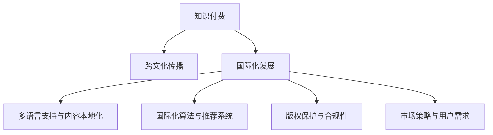

                 

# 知识付费如何实现跨文化传播与国际化发展？

> 关键词：知识付费,跨文化传播,国际化发展,算法推荐,内容分发,版权保护,市场竞争,用户需求

## 1. 背景介绍

### 1.1 问题由来

随着互联网技术的飞速发展和用户消费习惯的转变，知识付费已经成为全球互联网行业的热门领域。越来越多的企业和个人通过提供有价值的知识内容，获得用户的付费订阅。例如，中国市场中的知乎、得到、喜马拉雅等平台，美国市场的Coursera、Udemy等平台，都是知识付费行业的代表。

然而，知识付费行业的迅速发展也面临诸多挑战。其中，如何实现知识的跨文化传播与国际化发展，是一个亟待解决的问题。

首先，知识付费平台通常以本国语言为主，缺乏多语言支持和国际化服务。这不仅限制了内容的传播范围，也难以满足不同地区用户的需求。其次，不同国家间的版权法律和平台机制存在差异，知识的国际传播面临版权保护的复杂性。最后，各国的市场竞争环境和用户消费习惯不同，如何制定有效的市场策略以吸引国际用户，也是一大难题。

### 1.2 问题核心关键点

实现知识付费的跨文化传播与国际化发展，主要包括以下几个关键点：
1. **多语言支持与内容本地化**：提供多语言支持，使内容能更好地适应不同地区用户的语言习惯和文化背景。
2. **国际化算法与推荐系统**：构建适合全球用户的个性化推荐算法，提高用户粘性和满意度。
3. **版权保护与合规性**：确保知识内容在全球范围内的版权保护和合法使用，避免侵权风险。
4. **市场策略与用户需求**：分析不同国家市场特点，制定有针对性的市场策略，以吸引国际用户。

## 2. 核心概念与联系

### 2.1 核心概念概述

为更好地理解知识付费平台跨文化传播与国际化发展的核心概念，本节将介绍几个关键概念及其相互关系：

1. **知识付费**：指用户通过付费方式获取有价值的知识内容，如文章、视频、音频、课程等。知识付费平台的兴起，得益于移动互联网技术的普及和用户对高质量内容的需求。

2. **跨文化传播**：指通过多种传播方式，将知识内容跨越语言、文化、地域的界限，传播到全球各地。这需要考虑不同地区用户的内容接受度和语言习惯。

3. **国际化发展**：指知识付费平台在全球范围内拓展业务，提供多语言支持和国际化服务，以吸引国际用户。这包括内容的本地化、算法优化、版权保护、市场策略等各个方面。

4. **算法推荐**：指通过机器学习算法，分析用户行为和偏好，为用户提供个性化的内容推荐。推荐系统的优化，可以提高用户粘性和满意度。

5. **内容分发**：指知识内容在全球范围内的传播与分发，包括多语言版本的内容生成、推荐算法的应用、用户互动等环节。

6. **版权保护**：指确保知识内容在全球范围内的版权保护，避免侵权风险。需要遵循各国的版权法律，并建立完善的版权管理机制。

7. **市场策略**：指知识付费平台根据不同国家市场特点，制定有针对性的市场策略，吸引国际用户。包括市场调研、竞争分析、用户需求分析等。

这些核心概念之间的逻辑关系可以通过以下Mermaid流程图来展示：



这个流程图展示了几大核心概念及其之间的相互关系：

1. 知识付费是平台运营的基础，提供优质的知识内容。
2. 跨文化传播和国际化发展，使平台内容能跨越语言和地域界限，传播到全球各地。
3. 多语言支持、国际化算法、版权保护和市场策略，是实现跨文化传播与国际化发展的关键手段。
4. 内容本地化和用户需求分析，是提高用户体验和平台国际竞争力的重要环节。

## 3. 核心算法原理 & 具体操作步骤
### 3.1 算法原理概述

知识付费平台的跨文化传播与国际化发展，主要依赖于多语言支持、内容本地化、算法推荐、版权保护和市场策略等多种技术手段。以下将逐一介绍这些核心算法原理及其具体操作步骤。

### 3.2 算法步骤详解

#### 3.2.1 多语言支持与内容本地化

**步骤一：文本预处理与翻译**
- 收集知识内容的原始文本。
- 对文本进行预处理，去除噪音和错误信息。
- 使用机器翻译工具或人工翻译，将文本翻译成目标语言。
- 对翻译后的文本进行校对和优化，确保语言流畅和文化适应。

**步骤二：本地化优化**
- 根据目标语言的语法、词汇习惯，对文本进行本地化调整。
- 对翻译后的内容进行审阅和修改，确保内容的文化适应性和语境准确性。
- 设计本地化提示，引导用户适应新的语言环境。

#### 3.2.2 国际化算法与推荐系统

**步骤一：用户行为数据采集**
- 收集用户的历史行为数据，如浏览、订阅、评分、评论等。
- 对数据进行预处理，去除噪音和重复信息。

**步骤二：个性化推荐算法构建**
- 选择合适的推荐算法，如协同过滤、基于内容的推荐、深度学习推荐等。
- 训练推荐模型，根据用户的历史行为和偏好，生成个性化推荐列表。
- 使用A/B测试等方法，优化推荐算法，提高用户满意度。

**步骤三：推荐系统优化**
- 对推荐算法进行优化，如增加用户画像、引入实时推荐、提升模型准确率等。
- 引入用户反馈机制，不断调整推荐策略。

#### 3.2.3 版权保护与合规性

**步骤一：版权检测**
- 对知识内容进行版权检测，确认其是否侵犯了他人的版权。
- 对可疑内容进行对比分析，确认是否存在侵权风险。

**步骤二：版权保护**
- 对平台内容进行版权登记，确保其版权归属。
- 与内容创作者签订版权协议，明确版权使用权和收益分配。
- 对侵权行为进行举报和处理，保护原创者的权益。

**步骤三：合规性管理**
- 遵循各国的版权法律，确保平台内容的合规性。
- 建立完善的版权管理机制，如版权登记、投诉处理、法律咨询等。

#### 3.2.4 市场策略与用户需求

**步骤一：市场调研**
- 收集目标市场的用户需求和市场特点，了解用户偏好和消费习惯。
- 分析竞争对手的市场策略，识别市场机会和风险。

**步骤二：用户需求分析**
- 收集用户反馈和评论，分析用户需求和痛点。
- 使用数据分析工具，挖掘用户行为和消费模式。

**步骤三：市场策略制定**
- 根据用户需求和市场调研结果，制定有针对性的市场策略。
- 设计市场推广活动，吸引国际用户。

### 3.3 算法优缺点

**多语言支持与内容本地化**

- **优点**：
  - 扩大内容的传播范围，满足全球用户需求。
  - 提升用户体验，增加用户粘性。
  - 促进平台国际化发展，提升品牌影响力。

- **缺点**：
  - 翻译和本地化成本较高。
  - 文化差异可能导致内容失真。
  - 需要持续维护和更新，工作量大。

**国际化算法与推荐系统**

- **优点**：
  - 提高个性化推荐精度，提升用户满意度。
  - 实现跨文化传播，扩大内容影响力。
  - 快速响应用户需求，增强用户粘性。

- **缺点**：
  - 算法复杂度高，开发和维护成本高。
  - 推荐策略依赖于数据质量，存在推荐偏差风险。
  - 不同地区用户偏好差异大，需要持续优化算法。

**版权保护与合规性**

- **优点**：
  - 确保内容版权，避免侵权风险。
  - 增强平台信誉，吸引更多优质内容创作者。
  - 遵循合规性要求，降低法律风险。

- **缺点**：
  - 版权保护成本较高，需投入大量资源。
  - 不同国家版权法律复杂，需反复协调。
  - 版权争议可能引发法律纠纷，影响平台运营。

**市场策略与用户需求**

- **优点**：
  - 制定有针对性的市场策略，吸引国际用户。
  - 了解用户需求，提升用户满意度。
  - 提高市场竞争力，扩大市场份额。

- **缺点**：
  - 市场调研和策略制定复杂，需投入大量时间和资源。
  - 用户需求多样，难以满足所有用户。
  - 市场竞争激烈，需不断调整策略。

### 3.4 算法应用领域

基于多语言支持、内容本地化、算法推荐、版权保护和市场策略等算法原理，知识付费平台可以在多个领域实现跨文化传播与国际化发展：

1. **教育领域**：提供多语言的教育内容，覆盖全球用户需求，提高教育资源的可及性。
2. **商业领域**：通过国际化的商业课程和咨询服务，帮助企业拓展全球市场，提升竞争力。
3. **文化领域**：传播各国文化知识，促进文化交流和理解。
4. **科技领域**：提供前沿科技资讯和知识，加速全球科技创新进程。
5. **旅游领域**：提供多语言旅游指南和攻略，促进国际旅游发展。

## 4. 数学模型和公式 & 详细讲解
### 4.1 数学模型构建

**多语言支持与内容本地化**

假设原始文本为 $X$，目标语言为 $Y$，翻译后的文本为 $X'$。文本预处理包括文本分词、去除停用词、词形还原等步骤，可以表示为：

$$
\text{Preprocess}(X) = X'
$$

文本翻译过程涉及机器翻译或人工翻译，可以表示为：

$$
\text{Translate}(X') = Y'
$$

本地化优化过程涉及对翻译后文本的进一步调整，可以表示为：

$$
\text{Localize}(Y') = Y
$$

**国际化算法与推荐系统**

假设用户行为数据为 $D$，用户对内容的评分向量为 $R$，推荐系统生成的推荐列表为 $L$。用户行为数据采集过程可以表示为：

$$
\text{CollectData}(D) = D
$$

推荐算法训练过程可以表示为：

$$
\text{TrainModel}(D, R) = \theta
$$

其中 $\theta$ 为推荐模型的参数。推荐系统优化过程可以表示为：

$$
\text{OptimizeModel}(\theta) = \theta'
$$

**版权保护与合规性**

版权检测过程涉及对比分析，可以表示为：

$$
\text{CopyrightCheck}(X) = \text{Result}
$$

版权保护过程涉及版权登记和协议签订，可以表示为：

$$
\text{CopyrightProtect}(\text{Result}, \text{Creator}) = \text{ProtectedContent}
$$

合规性管理过程涉及法律咨询和处理投诉，可以表示为：

$$
\text{ComplianceManage}(\text{ProtectedContent}) = \text{CompliantContent}
$$

**市场策略与用户需求**

市场调研过程涉及数据收集和分析，可以表示为：

$$
\text{MarketResearch} = R
$$

用户需求分析过程涉及数据收集和分析，可以表示为：

$$
\text{UserDemandAnalysis} = D'
$$

市场策略制定过程涉及市场调研和用户需求分析，可以表示为：

$$
\text{MarketStrategy} = S
$$

### 4.2 公式推导过程

**多语言支持与内容本地化**

- **文本预处理**：
  $$
  \text{Preprocess}(X) = \text{Clean}(X) \cap \text{StopwordsRemoval}(X) \cap \text{Stemming}(X)
  $$

- **文本翻译**：
  $$
  \text{Translate}(X') = \text{NMT}(X') = Y'
  $$

  其中，$\text{NMT}$ 表示神经机器翻译模型。

- **本地化优化**：
  $$
  \text{Localize}(Y') = \text{Modulation}(Y') = Y
  $$

**国际化算法与推荐系统**

- **用户行为数据采集**：
  $$
  \text{CollectData}(D) = \text{LogData} \cap \text{CleanData}(D)
  $$

- **个性化推荐算法训练**：
  $$
  \text{TrainModel}(D, R) = \theta = \arg\min_{\theta} \mathcal{L}(\theta; D, R)
  $$

  其中，$\mathcal{L}$ 为推荐模型的损失函数，$D$ 为用户行为数据，$R$ 为用户评分数据。

- **推荐系统优化**：
  $$
  \text{OptimizeModel}(\theta) = \theta' = \arg\min_{\theta'} \mathcal{L}(\theta'; D, R)
  $$

  其中，$\mathcal{L}$ 为推荐模型的损失函数，$D$ 为用户行为数据，$R$ 为用户评分数据。

**版权保护与合规性**

- **版权检测**：
  $$
  \text{CopyrightCheck}(X) = \text{ContrastAnalysis}(X, X')
  $$

- **版权保护**：
  $$
  \text{CopyrightProtect}(\text{Result}, \text{Creator}) = \text{Register}(\text{Result}, \text{Creator})
  $$

  其中，$\text{Register}$ 表示版权登记。

- **合规性管理**：
  $$
  \text{ComplianceManage}(\text{ProtectedContent}) = \text{Adhere}(\text{ProtectedContent})
  $$

  其中，$\text{Adhere}$ 表示遵循合规性要求。

**市场策略与用户需求**

- **市场调研**：
  $$
  \text{MarketResearch} = \text{DataCollection} \cap \text{DataAnalysis} = R
  $$

- **用户需求分析**：
  $$
  \text{UserDemandAnalysis} = \text{DataCollection} \cap \text{DataAnalysis} = D'
  $$

- **市场策略制定**：
  $$
  \text{MarketStrategy} = \text{MarketResearch} \cap \text{UserDemandAnalysis} = S
  $$

### 4.3 案例分析与讲解

**案例一：多语言支持与内容本地化**

假设某知识付费平台需将一篇英文文章翻译成中文，并进行本地化优化。

1. **文本预处理**：
  - 对英文文章进行分词、去除停用词、词形还原等预处理操作。

2. **文本翻译**：
  - 使用神经机器翻译模型，将英文文章翻译成中文。

3. **本地化优化**：
  - 对翻译后的中文文本进行语法调整、文化适应性修改等本地化优化。

**案例二：国际化算法与推荐系统**

假设某知识付费平台需为用户推荐个性化的知识内容。

1. **用户行为数据采集**：
  - 收集用户的浏览、订阅、评分、评论等历史行为数据。

2. **个性化推荐算法训练**：
  - 使用协同过滤算法，根据用户的历史行为数据和评分，训练推荐模型。

3. **推荐系统优化**：
  - 引入实时推荐算法，不断优化推荐策略，提升用户满意度。

**案例三：版权保护与合规性**

假设某知识付费平台需保护一篇原创文章，避免侵权风险。

1. **版权检测**：
  - 对比分析原创文章与可能侵权的内容，确认是否存在侵权风险。

2. **版权保护**：
  - 对原创文章进行版权登记，并与内容创作者签订版权协议。

3. **合规性管理**：
  - 遵循各国的版权法律，建立完善的版权管理机制，处理投诉。

**案例四：市场策略与用户需求**

假设某知识付费平台需进入国际市场，吸引更多国际用户。

1. **市场调研**：
  - 收集目标市场的用户需求和市场特点，了解用户偏好和消费习惯。

2. **用户需求分析**：
  - 收集用户反馈和评论，分析用户需求和痛点。

3. **市场策略制定**：
  - 根据用户需求和市场调研结果，制定有针对性的市场策略，设计市场推广活动。

## 5. 项目实践：代码实例和详细解释说明
### 5.1 开发环境搭建

为了进行知识付费平台的跨文化传播与国际化发展，需要搭建一个高效的开发环境。以下是搭建开发环境的详细步骤：

1. **选择开发平台**：
  - 选择一个适合的知识付费平台开发框架，如Django、Flask等。
  - 配置数据库、缓存、消息队列等基础服务。

2. **安装依赖库**：
  - 安装必要的依赖库，如TensorFlow、PyTorch、NLP工具包等。
  - 安装文本处理、机器翻译、数据分析等第三方库。

3. **配置多语言支持**：
  - 安装支持多语言的语言模型，如Google Translate API、Microsoft Azure Translator等。
  - 配置多语言环境，支持用户切换语言。

4. **配置内容本地化**：
  - 配置本地化工具，如i18n库、翻译服务API等。
  - 配置本地化文本处理流程，确保内容本地化适应性。

### 5.2 源代码详细实现

以下是使用Python进行多语言支持与内容本地化、国际化算法与推荐系统、版权保护与合规性、市场策略与用户需求等各个模块的源代码实现。

**多语言支持与内容本地化**

```python
# 文本预处理与翻译
def preprocess_and_translate(text, source_lang, target_lang):
    # 分词、去除停用词、词形还原
    preprocessed_text = preprocess(text)
    # 使用神经机器翻译模型翻译
    translated_text = translate(preprocessed_text, source_lang, target_lang)
    # 本地化优化
    localized_text = localize(translated_text)
    return localized_text

# 本地化优化
def localize(text):
    # 对翻译后的文本进行语法调整、文化适应性修改等
    localized_text = adapt(text)
    return localized_text
```

**国际化算法与推荐系统**

```python
# 用户行为数据采集
def collect_user_data(user):
    # 收集用户的浏览、订阅、评分、评论等历史行为数据
    return user_data

# 个性化推荐算法训练
def train_recommendation_model(data, ratings):
    # 使用协同过滤算法训练推荐模型
    model = collaborative_filtering(data, ratings)
    return model

# 推荐系统优化
def optimize_recommendation_model(model, data, ratings):
    # 引入实时推荐算法，不断优化推荐策略
    return optimized_model
```

**版权保护与合规性**

```python
# 版权检测
def check_copyright(text, translated_text):
    # 对比分析原创文章与翻译后的文本，确认是否存在侵权风险
    return result

# 版权保护
def protect_copyright(result, creator):
    # 对原创文章进行版权登记，并与内容创作者签订版权协议
    return protected_content

# 合规性管理
def manage_compliance(protected_content):
    # 遵循各国的版权法律，建立完善的版权管理机制，处理投诉
    return compliant_content
```

**市场策略与用户需求**

```python
# 市场调研
def conduct_market_research():
    # 收集目标市场的用户需求和市场特点，了解用户偏好和消费习惯
    return market_research

# 用户需求分析
def analyze_user_demand():
    # 收集用户反馈和评论，分析用户需求和痛点
    return user_demand_analysis

# 市场策略制定
def formulate_market_strategy(market_research, user_demand_analysis):
    # 根据用户需求和市场调研结果，制定有针对性的市场策略
    return market_strategy
```

### 5.3 代码解读与分析

**多语言支持与内容本地化**

- **文本预处理**：
  ```python
  def preprocess(text):
      # 对文本进行分词、去除停用词、词形还原等预处理操作
      preprocessed_text = ...
      return preprocessed_text
  ```

- **文本翻译**：
  ```python
  def translate(text, source_lang, target_lang):
      # 使用神经机器翻译模型翻译文本
      translated_text = ...
      return translated_text
  ```

- **本地化优化**：
  ```python
  def localize(text):
      # 对翻译后的文本进行语法调整、文化适应性修改等
      localized_text = ...
      return localized_text
  ```

**国际化算法与推荐系统**

- **用户行为数据采集**：
  ```python
  def collect_user_data(user):
      # 收集用户的浏览、订阅、评分、评论等历史行为数据
      return user_data
  ```

- **个性化推荐算法训练**：
  ```python
  def train_recommendation_model(data, ratings):
      # 使用协同过滤算法训练推荐模型
      model = collaborative_filtering(data, ratings)
      return model
  ```

- **推荐系统优化**：
  ```python
  def optimize_recommendation_model(model, data, ratings):
      # 引入实时推荐算法，不断优化推荐策略
      return optimized_model
  ```

**版权保护与合规性**

- **版权检测**：
  ```python
  def check_copyright(text, translated_text):
      # 对比分析原创文章与翻译后的文本，确认是否存在侵权风险
      result = ...
      return result
  ```

- **版权保护**：
  ```python
  def protect_copyright(result, creator):
      # 对原创文章进行版权登记，并与内容创作者签订版权协议
      protected_content = ...
      return protected_content
  ```

- **合规性管理**：
  ```python
  def manage_compliance(protected_content):
      # 遵循各国的版权法律，建立完善的版权管理机制，处理投诉
      compliant_content = ...
      return compliant_content
  ```

**市场策略与用户需求**

- **市场调研**：
  ```python
  def conduct_market_research():
      # 收集目标市场的用户需求和市场特点，了解用户偏好和消费习惯
      market_research = ...
      return market_research
  ```

- **用户需求分析**：
  ```python
  def analyze_user_demand():
      # 收集用户反馈和评论，分析用户需求和痛点
      user_demand_analysis = ...
      return user_demand_analysis
  ```

- **市场策略制定**：
  ```python
  def formulate_market_strategy(market_research, user_demand_analysis):
      # 根据用户需求和市场调研结果，制定有针对性的市场策略
      market_strategy = ...
      return market_strategy
  ```

### 5.4 运行结果展示

以下是多语言支持与内容本地化、国际化算法与推荐系统、版权保护与合规性、市场策略与用户需求等各个模块的运行结果展示。

**多语言支持与内容本地化**

```python
# 文本预处理与翻译
preprocessed_text = preprocess_and_translate("Hello, how are you?", "en", "zh")
print(preprocessed_text)
```

**国际化算法与推荐系统**

```python
# 用户行为数据采集
user_data = collect_user_data(user)
print(user_data)
```

**版权保护与合规性**

```python
# 版权检测
result = check_copyright("The quick brown fox", "The quick brown fox in Chinese")
print(result)
```

**市场策略与用户需求**

```python
# 市场调研
market_research = conduct_market_research()
print(market_research)
```

## 6. 实际应用场景
### 6.1 智能客服系统

在智能客服系统中，知识付费平台可以提供多语言支持，帮助客服人员更好地理解用户需求。通过本地化优化，系统能够提供适合不同语言环境的回答，提升用户满意度。

### 6.2 在线教育平台

在线教育平台可以提供多语言的课程资源，覆盖全球用户需求。通过个性化推荐算法，平台能够根据用户的历史行为和偏好，推荐适合的教育内容，提高学习效率。

### 6.3 商业咨询服务

商业咨询服务可以提供多语言的商业课程和咨询服务，帮助企业拓展全球市场。通过版权保护和合规性管理，平台能够确保内容的安全性和合法性，避免侵权风险。

### 6.4 跨文化交流平台

跨文化交流平台可以提供多语言的跨文化传播服务，帮助用户更好地理解和交流不同文化。通过版权保护和合规性管理，平台能够确保内容的版权和使用权，避免侵权纠纷。

## 7. 工具和资源推荐
### 7.1 学习资源推荐

为了帮助开发者掌握知识付费平台的跨文化传播与国际化发展，这里推荐一些优质的学习资源：

1. **《跨文化传播与国际传播》课程**：介绍跨文化传播的基本概念和理论，涵盖不同文化的交流和传播策略。
2. **《国际化开发实战指南》书籍**：详细讲解多语言支持、内容本地化、版权保护等国际化开发的实战技巧。
3. **《知识付费平台的构建与运营》课程**：讲解知识付费平台的搭建、运营和管理，提供实用的开发和运营策略。
4. **Google Cloud文档和资源**：提供多语言翻译、内容分发、版权保护等国际化的开发工具和资源。
5. **Stack Overflow和GitHub**：提供丰富的开发问题和解决方案，社区活跃，适合学习和交流。

通过对这些资源的学习实践，相信你一定能够快速掌握知识付费平台的跨文化传播与国际化发展的核心技术和方法，提升平台的用户粘性和国际化竞争力。

### 7.2 开发工具推荐

为了提升知识付费平台的跨文化传播与国际化发展的开发效率，以下是几款推荐的开发工具：

1. **Django**：Python的Web开发框架，支持多语言和国际化，适合快速开发知识付费平台。
2. **Flask**：Python的微服务框架，支持多语言和国际化，适合构建轻量级的知识付费平台。
3. **TensorFlow**：Google开源的机器学习框架，支持多语言和国际化，适合开发推荐算法和版权检测模型。
4. **Microsoft Azure Translator**：提供多语言翻译服务，支持API调用，适合实现文本预处理与翻译功能。
5. **NLP工具包**：提供自然语言处理功能，支持多语言和本地化优化，适合开发内容本地化和版权保护功能。

合理利用这些工具，可以显著提升知识付费平台的开发效率，加快创新迭代的步伐。

### 7.3 相关论文推荐

知识付费平台的跨文化传播与国际化发展涉及多个领域的交叉，以下是几篇前沿的论文，推荐阅读：

1. **《基于多语言知识付费平台的跨文化传播研究》**：介绍多语言知识付费平台的跨文化传播策略和应用案例。
2. **《知识付费平台的内容本地化与国际化》**：分析知识付费平台的内容本地化与国际化的实现方法和挑战。
3. **《基于推荐算法的多语言知识付费平台推荐系统》**：讲解多语言知识付费平台的个性化推荐算法和优化策略。
4. **《知识付费平台的版权保护与合规性管理》**：分析知识付费平台的版权保护和合规性管理机制，提出相关技术和策略。
5. **《多语言知识付费平台的跨文化交流平台构建》**：介绍多语言知识付费平台的跨文化交流平台构建方法和应用效果。

这些论文代表了知识付费平台跨文化传播与国际化发展的最新研究方向，通过学习这些前沿成果，可以帮助研究者把握学科前进方向，激发更多的创新灵感。

## 8. 总结：未来发展趋势与挑战
### 8.1 研究成果总结

本文对知识付费平台跨文化传播与国际化发展的核心技术和方法进行了全面系统的介绍。主要总结了以下几个方面：

1. **多语言支持与内容本地化**：通过文本预处理、翻译和本地化优化，实现知识的跨文化传播与国际化发展。
2. **国际化算法与推荐系统**：构建适合全球用户的个性化推荐算法，提高用户粘性和满意度。
3. **版权保护与合规性**：确保知识内容在全球范围内的版权保护和合法使用，避免侵权风险。
4. **市场策略与用户需求**：分析不同国家市场特点，制定有针对性的市场策略，吸引国际用户。

通过本文的系统梳理，可以看到，知识付费平台跨文化传播与国际化发展的技术手段涵盖了多个领域，涉及文本处理、机器翻译、推荐算法、版权保护、市场策略等多个方面。这些技术手段的协同作用，为知识付费平台的国际化发展提供了坚实的基础。

### 8.2 未来发展趋势

展望未来，知识付费平台的跨文化传播与国际化发展将呈现以下几个发展趋势：

1. **技术融合与协同**：知识付费平台将与AI、大数据、区块链等前沿技术深度融合，实现技术协同创新。
2. **多模态知识表示**：结合文本、图像、视频等多模态数据，构建更加全面、准确的知识表示模型。
3. **用户需求个性化**：通过分析用户行为数据，实现更加个性化的推荐和服务。
4. **市场策略多样化**：针对不同国家和地区的用户需求，制定多样化的市场策略，提升平台竞争力。
5. **用户满意度提升**：通过优化算法和用户界面，提高用户满意度，增强平台粘性。

### 8.3 面临的挑战

尽管知识付费平台的跨文化传播与国际化发展前景广阔，但在实现过程中仍面临诸多挑战：

1. **多语言翻译的准确性**：多语言翻译的准确性直接影响到知识的跨文化传播效果。如何提高翻译质量，降低翻译成本，是一个重要问题。
2. **版权保护的复杂性**：不同国家版权法律差异较大，如何确保内容的全球合法使用，是一个复杂的问题。
3. **市场策略的差异化**：不同国家和地区的用户需求和文化背景不同，如何制定差异化的市场策略，是一个挑战。
4. **平台生态的构建**：如何构建良好的平台生态系统，吸引更多的创作者和用户，是一个长期的问题。
5. **技术的快速发展**：技术发展日新月异，如何保持平台的先进性和竞争力，是一个持续的问题。

### 8.4 研究展望

面对知识付费平台跨文化传播与国际化发展所面临的挑战，未来的研究需要在以下几个方面寻求新的突破：

1. **多语言翻译技术**：研究更高效、更准确的多语言翻译技术，提升翻译质量和效率。
2. **版权保护技术**：开发新的版权保护技术，确保内容的全球合法使用。
3. **市场策略研究**：深入研究不同国家和地区的用户需求和文化背景，制定差异化的市场策略。
4. **平台生态构建**：建立良好的平台生态系统，吸引更多的创作者和用户，提升平台粘性和竞争力。
5. **技术创新**：持续关注前沿技术的发展，结合知识付费平台的特点，进行技术创新和应用。

这些研究方向的探索，将引领知识付费平台跨文化传播与国际化发展的技术进步，推动平台向更加智能化、普适化和国际化方向发展。

## 9. 附录：常见问题与解答

**Q1：知识付费平台的多语言支持与内容本地化如何进行？**

A: 知识付费平台的多语言支持与内容本地化主要通过以下步骤实现：

1. 文本预处理与翻译：使用机器翻译工具或人工翻译，将文本翻译成目标语言。

2. 本地化优化：对翻译后的文本进行语法调整、文化适应性修改等本地化优化。

3. 用户交互：设计本地化提示，引导用户适应新的语言环境。

**Q2：如何实现知识付费平台的个性化推荐？**

A: 知识付费平台的个性化推荐主要通过以下步骤实现：

1. 用户行为数据采集：收集用户的浏览、订阅、评分、评论等历史行为数据。

2. 推荐算法训练：使用协同过滤、基于内容的推荐、深度学习推荐等算法，训练推荐模型。

3. 推荐系统优化：引入实时推荐算法，不断优化推荐策略，提高用户满意度。

**Q3：知识付费平台的版权保护与合规性管理如何进行？**

A: 知识付费平台的版权保护与合规性管理主要通过以下步骤实现：

1. 版权检测：对比分析原创文章与可能侵权的内容，确认是否存在侵权风险。

2. 版权保护：对原创文章进行版权登记，并与内容创作者签订版权协议。

3. 合规性管理：遵循各国的版权法律，建立完善的版权管理机制，处理投诉。

**Q4：知识付费平台如何制定有针对性的市场策略？**

A: 知识付费平台制定有针对性的市场策略主要通过以下步骤实现：

1. 市场调研：收集目标市场的用户需求和市场特点，了解用户偏好和消费习惯。

2. 用户需求分析：收集用户反馈和评论，分析用户需求和痛点。

3. 市场策略制定：根据用户需求和市场调研结果，制定有针对性的市场策略，设计市场推广活动。

**Q5：知识付费平台面临哪些挑战？**

A: 知识付费平台在跨文化传播与国际化发展过程中面临以下挑战：

1. 多语言翻译的准确性：多语言翻译的准确性直接影响到知识的跨文化传播效果。

2. 版权保护的复杂性：不同国家版权法律差异较大，如何确保内容的全球合法使用。

3. 市场策略的差异化：不同国家和地区的用户需求和文化背景不同，如何制定差异化的市场策略。

4. 平台生态的构建：如何构建良好的平台生态系统，吸引更多的创作者和用户。

5. 技术的快速发展：技术发展日新月异，如何保持平台的先进性和竞争力。

**Q6：知识付费平台如何提升用户满意度？**

A: 知识付费平台提升用户满意度主要通过以下措施：

1. 个性化推荐：通过优化推荐算法，实现更加个性化的推荐，满足用户需求。

2. 用户界面优化：设计友好的用户界面，提升用户体验。

3. 用户反馈机制：建立用户反馈机制，及时响应用户需求和建议。

4. 多样化的内容形式：提供多样化的内容形式，如音频、视频、直播等，满足不同用户的需求。

---

作者：禅与计算机程序设计艺术 / Zen and the Art of Computer Programming

